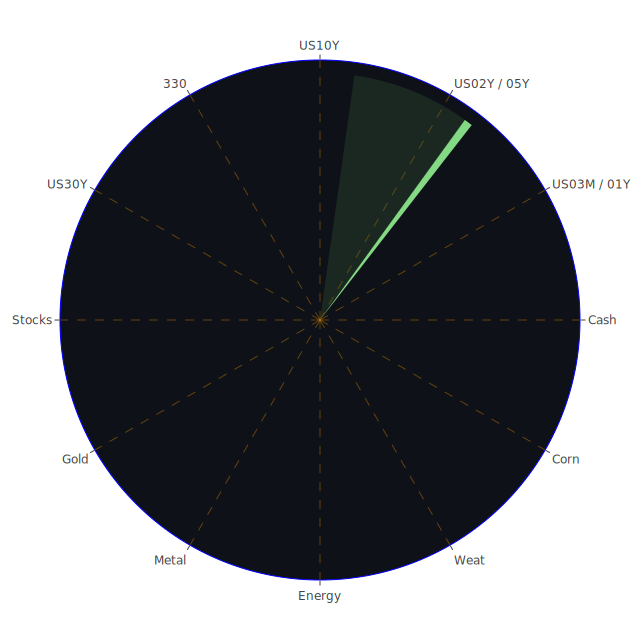

# **投資商品泡沫分析**

當前全球金融市場呈現複雜多變的格局，多空因素交織，各類資產的泡沫風險也呈現分化。以下將針對各主要投資類別，結合近期數據與觀察視角，進行專業論述。

* **美國國債**

美國國債市場近期波動顯著，殖利率曲線各期別普遍上揚。以2025年5月20日的數據觀察，美國10年期國債殖利率（US10Y）來到4.45%，高於一週前的4.38%及一個月前的4.20%。短期如3個月期國債（US03MY）殖利率亦在4.35%的相對高位。泡沫指數方面，US10Y的D1為0.371172，US03MY的D1為0.191359，整體處於中低水平，顯示短期內直接的泡沫破裂風險不高，但殖利率的快速攀升反映市場對未來通膨預期及聯準會政策路徑的擔憂。

從經濟學角度看，聯準會（FED）的鷹派言論（過去一個多月有1次鷹派發言，0次鴿派）以及持續縮減的總資產規模（FED Total Assets is at relatively low level），對債券價格構成壓力。同時，公共債務佔GDP比率（Debt held by the public (% of GDP) is at relatively high level）居高不下，以及穆迪可能下調美國信用評級的新聞（market impact: negative, 96%, Stock market today: Dow, S\&P 500, Nasdaq futures slide after Moody's downgrades US credit rating; market impact: negative, 91%, US Loses Last Top Credit Rating With Downgrade From Moody’s），均從基本面和市場心理層面對國債市場構成負面影響。社會學層面，政府財政紀律的缺失可能引發公眾對長期償債能力的疑慮。博弈論觀點下，市場參與者正在與聯準會的政策預期進行博弈，任何超預期的通膨數據或政策轉向都可能引發市場劇烈波動。

歷史上，1970年代末至1980年代初，為對抗高通膨，聯準會大幅升息導致債券價格暴跌，可為前車之鑑。當前情境雖不盡相同，但通膨黏性及高利率環境的持續性值得警惕。FED經濟數據中，逆回購協議（RRP）規模下降，而貨幣市場基金總資產（Money Market Funds Total Assets）上升，顯示部分資金從銀行體系流向收益率更高的貨幣市場工具，這也間接反映了市場對利率環境的預期。

* **美國零售股**

美國零售股整體面臨挑戰。以沃爾瑪（WMT）為例，其PP100價格為98.12美元，D1泡沫指數高達0.896895，D7、D14、D30均維持在0.85以上的高位，顯示泡沫風險顯著。塔吉特（TGT）情況類似，PP100價格97.99美元，D1泡沫指數0.956980，亦處於高風險區間。家得寶（HD）PP100價格379.38美元，D1泡沫指數0.828021，同樣偏高。好市多（COST）PP100價格1034.34美元，D1泡沫指數0.666235，相對前三者略低，但仍不可忽視。

經濟學上，關稅問題是主要困擾（market impact: negative, 96%, Grim Economic Outlook Overtakes Solid Earnings as Tariff Disruptions Surface; market impact: negative, 73%, Walmart should 'eat the tariffs,' Trump says, after retailer warns of looming price hikes）。川普要求沃爾瑪「吞下關稅」的言論，以及零售商警告價格上漲，均指向成本壓力與消費者購買力可能受損。消費者拖欠率（Consumer Delinquent is at relatively high level）和信用卡壞帳率（Charge-off Rate on Credit Card is at relatively high level）的上升，也佐證了消費者財務狀況的壓力。

社會心理學角度，消費者信心受經濟前景不明朗影響，可能減少非必需品支出。博弈論觀點，零售商在成本轉嫁與維持市場份額之間面臨兩難。歷史上，經濟衰退前期，零售股往往表現不佳。新聞中「Poundland數百家門市將關閉」（market impact: negative, 94%）是零售業困境的縮影。

* **美國科技股**

科技股內部呈現高度分化。以輝達（NVDA）為代表的AI概念股持續火熱，PP100價格135.57美元，D1泡沫指數高達0.928353，但其D7（0.809180）、D14（0.742346）、D30（0.637208）則呈現遞減趨勢，顯示短期極高熱度後，市場可能開始重新評估。台積電（TSM）亦類似，PP100價格193.50美元，D1泡沫指數0.989506，月平均泡沫指數也高達0.980476，顯示持續高風險。其他大型科技股如微軟（MSFT），PP100價格458.87美元，D1泡沫指數0.827191；蘋果（AAPL），PP100價格208.78美元，D1泡沫指數0.722262；谷歌（GOOG），PP100價格167.87美元，D1泡沫指數0.501957；亞馬遜（AMZN），PP100價格206.16美元，D1泡沫指數0.404197。這些數據表明，市場對AI的狂熱推升了部分晶片與雲端服務相關股票的泡沫，而傳統大型科技股的泡沫程度相對溫和但仍在高位。

經濟學上，高利率環境對成長型科技股的估值構成壓力。然而，AI技術的突破性進展（新聞：Nvidia-backed CoreWeave soars 100% since IPO）帶來了新的成長敘事，部分抵銷了利率壓力。社會心理學層面，FOMO（害怕錯過）情緒在AI相關投資中非常明顯。博弈論角度，投資者在賭AI技術的長期變革潛力，而忽略短期估值過高的風險。歷史上，2000年的科網泡沫即是前例，當時市場對網路的熱情也曾推動估值至不合理水平。新聞事件中，MIT對AI生產力效益的論文提出異議（market impact: negative, 88%），以及美國議員對蘋果與阿里巴巴合作的擔憂（market impact: negative, 94%），顯示了對AI發展路徑和科技巨頭合作的潛在風險。

* **美國房地產指數**

美國房地產指數如VNQ（PP100價格90.32美元，D1泡沫指數0.579339）和IYR（PP100價格95.60美元，D1泡沫指數0.964033）顯示出不同的泡沫程度，IYR的月平均泡沫指數D30為0.790766，整體處於中高至高風險水平。RWO（PP100價格44.48美元，D1泡沫指數0.690901）也處於中高風險。

經濟學上，30年期固定抵押貸款利率（Fixed Morgage 30Y Rate）高達6.81%，遠高於去年的2.95%，對購房需求構成嚴重壓抑。儘管新聞提及「租金自2022年以來下降近5%，但可能很快反彈」（market impact: negative, 95%），以及「較低的利率對購房者是鼓舞人心的」（positive, 93%），但FED數據中商業房地產拖欠率（Commercial Real Estate Delinquent is at relatively high level）和房地產拖欠率（Real Estate Delinquent is at relatively high level）均處於高位，顯示房地產市場的壓力依然巨大。

社會心理學角度，高昂的購房成本和對經濟前景的擔憂使潛在購房者持觀望態度。博弈論中，開發商和賣家在降價促銷與維持資產價值之間進行權衡。歷史上，2008年次貸危機的起點便是房地產市場的崩盤。當前高利率和高拖欠率的組合，不禁令人回想起當年的陰影。

* **加密貨幣**

加密貨幣市場波動性依然顯著。比特幣（BTCUSD）PP100價格約105716美元，D1泡沫指數為0.485759，月平均D30為0.484686，處於中等風險水平。以太坊（ETHUSD）PP100價格約2533.82美元，D1泡沫指數0.378488，月平均D30為0.489121，亦為中等風險。狗狗幣（DOGEUSD）PP100價格0.2251美元，D1泡沫指數0.461370，月平均D30為0.481274。

經濟學角度，加密貨幣作為一種高風險資產，對市場流動性和投資者情緒高度敏感。聯準會的鷹派立場和全球金融市場的避險情緒可能對其構成壓力。然而，部分投資者將其視為對抗通膨或法定貨幣體系不確定性的工具。社會心理學上，加密貨幣社群的信念和影響力人物的言論（如Sam Altman對川普與海灣國家AI交易的評論，間接影響科技與風險資產情緒）對價格有顯著影響。博弈論觀點，監管政策的不確定性是加密貨幣市場最大的外部風險之一，各國政府的態度將極大影響其未來發展。

歷史上，加密貨幣經歷過多次暴漲暴跌，其內在價值和長期前景仍存較大爭議。新聞中關於Grok對敏感歷史事件的「編程錯誤」言論（market impact: negative, 88%），雖然並非直接關聯加密貨幣，但反映了AI與新興科技領域可能出現的信任危機，這類情緒可能間接波及同為新興科技產物的加密貨幣。

* **金/銀/銅**

貴金屬和工業金屬表現各異。黃金（XAUUSD）PP100價格約3222.80美元，D1泡沫指數0.461161，但值得注意的是其D7高達0.887761，D30為0.538074，顯示近期波動加劇，整體處於中高風險。白銀（XAGUSD）PP100價格32.35美元，D1泡沫指數高達0.947031，D7、D14、D30均在0.88以上，泡沫風險顯著。銅（COPPER）PP100價格4.66美元，D1泡沫指數0.510445，月平均D30為0.589804，處於中等偏高風險。

經濟學上，黃金通常被視為避險資產和通膨對沖工具。當前地緣政治緊張（以色列襲擊加薩醫院，俄烏衝突持續）和對經濟衰退的擔憂為黃金提供了支撐。然而，美元走強和實際利率上升會增加持有黃金的機會成本。白銀兼具貴金屬和工業屬性，其工業需求（尤其在新能源領域）為其價格提供支撐，但高泡沫指數也反映了投機情緒的升溫。銅價受全球工業生產和經濟復甦預期的影響，近期價格上漲可能與供應擔憂及能源轉型需求有關。黃金/石油比率（GOLD OIL RATIO）為51.84，高於去年同期的30.49，顯示黃金相對石油強勢。黃金/銅比率（GOLD COPPER RATIO）為691.15，低於近期高點，顯示銅價表現相對強勁。

社會心理學層面，市場恐慌情緒上升時，黃金的吸引力增加。博弈論觀點，各國央行的黃金儲備策略和大型基金的倉位調整對金價有重要影響。歷史上，金價在經濟危機和地緣政治衝突時期往往表現良好。

* **黃豆 / 小麥 / 玉米**

農產品方面，黃豆（SOYB）PP100價格21.80美元，D1泡沫指數0.406030，D30為0.647374，整體風險可控但月度有所積累。小麥（WEAT）PP100價格4.50美元，D1泡沫指數0.335238，D30為0.413792，風險較低。玉米（CORN）PP100價格18.19美元，D1泡沫指數0.412185，D30為0.456761，風險亦不高。

經濟學上，農產品價格受天氣、地緣政治（如影響黑海糧食出口）、能源價格（影響化肥和運輸成本）以及全球供需關係的影響。美元強勢通常會對以美元計價的農產品價格構成壓力。社會心理學角度，對糧食安全的擔憂可能在特定時期推高價格。博弈論觀點，主要糧食出口國的貿易政策和大型農業企業的套期保值行為對市場有顯著影響。歷史上，極端天氣事件（如乾旱、洪水）和主要出口地區的衝突曾導致農產品價格大幅上漲。

* **石油/ 鈾期貨UX\!**

能源市場方面，美國原油（USOIL）PP100價格62.20美元，D1泡沫指數0.602021，但其D30僅為0.246864，顯示近期風險有所上升，但長期泡沫積累不高。鈾期貨（UX1\!）PP100價格71.25美元，D1泡沫指數0.510716，D30為0.491135，處於中等風險水平。

經濟學上，石油價格受OPEC+產量政策、全球經濟增長前景（影響需求）、地緣政治風險（影響供應）以及美元匯率等多重因素影響。新聞中「黯淡的經濟前景蓋過穩健的財報，關稅干擾浮現」（negative, 96%）可能預示著需求端的疲軟。鈾的價格則主要與核電發展前景和供應狀況相關，隨著全球對清潔能源和能源獨立性的重視，核電的地位有所回升，利好鈾價。

社會心理學層面，對能源短缺的恐懼或對經濟衰退導致需求下降的預期，都會影響市場情緒。博弈論觀點，OPEC+與美國等主要消費國之間的產量博弈，以及西方國家與俄羅斯等能源出口國之間的地緣政治博弈，深刻影響能源價格。歷史上，石油危機曾多次對全球經濟造成巨大衝擊。

* **各國外匯市場**

外匯市場波動加劇。美元指數（未直接提供，但可從USDJPY、EURUSD等推斷）相對強勢。美元兌日圓（USDJPY）PP100價格145.08，D1泡沫指數高達0.979282，月平均D30為0.695801，顯示日圓貶值壓力巨大，泡沫風險集中在日圓的弱勢上。歐元兌美元（EURUSD）PP100價格1.1200，D1泡沫指數0.722326，月平均D30高達0.926969，顯示歐元相對美元的強勢（或美元階段性調整）也積累了較高泡沫。澳幣兌美元（AUDUSD）PP100價格0.6500，D1泡沫指數0.073189，風險較低。英鎊兌美元（GBPUSD）PP100價格1.3400，D1泡沫指數0.536811，處於中等風險。

經濟學上，各國利率差異、經濟增長前景、通膨水平以及央行政策是影響匯率的主要因素。美國聯準會的鷹派立場和相對強勁的經濟數據（儘管面臨風險）支撐美元。日本央行維持超寬鬆政策導致日圓持續承壓。歐洲央行在抗通膨與保增長之間搖擺，影響歐元走勢。新聞中「美元在美國信用評級下調後小幅走低」（negative, 86%），顯示市場對美國財政狀況的擔憂可能短期內壓低美元，但長期趨勢仍需觀察。

社會心理學角度，市場對主要經濟體前景的信心差異會影響資本流向和匯率。博弈論觀點，各國央行之間的政策協調或競爭，以及大型投機資金的流動，對匯市有重要影響。歷史上，廣場協議等重大國際協調曾劇烈改變主要貨幣匯率。

* **各國大盤指數**

各國股市表現不一，但普遍泡沫指數偏高。美國那斯達克100指數（NDX）PP100價格21447.05，D1泡沫指數0.714562，月平均D30為0.756869。日經225指數（JPN225）PP100價格37785.73，D1泡沫指數0.695381，月平均D30為0.756397。德國DAX指數（GDAXI）PP100價格24072.00，D1泡沫指數0.769038。英國富時100指數（FTSE）PP100價格8745.20，D1泡沫指數0.509822。法國CAC40指數（FCHI）PP100價格7926.70，D1泡沫指數0.713345。台灣加權股價指數（0050為ETF代表）PP100價格180.45，D1泡沫指數0.688235。中國滬深300指數（000300）PP100價格3877.15，D1泡沫指數0.806865。

經濟學上，全球主要央行緊縮政策、通膨壓力、地緣政治風險以及經濟增長放緩預期均對股市構成壓力。新聞中「黯淡的經濟前景蓋過穩健的財報」（negative, 96%）和「華爾街警告不要追逐股市反彈」（negative, 83%）均反映了市場的謹慎情緒。然而，特定產業（如AI）的樂觀預期和部分地區的經濟刺激政策可能提供短期支撐。

社會心理學角度，投資者情緒在貪婪與恐懼之間擺盪。博弈論觀點，大型機構投資者的資金流向和散戶的集體行為共同影響市場走勢。歷史上，全球性經濟危機（如2008年）往往導致各國股市同時大幅下跌。

* **美國半導體股**

半導體股是當前市場的焦點，內部表現分化但整體泡沫較高。輝達（NVDA）和台積電（TSM）已在前述科技股中分析，其泡沫指數極高。應用材料（AMAT）PP100價格165.94美元，D1泡沫指數0.417089，月平均D30為0.690659，風險相對溫和但仍在積累。科磊（KLAC）PP100價格787.01美元，D1泡沫指數0.653933，月平均D30為0.526771。美光科技（MU）PP100價格98.65美元，D1泡沫指數0.482995，月平均D30為0.347526，風險相對較低。高通（QCOM）PP100價格153.70美元，D1泡沫指數0.898959，月平均D30為0.811205，泡沫風險高。博通（AVGO）PP100價格230.63美元，D1泡沫指數0.930902，月平均D30為0.807084，泡沫風險極高。英特爾（INTC）PP100價格21.38美元，D1泡沫指數0.687586，月平均D30為0.496405，泡沫程度中等但面臨轉型壓力。超微（AMD）PP100價格114.74美元，D1泡沫指數0.851701，月平均D30為0.616905，泡沫風險高。

經濟學上，AI需求爆發是主要驅動力，但也面臨全球經濟放緩、庫存調整及地緣政治（如晶片禁令）的挑戰。社會心理學上，對AI革命性影響的預期導致資金湧入。博弈論觀點，中美科技競爭和各國政府對半導體產業的扶持政策影響深遠。歷史上，半導體行業具有明顯的周期性。

* **美國銀行股**

美國銀行股泡沫指數普遍偏高。美國銀行（BAC）PP100價格44.77美元，D1泡沫指數0.547150，但月平均D30高達0.949129，顯示風險快速積累。摩根大通（JPM）PP100價格264.88美元，D1泡沫指數0.929601，月平均D30為0.742608。花旗集團（C）PP100價格76.13美元，D1泡沫指數0.891874，月平均D30為0.867519。第一資本金融（COF）PP100價格197.41美元，D1泡沫指數0.644022，月平均D30為0.508426。

經濟學上，利率上升初期有利於擴大銀行淨息差，但若經濟大幅放緩或衰退，則會導致信貸損失增加。FED數據顯示信用卡壞帳率、商業房地產拖欠率和消費者拖欠率均在高位，對銀行資產品質構成威脅。新聞中「紐約市銀行家因鐵路罷工而煩惱通勤」（negative, 96%）間接反映了運營環境的挑戰。

社會心理學角度，對經濟衰退和金融系統穩定性的擔憂會影響投資者對銀行股的信心。博弈論觀點，監管機構的壓力測試和資本充足率要求是銀行穩健經營的關鍵。歷史上，2008年金融危機和近期一些區域性銀行的倒閉事件，都凸顯了銀行業的系統性風險。

* **美國軍工股**

美國軍工股在近期地緣政治緊張局勢下受到關注。洛克希德馬丁（LMT）PP100價格473.06美元，D1泡沫指數0.558171，月平均D30為0.767570。諾斯洛普格魯曼（NOC）PP100價格471.12美元，D1泡沫指數0.595089，月平均D30為0.695442。雷神技術（RTX）PP100價格137.20美元，D1泡沫指數0.954532，月平均D30為0.812678。整體泡沫指數處於中高至高位。

經濟學上，國防開支增加是軍工股的主要驅動力。新聞中「盧比歐稱北約成員國將在6月峰會前同意未來十年國防開支佔GDP 5%」（positive, 84%）直接利好軍工產業。社會心理學角度，國際衝突加劇使得軍工股具備一定的避險屬性。博弈論觀點，大國之間的軍備競賽和地區衝突的代理人戰爭模式，為軍工企業提供了持續的訂單。歷史上，戰爭時期軍工股往往表現突出。

* **美國電子支付股**

電子支付股泡沫指數分化。萬事達卡（MA）PP100價格586.41美元，D1泡沫指數0.943538，月平均D30為0.806135，泡沫風險高。威士卡（V）PP100價格367.90美元，D1泡沫指數0.668483，月平均D30為0.739603，泡沫風險亦偏高。PayPal（PYPL）PP100價格72.32美元，D1泡沫指數高達0.994950，但其月平均D30為0.868909，顯示近期泡沫快速吹大。美國運通（AXP）PP100價格299.30美元，D1泡沫指數0.876092，月平均D30為0.824739，泡沫風險高。環匯公司（GPN）PP100價格80.85美元，D1泡沫指數僅0.118987，但月平均D30為0.444788，顯示近期風險下降，但前期有所積累。

經濟學上，電子支付的普及和消費支出增長是其業績的基礎。然而，經濟放緩和消費者信心下降可能影響交易量。競爭加劇和監管壓力也是行業面臨的挑戰。社會心理學角度，支付習慣的改變是長期趨勢，但短期內易受經濟週期影響。博弈論觀點，支付網絡的規模效應和互操作性是競爭的關鍵。

* **美國藥商股**

大型藥商股泡沫指數不一。嬌生（JNJ）PP100價格152.49美元，D1泡沫指數極低為0.006234，月平均D30為0.212960，風險較低，屬於防禦性股票。默克（MRK）PP100價格77.23美元，D1泡沫指數0.343406，月平均D30為0.460312，風險中等。禮來（LLY）PP100價格755.11美元，D1泡沫指數高達0.935540，月平均D30亦為0.934045，泡沫風險極高，可能與其減肥藥等爆款產品的市場預期有關。諾和諾德（NVO，丹麥公司但在美股交易活躍）PP100價格67.02美元，D1泡沫指數0.623279，月平均D30為0.577748，風險中等偏高，同樣受益於減肥藥概念。

經濟學上，藥品需求相對剛性，受經濟週期影響較小。但藥品專利懸崖、藥價談判壓力以及研發失敗風險是行業固有挑戰。社會心理學角度，人口老化和健康意識提升利好醫藥行業。博弈論觀點，藥廠之間的專利競爭、併購活動以及與政府的藥價談判，均是複雜的博弈過程。

* **美國影視股**

影視娛樂股面臨轉型陣痛。迪士尼（DIS）PP100價格112.66美元，D1泡沫指數0.670917，月平均D30為0.699111，風險中等偏高。Netflix（NFLX）PP100價格1191.64美元，D1泡沫指數0.434194，月平均D30為0.492746，風險中等。派拉蒙全球（PARA）PP100價格11.78美元，D1泡沫指數0.490725，月平均D30為0.490570，風險中等。

經濟學上，流媒體競爭白熱化，內容成本高昂，用戶增長放緩，盈利壓力巨大。廣告市場的波動也影響其收入。新聞中「Epic Games要求法官強制蘋果批准Fortnite」（negative, 66%）雖然是遊戲行業，但也反映了內容平台與分發渠道之間的緊張關係，這種關係在影視行業同樣存在。社會心理學角度，消費者對內容品質和多樣性的要求越來越高。博弈論觀點，各大流媒體平台在內容投入、定價策略和市場擴張方面進行激烈博弈。

* **美國媒體股**

傳統媒體股同樣面臨挑戰。康卡斯特（CMCSA）PP100價格35.44美元，D1泡沫指數0.446508，月平均D30為0.467612，風險中等。福斯公司（FOX）PP100價格51.67美元，D1泡沫指數0.770768，月平均D30為0.872191，泡沫風險高。紐約時報（NYT）PP100價格55.26美元，D1泡沫指數0.960786，月平均D30為0.736365，泡沫風險極高。

經濟學上，廣告收入下滑、傳統分發渠道萎縮以及向數位化轉型的困難是主要挑戰。社會心理學角度，信息獲取方式的改變和對傳統媒體信任度的變化影響深遠。博弈論觀點，媒體公司在爭奪受眾注意力、應對新興媒體競爭以及探索新的商業模式方面面臨艱難抉擇。

* **石油防禦股**

石油相關的防禦性股票，如埃克森美孚（XOM）PP100價格106.47美元，D1泡沫指數0.889737，月平均D30為0.801759，泡沫風險高。西方石油（OXY）PP100價格42.31美元，D1泡沫指數0.681911，月平均D30為0.745757，泡沫風險亦偏高。

這些股票雖屬能源行業，但其龐大規模和穩定股息使其在某些市場環境下被視為相對防禦。然而，當前的高泡沫指數可能反映了市場對能源價格持續高位的過度預期，或是在其他板塊風險過高時的資金流入。經濟學上，其表現與油價高度相關，但也受公司自身運營效率和資本支出策略影響。

* **金礦防禦股**

金礦股如皇家黃金（RGLD）PP100價格173.10美元，D1泡沫指數0.920171，月平均D30亦高達0.921735，泡沫風險極高。

金礦股通常與金價正相關，但在市場波動時其波動性可能大於黃金本身。當前極高的泡沫指數可能反映了對金價進一步大幅上漲的強烈預期，或是市場避險情緒極度高漲。經濟學上，除了金價，開採成本、礦山儲量和地緣政治風險也會影響金礦公司股價。

* **歐洲奢侈品股**

歐洲奢侈品股泡沫指數較高。愛馬仕（RMS）PP100價格2559.00歐元，D1泡沫指數0.462227，月平均D30為0.635604，風險中等偏高。LVMH集團（MC）PP100價格498.60歐元，D1泡沫指數0.474894，月平均D30為0.476403，風險中等。開雲集團（KER）PP100價格175.62歐元，D1泡沫指數0.900461，月平均D30為0.753169，泡沫風險高。

經濟學上，奢侈品消費與全球高淨值人群的財富效應和消費信心密切相關。中國市場的需求變化對其影響尤為顯著。當前全球經濟前景不明，可能對奢侈品消費構成壓力。社會心理學角度，奢侈品的品牌價值和稀缺性是其定價能力的基礎。博弈論觀點，各大奢侈品集團在品牌塑造、市場定位和新興市場拓展方面存在競爭。

* **歐洲汽車股**

歐洲汽車股泡沫指數處於中等水平。寶馬（BMW）PP100價格77.56歐元，D1泡沫指數0.447803，月平均D30為0.566114。賓士（MBG）PP100價格52.73歐元，D1泡沫指數0.508003，月平均D30為0.497072。保時捷控股（PAH3）PP100價格37.29歐元，D1泡沫指數0.602219，月平均D30為0.576686。

經濟學上，汽車行業面臨向電動化轉型的巨大挑戰和機遇，同時也受供應鏈問題、原材料成本和全球經濟狀況的影響。歐洲汽車製造商在與美國和中國同行的競爭中壓力漸增。社會心理學角度，消費者對環保和新技術的接受程度影響汽車銷售結構。博弈論觀點，傳統車企與新能源車企之間的市場份額爭奪日趨激烈。

* **歐美食品股**

歐美大型食品股通常被視為防禦性板塊，但其泡沫指數亦有所分化。卡夫亨氏（KHC）PP100價格27.88美元，D1泡沫指數0.524776，月平均D30高達0.753599，顯示風險積累。雀巢（NESN）PP100價格87.25瑞士法郎，D1泡沫指數0.412024，月平均D30為0.546711，風險中等。可口可樂（KO）PP100價格71.93美元，D1泡沫指數0.635817，月平均D30為0.672490，風險中等偏高。聯合利華（ULVR）PP100價格4652.00英鎊，D1泡沫指數達到1.000000的極高值，月平均D30亦高達0.941780，泡沫風險極高。

經濟學上，食品飲料需求相對穩定，但成本壓力（原材料、運輸、包裝）和定價能力是影響盈利的關鍵。消費者對健康、有機產品的偏好也帶來結構性變化。社會心理學角度，品牌忠誠度和消費習慣具有一定黏性。博弈論觀點，大型食品公司在供應鏈管理、產品創新和市場營銷方面進行競爭。聯合利華的極高泡沫指數值得特別警惕，可能與特定公司事件或過度樂觀的預期有關。

# **宏觀經濟傳導路徑分析**

當前宏觀經濟的核心驅動因素是居高不下的利率和持續的通膨壓力，以及由此引發的經濟增長放緩擔憂。

正向路徑（Thesis）： 聯準會為首的央行維持緊縮貨幣政策（鷹派發言，FED總資產處於低位，各期限美債殖利率近期上揚）。  
反向路徑（Antithesis）： 高利率環境 \-\> 企業融資成本上升，投資意願下降 \-\> 消費者信貸成本增加，消費能力受損（信用卡壞帳率、消費者拖欠率高企） \-\> 經濟活動降溫，失業率可能上升（新聞：Fed主席鮑爾計劃未來幾年裁員10%）。同時，政府高債務（公共債務佔GDP比率高）疊加高利率，使得付息壓力大增，財政空間受限，穆迪下調美國信用評級即是警示。  
合思路徑（Synthesis）： 經濟可能走向「滯脹」或溫和衰退。通膨雖可能受需求降溫影響而回落（CPIYOY從去年3.33%降至2.33%），但過程緩慢且具黏性。此路徑下，企業盈利預期下修，股市承壓；避險情緒升溫，黃金等資產可能受益；高利率對房地產等利率敏感行業持續施壓。  
**資訊航母表格觀點（宏觀）：**

* **經濟學：** 凱因斯主義認為財政刺激受限，貨幣主義擔憂過度緊縮扼殺經濟。供給學派則關注關稅等貿易壁壘對生產效率的損害。  
* **社會學：** 失業率上升和財富縮水可能加劇社會不平等和不滿情緒，影響政治穩定性。  
* **心理學：** 「衰退預期」的自我實現。市場瀰漫悲觀情緒時（新聞：黯淡經濟前景），消費者和企業會主動收縮開支和投資。  
* **博弈論：** 央行在「抗通膨」與「穩增長」之間進行艱難平衡，其政策可信度和市場溝通能力至關重要。各國之間的「關稅戰」或「匯率戰」也可能升級。  
* **歷史：** 1970年代的滯脹，2000年科網泡沫破裂後的經濟調整，2008年金融海嘯後的衰退，均可提供借鑑。  
* **新聞：** 關稅問題（「關稅下降速度快於華爾街預期」vs「川普要求沃爾瑪吞下關稅」呈現矛盾信號，但總體偏負面）、勞資衝突（新澤西公交罷工）、地緣政治衝突（烏克蘭、中東、尼日利亞）均指向宏觀不確定性。

# **微觀經濟傳導路徑分析**

微觀層面，企業和個人的行為模式正在發生改變。

正向路徑（Thesis）： 企業面臨成本上升（原材料、勞動力、融資）和需求前景不明的雙重壓力。  
反向路徑（Antithesis）： 企業被迫採取措施應對 \-\> 成本轉嫁（推高終端售價，但可能壓抑需求，如沃爾瑪警告）、削減開支（裁員，如Fed自身計劃）、尋求更高效率（投資AI等新技術，但MIT論文對AI生產力效益存疑）。消費者則因購買力下降和對未來不確定性的擔憂而調整消費結構，減少非必需品開支，增加儲蓄或尋求更高收益的低風險資產（貨幣市場基金資產上升）。  
合思路徑（Synthesis）： 行業內部優勝劣汰加劇。現金流充裕、定價能力強、或掌握核心技術（如部分AI公司）的企業相對具有韌性。而高槓桿、低利潤率、或需求彈性大的行業（如部分零售、房地產）面臨較大困境。新聞中「快餐休閒餐廳在不確定環境中步履蹣跚——但Cava除外」即是例證。  
**資訊航母表格觀點（微觀）：**

* **經濟學：** 企業利潤空間受擠壓，可能導致投資減少和創新放緩。消費者效用最大化原則下，會更注重性價比。  
* **社會學：** 職業轉型加速，對勞動者技能要求提高。貧富差距可能因資產價格波動和就業機會差異而擴大。  
* **心理學：** 「損失厭惡」心理使企業和個人在決策時更趨保守。對特定熱門行業（如AI）的過度樂觀可能導致資源錯配。  
* **博弈論：** 企業間的價格戰或差異化競爭加劇。勞資雙方的薪資談判更趨緊張。  
* **歷史：** 歷次經濟下行週期中，均出現行業洗牌和龍頭企業集中度提高的現象。  
* **新聞：** 「愛迪生電力安全記錄去年下降，高管獎金卻照樣上漲」反映了公司治理問題在困境中可能被放大。

# **資產類別間傳導路徑分析**

資產價格的聯動性在當前環境下尤為複雜。

1. **利率 \-\> 各類資產：**  
   * **正向（Thesis）：** 美債殖利率上升（如US10Y至4.45%）。  
   * **反向（Antithesis）：**  
     * **股市：** 估值壓力增大，尤其是高成長科技股（如NVDA、MSFT等D值較高）。資金流向高股息或防禦性板塊。  
     * **房地產：** 抵押貸款利率上升（Fixed Morgage 30Y Rate 6.81%），打擊需求，房地產指數（VNQ、IYR）承壓。  
     * **黃金：** 實際利率上升增加持有黃金機會成本，理論上不利金價。但若利率上升引發衰退擔憂，避險需求可能對沖此效應。  
     * **外匯：** 利差擴大，支撐美元（USDJPY泡沫指數高企）。  
   * **合思（Synthesis）：** 資金從風險資產向固定收益或現金類資產轉移，但需警惕信用風險（各類拖欠率上升）。黃金表現取決於避險情緒與利率壓力的博弈。  
2. **經濟預期/新聞事件 \-\> 風險偏好 \-\> 資產流動：**  
   * **正向（Thesis）：** 負面經濟新聞頻發（穆迪降級美國信用，經濟前景黯淡）。  
   * **反向（Antithesis）：**  
     * 投資者風險偏好下降，資金從高風險資產（部分科技股、加密貨幣、高收益債）流出。  
     * 流向避險資產（短期國債、黃金、部分防禦性股票如JNJ）。  
     * 特定正向新聞（如AI突破、某國刺激政策）可能引發局部熱點，形成資金虹吸（如NVDA）。  
   * **合思（Synthesis）：** 市場波動加劇，板塊輪動加快。高泡沫資產面臨回調壓力，而具有真實避險屬性或獨立成長邏輯的資產相對抗跌。  
3. **地緣政治 \-\> 商品 \-\> 通膨 \-\> 政策：**  
   * **正向（Thesis）：** 地緣政治衝突加劇（中東、烏克蘭）。  
   * **反向（Antithesis）：**  
     * 推高石油、天然氣、部分農產品價格（石油USOIL近期D1上升）。  
     * 加劇全球通膨壓力（CPIYOY雖回落但仍有黏性）。  
     * 迫使央行維持緊縮政策更長時間，或在放鬆政策時更為謹慎。  
   * **合思（Synthesis）：** 「通膨-緊縮」的負向循環可能延長，增加經濟「軟著陸」難度。軍工股（LMT、NOC、RTX）和部分商品（黃金、鈾）可能階段性受益。  
4. **相對價格關係與既有理論之外的可能關聯性：**  
   * **黃金與比特幣：** 傳統理論認為黃金是避險資產，比特幣是風險資產。但在特定情境下（如對法幣體系信任危機），兩者可能都展現一定的避險屬性，呈現短暫同向性。  
   * **科技股與奢侈品股：** 科技新貴的財富效應是奢侈品消費的重要驅動力之一。若AI泡沫破裂，可能傳導至奢侈品需求。  
   * **ESG退潮與傳統能源/軍工：** 在地緣政治和能源安全優先級提升的背景下，過去受ESG因素壓制的傳統能源和軍工行業可能獲得資金重新配置，這與主流ESG投資理論形成對比。  
   * **勞動力市場緊張與自動化/AI：** 持續的勞動力短缺或薪資上漲壓力，可能反過來加速企業對自動化和AI技術的採納，形成一個自我強化的循環，利好相關科技公司，但可能加劇藍領失業，引發社會問題。  
   * **情緒傳染：** 單一高風險資產的崩潰（如某밈股或小型加密貨幣）可能透過社交媒體迅速傳播恐慌情緒，引發對其他不相關但同樣具有高投機性的資產的拋售。

**兩兩相互驗證的篩選假設分析（漣漪效應傳導路徑）舉例：**

* **假設1：美國信用評級下調引發連鎖反應。**  
  * *驗證*：新聞顯示穆迪下調美國信用評級，市場反應負面（股市期貨下跌，美元短期承壓）。FED數據顯示公共債務高企。  
  * *傳導路徑*：信用降級 \-\> 美債吸引力下降（或要求更高風險溢價） \-\> 美債殖利率上升 \-\> 企業和消費者借貸成本上升 \-\> 經濟活動放緩 \-\> 股市（尤其是利率敏感型和週期型）承壓 \-\> 避險情緒升溫 \-\> 黃金、日圓（作為傳統避險貨幣，但目前因利差因素極弱，需觀察）可能受益。美元短期可能因避險情緒流入，但中長期因信用受損而承壓。  
* **假設2：AI泡沫的局部破裂可能引發科技股整體調整。**  
  * *驗證*：NVDA、TSM等AI核心股泡沫指數極高（D1均超0.9）。新聞提及MIT對AI生產力效益的質疑，以及對特定AI交易的批評。  
  * *傳導路徑*：AI龍頭股因業績不及預期或監管加強而大幅回調 \-\> 投資者信心動搖，對整個AI板塊乃至科技股重新評估 \-\> 資金流出高估值科技股 \-\> 可能波及半導體設備（AMAT、KLAC）、雲計算（MSFT、AMZN）等相關產業鏈 \-\> 若調整幅度過大，可能引發市場整體避險情緒，影響更廣泛的資產。  
* **假設3：通膨黏性超預期，聯準會被迫更鷹。**  
  * *驗證*：FED數據顯示多項拖欠率處於高位（預示需求可能降溫），但核心通膨仍具黏性（CPIYOY 2.33%，雖下降但仍高於目標）。聯準會近期發言偏鷹。  
  * *傳導路徑*：通膨數據持續高於預期 \-\> 聯準會進一步升息或推遲降息 \-\> 市場利率預期上修 \-\> 美債殖利率再度攀升 \-\> 對股市、房市造成更大壓力 \-\> 經濟硬著陸風險增加 \-\> 高收益債信用利差擴大，違約風險上升 \-\> 美元因利差擴大而走強，壓抑商品價格（除避險屬性強的黃金外）。

# **投資建議**

鑑於當前市場環境的高度不確定性、多數資產泡沫指數偏高以及宏觀經濟的潛在下行風險，建議投資者採取相對謹慎的姿態，並注重資產配置的多元化和風險管理。

**穩健型配置 (總佔比 50%)**

此配置旨在保本、對抗通膨，並在市場波動中提供穩定性。

1. **短期美國國債 (20%)**: 如US01Y、US03MY等短期國債或相關ETF。當前殖利率具有一定吸引力，且久期風險較低。泡沫指數相對較低。  
2. **黃金 (XAUUSD) (15%)**: 作為傳統避險資產，在地緣政治不確定性和潛在經濟衰退陰影下具有配置價值。儘管近期泡沫指數有所波動，但長期看仍是對沖尾部風險的工具。  
3. **低泡沫防禦性股票 (15%)**: 如嬌生（JNJ），其D1泡沫指數極低。選擇現金流穩定、派息良好、受經濟週期影響較小的行業龍頭，如必需消費品（部分食品飲料，但需警惕如ULVR的高泡沫個股）、醫療保健（部分藥廠）。

**成長型配置 (總佔比 30%)**

此配置旨在捕捉結構性成長機會，但需接受一定的波動性。

1. **精選科技股 (10%)**: 關注AI產業鏈中具備核心技術、強勁盈利能力且估值相對合理的企業，或是在回調後泡沫風險有所下降的龍頭。例如，MU（美光科技）D30泡沫指數相對較低，AMZN（亞馬遜）在雲端計算和AI應用方面仍有潛力，其D1泡沫指數0.40，相對其他科技巨頭不高。  
2. **工業金屬 (銅 COPPER) (10%)**: 全球能源轉型和基礎設施建設對銅等工業金屬的長期需求構成支撐。當前泡沫指數中等偏高，可待回調時介入。  
3. **新興市場指數ETF (10%)**: （數據中未直接提供，但作為分散風險考量）部分新興市場在經歷調整後可能具有估值優勢和成長潛力，但需密切關注其宏觀經濟穩定性和地緣政治風險。若無合適新興市場標的，可考慮全球低波動或價值型ETF。

**高風險配置 (總佔比 20%)**

此配置旨在博取較高收益，適合風險承受能力強的投資者，需嚴格控制倉位。

1. **比特幣 (BTCUSD) / 以太坊 (ETHUSD) (7%)**: 加密貨幣市場仍具較大波動性和不確定性，但也蘊含潛在的高回報。當前泡沫指數處於中等水平，可小倉位配置。  
2. **高泡沫成長股/主題股 (7%)**: 例如部分AI概念股（NVDA、TSM，儘管泡沫極高，但短期趨勢強勁）、特定藥股（LLY，受益於爆款產品）。此類投資需密切追蹤市場動態，設置嚴格止損。  
3. **鈾期貨 (UX1\!) (6%)**: 核電作為清潔能源的選項之一，在全球能源轉型和能源安全考量下，其長期需求看好。鈾價泡沫指數中等，具有一定配置潛力。

# **風險提示**

投資有風險，市場總是充滿不確定性。我們的建議僅供參考，投資者應根據自身的風險承受能力和投資目標，做出獨立的投資決策。

本報告中提及的泡沫指數（D1/D7/D14/D30）為模型估算結果，越高則代表該資產的泡沫風險越高。PP100為當日現價。所有數據和新聞均基於您提供的資料分析，並未進行外部搜尋驗證。歷史表現不代表未來回報，任何投資決策都應謹慎評估。地緣政治風險、央行政策超預期轉向、以及未預見的黑天鵝事件都可能對市場造成重大影響。請務必做好風險管理。

 
Daily Buy Map:

 
Daily Sell Map:

 
Daily Radar Chart:

 
