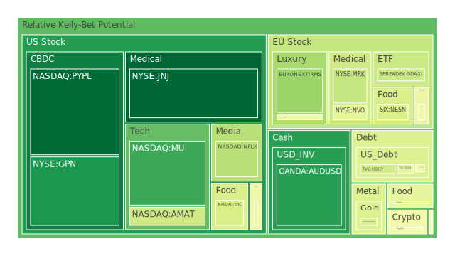
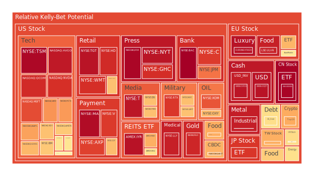
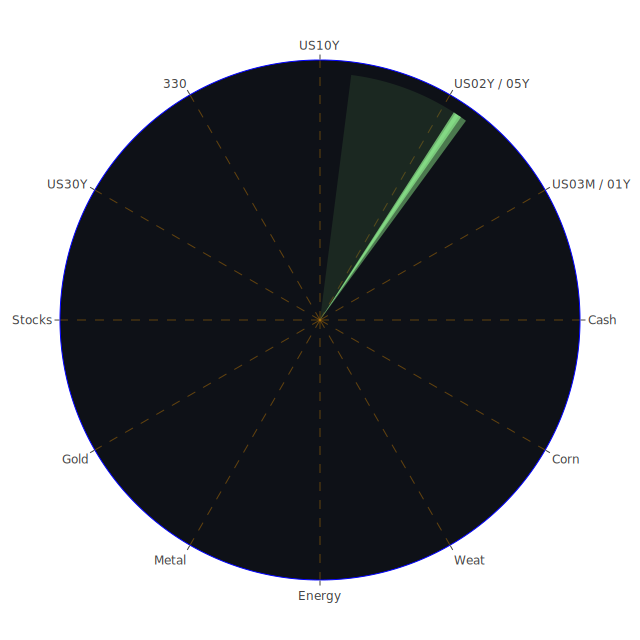

# **投資商品泡沫分析**

當前全球金融市場，於2025年5月21日觀之，正呈現一幅高度複雜且充滿不確定性的畫卷。諸多資產類別在經歷了長期的流動性盛宴與結構性變革後，其價格與內在價值之間的關係，正受到市場參與者日益嚴峻的審視。所謂「泡沫」，本質上是市場預期、資金流動與群體心理三者相互作用下的產物，其形成與破裂，皆是經濟週期中自然的現象，而非帶有道德批判的異常。吾人當以客觀中立之姿態，細察其間之奧秘。

**美國國債**

美國國債市場，作為全球金融體系的基石，其動向備受矚目。截至2025年5月21日，美國十年期國債孳息率（TVC:US10Y）報4.49%，其當日泡沫指數D1為0.609，月平均D30則為0.441。短期波動雖顯著，然長期風險評估相對溫和。觀察各年期債券，一年期（TVC:US01Y）泡沫指數D1為0.398，三十年期（TVC:US30Y）D1為0.448，整體而言，短期至中期債券的價格穩定性壓力略高於長期債券，這與聯邦儲備系統的經濟數據所顯示的，如隔夜逆回購（RRP）規模下降，聯邦基金有效利率（EFFR）成交量處於相對高位，以及聯儲總資產處於相對低位等現象相符，暗示市場對短期流動性與利率路徑的敏感。

從經濟學角度觀之，聯儲自2025年4月以來一次鷹派發言而無鴿派發言，持續的量化緊縮政策與相對較高的基準利率，對債券價格構成壓力。然而，近期穆迪下調美國信用評級的新聞事件（負面影響96%），雖短期內引發市場對美元資產的憂慮（「拋售美國」氛圍再現，正面影響92%——此處正面指新聞影響力，非市場方向），但亦可能在避險情緒升溫時，諷刺地推升對美國國債這一「最終安全港」的需求。此為市場心理與博弈論的微妙交織：一方面擔心信用風險，另一方面在全球動盪下（如俄烏衝突、中東局勢緊張等新聞頻傳），資金無處可去，仍可能回流美國國債。歷史上，2011年標普下調美國評級後，美債價格短期受挫但隨後因歐債危機等外部因素反而上漲，此為可參考之鏡像。當前30年期固定按揭利率高達6.81%，遠超去年之2.95%，反映了長期資金成本的顯著上升，這對整體經濟尤其是房地產市場構成深遠影響，而國債作為定價之錨，其穩定性至關重要。消費者拖欠率、商業地產拖欠率均處於相對高位，預示著信用環境的潛在脆弱性，這可能限制聯儲進一步大幅緊縮的能力，從而為債券價格提供一定支撐。

**美國零售股**

美國零售股，如沃爾瑪（NYSE:WMT）與塔吉特（NYSE:TGT），其泡沫指數呈現高位。WMT的D1高達0.905，D30亦有0.866；TGT的D1為0.958，D30為0.874。家得寶（NYSE:HD）的D1為0.913，D30為0.696。開市客（NASDAQ:COST）D1為0.667，D30為0.539，相對穩健但仍不可謂低。這些數據揭示了市場對零售業前景的高度樂觀預期，但也潛藏著較大的回調風險。

新聞層面，川普關於關稅的言論，要求沃爾瑪「消化關稅」，以及零售商對價格上漲的警告，為該行業帶來不確定性。洛杉磯港5月初因川普關稅導致貨運量下降30%的新聞，直接衝擊零售業的供應鏈與成本。經濟學上，零售業績與消費者信心、可支配收入息息相關。當前消費者拖欠率雖高，但信用卡拖欠率（尤其是100S，可能指主要銀行）處於低位，顯示消費主力人群的韌性尚存。然而，社會學角度看，貧富差距的擴大可能導致消費分級，高端零售與折扣零售表現分化。心理學上，持續的通脹壓力（雖CPI年增率已降至2.33%）可能已改變消費者的購物習慣，更傾向於尋找性價比。博弈論視角下，零售商在成本上升（關稅、物流）與維持市場份額之間進行艱難平衡，過度將成本轉嫁給消費者可能導致需求萎縮。歷史上，貿易保護主義抬頭時期，零售業普遍承壓。此刻高企的泡沫指數，或許已提前計入了對未來降息與經濟軟著陸的樂觀預期，一旦此預期未能實現，調整壓力將十分巨大。

**美國科技股**

科技股板塊，尤其是大型科技股，依然是市場焦點，其泡沫指數亦普遍偏高。微軟（NASDAQ:MSFT）D1為0.856，D30為0.639；蘋果（NASDAQ:AAPL）D1為0.722，D30為0.613；亞馬遜（NASDAQ:AMZN）D1為0.653，D30為0.718；谷歌（NASDAQ:GOOG）D1為0.685，D30為0.575；Meta（NASDAQ:META）D1為0.735，D30高達0.885。這些數據反映了市場對科技巨頭持續增長能力的強烈信心，尤其是在人工智能（AI）浪潮的推動下。

新聞中，英偉達CEO坦言中國芯片禁令帶來「深切痛苦」，損失150億美元銷售額，顯示地緣政治對科技產業的實質影響。蘋果與阿里巴巴交易引發美國議員擔憂，亦是科技巨頭在全球擴張中面臨的政治風險。Sam Altman對川普與海灣國家AI協議批評者稱其「天真」，暗示AI領域的國際合作與競爭充滿複雜性。Reddit股價因Wells Fargo警告谷歌AI搜索工具可能損害其流量而下跌，揭示了AI內部生態的博弈與顛覆效應。經濟學而言，科技股的高估值依賴於其高成長性及持續的創新能力。高利率環境對成長股估值不利，但AI帶來的生產力提升預期，部分對沖了此負面影響。社會學層面，科技的滲透改變生活方式，但也引發數據隱私、就業結構調整等廣泛討論。心理學上，投資者對AI的狂熱追捧，帶有明顯的「錯失恐懼症」（FOMO）色彩，類似於上世紀末的科網泡沫。博弈論中，科技巨頭間的AI軍備競賽，以及中美科技脫鉤的趨勢，均是影響行業格局的關鍵變量。納斯達克100指數（NASDAQ:NDX）D1為0.668，D30為0.748，亦印證了科技板塊的整體熱度與風險。

**美國房地產指數**

美國房地產指數，如AMEX:VNQ（Vanguard Real Estate ETF），其D1泡沫指數為0.605，D30為0.422；AMEX:IYR（iShares U.S. Real Estate ETF）D1為0.962，D30為0.790；AMEX:RWO（SPDR Dow Jones Global Real Estate ETF）D1為0.701，D30為0.489。其中IYR的泡沫讀數異常之高，值得警惕。

聯儲數據顯示，30年期固定按揭利率高達6.81%，較去年同期2.95%大幅攀升，對購房者負擔能力構成嚴重擠壓。商業地產拖欠率和房地產總體拖欠率均處於相對高位，顯示行業壓力。新聞方面，儘管有「較低利率對購房者是鼓舞」的報導（正面影響93%），但此觀察可能與整體高利率環境的宏觀現實存在差異，或指特定再融資產品。迪拜房地產市場火熱吸引知名投資者的新聞，與美國本土市場的謹慎形成對比。經濟學上，房地產市場對利率極為敏感，高利率通常抑制需求、增加開發商融資成本。社會學上，住房可負擔性成為重要社會議題。心理學角度，持續的房價上漲預期一旦逆轉，可能引發恐慌性拋售。博弈論中，開發商、購房者、銀行及監管機構在信貸周期中的互動，決定了市場的走向。歷史上，房地產泡沫的破裂往往對整體經濟產生嚴重衝擊，如2008年次貸危機。當前數據顯示，儘管存在壓力，但某些房地產ETF的泡沫指數仍高，可能反映了市場對特定細分領域（如物流地產、數據中心）的樂觀，或是對未來利率政策轉向的賭注。

**加密貨幣**

加密貨幣市場，以比特幣（BITSTAMP:BTCUSD）和以太幣（BINANCE:ETHUSD）為代表，呈現出中等偏高的泡沫水平。比特幣D1為0.708，D30為0.493；以太幣D1為0.471，D30為0.481。狗狗幣（BINANCE:DOGEUSD）D1為0.484，D30為0.477。相較於某些傳統資產，其月度風險積累似乎得到一定控制，但日波動引發的短期風險讀數仍不低。

新聞提及「加密精英日益擔心個人安全」（負面影響77%），反映了行業在快速發展同時，也面臨監管、安全等挑戰。經濟學上，加密貨幣的價值基礎仍存爭議，其價格波動主要受市場情緒、資金流動、監管政策預期等因素影響，而非傳統的現金流或盈利能力。社會學角度，加密貨幣代表了一種對傳統金融體系的挑戰與革新，吸引了特定社群的追隨。心理學上，其價格的劇烈波動極易引發投機心理與羊群效應。博弈論視角下，早期採用者的巨大財富效應，與後來者的進入時機選擇，構成了複雜的市場博弈。歷史上，加密貨幣經歷多次暴漲暴跌，其高波動性是固有特徵。當前泡沫指數顯示市場情緒相對活躍，但尚未達到極端狂熱的程度，或許是在等待下一個催化劑，例如主要經濟體對其監管框架的進一步明確。

**金/銀/銅**

貴金屬與工業金屬表現各異。黃金（OANDA:XAUUSD）現價約3291美元，D1泡沫指數為0.423，D30為0.540，顯示近期價格雖有波動，但長期風險已有所積累。白銀（OANDA:XAGUSD）現價約33.10美元，D1高達0.948，D30亦達0.889，泡沫風險顯著高於黃金。銅（FX:COPPER）現價約4.68美元，D1為0.510，D30為0.575，處於中等風險水平。

新聞中穆迪下調美國信用評級，以及「拋售美國」的氛圍，理論上利好黃金等避險資產。黃金石油比率（GOLD OIL RATIO）為52.29，黃金銅比率（GOLD COPPER RATIO）為703.34，這些相對價格關係可提供跨資產分析的視角。經濟學上，黃金通常被視為抗通脹和避險工具，在全球不確定性增加、美元信用受質疑時，其吸引力上升。白銀兼具貴金屬與工業屬性，其價格波動往往大於黃金。銅作為重要的工業金屬，其價格與全球經濟增長預期密切相關。社會學角度，黃金在多數文化中具有儲值保值的傳統觀念。心理學上，對危機的恐懼會推升避險資產需求。博弈論中，央行購金行為、大型基金的配置策略，均對貴金屬價格產生影響。白銀的高泡沫指數可能與投機資金炒作或特定工業需求（如太陽能）預期有關，需警惕其波動性。金礦防禦股如皇家黃金（NASDAQ:RGLD）D1為0.920，D30為0.923，泡沫指數極高，暗示市場對金價上漲的預期已充分反映在股價中。

**黃豆 / 小麥 / 玉米**

農產品方面，黃豆ETF（AMEX:SOYB）D1為0.499，D30為0.644；小麥ETF（AMEX:WEAT）D1為0.449，D30為0.428；玉米ETF（AMEX:CORN）D1為0.644，D30為0.462。整體而言，農產品的泡沫指數處於中等水平，黃豆的長期風險略高，玉米的短期風險值得關注。

新聞中提及肯塔基州和密蘇里州發生嚴重風暴，造成人員傷亡。此類極端天氣事件，可能對農作物產量造成影響，從而推高價格。經濟學上，農產品價格受供需關係、天氣狀況、貿易政策、能源價格（影響化肥、運輸成本）等多重因素影響。社會學角度，糧食安全是各國政府高度重視的議題。心理學上，對糧食短缺的恐慌可能引發囤積行為和價格炒作。博弈論中，主要糧食出口國的政策、大型農業企業的套期保值行為，均對市場產生作用。歷史上，惡劣天氣或地緣政治衝突常常導致農產品價格飆升。目前農產品的泡沫指數尚不算極端，但考慮到全球氣候變化加劇和地緣政治的不穩定性，其價格波動風險不容忽視。

**石油/ 鈾期貨UX\!**

能源市場方面，美國原油（TVC:USOIL）現價約62.93美元，D1泡沫指數為0.606，D30僅為0.262，顯示近期價格波動帶來短期風險上升，但長期泡沫積累不明顯。鈾期貨（COMEX:UX1\!）D1為0.493，D30為0.490，處於中等風險水平。

經濟學上，石油價格受全球供需、OPEC+政策、地緣政治（俄烏戰爭、中東局勢）、經濟增長預期以及美元匯率等多重因素影響。當前油價相對溫和，可能反映了市場對全球經濟增長放緩的擔憂，以及美國等非OPEC國家產量增加的影響。鈾價則與核電發展前景密切相關，在全球推動能源轉型、減少碳排放的背景下，核能作為一種清潔能源受到重新評估，對鈾需求構成潛在支撐。社會學角度，能源價格直接影響民生，並可能引發社會穩定問題。心理學上，對能源供應中斷的擔憂會推高風險溢價。博弈論中，產油國之間的產量協調、消費國的戰略儲備釋放，以及能源轉型政策的推進，都是複雜的博弈過程。石油防禦股如埃克森美孚（NYSE:XOM）D1為0.843，D30為0.806；西方石油（NYSE:OXY）D1為0.681，D30為0.743，均顯示較高的泡沫指數，可能已計入對油價反彈或公司特定利好的預期。

**各國外匯市場**

外匯市場波動顯著。歐元兌美元（OANDA:EURUSD）D1高達0.956，D30亦達0.926，泡沫風險極高。美元兌日元（OANDA:USDJPY）D1為0.959，D30為0.704，同樣處於高風險區域。澳元兌美元（OANDA:AUDUSD）D1為0.135，D30為0.328，相對溫和。英鎊兌美元（OANDA:GBPUSD）D1為0.518，D30為0.456，處於中等水平。

美元指數因穆迪下調美國信用評級而承壓，「品牌美國」失寵導致美元走弱的分析甚囂塵上。經濟學上，匯率由利率差異、經濟基本面、資本流動、貿易差額等因素決定。聯儲的鷹派立場與美國經濟的相對韌性曾是美元強勢的支撐，但信用評級的下調及對美國財政健康的擔憂，正侵蝕美元的吸引力。社會學與心理學層面，對一國貨幣的信心，是國家形象與市場預期的綜合反映。博弈論視角下，各國央行的貨幣政策博弈，以及大型跨國資本的流動，共同塑造外匯市場格局。EURUSD的高泡沫可能反映了市場對歐洲央行緊縮力度不及聯儲，或對歐元區經濟前景的相對悲觀預期未能充分釋放。USDJPY的高泡沫則與日本央行能否持續超寬鬆政策，以及美日利差的走向密切相關。

**各國大盤指數**

全球主要股指泡沫程度不一。納斯達克100指數（NASDAQ:NDX）如前述，D1為0.668，D30為0.748。德國DAX指數（SPREADEX:GDAXI）D1為0.385，D30為0.537。法國CAC40指數（FXOPEN:FCHI）D1為0.690，D30為0.581。英國富時100指數（SPREADEX:FTSE）D1為0.615，D30為0.547。日經225指數（FX:JPN225）D1為0.893，D30為0.784，風險較高。台灣加權股價指數（TWSE:0050 ETF代表）D1為0.702，D30為0.631。中國滬深300指數（SSE:000300）D1高達0.990，D30為0.612，短期風險極高。

各國股市表現，是其國內經濟狀況、企業盈利、利率環境、地緣政治以及全球投資者情緒的綜合體現。日經指數的高泡沫，部分得益于日本企業治理改革、日元貶值帶來的出口競爭力提升以及全球資金的重新配置。滬深300指數的極高短期泡沫指數，可能與政策預期、資金面博弈有關，但其月度風險相對可控，暗示市場信心基礎仍不穩固。歐洲股市泡沫程度相對溫和，但亦面臨能源危機後遺症、通脹壓力及經濟增長乏力的挑戰。

**美國半導體股**

半導體股是科技板塊中的高風險區域。英偉達（NASDAQ:NVDA）D1為0.902，D30為0.649；台積電ADR（NYSE:TSM）D1為0.982，D30為0.980，泡沫指數幾乎登頂；超微（NASDAQ:AMD）D1為0.744，D30為0.628；高通（NASDAQ:QCOM）D1為0.913，D30為0.821；博通（NASDAQ:AVGO）D1為0.948，D30為0.816；美光（NASDAQ:MU）D1為0.161，D30為0.342，相對較低；英特爾（NASDAQ:INTC）D1為0.592，D30為0.496，中等水平；應用材料（NASDAQ:AMAT）D1為0.395，D30為0.684；科磊（NASDAQ:KLAC）D1為0.594，D30為0.529。

半導體行業身處AI革命的核心，市場預期極高，但也面臨地緣政治（中美科技戰、芯片禁令）、產能過剩風險以及技術迭代迅速的挑戰。台積電的極高泡沫指數，反映其在全球產業鏈中的關鍵地位以及AI芯片的強勁需求，但也使其對任何風吹草動高度敏感。英偉達雖受禁令影響，但其在高端AI芯片市場的壟斷地位使其依然受追捧。相對而言，美光科技的泡沫指數較低，可能與其在存儲芯片領域的周期性有關。博弈論視角下，各國政府對半導體產業的巨額補貼與扶持，既是機遇也是扭曲市場的因素。

**美國銀行股**

美國銀行股泡沫指數普遍偏高。美國銀行（NYSE:BAC）D1高達0.998，D30為0.949，風險極高；摩根大通（NYSE:JPM）D1為0.793，D30為0.746；花旗集團（NYSE:C）D1為0.885，D30為0.865。第一資本金融（NYSE:COF）D1為0.676，D30為0.517，相對溫和。

銀行業績與利率環境、信貸質量、金融市場活躍度密切相關。聯儲加息周期中，銀行淨息差一度擴大，但高利率也可能增加信貸違約風險。聯儲數據顯示，商業地產和消費者貸款拖欠率上升，對銀行資產質量構成潛在威脅。穆迪下調美國信用評級，雖非直接針對銀行，但可能影響銀行融資成本和市場信心。紐約銀行家因鐵路罷工擔憂通勤的新聞，雖屬微觀事件，但也折射出金融中心運營的脆弱性。歷史上，銀行股在經濟下行周期或金融動盪時期，往往首當其衝。當前極高的泡沫指數，可能反映了市場對銀行業已充分消化負面因素並將受益於未來經濟復甦的樂觀預期，但風險不容小覷。

**美國軍工股**

美國軍工股，如洛克希德馬丁（NYSE:LMT）D1為0.666，D30為0.761；諾斯洛普格魯曼（NYSE:NOC）D1為0.672，D30為0.692；雷神技術（NYSE:RTX）D1為0.891，D30為0.827。整體泡沫指數較高。

新聞中，盧比奧參議員稱北約成員國將在6月峰會前同意未來十年國防開支佔GDP 5%，對軍工行業構成直接利好。全球地緣政治緊張局勢持續，如俄烏衝突、以色列在加沙發動新攻勢等，均提升了市場對軍工產品的需求預期。經濟學上，軍工訂單往往具有長期性和穩定性，但受制於政府預算。社會學和倫理學角度，軍工產業的發展與和平及人道主義關切存在張力。心理學上，不安全感和危機意識會推高對國防的重視。博弈論中，國際軍備競賽是典型的囚徒困境，各國為求自保而增加軍費，導致整體安全水平並未實質提升，反而消耗大量資源。軍工股的高泡沫，是對持續衝突和國防支出增加的直接反映。

**美國電子支付股**

電子支付領域，Visa（NYSE:V）D1為0.887，D30為0.754；萬事達卡（NYSE:MA）D1為0.974，D30為0.809；PayPal（NASDAQ:PYPL）D1僅為0.026，D30為0.837，呈現短期風險極低而長期風險偏高的態勢；Global Payments（NYSE:GPN）D1為0.119，D30為0.424，相對穩健。

電子支付行業受益於全球數字化轉型和無現金化趨勢。經濟學上，其營收與交易量和費率相關，受消費者支出和整體經濟活動影響。高通脹環境下，名義交易額的增加可能帶來收入增長，但實際消費能力的下降則構成挑戰。社會學角度，支付方式的變革深刻影響商業模式和消費習慣。心理學上，便捷性和安全性是用戶選擇支付工具的關鍵。博弈論中，新興支付方式（如先買後付、加密貨幣支付）對傳統巨頭構成競爭壓力。PayPal的數據較為特殊，D1極低可能意味著近期有利空出盡或超跌反彈的技術性因素，但其高企的D30仍提示長期估值壓力。萬事達卡的高泡沫指數則反映市場對其市場領導地位和持續增長的高度認可。

**美國藥商股**

大型藥企中，嬌生（NYSE:JNJ）D1為0.020，D30為0.210，泡沫指數很低，顯示其價格相對穩健。默克（NYSE:MRK）D1為0.374，D30為0.457，中等水平。禮來（NYSE:LLY）D1高達0.935，D30亦達0.934，泡沫風險極高。諾和諾德ADR（NYSE:NVO）D1為0.441，D30為0.570，中等偏高。

藥企股價受藥品研發管線、專利保護、醫保政策、市場競爭等多方面因素影響。禮來和諾和諾德因其在減肥藥和糖尿病治療領域的突破性產品而備受市場追捧，導致其估值和泡沫指數急劇攀升。嬌生的低泡沫可能與其業務多元化及近期訴訟等因素有關。經濟學上，醫藥行業具有需求剛性，但同時面臨藥價管制和研發成本高昂的壓力。社會學角度，藥品可及性和定價公平性是重要的公共衛生議題。心理學上，對健康長壽的追求以及對突破性療法的期待，會推高相關企業的估值。博弈論中，藥企間的專利戰、仿製藥競爭以及與政府醫保部門的藥價談判，都是關鍵的博弈環節。

**美國影視股**

影視娛樂行業，迪士尼（NYSE:DIS）D1為0.670，D30為0.703；派拉蒙全球（NASDAQ:PARA）D1為0.667，D30為0.496；奈飛（NASDAQ:NFLX）D1為0.351，D30為0.489。

影視股正面臨流媒體競爭白熱化、內容成本高漲、廣告市場疲軟以及好萊塢罷工後遺症等多重挑戰。奈飛股價因估值擔憂被下調評級的新聞，反映了市場對其增長前景的審慎態度。迪士尼的泡沫指數相對較高，可能與其IP儲備、主題公園業務復甦以及流媒體業務減虧的預期有關。經濟學上，該行業受消費者可自由支配開支、廣告收入和訂閱用戶增長影響。社會學角度，影視內容是文化傳播和價值觀塑造的重要載體。心理學上，優質內容的吸引力和品牌忠誠度是核心競爭力。博弈論中，各大流媒體平台在內容採購、定價策略和國際市場擴張方面的競爭異常激烈。

**美國媒體股**

媒體股方面，康卡斯特（NASDAQ:CMCSA）D1為0.467，D30為0.465；福克斯公司（NASDAQ:FOX）D1高達0.986，D30為0.875；紐約時報（NYSE:NYT）D1為0.956，D30為0.746。福克斯和紐約時報的泡沫指數均處於極高水平。

傳統媒體和數字媒體均面臨商業模式轉型的壓力，包括廣告收入向大型科技平台集中、用戶獲取成本上升等。新聞中Reddit股價因谷歌AI搜索工具可能影響其流量而下跌，也間接反映了內容平台在AI時代的焦慮。福克斯和紐約時報的高泡沫，可能與其在特定細分市場的影響力、數字化轉型的進展，或是市場對特定政治週期下其內容價值的預期有關。經濟學上，媒體收入依賴廣告、訂閱和內容授權。社會學上，媒體是公眾輿論形成和信息傳播的關鍵渠道，但也面臨假新聞和信息茧房的挑戰。心理學上，媒體內容的公信力和吸引力至關重要。博弈論中，媒體機構在爭奪用戶注意力、應對新技術衝擊以及與監管機構互動方面，都處於複雜的博弈之中。

**歐洲奢侈品股**

歐洲奢侈品股，如愛馬仕（EURONEXT:RMS）D1為0.298，D30為0.623；路威酩軒（EURONEXT:MC）D1為0.466，D30為0.476；開雲集團（EURONEXT:KER）D1為0.960，D30為0.761。開雲集團的泡沫指數顯著偏高。

奢侈品行業的表現與全球高淨值人群的財富效應、消費者信心、旅遊零售復甦以及品牌稀缺性密切相關。經濟學上，奢侈品具有較強的定價能力和品牌護城河，但其需求對宏觀經濟波動，尤其是資產價格波動較為敏感。社會學角度，奢侈品消費是社會地位和身份認同的象徵。心理學上，品牌故事、稀缺性和尊貴體驗是驅動消費的核心要素。博弈論中，各大奢侈品集團在品牌建設、市場擴張（尤其是在新興市場）、供應鏈控制以及應對二手市場和仿冒品方面的競爭持續不斷。開雲集團的高泡沫可能與其旗下特定品牌的表現或轉型預期有關，但整體而言，在全球經濟前景不明朗的背景下，奢侈品行業的高估值需要謹慎對待。

**歐洲汽車股**

歐洲汽車股，如寶馬（XETR:BMW）D1為0.464，D30為0.566；梅賽德斯奔馳（XETR:MBG）D1為0.508，D30為0.494；保時捷控股（XETR:PAH3）D1為0.590，D30為0.576。整體泡沫指數處於中等水平。

歐洲汽車製造商正經歷向電動化和智能化轉型的陣痛期，面臨來自特斯拉以及中國電動汽車品牌的激烈競爭。大眾汽車與Rivian合作，擁抱初創企業DNA的新聞，顯示了傳統車企尋求變革的努力。經濟學上，汽車銷售受經濟周期、利率水平、油價、補貼政策以及技術革新影響。社會學角度，汽車不僅是交通工具，也關乎環保、城市規劃和生活方式。心理學上，品牌形象、駕駛體驗和技術創新是消費者選擇的關鍵。博弈論中，傳統車企在維持燃油車利潤與投入電動化轉型之間的平衡，以及與供應商（尤其是電池供應商）的議價能力，都是其面臨的挑戰。

**歐美食品股**

食品股通常被視為防禦性板塊。卡夫亨氏（NASDAQ:KHC）D1為0.410，D30為0.744，長期風險偏高。可口可樂（NYSE:KO）D1為0.707，D30為0.664，泡沫指數不低。雀巢（SIX:NESN）D1為0.410，D30為0.541。聯合利華（LSE:ULVR）D1高達0.933，D30亦達0.941，泡沫風險極高。

食品飲料行業受益於需求的相對穩定性，但在成本端面臨原材料價格波動、供應鏈不穩定以及勞動力成本上升的壓力。經濟學上，品牌力、分銷渠道和成本控制是核心競爭力。社會學角度，食品安全、健康飲食趨勢以及可持續發展理念對行業產生深遠影響。心理學上，消費者的品牌忠誠度和口味偏好是關鍵。博弈論中，大型食品企業與零售商之間的定價博弈，以及在健康化、高端化、便捷化等趨勢下的產品創新競爭，構成了行業動態。聯合利華的極高泡沫指數，可能與其近期業績改善、成本控制措施或特定產品線的強勁表現有關，但也暗示了較大的回調空間。

# **宏觀經濟傳導路徑分析**

當前宏觀經濟環境的核心特徵，在於聯邦儲備系統政策的微妙平衡與地緣政治風險的持續發酵。聯儲數據顯示，通脹（CPIYOY 2.33%）已顯著回落，但勞動力市場相關數據（如薪資增長，此處未直接提供，但為關鍵隱含變量）和部分信貸拖欠率（商業地產、消費貸）的上升，構成「滯脹」陰影。聯儲鷹派表態與持續縮表，意在鞏固抗通脹成果，但也增加了經濟硬著陸的風險。此背景下，穆迪下調美國信用評級，無疑加劇了市場對美國財政可持續性的擔憂。

傳導路徑一：信用評級下調與財政憂慮。此事件通過市場心理（負面情緒96%）直接衝擊美元資產，導致美元短期走弱（如EURUSD、USDJPY泡沫指數攀升），並可能推升美國長期融資成本。若融資成本上升，將進一步壓縮政府財政空間，影響基建支出或社會福利項目，間接拖累經濟增長。同時，高企的政府債務（佔GDP比重高）疊加評級下調，可能促使國際投資者（博弈論參與者）重新評估美國資產的風險溢價，導致資本外流或要求更高回報，對股市和債市均構成壓力。

傳導路徑二：利率政策與實體經濟。高按揭利率（6.81%）已對房地產市場（VNQ、IYR）形成顯著壓制。高企的信用卡和消費貸款拖欠率，雖總體信用卡拖欠率仍低，但已是警訊，預示消費者購買力可能正在減弱，進而影響零售（WMT、TGT）、電子支付（V、MA）乃至整體服務業的表現。企業融資成本上升，則可能抑制投資擴張，尤其對高成長性的科技股（NDX）和半導體股（NVDA、TSM）的估值邏zenia構成挑戰。

傳導路徑三：地緣政治與供應鏈。俄烏衝突、中東局勢以及潛在的貿易摩擦（如川普關稅言論），持續擾動全球供應鏈。這不僅推高特定商品價格（如歷史上的石油、天然氣，當前數據中油價溫和，但風險猶存），也增加了企業運營的不確定性。例如，英偉達因芯片禁令損失中國市場，洛杉磯港因關稅預期貨運量下降，均是此路徑的體現。軍工股（LMT、NOC、RTX）則在此背景下受益於國防開支增加的預期。供應鏈的不穩定，最終會轉化為通脹壓力或經濟效率損失。

# **微觀經濟傳導路徑分析**

微觀層面，企業盈利能力、成本控制及市場競爭策略，是觀察經濟健康狀況的窗口。

傳導路徑一：成本傳導與利潤擠壓。原材料價格（雖近期多數商品價格指數未極端高企，但波動性仍在）、勞動力成本及融資成本的上升，對企業利潤構成壓力。零售商如沃爾瑪被要求「消化關稅」，食品公司如聯合利華（ULVR高泡沫）面臨成本壓力，均是例證。企業若無法有效將成本轉嫁給消費者（因需求疲軟或競爭激烈），則利潤空間將被壓縮，進而影響其股價表現和再投資能力。

傳導路徑二：技術創新與行業洗牌。AI浪潮正在重塑多個行業。科技巨頭（MSFT、GOOG、META）投入巨資研發AI，半導體公司（NVDA、TSM）因AI芯片需求而炙手可熱。然而，AI也帶來顛覆性影響，如谷歌AI搜索可能損害Reddit等內容平台流量，預示著行業內部利益的重新分配。無法跟上技術變革的公司，可能面臨淘汰風險。此路徑下，高泡沫的AI相關股票，其高估值能否持續，取決於技術能否真正轉化為可持續的盈利增長。

傳導路徑三：消費者行為變遷。高通脹環境和對經濟前景的不確定性，正改變消費者的行為模式。例如，對價格更為敏感，可能導致消費降級或轉向更具性價比的商品。電子支付的普及（PYPL、V、MA）改變了購物方式。對健康和可持續性的關注，影響食品（KHC、NESN）、醫藥（LLY、NVO）乃至奢侈品（RMS、MC）行業的產品策略。企業需敏銳捕捉這些變化，調整產品結構和營銷策略。

# **資產類別間傳導路徑分析**

資產價格的波動並非孤立，而是相互關聯、相互影響的。

路徑一：利率預期與風險資產定價。美國國債孳息率是全球資產定價之錨。聯儲政策預期引導的國債利率波動，直接影響股票估值，尤其是對利率敏感的成長股（如科技股、半導體股）和房地產（VNQ）。若市場預期利率將長期維持高位，或進一步上升，則高估值的風險資產（如TSM、BAC、LLY、META等D30和D1均高的股票）面臨的回調壓力將加大。

路徑二：美元匯率與國際資本流動。美元走強（或走弱）對跨國企業盈利、大宗商品價格（通常以美元計價）以及新興市場資產表現均有顯著影響。穆迪下調美國評級引發的美元弱勢預期（USDJPY、EURUSD高泡沫），若持續，可能利好黃金（XAUUSD）等非美資產，並可能吸引資金迴流至估值相對合理的非美市場（如部分歐洲或亞洲股市，但需警惕其自身風險，如日經225的高泡沫）。

路徑三：避險情緒與資產輪動。當市場不確定性增加時（如地緣政治衝突、金融系統風險），避險情緒升溫，資金傾向於從高風險資產流向避險資產。例如，股市下跌時，黃金、瑞士法郎、日元（儘管USDJPY目前高泡沫，但日元傳統上具避險屬性）以及短期高評級債券可能受到追捧。當前黃金和白銀（XAGUSD）的高泡沫，部分反映了這種避險需求。金礦股（RGLD）的高泡沫亦與此相關。

路徑四：商品價格與通脹預期。石油、銅、農產品等大宗商品價格的波動，直接影響通脹水平和通脹預期。若商品價格持續上漲，將加大央行控制通脹的難度，可能迫使其採取更緊縮的貨幣政策，進而對債券和股票市場造成負面影響。反之，商品價格回落則有助於緩解通脹壓力。當前石油價格相對溫和，但農產品和銅的泡沫指數處於中等水平，需關注其後續走勢。

路徑五：行業聯動與情緒傳染。特定行業的重大消息或業績表現，可能通過供應鏈、競爭關係或市場情緒傳染至其他相關行業。例如，半導體行業的景氣度直接影響下游的電子產品製造、汽車電子等。大型科技股的漲跌，往往對整體市場情緒產生引導作用。金融機構（如美國銀行股的高泡沫）的穩定性，則關乎整個金融系統的風險。

# **投資建議**

基於當前市場環境的分析，投資者應秉持謹慎態度，注重資產配置的多元化與風險管理。以下配置建議，旨在於不確定性中尋求相對穩健的收益，同時捕捉結構性增長機遇，並為潛在的高風險高回報暴露保留一定彈性。總體配置方案將穩健、成長與高風險三大類別的資金總和設定為100%。

**一、穩健型配置 (佔總投資組合40%)**

此部分旨在保全資本，提供相對穩定的現金流，並對沖市場下行風險。

1. **短期美國國債 (佔穩健型配置的40%，即總資產的16%)**: 鑒於當前美國短期國債（如TVC:US03MY，D1泡沫0.474，D30泡沫0.295，相對安全）孳息率處於相對高位，且聯儲貨幣市場基金資產規模持續上升，顯示市場對此類資產的偏好。短期國債流動性好，利率風險較低，可作為現金管理工具。  
2. **優質大型製藥股 (佔穩健型配置的30%，即總資產的12%)**: 例如嬌生（NYSE:JNJ），其D1泡沫指數僅0.020，D30為0.210，估值相對合理，業務多元化，股息穩定，具有較強的防禦屬性。醫藥需求具有剛性，受經濟周期影響較小。  
3. **黃金 (實物或ETF) (佔穩健型配置的30%，即總資產的12%)**: 黃金（OANDA:XAUUSD）雖然D30泡沫指數為0.540，不算極低，但在美國信用評級遭下調、地緣政治風險頻發、全球央行持續購金的背景下，黃金作為傳統避險資產和價值儲存手段，其配置價值依然存在。

**二、成長型配置 (佔總投資組合的40%)**

此部分旨在捕捉具有長期增長潛力的領域，但需警惕估值過高的風險。

1. **全球基礎設施相關ETF (佔成長型配置的35%，即總資產的14%)**: 考慮到全球範圍內基礎設施升級換代的需求（包括傳統基建與數字基建如數據中心、5G網絡），以及部分國家政府的財政刺激計劃，該領域具備長期增長潛力。選擇波動性相對較低、股息穩健的全球性ETF。  
2. **部分估值相對合理的科技股 (佔成長型配置的35%，即總資產的14%)**: 雖然整體科技股泡沫較高，但可甄選在AI、雲計算、企業軟件等領域具備核心競爭力，且估值泡沫相對可控（如微軟MSFT D30為0.639，相較部分半導體股略好，但仍需謹慎）或近期有所回調的公司。重點關注其盈利能力和現金流狀況。  
3. **可再生能源與清潔技術 (佔成長型配置的30%，即總資產的12%)**: 全球能源轉型是大勢所趨，鈾期貨（COMEX:UX1\!）泡沫指數中等（D30為0.490），反映了市場對核能的重新關注。太陽能、風能、儲能等領域，雖然可能面臨補貼退坡、供應鏈瓶頸等短期挑戰，但長期增長空間廣闊。選擇技術領先、財務健康的企業或相關主題基金。

**三、高風險/機會型配置 (佔總投資組合的20%)**

此部分配置於潛在回報較高，但風險亦顯著的資產，倉位需嚴格控制。

1. **新興市場股票ETF (佔高風險配置的40%，即總資產的8%)**: 部分新興市場國家（如印度、東南亞部分國家）經濟增長潛力較大，且在全球供應鏈重塑過程中可能受益。但其市場波動性高，易受全球宏觀環境和地緣政治影響。選擇覆蓋廣泛、管理優良的ETF。  
2. **精選半導體產業鏈相關股票 (佔高風險配置的30%，即總資產的6%)**: 雖然如台積電（TSM）等龍頭泡沫極高，但半導體產業鏈中可能存在一些估值相對合理、在特定細分領域具備獨特優勢的中小型企業，或是在近期調整較多的個股（如美光MU泡沫指數相對較低）。此類投資需深入研究，風險極高。  
3. **加密貨幣 (少量配置) (佔高風險配置的30%，即總資產的6%)**: 比特幣（BTCUSD）和以太幣（ETHUSD）泡沫指數中等偏高。加密貨幣作為一種另類資產，與傳統金融資產相關性較低，少量配置或可分散風險，並博取高增長潛力。但其波動性極大，監管風險高，僅適合風險承受能力極強的投資者。

# **風險提示**

投資有風險，市場總是充滿不確定性。本文所有分析和建議僅基於當前可獲得之數據與筆者之判斷，不構成任何投資要約或承諾。過往業績並不能預示未來表現，資產價格可能上漲亦可能下跌。任何投資決策均應在投資者充分理解相關風險，並根據自身的財務狀況、投資目標、風險承受能力及獨立專業意見後審慎做出。市場情緒、宏觀政策、地緣政治等不可預見因素均可能對資產價格產生重大影響。尤其需要警惕報告中多次提及的高泡沫資產，其價格回調風險不容忽視。一切市場現象，皆為自然演化，投資者需理性看待，戒除貪婪與恐懼，方能在波動的市場中行穩致遠。

 
Daily Buy Map:

 
Daily Sell Map:

 
Daily Radar Chart:

 
