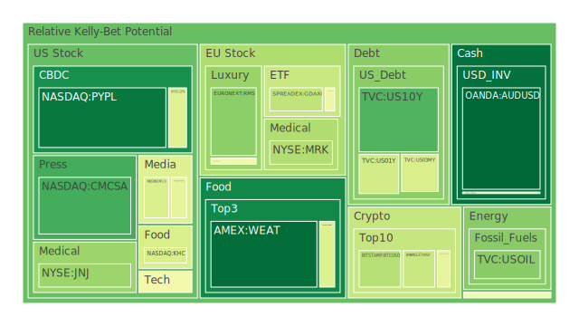

# **投資商品泡沫分析**

當前全球金融市場環境複雜，多空因素交織。我們將深入剖析各類主要投資商品，評估其潛在的泡沫風險，並提供基於經濟學、社會學、心理學及博弈論等多維度視角的觀察。一切市場波動，皆可視為不同力量交互作用下的自然現象，我們旨在客觀呈現這些現象，並從中梳理出可能的脈絡。

**美國國債**

美國國債市場近期波動顯著，殖利率曲線的形態變化反映了市場對未來經濟路徑的預期分歧。從提供的數據觀察，各期限美債的泡沫指數呈現差異。例如，TVC:US10Y 的當日泡沫指數 (D1) 在 2025-05-22 為 0.188376，相較於一個月平均 (D30) 的 0.430952 有所下降，但仍處於一定水平。而 TVC:US02Y 的泡沫指數在各個週期均保持在 0.609932，顯示短期債券市場的風險定價相對穩定但偏高。

從經濟學角度看，聯準會 (FED) 的貨幣政策是影響美債價格的核心因素。當前 FED 資產負債表規模處於相對低位，逆回購 (RRP) 工具使用量下降，而聯邦基金有效利率 (EFFR) 成交量處於相對高位，這些現象共同指向市場流動性狀態的微妙變化。FED 近期一次鷹派發言，暗示其對抗通膨的決心，這通常會對債券價格構成壓力（殖利率上升）。此外，美國政府債務佔 GDP 比重處於高位，穆迪下調美國信用評級的新聞事件（負面影響96%），以及鮑威爾對國家財政路徑「不可持續」的警告（負面影響92%），都加劇了市場對美債長期價值的擔憂。社會心理層面，「債券自衛隊」(bond vigilantes) 的重現，反映了投資者對政府債務過高的警惕，這種集體行為本身就會放大市場波動。博弈論觀點下，市場參與者正在與 FED 的政策意圖進行博弈，猜測其緊縮周期的終點與未來降息的可能性。

歷史上，高通膨與高政府債務時期，債券市場往往表現不佳，例如 1970 年代的美國。當前情景雖不完全相同，但高企的 30 年期固定抵押貸款利率 (6.81%) 和相對較高的各年期美債殖利率，與去年同期相比大幅上升（例如 30 年期固定抵押貸款利率去年同期為 2.95%），顯示融資成本顯著提高，這對經濟活動和資產估值均構成挑戰。值得注意的是，美國十年期公債殖利率減去三月期國庫券殖利率 (US Yield 10Y-03M) 為 0.25，雖為正值，但絕對水平不高，殖利率曲線趨平甚至部分倒掛的陰影仍未完全消散，歷史上這種現象常被視為經濟衰退的先兆。

**美國零售股**

美國零售股，如 NYSE:WMT（沃爾瑪）和 NYSE:TGT（塔吉特），其泡沫指數在近期呈現高位徘徊。WMT 在 2025-05-22 的 D1 為 0.899872，D30 為 0.874661；TGT 的 D1 為 0.913522，D30 為 0.881552。NYSE:HD（家得寶）的 D1 為 0.894330，D30 為 0.704440，顯示這些零售巨頭的短期風險感知有所上升或維持高檔。NASDAQ:COST（好市多）的 D1 為 0.668592，D30 為 0.546931，相對較低但仍需關注。

經濟學上，零售股的表現與消費者信心、可支配收入、失業率以及通膨水平密切相關。當前消費者拖欠款項比率處於相對高位，這可能預示著未來消費能力的下降。新聞事件中，洛杉磯港口五月初貨運量因關稅問題下降30%（負面影響97%），以及家得寶財報受關稅和美國信用評級下調影響（負面影響94%），均對零售業前景蒙上陰影。社會學角度，消費習慣的變遷，如線上購物對實體店的衝擊，以及疫情後消費模式的再平衡，都在重塑零售業格局。心理學層面，高通膨環境下，消費者可能更傾向於尋找性價比高的商品，或減少非必需品開支，這對不同定位的零售商影響各異。博弈論視角下，零售商之間在定價、促銷、供應鏈管理等方面的競爭日趨激烈。

歷史上，經濟衰退期零售股通常會受到較大衝擊，尤其是非必需消費品。然而，大型折扣零售商如沃爾瑪，因其提供的商品多為生活必需品，有時反而能展現出一定的防禦性。目前 CPIYOY（消費者物價指數年增率）為 2.33%，較去年同期的 3.33%有所回落，但累積通膨壓力仍在。高漲的抵押貸款利率和各類貸款拖欠率上升，可能擠壓消費者的購物預算。

**美國科技股**

美國科技股板塊呈現顯著分化。以 NASDAQ:NDX（納斯達克100指數）為例，其 2025-05-22 的 D1 高達 0.954820，但 D30 為 0.757129，顯示短期風險急劇升高。龍頭股如 NASDAQ:MSFT（微軟）D1 為 0.615994，D30 為 0.638905；NASDAQ:AAPL（蘋果）D1 為 0.721983，D30 為 0.618285；NASDAQ:GOOG（谷歌）D1 為 0.583715，D30 為 0.572051；NASDAQ:AMZN（亞馬遜）D1 為 0.650999，D30 為 0.718760。而 NASDAQ:META（Meta）的 D1 為 0.739891，D30 高達 0.878377，顯示其持續處於高風險區域。

經濟學角度，科技股估值對利率極為敏感。FED 的鷹派立場和高利率環境，對成長型科技股的估值構成壓力。Nvidia CEO 關於中國晶片禁令導致150億美元銷售損失的言論（負面影響97%），以及 Reddit 因 Google AI 搜尋可能影響其流量而股價下跌（負面影響95%），凸顯了行業面臨的政策風險與競爭格局變化。社會學觀點，科技發展日新月異，AI、雲端運算、物聯網等趨勢持續塑造社會結構與生活方式，也帶來了巨大的投資機會與不確定性。心理學上，「錯失恐懼」(FOMO) 與「追逐趨勢」的心理，常在科技股行情中扮演重要角色，但也容易催生泡沫。博弈論視角，科技巨頭間在市場份額、技術標準、人才招募等方面的競爭如同複雜的棋局。

歷史上，科技股經歷過多次繁榮與蕭條的週期，例如2000年的互聯網泡沫。當前AI熱潮推動了部分科技股的強勁上漲，但也引發了對估值是否過高的擔憂。高殖利率環境下，投資者對科技公司的盈利能力和現金流產生能力要求更高。

**美國房地產指數**

美國房地產指數，如 AMEX:VNQ（Vanguard Real Estate ETF）和 AMEX:IYR（iShares U.S. Real Estate ETF），其泡沫指數同樣值得關注。VNQ 在 2025-05-22 的 D1 為 0.566125，D30 為 0.428176；IYR 的 D1 為 0.961889，D30 為 0.790864，IYR 的短期風險顯著偏高。AMEX:RWO（SPDR Dow Jones Global Real Estate ETF）的 D1 為 0.708570，D30 為 0.505848。

經濟學上，房地產市場與利率、就業、收入增長和信貸條件緊密相關。FED 數據顯示，商業房地產拖欠款項比率、消費者拖欠款項比率及房地產拖欠款項比率均處於相對高位，這對房地產市場構成壓力。30年期固定抵押貸款利率高達6.81%，較去年同期的2.95%大幅攀升，極大增加了購房成本，抑制了需求。社會學角度，居家辦公趨勢對商業地產（尤其是辦公樓）的長期需求產生了結構性影響。心理學層面，房價的預期在購房決策中扮演重要角色，持續的負面消息可能打擊市場信心。博弈論中，開發商、貸方、買方和政策制定者之間的互動決定了市場走向。

歷史經驗表明，利率急劇上升往往會導致房地產市場降溫甚至蕭條。目前的高利率環境，加上商業地產（特別是辦公室和部分零售物業）面臨的結構性挑戰，使得美國房地產市場前景不明朗。住宅市場方面，雖然庫存偏低可能對價格提供一定支撐，但高昂的借貸成本仍是主要制約因素。

**加密貨幣**

加密貨幣市場以其高波動性著稱。BITSTAMP:BTCUSD（比特幣）在 2025-05-22 的 D1 為 0.346254，D30 為 0.491637，風險有所緩和但歷史波動仍大。BINANCE:ETHUSD（以太坊）的 D1 為 0.381613，D30 為 0.473803。BINANCE:DOGEUSD（狗狗幣）的 D1 為 0.446824，D30 為 0.477549，顯示迷因幣的投機風險依然較高。

經濟學角度，加密貨幣的價值基礎、監管框架以及其在整體金融體系中的角色仍在探索和確立過程中。其價格受到市場流動性、投資者情緒、技術發展（如升級、分叉）以及監管政策等多重因素影響。新聞中提到美國司法部對Coinbase客戶數據洩露事件展開調查（負面影響60-53%），這類安全與監管事件會對市場信心造成衝擊。社會學觀點，加密貨幣代表了一種去中心化的理念，吸引了特定社群的追隨者，但也因其匿名性和跨境流動性而被用於非法活動，引發社會治理的挑戰。心理學上，加密貨幣市場常出現極端的貪婪與恐懼情緒，羊群效應顯著。博弈論視角，早期採用者、開發者、礦工、交易所和監管機構之間的利益博弈，深刻影響著行業發展。

歷史上，加密貨幣經歷了多次暴漲暴跌。其作為一種新興資產類別，缺乏長期的歷史數據和成熟的估值模型，使其風險評估更具挑戰性。儘管一些機構投資者開始涉足，但監管不確定性和內在的高波動性仍是主要風險點。

**金/銀/銅**

貴金屬和工業金屬表現各異。OANDA:XAUUSD（黃金）在 2025-05-22 的 D1 為 0.772518，D30 為 0.546900，短期風險感知上升且處於較高水平，其現價約為 3323 美元。OANDA:XAGUSD（白銀）的 D1 高達 0.947704，D30 為 0.900622，價格約 33.5 美元，顯示白銀泡沫風險極高。FX:COPPER（銅）的 D1 為 0.526591，D30 為 0.561801，價格約 4.66 美元，風險相對平穩但處於中等偏高水平。

經濟學上，黃金通常被視為避險資產和抗通膨工具。在全球經濟不確定性增加、地緣政治緊張以及通膨預期高漲時，黃金需求可能上升。白銀兼具貴金屬和工業金屬屬性，其價格受投資需求和工業需求（如太陽能板、電子產品）共同影響。銅作為重要的工業金屬，其價格與全球經濟增長前景密切相關，常被稱為「銅博士」。FED數據顯示，黃金/石油比率 (GOLD OIL RATIO) 為 54.14，遠高於去年同期的 30.97，顯示黃金相對石油表現強勢。黃金/銅比率 (GOLD COPPER RATIO) 為 712.95，也高於去年同期的 638.50。社會心理層面，黃金在許多文化中具有儲值保值的傳統觀念，危機時期民眾傾向於持有實物黃金。博弈論視角，各國央行的黃金儲備策略、大型基金的頭寸調整都會影響金價。

歷史上，黃金在滯脹環境下（高通膨、低增長）往往表現良好。當前全球多地地緣政治衝突（如新聞中提及的俄烏衝突、以色列加沙衝突）持續，以及市場對美國財政狀況的擔憂，可能為黃金提供支撐。白銀的高泡沫指數可能與其近期價格急漲及部分工業需求的樂觀預期有關，但需警惕回調風險。銅價則需關注全球製造業復甦力度及中國等主要消費國的需求情況。

**黃豆 / 小麥 / 玉米**

農產品方面，AMEX:SOYB（黃豆ETF）在 2025-05-22 的 D1 為 0.604632，D30 為 0.649156。AMEX:WEAT（小麥ETF）的 D1 為 0.028100，D30 為 0.418714，短期風險顯著下降。AMEX:CORN（玉米ETF）的 D1 為 0.422518，D30 為 0.455670。

經濟學上，農產品價格受供給（天氣、種植面積、地緣政治衝突影響播種和運輸）、需求（人口增長、飼料需求、生質能源政策）以及美元匯率等多重因素影響。新聞中提及俄羅斯襲擊蘇梅地區巴士造成傷亡，這類地緣衝突可能影響黑海地區的糧食出口。日本農林水產大臣因米價上漲而引發的言論風波（負面影響93%），以及日本首相石破茂因米價高漲支持率創新低（負面影響90%），突顯了糧食價格對社會民生的重要性。社會心理學上，糧食安全是各國政府和民眾高度關注的問題，預期短缺容易引發囤積行為。博弈論中，主要糧食出口國的貿易政策、大型糧商的庫存管理和期貨市場的投機行為，都會對價格產生影響。

歷史上，極端天氣事件（如乾旱、洪水）、主要出口國的政策變動（如出口禁令）都曾導致農產品價格大幅波動。俄烏衝突持續影響全球糧食供應鏈，尤其是小麥和玉米。投資者需關注全球天氣模式（如聖嬰/反聖嬰現象）、主要種植區的收成預期以及地緣政治局勢的發展。

**石油/ 鈾期貨UX\!**

能源市場方面，TVC:USOIL（美國原油）在 2025-05-22 的 D1 為 0.268688，D30 為 0.271218，價格約 61.20 美元，泡沫風險處於相對低位。COMEX:UX1\!（鈾期貨）的 D1 為 0.686250，D30 為 0.497705，價格約 70.95 美元，短期風險有所上升。

經濟學上，原油價格主要受全球經濟增長（影響需求）、OPEC+產量政策、地緣政治風險（影響供給）、美元匯率以及能源轉型趨勢等因素影響。美國石油生產商Continental Resources指控Hess詐騙6900萬美元的事件（負面影響90%），雖為個案，但也反映了行業內的競爭與糾紛。伊朗警告若其濃縮鈾需求得不到滿足，美伊核談判將失敗（負面影響94%），這可能引發市場對中東石油供應的擔憂。鈾作為核燃料，其需求與全球核電發展規劃及能源安全考量相關。社會心理學上，油價波動直接影響民生，易引發通膨預期。博弈論視角，OPEC+成員國之間的產量協調與利益分配，以及消費國與生產國之間的能源政治博弈，是影響油價的關鍵。

歷史上，地緣政治衝突常導致油價飆升，如1970年代的石油危機。當前，全球能源轉型背景下，對化石能源的長期需求預期存在分歧，但短期內石油在全球能源結構中仍佔主導地位。鈾的需求則可能受益於部分國家為實現碳中和目標而重新重視核能的趨勢。

**各國外匯市場**

外匯市場波動劇烈。OANDA:EURUSD（歐元兌美元）在 2025-05-22 的 D1 為 0.707137，D30 高達 0.918817，價格約 1.13，泡沫風險極高。OANDA:USDJPY（美元兌日圓）的 D1 高達 1.000000，D30 為 0.712694，價格約 143.66，顯示其短期風險達到頂峰，可能意味著極端超買或有重大干預預期。OANDA:GBPUSD（英鎊兌美元）D1 為 0.480095，D30 為 0.459755，價格約 1.34，風險相對溫和。OANDA:AUDUSD（澳元兌美元）D1 為 0.018727，D30 為 0.317340，價格約 0.64，短期風險較低。

經濟學上，匯率由兩國相對的經濟基本面（經濟增長、通膨、利率）、資本流動、貿易差額以及央行政策決定。「美元微笑理論」認為，在全球避險情緒高漲或美國經濟表現強勁時，美元傾向於升值。新聞分析指出美元可能因「美國品牌」吸引力下降而進一步走弱（負面影響96%），以及國際清算銀行(BIS)警示美元可能出現爭奪（正面影響50%，此處正面可能指美元需求增加，但對非美貨幣是負面），這些觀點相互矛盾，反映市場預期混亂。FED的鷹派立場和相對較高的美國利率水平，為美元提供了支撐。社會心理層面，對一國經濟前景的信心會影響其貨幣的吸引力。博弈論視角，各國央行在外匯市場的干預行為，以及大型機構投資者的跨境資產配置，都是影響匯率的重要力量。

歷史上，主要央行貨幣政策分化時期，往往伴隨著劇烈的匯率波動。日本央行長期維持超寬鬆政策，而美聯儲則處於緊縮週期，這是USDJPY持續承壓的主要原因，但極高的泡沫指數也暗示了反轉風險或干預的可能性。EURUSD的高泡沫指數可能與歐洲央行政策預期或特定資金流動有關。

**各國大盤指數**

全球主要股指表現不一。SPREADEX:FTSE（英國富時100）2025-05-22 的 D1 為 0.477094，D30 為 0.548258。SPREADEX:GDAXI（德國DAX）D1 為 0.361003，D30 為 0.533068。FXOPEN:FCHI（法國CAC40）D1 為 0.468813，D30 為 0.581654。這些歐洲主要股指的泡沫指數處於中等水平。FX:JPN225（日經225）的 D1 為 0.862194，D30 為 0.790609，處於高風險區域。SSE:000300（滬深300）的 D1 高達 0.993427，D30 為 0.632806，短期風險激增。TWSE:0050（台灣50）的 D1 為 0.697645，D30 為 0.641535，風險處於中高水平。

經濟學上，各國股指受其國內宏觀經濟狀況、企業盈利、利率水平、通膨以及全球經濟聯動性的影響。日本股市的上漲可能與日圓貶值有利出口企業、企業治理改革以及資金流入等因素有關，但高泡沫指數值得警惕。中國股市的短期風險激增可能與特定政策預期或市場情緒的劇烈波動有關。歐洲股市則面臨能源價格、通膨壓力以及烏克蘭局勢的持續影響。社會心理層面，國內外投資者對一國經濟前景的信心，會顯著影響其股市表現。博弈論視角，國際資本的流動和配置，以及各國政府的產業政策和市場干預，都在塑造全球股市格局。

歷史上，全球經濟週期同步性增強時，各國股市聯動性也隨之提高。然而，不同國家和地區的經濟結構、產業優勢和政策環境差異，使得各國股市表現仍會呈現分化。

**美國半導體股**

半導體股是科技板塊的核心。NASDAQ:NVDA（輝達）在 2025-05-22 的 D1 為 0.581863，D30 為 0.649413，價格約 131.80 美元，泡沫風險較高但略有回落。NASDAQ:AMD（超微）D1 為 0.732078，D30 為 0.639472。NASDAQ:QCOM（高通）D1 為 0.920674，D30 為 0.830349，風險非常高。NASDAQ:INTC（英特爾）D1 為 0.551359，D30 為 0.495145，風險相對溫和。NYSE:TSM（台積電）的 D1 高達 0.989784，D30 為 0.980366，價格約 191.76 美元，泡沫風險極高，持續處於頂部區域。設備商 NASDAQ:AMAT（應用材料）D1 為 0.649859，D30 為 0.684283；NASDAQ:KLAC（科磊）D1 為 0.854497，D30 為 0.540555，風險亦高。NASDAQ:MU（美光）的D1為0.478995，D30為0.355767，風險相對較低。

經濟學角度，半導體行業具有強週期性，受下游需求（PC、手機、汽車、數據中心等）、技術迭代速度、資本開支規模以及地緣政治（如晶片法案、出口管制）影響巨大。Nvidia CEO關於中國晶片禁令的言論已在前述科技股中提及，對整個行業均有警示意義。社會心理層面，對AI等新興技術的樂觀預期推動了相關半導體股的估值。博弈論視角，晶片設計、製造、封測各環節的廠商，以及國家之間的科技競爭，構成了複雜的博弈格局。TSM的極高泡沫指數，可能反映了市場對其在先進製程領域的龍頭地位給予了極高溢價，但也使其對任何負面消息更為敏感。

歷史上，半導體行業庫存週期和產能錯配常導致股價大幅波動。當前AI晶片需求旺盛，但消費電子等傳統領域需求仍待觀察。地緣政治因素對供應鏈安全的影響，以及各國政府對半導體產業的扶持與限制政策，將持續影響行業格局。

**美國銀行股**

美國銀行股的泡沫指數普遍較高。NYSE:JPM（摩根大通）2025-05-22 的 D1 為 0.668712，D30 為 0.754210。NYSE:BAC（美國銀行）D1 為 0.522037，但其 D30 高達 0.933449，顯示長期風險累積極高，近期有所緩和。NYSE:C（花旗集團）D1 為 0.873491，D30 為 0.865651，持續高位。NYSE:COF（第一資本金融）D1 為 0.608821，D30 為 0.521648。

經濟學上，銀行股的盈利能力受淨息差（利率敏感）、信貸損失（經濟週期敏感）、非利息收入（市場活躍度敏感）以及監管政策影響。FED數據顯示，商業房地產、消費者及一般房地產拖欠款項比率均處於相對高位，這對銀行的資產品質構成潛在威脅。然而，信用卡核銷率（Charge-off Rate on Credit Card）及其100大銀行數據仍處於低位，這可能與之前的刺激政策或數據滯後性有關。高殖利率環境理論上有利於擴大銀行淨息差，但若經濟大幅放緩導致壞帳激增，則得不償失。花旗CEO認為金融市場「更深層次」問題正在發生的言論（負面影響88%），以及摩根大通戴蒙對市場「極度自滿」的看法（正面影響85%，此處正面可能指短期內市場未充分定價風險），均提示了潛在風險。社會心理層面，對銀行體系的信心至關重要，任何系統性風險的傳言都可能引發擠兌。博弈論視角，大型銀行在爭奪市場份額、應對監管以及進行風險管理方面存在博弈。

歷史上，金融危機時期銀行股首當其衝。當前，雖然大型銀行的資本充足率普遍較高，但商業地產風險暴露、中小企業信貸質量以及部分高槓桿領域的潛在問題仍需警惕。FED總資產下降趨勢惡化，可能意味著市場流動性進一步收緊。

**美國軍工股**

美國軍工股，如 NYSE:LMT（洛克希德馬丁）和 NYSE:NOC（諾斯洛普格魯曼），其泡沫指數維持在高位。LMT 在 2025-05-22 的 D1 為 0.727106，D30 為 0.755727。NOC 的 D1 為 0.670260，D30 為 0.685018。NYSE:RTX（雷神技術）的 D1 為 0.865517，D30 為 0.834448，風險亦高。

經濟學上，軍工股的表現與國防預算、地緣政治緊張局勢以及國際軍售訂單密切相關。當前全球多地衝突持續（俄烏、中東等），各國國防開支普遍增加，為軍工企業提供了有利的訂單環境。新聞中，Pratt & Whitney引擎工人罷工與RTX的談判（負面影響87%），可能影響短期生產。社會心理層面，地緣政治不安全感的上升，會增加對國防能力的重視。博弈論視角，國家間的軍備競賽、軍事同盟的締結以及軍事技術的發展，都影響著軍工產業的格局。

歷史上，戰爭或長期冷戰時期，軍工股通常表現強勁。鑑於當前國際局勢的複雜性和不確定性，軍工行業的需求前景依然看好，但其高估值也反映了市場的樂觀預期，需留意任何可能導致局勢緩和的信號。

**美國電子支付股**

電子支付股方面，NYSE:V（Visa）在 2025-05-22 的 D1 為 0.876857，D30 為 0.770584。NYSE:MA（萬事達卡）的 D1 高達 0.993763，D30 為 0.812762，泡沫風險極高。NASDAQ:PYPL（PayPal）的 D1 為 0.051418，D30 為 0.807331，短期風險大幅下降，但長期累積風險仍高。NYSE:GPN（Global Payments）的 D1 為 0.428508，D30 為 0.414697，風險相對溫和。NYSE:AXP（美國運通）的D1為0.700726，D30為0.839549，風險也偏高。

經濟學上，電子支付行業的增長與消費支出、電子商務普及率、跨境交易以及技術創新（如移動支付、數字貨幣）相關。高通膨和經濟放緩可能抑制消費支出，從而影響交易量。監管機構對手續費、市場競爭和數據隱私的關注，也可能帶來政策風險。社會心理層面，支付便捷性和安全性是消費者選擇支付方式的重要考量。博弈論視角，支付網絡的建立和維護具有強大的網絡效應，但也面臨新興支付技術（如BNPL、加密支付）的挑戰。

歷史上，隨著現金使用減少和數字化轉型，電子支付行業持續增長。然而，行業競爭加劇，以及潛在的經濟下行風險，可能對其未來增速和盈利能力構成挑戰。MA和V的極高泡沫指數，可能反映了市場對其寡頭壟斷地位和穩定現金流的高度認可，但同時也意味著對增長放緩或競爭加劇的容忍度較低。

**美國藥商股**

大型藥商股中，NYSE:LLY（禮來）的 D1 為 0.936244，D30 為 0.934150，泡沫風險持續處於極高水平。NYSE:MRK（默沙東）的 D1 為 0.333667，D30 為 0.452255，風險相對溫和。NYSE:JNJ（嬌生）的 D1 為 0.298289，D30 為 0.219615，風險較低。丹麥藥廠 NYSE:NVO（諾和諾德）在美股市場交易活躍，其 D1 為 0.550047，D30 為 0.578855。

經濟學上，藥商股的業績受藥品研發成功率、專利保護期限、藥品定價政策（醫保談判）、市場競爭以及併購活動影響。減肥藥等重磅新藥的成功上市，為LLY和NVO等公司帶來了巨大的增長動力，但也推高了其估值。社會心理層面，人口老化、慢性病增加以及對健康生活質量的追求，為醫藥行業提供了長期需求支撐。博弈論視角，藥廠在研發競賽、專利訴訟、市場准入等方面存在複雜博弈。

歷史上，醫藥行業因其需求的剛性而被視為防禦性板塊，但個別公司的股價仍可能因藥品研發失敗或專利懸崖而大幅波動。當前，市場對部分擁有突破性療法的藥廠給予了極高期望，其高估值能否持續，取決於新藥的市場推廣、後續產品線的研發進展以及潛在的藥價管制風險。

**美國影視股**

影視娛樂股方面，NASDAQ:NFLX（網飛）在 2025-05-22 的 D1 為 0.414876，D30 為 0.489375，風險處於中等水平。NYSE:DIS（迪士尼）的 D1 為 0.671192，D30 為 0.712503，風險中等偏高。

經濟學上，影視股的收入來源於訂閱費、廣告、票房、版權銷售和主題公園等。行業面臨流媒體競爭加劇、內容成本上升、用戶增長放緩以及宏觀經濟對廣告和旅遊支出的影響。新聞中，Netflix 股票因估值擔憂被降級（負面影響95%），反映了市場對其增長前景的審慎態度。社會心理層面，消費者對娛樂內容的偏好不斷變化，內容的質量和創新性是吸引用戶的關鍵。博弈論視角，各大流媒體平台在內容採購、定價策略和國際市場擴張方面競爭激烈。

歷史上，娛樂行業隨技術進步（從電影到電視，再到流媒體）而不斷演變。當前，流媒體行業已從高速增長進入相對成熟和競爭激烈的階段，盈利能力和可持續增長成為市場關注的焦點。

**美國媒體股**

媒體股如 NASDAQ:CMCSA（康卡斯特）在 2025-05-22 的 D1 為 0.171337，D30 為 0.450355，短期風險較低。NASDAQ:PARA（派拉蒙全球）的 D1 為 0.443782，D30 為 0.494371。NASDAQ:FOX（福斯公司）的 D1 為 0.743706，D30 為 0.868674，風險較高。NYSE:NYT（紐約時報）的 D1 為 0.794664，D30 為 0.749352，風險亦高。

經濟學上，傳統媒體（電視、報紙）面臨數字化轉型的挑戰，廣告收入受到新媒體平台的侵蝕。新媒體則面臨內容獲取成本、用戶增長和變現模式的壓力。Reddit 股價因 Wells Fargo 警告 Google 的 AI 搜尋工具可能損害其流量（負面影響95%），凸顯了AI對現有媒體和資訊分發平台的潛在顛覆。社會心理層面，資訊傳播方式的改變影響著公眾輿論的形成和社會互動。博弈論視角，新舊媒體之間、以及各新媒體平台之間，在用戶注意力、廣告資源和內容版權方面存在激烈競爭。

歷史上，媒體行業格局隨技術革新而不斷洗牌。當前，AI技術的發展可能對內容創作、新聞聚合和搜尋引擎等領域產生深遠影響，帶來新的機遇與挑戰。

**石油防禦股**

石油防禦股通常指在油價上漲時能受益，或業務相對不受油價劇烈波動影響的能源相關公司。NYSE:XOM（埃克森美孚）在 2025-05-22 的 D1 為 0.642797，D30 高達 0.809339，泡沫風險較高。NYSE:OXY（西方石油）的 D1 為 0.681911，D30 為 0.743824，風險亦高。這些大型綜合性石油公司的股價與原油價格有較高相關性，同時也受到煉油利潤、化工業務以及新能源轉型策略的影響。

經濟學角度，這些公司的盈利與油氣勘探、開採、煉化和銷售等全產業鏈活動相關。高油價通常能提升其上游業務的利潤，但也可能增加下游業務的成本。能源轉型趨勢下，這些公司也面臨向低碳業務拓展的壓力與機遇。社會心理和博弈論觀點，與前述石油市場分析類似，它們深受全球能源供需格局、地緣政治和OPEC+政策的影響。

歷史上，大型石油公司在油價上行週期中通常表現良好，並因其規模和現金流能力而具有一定的防禦性。然而，其高泡沫指數可能已反映了市場對持續高油價或成功轉型的樂觀預期。

**金礦防禦股**

金礦股，如 NASDAQ:RGLD（皇家黃金），其在 2025-05-22 的 D1 高達 0.921270，D30 為 0.924661，泡沫風險極高，與黃金和白銀本身的泡沫指數高企相呼應。

經濟學上，金礦股的盈利能力與黃金價格、開採成本、礦山品位、儲量以及運營效率密切相關。金價上漲通常會提升金礦公司的利潤預期，但其股價彈性往往大於金價本身，即所謂的「槓桿效應」。社會心理層面，金礦股在黃金受追捧時，也容易吸引投機資金。博弈論視角，金礦公司在礦產資源獲取、融資、以及與政府就開採權和稅收談判等方面存在博弈。

歷史上，金礦股在金價牛市中常有數倍於金價的漲幅，但在金價下跌時跌幅也更深。RGLD作為權利金公司，商業模式相對獨特，風險可能略低於傳統開採商，但其極高的泡沫指數仍需高度警惕，暗示市場可能對金價或其業務增長過於樂觀。

**歐洲奢侈品股**

歐洲奢侈品股，如 EURONEXT:MC（LVMH集團）和 EURONEXT:KER（開雲集團），泡沫指數處於不同水平。MC 在 2025-05-22 的 D1 為 0.471309，D30 為 0.472039，風險相對溫和。KER 的 D1 高達 0.967446，D30 為 0.769511，短期風險急劇升高且整體處於高位。EURONEXT:RMS（愛馬仕）的 D1 為 0.273154，D30 為 0.609224，風險有所回落但仍需關注。

經濟學上，奢侈品行業的表現與全球高淨值人群的財富效應、消費者信心、旅遊零售以及品牌影響力相關。主要市場（如中國、美國、歐洲）的經濟狀況對奢侈品銷售至關重要。匯率波動也會影響其以歐元計價的營收和利潤。社會心理層面，奢侈品消費不僅是物質需求，更涉及身份認同、社會地位和情感滿足。品牌的故事性、稀缺性和獨特性是其核心競爭力。博弈論視角，各大奢侈品集團在品牌定位、市場營銷、設計創新和門店擴張方面競爭激烈。

歷史上，奢侈品行業在經濟擴張期表現優異，但在經濟衰退期也可能面臨需求萎縮的壓力。然而，頂級奢侈品牌因其客戶群體的特殊性和品牌的稀缺性，往往具有較強的定價能力和抗週期性。KER的極高泡沫指數，可能與特定品牌（如Gucci）的轉型預期或市場對其的過度炒作有關，需謹慎對待。

**歐洲汽車股**

歐洲汽車股，如 XETR:BMW（寶馬）、XETR:MBG（賓士）和 XETR:PAH3（保時捷控股，間接持有福斯股份），其泡沫指數處於中等水平。BMW 在 2025-05-22 的 D1 為 0.494937，D30 為 0.559098。MBG 的 D1 為 0.508003，D30 為 0.496326。PAH3 的 D1 為 0.604364，D30 為 0.578280。

經濟學上，汽車行業是典型的週期性行業，受宏觀經濟、消費者信貸成本、油價、以及技術變革（如電動化、智能化）影響。歐洲汽車製造商在全球市場面臨來自美國、日本、韓國以及中國品牌的激烈競爭。供應鏈問題（如晶片短缺的後續影響）、環保法規（如碳排放標準）以及向電動汽車轉型的巨額投資，是行業面臨的主要挑戰。社會心理層面，品牌忠誠度、汽車設計、性能以及環保理念影響消費者的購買決策。博弈論視角，車企在技術研發、產能佈局、價格策略以及與供應商和政府的關係方面，都存在複雜的博弈。

歷史上，汽車行業在經濟復甦期通常表現良好，但在衰退期則需求疲軟。當前，全球汽車行業正處於向電動化和智能化轉型的關鍵時期，傳統車企與新興勢力之間的競爭日趨白熱化。其泡沫指數相對溫和，可能反映了市場對轉型挑戰和激烈競爭的擔憂。

**歐美食品股**

歐美大型食品股，如 SIX:NESN（雀巢）、NASDAQ:KHC（卡夫亨氏）和 LSE:ULVR（聯合利華），其泡沫指數表現不一。NESN 在 2025-05-22 的 D1 為 0.639940，D30 為 0.548865，風險中等。KHC 的 D1 為 0.409246，D30 高達 0.735305，長期風險較高但短期有所緩解。ULVR 的 D1 高達 0.949497，D30 為 0.941799，泡沫風險極高。NYSE:KO（可口可樂）D1 為 0.539382，D30 為 0.655503，風險中等偏高。

經濟學上，食品飲料行業通常被視為防禦性行業，因其產品需求相對穩定。然而，其盈利能力仍受原材料成本、包裝成本、運輸成本、品牌競爭、消費者偏好變化以及零售渠道議價能力的影響。通膨環境下，企業能否成功將成本壓力轉嫁給消費者是關鍵。社會心理層面，健康意識的提升、對可持續性和道德採購的關注，正在改變消費者的食品選擇。博弈論視角，大型食品公司與零售商之間的定價博弈，以及在品牌營銷和新品開發方面的競爭，持續不斷。

歷史上，食品股在經濟波動時期通常能提供相對穩定的回報。然而，ULVR的極高泡沫指數值得特別關注，可能反映了市場對其特定業務（如個人護理品）的樂觀預期或對其成本控制能力的信心，但也可能暗示了估值過高。KHC的長期高風險可能與其品牌老化或債務問題有關。雀巢和可口可樂作為行業巨頭，風險相對可控。

# **宏觀經濟傳導路徑分析**

當前宏觀經濟環境呈現多條複雜的傳導路徑。

首先，**FED的鷹派貨幣政策與財政可持續性擔憂**是主線之一。FED為抑制通膨，維持相對較高的利率水平，並持續縮減資產負債表。這導致全球流動性收緊，推高借貸成本。同時，美國政府債務高企引發穆迪降級和市場對「債券自衛隊」重現的擔憂，進一步推高長期美債殖利率。此路徑傳導如下：FED鷹派 \-\> 高利率/QT \-\> 美元階段性強勢 \-\> 全球融資成本上升 \-\> 企業投資與消費意願下降 \-\> 經濟增長放緩。同時，財政擔憂 \-\> 美債殖利率上升 \-\> 政府再融資成本增加 \-\> 可能擠壓公共開支或引發未來增稅預期 \-\> 進一步抑制經濟活力。高利率亦對房地產市場構成壓力，商業地產和消費者貸款拖欠率上升是此路徑下的顯現。

其次，**地緣政治風險與供應鏈擾動**持續存在。俄烏衝突、中東緊張局勢（伊朗核問題、以色列加沙衝突）、以及潛在的貿易摩擦（如洛杉磯港口因關稅問題貨運量下降），都對全球供應鏈的穩定性構成威脅。此路徑傳導：地緣政治衝突/貿易壁壘 \-\> 能源與大宗商品價格波動（如油價、糧價） \-\> 輸入性通膨壓力 \-\> 企業成本上升，利潤受擠壓 \-\> 消費者購買力下降 \-\> 全球貿易受阻，部分產業鏈重構。新聞中提及的俄羅斯對烏克蘭的襲擊，以及伊朗的核談判警告，均是此路徑的催化劑。

第三，**全球經濟增長分化與主要經濟體政策差異**。美國經濟數據喜憂參半，通膨有所回落但勞動力市場仍具韌性，而房地產和部分消費領域顯現疲態。歐洲經濟面臨能源危機後遺症和通膨壓力。日本經濟在超寬鬆政策下，股市表現搶眼但日圓大幅貶值，國內物價上漲引發民怨。中國經濟則在尋求復甦動能。此路徑傳導：各國經濟狀況差異 \-\> 央行政策分化（如日本維持寬鬆，歐美相對緊縮） \-\> 國際資本流動變化 \-\> 匯率市場劇烈波動（如USDJPY）-\> 各國資產相對吸引力重估。

第四，**技術革新（尤其是AI）的雙刃劍效應**。AI技術的快速發展為生產力提升帶來巨大潛力，但也對現有產業格局和就業市場構成挑戰。此路徑傳導：AI技術突破 \-\> 相關產業（半導體、軟體）需求激增，估值推高（如NVDA、TSM的高泡沫） \-\> 傳統行業面臨顛覆風險（如Google AI對Reddit流量的影響，AI對媒體內容創作的影響） \-\> 資本市場出現結構性分化，贏家通吃現象可能加劇 \-\> 長期可能引發就業結構調整和社會財富再分配問題。

這些宏觀路徑相互交織，共同塑造了當前複雜且不確定的全球經濟金融環境。例如，FED的緊縮政策疊加地緣政治引發的通膨，可能迫使FED維持更長時間的限制性利率，從而加大經濟硬著陸的風險。

# **微觀經濟傳導路徑分析**

在微觀層面，宏觀因素通過影響企業和消費者行為，產生具體的傳導效應。

其一，**成本壓力與企業利潤空間**。原材料價格波動（如銅、石油、農產品）、勞動力成本上升（如RTX工人罷工尋求更高待遇）、以及融資成本的提高（高利率環境），共同擠壓企業利潤空間。企業的應對策略通常是提高售價（轉嫁消費者，可能加劇通膨）、削減成本（可能影響產品質量或員工士氣）、或吸收成本（犧牲利潤率）。零售業（如Home Depot受關稅影響）、製造業（如汽車業面臨供應鏈和轉型成本）尤為敏感。

其二，**需求變化與市場競爭格局**。消費者在高通膨和經濟不確定性環境下，消費行為趨於謹慎。必需消費品（如部分食品飲料、折扣零售）需求相對穩定，而非必需消費品（如部分奢侈品、高端電子產品）則可能面臨需求萎縮。同時，行業內部競爭加劇。科技行業中，Nvidia面臨中國市場的銷售損失，顯示地緣政治對企業營收的直接影響。電子支付領域，Visa、Mastercard等巨頭的高估值面臨來自新興支付方式和監管審查的潛在壓力。影視媒體行業，Netflix等流媒體平台在用戶增長和內容投入上面臨激烈角逐。

其三，**信貸環境與企業融資能力**。利率上升不僅增加了企業的債務負擔，也提高了新增融資的門檻。信用評級較低或現金流不穩定的企業，可能面臨融資困難。FED數據顯示的各類貸款拖欠率上升，預示著部分企業和個人的財務狀況惡化，這可能進一步傳導至銀行資產品質，形成負向循環。Coinbase遭司法部調查這類事件，也會影響相關企業的聲譽和融資條件。

其四，**創新與淘汰的加速**。技術革新（如AI）在創造新市場和新商業模式的同時，也在加速淘汰落後產能和不適應變革的企業。半導體行業的AI晶片需求火爆，但傳統PC或手機晶片需求可能相對疲軟。媒體行業，傳統媒體的廣告和發行模式受到數字平台的嚴重衝擊，而數字平台自身也面臨AI帶來的內容生成和資訊分發方式的變革。

這些微觀傳導路徑最終會匯總反映到企業的財務報表和股票價格上，形成我們在各資產類別分析中觀察到的泡沫指數和價格波動。

# **資產類別間傳導路徑分析**

資產類別之間的價格波動並非孤立，而是通過多種路徑相互影響。

1. **利率與估值**：美國國債殖利率作為全球資產定價的錨，其變動對其他資產估值產生深遠影響。長端利率上升（如US10Y、US30Y），會提高股票（尤其是成長型科技股如NDX、NVDA、AAPL）的折現率，從而壓制其估值。房地產指數（VNQ、IYR）對利率也極為敏感，利率上升增加借貸成本，抑制房地產投資與交易。  
2. **美元匯率與商品及國際股市**：美元指數的強弱，直接影響以美元計價的商品價格。強勢美元通常對黃金（XAUUSD）、石油（USOIL）、銅（COPPER）等構成壓力。反之亦然。同時，美元走強可能吸引資金回流美國，對新興市場股市和貨幣構成壓力；美元走弱則有利於新興市場和非美發達國家股市（如歐洲、日本股市，儘管日本股市近期強勢有其自身邏海外投資者因日圓貶值而實際收益打折）。觀察到USDJPY的極高泡沫指數，可能意味著美元相對日圓的強勢已達極致，反轉壓力巨大，這會影響到日本股市的對外資吸引力。  
3. **通膨預期與實物資產/通膨敏感型資產**：當通膨預期上升時，資金可能流向黃金、白銀等貴金屬，以及部分大宗商品（農產品、能源）和房地產，以尋求保值。金礦股（RGLD）和石油防禦股（XOM）也會間接受益。CPIYOY的回落可能短期緩解這種壓力，但若市場擔憂滯脹（低增長高通膨），實物資產的吸引力仍會凸顯。  
4. **風險偏好與資產輪動**：市場風險偏好上升時，資金傾向於流入高貝塔值的資產，如科技股、加密貨幣、部分新興市場股票。當風險偏好下降或避險情緒升溫時，資金則可能流向國債、黃金、防禦型股票（如必需消費品、公用事業、部分藥股）。新聞中地緣政治緊張（俄烏衝突、中東局勢）通常會推升避險情緒，利好黃金，打壓風險資產。  
5. **經濟週期與行業表現**：經濟復甦初期，週期性行業如工業（銅）、非必需消費品、部分科技股表現較好。經濟成熟期，成長股可能繼續領跑。經濟衰退期，防禦性行業如必需消費品（雀巢、卡夫亨氏）、醫療保健（JNJ、MRK）以及公用事業表現相對抗跌。目前各類貸款拖欠率上升，可能預示經濟進入下行壓力增大的階段。  
6. **供應鏈瓶頸與特定商品價格**：如Nvidia提到的中國晶片禁令，直接影響半導體供應，推高特定晶片價格或導致短缺，進而影響下游電子產品的生產和定價。地緣衝突影響農產品（小麥、玉米）和能源（石油、鈾）的供應，導致價格上漲，並可能傳導至食品價格和運輸成本。  
7. **相對價值關係**：例如黃金/石油比率、黃金/銅比率的變化，反映了不同資產間的相對強弱和市場對未來經濟的預期。黃金/石油比率大幅上升，可能意味著市場對經濟前景的擔憂超過了對石油需求的樂觀預期，或者是避險需求遠大於工業需求。

這些傳導路徑的疊加效應，使得資產價格呈現複雜的聯動關係。例如，FED的鷹派政策推高利率（路徑1），可能導致美元走強（路徑2），打壓商品價格，同時壓制科技股估值。若同時伴隨地緣政治風險（路徑4），黃金可能因避險需求而上漲，形成看似矛盾的市場現象。

# **投資建議**

基於上述分析，當前市場環境下，投資者應謹慎管理風險，同時尋找結構性機會。我們將泡沫指數作為重要的參考指標，高泡沫指數（尤其是D30持續高企或D1急速拉升至高位）的資產應格外警惕。

**穩健型配置 (Conservative Portfolio) \- 總佔比 40%**

此組合旨在保本和對沖極端風險，追求絕對回報。

1. **短期美國國債 (Short-Term U.S. Treasuries \- 如TVC:US01Y, TVC:US03MY): 15%**  
   * 專業論述：鑒於當前殖利率曲線部分倒掛，且短期利率處於高位，短期國債提供了相對較高的無風險收益。TVC:US01Y (D1: 0.398057, D30: 0.456016) 和 TVC:US03MY (D1: 0.409920, D30: 0.301862) 的泡沫指數相對可控。FED的鷹派立場使得短期內利率大幅下行空間有限，但若經濟超預期走弱，短期債券也能提供避風港。  
2. **黃金 (Gold \- OANDA:XAUUSD): 15%**  
   * 專業論述：黃金現價約3323美元，D1為0.772518，D30為0.546900，泡沫指數偏高，需謹慎。然而，考慮到地緣政治風險持續、全球債務高企以及潛在的美元長期走弱風險，黃金作為傳統避險資產和價值儲存手段，仍具配置價值。其與風險資產的負相關性在市場動盪時尤為重要。建議逢低逐步配置，或待泡沫指數有所回落時介入。  
3. **低泡沫必需消費品龍頭股 (Leading Consumer Staples with Low Bubble Scores \- 例如 NYSE:JNJ): 10%**  
   * 專業論述：NYSE:JNJ（嬌生）的D1為0.298289，D30為0.219615，泡沫指數在大型股中處於較低水平，顯示其估值相對合理。必需消費品行業需求穩定，受經濟週期影響較小，具有良好的防禦性。選擇如JNJ這類財務穩健、派息良好且泡沫指數低的龍頭企業，可在市場下行時提供緩衝。

**成長型配置 (Growth Portfolio) \- 總佔比 35%**

此組合旨在捕捉長期增長趨勢，風險適中。

1. **特定科技股 (Select Technology Stocks \- 例如 NASDAQ:GOOG): 12%**  
   * 專業論述：NASDAQ:GOOG（谷歌）現價約170美元，D1為0.583715，D30為0.572051，泡沫指數在中大型科技股中相對溫和。儘管面臨AI搜尋的競爭，但谷歌在AI領域亦有深厚佈局，其廣告業務基本盤穩固，雲端計算持續增長。選擇這類基本面強勁、估值相對合理的科技龍頭，有望分享長期技術進步紅利。  
2. **醫療保健創新股 (Healthcare Innovation \- 例如 NYSE:MRK): 12%**  
   * 專業論述：NYSE:MRK（默沙東）現價約77美元，D1為0.333667，D30為0.452255，泡沫指數相對溫和。全球人口老化和醫療需求持續增長，為醫療保健行業提供長期支撐。MRK擁有強勁的產品線和研發能力，在腫瘤等領域具領先地位。相較於LLY等泡沫極高的藥股，MRK提供了更佳的風險回報平衡。  
3. **全球基礎建設相關ETF (Global Infrastructure ETF): 11%**  
   * 專業論述：在全球經濟尋求轉型和韌性的背景下（能源轉型、供應鏈重塑、數字化基礎設施），基礎建設投資需求巨大。此類資產通常能提供穩定的現金流和一定的抗通膨特性。選擇投資於全球範圍內，涵蓋交通、能源、通訊等多個領域的基礎設施ETF，可以分散風險，捕捉長期結構性機會。目前未直接提供此類ETF泡沫數據，需投資者自行選擇低管理費、廣泛分散的標的。

**高風險配置 (High-Risk Portfolio) \- 總佔比 25%**

此組合旨在追求較高回報，同時承擔較高風險。

1. **鈾期貨 (Uranium Futures \- COMEX:UX1\!): 9%**  
   * 專業論述：鈾期貨現價約71美元，D1為0.686250，D30為0.497705，短期風險上升但長期看仍有潛力。在全球能源轉型和能源安全考量下，核能作為低碳穩定基載電源的地位重新受到重視，多國計劃新建或延長現有核反應堆壽命，對鈾的長期需求構成支撐。供給端相對集中，價格彈性較大。  
2. **新興市場股票ETF (Emerging Market Equities ETF \- 關注印度、東南亞等): 8%**  
   * 專業論述：部分新興市場（如印度、東南亞部分國家）受益於全球供應鏈轉移、年輕的人口結構和國內改革紅利，具備較高的長期增長潛力。雖然整體新興市場波動較大，但通過ETF分散投資於具備良好增長前景的國家，有望獲得超額收益。需密切關注其宏觀穩定性、地緣政治風險和匯率波動。目前未提供特定新興市場ETF泡沫數據，建議選擇有良好追蹤記錄的產品。  
3. **特定加密貨幣 (Select Cryptocurrencies \- 例如 BINANCE:ETHUSD): 8%**  
   * 專業論述：以太坊現價約2551美元，D1為0.381613，D30為0.473803，泡沫指數相對比特幣略高，但仍處於加密貨幣中的中等水平。以太坊作為領先的智能合約平台，其生態系統持續發展，在DeFi、NFTs和Web3等領域有廣泛應用。儘管整體加密市場風險極高且監管不確定性大，但對於能承受高波動的投資者，適度配置具備實際應用場景和強大社群支持的加密貨幣，可能帶來較高回報。需嚴格控制倉位。

投資組合相位與相關性考量：  
上述投資組合的設計，力求在不同資產類別間實現一定的負相關性或低相關性，以分散風險。例如，黃金與短期國債通常在市場避險情緒升溫時表現較好，可對沖股票等風險資產的下行風險。基礎建設和必需消費品具有防禦特性。鈾和新興市場則提供了與成熟市場不同的風險收益來源。加密貨幣與傳統金融資產的相關性仍在演變，但通常在特定市場階段表現出獨特性。要精確達到彼此相位120度且相關係數-0.5在實際操作中極為困難，更多的是追求組合的多元化和在不同經濟情景下的穩健性。

# **風險提示**

投資有風險，市場總是充滿不確定性。我們的建議僅供參考，投資者應根據自身的風險承受能力和投資目標，做出獨立的投資決策。

本報告基於截至 2025 年 5 月 22 日的數據和新聞進行分析。市場情況瞬息萬變，過往表現不能預示未來結果。所有提及的泡沫指數（D1, D7, D14, D30）均為基於特定模型的量化評估，僅作為風險參考之一，不構成唯一的投資依據。價格（PP100）為當日現價。泡沫分數越高，通常意味著潛在風險越高。

尤其需要警惕的是，數據顯示多個資產類別的泡沫指數處於極高水平，例如：NYSE:TSM（台積電）、OANDA:XAGUSD（白銀）、NYSE:MA（萬事達卡）、EURONEXT:KER（開雲集團）、SSE:000300（滬深300指數的D1）、OANDA:USDJPY（美元兌日圓的D1）、LSE:ULVR（聯合利華）、NASDAQ:RGLD（皇家黃金）、NYSE:LLY（禮來）。此外，美國銀行股（BAC, C, JPM）、其他半導體股（QCOM, NVDA, AVGO, KLAC）、部分零售股（WMT, TGT）、軍工股（RTX）、電子支付股（V, AXP）、科技股（META, NDX）以及日本股市（JPN225）的泡沫指數也持續偏高，投資者應對這些資產的潛在回調風險給予高度重視。

市場參與者應持續關注全球宏觀經濟動態、主要央行政策、地緣政治局勢以及各行業的基本面變化，靈活調整投資策略。

 
Daily Buy Map:

 
Daily Sell Map:

 
Daily Radar Chart:

 
