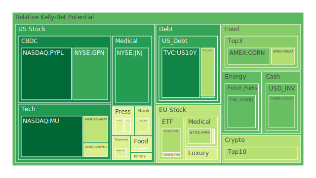
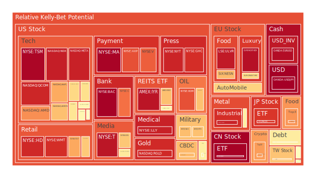
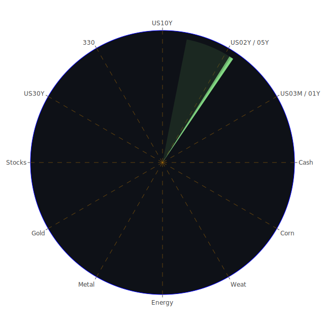

# **投資商品泡沫分析**

當前全球金融市場呈現高度複雜且分歧的局面。在深入探討各類資產的潛在泡沫風險之前，我們必須認識到，市場價格的波動，無論多麼劇烈，本質上是多方因素交互作用下的自然現象，其中包含了經濟基本面、社會情緒、群體心理以及參與者間的博弈行為。本報告旨在客觀分析，不帶任何偏見地解讀數據，並從中尋找潛在的規律與機會。

我們觀察到，自2025年5月21日至5月23日，部分資產的泡沫指數呈現波動，但整體而言，特定領域的風險警示依然顯著。聯準會的經濟數據透露出複雜的信號：一方面，有效聯邦基金利率成交量(EFFR Volume)上升，貨幣市場基金總資產(Money Market Funds Total Assets)增加，顯示市場流動性尋求避風港；另一方面，聯準會總資產(FED Total Assets)下降，美國公債總流通量(US Treasury total circulation)減少，暗示縮表的持續。同時，商業房地產和消費者的拖欠率(Delinquent rates)處於相對高位，高收益債券利率(High Yield Bond Interest Rate)亦然，這些均是潛在的信用風險指標。然而，信用卡相關的壞帳率(Charge-off Rate)和拖欠率卻處於相對低位，顯示消費信貸的特定領域仍具韌性。通膨方面，消費者物價指數年增率(CPIYOY)為2.33%，相較去年同期的3.33%有所回落，但聯準會近期一次的鷹派發言（2025年4月14日後），以及各年期美債殖利率（如10年期美債殖利率 USTreasury10YYield 在5月23日為4.53%）相較去年仍處高位，表明市場對未來利率路徑及通膨持續性的擔憂未減。黃金石油比(GOLD OIL RATIO)為54.34，遠高於去年的30.52，反映了避險情緒或對特定商品供需失衡的預期。

新聞方面，市場持續受到關稅問題的困擾（負面影響95%），特別是針對美國聯邦住房官員質疑FICO定價、日本製造商信心受挫以及穆薩勒姆警告關稅對經濟的「重大」影響等事件。科技股財報則好壞參半，Palo Alto Networks和Keysight業績超預期（正面影響94%），但整體市場情緒因關稅問題及對聯準會夏季降息的希望降溫而承壓。地緣政治方面，伊朗核談判、加薩衝突等事件持續帶來不確定性。這些宏觀背景構成了我們分析各類資產泡沫的基石。

* **美國國債 (US Treasuries)**

美國國債市場呈現出期限結構的微妙變化。截至2025年5月23日，短期國債如1年期 (US01Y) 現價4.13，泡沫指數 D1​ 為0.3579，D7​ 為0.3660，D30​ 為0.4459。3個月期 (US03MY) 現價4.35，泡沫指數 D1​ 為0.5264，D7​ 為0.3597，D30​ 為0.3076。值得注意的是，3個月期國債的月平均泡沫分數相對較低。中期國債如2年期 (US02Y) 現價3.99，泡沫指數 D1​,D7​,D14​,D30​ 均為0.6099，顯示其風險評估在短期內高度一致。5年期 (US05Y) 現價4.09，泡沫指數 D1​,D7​,D14​,D30​ 均為0.4954（PP100為4.09時，D1​ 為0.4954；而當05-22 PP100為4.16時，D1​ 為0.4954，這可能意味著在特定價格區間風險穩定或數據更新頻率問題）。長期國債方面，10年期 (US10Y) 現價4.53，泡沫指數 D1​ 為0.1152，但月平均 D30​ 達0.4163，顯示近期風險有所下降。30年期 (US30Y) 現價5.04，泡沫指數 D1​ 為0.5685，月平均 D30​ 為0.4868。

從經濟學角度看，聯準會持續縮表及鷹派立場對債券價格構成壓力（殖利率上升）。短期國債殖利率高於部分長期國債（如2年期3.99% vs 10年期4.53%，但3個月期4.35%），殖利率曲線雖不再深度倒掛（例如，美債30年期與3個月期利差 USYield30Y−03M 為0.69，去年為-0.97），但市場對未來經濟路徑的預期仍存分歧。社會心理層面，投資者在尋求避險與追求收益之間搖擺，導致不同期限債券吸引力變化。博弈論觀點下，市場參與者預期聯準會的政策路徑，並據此調整倉位。歷史上，利率上升週期往往伴隨債券價格下跌，但若經濟衰退預期增強，長期債券可能因避險需求而受追捧。新聞中關於聯準會官員對夏季降息潑冷水，以及美國公債總流通量下降的數據，均對債券市場構成影響。短期國債因其流動性和相對較高的即期收益，在不確定環境下具有一定吸引力，但整體債市仍面臨利率風險。

* **美國零售股 (US Retail Stocks)**

沃爾瑪 (WMT) 現價95.93，泡沫指數 D1​ 高達0.9109，月平均 D30​ 亦達0.8754。塔吉特 (TGT) 現價95.06，泡沫指數 D1​ 為0.7245，但其 D7​ 和 D14​ 均超過0.9，月平均 D30​ 為0.8901。家得寶 (HD) 現價366.13，泡沫指數 D1​ 為0.9206，月平均 D30​ 為0.7143。好市多 (COST) 現價1018.13，泡沫指數 D1​ 為0.6662，月平均 D30​ 為0.5541。

經濟學上，零售股表現與消費者信心、就業市場及可支配收入密切相關。FED數據中消費者拖欠率上升是個警訊。社會學角度看，消費習慣的改變（如線上購物占比提升）及貧富差距可能影響不同定位零售商的表現。心理學層面，品牌忠誠度和促銷活動的吸引力是關鍵。博弈論觀點，零售商在定價策略、庫存管理及供應鏈優化上持續競爭。新聞中沃爾瑪計劃裁員（05-22，負面95%）的消息，以及整體對經濟前景的擔憂，可能對零售股構成壓力。儘管部分零售股泡沫指數極高，暗示市場可能已過度定價其未來增長，或者反映了其在通膨環境下轉嫁成本的能力。然而，高泡沫分數疊加消費者壓力增大的宏觀背景，風險不容忽視。

* **美國科技股 (US Tech Stocks)**

科技股內部呈現分化。微軟 (MSFT) 現價454.86，泡沫指數 D1​ 為0.5546，月平均 D30​ 為0.6369。蘋果 (AAPL) 現價201.36，泡沫指數 D1​ 為0.7218，月平均 D30​ 為0.6181。亞馬遜 (AMZN) 現價203.10，泡沫指數 D1​ 為0.6835，月平均 D30​ 為0.7199。谷歌 (GOOG) 現價171.98，泡沫指數 D1​ 為0.6189，月平均 D30​ 為0.5762。Meta (META) 現價636.57，泡沫指數 D1​ 高達0.9343，月平均 D30​ 亦達0.8777。特斯拉 (TSLA) 現價341.04，泡沫指數 D1​ 為0.5542，月平均 D30​ 為0.4757，相較其他大型科技股略低，但其股價波動性歷來較大。

從經濟學角度，科技股，特別是成長型科技股，對利率變動高度敏感。聯準會的鷹派立場和高利率環境對其估值構成壓力。然而，AI領域的突破性進展為相關公司（如谷歌更新AI搜索產品，正面87%）注入了強勁的增長預期，這在心理學上產生了強烈的FOMO（害怕錯過）情緒。社會學上，科技對生活的滲透持續加深，使得這些公司具有強大的市場影響力。博弈論觀點，科技巨頭在AI、雲計算、元宇宙等領域展開激烈競爭與合作。歷史上，科技泡沫（如2000年網路泡沫）提醒我們非理性繁榮的風險。當前，部分科技股，尤其是與AI緊密相關的，泡沫指數居高不下，反映了市場對其未來顛覆性潛力的極高期望，但也累積了顯著的回調風險，特別是在宏觀經濟逆風（如關稅問題）加劇時。

* **美國房地產指數 (US Real Estate Index)**

VNQ (Vanguard Real Estate ETF) 現價87.00，泡沫指數 D1​ 為0.5593，月平均 D30​ 為0.4347。IYR (iShares U.S. Real Estate ETF) 現價92.14，泡沫指數 D1​ 為0.9594，月平均 D30​ 為0.7910。RWO (SPDR Dow Jones REIT ETF) 現價43.19，泡沫指數 D1​ 為0.6832，月平均 D30​ 為0.5221。

房地產市場與利率、信貸條件及經濟增長密切相關。FED數據顯示30年期固定抵押貸款利率 (Fixed Mortgage 30Y Rate) 高達6.86%，遠超去年的2.95%，對房地產需求構成顯著抑制。商業房地產和總體房地產的拖欠率均處於高位，是重要的風險信號。經濟學上，高昂的融資成本和潛在的經濟放緩不利於房地產估值。社會學角度，居家辦公趨勢對商業地產（特別是辦公樓）的長期需求產生結構性影響。心理層面，對房價下跌的預期可能導致持幣觀望。博弈論觀點，開發商、貸方和購房者在不斷變化的市場環境中調整策略。歷史上，房地產泡沫的破裂（如2008年）曾引發系統性金融危機。新聞中，聯邦住房官員質疑FICO定價（負面95%）可能影響信貸可獲得性。考慮到高利率、高拖欠率以及部分房地產ETF的高泡沫指數（尤其是IYR），美國房地產市場的下行風險值得高度警惕。

* **加密貨幣 (Cryptocurrencies)**

比特幣 (BTCUSD) 現價111543.00，泡沫指數 D1​ 為0.7420，月平均 D30​ 為0.5090。以太坊 (ETHUSD) 現價2658.03，泡沫指數 D1​ 為0.4209，月平均 D30​ 為0.4692。狗狗幣 (DOGEUSD) 現價0.2454，泡沫指數 D1​ 為0.3468，月平均 D30​ 為0.4721。

加密貨幣作為一種新興資產類別，其價格波動劇烈，深受市場情緒、監管政策及技術進展影響。經濟學上，其「價值儲存」或「交易媒介」的屬性仍在辯論中。社會學角度，加密社群的共識和網路效應是其價格的重要支撐。心理學層面，FOMO和恐慌性拋售在加密市場尤為明顯。博弈論觀點，早期採用者、大型持有者（巨鯨）和散戶之間的博弈影響市場動向。新聞中提到「一項重要的加密法案正在推進，懷疑論者認為這是一場緩慢移動的車禍」（負面72%），反映了監管不確定性帶來的風險。歷史上，加密市場經歷多次暴漲暴跌。目前比特幣的泡沫指數相對較高，而以太坊和狗狗幣的月平均泡沫度處於中等水平，但整個行業的高波動性和監管風險使其本質上屬於高風險投資。

* **金/銀/銅 (Gold/Silver/Copper)**

黃金 (XAUUSD) 現價3295.00，泡沫指數 D1​ 為0.5788，月平均 D30​ 為0.5474。白銀 (XAGUSD) 現價33.05，泡沫指數 D1​ 高達0.9335，月平均 D30​ 亦達0.9031。銅 (COPPER) 現價4.68，泡沫指數 D1​ 為0.5252，月平均 D30​ 為0.5522。

貴金屬通常被視為避險資產和通膨對沖工具。黃金和白銀的高泡沫指數，特別是白銀的極高讀數，反映了市場強烈的避險需求或對通膨的擔憂，也可能包含地緣政治風險溢價（如伊朗核談判、加薩衝突）。FED數據中，黃金石油比和黃金銅比均處於高位，也印證了黃金的相對強勢。經濟學上，實際利率（名目利率減去通膨預期）是影響黃金價格的關鍵因素。社會心理層面，對法定貨幣信心下降時，貴金屬吸引力上升。博弈論觀點，央行購金行為、大型基金的配置決策均影響市場。歷史上，地緣政治緊張或經濟危機時期，貴金屬往往表現良好。銅作為工業金屬，其價格與全球經濟活動密切相關，其泡沫指數處於中等偏高水平，可能反映了對未來經濟復甦或特定領域（如綠色能源轉型）需求的預期，但也需警惕全球經濟放緩的風險。阿根廷批准力拓鋰礦項目（正面68%）和哥倫比亞Ecopetrol收購可再生能源公司（正面63%）等新聞，間接反映了對能源轉型相關金屬的需求。

* **黃豆 / 小麥 / 玉米 (Soybeans/Wheat/Corn)**

黃豆 (SOYB) 現價22.13，泡沫指數 D1​ 為0.7531，月平均 D30​ 為0.6583。小麥 (WEAT) 現價4.64，泡沫指數 D1​ 為0.3621，月平均 D30​ 為0.4197。玉米 (CORN) 現價18.61，泡沫指數 D1​ 為0.2576，月平均 D30​ 為0.4402。

農產品價格受天氣、地緣政治、能源價格（影響化肥和運輸成本）及全球供需關係影響。經濟學上，美元匯率、政府補貼政策也扮演重要角色。社會學角度，糧食安全問題日益受到重視。心理學層面，對未來供應短缺的擔憂可能引發囤積行為和價格上漲。博弈論觀點，主要出口國的貿易政策、大型農業公司的套期保值行為均影響市場。日本農林水產大臣因米價問題辭職（負面93%），以及日本首相石破茂因米價飆升支持率創新低（負面90%）等新聞事件，突顯了農產品價格對社會和政治的敏感性。黃豆的泡沫指數相對較高，可能與特定地區的供需失衡或投機活動有關。小麥和玉米的泡沫指數則相對溫和，但仍需關注氣候變化和地緣政治對全球糧食供應鏈的潛在衝擊。

* **石油/ 鈾期貨 (Oil/Uranium Futures)**

美國原油 (USOIL) 現價60.79，泡沫指數 D1​ 為0.2402，月平均 D30​ 為0.2790，顯示其泡沫風險相對較低。鈾期貨 (UX1\!) 現價70.40，泡沫指數 D1​ 為0.5107，月平均 D30​ 為0.4977。

石油價格受OPEC+產量政策、全球經濟增長（影響需求）、地緣政治風險（影響供應）及能源轉型趨勢等多重因素影響。鈾作為核燃料，其價格與核電發展前景、地緣政治（如對俄羅斯鈾供應的依賴）及礦產勘探開採情況相關。經濟學上，能源價格是通膨的重要組成部分。社會學角度，能源安全和氣候變化是全球共同面臨的挑戰。心理層面，對能源短缺的恐慌可能導致價格飆升。博弈論觀點，產油國之間的合作與競爭，以及大國在核能領域的戰略佈局，均對價格產生深遠影響。伊朗核談判的進展（伊朗警告若濃縮鈾需求不被滿足則談判將失敗，負面94%）可能影響石油供應預期。哥倫比亞Ecopetrol收購挪威Statkraft的10家再生能源公司（正面63%）等新聞則反映了能源轉型的長期趨勢。石油的低泡沫指數可能反映了市場對全球經濟放緩的擔憂或OPEC+維持供應的預期，而鈾的中等泡沫指數則可能體現了對核能復興的期待與供應鏈風險的交織。

* **各國外匯市場 (Foreign Exchange Markets)**

歐元兌美元 (EURUSD) 現價1.1300，泡沫指數 D1​ 高達0.9740，月平均 D30​ 亦達0.9275。英鎊兌美元 (GBPUSD) 現價1.3400，泡沫指數 D1​ 為0.5262，月平均 D30​ 為0.4659。澳元兌美元 (AUDUSD) 現價0.6400，泡沫指數 D1​ 為0.2511，月平均 D30​ 為0.3035。美元兌日元 (USDJPY) 現價143.97，泡沫指數 D1​ 達到1.0000（最高值），月平均 D30​ 為0.7246。

外匯市場的波動反映了各國經濟基本面、利率差異、資本流動及市場情緒的變化。EURUSD和USDJPY的極高泡沫指數值得高度關注。經濟學上，利差是驅動匯率的重要因素，聯準會的鷹派立場相對於其他央行（如潛在的日本央行鴿派立場）可能持續支撐美元。社會心理層面，對一國經濟前景的信心直接影響其貨幣價值。博弈論觀點，各國央行在匯率政策上的干預與表態，以及大型投機者的倉位調整，共同塑造市場走勢。期權交易者看空美元的觀點達到創紀錄水平（新聞，正面94%），這與USDJPY的極高泡沫指數似乎存在矛盾，可能預示著市場預期美元強勢已達極致，或特定貨幣對的特殊驅動因素。歐洲與英國關係「重置」（正面78%）等政治新聞可能對歐元和英鎊產生影響。高泡沫指數通常意味著該貨幣對的現行趨勢可能已過度延伸，積累了反轉風險。

* **各國大盤指數 (Major Global Indices)**

美國納斯達克100指數 (NDX) 現價21112.47，泡沫指數 D1​ 為0.9403，月平均 D30​ 為0.7654。德國DAX指數 (GDAXI) 現價24053.60，泡沫指數 D1​ 為0.3547，月平均 D30​ 為0.5268。英國富時100指數 (FTSE) 現價8754.30，泡沫指數 D1​ 為0.5317，月平均 D30​ 為0.5517。法國CAC40指數 (FCHI) 現價7877.80，泡沫指數 D1​ 為0.4756，月平均 D30​ 為0.5823。日本日經225指數 (JPN225) 現價37222.33，泡沫指數 D1​ 為0.8986，月平均 D30​ 為0.7979。中國滬深300指数 (000300) 現價3913.87，泡沫指數 D1​ 高達0.9964，月平均 D30​ 為0.6541。台灣加權股價指數0050 (0050) 現價181.60，泡沫指數 D1​ 為0.6756，月平均 D30​ 為0.6349。

全球主要股指的泡沫程度不一，但美國、日本和中國的股指泡沫指數偏高。經濟學角度，股指受企業盈利、利率水平、通膨預期和經濟增長前景的綜合影響。社會心理層面，投資者情緒（樂觀或悲觀）對市場短期波動有顯著放大作用。博弈論觀點，指數基金的被動投資與主動管理型基金的策略互動，以及跨市場套利行為，共同影響指數表現。新聞中，標普500指數因稅改法案和美債收益率飆升而下跌（負面96%），以及對川普稅單的擔憂（負面95%），顯示政策不確定性對市場的壓力。日本製造商因川普關稅行動信心下降（負面95%）則直接影響日經指數。滬深300指數的高泡沫讀數，在中國經濟面臨自身挑戰的背景下，尤其值得關注。高泡沫指數意味著市場可能對未來盈利增長給予了過高預期，或存在流動性驅動的成分，一旦基本面不及預期或流動性收緊，調整風險較大。

* **美國半導體股 (US Semiconductor Stocks)**

輝達 (NVDA) 現價132.83，泡沫指數 D1​ 為0.4369，月平均 D30​ 為0.6505。超微 (AMD) 現價110.71，泡沫指數 D1​ 為0.7618，月平均 D30​ 為0.6522。英特爾 (INTC) 現價20.55，泡沫指數 D1​ 為0.6048，月平均 D30​ 為0.5039。高通 (QCOM) 現價147.37，泡沫指數 D1​ 高達0.9259，月平均 D30​ 亦達0.8326。美光 (MU) 現價94.83，泡沫指數 D1​ 僅為0.0574，月平均 D30​ 為0.3553，相對較低。應用材料 (AMAT) 現價160.52，泡沫指數 D1​ 為0.3819，月平均 D30​ 為0.6737。科磊 (KLAC) 現價767.51，泡沫指數 D1​ 為0.5296，月平均 D30​ 為0.5439。博通 (AVGO) 現價230.53，泡沫指數 D1​ 為0.6368，月平均 D30​ 為0.8168。台積電 (TSM) ADR現價196.19，泡沫指數 D1​ 高達0.9874，月平均 D30​ 亦達0.9802，處於極高水平。

半導體行業受益於AI、5G、物聯網等長期趨勢，但也具有週期性。經濟學上，其景氣度與全球電子產品需求、資本支出週期密切相關。社會心理層面，對新技術的期待往往推高龍頭企業估值。博弈論觀點，晶片設計、製造、設備供應商之間存在複雜的競合關係。台積電和高通的極高泡沫指數，以及博通和AMD的偏高指數，反映了市場對AI驅動的半導體需求極度樂觀。然而，行業面臨地緣政治風險（如晶片禁令）、庫存調整壓力及潛在的產能過剩問題。美光的泡沫指數相對較低，可能反映了其在記憶體市場的特定週期位置。整體而言，半導體板塊在享受高成長預期的同時，也積聚了較高的估值風險。

* **美國銀行股 (US Bank Stocks)**

摩根大通 (JPM) 現價260.67，泡沫指數 D1​ 為0.4379，月平均 D30​ 為0.7482。美國銀行 (BAC) 現價43.31，泡沫指數 D1​ 高達0.9961，月平均 D30​ 亦達0.9492。花旗集團 (C) 現價73.42，泡沫指數 D1​ 為0.8069，月平均 D30​ 為0.8617。第一資本 (COF) 現價188.56，泡沫指數 D1​ 為0.4458，月平均 D30​ 為0.5122。

銀行股的盈利能力受淨息差、貸款增長、信貸品質及監管環境影響。經濟學上，利率上升初期有利於擴大淨息差，但若導致經濟衰退，則壞帳風險上升。FED數據顯示商業地產和消費者拖欠率上升，對銀行資產品質構成潛在威脅。社會心理層面，對金融系統穩定性的信心至關重要。博弈論觀點，大型銀行在市場份額、金融創新和風險管理方面持續競爭。美國銀行和花旗集團的泡沫指數極高，摩根大通也處於偏高水平，這可能反映了市場對其在利率正常化環境下盈利能力的樂觀預期，或者在經濟數據好於預期時的風險偏好回升。然而，美國銀行總存款處於高位，但商業地產和消費者拖欠率亦在高位，暗示潛在風險。新聞中，美國有望在2025年底達到存款保險基金目標比率（正面80%），這對銀行業是正面消息。但高泡沫指數警示我們需關注其可持續性。

* **美國軍工股 (US Defense Stocks)**

洛克希德馬丁 (LMT) 現價470.45，泡沫指數 D1​ 為0.4792，月平均 D30​ 為0.7453。諾斯洛普格魯曼 (NOC) 現價472.88，泡沫指數 D1​ 為0.6870，月平均 D30​ 為0.6784。雷神技術 (RTX) 現價134.07，泡沫指數 D1​ 為0.6807，月平均 D30​ 為0.8340。

軍工股受益於地緣政治緊張局勢和國防預算增加。經濟學上，國防開支相對獨立於經濟週期，具有一定防禦性。社會心理層面，國際衝突和安全威脅提升了對軍工產品的需求預期。博弈論觀點，國家間的軍備競賽和軍工企業間的訂單爭奪是主要特徵。歷史上，戰爭或地區衝突時期，軍工股往往表現突出。新聞中持續的加薩衝突、伊朗核問題等地緣政治熱點，為軍工股提供了持續的催化劑。雷神技術和洛克希德馬丁的月平均泡沫指數偏高，諾斯洛普格魯曼也處於中高水平，反映市場已將地緣政治溢價計入股價。

* **美國電子支付股 (US Electronic Payment Stocks)**

Visa (V) 現價357.97，泡沫指數 D1​ 為0.8341，月平均 D30​ 為0.7785。萬事達卡 (MA) 現價570.14，泡沫指數 D1​ 高達0.9928，月平均 D30​ 為0.8159。PayPal (PYPL) 現價71.45，泡沫指數 D1​ 僅0.0628，月平均 D30​ 為0.7772，其日泡沫度與月平均差異巨大，值得關注。環匯公司 (GPN) 現價75.72，泡沫指數 D1​ 為0.1909，月平均 D30​ 為0.3973。美國運通 (AXP) 現價287.18，泡沫指數 D1​ 為0.8559，月平均 D30​ 為0.8478。

電子支付行業受益於現金交易向數位支付的長期轉型。經濟學上，其收入與消費支出和交易量密切相關。社會學角度，支付便捷性和安全性是推動用戶採納的關鍵。心理層面，品牌信任度和用戶習慣影響市場份額。博弈論觀點，支付網路的規模效應和不同支付方式間的競爭是核心。Visa、萬事達卡和美國運通的泡沫指數均處於高位，顯示市場對其寡占地位和持續增長的高度認可。PayPal的 D1​ 很低，但 D30​ 很高，表明近期其泡沫風險快速下降，但之前累積的風險仍不低，可能與其面臨日益激烈的競爭環境有關。

* **美國藥商股 (US Pharmaceutical Stocks)**

嬌生 (JNJ) 現價152.61，泡沫指數 D1​ 為0.1642，月平均 D30​ 為0.2242，泡沫風險相對較低。默克 (MRK) 現價77.84，泡沫指數 D1​ 為0.3668，月平均 D30​ 為0.4475。禮來 (LLY) 現價715.20，泡沫指數 D1​ 高達0.9344，月平均 D30​ 亦達0.9335，處於極高水平。諾和諾德 (NVO) 現價68.17，泡沫指數 D1​ 為0.4789，月平均 D30​ 為0.5711。

大型藥企通常具有防禦性，因藥品需求相對剛性。但同時也受藥品專利到期、研發成功率及藥價政策影響。禮來和諾和諾德因其在減肥藥等重磅產品上的突破，股價和泡沫指數均處於高位，反映市場對其革命性產品的極高期望。經濟學上，醫療保健支出是各國政府預算的重要組成部分。社會學角度，人口老化和慢性病增加帶來持續的藥品需求。心理層面，對突破性療法的期待推高相關公司估值。博弈論觀點，藥企在研發競賽、市場推廣和專利保護方面投入巨大。嬌生和默克的泡沫指數相對較低，可能反映其產品線較為成熟和多元化。南韓誓言支持生物製藥和汽車行業以應對美國關稅（正面94%）的新聞，間接反映了生物製藥行業的戰略重要性。

* **美國影視股 (US Film and Television Stocks)**

奈飛 (NFLX) 現價1187.97，泡沫指數 D1​ 為0.5925，月平均 D30​ 為0.4902。迪士尼 (DIS) 現價111.13，泡沫指數 D1​ 為0.6703，月平均 D30​ 為0.7167。派拉蒙全球 (PARA) 現價11.86，泡沫指數 D1​ 為0.5028，月平均 D30​ 為0.4803。

影視行業面臨串流媒體競爭加劇、內容成本上升及消費者偏好轉變的挑戰。經濟學上，訂閱用戶增長、廣告收入和內容庫價值是關鍵指標。社會學角度，文化產品的全球傳播和在地化是重要趨勢。心理層面，熱門IP的吸引力和用戶黏性決定平台價值。博弈論觀點，各大平台在內容採購、定價策略和用戶獲取上激烈博弈。迪士尼的泡沫指數偏高，奈飛和派拉蒙全球處於中等水平。行業整體在從傳統模式向串流媒體轉型的過程中，盈利模式和競爭格局仍在不斷演變。

* **美國媒體股 (US Media Stocks)**

康卡斯特 (CMCSA) 現價34.59，泡沫指數 D1​ 為0.4560，月平均 D30​ 為0.4504。紐約時報 (NYT) 現價54.89，泡沫指數 D1​ 高達0.9290，月平均 D30​ 為0.7487。福斯公司 (FOX) 現價50.51，泡沫指數 D1​ 為0.4648，但其 D7​,D14​,D30​ 均在0.84以上，顯示近期風險有下降但前期累積風險高。

傳統媒體面臨數位化轉型的挑戰，廣告收入和發行量受到新媒體衝擊。紐約時報的高泡沫指數可能反映了其在數位訂閱轉型上的成功以及作為權威新聞來源的品牌價值。經濟學上，廣告市場景氣度和用戶付費意願是主要收入來源。社會學角度，媒體在輿論形成和資訊傳播中扮演重要角色。心理層面，內容的公信力和吸引力是核心競爭力。博弈論觀點，傳統媒體與新興數位平台在爭奪用戶注意力和廣告預算。

* **石油防禦股 (Oil Defensive Stocks)**

埃克森美孚 (XOM) 現價102.97，泡沫指數 D1​ 為0.8563，月平均 D30​ 為0.8140。西方石油 (OXY) 現價41.08，泡沫指數 D1​ 為0.6819，月平均 D30​ 為0.7432。

大型綜合石油公司在油價上漲時受益，同時其多元化業務和穩定股息使其具有一定防禦性。其高泡沫指數可能反映了市場對能源價格持續高位或地緣政治風險溢價的預期。經濟學上，其盈利與油氣價格、煉油利潤和化工產品需求相關。社會學角度，能源轉型對其長期戰略構成挑戰。心理層面，投資者在尋求通膨對沖時可能青睞此類股票。博弈論觀點，這些公司在產能投資、技術研發和應對氣候政策方面做出戰略選擇。

* **金礦防禦股 (Gold Mining Defensive Stocks)**

皇家黃金 (RGLD) 現價176.73，泡沫指數 D1​ 高達0.9197，月平均 D30​ 亦達0.9261。

金礦股與黃金價格高度相關，但在金價上漲時通常具有更大的彈性。其極高的泡沫指數反映了市場對黃金持續強勢的極度樂觀預期，以及金礦公司潛在的盈利槓桿。經濟學上，開採成本、礦產儲量和政治風險是影響其價值的因素。社會心理層面，其表現緊隨黃金的避險情緒。博弈論觀點，金礦公司在勘探、併購和成本控制方面競爭。

* **歐洲奢侈品股 (European Luxury Goods Stocks)**

愛馬仕 (RMS) 現價2437.00，泡沫指數 D1​ 為0.4356，月平均 D30​ 為0.6132。LVMH (MC) 現價485.10，泡沫指數 D1​ 為0.6346，月平均 D30​ 為0.4738。開雲集團 (KER) 現價175.52，泡沫指數 D1​ 高達0.9678，月平均 D30​ 為0.7863。

奢侈品行業對經濟週期較為敏感，但頂級品牌具有較強的定價能力和品牌忠誠度。開雲集團的高泡沫指數值得警惕，愛馬仕和LVMH也處於中高水平。經濟學上，全球高淨值人群的財富效應和新興市場中產階級的崛起是主要驅動因素。社會學角度，奢侈品消費與社會地位和身份認同相關。心理層面，品牌稀缺性和 aspirational value 是關鍵。博弈論觀點，各大奢侈品集團在品牌塑造、市場擴張和設計創新上競爭。

* **歐洲汽車股 (European Auto Stocks)**

寶馬 (BMW) 現價78.16，泡沫指數 D1​ 為0.6818，月平均 D30​ 為0.5578。賓士 (MBG) 現價52.64，泡沫指數 D1​ 為0.5080，月平均 D30​ 為0.4978。保時捷 (PAH3) 現價37.35，泡沫指數 D1​ 為0.5935，月平均 D30​ 為0.5850。

歐洲汽車股面臨電動化轉型、來自中國製造商的競爭以及日益嚴格的環保法規等挑戰。其泡沫指數處於中等水平，可能反映了市場對這些挑戰的擔憂與對其品牌價值和技術實力的認可之間的平衡。南韓誓言支持汽車行業應對美國關稅（正面94%）的新聞，也從側面反映了全球汽車行業面臨的貿易壁壘問題。

* **歐美食品股 (European and American Food Stocks)**

卡夫亨氏 (KHC) 現價26.50，泡沫指數 D1​ 為0.4572，月平均 D30​ 為0.7303。雀巢 (NESN) 現價88.15，泡沫指數 D1​ 為0.6953，月平均 D30​ 為0.5582。可口可樂 (KO) 現價71.14，泡沫指數 D1​ 為0.5817，月平均 D30​ 為0.6539。聯合利華 (ULVR) 現價4712.00，泡沫指數 D1​ 高達0.9480，月平均 D30​ 亦達0.9422。

食品股通常被視為防禦性投資，因其需求相對穩定。然而，它們也面臨成本上漲（原材料、運輸）、消費者偏好轉向健康食品以及零售商議價能力的壓力。聯合利華和卡夫亨氏的泡沫指數偏高，雀巢和可口可樂也處於中高水平，可能反映了其品牌實力和在全球市場的定價能力，但也需警惕成本壓力對利潤的侵蝕。

# **宏觀經濟傳導路徑分析**

當前宏觀經濟環境的核心特徵是：聯準會持續縮表並釋放鷹派信號，通膨雖有回落但仍高於目標，多國政府債務高企，地緣政治衝突頻發，以及全球貿易關係緊張（特別是關稅問題）。

這一系列因素通過以下路徑傳導：

1. **利率路徑**：聯準會鷹派立場 \-\> 市場預期利率在更長時間內保持高位 \-\> 推高各期限美國國債殖利率 \-\> 增加企業融資成本（尤其是高收益債券利率高企） \-\> 抑制投資和消費（30年期抵押貸款利率高達6.86%） \-\> 對利率敏感型資產（如成長型科技股、房地產）估值構成壓力。  
2. **通膨路徑**：地緣政治衝突（影響能源和糧食供應）、貿易保護主義（關稅推高進口成本） \-\> 維持通膨壓力 \-\> 促使央行維持緊縮政策 \-\> 侵蝕消費者購買力 \-\> 影響企業利潤（除非能有效轉嫁成本）。FED數據中CPIYOY為2.33%，似乎溫和，但黃金石油比高企，以及聯準會的鷹派言論，顯示對通膨的擔憂未完全消除。  
3. **信用路徑**：高利率和經濟放緩預期 \-\> 企業和消費者償債壓力加大（商業地產、消費者、房地產拖欠率高） \-\> 銀行信貸品質擔憂（儘管目前信用卡壞帳率低） \-\> 信貸條件收緊 \-\> 進一步抑制經濟活動。  
4. **全球貿易與供應鏈路徑**：關稅戰（新聞中多次提及，負面影響強烈）和地緣政治 \-\>擾亂全球供應鏈 \-\> 增加企業運營成本 \-\> 降低部分出口導向型經濟體（如日本製造商）的信心 \-\> 影響跨國公司盈利。  
5. **市場情緒與預期路徑**：負面新聞（關稅、地緣衝突、企業裁員如沃爾瑪）與正面新聞（部分科技公司財報超預期、AI進展）交織 \-\> 市場情緒波動 \-\> 影響資產價格的短期波動和風險溢價。高泡沫資產在負面情緒衝擊下更易發生大幅回調。

從空間維度看（Spatial Trinity \- 正反合），市場呈現高成長預期（如AI科技股，正方）與宏觀經濟逆風（高利率、關稅，反方）的拉鋸，其合力表現在資產價格的高度分化和部分領域的顯著泡沫。時間維度（Temporal Trinity）上，短期數據波動（如每日泡沫指數變化）與長期趨勢（如聯準會縮表、債務/GDP上升）並存，市場在消化短期消息的同時，也在逐步定價長期結構性變化。概念維度（Conceptual Trinity）上，傳統經濟理論（如利率與估值關係）與新興現象（如加密貨幣的崛起、AI的顛覆性影響）相互碰撞，挑戰投資者的認知框架。

# **微觀經濟傳導路徑分析**

企業層面的微觀經濟活動也存在複雜的傳導路徑：

1. **成本傳導**：原材料價格上漲（如部分大宗商品）、勞動力成本上升、融資成本增加 \-\> 企業成本壓力加大 \-\> 若無法有效轉嫁給消費者（取決於品牌定價能力和市場競爭格局） \-\> 擠壓企業利潤率 \-\> 影響股價表現。例如，食品股（KHC, ULVR）和零售股（WMT, TGT）均面臨此壓力。  
2. **需求傳導**：消費者信心（受就業、收入、通膨影響）和企業投資意願 \-\> 影響產品和服務的需求 \-\> 訂單量和銷售收入變化 \-\> 企業盈利預期調整。例如，零售數據、汽車銷售、科技產品出貨量等均是重要觀察指標。  
3. **創新與競爭傳導**：技術創新（如AI、生物科技領域的禮來減肥藥） \-\> 創造新的市場需求和增長點 \-\> 推動領先企業股價上漲（如NVDA, LLY的高泡沫） \-\> 加劇行業競爭 \-\> 可能導致部分傳統企業被淘汰或面臨轉型壓力（如傳統媒體CMCSA, PARA）。新聞中Palo Alto Networks和Keysight的強勁業績源於其在下一代安全和通信領域的需求。  
4. **供應鏈韌性傳導**：地緣政治和貿易摩擦 \-\> 企業重新評估供應鏈安全 \-\> 可能導致供應鏈多元化或區域化 \-\> 增加短期成本但提升長期韌性。半導體行業（TSM, INTC）對此尤為敏感。  
5. **企業特定事件傳導**：財報發布（如Palo Alto, Keysight超預期；Daily Journal, Toll Brothers等快照顯示業績壓力）、併購活動、管理層變動、法律訴訟、裁員（如沃爾瑪） \-\> 直接影響該公司股價 \-\> 並可能通過行業上下游或競爭對手產生漣漪效應。

從經濟學角度，企業追求利潤最大化，會在成本、定價和投資間進行權衡。社會學角度，企業的社會責任、品牌形象和勞資關係影響其長期發展。心理學角度，管理層的信心、市場對企業故事的認可以及投資者對特定「賽道」的狂熱，均是股價的重要驅動因素。博弈論視角下，企業在市場中的定位、與競爭對手的策略互動（如價格戰、技術競賽）決定了其市場份額和盈利能力。

# **資產類別間傳導路徑分析**

不同資產類別之間並非孤立存在，而是通過多種路徑相互影響，形成複雜的漣漪效應網絡：

1. **利率與股債關係**：美債殖利率（特別是10年期實際利率）是全球資產定價之錨。殖利率上升 \-\> 債券價格下跌，同時提高企業借貸成本和折現率 \-\> 對股票估值（尤其是成長股）構成壓力。反之，若市場預期經濟衰退導致降息，資金可能從股市流入債市避險。  
2. **美元與大宗商品/新興市場**：美元走強（如USDJPY的強勢） \-\> 通常對以美元計價的大宗商品（如黃金、石油）構成壓力（儘管近期黃金與美元有時同漲，顯示避險情緒主導）。同時，美元強勢增加新興市場國家的美元債務負擔和資本外流壓力 \-\> 不利於新興市場股債匯。  
3. **石油與通膨/其他資產**：油價上漲 (USOIL) \-\> 推升通膨預期（影響CPI和PPI） \-\> 可能促使央行採取更緊縮政策 \-\> 影響股債。同時，油價上漲增加運輸和生產成本 \-\> 影響航空、物流、製造業等行業利潤，但利好石油開採和相關防禦股 (XOM, OXY)。  
4. **黃金與風險情緒/實際利率**：黃金 (XAUUSD) 通常在市場避險情緒升溫（地緣政治緊張、金融市場動盪）或實際利率下降時上漲。其與股市有時呈負相關（避險功能），有時因通膨預期而同漲。  
5. **科技股與市場情緒/其他成長資產**：大型科技股 (NDX, MSFT, AAPL) 的表現往往引領市場情緒。若科技股強勢，可能帶動整體風險偏好上升，利好其他成長型資產（如部分半導體股、加密貨幣）。反之，科技股回調可能引發市場恐慌。  
6. **房地產與銀行/消費**：房地產市場 (VNQ, IYR) 的下行壓力（如價格下跌、成交量萎縮） \-\> 可能導致抵押貸款違約率上升 \-\> 衝擊銀行資產品質 (BAC, C) \-\> 銀行收緊信貸 \-\> 影響消費者支出和企業投資。  
7. **加密貨幣與投機情緒/科技股**：加密貨幣 (BTCUSD, ETHUSD) 的波動往往與市場的整體投機情緒高度相關，有時也表現出與高風險科技股一定的正相關性。

漣漪效應傳導路徑假設：  
一個可能的傳導路徑是：若美國持續鷹派的貨幣政策及高利率環境，疊加關稅等貿易保護主義措施，導致全球經濟增長顯著放緩（正方：聯準會政策威力，反方：全球經濟韌性，合：增長放緩但避免深度衰退）。這可能觸發：

* **階段一（需求萎縮與避險初期）**：企業盈利預期下調 \-\> 股市（特別是高泡沫的成長股如部分科技股META, TSM，零售股WMT, TGT，以及高風險銀行股BAC）出現顯著回調 \-\> 市場避險情緒升溫 \-\> 資金流向短期美債 (US03MY, US01Y) 和黃金 (XAUUSD)，推高其價格（或使其相對抗跌）。美元 (USDJPY) 可能因避險需求進一步走強（或在高位震盪）。  
* **階段二（信用風險暴露）**：經濟放緩導致企業違約增加（特別是已在高位的商業地產拖欠率） \-\> 信用利差擴大 \-\> 銀行股面臨更大壓力 \-\> 可能引發信貸緊縮 \-\> 進一步拖累實體經濟。  
* **階段三（政策反應與市場尋底）**：經濟數據持續惡化 \-\> 迫使聯準會轉向（降息或停止縮表） \-\> 市場開始預期政策底 \-\> 長期美債 (US10Y, US30Y) 可能率先反彈 \-\> 股市中對利率敏感的優質成長股和估值合理的價值股開始尋底。對經濟復甦敏感的資產如銅 (COPPER) 和部分新興市場資產可能出現轉機。

另一個路徑是AI技術的持續突破和應用普及（正方：技術革命，反方：商業化落地緩慢，合：結構性牛市但伴隨波動）：

* **階段一（AI驅動的局部繁榮）**：AI相關股票（NVDA, MSFT, GOOG, AVGO, TSM）持續吸引資金，泡沫指數維持高位 \-\> 帶動半導體、雲計算等上下游產業鏈景氣 \-\> 納斯達克等科技指數表現強勁。  
* **階段二（分化與擠出效應）**：未能有效應用AI或被AI顛覆的傳統行業面臨壓力 \-\> 資金從傳統行業流向AI領域，加劇市場分化 \-\> 可能出現部分行業的衰退和失業問題。  
* **階段三（泡沫調整或理性增長）**：若AI發展不及預期或宏觀環境惡化 \-\> AI概念股可能出現大幅回調，刺破泡沫。若AI能持續帶來生產力提升和盈利增長 \-\> 則可能轉入更可持續的理性增長階段，並逐步惠及更廣泛的經濟領域。

這兩條路徑並非互斥，可能同時發生或相互交織，使得市場走勢更為複雜。

# **投資建議**

基於上述分析，當前市場環境的關鍵詞是：**高泡沫警示、政策不確定性、地緣政治風險、以及結構性機遇並存**。因此，投資組合的構建應兼顧風險管理與機會捕捉。

**穩健型投資組合 (Conservative Portfolio) \- 總占比 40%**

此組合目標是保本增值，降低波動性，適合風險承受能力較低的投資者。

1. **短期美國國債 (Short-Term US Treasuries \- 如 US01Y, US03MY)**：占比 14%。  
   * **專業論述**：鑑於聯準會短期內維持高利率的可能性較大，短期國債提供了相對具有吸引力的無風險（或低風險）收益。US01Y現價4.13，US03MY現價4.35，其泡沫指數 D1​ 分別為0.3579和0.5264，D30​ 分別為0.4459和0.3076，後者月均泡沫度較低。它們的高流動性也使其成為良好的現金管理工具。  
2. **黃金 (Gold \- XAUUSD)**：占比 13%。  
   * **專業論述**：黃金現價3295.00，泡沫指數 D1​ 為0.5788，D30​ 為0.5474。在通膨預期、地緣政治不確定性及潛在金融系統風險的背景下，黃金的避險屬性和價值儲存功能凸顯。FED數據顯示黃金石油比和黃金銅比均處於歷史高位，反映其相對強勢。雖然泡沫指數中等偏高，但作為對沖尾部風險的工具，仍具配置價值。  
3. **防禦型大型製藥股 (Defensive Large-Cap Pharmaceutical Stock \- 如 JNJ)**：占比 13%。  
   * **專業論述**：嬌生 (JNJ) 現價152.61，泡沫指數 D1​ 為0.1642，D30​ 為0.2242，泡沫風險相對較低。大型製藥公司通常擁有穩定的現金流、較高的股息支付以及不受經濟週期影響的產品需求。在市場波動加劇時，此類股票往往表現出較強的防禦性。

**成長型投資組合 (Growth Portfolio) \- 總占比 35%**

此組合目標是在可控風險下追求較高回報，適合具有一定風險承受能力的投資者。

1. **大型科技股（AI相關但估值相對合理者 \- 如 GOOG)**：占比 12%。  
   * **專業論述**：谷歌 (GOOG) 現價171.98，泡沫指數 D1​ 為0.6189，D30​ 為0.5762。雖然科技股整體估值偏高，但AI是長期結構性趨勢，谷歌在AI領域的佈局和應用前景廣闊，且相較部分純粹的AI概念股，其業務更多元化，估值壓力相對較小（但仍需警惕其不低的泡沫指數）。  
2. **德國大盤指數 (German DAX Index \- GDAXI)**：占比 12%。  
   * **專業論述**：GDAXI現價24053.60，泡沫指數 D1​ 為0.3547，D30​ 為0.5268。配置歐洲市場可以分散單一國家風險。德國作為歐洲經濟的火車頭，其藍籌股具有較強的國際競爭力和穩健的盈利能力。相較於美國股指，其泡沫指數目前處於相對溫和水平。  
3. **銅 (Copper \- FX:COPPER)**：占比 11%。  
   * **專業論述**：銅現價4.68，泡沫指數 D1​ 為0.5252，D30​ 為0.5522。銅是重要的工業金屬，被視為全球經濟的「晴雨表」。在全球綠色能源轉型（電動汽車、可再生能源設施）和電氣化趨勢下，銅的長期需求看好。其價格也對通膨有一定的對沖作用。

**高風險投資組合 (High-Risk Portfolio) \- 總占比 25%**

此組合目標是追求高額回報，但同時承擔較高風險和波動性，適合風險承受能力強且對相關領域有較深理解的投資者。

1. **AI焦點半導體股 (AI-Focused Semiconductor Stock \- 如 NVDA)**：占比 9%。  
   * **專業論述**：輝達 (NVDA) 現價132.83，泡沫指數 D1​ 為0.4369，D30​ 為0.6505。作為AI晶片領域的領導者，輝達受益於AI技術的爆發式增長。儘管其估值和泡沫指數已處於高位，但市場對其未來增長仍有極高預期。此項投資需密切關注行業競爭格局和技術迭代風險。  
2. **比特幣 (Bitcoin \- BTCUSD)**：占比 8%。  
   * **專業論述**：比特幣現價111543.00，泡沫指數 D1​ 為0.7420，D30​ 為0.5090。作為市值最大的加密貨幣，比特幣被部分投資者視為「數位黃金」，具有抗通膨和避險屬性，同時也因其高波動性帶來高潛在回報。新聞中提及的加密貨幣監管法案進展是其面臨的主要不確定性之一。  
3. **鈾期貨 (Uranium Futures \- UX1\!)**：占比 8%。  
   * **專業論述**：鈾期貨現價70.40，泡沫指數 D1​ 為0.5107，D30​ 為0.4977。在全球能源轉型和追求能源獨立的背景下，核能作為清潔、穩定的基載電力來源重新受到重視。鈾的供應端相對集中，而需求端有望穩步增長，供需錯配可能帶來價格上漲機會。但同時也需注意核電政策變化和地緣政治對供應的影響。

# **風險提示**

投資有風險，市場總是充滿不確定性。本報告所有分析和建議均基於當前獲取的有限數據和信息，並進行了相應的假設。過去的表現不能預示未來的結果，資產的泡沫指數和價格可能發生劇烈變化。

我們強烈建議投資者在做出任何投資決策前，應充分了解相關風險，結合自身的財務狀況、投資目標、風險承受能力進行獨立思考和判斷。如有需要，應尋求專業的財務顧問意見。市場波動是常態，任何投資都可能產生虧損。請謹慎對待泡沫風險較高的資產，並時刻關注市場動態及宏觀經濟變化。

 
Daily Buy Map:

 
Daily Sell Map:

 
Daily Radar Chart:

 
