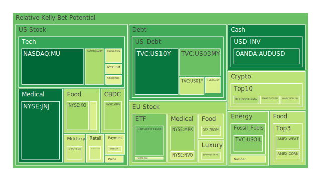
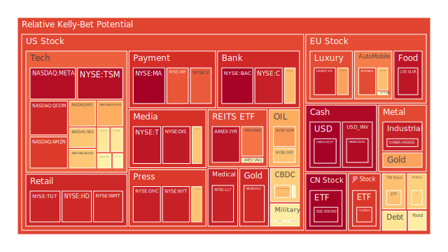
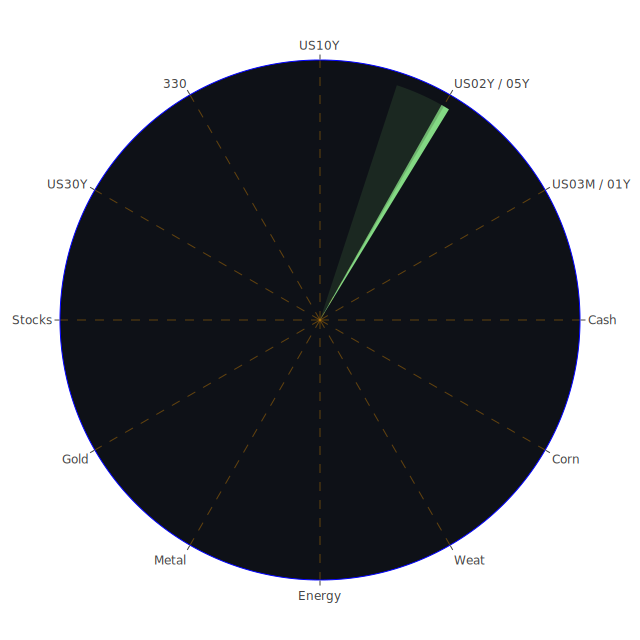

# **投資商品泡沫分析**

在當前複雜的全球經濟環境下，各類資產的估值與潛在風險成為投資者關注的焦點。根據截至2025年5月24日的數據，我們將對一系列關鍵投資商品進行泡沫分析，並結合宏觀經濟數據、市場新聞及相關理論，提供多元視角。我們的分析旨在客觀呈現市場現象，不帶任何偏見與情緒。

**美國國債**

美國國債市場近期波動顯著。以十年期美國國債 (US10Y) 為例，其當日現價為4.51，泡沫指數D1為0.1015，月平均風險分數D30為0.4068。短期國債如三個月期 (US03MY) 現價4.34，D1為0.2662，D30為0.3078；一年期 (US01Y) 現價4.15，D1為0.4098，D30為0.4452；二年期 (US02Y) 現價3.99，D1與D30均為0.6099，顯示中短期債券風險感知有所分歧，但二年期呈現持續的較高風險讀數。五年期 (US05Y) 現價4.08，D30為0.4912；三十年期 (US30Y) 現價5.03，D1為0.4480，D30為0.4868。

從經濟學角度觀察，聯邦儲備系統（FED）的總資產持續下降，暗示著縮表的持續。高收益債券利率處於相對高位，商業房地產及消費貸款的拖欠率亦在高位，這些都對債券市場構成壓力。FED近期一次鷹派發言，也強化了市場對利率可能維持高檔的預期。新聞方面，2025年5月22日有報導指出美國國債拍賣需求疲軟，顯示投資者對潛在稅改法案及財政赤字的擔憂。這從社會心理學角度看，可能反映了市場信心的脆弱。歷史上，政府債務高企且利率上升的時期，債券市場往往面臨較大不確定性。目前殖利率曲線10年期與3個月期利差 (US Yield 10Y-03M) 為0.16，雖已轉正，但相較去年同期的-1.20，變化劇烈，顯示市場對短期經濟前景的預期有所調整，但仍未完全擺脫衰退擔憂的陰影。博弈論觀點下，FED的政策與市場預期之間持續博弈，任何一方的超預期行動都可能引發市場劇烈波動。

**美國零售股**

以沃爾瑪 (WMT) 和塔吉特 (TGT) 為代表的美國零售股，其泡沫指數近期處於高位。WMT現價96.34，D1為0.9208，D30為0.8756；TGT現價94.29，D1為0.9307，D30為0.9100。好市多 (COST) 現價1008.50，D1為0.4335，D30為0.5541，風險讀數相對較低，但仍不可忽視。家得寶 (HD) 現價362.71，D1為0.9229，D30為0.7251。

經濟數據顯示，消費者貸款拖欠率處於高位，信用卡拖欠率雖相對較低但值得關注。2025年5月22日新聞提及沃爾瑪計劃裁員進行重組，以及塔吉特因DEI（多元、平等、包容）抵制活動導致第一季銷售下滑，客流量減少。從社會學角度看，消費者的購物習慣、對企業社會責任的期望，以及“先買後付”貸款償還困難增加等現象，都對零售業績產生實質影響。心理學上，持續的通脹壓力可能削弱消費者信心，即使在必需消費品領域，消費者也可能轉向更廉價的替代品或減少購買頻次。零售業的競爭格局激烈，企業的定價策略與成本控制能力是博弈的關鍵。歷史上，經濟下行週期或高通脹時期，非必需品零售受創較重，必需品零售則相對有韌性，但利潤空間可能受擠壓。

**美國科技股**

科技股板塊內部呈現分化。以大型科技股為例，微軟 (MSFT) 現價450.18，D1為0.6057，D30為0.6361；蘋果 (AAPL) 現價195.27，D1為0.7262，D30為0.6307；谷歌 (GOOG) 現價169.59，D1為0.7211，D30為0.5796；亞馬遜 (AMZN) 現價200.99，D1為0.8925，D30為0.7279；Meta (META) 現價627.06，D1為0.9739，D30為0.8787。這些公司的泡沫指數普遍處於中高水平。特斯拉 (TSLA) 現價339.34，D1為0.5575，D30為0.4912，風險評估近期有所下降但仍需留意。

從經濟學角度，科技股對利率變動極為敏感。FED的鷹派立場及高企的實際利率對成長型科技股的估值構成壓力。然而，部分科技公司（如新聞中提及的Domo、LiveRamp、Snowflake）憑藉強勁的銷售或收入預測，股價仍有表現。這體現了市場對具有真實成長性和盈利能力科技企業的追捧。社會學層面，科技的滲透日益加深，人工智能（AI）等新興技術的發展重塑產業格局，也牽動投資者情緒。心理學上，AI敘事可能帶來“錯失恐懼症”（FOMO），推高相關概念股的估值，但也需警惕預期過高帶來的回調風險。博弈論視角下，大型科技公司之間的平台競爭、生態系統構建以及面對的反壟斷監管壓力，都是影響其未來發展的關鍵因素。歷史上，科技泡沫（如2000年網路泡沫）的教訓殷鑑不遠，提醒投資者關注基本面和現金流。

**美國房地產指數**

美國房地產指數，如VNQ現價87.09，D1為0.5604，D30為0.4446；IYR現價92.21，D1為0.9606，D30為0.8093；RWO現價43.35，D1為0.8053，D30為0.5447。數據顯示房地產相關資產的泡沫風險分歧較大，但整體偏高。

經濟數據中，30年期固定抵押貸款利率高達6.86%，商業房地產及整體房地產貸款拖欠率均處於相對高位。FED總資產下降也可能間接影響房地產市場的流動性。從社會學角度，高昂的房價與貸款利率使得購房負擔加重，可能改變年輕一代的居住觀念，例如更傾向租房或延遲購房。心理層面，對房價持續上漲的預期若發生逆轉，可能引發拋售。房地產市場的博弈涉及開發商、購房者、銀行及政府政策制定者多方。歷史經驗表明，利率急升往往是房地產市場調整的催化劑。

**加密貨幣**

比特幣 (BTCUSD) 現價107197.00，D1為0.3725，D30為0.5044；以太幣 (ETHUSD) 現價2529.06，D1為0.4042，D30為0.4606；狗狗幣 (DOGEUSD) 現價0.2249，D1為0.4020，D30為0.4685。加密貨幣的泡沫指數近期有所回落但整體處於中等水平。

2025年5月22日新聞提及比特幣價格一度飆升至109,500美元以上的新高，但根據最新價格數據，已有所回落。經濟學上，加密貨幣常被視為高風險資產，其價格與科技股、市場流動性有一定關聯。部分觀點認為其具有抗通脹屬性，但歷史數據支持尚不充分。社會學層面，加密貨幣的社群文化、KOL影響力以及監管政策的變化對其價格影響巨大。心理學上，暴漲暴跌的特性容易引發投機情緒和羊群效應。博弈論觀點，大型機構的參與、駭客攻擊風險以及各國政府的監管態度，共同構成了加密市場的複雜博弈格局。

**金/銀/銅**

黃金 (XAUUSD) 現價3358.12，D1為0.7370，D30為0.5527，泡沫指數處於中高位。白銀 (XAGUSD) 現價33.48，D1為0.9416，D30為0.9034，風險顯著偏高。銅 (COPPER) 現價4.86，D1為0.4989，D30為0.5513，風險處於中等水平。

經濟學上，黃金通常被視為避險資產及通脹對沖工具。當前全球地緣政治緊張局勢及通脹擔憂為金價提供支撐。黃金石油比率 (GOLD OIL RATIO) 為54.44，遠高於去年同期的30.52，顯示黃金相對石油強勢。黃金銅比率 (GOLD COPPER RATIO) 為690.96，亦處於歷史相對高位。FED的鷹派立場及美元強勢可能對貴金屬價格構成壓力，但避險需求可能抵銷部分影響。社會心理學上，亂世買黃金的觀念深入人心。銅作為工業金屬，其價格與全球經濟增長預期密切相關，綠色轉型（如電動車、可再生能源）對銅的需求也構成長期支撐。博弈論角度，主要央行的黃金儲備策略、大型礦商的生產計劃以及期貨市場的投機行為，均影響著這些金屬的價格。

**黃豆 / 小麥 / 玉米**

黃豆 (SOYB) 現價22.13，D1為0.5855，D30為0.6504；小麥 (WEAT) 現價4.62，D1為0.3753，D30為0.4213；玉米 (CORN) 現價18.52，D1為0.4153，D30為0.4425。農產品泡沫指數普遍處於中等水平。

經濟學上，農產品價格受天氣、地緣政治（影響供應鏈）、能源價格（影響種植和運輸成本）、全球供需及美元匯率等多重因素影響。2025年5月22日新聞提及日本農林水產大臣因米價問題辭職，反映了農產品價格對民生及政治的敏感性。社會學角度，糧食安全是各國政府高度重視的議題。氣候變遷導致的極端天氣事件頻發，對農業生產構成持續威脅。心理學上，對糧食短缺的恐慌可能引發囤積行為和價格炒作。博弈論中，主要糧食出口國的政策、大型糧商的市場操控以及國際貿易協定等，都是影響價格的博弈因素。

**石油/ 鈾期貨UX\!**

美國原油 (USOIL) 現價61.69，D1為0.3063，D30為0.2812，泡沫指數相對較低，顯示近期下行壓力較大。鈾期貨 (UX\!) 現價71.55，D1為0.4523，D30為0.4884，處於中等風險水平。

經濟學上，原油價格受全球經濟增長（需求端）、OPEC+產量政策（供給端）、地緣政治風險（如中東局勢）、美元匯率以及能源轉型趨勢等多方面影響。FED的鷹派立場和對經濟放緩的擔憂可能抑制油價。鈾作為核燃料，其價格與核電發展前景、能源安全考量及環保政策相關。社會學層面，能源轉型的呼聲日益高漲，但傳統能源在短期內仍難以被完全替代。心理學上，對能源短缺的擔憂和地緣政治衝突的爆發，都可能刺激油價和鈾價短期上漲。博弈論視角，OPEC+與美國等消費國之間的產量博弈，以及各國在核能政策上的取捨，深刻影響著市場。

**各國外匯市場**

美元兌日圓 (USDJPY) 現價142.56，D1與D30均為1.0000，顯示極高的泡沫風險，暗示市場對日圓的悲觀情緒或美元的極端強勢。歐元兌美元 (EURUSD) 現價1.1400，D1為0.9783，D30為0.9276，同樣處於高泡沫風險區域，暗示歐元相對美元可能被高估或市場存在劇烈調整風險。澳元兌美元 (AUDUSD) 現價0.6500，D1為0.1182，D30為0.2991，風險相對較低。英鎊兌美元 (GBPUSD) 現價1.3500，D1為0.5148，D30為0.4655，風險居中。

FED的鷹派立場和美國相對強勁的經濟數據（儘管存在隱憂）是支撐美元強勢的因素之一。然而，美國國債被外國機構持有量處於低位，可能暗示國際投資者對美元資產的配置有所猶豫。2025年5月22日新聞提及美元觸及一個月低點，因G7引發對外匯政策的新關注，顯示主要經濟體之間可能存在協調匯率的意願。從社會心理學角度，對本國經濟前景的信心直接影響貨幣價值。博弈論中，各國央行的貨幣政策差異、貿易保護主義抬頭以及地緣政治衝突都加劇了外匯市場的博弈複雜性。

**各國大盤指數**

美國納斯達克100指數 (NDX) 現價20915.65，D1為0.6795，D30為0.7567。日本日經225指數 (JPN225) 現價36844.85，D1為0.8969，D30為0.7979。德國DAX指數 (GDAXI) 現價23610.20，D1為0.2741，D30為0.5241。法國CAC40指數 (FCHI) 現價7729.20，D1為0.4748，D30為0.5823。英國富時100指數 (FTSE) 現價8736.10，D1為0.6565，D30為0.5559。台灣加權股價指數原型 (0050) 現價180.85，D1為0.6856，D30為0.6312。中國滬深300指數 (000300) 現價3882.27，D1為0.9973，D30為0.6795，短期風險極高，但月平均相對緩和。

全球主要股指的泡沫程度不一，但普遍處於中高水平。FED的政策走向、全球通脹水平、企業盈利前景以及地緣政治風險是影響各國股市的共同因素。2025年5月22日新聞標題如“標普500指數因國會考慮稅收法案而下滑，美債收益率飆升”、“道瓊斯指數、標普500指數、納斯達克期貨交易平淡，華爾街為特朗普稅收法案做準備”、“股市今日：道指重挫800點，標普500、納斯達克下滑，美債收益率飆升，比特幣創紀錄”等，均反映了市場的悲觀情緒和對政策不確定性的擔憂。歷史上，全球股市聯動性強，一個主要市場的劇烈波動往往會波及其他市場。

**美國半導體股**

半導體股表現突出，但也伴隨較高風險。輝達 (NVDA) 現價131.29，D1為0.4512，D30為0.6527；超微 (AMD) 現價110.31，D1為0.6066，D30為0.6484；高通 (QCOM) 現價145.38，D1為0.9263，D30為0.8414；英特爾 (INTC) 現價20.05，D1為0.5768，D30為0.5117；博通 (AVGO) 現價228.72，D1為0.6732，D30為0.8148；應用材料 (AMAT) 現價157.51，D1為0.3621，D30為0.6557；科磊 (KLAC) 現價757.17，D1為0.4671，D30為0.5464；美光 (MU) 現價93.37，D1為0.0722，D30為0.3491，風險相對較低。台積電 (TSM) 現價191.98，D1為0.9725，D30為0.9796，泡沫風險極高。

半導體行業受益於AI、物聯網、電動車等需求的爆發式增長。然而，其周期性特點、高資本支出以及地緣政治對供應鏈的影響（如美中科技摩擦）也帶來不確定性。心理學上，AI的熱潮可能導致對相關半導體股的過度追捧。博弈論中，各國政府對半導體產業的補貼和扶持政策，以及企業間的技術競賽和產能擴張，都在塑造行業格局。

**美國銀行股**

美國銀行股的泡沫指數普遍偏高。美國銀行 (BAC) 現價43.20，D1為0.9951，D30為0.9492；摩根大通 (JPM) 現價260.71，D1為0.6948，D30為0.7553；花旗集團 (C) 現價73.09，D1為0.9405，D30為0.8645；第一資本金融 (COF) 現價185.08，D1為0.4447，D30為0.5115。

FED的利率政策對銀行淨息差有直接影響。高利率環境初期有利於擴大淨息差，但若經濟因此放緩或衰退，導致貸款需求下降及壞賬增加，則對銀行不利。商業房地產和消費貸款拖欠率上升是潛在風險點。美國銀行總存款量處於高位，但需關注其穩定性。社會心理學上，對金融系統穩定性的擔憂可能在危機時引發擠兌。歷史上，銀行危機往往與利率急劇變化、資產泡沫破裂以及監管不足有關。

**美國軍工股**

軍工股如洛克希德馬丁 (LMT) 現價468.88，D1為0.4190，D30為0.7313；諾斯洛普格魯曼 (NOC) 現價471.46，D1為0.5731，D30為0.6679；雷神技術 (RTX) 現價132.35，D1為0.5999，D30為0.8311。軍工股泡沫指數處於中高位。

地緣政治緊張局勢升級，各國國防開支增加，是軍工股的催化劑。從社會學角度，國際衝突的加劇和安全焦慮的蔓延，為軍工產業提供了“合理性”。然而，軍工訂單依賴政府採購，受財政預算和政治風向影響大。心理學上，戰爭恐慌可能短期推高股價，但長期表現仍需基本面支撐。博弈論視角下，大國之間的軍備競賽和代理人戰爭，為軍工企業創造了需求，但也帶來了道德和倫理的考量。

**美國電子支付股**

PayPal (PYPL) 現價69.85，D1為0.5565，D30為0.7635；Visa (V) 現價353.54，D1為0.8418，D30為0.7861；Mastercard (MA) 現價563.58，D1為1.0000，D30為0.8191；美國運通 (AXP) 現價285.22，D1為0.8501，D30為0.8511；Global Payments (GPN) 現價74.09，D1為0.3631，D30為0.3856。電子支付領域泡沫風險普遍偏高，GPN相對較低。

電子支付行業受益於現金使用減少和線上交易普及的長期趨勢。然而，競爭激烈，利潤率可能受壓。消費者“先買後付”還款困難的新聞，可能對部分依賴此類業務的支付公司構成警示。高利率環境下，消費者支出若放緩，將影響交易量。監管趨勢（如手續費上限、數據隱私）也是重要考量。

**美國藥商股**

嬌生 (JNJ) 現價152.94，D1為0.0892，D30為0.2267，泡沫風險相對較低。默克 (MRK) 現價77.58，D1為0.3376，D30為0.4481。禮來 (LLY) 現價713.71，D1為0.9341，D30為0.9335，泡沫風險極高。諾和諾德 (NVO) 現價67.35，D1為0.4414，D30為0.5623。

醫藥行業具有防禦性，不受經濟週期影響較小。人口老化、醫療技術進步是長期驅動力。然而，藥品專利懸崖、藥價談判壓力、研發失敗風險等是行業固有挑戰。禮來和諾和諾德因減肥藥等重磅產品帶來的巨大市場預期，推高了估值和泡沫指數。社會對藥品可負擔性的關注，可能引發政策調整。

**美國影視股**

迪士尼 (DIS) 現價109.72，D1為0.9501，D30為0.7345；Netflix (NFLX) 現價1185.39，D1為0.6798，D30為0.4977。影視股泡沫指數處於中高水平。

串流媒體競爭白熱化，內容成本高昂，用戶增長放緩，是行業面臨的共同挑戰。迪士尼新聞提及因委內瑞拉最高法院裁決而暫停當地員工工作，顯示地緣政治亦可能影響跨國媒體運營。消費者對內容的偏好變化迅速，如何持續產出爆款內容是核心競爭力。廣告市場的景氣度也影響著部分影視公司的收入。

**美國媒體股**

派拉蒙全球 (PARA) 現價11.97，D1為0.4987，D30為0.4808；康卡斯特 (CMCSA) 現價34.52，D1為0.6826，D30為0.4579；福斯公司 (FOX) 現價50.43，D1為0.4810，D30為0.8386；紐約時報 (NYT) 現價55.41，D1為0.9361，D30為0.7529。媒體股泡沫指數分化，福斯和紐約時報風險較高。

傳統媒體面臨數位化轉型的巨大壓力，廣告收入向大型科技平台集中。新聞媒體的公信力、內容質量以及商業模式的創新是生存關鍵。政治極化和信息繭房現象對媒體生態產生複雜影響。紐約時報的高泡沫指數可能反映了其在特定市場的品牌價值和訂閱模式的成功，但也需警惕估值過高。

**石油防禦股**

艾克森美孚 (XOM) 現價103.03，D1為0.7535，D30為0.8113；西方石油 (OXY) 現價41.29，D1為0.6819，D30為0.7397。石油巨頭的泡沫指數處於中高位。

儘管原油價格 (USOIL) 本身泡沫度不高，但大型石油公司的股票因其穩定的現金流、股息以及在當前能源格局下的重要性，仍獲得較高估值。能源轉型背景下，這些公司也在佈局新能源，但傳統油氣業務仍是主要利潤來源。地緣政治風險溢價也體現在股價中。

**金礦防禦股**

皇家黃金 (RGLD) 現價180.59，D1為0.9209，D30為0.9261，泡沫風險極高。

作為黃金開採權益公司，其股價與金價高度相關，但也受益於自身運營效率和礦山質量。在金價高企、避險情緒濃厚的背景下，金礦股受到追捧，推高了泡沫指數。但需注意其業績對金價的彈性，以及礦業開採固有的運營和地緣政治風險。

**歐洲奢侈品股**

愛馬仕 (RMS) 現價2373.00，D1為0.4114，D30為0.6128；LVMH集團 (MC) 現價479.00，D1為0.7379，D30為0.4846；開雲集團 (KER) 現價173.30，D1為0.9350，D30為0.8097。歐洲奢侈品股泡沫指數普遍處於中高水平，開雲集團風險尤高。

奢侈品消費受全球高淨值人群財富效應影響。中國等新興市場的經濟狀況對其業績至關重要。品牌價值、稀缺性以及對潮流的引領能力是核心競爭力。近期部分奢侈品公司財報顯示增速放緩，引發市場對行業前景的擔憂。匯率波動，尤其是歐元匯率，也影響其以歐元計價的盈利。

**歐洲汽車股**

寶馬 (BMW) 現價75.26，D1為0.6913，D30為0.5632；賓士 (MBG) 現價50.54，D1為0.5392，D30為0.5000；保時捷 (PAH3) 現價36.48，D1為0.8678，D30為0.5944。歐洲汽車股泡沫指數處於中等偏高水平。

傳統汽車製造商面臨向電動化、智能化轉型的巨大挑戰，需要大量資本投入。來自特斯拉及中國電動車新勢力的競爭日趨激烈。歐盟的環保法規（如禁售燃油車時間表）對其戰略規劃產生深遠影響。供應鏈穩定性（如晶片、電池）也是關鍵因素。2025年5月22日福特汽車指控律師事務所欺詐性超額收費的新聞，雖非歐洲車企，但也反映了汽車行業可能面臨的法律和運營挑戰。

**歐美食品股**

卡夫亨氏 (KHC) 現價26.30，D1為0.4464，D30為0.7262；可口可樂 (KO) 現價71.77，D1為0.3493，D30為0.6426；雀巢 (NESN) 現價88.52，D1為0.4018，D30為0.5512；聯合利華 (ULVR) 現價4695.00，D1為0.9569，D30為0.9429。食品股泡沫指數差異較大，聯合利華和卡夫亨氏風險較高。

食品飲料行業屬必需消費，具有防禦性。然而，品牌老化、消費者健康意識提升（對糖分、添加劑的關注）、新興品牌的競爭以及原材料成本波動是其面臨的挑戰。企業的定價能力、成本控制和產品創新能力至關重要。聯合利華的高泡沫指數可能與其廣泛的品牌組合和在新興市場的佈局有關，但也暗示了估值壓力。

# **宏觀經濟傳導路徑分析**

當前宏觀經濟環境的核心特徵是：FED持續縮表並釋放鷹派信號，通脹雖有回落（CPIYOY 2.33%）但仍具黏性，導致名目利率和實際利率均處於高位。高收益債券利率、各類貸款拖欠率（尤其是商業房地產）均在高點徘徊。這些因素共同構成了複雜的傳導路徑。

路徑一：持續緊縮的貨幣政策與信用風險暴露。  
正：FED總資產下降、鷹派發言 \-\> 市場預期利率維持高檔 \-\> 借貸成本上升。  
反：高利率環境 \-\> 企業（尤其高負債或利潤微薄者）融資困難，再融資成本劇增 \-\> 違約風險上升（商業地產、消費貸款拖欠率高企為佐證） \-\> 金融機構資產質量惡化。  
合：經濟增長放緩或陷入衰退 \-\> 股市估值下修（尤其是對利率敏感的成長股和高風險資產）-\> 避險情緒升溫，資金流向短期高質量債券或現金，但長期債券因通脹預期和財政赤字壓力仍可能受壓。  
路徑二：財政政策不確定性與主權信用隱憂。  
正：新聞提及國會對稅改法案的審議及對財政赤字的擔憂 \-\> 美國國債拍賣需求疲軟。  
反：若大規模減稅或增加支出的法案通過，而無相應收入來源 \-\> 財政赤字擴大 \-\> 主權債務負擔加重 \-\> 市場對美元及美債信心動搖。  
合：長期利率可能因此面臨上行壓力 \-\> 加劇企業融資成本和經濟下行風險 \-\> 美元匯率波動加劇（短期可能因避險走強，長期因基本面受損而走弱）。  
路徑三：全球地緣政治緊張與供應鏈重構。  
正：新聞中多處提及國際衝突與緊張局勢（伊朗核談判、烏克蘭、巴基斯坦、非洲多國等）-\> 全球供應鏈脆弱性暴露，運輸成本上升。  
反：各國增加國防開支（利好軍工股），能源及糧食等戰略物資價格易受擾動 \-\> 輸入性通脹壓力。  
合：全球貿易保護主義可能升溫，區域化、本土化供應鏈趨勢加速 \-\> 短期增加企業成本，長期可能提升供應鏈韌性但犧牲效率 \-\> 全球經濟增長格局重塑，部分新興市場可能受益於產業轉移。  
路徑四：消費行為轉變與社會心理預期。  
正：高通脹、高利率 \-\> 消費者實際購買力下降，信心受挫（“先買後付”償還困難增加）。  
反：企業裁員（如沃爾瑪）、必需品價格上漲（如日本米價引發政治風波）-\> 社會焦慮感上升，貧富差距問題凸顯 \-\> 消費更趨保守，儲蓄意願可能增加。  
合：零售業、服務業面臨需求萎縮壓力 \-\> 企業盈利預期下調 \-\> 股市承壓，尤其是非必需消費品板塊。社會對公平和可持續性的要求提高，可能影響企業ESG實踐和品牌形象（如塔吉特DEI事件）。  
這些宏觀路徑相互交織，例如，FED的緊縮政策疊加地緣政治引發的能源價格上漲，將極大增加滯脹風險。而財政赤字的擴大若引發市場對美元信心的動搖，則可能迫使FED採取更激烈的緊縮措施，形成惡性循環。從博弈論角度，各國央行在抗通脹、穩增長、防風險之間艱難平衡，其政策的協調性與前瞻性至關重要。

# **微觀經濟傳導路徑分析**

微觀層面，企業和行業的傳導路徑更為具體，但也受宏觀大環境制約。

路徑一：成本推動與需求拉動的博弈——以製造業和零售業為例。  
正：能源價格（石油、天然氣）波動、原材料價格（銅、農產品）上漲、勞動力成本上升 \-\> 製造業生產成本增加。  
反：企業若無法有效將成本轉嫁給消費者（因消費者購買力下降或競爭激烈）-\> 利潤空間被壓縮 \-\> 可能採取裁員（沃爾瑪）、減少資本開支等措施。  
合：部分具有強大品牌力或技術壁壘的企業（如某些奢侈品、高階科技品）仍有定價權，但大眾消費品和服務業將面臨嚴峻考驗。這可能導致行業內部優勝劣汰加劇，市場份額向龍頭企業集中。  
路徑二：技術創新驅動與估值泡沫風險——以科技和半導體行業為例。  
正：AI等新技術的突破性進展（如新聞中Snowflake、Domo的強勁表現）-\> 帶動相關產業鏈（半導體、軟體、雲端運算）的需求和投資熱潮。  
反：過高的市場預期和資金湧入 \-\> 推高相關企業估值至不合理水平（NVDA、TSM等泡沫指數高企）-\> 一旦業績增長不及預期或出現技術瓶頸，可能引發劇烈回調。  
合：技術創新是長期增長的引擎，但短期需警惕“敘事驅動型”泡沫。投資者需仔細甄別真正具有核心技術和可持續盈利模式的企業，而非盲目追逐熱點。半導體行業的週期性和地緣政治敏感性使其風險尤為突出。  
路徑三：利率敏感性行業的調整壓力——以房地產和銀行業為例。  
正：抵押貸款利率高企 (6.86%) \-\> 購房成本大幅上升，房地產成交量萎縮 \-\> 房地產開發商資金回籠困難，房價面臨下行壓力。  
反：商業房地產空置率上升，租金回報下降，疊加再融資困難 \-\> 商業房地產貸款違約風險（FED數據已警示） \-\> 銀行資產負債表受損，信貸擴張意願降低。  
合：房地產市場的調整可能通過財富效應影響整體消費，並對建築、家居等相關產業鏈產生負面衝擊。銀行業在淨息差短期受益後，將面臨更長期的信用風險和盈利能力下降的考驗。高泡沫的銀行股（BAC、C）需特別關注其資產質量。  
路徑四：全球化紅利消退與供應鏈本土化趨勢——以汽車和跨國消費品為例。  
正：地緣政治摩擦、貿易壁壘增加 \-\> 全球供應鏈的效率和成本優勢減弱。  
反：企業被迫增加供應鏈的多元化和本土化投資 \-\> 短期內資本開支增加，生產成本上升（如歐洲車企在電動化轉型中面臨的供應鏈調整）。  
合：對於高度依賴全球供應鏈的行業（如汽車、電子、部分消費品），其盈利能力和競爭格局將被重塑。能夠快速適應新環境、建立穩健區域供應鏈的企業將獲得優勢。例如，歐洲奢侈品在中國市場的表現，將持續受到中國本土消費趨勢和中歐關係的影響。  
微觀層面的傳導路徑最終會匯聚並反作用於宏觀經濟。例如，眾多企業盈利下滑將導致整體經濟增長乏力；銀行信貸收縮將抑制投資和消費。從博弈論視角，企業在成本、創新、市場和供應鏈等方面的決策，是在與競爭對手、消費者、供應商以及監管機構的多方博弈中動態調整的。

# **資產類別間傳導路徑分析**

資產價格的波動並非孤立，而是通過複雜的網絡相互傳導。

路徑一：利率錨的變動引發的跨市場資金流動。  
正：美國國債殖利率（特別是短中期，如US02Y高達0.6099的D30泡沫指數）上升且維持高位 \-\> 提升無風險資產的吸引力。  
反：高利率環境下，股票的貼現率上升，估值承壓，尤其是高成長、高估值的科技股（NDX、NVDA、META等）。資金可能從股市流向債市或高息存款。  
合：然而，若通脹預期持續高於名目利率，實際負利率仍可能驅使部分資金尋求黃金（XAUUSD）等實物資產或具有抗通脹屬性的股票（如部分資源股、必需消費品股）。美元（USDJPY、EURUSD的高泡沫指數反映其強勢或市場對其他貨幣的極度不信任）因利差優勢而走強，進一步壓制非美資產和以美元計價的商品價格（如USOIL泡沫指數偏低）。  
路徑二：風險情緒的傳染與避險資產的共振。  
正：地緣政治風險加劇、經濟衰退擔憂升溫（新聞中充斥負面情緒）-\> 市場避險情緒上升。  
反：資金湧向傳統避險資產如黃金（XAUUSD）、高評級主權債（儘管美債自身也面臨問題），以及被視為“現金等價物”的短期國庫券。加密貨幣（BTCUSD）在此環境下表現更像風險資產而非避險資產。  
合：風險資產內部也會出現分化。高風險、高Beta值的股票（如部分小型科技股、非盈利成長股）跌幅可能更大，而具有穩定現金流和低負債的價值股、防禦型股票（如部分公用事業、醫療保健JNJ、必需消費品NESN）表現相對抗跌。金礦股（RGLD）因與金價高度正相關，在避險環境下可能與黃金同步上漲，但其自身的高泡沫值得警惕。  
路徑三：商品市場波動對通脹預期及相關產業的影響。  
正：石油（USOIL）、銅（COPPER）、農產品（SOYB、WEAT、CORN）等大宗商品價格波動 \-\> 直接影響通脹水平（CPIYOY）。  
反：若商品價格持續上漲 \-\> 加劇通脹預期 \-\> FED可能被迫採取更激進的緊縮政策 \-\> 進一步打壓股債市場。同時，能源和原材料成本上升會擠壓中下游企業利潤（如汽車製造BMW、食品加工KHC）。  
合：商品價格下跌則有助於緩解通脹壓力，但若因需求疲軟導致，則可能是經濟衰退的信號。黃金與石油比率、黃金與銅比率的變化，常被用來衡量市場對經濟前景和風險的判斷。當前高企的金油比暗示市場對經濟前景的擔憂超過短期通脹失控的恐懼。  
路徑四：房地產市場調整的溢出效應。  
正：房地產指數（IYR、VNQ）泡沫風險較高，抵押貸款利率高企，商業地產拖欠率上升 \-\> 房地產市場面臨調整壓力。  
反：房價下跌 \-\> 居民財富縮水，負財富效應抑制消費 \-\> 衝擊零售（WMT、TGT）、非必需消費品等行業。銀行業因房地產相關貸款壞賬增加而承壓（BAC、JPM、C）。  
合：房地產市場的困境還會向上游的建築材料、下游的家居家電等行業傳導。REITs的表現將直接受到衝擊。若房地產風險引發系統性擔憂，可能觸發更廣泛的金融市場動盪。  
路徑五：匯率波動的雙向傳導。  
正：強勢美元（USDJPY、EURUSD的高泡沫指數）-\> 使美國進口商品更便宜，有助於抑制本土通脹，但損害美國出口企業的競爭力和海外利潤（折算回美元後）。  
反：非美貨幣貶值 \-\> 加劇這些國家的輸入性通脹壓力，迫使其央行跟進緊縮，可能損害其經濟增長。對於持有大量美元債務的新興市場國家，本幣貶值將加重其償債負擔。  
合：資金可能因追逐利差和避險而流入美元資產，進一步推高美元。但若美國自身經濟基本面惡化或財政問題凸顯，美元的避險地位也可能動搖。日本股市（JPN225）的高泡沫可能部分受益於日圓貶值帶來的出口競爭力提升和資金流入，但也隱含匯率反轉的風險。  
這些資產間的傳導路徑並非線性，而是動態演進的。例如，FED的政策意圖會通過影響債券殖利率，進而傳導至股市估值和匯率，再反過來影響通脹預期和FED的後續決策，形成一個複雜的反饋迴路。從博弈論角度看，大型機構投資者會在不同資產類別間進行配置調整，試圖捕捉相對價值和對沖風險，其集體行為本身也會加速或改變這些傳導路徑。

# **投資建議**

綜合考量當前全球宏觀經濟形勢、各類資產的泡沫風險評估、以及潛在的傳導路徑，我們提出以下在當前環境下（2025年5月24日）的優化資產配置建議。此建議旨在平衡風險與回報，分為穩健、成長與高風險三類，總和為100%。

**一、穩健型配置 (佔總資產40%)**

此部分配置旨在保全資本，對抗市場波動，並提供一定的流動性。

1. **短期美國國債 (US01Y / US03MY) \- 15%**  
   * 理由：鑒於FED的鷹派立場以及持續的經濟不確定性，短期國債提供了相對較高的名目收益率（US01Y 現價4.15，US03MY 現價4.34），且久期較短，利率風險相對可控。它們可以作為現金的替代品，提供流動性並在市場動盪時充當避風港。儘管US01Y的D30泡沫指數（0.4452）略高於US03MY（0.3078），但整體仍在可接受範圍內，主要反映了市場對短期利率維持高位的預期。  
2. **黃金 (XAUUSD) \- 15%**  
   * 理由：黃金（現價3358.12）作為傳統的避險資產，在地緣政治持續緊張、全球主權債務擔憂以及潛在滯脹風險的環境下，具有不可替代的價值。其D30泡沫指數為0.5527，處於中高水平，這也反映了市場對其避險需求的認可。高企的黃金石油比率亦顯示其相對強勢。它可以對沖信用風險和貨幣貶值風險。  
3. **必需消費品龍頭股 (雀巢 \- NESN) \- 10%**  
   * 理由：雀巢（現價88.52）作為全球最大的食品飲料公司之一，其業務遍及全球，產品組合多元，具有較強的抗週期能力。其D30泡沫指數為0.5512，處於中等水平，相較於其他一些消費品股票（如聯合利華D30為0.9429）更為穩健。在經濟下行或不確定性增加的時期，必需消費品的需求相對穩定。

**二、成長型配置 (佔總資產35%)**

此部分配置旨在捕捉長期增長機會，但需在當前高利率和高估值環境下精挑細選。

1. **精選科技股 (微軟 \- MSFT) \- 15%**  
   * 理由：微軟（現價450.18）在雲端運算（Azure）、企業軟體及人工智能領域均佔據領導地位，擁有強勁的盈利能力和現金流。其D30泡沫指數為0.6361，雖不低，但在大型科技股中尚屬可接受，且其基本面強勁，AI敘事的長期潛力值得期待。相較於純粹概念炒作，微軟的AI佈局更具落地性和變現能力。  
2. **醫療保健股 (嬌生 \- JNJ) \- 10%**  
   * 理由：嬌生（現價152.94）業務涵蓋製藥、醫療器材和消費品，多元化的業務結構有助於分散風險。其D30泡沫指數僅為0.2267，在大型藥企中風險評估較低。醫療保健行業受益於人口老化和醫療需求剛性，具有防禦性成長特徵。嬌生的股息也相對穩定。  
3. **全球多元化指數/德國股市 (GDAXI) \- 10%**  
   * 理由：德國DAX指數（現價23610.20）代表了歐洲核心經濟體的藍籌股，其D30泡沫指數為0.5241，處於中等水平，相較於部分美股指數風險略低。投資於此有助於分散單一國家市場風險。德國製造業在全球具有競爭力，雖然短期面臨能源成本和轉型壓力，但長期基本面依然穩固。若無合適的全球指數產品，DAX可作為非美發達市場的代表。

**三、高風險配置 (佔總資產25%)**

此部分配置追求較高潛在回報，但同時也承受較高波動性和虧損風險。

1. **半導體股 (美光科技 \- MU) \- 10%**  
   * 理由：美光科技（現價93.37）是全球領先的記憶體晶片製造商，受益於AI伺服器對高頻寬記憶體（HBM）需求的爆發。其D30泡沫指數為0.3491，在半導體板塊中處於相對低位，提供了較好的風險回報比。記憶體行業具有週期性，但AI帶來的結構性需求有望平滑部分週期波動。  
2. **工業金屬/銅 (FX:COPPER) \- 7.5%**  
   * 理由：銅（現價4.86）作為關鍵工業金屬，廣泛應用於建築、電子、交通等領域，尤其在全球綠色能源轉型（電動車、充電樁、風電光伏）的背景下，長期需求看好。其D30泡沫指數為0.5513，處於中等水平。投資銅可以間接參與全球經濟復甦和能源轉型主題，但需注意其價格與全球宏觀經濟景氣度高度相關。  
3. **加密貨幣 (比特幣 \- BTCUSD) \- 7.5%**  
   * 理由：比特幣（現價107197.00）作為市值最大的加密貨幣，儘管波動性極高，但其機構接受度逐漸提升，且供應量有限，部分投資者將其視為數位黃金或另類價值儲存手段。其D30泡沫指數為0.5044，處於中等水平，較前期有所回落。此項配置僅適宜風險承受能力極高的投資者，且倉位應嚴格控制，作為衛星配置以博取超額收益。

總結與考量  
此配置方案的核心邏輯是：在穩健型資產中尋求確定性和避險功能；在成長型資產中，側重於具有強大護城河和長期趨勢支撐的龍頭企業，並適度進行區域分散；在高風險資產中，則選擇具有較高景氣度或獨特敘事但泡沫程度相對可控的品種。  
投資者應注意，上述比例僅為參考，實際配置需根據個人風險承受能力、投資目標、投資期限以及對市場的獨立判斷進行調整。泡沫指數是動態變化的，持續監控和適時調整策略至關重要。特別是在當前FED政策未明朗、地緣政治複雜、多個資產類別泡沫指數偏高的環境下，風險管理應置於首位。

# **風險提示**

投資有風險，市場總是充滿不確定性。我們的建議僅供參考，所有數據和分析均基於截至報告撰寫時（2025年5月24日）的可用信息，並不構成任何形式的投資邀約或保證。

過去的表現不代表未來的回報。資產的價格和收益可升可跌，投資者可能無法取回全部投資金額。泡沫指數（D1, D7, D14, D30）及PP100等數據是基於特定模型和歷史數據的量化評估，旨在提供市場風險的一個觀察視角，但不應被視為未來市場走勢的精確預測。泡沫分數越高，通常意味著我們模型評估的當前價格相對於其內在價值或歷史常態的偏離越大，潛在的回調風險也越高。

宏觀經濟環境、地緣政治事件、政策變動以及不可預見的“黑天鵝”事件都可能對市場產生重大影響。本報告中引用的新聞事件和歷史場景僅為提供觀察視角，未來事件的發展可能與歷史截然不同。

投資者在做出任何投資決策前，應充分了解相關投資產品的特性與風險，仔細評估自身的財務狀況、投資經驗、風險承受能力和投資目標，並在必要時尋求獨立的專業財務意見。請謹慎對待任何聲稱能夠保證回報或預測市場短期走向的言論。

市場的複雜性和隨機性意味著任何投資策略都無法完全規避風險。投資者應對自己的投資決策負全部責任。

 
Daily Buy Map:

 
Daily Sell Map:

 
Daily Radar Chart:

 
