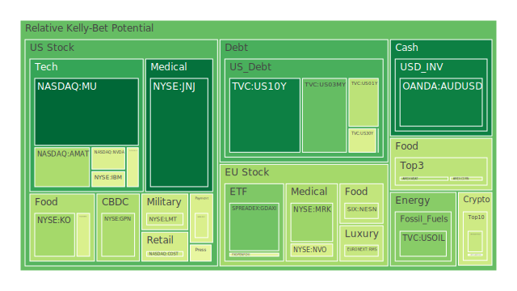
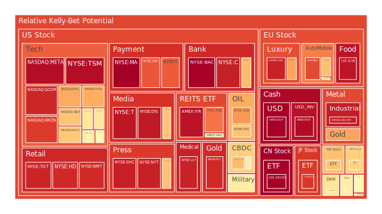
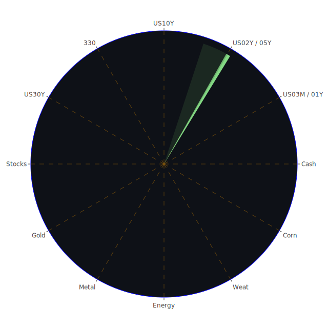

# **投資商品泡沫分析**

在當前全球經濟環境波譎雲詭的背景下，各類資產價格波動加劇，潛在的泡沫風險成為投資者關注的焦點。本報告旨在透過多維度分析，揭示潛在的市場風險與機會，並提供審慎的投資視角。我們將從經濟學、社會學、心理學、博弈論等多個角度，結合歷史經驗與當前新聞事件，對主要資產類別進行深入剖析。此非預測未來，而是基於現有資訊進行的推演與假設，旨在呈現一個客觀且多面向的市場觀察。

**美國國債**

美國國債市場近期呈現複雜局面。從數據來看，短天期如三個月期國債（US03MY 現價4.34）的風險指標相對較低，其當日風險值及月平均風險值均處於0.3左右的水平。一年期（US01Y 現價4.15）與二年期國債（US02Y 現價3.99）的風險指標略高，尤其二年期國債的各項平均風險指標均穩定在0.6以上，顯示市場對中期利率路徑的定價存在較大分歧。長天期方面，十年期國債（US10Y 現價4.51）的當日風險值雖然不高（約0.12），但其月平均風險值則超過0.4，三十年期國債（US30Y 現價5.03）的月平均風險接近0.5。

從經濟學角度觀察，聯邦儲備系統（FED）的總資產持續下降，逆回購協議（RRP）規模縮減，均指向市場流動性趨緊。然而，有效聯邦基金利率（EFFR）成交量及隔夜融資（SOFR）交易量仍處於高位，顯示短期資金拆借需求旺盛。消費者及商業房地產的拖欠率處於相對高位，高收益債券利率亦然，這些是經濟承壓的信號。CPI年增率已降至2.33%，相較去年顯著回落，但FED近期仍有鷹派發言，暗示其對通膨的警惕未完全解除。

歷史上，利率急升週期往往伴隨著經濟衰退風險。目前10年期與3個月期國債殖利率差（0.16）雖已轉正且有所擴大，脫離了深度倒掛的衰退預警區，但整體殖利率曲線形態仍值得關注。博弈論視角下，市場參與者正試圖預判FED政策的轉折點，任何超預期的經濟數據或FED表態都可能引發債市劇烈波動。心理層面上，投資者在規避通膨風險與擔憂經濟硬著陸之間搖擺。近期新聞中，摩根大通執行長戴蒙警示美國仍面臨比衰退更糟的風險，以及債券投資者對美國預算赤字的擔憂，均加劇了市場的審慎情緒。

**美國零售股**

美國零售股板塊呈現分化。例如，好市多（COST 現價1008.50）的月平均風險指標維持在0.55左右，沃爾瑪（WMT 現價96.34）則處於極高風險區域，月平均風險高達0.87。塔吉特（TGT 現價94.29）的月平均風險更是超過0.9，家得寶（HD 現價362.71）的月平均風險也在0.7以上。

經濟學上，消費者拖欠率上升與信用卡拖欠率相對較低（儘管100大銀行信用卡撇帳率低）形成對比，可能意味著壓力集中在特定消費群體。高漲的30年期固定抵押貸款利率（6.86%）也將抑制房地產相關消費。社會學角度看，消費習慣的轉變、線上購物對實體店的持續衝擊、以及貧富差距對消費能力的影響，都是零售股必須面對的長期挑戰。心理層面，消費者信心指數的波動直接影響非必需品的消費意願。新聞事件中，Deckers（DECK）雖然第一季銷售超預期，但股價大跌，顯示市場對零售股的預期極高，任何風吹草動都可能引發拋售。

**美國科技股**

科技股是市場關注的焦點，內部表現同樣差異顯著。記憶體大廠美光（MU 現價93.37）的風險指標相對偏低，月平均風險約0.35。相比之下，輝達（NVDA 現價131.29）雖然近期價格有所調整，但其7日與14日平均風險指標均超過0.7，月平均風險亦達0.65，顯示其高估值與AI熱潮下的波動性。應用材料（AMAT 現價157.51）月平均風險0.65，科磊（KLAC 現價757.17）月平均風險0.54，高通（QCOM 現價145.38）月平均風險超過0.8，博通（AVGO 現價228.72）月平均風險更是高達0.81。

大型科技股如微軟（MSFT 現價450.18）月平均風險約0.63，蘋果（AAPL 現價195.27）月平均風險約0.63，谷歌（GOOG 現價169.59）月平均風險約0.58，亞馬遜（AMZN 現價200.99）月平均風險超過0.7。Meta（META 現價627.06）的月平均風險高達0.87。台積電（TSM 現價191.98）作為全球半導體製造龍頭，其月平均風險指數已飆升至0.98的極高水平。

從經濟學角度，科技股對利率變動極為敏感。FED的緊縮政策及高企的債券殖利率對成長型科技股的估值構成壓力。然而，AI等顛覆性技術的發展為特定公司帶來強勁的增長預期，形成“順風”與“逆風”並存的局面。社會學層面，數位轉型、居家辦公、元宇宙等趨勢雖為科技應用帶來廣闊空間，但同時也面臨數據隱私、反壟斷等社會倫理和監管挑戰。心理學上，“害怕錯過”（FOMO）情緒在AI概念股中尤為明顯，但也容易因預期未達標而出現劇烈回調，如Workday（WDAY）因訂閱收入預期平淡而股價下跌。博弈論觀點，大型科技公司之間的平台競爭、供應鏈控制以及與政府監管機構的博弈，都在塑造行業格局。近期新聞如Autodesk上調年度預測，顯示部分軟體需求強勁；而FTC放棄對微軟收購動視暴雪的訴訟，可能被市場解讀為監管環境略有鬆動。

**美國房地產指數**

美國房地產指數（VNQ 現價87.09，IYR 現價92.21，RWO 現價43.35）的風險指標普遍偏高。VNQ月平均風險約0.44，IYR月平均風險高達0.8，RWO月平均風險約0.52。FED數據顯示商業房地產及住宅房地產的拖欠率均處於高位，30年期固定抵押貸款利率高達6.86%，對房地產市場構成顯著壓力。

經濟學上，高利率環境直接增加購房和融資成本，抑制需求。商業房地產尤其受到遠程辦公趨勢的衝擊，空置率上升，租金回報承壓。歷史經驗表明，房地產週期與信貸週期密切相關，當前信貸條件收緊，不利於房市擴張。社會學角度，人口結構變化、城市化進程放緩、以及對可負擔住房的需求，都對房地產市場產生深遠影響。心理層面，對房價下跌的預期可能形成負反饋循環。

**加密貨幣**

加密貨幣市場依然波動劇烈。比特幣（BTCUSD 現價107980）的月平均風險約為0.51，以太幣（ETHUSD 現價2535.95）月平均風險約0.45，狗狗幣（DOGEUSD 現價0.2254）月平均風險約0.47。儘管近期風險指標較先前有所回落，但整體仍處於需要警惕的水平。

經濟學上，加密貨幣作為一種新興資產類別，其價值儲存和交易媒介功能仍在接受市場檢驗。其價格深受全球流動性、監管政策及市場情緒影響。社會學而言，加密貨幣的社群文化、去中心化理念吸引了一批忠實追隨者，但也因其匿名性和潛在的非法交易風險而備受爭議。心理層面，加密市場極易受到名人效應、社交媒體輿論和短期投機情緒的驅動，呈現出典型的“動物精神”特徵。博弈論視角下，大型持有者（“巨鯨”）的動向、交易所的穩定性以及各國監管機構的政策博弈，共同決定著市場走向。新聞中提及“比特幣反彈將最大代幣進一步推向創紀錄區域”，反映了市場的投機熱情，但也需要警惕其高波動性。

**金/銀/銅**

貴金屬與工業金屬表現各異。黃金（XAUUSD 現價3358.12）的月平均風險在0.55左右，顯示其在避險需求下的相對穩定性，但近期7日與14日平均風險攀升至0.7以上，表明短期波動加劇。白銀（XAGUSD 現價33.48）的月平均風險高達0.9，顯示其更高的投機性和波動性。銅（FX:COPPER 現價4.86）作為工業金屬，其月平均風險約0.55，反映了市場對全球經濟復甦前景的預期。

經濟學上，黃金通常被視為抗通膨和避險資產。在全球地緣政治不確定性增加、經濟衰退擔憂浮現時，黃金需求往往上升。美元強弱、實際利率水平是影響金價的關鍵因素。白銀兼具貴金屬和工業屬性，其價格波動通常大於黃金。銅價則與全球工業生產活動密切相關，被視為經濟的“晴雨表”。FED數據中黃金/石油比率（54.44）遠高於去年（30.52），黃金/銅比率（690.96）也高於去年（643.01），可能反映了避險情緒相對於工業需求的強勢，或石油、銅價的相對弱勢。歷史上，戰爭、經濟危機時期，黃金往往表現突出。心理層面，對系統性風險的擔憂會驅使資金流向黃金。

**黃豆 / 小麥 / 玉米**

農產品方面，黃豆（SOYB 現價22.13）月平均風險約0.65，小麥（WEAT 現價4.62）月平均風險約0.42，玉米（CORN 現價18.52）月平均風險約0.44。農產品價格受天氣、地緣政治（如影響黑海糧食走廊的衝突）、能源價格（影響化肥和運輸成本）、以及各國農業政策和戰略儲備等多重因素影響。

經濟學上，供需基本面是決定農產品價格的核心。全球人口增長對糧食的長期需求是結構性支撐。社會學角度，糧食安全問題日益受到各國重視，極端天氣事件頻發也加劇了供應鏈的脆弱性。新聞中提到“美國農業機構取消對貧困國家兒童的糧食援助”、“日本農林水產大臣因稻米失言辭職，米價居高不下威脅政府執政”，以及“泰國前總理英拉因稻米計畫被判賠償”，均突顯了農產品市場的政治敏感性和供需失衡的影響。

**石油/ 鈾期貨UX\!**

能源市場方面，美國原油（USOIL 現價61.69）的月平均風險相對較低，約0.28，但近期風險有所抬升。鈾期貨（UX1\! 現價71.55）月平均風險約0.49，波動較為溫和。

經濟學角度看，石油價格受OPEC+產量政策、全球經濟增長前景（影響需求）、地緣政治衝突（影響供應）、美元匯率以及能源轉型等多重因素影響。鈾作為核燃料，其需求與全球核電發展規劃密切相關。在推動清潔能源的背景下，核能作為一種低碳排放的基載電力來源，其戰略地位有所提升。社會學上，能源安全和氣候變化是各國政府面臨的雙重挑戰，這也影響著對不同能源品種的投資和政策導向。博弈論視角下，產油國之間的市場份額博弈、消費國與生產國之間的能源政治角力，以及新能源技術對傳統能源的替代競爭，都深刻影響著能源價格。新聞中“Phillips 66洛杉磯煉油廠裁員”、“Pemex削減職位以節省開支”，反映了傳統能源行業在轉型壓力下的調整。

**各國外匯市場**

外匯市場波動顯著。澳元兌美元（AUDUSD 現價0.65）的月平均風險約0.3，相對穩定。英鎊兌美元（GBPUSD 現價1.35）月平均風險約0.46。歐元兌美元（EURUSD 現價1.14）的月平均風險則高達0.92。美元兌日圓（USDJPY 現價142.56）的月平均風險亦達到0.72，反映了主要經濟體貨幣政策分歧和避險情緒的影響。

經濟學上，匯率主要受各國利率差異（利差交易）、經濟增長預期、國際貿易平衡、資本流動以及央行干預等因素影響。FED的鷹派立場和相對強勁的美國經濟數據一度支撐美元，但隨著其他央行逐步跟進緊縮或美國經濟出現放緩跡象，美元走勢面臨不確定性。社會學角度，國民對本國貨幣的信心、以及全球化與逆全球化趨勢對跨境資本流動的影響，也會間接作用於匯率。心理層面，“羊群效應”在外匯市場尤為常見，重大數據發布或突發事件容易引發匯率的超調。博弈論視角下，各國央行在穩定匯率、控制通膨和刺激經濟等多重目標間的權衡，以及主要國家間的“貨幣戰”風險，都是影響匯率的重要因素。

**各國大盤指數**

全球主要股指風險水平不一。德國DAX指數（GDAXI 現價23610.20）月平均風險約0.52。法國CAC40指數（FCHI 現價7729.20）月平均風險約0.58。英國富時100指數（FTSE 現價8736.10）月平均風險約0.55。日本日經225指數（JPN225 現價36844.85）月平均風險接近0.8。納斯達克100指數（NDX 現價20915.65）月平均風險超過0.75。台灣加權股價指數（0050 現價180.85）月平均風險約0.63。滬深300指數（000300 現價3882.27）月平均風險約0.68，但其當日及7日平均風險指標已接近1.0，顯示短期風險劇增。

經濟學上，股指是反映一國經濟整體狀況的晴雨表。企業盈利、利率水平、通膨預期、以及宏觀經濟政策共同決定股指走向。歷史經驗表明，全球經濟同步放緩或主要央行協同緊縮，往往對全球股市構成壓力。社會學層面，投資者結構（如散戶化趨勢）、社會整體風險偏好、以及對特定產業（如綠色能源、人工智能）的政策支持，都會影響市場風格和指數表現。心理學上，市場情緒的傳染效應顯著，恐慌性拋售或非理性繁榮都可能導致股指大幅偏離基本面。新聞中瑞銀上調標普年底目標，反映了部分機構的樂觀預期，但同時市場對美國大選後貿易和稅收政策的觀望情緒也帶來不確定性。

**美國半導體股**

半導體股作為科技股的核心組成部分，其高風險高回報特徵明顯。美光（MU）、應用材料（AMAT）、輝達（NVDA）、英特爾（INTC 現價20.05，月平均風險0.51）、科磊（KLAC）、博通（AVGO）、高通（QCOM）、台積電（TSM）均已在前述科技股部分提及，整體呈現高估值、高波動、高風險的特徵。尤其是AI晶片相關的輝達、博通、台積電，其月平均風險指標均處於極高水平。

經濟學上，半導體行業具有高度的週期性和資本密集性。其需求與消費電子、汽車、工業、數據中心等下游行業景氣度密切相關。當前AI的爆發式增長為半導體行業，特別是高性能計算晶片，帶來了前所未有的需求。然而，全球供應鏈的重構、地緣政治對技術轉移的限制，以及潛在的產能過剩風險，都是行業面臨的挑戰。歷史上，半導體行業經歷過多次繁榮與蕭條的週期。社會學角度，半導體技術的戰略重要性日益凸顯，各國紛紛將其提升至國家安全層面，加劇了行業競爭和地緣政治博弈。

**美國銀行股**

美國銀行股如摩根大通（JPM 現價260.71，月平均風險0.75）、第一資本（COF 現價185.08，月平均風險0.51）、花旗集團（C 現價73.09，月平均風險0.86）、美國銀行（BAC 現價43.20，月平均風險高達0.95），其風險指標普遍處於中高水平，部分甚至極高。

經濟學上，銀行股的盈利能力與利率水平（淨息差）、信貸質量（壞帳撥備）、以及經濟活躍度（貸款需求）密切相關。FED的利率政策對銀行股影響深遠。當前，雖然利率上升有助於擴大淨息差，但經濟放緩的擔憂也帶來信貸風險上升的壓力。FED數據顯示的商業地產及消費信貸拖欠率上升，對銀行資產質量構成潛在威脅。歷史上，金融危機往往與銀行系統性風險暴露相伴。社會學角度，金融科技（FinTech）的發展對傳統銀行業務模式構成挑戰，同時，監管機構對銀行資本充足率和風險控制的要求也日益嚴格。

**美國軍工股**

洛克希德馬丁（LMT 現價468.88，月平均風險0.73）、雷神技術（RTX 現價132.35，月平均風險0.83）、諾斯洛普格魯曼（NOC 現價471.46，月平均風險0.67），這些軍工股的風險指標處於較高水平。

經濟學上，軍工股的表現與國防預算、地緣政治緊張局勢密切相關。全球衝突頻發、國際關係緊張，往往會刺激各國增加國防開支，利好軍工企業。然而，其訂單也高度依賴政府採購，存在政策變動風險。社會學角度，軍工產業的發展涉及國家安全、倫理道德等多方面考量。心理層面，地緣政治事件的爆發往往會短期推高軍工股估值，但長期表現仍取決於實際訂單和盈利能力。新聞中以色列使館人員遇襲、巴基斯坦校車遭襲等事件，以及“以色列使館人員遇害，曾致力於中東橋樑建設”和“外國外交官在西岸正式訪問中遭以色列炮火襲擊”，均反映了全球地緣政治風險的持續存在。

**美國電子支付股**

電子支付領域，PayPal（PYPL 現價69.85）月平均風險高達0.76，Global Payments（GPN 現價74.09）月平均風險約0.38，Visa（V 現價353.54）月平均風險約0.78，Mastercard（MA 現價563.58）月平均風險更是高達0.82。

經濟學上，電子支付行業的增長與消費支出、電子商務普及率、以及技術創新密切相關。無現金化趨勢為該行業帶來長期增長動力。然而，行業競爭激烈，同時也面臨監管機構對手續費、市場壟斷等問題的審查。社會學角度，支付方式的便捷性和安全性是消費者選擇的關鍵。心理層面，品牌信任度和用戶習慣對支付平台選擇影響較大。

**美國藥商股**

大型藥廠如嬌生（JNJ 現價152.94）月平均風險僅0.22，相對穩健。默克（MRK 現價77.58）月平均風險約0.45。諾和諾德（NVO 現價67.35）月平均風險約0.56。禮來（LLY 現價713.71）月平均風險則高達0.93，顯示其在減肥藥等熱門產品帶動下的高估值和高風險。

經濟學上，醫藥行業具有研發週期長、投入高、專利保護等特點，其需求相對剛性，受經濟週期影響較小，因此常被視為防禦性板塊。然而，藥品定價、醫保政策、以及新藥研發的成功率都是影響藥企業績的關鍵因素。社會學角度，人口老化、慢性病增加為醫藥市場帶來持續需求，但同時也面臨藥品可負擔性和醫療公平性的社會壓力。新聞中“Hims & Hers Health (HIMS) 股價下跌”、“Humana (HUM) 股價暴跌”可能反映了市場對特定醫療保健公司前景的擔憂或政策調整的影響。

**美國影視股**

影視娛樂行業，Netflix（NFLX 現價1185.39）月平均風險約0.5，迪士尼（DIS 現價109.72）月平均風險超過0.73，派拉蒙全球（PARA 現價11.97）月平均風險約0.48。康卡斯特（CMCSA 現價34.52，亦屬媒體和科技）月平均風險約0.46。

經濟學上，影視股的收入來源於內容訂閱、廣告、以及IP衍生品等。流媒體平台的競爭白熱化，內容成本不斷攀升，對盈利能力構成挑戰。社會學角度，消費者娛樂方式的轉變、以及對內容多元化和高質量的追求，驅動行業變革。心理層面，爆款內容的推出能顯著提升平台吸引力和股價，但也存在內容生產的不確定性。

**美國媒體股**

傳統與新興媒體股，康卡斯特（CMCSA）、福斯（FOX 現價50.43，月平均風險0.84）、派拉蒙全球（PARA）已提及。紐約時報（NYT 現價55.41）月平均風險約0.75。

經濟學上，媒體行業的商業模式正在從傳統廣告和發行向數位訂閱和多元化經營轉型。假新聞的泛濫和訊息的碎片化也對傳統媒體的公信力和盈利能力構成挑戰。社會學角度，媒體在塑造公眾輿論、傳承文化價值方面扮演重要角色，但也面臨政治極化和社會信任度下降的困境。

**石油防禦股**

埃克森美孚（XOM 現價103.03）月平均風險高達0.81，西方石油（OXY 現價41.29）月平均風險約0.74。這些石油巨頭在油價上漲時通常表現良好，被部分投資者視為對沖通膨或能源短缺風險的工具。然而，其高風險指標也反映了油價波動和能源轉型長期壓力下的不確定性。

**金礦防禦股**

皇家黃金（RGLD 現價180.59）月平均風險高達0.92，Graham Holdings Company（GHC 現價921.42，業務多元，包含媒體、教育及製造，非純金礦股，此處可能指其部分資產的防禦特性或數據歸類問題）月平均風險亦高達0.92。金礦股通常在金價上漲時受益，且可能提供高於黃金本身的槓桿效應。但其同時也面臨開採成本、地緣政治風險（礦區所在地）、以及管理效率等個股風險。極高的風險指標警示投資者需極度審慎。

**歐洲奢侈品股**

愛馬仕（RMS 現價2373.00）月平均風險約0.61，LVMH（MC 現價479.00）月平均風險約0.48，開雲集團（KER 現價173.30）月平均風險則超過0.8。

經濟學上，奢侈品行業的表現與全球高淨值人群的財富效應、以及新興市場的消費能力密切相關。其具有一定的抗通膨能力，但也受宏觀經濟波動和消費者信心影響。社會學角度，奢侈品消費不僅是物質需求，更承載了身份認同、社會地位等象徵意義。品牌價值和稀缺性是其核心競爭力。心理層面，炫耀性消費和對獨特性的追求驅動奢侈品需求。中國市場的復甦情況對奢侈品行業至關重要。

**歐洲汽車股**

梅賽德斯賓士（MBG 現價50.54）月平均風險約0.5，寶馬（BMW 現價75.26）月平均風險約0.56，保時捷（PAH3 現價36.48）月平均風險約0.59。歐洲汽車股面臨電動化轉型、來自中國品牌的競爭加劇、以及供應鏈重塑等多重挑戰。其風險指標處於中等水平，反映了市場對其轉型前景的觀望態度。新聞中“中國比亞迪首次在歐洲超越特斯拉”，凸顯了競爭格局的變化。

**歐美食品股**

卡夫亨氏（KHC 現價26.30）月平均風險超過0.73，可口可樂（KO 現價71.77）月平均風險約0.64，雀巢（NESN 現價88.52）月平均風險約0.55，聯合利華（ULVR 現價4695.00）月平均風險高達0.94。食品飲料行業通常被視為防禦性板塊，因其需求相對穩定。然而，成本上漲（原材料、運輸、包裝）、消費者口味變化、以及對健康和永續發展的日益關注，都對相關企業構成挑戰。FTC放棄對百事可樂價格歧視的訴訟，可能減輕了部分企業的監管擔憂。聯合利華極高的風險指標值得特別關注。

# **宏觀經濟傳導路徑分析**

當前宏觀經濟的核心驅動力來自FED的政策取向、通膨黏性、以及全球經濟增長前景。FED總資產與逆回購規模的下降，意味著市場先前充裕的流動性正在被回收，這構成了市場的“正”方力量，即試圖抑制過熱與通膨。然而，EFFR與SOFR交易量高企，顯示短期資金需求依然旺盛，這可視為“反”方力量，市場仍在尋求收益且短期融資成本壓力不減。CPI年增率降至2.33%是積極信號，但FED的鷹派言論與高收益債利率、各類貸款拖欠率的上升，構成了“合”的複雜局面：通膨雖有緩解，但經濟下行風險與金融脆弱性正在積聚。

傳導路徑一：FED政策 → 債券市場 → 股市估值與實體經濟。FED維持高利率或進一步緊縮（鷹派信號），將推高債券殖利率，增加企業融資成本，壓制股市尤其是成長股的估值。同時，高利率環境透過抵押貸款利率（目前高達6.86%）等途徑，抑制房地產市場和耐久財消費，進而影響整體經濟增長。若經濟數據持續走弱，市場可能轉向預期FED降息，從而帶動債券價格反彈和股市估值修復，但這又可能與FED控制通膨的目標相悖，形成政策博弈。

傳導路徑二：通膨預期與地緣政治 → 大宗商品 → 全球供應鏈與生產成本。地緣政治緊張（如新聞中多處提及的衝突）若影響能源或糧食供應，將推高大宗商品價格，加劇通膨壓力。這不僅直接影響消費者生活成本，也增加企業生產成本，侵蝕利潤，可能引發“成本推動型”通膨，使央行政策制定更為複雜。黃金作為避險資產，其價格上漲（近期黃金/石油比率、黃金/銅比率上升）也反映了市場對此類風險的擔憂。

傳導路徑三：全球經濟增長差異與貨幣政策分歧 → 匯率波動 → 國際資本流動與貿易。美國經濟相對其他主要經濟體的表現，以及各國央行貨幣政策的差異（如美元兌日圓的高波動），導致國際資本重新配置。強勢美元可能吸引資本流入美國，但同時打擊美國出口和新興市場（美元債務負擔加重）。反之，若美元走弱，則可能利好美國以外的市場和以美元計價的大宗商品。新聞中阿根廷試圖吸引未申報美元回流，即是應對資本外流和本幣疲軟的舉措。

社會心理層面，市場情緒的傳染是重要的宏觀傳導路徑。例如，科技股的AI熱潮帶動納斯達克指數上漲，可能引發全球範圍內對相關概念的追捧。反之，若主要市場出現大幅回調，悲觀情緒也可能迅速蔓延。戴蒙對經濟前景的悲觀預期，若被市場廣泛認同，可能促使投資者增加防禦性配置。

# **微觀經濟傳導路徑分析**

微觀層面，企業的業績、戰略調整以及行業競爭格局是主要的傳導因素。

傳導路徑一：企業財報與預期管理 → 個股股價波動 → 行業板塊重估。新聞中大量個股因財報不及預期或展望疲軟而股價下跌（如Deckers, Hims & Hers, ePlus, Workday, Copart），顯示在當前高預期、高估值的市場環境下，企業稍有不慎即遭懲罰。這構成“正”方（市場對業績的嚴苛要求）。反之，如Intuit、Autodesk因業績超預期或上調展望而股價上漲，則代表“反”方（優質企業的稀缺性溢價）。這種分化將導致資金在行業內部及不同行業間的流動，形成“合”的局面（市場對基本面的重新聚焦）。

傳導路徑二：行業內部競爭與創新 → 市場份額轉移 → 企業興衰。例如，新聞提及“中國比亞迪首次在歐洲超越特斯拉”，這直接衝擊特斯拉的市場地位，並可能引發對整個電動汽車產業鏈估值的調整。技術創新（如AI）不僅催生新的市場領導者（如輝達），也迫使傳統企業加速轉型（如IBM）。這是一種“優勝劣汰”的機制，不斷重塑產業格局。

傳導路徑三：監管政策與法律訴訟 → 企業經營環境變化 → 行業風險溢價調整。FTC放棄對百事可樂價格歧視的訴訟，以及對微軟收購動視暴雪案的態度轉變，可能被市場解讀為特定行業監管壓力短期有所緩解，降低了相關企業的風險溢價。然而，反壟斷、數據安全、環境保護等長期監管趨勢依然存在，企業需要持續投入以符合合規要求。

社會心理層面，品牌形象和消費者信任度在微觀傳導中作用顯著。例如，Hinge Health IPO的成功，可能反映了市場對數位醫療領域的信心回暖。企業的社會責任（ESG）表現也日益受到投資者關注，可能影響其融資成本和市場估值。

博弈論視角下，企業間的價格戰、專利戰、人才爭奪戰，以及企業與供應商、客戶之間的談判力博弈，都是影響企業盈利和市場地位的微觀因素。例如，大型零售商與供應商之間的定價權博弈，直接影響雙方利潤空間。

# **資產類別間傳導路徑分析**

不同資產類別之間存在複雜的相互影響和傳導機制，常呈現此消彼長的“蹺蹺板”效應或同向變動的“漣漪”效應。

1. **債券與股票**：傳統理論認為債股呈負相關，即“股債蹺蹺板”。當經濟向好、風險偏好上升時，資金流入股市，債券價格下跌（殖利率上升）；反之，經濟悲觀時，資金流入債市避險，債券價格上漲（殖利率下降）。然而，在特定時期（如高通膨下政策緊縮初期），股債可能同跌。當前美國10年期國債殖利率處於4.51%的水平，對股市估值構成壓力。若殖利率進一步上升，科技股等長久期資產的折現壓力將更大。反之，若市場預期經濟衰退導致FED降息，則可能出現股債雙漲的局面（預期驅動）。此處的“正”是利率對估值的壓力，“反”是避險需求或寬鬆預期，而“合”則是市場在通膨、增長、政策間的動態平衡。  
2. **美元與大宗商品**：美元指數與以美元計價的大宗商品（如黃金、石油、銅）通常呈負相關。美元走強，購買大宗商品的成本相對增加，抑制需求；同時，也可能反映全球避險情緒升溫，資金流向美元資產。當前美元兌日圓匯率高企（142.56），歐元兌美元亦處於高位（1.14），顯示美元並非一枝獨秀的強勢，而是反映了更複雜的全球貨幣格局。若美元相對主要貨幣轉弱，可能提振大宗商品價格。  
3. **黃金與比特幣**：黃金被視為傳統避險資產，比特幣則被部分投資者稱為“數位黃金”。兩者在某些時期可能因避險情緒或抗通膨需求而同向上漲。然而，比特幣的高波動性和監管不確定性使其風險遠高於黃金。兩者間的資金流動和相對表現，可以部分反映市場對風險和創新的偏好程度。  
4. **石油與通膨/經濟增長**：石油價格是影響通膨的重要因素，同時也反映全球經濟活動水平。油價上漲會推高通膨預期，增加企業成本和消費者負擔，可能抑制經濟增長。FED數據顯示黃金/石油比率（54.44）顯著高於去年，可能暗示相對於石油的工業需求，黃金的避險或貨幣屬性更受青睞，或者油價相對受抑。  
5. **房地產與銀行股**：房地產市場的健康狀況直接影響銀行業的信貸質量。房價下跌、拖欠率上升（如FED數據所示的商業地產和住宅地產拖欠率高企），會增加銀行的壞帳風險，打擊銀行股。美國30年期抵押貸款利率高達6.86%，對房市構成持續壓力，進而可能傳導至銀行系統。  
6. **科技股與半導體股**：半導體是科技行業的基石，兩者高度正相關。半導體行業的景氣度、技術突破（如AI晶片）直接影響科技股的整體表現。台積電（TSM）等龍頭企業的業績和展望，往往被視為科技行業的風向標。

尋求相位約120度、相關係數約-0.5的對沖組合：  
在當前環境下，構建理想的負相關投資組合極具挑戰。但可以考慮以下思路：  
\* 成長型科技股（如NVDA，高風險） vs. 長期美國國債（如US10Y或US30Y）：在典型的風險偏好轉變時，兩者可能呈負相關。當市場追逐成長時科技股漲、債券跌；當避險情緒主導時債券漲、科技股（尤其高估值者）跌。但需注意在特定宏觀環境下（如滯脹），兩者可能同跌。  
\* 美元指數 vs. 新興市場股市/大宗商品（如黃金XAUUSD、石油USOIL）：美元走強通常不利於新興市場和以美元計價的商品。  
\* 高收益信用債 vs. 高評級政府債：在信用利差擴大時（市場擔憂違約風險），高收益債跌，高評級政府債可能因避險需求上漲。  
然而，歷史相關性並不能保證未來表現，尤其在市場結構和宏觀範式轉變時期。真正的“聖杯”式完美對沖極難實現，動態調整和多元化仍是關鍵。

# **投資建議**

基於上述分析，我們認為當前市場環境充滿不確定性，但也蘊含結構性機會。投資者應根據自身風險承受能力，採取高度選擇性和紀律性的投資策略。

我們建議投資者可考慮將總體資產按以下比例進行戰略配置，以平衡風險與回報：**穩健型配置佔35%，成長型配置佔40%，高風險型配置佔25%。**

**一、穩健型配置 (總資產之35%)**

此部分旨在保本增值，抵禦市場波動。

1. **短期美國國債 (例如 US01Y \- 1年期美國國債，佔此類別40%)**: 現價4.15，月平均風險約0.44。在利率環境仍偏高但經濟前景不明朗時，短期國債提供相對穩定的票息收入和較低的利率風險。FED數據顯示各期限殖利率均較去年有所回落（除10年期以上），但仍處於歷史相對高位，具備一定吸引力。  
2. **黃金 (XAUUSD，佔此類別30%)**: 現價3358.12，月平均風險約0.55。考慮到持續的地緣政治風險、潛在的經濟衰退擔憂以及部分國家央行持續增持黃金的趨勢，黃金仍是重要的避險工具。其與主要金融資產的低相關性有助於分散投資組合風險。  
3. **優質大型製藥股 (例如 JNJ \- 嬌生，佔此類別30%)**: 現價152.94，月平均風險僅0.22，屬低風險。其業務遍及全球，產品線多元，現金流穩定，股息發放歷史悠久，具備較強的防禦特性。醫療保健需求相對剛性，受經濟週期影響較小。

**二、成長型配置 (總資產之40%)**

此部分旨在捕捉市場中期增長機會，風險適中。

1. **全球科技龍頭股 (例如 MSFT \- 微軟，佔此類別40%)**: 現價450.18，月平均風險約0.63。微軟在雲端運算(Azure)、企業軟體、人工智能等領域均處於領先地位，盈利增長前景廣闊。儘管估值不低，但其強大的護城河和持續創新能力使其仍具備長期投資價值。  
2. **特定半導體設備股 (例如 AMAT \- 應用材料，佔此類別30%)**: 現價157.51，月平均風險約0.65。作為全球主要的半導體設備製造商，受益於全球半導體產能擴張及AI、5G等技術驅動的長期需求。其在產業鏈中的關鍵地位使其具備較強的議價能力。  
3. **工業金屬 \- 銅 (FX:COPPER，佔此類別30%)**: 現價4.86，月平均風險約0.55。銅在能源轉型（電動車、再生能源設施）、電氣化及全球基礎建設中扮演關鍵角色，長期需求看好。若全球經濟逐步復甦，銅價有望獲得支撐。

**三、高風險型配置 (總資產之25%)**

此部分旨在博取較高回報，但須承受較大波動風險，應嚴格控制倉位。

1. **AI晶片領導者 (例如 NVDA \- 輝達，佔此類別40%)**: 現價131.29，月平均風險約0.65，但7日與14日平均風險較高。輝達在AI晶片市場佔據絕對主導地位，短期內增長勢頭強勁。然而，其估值已處於極高水平，股價對業績和市場情緒極為敏感，波動巨大。投資者需有充分的風險認知。  
2. **比特幣 (BTCUSD，佔此類別30%)**: 現價107980，月平均風險約0.51。作為市值最大的加密貨幣，其價格受全球流動性、機構接受度、監管政策及市場情緒等多重因素影響。比特幣減半事件的影響仍在發酵，但其高波動性和政策不確定性是主要風險。  
3. **鈾期貨 (UX1\!，佔此類別30%)**: 現價71.55，月平均風險約0.49。在全球推動能源轉型和能源安全的背景下，核電作為穩定低碳的基載電力來源，其重要性重新受到關注。鈾作為核燃料，中長期需求有望提升，但價格亦受政策、地緣政治及個別大型項目進展影響。

# **風險提示**

投資有風險，市場總是充滿不確定性。本報告所有分析和建議僅基於當前數據和假設，不構成任何投資邀約或承諾。過去的表現不代表未來的回報。

各類資產的泡沫風險評估（D1至D30數據所反映的短期至中期風險水平）顯示，部分資產，特別是某些科技股（如TSM、META、AVGO、QCOM、NVDA）、零售股（如WMT、TGT）、銀行股（如C、BAC）、奢侈品股（如KER）、食品股（如ULVR）、金礦股（如RGLD）以及白銀（XAGUSD），其近期或月平均風險指標已達到非常高的水平，投資者應對此類資產的潛在泡沫風險保持高度警惕。即使是基本面良好的公司，在市場情緒過熱或宏觀環境逆轉時，也可能經歷劇烈的價格回調。

聯邦儲備系統的政策動向、全球通膨的演變、地緣政治衝突的發展、以及主要經濟體的增長前景，都將對市場產生深遠影響。新聞事件的發展往往迅速且難以預料，可能隨時改變市場情緒和預期。例如，近期企業財報好壞參半，市場對未達預期的公司反應劇烈；同時，重要官員對經濟前景的警示也加劇了市場擔憂。

投資者應充分了解自身風險承受能力、投資目標和投資期限，結合本報告提供的多維度觀察視角，獨立思考，審慎決策。在進行任何投資前，建議諮詢專業財務顧問的意見。市場波動是常態，理性應對，方能行穩致遠。

 
Daily Buy Map:

 
Daily Sell Map:

 
Daily Radar Chart:

 
