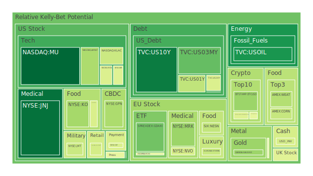
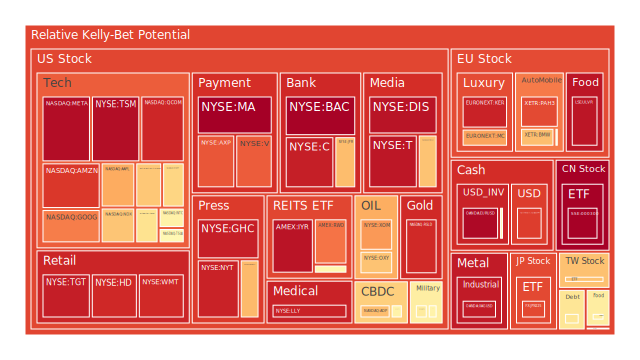
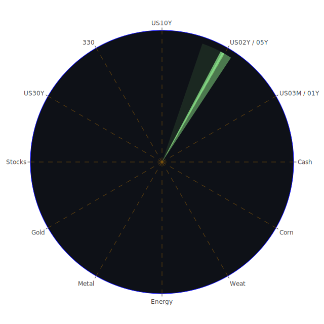

# **投資商品泡沫分析**

當前全球金融市場正處於一個複雜多變的環境中，多種資產類別呈現出不同程度的泡沫化跡象。以下將針對各主要投資商品，結合近期市場數據、新聞事件、歷史經驗及相關理論，進行深入的泡沫分析與觀察。我們將時刻謹記，一切市場波動皆為表象，其背後均有其自然之理。

* 美國國債  
  美國國債市場近期呈現微妙的均衡。以十年期美國國債（US10Y）為例，其當前價格為4.5100，泡沫指數D1為0.110386，月平均泡沫指數D30則為0.407175，顯示短期風險不高，但中期風險累積值得關注。從聯準會數據觀察，美國20年期公債殖利率為5.04%，30年期為5.03%，均較上週及上月有所攀升，顯示長期利率預期走高。2年期公債殖利率為3.99%，1年期為4.15%，3個月期為4.34%。值得注意的是，殖利率曲線如10年期減3個月期（0.16）雖已轉正，但仍處於歷史低位，歷史上這種形態往往預示著經濟前景的不確定性。新聞層面，全球政府債務成本螺旋式上升的消息（負面，92%影響力）以及聯準會偏鷹派的發言，均對債券價格構成壓力。從博弈論角度看，市場參與者在預期聯準會政策路徑與通膨走向，短期內可能因避險情緒流入，但長期若通膨無法有效控制或經濟硬著陸風險加大，債券市場仍存波動。心理學上，對經濟衰退的擔憂與對持續高利率的預期相互拉扯，使得債券投資者情緒複雜。短期美國國債（如US03MY，D30為0.307490；US01Y，D30為0.444815；US02Y，D30為0.609932）的泡沫指數差異顯著，其中二年期債券的風險相對較高，可能反映了市場對中期利率路徑的高度不確定性。  
  經濟學觀點：傳統上，國債被視為避險資產。然而，在當前高通膨、高利率的背景下，其避險屬性受到挑戰。聯準會資產負債表縮減（FED Total Assets is getting lower）與貨幣市場基金總資產上升（Money Market Funds Total Assets is getting higher）並存，顯示資金流向的複雜性。歷史上，1970年代末期的高通膨時期，債券市場經歷了大幅調整。  
* 美國零售股  
  美國零售股如沃爾瑪（WMT）現價96.3400，其泡沫指數D1高達0.920678，月平均D30亦達0.875640，塔吉特（TGT）現價94.2900，D1為0.942406，D30為0.910427，好市多（COST）現價1008.5000，D1為0.433564，D30為0.554133。這些數據揭示零售行業普遍存在較高的泡沫風險。新聞事件中，「Deckers Outdoor, Ross Stores Stocks Fall as Firms Withhold Outlooks」（負面，96%）直接衝擊了市場信心。聯準會數據顯示消費者拖欠款項（Consumer Delinquent）處於相對高位，這對依賴消費者支出的零售業而言並非利好。  
  社會學視角：消費習慣的改變、線上購物的持續滲透以及貧富差距擴大，可能導致不同零售業態表現分化。心理學上，消費者信心指數的波動、以及對未來經濟的預期，直接影響消費意願。博弈論角度，零售商在定價策略、庫存管理以及供應鏈優化方面的競爭日趨激烈。經濟學上，高通膨侵蝕購買力，而高利率則增加企業融資成本和消費者信貸成本。家得寶（HD）現價362.7100，泡沫指數D1為0.922063，D30為0.725076，同樣處於高風險區域，可能與房地產市場景氣度及消費者裝修意願相關。  
  歷史觀點：在經濟下行週期或高通膨時期，非必需消費品零售通常會受到較大衝擊。2008年金融危機期間，零售股普遍大幅下跌。  
* 美國科技股  
  美國科技股呈現顯著分化。以納斯達克100指數（NDX）為例，現價20915.6500，D1為0.678298，D30為0.756706，整體泡沫風險偏高。蘋果（AAPL）現價195.2700，D1為0.724370，D30為0.630641，新聞中「Trump threatens tariffs against Europe and Apple」（負面，96%）及「Apple stock sinks after Trump threatens 25% tariffs on iPhone maker」（負面，95%）均對其股價構成直接威脅。微軟（MSFT）現價450.1800，D1為0.646961，D30為0.637520。谷歌（GOOG）現價169.5900，D1為0.791628，D30為0.581984。亞馬遜（AMZN）現價200.9900，D1為0.896625，D30為0.728027。Meta（META）現價627.0600，D1為0.974863，D30為0.878730。特斯拉（TSLA）現價339.3400，D1為0.557589，D30為0.491236，泡沫風險相對溫和，但其股價波動性歷來較高。  
  經濟學角度，科技股的高估值往往依賴於對未來成長的高預期以及相對寬鬆的流動性環境。當前聯準會緊縮政策及高利率環境對高成長科技股不利。社會學上，科技進步對社會結構、生活方式的影響巨大，催生了新的市場需求，但也可能帶來監管風險。心理學層面，投資者對AI等新技術的狂熱追捧可能導致部分個股出現非理性繁榮。博弈論中，科技巨頭間的平台競爭、專利戰爭以及與政府監管機構的博弈，均是影響其價值的關鍵因素。IBM（IBM）現價258.6300，D1為0.458444，D30為0.562767，作為老牌科技股，泡沫風險相對可控。  
  歷史借鑒：2000年的科網泡沫破裂，給予了市場深刻教訓，過度脫離基本面的炒作終將難以為繼。  
* 美國房地產指數  
  美國房地產指數如AMEX:VNQ現價87.0900，D1為0.560488，D30為0.444584，AMEX:IYR現價92.2100，D1為0.960650，D30為0.809271，AMEX:RWO現價43.3500，D1為0.805539，D30為0.544746。整體來看，房地產相關指數的泡沫風險處於中高水平，尤其是IYR的短期風險極高。聯準會數據顯示，商業房地產拖欠款（Commercial Real Estate Delinquent）和房地產拖欠款（Real Estate Delinquent）均處於相對高位。固定30年期房貸利率（Fixed Morgage 30Y Rate）高達6.86%，遠高於去年的2.99%，對房地產市場構成顯著壓力。  
  經濟學角度：高利率環境直接增加了購房成本和開發商融資成本，抑制了房地產需求和投資。社會學上，遠程辦公的普及可能改變商業地產的需求格局，而人口結構變化和地區經濟發展不平衡也影響住宅需求。心理學上，對房價下跌的預期可能導致持幣觀望，形成負向循環。  
  歷史觀點：2008年次貸危機即由房地產市場泡沫破裂引發，其連鎖反應波及全球金融體系。  
* 加密貨幣  
  加密貨幣市場波動劇烈。比特幣（BTCUSD）現價109000.0000，D1為0.336006，D30為0.504845。以太坊（ETHUSD）現價2556.1600，D1為0.475568，D30為0.457244。狗狗幣（DOGEUSD）現價0.2244，D1為0.457662，D30為0.475207。從泡沫指數看，比特幣短期風險有所下降，但整體仍處於中等偏高水平。新聞「Bad Week for Wall Street’s Old Guard as Crypto Burns the Haters」（負面，78%）反映了傳統金融與新興加密市場的衝突與融合。  
  經濟學角度：加密貨幣的價值基礎、內在回報機制仍在探索與爭議之中。其價格更多受到市場供需、投資者情緒、監管政策以及宏觀流動性的影響。社會學上，加密貨幣代表了一種去中心化的理念，吸引了特定社群的追隨者，但也因其匿名性和波動性引發社會問題。心理學層面，FOMO（害怕錯過）情緒和暴富預期是驅動加密貨幣投機的重要因素。博弈論視角下，加密貨幣市場是早期採用者、機構投資者、散戶以及監管機構之間的多方博弈。  
  歷史觀點：加密貨幣市場經歷過多次暴漲暴跌，顯示其高度投機性和風險性。  
* 金/銀/銅  
  貴金屬方面，黃金（XAUUSD）現價3342.9100，D1為0.337081，D30為0.551549，短期風險有所下降，但中期仍偏高。白銀（XAGUSD）現價33.4200，D1為0.947589，D30為0.904399，泡沫風險極高。工業金屬方面，銅（COPPER）現價4.8500，D1為0.487078，D30為0.539417，處於中等風險水平。黃金石油比（GOLD OIL RATIO）為54.09，黃金銅比（GOLD COPPER RATIO）為689.55，這些相對價格關係可反映市場對通膨、經濟增長及避險情緒的綜合預期。  
  經濟學角度：黃金通常被視為通膨和地緣政治風險的對沖工具。白銀兼具貴金屬和工業金屬屬性。銅價則與全球工業活動和經濟增長預期密切相關。新聞中地緣政治緊張局勢（如以色列、烏克蘭相關新聞）以及全球債務問題，可能推升避險情緒，利好黃金。社會學觀點，黃金在多種文化中具有儲值保值的傳統觀念。心理學上，不確定性增加時，投資者傾向於持有黃金等避險資產。  
  歷史觀點：在美元走弱、實際利率為負以及地緣政治動盪時期，黃金通常表現良好。例如1970年代的滯脹時期。  
* 黃豆 / 小麥 / 玉米  
  農產品方面，黃豆（SOYB）現價22.1300，D1為0.589651，D30為0.650529。小麥（WEAT）現價4.6200，D1為0.375487，D30為0.421303。玉米（CORN）現價18.5200，D1為0.408162，D30為0.442217。黃豆的泡沫風險相對較高，小麥和玉米則處於中等水平。新聞「Exclusive-US farm agency cancels food aid for children in poor countries」（負面，94%）及「Thai ex-PM Yingluck ordered to pay $305 million in damages over rice scheme」（負面，93%）可能對全球糧食供應和價格產生影響。  
  經濟學角度：農產品價格受供需基本面、氣候條件、地緣政治（如影響黑海糧食出口的衝突）、貿易政策以及美元匯率等多重因素影響。社會學上，糧食安全是各國政府高度重視的問題，關係到社會穩定。心理學上，對糧食短缺的恐慌可能引發囤積行為和價格上漲。  
  歷史觀點：極端天氣事件（如乾旱、洪水）或主要出口國政策調整，歷史上都曾導致農產品價格大幅波動。  
* 石油/ 鈾期貨UX\!  
  能源方面，美國原油（USOIL）現價61.8600，D1為0.160752，D30為0.276087，短期泡沫風險不高，但需關注地緣政治風險。新聞「Oil Drifts Higher as US-Iran Talks Yield No Conclusive Progress」（負面，63%）顯示中東局勢對油價的影響。鈾期貨（UX1\!）現價71.5500，D1為0.509197，D30為0.490249，處於中等風險。新聞「Trump Signs Orders to Revive US Leadership in Nuclear Power」（正面，57%）可能提振鈾的需求前景。  
  經濟學角度：石油價格受OPEC+產量政策、全球經濟增長（影響需求）、地緣政治衝突（影響供應）以及美元匯率的綜合影響。鈾價則與核電發展前景密切相關。社會學上，能源轉型和氣候變化政策對傳統化石能源和核能的未來產生深遠影響。心理學上，對能源供應中斷的擔憂會推高價格預期。  
  歷史觀點：歷次中東危機往往伴隨著油價飆升。切爾諾貝利和福島核事故則對鈾市場產生了長期負面影響，但近年來在能源轉型背景下核能重要性有所回升。  
* 各國外匯市場  
  美元兌日圓（USDJPY）現價142.8200，D1高達0.887818，D30為0.736200，泡沫風險顯著，可能與日美利差懸殊及市場對日本央行政策轉向的預期博弈有關。歐元兌美元（EURUSD）現價1.1400，D1為0.982712，D30為0.929209，泡沫風險極高，可能反映了市場對歐美經濟前景和貨幣政策差異的定價。英鎊兌美元（GBPUSD）現價1.3500，D1為0.563597，D30為0.467097，風險中等偏高。澳元兌美元（AUDUSD）現價0.6500，D1為0.437047，D30為0.299483，風險相對較低。新聞「Dollar Falls to Lowest Since 2023 as Investors Eye Trade Risks」（負面，93%）值得關注。  
  經濟學角度：匯率主要由利率平價、購買力平價、國際收支、經濟增長預期以及央行政策決定。社會學和心理學上，市場對一國經濟政治穩定性的信心，以及避險情緒的變化，都會影響匯率。博弈論中，各國央行之間的貨幣政策協調與競爭，以及大型機構投資者的跨境資本流動，均是影響匯率的重要力量。  
* 各國大盤指數  
  德國DAX指數（GDAXI）現價23811.3000，D1為0.274483，D30為0.519893，泡沫風險從短期看有所緩和，但中期仍偏高。法國CAC40指數（FCHI）現價7784.5000，D1為0.472189，D30為0.582810，風險中等偏高。英國富時100指數（FTSE）現價8773.9000，D1為0.461962，D30為0.555210，風險中等偏高。日經225指數（JPN225）現價37263.7400，D1為0.869751，D30為0.804592，泡沫風險較高。台灣加權股價指數（0050為代表）現價180.8500，D1為0.686395，D30為0.631268，風險偏高。滬深300指數（000300）現價3882.2700，D1為0.997192，D30為0.679466，短期風險極高，但月平均風險相對較低，顯示近期波動劇烈。  
  新聞中「Markets dip after Trump threatens tariffs against Europe」（負面，96%）對歐洲股市構成壓力。各國指數的表現，既受全球宏觀經濟環境影響，也與各自國內的經濟基本面、產業結構、政策導向以及地緣政治風險相關。  
  歷史觀點：全球主要股指通常具有一定的聯動性，但在特定時期，由於區域經濟差異或突發事件，也會出現分化。例如亞洲金融風暴、歐洲主權債務危機等。  
* 美國半導體股  
  美國半導體股整體泡沫風險較高，但內部亦有分化。輝達（NVDA）現價131.2900，D1為0.450441，D30為0.652725，儘管近期泡沫指數有所回落，但仍處於高位，AI熱潮是主要推手。超微（AMD）現價110.3100，D1為0.619751，D30為0.648861。博通（AVGO）現價228.7200，D1為0.674401，D30為0.814886。高通（QCOM）現價145.3800，D1為0.926490，D30為0.841438。英特爾（INTC）現價20.0500，D1為0.576919，D30為0.511734，相對風險較低，但面臨轉型壓力。美光（MU）現價93.3700，D1為0.071988，D30為0.349092，泡沫風險相對較低。應用材料（AMAT）現價157.5100，D1為0.362722，D30為0.655681。科磊（KLAC）現價757.1700，D1為0.417786，D30為0.544805。台積電（TSM）現價191.9800，其泡沫指數D1高達0.973826，D30亦達0.979615，風險極高。  
  經濟學角度：半導體行業具有週期性，受下游需求（如消費電子、汽車、數據中心）和自身產能擴張週期的影響。社會學上，半導體是信息時代的基石，其技術進步和供應鏈安全對國家競爭力至關重要。心理學上，對新技術（如AI）的預期往往會放大對相關半導體股票的追捧。博弈論視角，晶片設計、製造、設備等環節的企業間存在激烈的技術和市場份額競爭，同時也面臨地緣政治因素的干擾。  
  歷史啟示：半導體行業歷史上經歷過多次景氣循環，庫存調整和需求轉弱都可能導致股價大幅回調。  
* 美國銀行股  
  美國銀行股普遍處於較高的泡沫風險區域。摩根大通（JPM）現價260.7100，D1為0.694171，D30為0.755291。美國銀行（BAC）現價43.2000，D1為0.995127，D30為0.949162，風險極高。花旗集團（C）現價73.0900，D1為0.940581，D30為0.864512，風險亦非常高。第一資本金融（COF）現價185.0800，D1為0.444223，D30為0.511448，風險相對溫和。  
  聯準會數據顯示，商業銀行各類貸款拖欠率上升，而銀行存款總額（US Bank Total Deposits）仍處於高位。高利率環境一方面擴大了銀行的淨息差，但另一方面也可能增加信貸風險並抑制貸款需求。新聞中關於經濟前景的不確定性，以及「Compliance fatigue is real, and it’s costing fleets more than you think」（負面，87%）這類合規成本增加的暗示，都可能影響銀行業。  
  經濟學觀點：銀行股的表現與宏觀經濟景氣度、利率水平、信貸週期以及監管環境密切相關。歷史上，金融危機往往伴隨著銀行股的暴跌。  
* 美國軍工股  
  美國軍工股如洛克希德馬丁（LMT）現價468.8800，D1為0.416759，D30為0.731184；諾斯洛普格魯曼（NOC）現價471.4600，D1為0.573391，D30為0.667925；雷神技術（RTX）現價132.3500，D1為0.595858，D30為0.830944。整體泡沫風險處於中高至高水平。  
  地緣政治緊張局勢的升級，如新聞中多處提及的國際衝突和地區不穩定（以色列、烏克蘭、台海等潛在衝突點），往往會刺激軍工股的需求預期。從經濟學角度看，國防開支的增加直接利好軍工企業。社會學上，國家安全和國際秩序的變化影響公眾對軍工行業的態度。心理學上，對衝突的恐懼和對國家實力的追求，可能間接推高軍工股估值。博弈論視角，軍備競賽和國際軍事同盟的變化，是軍工訂單的重要驅動因素。  
  歷史觀點：冷戰期間及後冷戰時代的局部衝突，都曾為軍工股帶來階段性行情。  
* 美國電子支付股  
  美國電子支付股如Visa（V）現價353.5400，D1為0.840389，D30為0.786035；萬事達卡（MA）現價563.5800，D1達到1.000000（最高值），D30為0.818753；美國運通（AXP）現價285.2200，D1為0.849818，D30為0.851118。PayPal（PYPL）現價69.8500，D1為0.576036，D30為0.764180。Global Payments（GPN）現價74.0900，D1為0.362282，D30為0.385538。除GPN外，主要電子支付公司泡沫風險均處於高位，萬事達卡的短期風險尤為突出。  
  經濟學角度：電子支付行業受益於現金交易的減少和電子商務的發展，其收入與交易量和交易額密切相關。高通膨可能推高名義交易額，但經濟放緩則可能抑制實際交易量。社會學上，支付習慣的數字化轉型是長期趨勢。心理學上，便捷性和安全性是影響用戶選擇支付方式的關鍵。聯準會數據顯示信用卡拖欠率（Credit Card Delinquent）雖然相對較低，但需警惕消費信貸環境的變化。  
* 美國藥商股  
  美國大型藥商股表現各異。嬌生（JNJ）現價152.9400，D1為0.090630，D30為0.226698，泡沫風險相對較低，顯示其防禦屬性。默克（MRK）現價77.5800，D1為0.335931，D30為0.448060，風險中等。禮來（LLY）現價713.7100，D1高達0.934009，D30亦達0.933486，泡沫風險極高，可能與其減肥藥等重磅產品的市場預期有關。諾和諾德（NVO，丹麥公司但在美股市場重要）現價67.3500，D1為0.441447，D30為0.562332，風險中等偏高。  
  經濟學角度：醫藥行業需求相對剛性，受經濟週期影響較小，但面臨藥品專利懸崖、藥價管制以及研發失敗的風險。社會學上，人口老化和健康意識提升為醫藥行業帶來長期增長動力。心理學上，對突破性新藥的期待可能推高相關公司估值。  
* 美國影視股  
  美國影視股如迪士尼（DIS）現價109.7200，D1為0.962208，D30為0.734903，泡沫風險很高，可能與其流媒體業務轉型、內容成本高昂以及傳統業務面臨的挑戰有關。派拉蒙（PARA）現價11.9700，D1為0.498600，D30為0.480752，風險中等。網飛（NFLX）現價1185.3900，D1為0.682685，D30為0.497833，風險中等偏高。  
  經濟學角度：影視行業競爭激烈，內容為王，但優質內容製作成本高昂。流媒體平台的盈利模式仍在探索。社會學上，大眾娛樂偏好的轉變和新媒體形式的出現，對傳統影視公司構成挑戰。心理學上，爆款作品的出現能顯著提振公司股價，但也具有不確定性。  
* 美國媒體股  
  美國媒體股如福斯（FOX）現價50.4300，D1為0.481024，D30為0.838637，月平均泡沫風險較高。紐約時報（NYT）現價55.4100，D1為0.933506，D30為0.752826，泡沫風險高。康卡斯特（CMCSA）現價34.5200，D1為0.699610，D30為0.458477，短期風險較高。AT\&T（T）現價27.4200，D1為0.956063，D30為0.840440，泡沫風險很高，傳統電信媒體轉型壓力巨大。  
  經濟學角度：媒體行業面臨廣告收入下滑、用戶向數字平台遷移以及信息碎片化的挑戰。社會學上，媒體的公信力和社會責任受到考驗。心理學上，信息過載和假新聞泛濫影響受眾的信任度。  
* 石油防禦股  
  石油防禦股如埃克森美孚（XOM）現價103.0300，D1為0.751030，D30為0.811195；西方石油（OXY）現價41.2900，D1為0.681911，D30為0.739655。這些傳統大型石油公司泡沫風險均處於高位，這可能反映了在能源轉型背景下，市場對其長期前景的擔憂以及短期高油價帶來的盈利預期之間的博弈。  
  經濟學觀點：儘管全球推動能源轉型，但短期內對化石能源的依賴仍然很高。高油價能帶來豐厚利潤，但其股價也受到油價波動、環保政策以及資本開支計畫的影響。  
* 金礦防禦股  
  金礦防禦股如Royal Gold（RGLD）現價180.5900，其D1高達0.920882，D30亦達0.926106，泡沫風險極高。這與黃金本身價格處於高位以及市場對金礦公司盈利能力的樂觀預期有關。  
  經濟學觀點：金礦股的股價通常與金價正相關，但同時也受自身開採成本、儲量、管理效率等因素影響，其波動性可能大於黃金本身。在高金價時期，金礦股盈利能力增強，但若金價回落，其股價也將面臨壓力。  
* 歐洲奢侈品股  
  歐洲奢侈品股如LVMH集團（MC）現價479.0000（假設單位為歐元），D1為0.737968，D30為0.484559，短期風險偏高，但月平均風險相對溫和。愛馬仕（RMS）現價2373.0000，D1為0.412438，D30為0.612802，風險中等偏高。開雲集團（KER）現價173.3000，D1為0.933836，D30為0.809623，泡沫風險很高。  
  經濟學角度：奢侈品消費受全球高淨值人群財富效應以及新興市場中產階級崛起等因素驅動，但同時也對經濟景氣度和消費者信心敏感。社會學上，奢侈品具有符號價值和社交屬性。心理學上，品牌忠誠度和稀缺性是奢侈品定價能力的關鍵。  
* 歐洲汽車股  
  歐洲汽車股如寶馬（BMW）現價75.2600，D1為0.691308，D30為0.563216，風險中等偏高。賓士（MBG）現價50.5400，D1為0.524061，D30為0.499446，風險中等。保時捷（PAH3）現價36.4800，D1為0.867917，D30為0.594444，風險較高。  
  歐洲汽車行業面臨向電動化轉型的巨大挑戰，同時也受到來自美國和中國車企的激烈競爭。供應鏈問題、能源成本以及環保法規均對其構成影響。新聞中「Trump threatens tariffs against Europe」也可能波及汽車行業。  
* 歐美食品股  
  歐美食品股如可口可樂（KO）現價71.7700，D1為0.351001，D30為0.642699，月平均泡沫風險偏高。卡夫亨氏（KHC）現價26.3000，D1為0.445501，D30為0.726161，風險偏高。雀巢（NESN）現價88.5200，D1為0.401873，D30為0.551198，風險中等。聯合利華（ULVR）現價4695.0000（假設單位為英鎊），D1為0.956875，D30為0.942930，泡沫風險極高。Graham Holdings（GHC）現價921.4200，D1為0.939389，D30為0.924805，泡沫風險極高。  
  經濟學角度：食品飲料行業需求相對穩定，具有防禦屬性。但其盈利能力受原材料成本、競爭格局、消費者偏好變化以及匯率波動影響。社會學上，健康飲食和可持續發展趨勢對食品企業提出更高要求。

# **宏觀經濟傳導路徑分析**

當前宏觀經濟環境的核心特徵是通膨壓力猶存、利率高企、地緣政治風險加劇以及全球主要經濟體增長前景不明。

一個主要的傳導路徑始於持續的通膨壓力（儘管CPIYOY有所回落至2.33%）。這迫使聯準會等主要央行維持緊縮貨幣政策（如聯準會資產負債表縮減，鷹派言論）。高利率環境（如美國30年期抵押貸款利率高達6.86%）直接衝擊利率敏感性行業，如房地產（商業地產和住宅地產拖欠率均處高位）和高估值的成長型科技股。同時，高利率增加了企業融資成本和政府債務負擔（新聞提及全球政府債務成本螺旋上升），可能抑制企業投資和擴張，並引發對主權債務可持續性的擔憂。

地緣政治緊張局勢（如中東衝突、烏克蘭戰爭、南海問題等）則通過多個渠道傳導。首先，直接影響相關區域的經濟活動和供應鏈穩定，例如對能源（石油、鈾）和農產品（小麥、玉米）價格產生上行壓力。其次，增加市場不確定性，推升避險情緒，可能導致資金流向黃金（XAUUSD泡沫指數D30為0.551549）、美元（儘管近期美元因貿易風險下跌）等避險資產，並對風險資產如股票（尤其是新興市場）構成壓力。軍工股（LMT, NOC, RTX）則因國防開支預期增加而受益。

貿易保護主義是另一個關鍵傳導路徑。新聞中大量提及「川普威脅對歐洲和蘋果等徵收關稅」，這將直接打擊相關企業（如蘋果AAPL）的盈利能力和股價，並可能引發貿易夥伴的反制措施，擾亂全球供應鏈，推高進口商品價格，進一步加劇通膨壓力。這對高度依賴全球貿易的行業（如科技、汽車、奢侈品）尤其不利。

消費者行為的改變也是重要一環。高通膨侵蝕實際購買力，高利率增加信貸成本，導致消費者信心下降（儘管未直接提供數據，但可從零售股高泡沫和消費者拖欠率高企間接推斷）。這會抑制非必需消費品支出，對零售（WMT, TGT）、影視娛樂（DIS）等行業造成負面影響。

最後，金融市場自身的情緒和預期也扮演放大器角色。例如，對AI的狂熱追捧導致部分半導體股（NVDA, TSM）泡沫化，而對經濟衰退的擔憂則可能引發市場拋售。心理學上的羊群效應和博弈論中的囚徒困境都可能在市場波動中顯現。

# **微觀經濟傳導路徑分析**

在企業和行業層面，宏觀因素的傳導路徑更為具體。

以科技行業為例，特別是半導體。宏觀層面的貿易摩擦（如對華晶片限制，或對蘋果產品的關稅）直接影響晶片製造商（TSM，泡沫指數極高）和設計公司（NVDA, QCOM, AVGO）的市場准入和成本。高利率環境增加了半導體企業擴建產能（CAPEX）的融資成本。下游需求方面，消費電子（手機、PC）的疲軟會減少對相關晶片的需求，而數據中心和AI的強勁需求則形成對沖。企業間的博弈體現在技術競賽（如AI晶片）和市場份額爭奪上。例如，輝達（NVDA）在AI晶片的領先地位使其獲得高估值，但其他公司（AMD, INTC）也在奮力追趕。

零售行業的傳導路徑則更多體現為消費者購買力的變化。高通膨和高利率導致可支配收入減少，消費者可能轉向更具性價比的商品或減少非必需開支。這對沃爾瑪（WMT）和塔吉特（TGT）等公司的定價策略和產品結構都提出了挑戰。線上零售對實體店的衝擊持續，迫使傳統零售商加速數字化轉型。供應鏈的穩定性和成本控制（如運輸、倉儲）也是影響利潤的關鍵。

金融行業，尤其是銀行股（JPM, BAC, C）。利率上升初期可能擴大淨息差，但長期高利率或經濟下行會導致信貸損失增加（商業地產和消費者拖欠率上升）。監管環境的變化（如資本充足率要求）也會影響其盈利能力和放貸意願。電子支付公司（V, MA）則受益於現金交易向數字支付的轉移，但其增長也與整體消費支出和經濟活動水平相關，同時面臨日益激烈的競爭和潛在的監管風險（如交易費率）。

能源行業（XOM, OXY, USOIL）。地緣政治衝突（如中東局勢）直接影響原油供應預期和價格。環保政策和能源轉型趨勢則對傳統化石能源企業構成長期挑戰，迫使其進行業務轉型或增加對低碳能源的投資。石油公司的股價不僅受油價影響，也受其資本支出、儲量替代率和股息政策的影響。

醫藥行業（JNJ, MRK, LLY）。宏觀經濟波動對其影響相對較小，但藥品專利到期、藥價談判壓力、以及新藥研發的成功率是核心變數。例如禮來（LLY）因減肥藥等爆款產品預期而股價高漲，其泡沫指數也極高，反映了市場對其未來增長的高期望，但也蘊含了期望落空的風險。

# **資產類別間傳導路徑分析**

資產類別之間的相互影響和傳導是市場動態的重要組成部分。

1. **債券市場與股票市場**：  
   * **正向傳導（利率驅動）**：當通膨預期上升，聯準會可能升息或維持高利率，導致債券殖利率上升（債券價格下跌）。同時，高利率環境增加了企業借貸成本，折現率上升壓低股票估值，導致股市下跌。此時，債市與股市可能同向下跌。當前美國各期限公債殖利率處於相對高位，而多個股指泡沫指數亦偏高，顯示市場對利率環境的敏感。  
   * **反向傳導（避險驅動）**：當市場出現突發性危機或經濟衰退預期增強時，資金可能從高風險的股票市場流向相對安全的債券市場（尤其是優質主權債），導致債券價格上漲（殖利率下降），而股市下跌。此時，債市與股市呈負相關。  
2. **大宗商品與通膨/利率**：  
   * 石油、銅、農產品等大宗商品價格上漲，會推升通膨預期（CPI）。這可能促使央行採取更緊縮的貨幣政策，推高利率，進而影響債市和股市。例如，USOIL價格若持續上漲，可能加劇通膨擔憂。  
   * 黃金（XAUUSD）通常被視為抗通膨資產。在通膨高企而實際利率較低（甚至為負）時，黃金吸引力上升。然而，若名義利率上升速度超過通膨，導致實際利率走高，則黃金的機會成本增加，可能承壓。  
3. **美元匯率與其他資產**：  
   * 強勢美元通常對以美元計價的大宗商品（如石油、黃金）構成壓力，因為對持有其他貨幣的買家而言更貴。新聞提及「美元跌至2023年以來最低」，若此趨勢持續，可能利好大宗商品。  
   * 強勢美元也可能導致資金從新興市場流出，回流美國，對新興市場股債匯構成壓力。反之，弱勢美元則可能利好新興市場。USDJPY和EURUSD的極高泡沫指數，反映了市場對主要貨幣對未來走向的劇烈博弈。  
4. **房地產與利率/信貸**：  
   * 房地產市場對利率高度敏感。利率上升會增加抵押貸款成本，抑制購房需求，並增加開發商的融資難度。聯準會數據顯示30年期房貸利率處於高位，商業地產和住宅地產拖欠率上升，VNQ、IYR等房地產指數的泡沫風險也值得警惕。  
   * 銀行信貸的鬆緊程度也直接影響房地產市場。信貸緊縮會進一步打壓房地產。  
5. **科技股與市場情緒/利率**：  
   * 高成長的科技股（如NDX, NVDA, AAPL）估值通常較高，對利率變化和市場情緒尤為敏感。當利率上升或市場避險情緒升溫時，科技股往往面臨較大調整壓力。對AI等新技術的樂觀情緒是支撐部分科技股高估值的重要因素，但這種情緒的變化可能導致股價劇烈波動。  
6. **地緣政治風險與避險資產/特定行業**：  
   * 地緣政治緊張局勢升級，會推升黃金、美元（有時）等避險資產的需求。同時，軍工股（LMT, RTX）可能因國防開支增加預期而上漲。能源供應若受地緣政治影響，相關能源價格（石油、鈾）也會波動。

從資訊航母表格的視角進行兩兩相互驗證和篩選假設分析：

* **空間三位一體（經濟、社會、心理/博弈）與時間三位一體（歷史、經濟、社會/心理）的驗證**：例如，當前科技股的高估值（經濟現象），部分源於對AI的樂觀預期（心理），這與歷史上科網泡沫時期的市場情緒（歷史心理）有相似之處。但不同的是，AI的實際應用和盈利潛力可能更為堅實（當代經濟與歷史經濟的差異）。  
* **概念三位一體（風險偏好、資產輪動、政策預期）與具體資產表現的驗證**：例如，市場對聯準會政策預期（概念）的搖擺，會直接影響短期利率債券（如US02Y）的定價（資產表現）和投資者的風險偏好（概念）。新聞中鷹派言論會強化緊縮預期，打壓風險資產。  
* **漣漪效應傳導路徑假設**：  
  1. **地緣政治緊張 \-\> 油價上漲 (USOIL) \-\> 通膨壓力加大 \-\> 聯準會鷹派預期增強 \-\> 美債殖利率上升 (US10Y) \-\> 科技股估值壓力 (NDX) \-\> 消費者信心受損 \-\> 零售股承壓 (WMT)**。  
     * 此路徑中，地緣政治是始點，通過能源價格影響通膨，進而觸發貨幣政策預期變化，最終傳導至金融市場和實體經濟。  
  2. **貿易保護主義言論 (新聞中Trump關稅威脅) \-\> 特定產業鏈受損 (AAPL, 歐洲汽車) \-\> 全球貿易萎縮預期 \-\> 航運/物流成本變化 \-\> 相關企業股價波動 \-\> 避險情緒升溫 \-\> 黃金上漲 (XAUUSD) / 美元波動 (USDJPY, EURUSD)**。  
     * 此路徑強調貿易政策的直接和間接影響，及其在全球範圍內引發的連鎖反應和避險行為。  
  3. **AI技術突破 (NVDA) \-\> 半導體行業景氣度提升 (TSM, AVGO) \-\> 相關產業投資增加 \-\> 勞動力市場結構調整 \-\> 社會生產效率提升預期 \-\> 但同時伴隨泡沫化擔憂 (高D分數) \-\> 若泡沫破裂則引發科技股整體回調 \-\> 波及整體市場信心**。  
     * 此路徑關注技術創新帶來的結構性機會和潛在的系統性風險，體現了樂觀預期與泡沫積累的矛盾。

這些傳導路徑並非單向或孤立的，而是相互交織，共同塑造了複雜的市場格局。

# **投資建議**

基於上述分析，當前市場環境下，任何投資決策都應將風險管理置於首位。泡沫風險在多個資產類別中都顯而易見，尤其是部分科技股、支付股、零售股以及特定國家股指和外匯品種。

以下是在當前環境下，針對穩健、成長與高風險偏好投資者的優化配置建議（僅為示例，具體比例和項目需結合個人情況調整）：

**1\. 穩健型投資組合 (總計100%)**

* **核心思路**：保本優先，追求穩定現金流，對沖通膨和市場下行風險。  
* **子投資項目與比例**：  
  * **短期美國國債 (如US03MY, US01Y) 或貨幣市場基金 (40%)**：  
    * **論述**：鑑於當前利率水平尚可，且經濟前景不明，短期國債能提供一定的流動性和相對較低的利率風險。US03MY (D30: 0.307490) 和 US01Y (D30: 0.444815) 的泡沫風險相對可控。貨幣市場基金受益於高利率環境。  
    * **視角**：經濟學上，現金為王或短期固收在不確定性高的市場中是理性選擇。心理學上，能提供安全感。  
  * **黃金 (XAUUSD) (30%)**：  
    * **論述**：黃金（D30: 0.551549）作為傳統避險資產，在地緣政治風險加劇、全球債務高企以及潛在的美元長期走弱背景下，具有配置價值。儘管泡沫指數中等偏高，但其對沖尾部風險的功能不容忽視。  
    * **視角**：歷史上，黃金在危機時期表現良好。社會學上，黃金的保值觀念深入人心。  
  * **優質公用事業股或必需消費品龍頭股 (如JNJ，部分倉位) (30%)**：  
    * **論述**：選擇那些具有穩定現金流、高股息率且受經濟週期影響較小的防禦性股票。例如嬌生（JNJ），其D30泡沫指數為0.226698，相對較低。其他如部分估值合理的食品飲料、醫藥龍頭（需仔細甄別泡沫程度）。  
    * **視角**：經濟學上，這類公司需求彈性小。博弈論上，其市場地位穩固，競爭格局較好。

**2\. 成長型投資組合 (總計100%)**

* **核心思路**：在可承受風險範圍內，捕捉結構性成長機會，側重於具有長期潛力的領域，同時注意估值。  
* **子投資項目與比例**：  
  * **全球科技領先企業ETF或精選個股 (如MSFT, GOOG，部分倉位) (40%)**：  
    * **論述**：儘管部分科技股泡沫較高，但AI、雲計算等領域的長期成長趨勢明確。選擇在這些領域具有核心競爭力、財務狀況良好且估值相對合理的龍頭企業。微軟（MSFT D30: 0.636145）和谷歌（GOOG D30: 0.579632）泡沫指數雖不低，但其行業地位和創新能力仍是重要考量。避免過度追捧泡沫指數極高的個股。  
    * **視角**：經濟學上，技術創新是長期增長的核心驅動力。社會學上，這些技術正深刻改變社會。  
  * **新能源與綠色科技相關資產 (30%)**：  
    * **論述**：全球能源轉型是大勢所趨。可關注太陽能、風能、儲能、電動汽車產業鏈中具有技術優勢和市場前景的公司或ETF。新聞中提及「Solar stocks hit with steep losses as Trump tax bill threatens clean energy industry」，顯示政策風險，但也可能帶來錯殺後的介入機會。鈾（UX1\! D30: 0.490300）作為核能原料，也可適度關注。  
    * **視角**：經濟學和社會學上，可持續發展是未來方向。歷史上，新興產業早期波動較大，但長期回報潛力也高。  
  * **新興市場優質股權ETF (30%)**：  
    * **論述**：部分新興市場（需排除地緣政治風險過高或經濟基本面惡化的地區）長期增長潛力較大，且當前估值可能相對發達市場更具吸引力。但需警惕美元走強和全球貿易摩擦的負面影響。  
    * **視角**：經濟學上，尋求全球化分散和更高成長率。博弈論上，需評估各國政策穩定性和市場開放度。

**3\. 高風險型投資組合 (總計100%)**

* **核心思路**：追求高回報，願意承擔較大波動和本金損失風險，通常配置於具有顛覆性潛力或短期高彈性的資產。  
* **子投資項目與比例**：  
  * **精選高成長半導體股 (如NVDA，部分倉位，或具備追趕潛力的二線廠商) (40%)**：  
    * **論述**：輝達（NVDA D30: 0.652725）雖泡沫指數偏高，但其在AI晶片領域的領導地位短期難以撼動。可小倉位參與，或尋找產業鏈中其他估值更低、但具備核心技術壁壘的成長型公司。高風險意味著高波動，需嚴格止損。  
    * **視角**：心理學上，市場對領頭羊的追捧。博弈論上，技術領先者享有定價權。  
  * **加密貨幣 (如BTCUSD, ETHUSD，小比例倉位) (30%)**：  
    * **論述**：比特幣（BTCUSD D30: 0.504845）和以太坊（ETHUSD D30: 0.457244）作為市值最大的加密貨幣，儘管波動巨大且泡沫風險猶存，但其作為另類資產的潛在價值和區塊鏈技術的長期前景仍吸引部分風險偏好較高的投資者。務必是可承受損失的資金。  
    * **視角**：社會學和經濟學上，對現有金融體系的挑戰和創新。心理學上，高回報預期。  
  * **特定主題性投資 (如生物科技早期研發公司、特定受地緣政治催化的小型軍工股、或困境反轉潛力股) (30%)**：  
    * **論述**：這類投資機會通常伴隨極高的不確定性。例如，尋找在關鍵技術領域取得突破但尚未被市場充分認識的生物科技公司，或者受益於特定短期事件催化的小市值公司。這需要極強的個股研究能力和風險承受能力。  
    * **視角**：博弈論上，尋找市場未有效定價的資訊不對稱機會。心理學上，逆向投資或追逐熱點。

**重要提示**：上述比例僅為三大類資產總和100%的示例性劃分，三大類本身（穩健、成長、高風險）的資金分配比例，應由投資者自身的總體風險承受能力決定。例如，一個極度保守的投資者可能將90%的資金投入穩健型組合，10%投入成長型，不配置高風險型。而極度激進的投資者可能會反過來。

# **風險提示**

投資有風險，市場總是充滿不確定性。本報告所提供的分析和建議僅基於當前可獲取的數據和資訊，不構成任何投資邀約或最終操作指引。泡沫指數本身是基於歷史數據和算法模型的推斷，未來市場表現可能與模型預測存在差異。

投資者應充分認識到，任何投資工具的價值都可能上漲或下跌，過往的業績並不預示未來的回報。在做出任何投資決策之前，投資者應仔細評估自身的財務狀況、投資目標、風險承受能力，並在必要時尋求獨立的專業財務建議。

尤其需要警惕的是，當前數據顯示多個資產類別（包括但不限於部分美國科技股、半導體股、零售股、支付股、銀行股、房地產指數、金銀、特定外匯對及全球主要股指）的泡沫風險處於較高甚至極高水平。高泡沫意味著價格遠高於其內在價值，一旦市場情緒逆轉或基本面惡化，可能面臨劇烈的價格回調風險。請務必謹慎對待，切勿盲目追高。

聯準會及全球主要央行的貨幣政策走向、地緣政治局勢的演變、全球貿易關係的變化以及不可預見的黑天鵝事件，都可能對市場造成重大影響。投資者應保持警惕，理性分析，審慎決策。

 
Daily Buy Map:

 
Daily Sell Map:

 
Daily Radar Chart:

 
