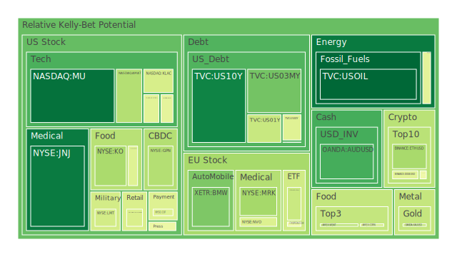
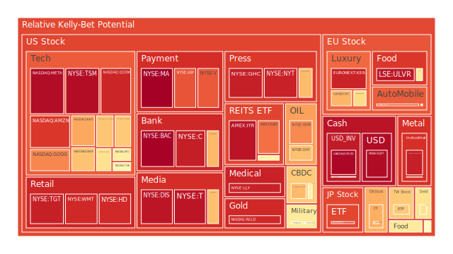
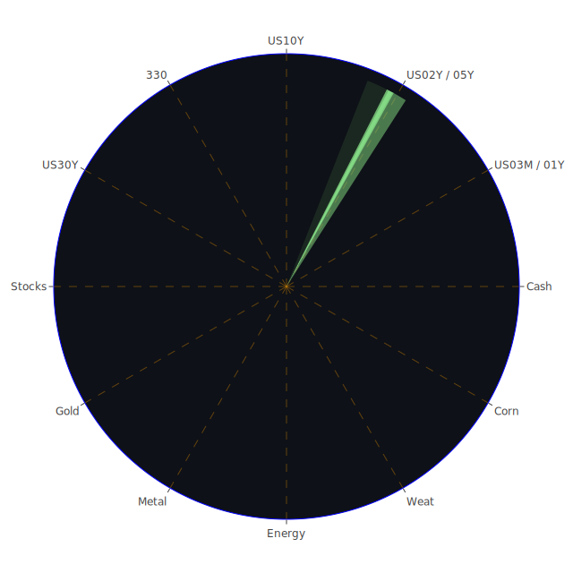

# **投資商品泡沫分析**

在當前錯綜複雜的全球經濟環境下，各類資產的價格波動與潛在泡沫風險成為市場參與者關注的核心。以下將針對各主要投資類別，結合近期市場數據、新聞事件以及宏觀經濟指標，進行深入的專業論述，旨在揭示當前狀況並導引出深思熟慮的結論。所有價格與風險評估，除非特別指出，均以2025年5月27日的數據為基準。我們觀察到，PP100代表當日現價，而泡沫指數D1、D7、D14、D30分別代表當日、七天平均、兩週平均及月平均的風險分數，分數越高意味著潛在的泡沫風險越大。

* **美國國債**

美國國債市場作為全球金融的基石，其動向備受矚目。觀察美國十年期國債（US10Y），現價約為4.51，其D1泡沫指數為0.1074，D7為0.3366，D14為0.3677，D30為0.4071。相較之下，三個月期國債（US03MY）現價約4.34，D1為0.2624，月平均D30為0.3077。一年期國債（US01Y）現價4.15，D1為0.4007，月平均D30為0.4449。二年期國債（US02Y）現價3.99，其各週期泡沫指數均為0.6099，顯示短期至中期的風險感知相對穩定但偏高。三十年期國債（US30Y）現價5.03，D1為0.4480，月平均D30為0.4868。

從空間維度看，美國國債市場與新聞的三位一體呈現為：**正（Thesis）** \- 全球避險需求、聯準會政策預期的避風港；**反（Antithesis）** \- 美國巨額財政赤字（新聞提及「買家罷買美國資產」、「無法忍受巨額赤字」）、通膨預期反覆、外國投資者減持壓力；**合（Synthesis）** \- 殖利率曲線形態變化（如10年期與3個月期利差0.16，去年同期為-1.20，顯示有所正常化但仍處低位）與市場對未來經濟路徑的博弈。聯準會數據顯示，公眾持有的債務佔GDP比重處於高位，外國機構持有的美國國債流通量偏低，而國內公眾持有量偏高，這反映了內部消化的壓力。

從時間維度看：**正** \- 歷史上，在經濟不確定性升高時，國債常作為避險工具；**反** \- 然而，當主權信用風險擔憂加劇（新聞中分析師警告美國資產的「買家罷買」），或通膨預期失控時，國債亦可能遭拋售；**合** \- 當前殖利率水平（10年期4.51%，去年同期4.15%）反映了市場對未來利率路徑的重新定價，以及對通膨持續性的擔憂。

從概念維度看：**正（經濟學/博弈論）** \- 理性預期學派認為市場已消化大部分資訊，殖利率反映均衡；**反（心理學/社會學）** \- 羊群效應可能導致非理性拋售或追捧，新聞中「債券市場恐慌被市場『遊客』過度誇大」的說法暗示了這種心理影響；**合（綜合）** \- 國債價格是多重因素（經濟基本面、政策預期、市場情緒、地緣政治）相互作用的複雜結果。新聞中提及「華爾街為更多債券市場動盪做好準備，因特朗普稅收法案引發赤字擔憂」，以及「全球投資者即使在美國市場主導地位不變的情況下也處於『拋售美國』模式」，均指向市場對美國財政可持續性的深層憂慮。聯準會總資產下降、逆回購操作(RRP)下降，而有效聯邦基金利率(EFFR)交易量仍處高位，暗示銀行體系流動性仍有需求，但整體趨勢是緊縮。

* **美國零售股**

美國零售股的代表如沃爾瑪（WMT），現價96.34，其D1泡沫指數高達0.9206，月平均D30亦有0.8756。塔吉特（TGT）現價94.29，D1為0.9376，D30為0.9103。家得寶（HD）現價362.71，D1為0.9189，D30為0.7250。好市多（COST）現價1008.50，D1為0.4336，D30為0.5541。這些數據普遍顯示零售股，特別是大型零售商，存在較高的泡沫風險。

空間三位一體：**正** \- 消費者支出仍具韌性（儘管聯準會數據顯示消費者拖欠率相對較高）；**反** \- 高利率環境侵蝕可支配收入、勞動力成本上升（新聞提及「工資是恢復美國製造業的一大障礙」）、供應鏈問題再現的可能性、特朗普關稅威脅可能導致進口商品價格上漲，進而影響零售利潤與消費者購買力；**合** \- 零售商的定價能力、庫存管理及應對消費者行為轉變的策略，將是決定其表現的關鍵。

時間三位一體：**正** \- 歷史上，強勁的就業市場和薪資增長能支持零售銷售；**反** \- 經濟衰退期，非必需消費品零售受創嚴重，當前信用卡拖欠率雖不高，但消費者拖欠率整體偏高是警訊；**合** \- 零售股表現將高度依賴宏觀經濟走向，特別是通膨控制與就業市場的穩定性。新聞中「麥當勞關閉其飲料為主的衍生品牌CosMc’s」可能反映了特定消費領域的試錯成本與競爭壓力。

概念三位一體：**正（經濟學）** \- 消費是GDP的主要組成部分，零售股是經濟的晴雨表；**反（心理學）** \- 消費者信心指數的波動會直接影響消費意願，對未來經濟的悲觀預期可能導致預防性儲蓄增加；**合（博弈論）** \- 零售商之間的價格戰、促銷策略，以及與供應商的談判能力，都是博弈的體現。目前高泡沫分數可能反映了市場對其未來盈利能力的過度樂觀預期，或是在通膨環境下，資金尋求名義增長的結果。

* **美國科技股**

美國科技股，特別是大型科技股和半導體股，泡沫指數呈現分化但整體偏高的態勢。以納斯達克100指數（NDX）為例，現價20915.65，D1為0.6769，D30為0.7567。微軟（MSFT）現價450.18，D1為0.6642，D30為0.6381。蘋果（AAPL）現價195.27，D1為0.7252，D30為0.6307；新聞提及「蘋果股價下跌，因特朗普威脅對iPhone製造商徵收25%關稅」，這直接構成了壓力。谷歌（GOOG）現價169.59，D1為0.7727，D30為0.5814。亞馬遜（AMZN）現價200.99，D1為0.8953，D30為0.7280。Meta（META）現價627.06，D1高達0.9749，D30為0.8787。特斯拉（TSLA）現價339.34，D1為0.5574，D30為0.4912，相對其他大型科技股，其短期風險評估略低，但仍處於中高水平。

半導體方面，輝達（NVDA）現價131.29，D1為0.4535，D30為0.6528；新聞提及「Nvidia將在美國出口限制後為中國推出更便宜的Blackwell AI芯片」，顯示其積極應對地緣政治風險。超微（AMD）現價110.31，D1為0.6140，D30為0.6487。英特爾（INTC）現價20.05，D1為0.5774，D30為0.5118。美光（MU）現價93.37，D1僅0.0722，D30為0.3491，泡沫指數相對較低。應用材料（AMAT）現價157.51，D1為0.3628，D30為0.6557。科磊（KLAC）現價757.17，D1為0.4283，D30為0.5452。博通（AVGO）現價228.72，D1為0.6739，D30為0.8149。高通（QCOM）現價145.38，D1為0.9265，D30為0.8414。台積電（TSM）現價191.98，D1高達0.9734，D30更是達到0.9796，泡沫風險極高。

空間三位一體：**正** \- 全球數位化轉型、AI技術革命帶來巨大需求；**反** \- 中美科技戰、供應鏈「去風險化」、各國反壟斷監管加強、特朗普關稅威脅；**合** \- 科技自主可控成為各國戰略，但全球合作仍是創新關鍵，龍頭企業憑藉技術壁壘和生態系統仍有優勢，但高估值使其對負面消息極為敏感。

時間三位一體：**正** \- 科技進步是長期趨勢，過去數十年科技股帶來了豐厚回報；**反** \- 2000年科網泡沫破裂是前車之鑑，利率上升周期往往對高估值的成長股不利；**合** \- AI的發展可能開啟新的成長周期，但需要警惕概念炒作與實際盈利能力的脫節。當前聯準會鷹派立場和高利率環境對科技股估值構成壓力。

概念三位一體：**正（經濟學）** \- 技術創新提升生產力，符合熊彼特的創新理論；**反（心理學/博弈論）** \- 市場對AI等新技術的預期可能過於樂觀，形成「錯失恐懼症」（FOMO），新聞中「頂級投資者Bill Smead：『這可能是我職業生涯中最危險的市場』」點出這種擔憂；**合（社會學）** \- 技術變革對社會結構、就業市場產生深遠影響，進而反作用於科技產業的發展環境。

* **美國房地產指數**

美國房地產指數如AMEX:VNQ，現價87.09，D1為0.5605，D30為0.4446。AMEX:IYR現價92.21，D1為0.9607，D30為0.8093，泡沫風險較高。AMEX:RWO現價43.35，D1為0.8074，D30為0.5448。聯準會數據顯示，商業房地產拖欠率和房地產整體拖欠率均處於相對高位。30年期固定抵押貸款利率高達6.86%，遠高於去年的2.99%。新聞「託管短缺讓房主面臨意外賬單」亦反映了房地產市場的壓力。

空間三位一體：**正** \- 部分地區仍有住房短缺，需求支撐；**反** \- 高利率大幅提高購房成本，商業地產（尤其是辦公樓）面臨空置率上升和價值重估壓力；**合** \- 地理位置、房產類型（住宅vs商業，城市vs郊區）導致市場表現差異化。

時間三位一體：**正** \- 房地產是傳統的抗通膨資產；**反** \- 2008年次貸危機的教訓記憶猶新，利率急升往往是房地產市場調整的導火線；**合** \- 當前高利率和高拖欠率對市場構成顯著威脅，泡沫指數的上升值得警惕。

概念三位一體：**正（經濟學）** \- 房地產是重要的經濟支柱，關聯上下游多個產業；**反（心理學）** \- 「有土斯有財」的觀念及對房價只漲不跌的預期，可能助長泡沫；**合（社會學）** \- 住房可負擔性成為社會問題，可能引發政策干預。

* **加密貨幣**

比特幣（BTCUSD）現價約109385，D1為0.4858，D30為0.5123。以太坊（ETHUSD）現價約2562.22，D1為0.3418，D30為0.4462。狗狗幣（DOGEUSD）現價0.225，D1為0.4534，D30為0.4751。加密貨幣市場的泡沫指數處於中等偏高水平，波動性依然是其主要特徵。

空間三位一體：**正** \- 全球部分投資者將其視為去中心化資產、抗通膨工具；**反** \- 各國監管政策不確定性高、駭客攻擊、市場操縱風險；**合** \- 技術應用（如DeFi, NFT）的發展與監管框架的逐步清晰，將共同塑造其未來。

時間三位一體：**正** \- 比特幣誕生以來，經歷多次牛熊轉換，價格中樞長期向上；**反** \- 缺乏內在價值支撐，價格易受市場情緒和流動性驅動，暴漲暴跌頻繁；**合** \- 作為一種新興資產類別，其長期價值仍在探索和驗證過程中。

概念三位一體：**正（博弈論/心理學）** \- 早期採用者的巨大財富效應吸引後續投機者，社群共識與網路效應是重要驅動力；**反（經濟學）** \- 挖礦耗能、交易效率、可擴展性等問題仍待解決，其作為支付手段的廣泛性受限；**合（綜合）** \- 加密貨幣是金融創新與監管挑戰並存的領域，其泡沫風險部分源於高度投機性和資訊不對稱。新聞中「Google的『AI模式』可能對Reddit不利」間接暗示了中心化平台與去中心化社群之間的潛在衝突或利益轉移，這也可能影響加密社群的輿論。

* **金/銀/銅**

黃金（XAUUSD）現價約3345.64，D1泡沫指數為0.3950，D30為0.5539。白銀（XAGUSD）現價33.43，D1高達0.9393，D30為0.9051，泡沫風險顯著。銅（COPPER）現價4.84，D1為0.5381，D30為0.5389。金礦防禦股如RGLD現價180.59，D1為0.9209，D30為0.9261，泡沫風險亦高。

空間三位一體：**正** \- 地緣政治緊張（新聞提及多個地區衝突與不安）、全球央行購金需求、美元信用長期隱憂；**反** \- 美元實際利率上升對無息資產黃金構成壓力、工業需求變化影響銅和銀；**合** \- 黃金的避險屬性與金融屬性並存，白銀兼具貴金屬和工業屬性，銅主要反映全球工業活躍度。金油比54.45，金銅比692.32，均處於歷史相對高位，可能暗示黃金相對於其他商品的強勢，或反映了市場對經濟前景的擔憂。

時間三位一體：**正** \- 黃金歷來是對沖通膨和貨幣貶值的工具；**反** \- 在強勁的經濟增長和市場風險偏好高漲時期，黃金可能跑輸風險資產；**合** \- 當前高通膨、地緣政治風險和對金融系統穩定性的擔憂，共同推升了貴金屬的配置價值，但短期過高的泡沫指數需警惕回調風險。

概念三位一體：**正（經濟學/心理學）** \- 費雪效應（名義利率等於實際利率加通膨預期）支持在高通膨預期下持有黃金，同時黃金具有「恐懼指標」的心理作用；**反（博弈論）** \- 大型機構的持倉變動和市場操縱傳聞，影響短期價格；**合（歷史）** \- 黃金在布雷頓森林體系解體後，其價格與美元強弱、全球風險事件呈現複雜的互動關係。

* **黃豆 / 小麥 / 玉米**

黃豆（SOYB）現價22.13，D1為0.5898，D30為0.6505。小麥（WEAT）現價4.62，D1為0.3756，D30為0.4213。玉米（CORN）現價18.52，D1為0.4202，D30為0.4426。農產品價格受到天氣、地緣政治（如俄烏衝突影響糧食出口）、能源價格（影響化肥和運輸成本）、農業政策以及美元匯率等多重因素影響。

空間三位一體：**正** \- 全球人口增長對糧食的剛性需求、極端天氣事件頻發；**反** \- 全球經濟放緩可能抑制需求、特定區域豐產可能壓低價格、貿易保護主義；**合** \- 糧食安全成為各國重視議題，供應鏈的穩定性至關重要。新聞中「美國農業機構取消對貧窮國家兒童的食品援助」、「泰國前總理英拉因稻米計畫被判賠償3.05億美元」均反映了糧食政策與市場的複雜互動。

時間三位一體：**正** \- 農產品價格具有週期性，受播種面積、庫存等因素影響；**反** \- 技術進步（如轉基因、農業機械化）有助於提升單位產量，可能對價格構成長期壓力；**合** \- 氣候變遷帶來的供應不確定性增加，可能導致價格波動加劇。

概念三位一體：**正（經濟學）** \- 供需基本面是決定價格的核心；**反（社會學/心理學）** \- 恐慌性囤積、投機資金炒作可能放大價格波動；**合（地緣政治）** \- 糧食作為戰略資源，其貿易流向和價格易受國際關係影響。

* **石油/ 鈾期貨UX\!**

美國原油（USOIL）現價61.43，D1泡沫指數相對較低為0.0528，但D14為0.4303，D30為0.2767，顯示近期有所降溫，但中期仍有一定風險。鈾期貨（UX1\!）現價71.55，D1為0.4583，D30為0.4886。石油防禦股如艾克森美孚（XOM）現價103.03，D1為0.7697，D30為0.8118，泡沫風險較高。西方石油（OXY）現價41.29，D1為0.6819，D30為0.7397。

空間三位一體：**正** \- OPEC+減產努力、地緣政治衝突導致供應擔憂（中東局勢）、全球經濟復甦帶動需求；**反** \- 全球推動綠色能源轉型、主要經濟體戰略石油儲備釋放、美國等非OPEC國家產量增加；**合** \- 能源價格是供需、地緣政治、投機活動和長期能源政策共同作用的結果。

時間三位一體：**正** \- 石油是現代工業的血液，其價格波動對全球經濟影響深遠；**反** \- 歷史上多次石油危機均由供應衝擊引發，但需求衝擊（如經濟衰退）亦能導致油價暴跌；**合** \- 鈾作為核燃料，其需求與核電發展前景密切相關，在能源轉型中扮演一定角色。

概念三位一體：**正（經濟學/地緣政治）** \- 寡頭壟斷（OPEC）的定價權、資源民族主義；**反（科技）** \- 新能源技術的發展對化石能源構成長期替代威脅；**合（博弈論）** \- 產油國之間、產油國與消費國之間的複雜博弈。

* **各國外匯市場**

美元兌日圓（USDJPY）現價142.55，D1高達0.9773，D30為0.7483，顯示極高泡沫風險。歐元兌美元（EURUSD）現價1.140，D1亦高達0.9864，D30為0.9300。英鎊兌美元（GBPUSD）現價1.360，D1為0.5490，D30為0.4698。澳幣兌美元（AUDUSD）現價0.650，D1為0.2011，D30為0.2933。

空間三位一體：**正** \- 各國經濟基本面差異、利率政策分化、資本流動；**反** \- 貿易摩擦（如新聞中特朗普關稅威脅）、地緣政治風險引發的避險情緒、央行干預；**合** \- 匯率是國家綜合實力的體現，也是國際資本配置的結果。美元的強勢（或特定貨幣對的高泡沫指數）可能反映了利差交易、避險需求或對美國經濟相對強韌的預期，但也使其出口承壓。

時間三位一體：**正** \- 匯率長期趨勢受購買力平價、國際收支等因素影響；**反** \- 短期內，市場情緒、突發事件、投機交易可能導致匯率大幅偏離基本面；**合** \- 全球主要央行貨幣政策的協同與分化，將是影響未來匯率走勢的關鍵。

概念三位一體：**正（經濟學）** \- 利率平價理論、蒙代爾-弗萊明模型解釋了資本流動與匯率的關係；**反（心理學/博弈論）** \- 「貨幣戰爭」的擔憂、市場對央行政策意圖的猜測；**合（綜合）** \- 外匯市場是全球流動性最高、參與者最多元化的市場，其價格形成機制極為複雜。

* **各國大盤指數**

德國DAX指數（GDAXI）現價23968.20，D1為0.4042，D30為0.5173。法國CAC40指數（FCHI）現價7806.30，D1為0.4825，D30為0.5755。英國富時100指數（FTSE）現價8803.00，D1為0.5232，D30為0.5570。日本日經225指數（JPN225）現價37499.16，D1為0.8716，D30為0.8112，泡沫風險較高。台灣加權股價指數相關ETF（0050）現價180.65，D1為0.6634，D30為0.6310。中國滬深300指數（000300）現價3860.11，D1為0.7136，D30為0.6876。

空間三位一體：**正** \- 全球經濟聯動、跨國企業盈利增長；**反** \- 各國經濟周期不同步、貿易保護主義抬頭（新聞提及「加拿大馬克勒姆稱美國關稅是『最大逆風』」、「歐盟考慮將20家銀行從SWIFT中剔除以制裁俄羅斯」）、地緣政治衝突外溢；**合** \- 全球化與區域化並存，各國股市表現既受全球宏觀環境影響，也反映自身獨特的經濟結構和產業優勢。

時間三位一體：**正** \- 長期而言，股市是分享經濟增長成果的重要途徑；**反** \- 金融危機、經濟衰退往往導致股市大幅下挫，估值泡沫破裂；**合** \- 當前全球多數股市處於高位，但面臨高利率、高通膨和經濟放緩的多重壓力，泡沫指數的普遍偏高值得關注。

概念三位一體：**正（經濟學）** \- 有效市場假說認為股價已反映所有公開資訊；**反（行為金融學）** \- 市場情緒、投資者非理性行為（如過度自信、羊群效應）導致價格偏離；**合（社會學）** \- 股市不僅是經濟指標，也是社會信心和預期的反映。

* **美國銀行股**

摩根大通（JPM）現價260.71，D1為0.6945，D30為0.7553。美國銀行（BAC）現價43.20，D1高達0.9951，D30為0.9492，泡沫風險極高。花旗集團（C）現價73.09，D1為0.9405，D30為0.8645。第一資本金融（COF）現價185.08，D1為0.4436，D30為0.5114。銀行股泡沫指數普遍偏高，尤其BAC風險顯著。聯準會數據顯示，商業房地產和消費者貸款拖欠率均處於相對高位，高收益債券利率也偏高，這對銀行資產品質構成潛在威脅。儘管美國銀行總存款處於高位，但信貸損失的風險正在積聚。

* **美國軍工股**

洛克希德馬丁（LMT）現價468.88，D1為0.4209，D30為0.7313。諾斯洛普格魯曼（NOC）現價471.46，D1為0.5730，D30為0.6679。雷神技術（RTX）現價132.35，D1為0.6004，D30為0.8311。軍工股泡沫指數處於中高水平，地緣政治緊張局勢的持續，如新聞中多處提及的地區衝突以及「白宮國家安全委員會大幅裁員重組」，可能為軍工股提供持續的訂單預期，但也需注意其估值是否已充分反映這些預期。

* **美國電子支付股**

Visa（V）現價353.54，D1為0.8424，D30為0.7861。萬事達卡（MA）現價563.58，D1為1.0000（最高值），D30為0.8189，泡沫風險極高。美國運通（AXP）現價285.22，D1為0.8499，D30為0.8511。PayPal（PYPL）現價69.85，D1為0.5709，D30為0.7640。環匯公司（GPN）現價74.09，D1為0.3627，D30為0.3856，風險相對較低。電子支付行業受益於無現金化趨勢，但高泡沫指數顯示市場可能已過度定價其成長性，同時需關注監管風險和競爭加劇。

* **美國藥商股**

嬌生（JNJ）現價152.94，D1為0.0901，D30為0.2267，泡沫指數相對較低。默克（MRK）現價77.58，D1為0.3367，D30為0.4481。禮來（LLY）現價713.71，D1高達0.9341，D30為0.9335，泡沫風險極高，可能與其減肥藥等爆款產品的市場預期有關。諾和諾德（NVO，雖非美國公司但在美股市場重要）現價67.35，D1為0.4414，D30為0.5623。藥商股受專利懸崖、藥品定價政策、研發成功率等多方面因素影響，個股分化明顯。

* **美國影視股**

迪士尼（DIS）現價109.72，D1為0.9566，D30為0.7347，泡沫風險偏高。派拉蒙全球（PARA）現價11.97，D1為0.4991，D30為0.4808。網飛（NFLX）現價1185.39，D1為0.6817，D30為0.4978。影視行業面臨流媒體競爭白熱化、內容成本高漲、廣告市場波動等挑戰。

* **美國媒體股**

福斯公司（FOX）現價50.43，D1為0.4810，D30為0.8386。紐約時報（NYT）現價55.41，D1為0.9344，D30為0.7529。康卡斯特（CMCSA）現價34.52，D1為0.6912，D30為0.4582。傳統媒體轉型壓力大，新媒體則面臨用戶增長瓶頸和內容變現的挑戰。高泡沫指數可能反映了市場對某些媒體公司轉型成功或併購價值的預期。

* **石油防禦股 / 金礦防禦股**

已在石油和金屬部分提及。XOM、OXY、RGLD等股票的高泡沫指數，一方面反映了其在特定宏觀環境下的防禦價值被市場追捧，另一方面也提示了追高風險。

* **歐洲奢侈品股**

愛馬仕（RMS）現價2389.00，D1為0.6296，D30為0.6112。LVMH集團（MC）現價483.45，D1為0.7009，D30為0.4957。開雲集團（KER）現價175.24，D1為0.9307，D30為0.8222，泡沫風險較高。奢侈品行業對全球經濟景氣度、高淨值人群消費意願敏感，同時受匯率波動影響。

* **歐洲汽車股**

寶馬（BMW）現價76.80，D1為0.2772，D30為0.5487。賓士（MBG）現價51.59，D1為0.5307，D30為0.5016。保時捷（PAH3）現價35.29，D1為0.8620，D30為0.6040。歐洲汽車股面臨向電動化轉型的挑戰、來自中國等新興市場的競爭、以及歐盟環保法規的壓力。

* **歐美食品股**

可口可樂（KO）現價71.77，D1為0.3462，D30為0.6425。卡夫亨氏（KHC）現價26.30，D1為0.4474，D30為0.7262。雀巢（NESN）現價88.64，D1為0.5970，D30為0.5573。聯合利華（ULVR）現價4695.00，D1為0.9570，D30為0.9429，泡沫風險高。食品股通常被視為防禦性板塊，但在高通膨環境下，成本轉嫁能力和品牌忠誠度面臨考驗。

# **宏觀經濟傳導路徑分析**

當前宏觀經濟呈現多重矛盾：聯準會一方面試圖透過降低總資產來收緊流動性，但EFFR交易量高企顯示銀行間拆借需求仍旺盛。高收益債券利率與各類貸款拖欠率（尤其是商業地產）上升，是經濟承壓的明顯信號。CPI年增率雖有回落至2.33%，但聯準會仍維持鷹派基調（近期1次鷹派發言，0次鴿派），顯示其對通膨的警惕未減。

正（Thesis）： 財政刺激與疫情後的儲蓄釋放，一度推動經濟強勁復甦，企業盈利改善。  
反（Antithesis）： 持續的緊縮政策、高企的政府債務（佔GDP比重高）、地緣政治衝突（新聞中多處提及，如俄烏、中東、美中緊張關係下的關稅威脅）以及供應鏈重塑，共同推高了全球經濟運行的成本和不確定性。新聞提及「美國資產面臨『買家罷買』」、「全球投資者『拋售美國』模式」、「美國財政狀況不可持續」等，均是此負面因素的體現。  
合（Synthesis）： 全球經濟可能進入一個增長放緩、通膨黏性較高、金融市場波動加劇的階段。政策制定者在抑制通膨、維持金融穩定和避免深度衰退之間面臨艱難抉擇。資金流向將更為審慎，對資產品質和確定性的要求提高。  
傳導路徑猜想：

1. **聯準會持續緊縮 \-\> 利率維持高位 \-\> 企業融資成本上升/消費者信貸惡化 \-\> 投資與消費意願下降 \-\> 經濟增長放緩/衰退風險增加 \-\> 企業盈利下滑 \-\> 股市承壓。** 目前高企的泡沫指數顯示市場可能尚未完全消化此路徑的負面影響。  
2. **地緣政治風險加劇（如新聞中特朗普關稅威脅、俄羅斯被限制SWIFT、伊朗核談判等）-\> 能源/大宗商品價格波動 \-\> 供應鏈受阻 \-\> 通膨壓力再起 \-\> 央行被迫維持緊縮 \-\> 滯脹風險。** 此路徑下，黃金、石油、軍工等特定板塊可能受益，但整體經濟受損。  
3. **美國巨額財政赤字與國債發行壓力 \-\> 外國投資者信心動搖（新聞提及）-\> 美元及美債吸引力下降 \-\> 融資成本被迫提高/美元貶值壓力 \-\> 輸入性通膨 \-\> 進一步複雜化聯準會政策。**

# **微觀經濟傳導路徑分析**

從微觀層面看，企業和個人正感受到宏觀壓力的傳導。

正（Thesis）： 部分企業（尤其科技龍頭）憑藉技術壁壘和市場規模，仍能實現盈利增長。勞動力市場在某些領域依然緊張，支撐薪資水平。  
反（Antithesis）： 更多企業面臨成本上升（原材料、勞動力、融資）和需求放緩的雙重擠壓。新聞中「工資是恢復美國製造業的一大障礙，但問題並非你想的那樣」，暗示了結構性問題。消費者方面，高通膨侵蝕購買力，儲蓄消耗，拖欠率上升（聯準會數據支持）。新聞「託管短缺讓房主面臨意外賬單」即是例證。  
合（Synthesis）： 行業和企業之間的分化將加劇。「贏者通吃」現象可能更為明顯，但整體而言，企業利潤空間承壓，破產風險可能上升。消費者將更注重性價比，消費降級現象可能擴散。  
傳導路徑猜想：

1. **上游成本壓力（能源、原材料） \-\> 製造商/服務商成本轉嫁能力面臨考驗 \-\> 若無法有效轉嫁 \-\> 利潤率受損 \-\> 削減成本（裁員、降薪、減少投資） \-\> 消費者收入預期下降/失業增加 \-\> 需求進一步萎縮。**  
2. **高利率環境 \-\> 企業債務負擔加重 \-\> 信用評級下調風險 \-\> 再融資困難 \-\> 債務違約/破產。** 這對銀行股的資產品質構成直接威脅。  
3. **消費者信心不足/實際收入下降 \-\> 可選消費品需求下降（如高端零售、部分影視娛樂） \-\> 相關企業營收下滑 \-\> 股價承壓。** 歐洲奢侈品的高泡沫指數在此背景下顯得脆弱。

# **資產類別間傳導路徑分析**

資產價格的聯動性在當前環境下尤為複雜，既有傳統的負相關避險機制，也有因共同宏觀驅動因素導致的同向波動。

**三位一體篩選假設（以債市與股市為例）：**

* **正（傳統理論）：** 債市與股市通常呈負相關。經濟向好，股市漲，資金流出債市，債券跌；經濟悲觀，股市跌，資金流入債市避險，債券漲。  
* **反（當前情境）：** 在高通膨和央行同步緊縮的背景下，可能出現「股債雙殺」。通膨高企侵蝕債券實際回報，利率上升打壓債券價格；同時，高利率和經濟衰退預期也打擊股市估值和企業盈利。新聞中對債券市場的擔憂與股市的下跌同時出現，部分印證了此點。  
* **合（未來展望）：** 若市場預期央行緊縮見頂並可能轉向寬鬆（例如為應對深度衰退），則可能重現債市先於股市反彈，或股市因預期流動性改善而上漲。但目前聯準會鷹派立場下，此情境尚不明朗。美國10年期與2年期殖利率利差雖然仍為正（4.51% vs 3.99%），但與3個月期利差（0.16%）相比，曲線形態仍顯平坦，歷史上這種形態往往預示經濟放緩。

**可能的漣漪效應傳導路徑：**

1. **美元指數走強（如USDJPY高泡沫）-\> 壓抑大宗商品價格（以美元計價） \-\> 緩解部分輸入性通膨壓力，但同時打擊新興市場（資本外流、償債壓力）-\> 新興市場需求減弱，可能反過來影響全球增長。**  
2. **科技股高估值回調（如AAPL受關稅影響，TSM、META泡沫指數極高）-\> 市場風險偏好急劇下降 \-\> 資金流向避險資產（黃金、短期美債），或現金 \-\> 帶動整體股市下跌，並可能觸發流動性危機。**  
3. **房地產市場風險暴露（如IYR高泡沫，商業地產拖欠率上升）-\> 衝擊銀行資產負債表（BAC、C泡沫指數高）-\> 信貸緊縮加劇 \-\> 進一步抑制實體經濟活動。**  
4. **能源價格再次飆升（若地緣政治惡化）-\> 推高通膨預期 \-\> 迫使央行採取更激進緊縮措施 \-\> 加劇經濟衰退風險 \-\> 打擊除能源股外的大部分資產。**  
5. **地緣政治衝突升級（新聞中多點潛在衝突）-\> 軍工股（LMT, RTX）需求上升，股價上漲 \-\> 市場避險情緒推高黃金（XAUUSD）-\> 全球貿易受阻，供應鏈斷裂 \-\> 衝擊依賴全球貿易的企業（如部分零售、科技、汽車股）。**

風險對沖機會（尋求相位約120度，相關係數約-0.5的定性組合）：  
在當前環境下，傳統的股債負相關性可能減弱。以下為一些概念性對沖組合：

* **組合一：做多黃金（XAUUSD）/ 做空高估值科技股（如META, TSM）：**  
  * **邏輯：** 地緣政治風險、通膨擔憂、市場避險情緒升溫時，黃金通常上漲；而高估值科技股在利率上升、風險偏好下降時容易回調。黃金的D30泡沫分數0.5539，META為0.8787，TSM為0.9796，顯示後者風險更高。相位上，危機爆發時，科技股可能先跌，黃金後漲或同漲但幅度不同。  
* **組合二：做多短期美國國債（如US03MY，儘管目前泡沫指數不高，但主要考慮其避險和流動性）/ 做空高風險公司債或房地產信託（REITs，如IYR D1為0.9607）：**  
  * **邏輯：** 經濟衰退或信用危機時，資金湧向高信用等級的短期國債，而高風險債券和與經濟周期密切相關的房地產則會受損。短期國債對利率變動的敏感性低於長期國債。  
* **組合三：做多美元（或相對強勢貨幣對如USDJPY，儘管其泡沫指數已極高，需謹慎）/ 做空新興市場貨幣或依賴出口的商品貨幣（如AUDUSD，D30為0.2933，相對較低，但受全球需求影響大）：**  
  * **邏輯：** 全球避險情緒升溫或美國利率維持高位時，美元易漲。新興市場或商品貨幣則可能因資本外流和商品價格下跌而承壓。需注意USDJPY已處於極高泡沫水平，操作風險大。

這些組合的有效性取決於宏觀環境的演變，且「-0.5相關係數」和「120度相位」是理想化定性描述，實際市場中資產關係動態多變。

# **投資建議**

基於上述分析，當前市場環境充滿不確定性，高泡沫資產眾多，建議投資者採取極為謹慎的態度，並根據自身風險承受能力進行資產配置。

穩健型投資組合 (Robust Portfolio):  
此組合追求資本保值和低波動，適合風險厭惡型投資者。

* **配置比例：**  
  * 短期美國國債 (如US03MY, US01Y): 40%  
  * 黃金 (XAUUSD): 30%  
  * 低波動、高股息藍籌股 (如JNJ, KO): 30%  
* **子項目選擇與理由：**  
  1. **US03MY (美國三個月期國債):** 現價4.34，D30泡沫指數0.3077。在利率環境高企且可能持續的背景下，短期國債提供相對穩定的票息收入和較高的流動性，且久期風險較低。  
  2. **XAUUSD (黃金):** 現價3345.64，D30泡沫指數0.5539。鑒於地緣政治風險持續、全球債務高企以及潛在的滯脹擔憂，黃金作為傳統避險資產和價值儲存手段，具有配置價值。儘管D30略高，但其在不確定環境下的對沖作用不可或缺。  
  3. **JNJ (嬌生):** 現價152.94，D30泡沫指數0.2267。作為醫療保健龍頭，其業務需求相對穩定，受經濟周期影響較小，且具有較低泡沫分數和穩健的派息記錄。

成長型投資組合 (Growth Portfolio):  
此組合追求在可控風險下實現資本增值，適合有一定風險承受能力的投資者。

* **配置比例：**  
  * 優質科技股 (如MSFT, GOOG): 35%  
  * 半導體產業鏈核心企業 (如MU, AMAT): 35%  
  * 醫療創新領域 (如NVO，或特定低風險藥股MRK): 30%  
* **子項目選擇與理由：**  
  1. **MSFT (微軟):** 現價450.18，D30泡沫指數0.6381。其在雲計算、企業服務和AI領域的領先地位，使其具備長期增長潛力。雖然泡沫指數中等偏高，但其基本面強勁。  
  2. **MU (美光科技):** 現價93.37，D30泡沫指數0.3491。作為記憶體晶片製造商，受益於AI發展帶動的數據中心需求，且當前泡沫指數在半導體行業中相對較低，具備一定的安全邊際和成長空間。  
  3. **MRK (默克):** 現價77.58，D30泡沫指數0.4481。在醫藥領域擁有多款重磅藥物，研發管線豐富，估值相對合理，能在追求成長的同時提供一定防禦性。

高風險型投資組合 (High-Risk Portfolio):  
此組合追求高回報，願意承擔較大波動和潛在損失，適合風險偏好較高的投資者。

* **配置比例：**  
  * 特定高成長科技股/概念股 (如NVDA，儘管泡沫高，但代表AI趨勢): 30%  
  * 加密貨幣 (BTCUSD): 30%  
  * 高 beta 或困境反轉潛力股 (如PYPL，若其能成功轉型): 40%  
* **子項目選擇與理由：**  
  1. **NVDA (輝達):** 現價131.29，D30泡沫指數0.6528。AI晶片的絕對龍頭，市場對其未來增長給予極高預期。高風險高回報的典型代表，需密切關注行業動態和估值變化。  
  2. **BTCUSD (比特幣):** 現價109385，D30泡沫指數0.5123。作為市值最大的加密貨幣，具有一定的市場共識和機構參與度。高波動性是其固有特徵，適合尋求另類資產配置且能承受大幅波動的投資者。  
  3. **PYPL (PayPal):** 現價69.85，D30泡沫指數0.7640。電子支付領域的老牌企業，近年面臨成長挑戰，股價大幅回調。若其戰略調整成功，可能具備困境反轉的潛力，但目前泡沫指數仍偏高，風險較大。

# **風險提示**

投資有風險，市場總是充滿不確定性。我們的建議僅供參考，投資者應根據自身的風險承受能力和投資目標，做出獨立的投資決策。

本報告所引用的泡沫指數（D1, D7, D14, D30）是基於特定模型的量化評估，旨在提供市場風險的一個視角，並不構成未來價格走勢的精確預測。高泡沫指數警示潛在風險，但不代表相關資產價格必然下跌；同理，低泡沫指數也不保證資產價格一定上漲。

當前全球經濟金融環境極為複雜，多重因素交織影響。新聞事件（如貿易政策變動、地緣政治衝突、央行表態等）可能迅速改變市場預期和資產價格。例如，新聞中反覆提及的特朗普關稅威脅，若成為現實，將對全球貿易格局和相關產業鏈產生重大影響。聯準會的政策路徑、美國財政赤字的可持續性、以及全球主要經濟體的增長前景，都是需要密切關注的宏觀變量。

投資者在做出任何投資決策前，應充分了解相關產品的特性和風險，並建議諮詢專業的財務顧問。市場過去的表現並不能預示未來結果。請務必謹慎評估，理性投資。

 
Daily Buy Map:

 
Daily Sell Map:

 
Daily Radar Chart:

 
