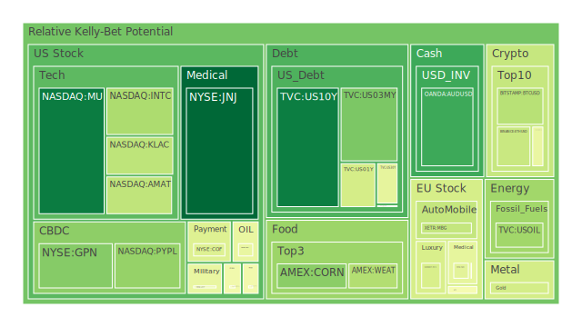
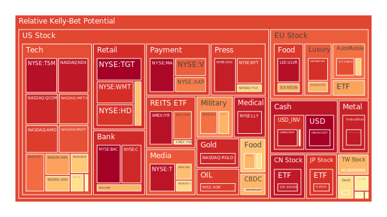
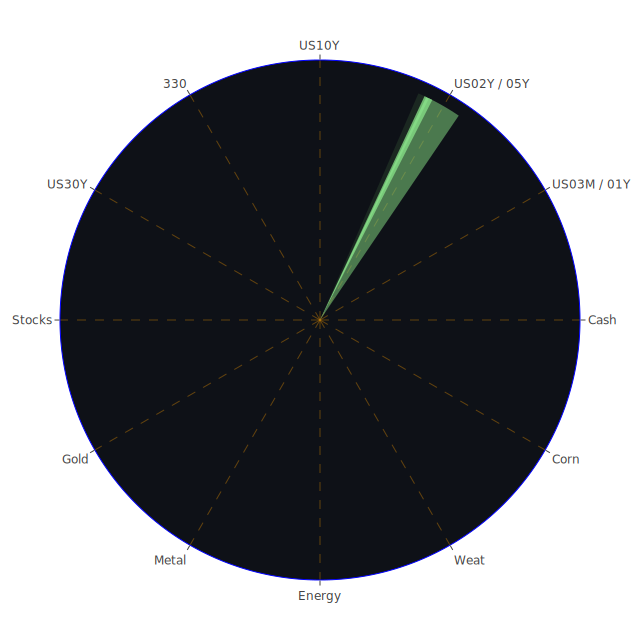

# **投資商品泡沫分析**

當前全球金融市場風雲變幻，各類資產在多重因素交織影響下，呈現出複雜的價格動態與潛在的泡沫風險。我們將秉持公正客觀的立場，深入剖析各主要投資商品的現狀，並結合經濟學、社會學、心理學及博弈論等多個視角，旨在揭示市場現象背後的深層邏輯，而非進行主觀臆測或情緒渲染。此份報告時間節點為2025年5月28日，所有數據與分析均基於此時點前的公開資訊。

* 美國國債  
  美國國債市場近期波動顯著，以十年期美國國債（US10Y）為例，其當日現價為4.4500，泡沫指數D1為0.071474，顯示短期泡沫風險相對較低。然而，觀察其D7、D14及D30數據（分別為0.289939, 0.333552, 0.396102），則揭示出在中長期維度上，市場對其定價的疑慮有所積聚。FED的經濟數據顯示，雖然EFFR成交量上升趨勢停止或反轉，且聯儲總資產持續下降，顯示流動性有收緊跡象，但美國公債殖利率曲線的形態，例如十年期與三個月期利差（US Yield 10Y-03M）為0.13，雖略有回正，但先前曾出現倒掛，歷史上此現象常被視為經濟衰退的警訊。新聞層面，「華爾街因川普稅收法案引發赤字擔憂，債市動盪加劇」以及「外國投資者因巨大赤字不再青睞美國資產」等負面消息（強度高達95%及94%），無疑加劇了市場對美國財政可持續性的擔憂。這從博弈論角度看，市場參與者可能正在重新評估持有長期美債的風險溢價。社會心理層面，對政府赤字和未來償債能力的信心侵蝕，會直接影響國債需求。  
  短期美國國債方面，三個月期國債（US03MY）現價4.3200，D1泡沫指數0.254396，一年期國債（US01Y）現價4.1500，D1泡沫指數0.407590，二年期國債（US02Y）現價3.9800，D1泡沫指數0.609932，三十年期國債（US30Y）現價4.9500，D1泡沫指數0.448025。可見短端利率雖高，但市場對其短期泡沫的評估不一，二年期債券的泡沫指數相對較高，可能反映了市場對未來短期利率路徑的不確定性以及對通膨預期的博弈。FED持續釋放鷹派信號（近期一次鷹派發言），疊加商業房地產和消費貸款拖欠率處於相對高位，高收益債券利率亦在高檔，這些都對債券市場構成壓力。從空間三位一體的角度觀察，新聞中對美國財政赤字的警告（正題），引發市場對美債信用的擔憂（反題），最終可能導致投資者要求更高的風險溢價，或轉向其他避險資產（合題）。  
* 美國零售股  
  沃爾瑪（WMT）現價97.5800，D1泡沫指數高達0.902663，且D7、D14、D30均在0.9以上（分別為0.905440, 0.905675, 0.882883），顯示其泡沫風險持續處於高位。塔吉特（TGT）現價96.9900，D1泡沫指數更是達到0.996551，是所列資產中最高的之一。家得寶（HD）現價370.4000，D1泡沫指數0.892750。好市多（COST）現價1017.7900，D1泡沫指數0.665950。  
  零售股的高泡沫指數可能與幾個因素有關。經濟數據中，消費者拖欠率處於相對高位，信用卡拖欠率（整體及100大銀行）卻處於相對低位，這可能意味著壓力集中在特定消費群體，或者更廣泛的壓力尚未完全顯現。然而，「Escrow shortages are leaving homeowners with unexpected bills」的新聞（負面，96%）提示了消費者未來可支配收入可能面臨的壓力。從社會學角度看，即便存在經濟壓力，消費習慣的慣性及品牌忠誠度仍可能在短期內支撐龍頭零售企業的股價。博弈論觀點下，市場可能在預期這些大型零售商憑藉其市場地位和供應鏈管理能力，能夠較好地轉嫁成本或維持營收增長。然而，如此高的泡沫指數，歷史上往往預示著調整的可能。  
* 美國科技股  
  科技股板塊呈現分化。納斯達克100指數（NDX）現價21414.9900，D1泡沫指數0.946565，顯示整體科技股板塊泡沫程度較高。蘋果（AAPL）現價200.2100，D1泡沫指數0.725295；微軟（MSFT）現價460.6900，D1泡沫指數0.849083；谷歌（GOOG）現價173.9800，D1泡沫指數0.806522；亞馬遜（AMZN）現價206.0200，D1泡沫指數0.652577；Meta（META）現價642.3200，D1泡沫指數0.884557。這些大型科技股均表現出較高的泡沫水平。  
  新聞中「Google's 'AI Mode' could be bad for Reddit」（負面，96%）以及「Nvidia has lost its shock power to investors, for now」（負面，85%）提示了AI領域可能出現的競爭格局變化以及投資者情緒的微妙轉變。然而，特斯拉（TSLA）現價362.8900，D1泡沫指數0.535081，相對溫和，且「Tesla is going all in to finish first in the robotaxi race」（正面，58%）的消息可能為其提供了支撐。從心理學角度看，科技股尤其是AI相關概念，在過去一段時間內承載了市場極大的樂觀預期（FOMO情緒），推高了估值。博弈論的角度，資金追逐高成長性，使得龍頭科技股成為機構配置的重點，但也加劇了擁擠交易的風險。歷史上，1999-2000年的科技泡沫破裂前，也出現過類似的對新興技術的極度樂觀和高估值。  
* 美國房地產指數  
  美國房地產指數（VNQ）現價88.6100，D1泡沫指數0.559488。另一房地產指數（IYR）現價93.7300，D1泡沫指數高達0.962523。專注於全球房地產的RWO現價44.1100，D1泡沫指數為0.818765。  
  FED數據顯示，商業房地產和一般房地產拖欠率均處於相對高位。固定30年期抵押貸款利率高達6.86%，遠高於去年的2.99%，對房地產市場構成顯著壓力。新聞「Escrow shortages are leaving homeowners with unexpected bills」（負面，96%）也側面印證了房地產持有成本的上升。從經濟學角度，高利率環境顯著增加了購房和融資成本，抑制了需求和投資。社會學層面，住房可負擔性下降可能引發更廣泛的社會問題。IYR的高泡沫指數值得警惕，可能反映了市場對特定房地產板塊（如物流、數據中心等）的過度樂觀，或者是指數成分股的特殊性。  
* 加密貨幣  
  比特幣（BTCUSD）現價108889.0000，D1泡沫指數0.351964，但其D30泡沫指數為0.514503，顯示長期泡沫風險略高於短期。以太幣（ETHUSD）現價2657.2100，D1泡沫指數0.384233。狗狗幣（DOGEUSD）現價0.2267，D1泡沫指數0.457521。  
  加密貨幣市場本身波動性極高，其價格受市場情緒、監管政策、技術進展等多方面因素影響。從心理學角度看，加密貨幣的投資者群體中，投機和追求短期高回報的心理較為普遍。博弈論的觀點，加密市場更像一個資訊不對稱和多方博弈的場所。近期FED的鷹派立場和流動性收緊趨勢，理論上不利於風險資產，但加密貨幣的表現似乎顯示出一定的韌性，可能與其「數位黃金」的敘事或特定技術升級的預期有關。然而，其內在價值的不確定性和監管風險始終是懸在其上方的達摩克利斯之劍。  
* 金/銀/銅  
  黃金（XAUUSD）現價3310.9400，D1泡沫指數0.405417，但D14高達0.691930，表明近期有所降溫，但前兩週熱度較高。白銀（XAGUSD）現價33.3000，D1泡沫指數高達0.944570，且D7、D14、D30均在0.9以上，顯示其處於顯著的泡沫狀態。銅（COPPER）現價4.7400，D1泡沫指數0.516277。  
  新聞中「The bad economic vibes are causing more people to stock up on gold」（負面情緒引發正面行為，87%）解釋了黃金需求的部分原因。金銀通常被視為避險資產和通膨對沖工具。在當前地緣政治緊張（如中東局勢、烏克蘭問題未解）、全球多國大選臨近、以及對主要經濟體財政狀況擔憂的背景下，黃金的避險屬性得到強化。白銀除了貴金屬屬性外，還有其工業屬性（如太陽能板），其價格飆升可能與投機資金湧入及特定工業需求預期有關。黃金與石油比率（GOLD OIL RATIO）為54.11，高於去年同期的31.77，顯示黃金相對於石油表現強勢。黃金與銅比率（GOLD COPPER RATIO）為698.15，亦高於去年，可能反映了市場對全球經濟增長前景的擔憂（銅需求與工業活動相關）甚於通膨。  
* 黃豆 / 小麥 / 玉米  
  黃豆ETF（SOYB）現價22.1100，D1泡沫指數0.522813。小麥ETF（WEAT）現價4.5100，D1泡沫指數0.341949。玉米ETF（CORN）現價18.3800，D1泡沫指數0.277472。  
  農產品價格受天氣、地緣政治、供應鏈、能源價格以及美元匯率等多重因素影響。新聞「Exclusive-US farm agency cancels food aid for children in poor countries」（負面，94%）以及「In Gaza, limited food aid meets desperate crowds and looting」（負面，93%），揭示了全球糧食安全問題的嚴峻性，可能對部分農產品價格構成支撐。然而，美元走強通常會對以美元計價的商品價格構成壓力。從博弈論角度看，大型農業公司和國家級買家在期貨市場的套期保值和投機行為也會顯著影響價格。目前看來，這三種主要農產品的泡沫指數相對溫和，玉米的泡沫指數最低。  
* 石油/ 鈾期貨UX\!  
  美國原油（USOIL）現價61.2200，D1泡沫指數0.311414，泡沫程度相對較低，且D30為0.286188，顯示月度泡沫風險亦不高。鈾期貨（UX1\!）現價71.8000，D1泡沫指數0.510716。  
  石油價格受到OPEC+產量政策、全球經濟增長預期、地緣政治風險（尤其是中東地區）以及能源轉型趨勢的影響。近期歐洲天然氣價格因挪威供應中斷而上漲的新聞，也可能間接影響整體能源市場情緒。鈾作為核燃料，其價格與核電發展前景密切相關。在全球推動能源轉型和能源獨立的背景下，核能的討論熱度有所回升，這可能為鈾價提供支撐。然而，石油價格的相對平穩，可能反映了市場對全球經濟需求放緩的擔憂，以及美國等非OPEC國家產量增加的影響。  
* 各國外匯市場  
  美元兌日圓（USDJPY）現價144.0600，D1泡沫指數高達0.994649，是泡沫風險最高的資產之一，其D7亦達0.962004。歐元兌美元（EURUSD）現價1.1300，D1泡沫指數0.957142，同樣處於高泡沫水平。英鎊兌美元（GBPUSD）現價1.3500，D1泡沫指數0.568033。澳元兌美元（AUDUSD）現價0.6400，D1泡沫指數0.168358，泡沫程度較低。  
  美元兌日圓的極高泡沫指數，與日本央行長期維持超寬鬆貨幣政策而美聯儲持續緊縮的巨大利差密切相關。市場可能在博弈日本央行政策轉向的時點。歐元兌美元的高泡沫指數則可能反映了市場對歐洲央行未來政策路徑以及歐元區經濟前景的複雜預期，新聞中「Lagarde Sees Opportunities to Raise Euro’s Global Profile」（正面，90%）與此形成對比，可能存在預期與現實的博弈。澳元作為商品貨幣，其相對較低的泡沫指數可能與市場對全球大宗商品需求前景的溫和預期，以及澳洲聯儲的政策立場有關。FED數據顯示，與外國相關辦事處的淨應付款項處於高位，美元流動性的變化對全球匯市影響深遠。  
* 各國大盤指數  
  德國DAX指數（GDAXI）現價24289.1000，D1泡沫指數0.485213。英國富時100指數（FTSE）現價8798.2000，D1泡沫指數0.565969。法國CAC40指數（FCHI）現價7851.8000，D1泡沫指數0.720503。日經225指數（JPN225）現價38194.6000，D1泡沫指數0.896086。台灣加權股價指數（0050為其ETF代表）現價179.0500，D1泡沫指數0.687311。中國滬深300指數（000300）現價3839.4000，D1泡沫指數0.946794。  
  各國股市表現差異顯著。日經指數和滬深300指數的泡沫評分均處於高位。日經指數的上漲可能與日圓貶值有利出口、企業治理改革以及資金流入有關。滬深300指數的高泡沫評分，則可能與市場對中國經濟復甦的預期以及政策支持有關，但同時也需要警惕其不確定性。歐洲方面，法國CAC40指數泡沫程度高於德英，可能與其奢侈品行業的強勢表現有關（後續會討論）。台灣股市的表現則與全球科技週期，特別是半導體行業的景氣度密切相關。新聞中「Shipping Bottlenecks in Europe Send a Warning to US, Asia」（負面，91%）以及中國電動車製造商降價競爭加劇的消息，都可能對全球貿易和相關股市產生影響。  
* 美國半導體股  
  輝達（NVDA）現價135.5000，D1泡沫指數0.602782。超微（AMD）現價114.5600，D1泡沫指數0.879501。英特爾（INTC）現價20.5500，D1泡沫指數0.332171。高通（QCOM）現價148.6300，D1泡沫指數0.920624。美光（MU）現價96.3800，D1泡沫指數0.067316，是半導體股中泡沫指數最低的。應用材料（AMAT）現價161.8300，D1泡沫指數0.367232。科磊（KLAC）現價789.0600，D1泡沫指數0.364318。博通（AVGO）現價235.6500，D1泡沫指數0.667430。台積電（TSM）現價197.6800，D1泡沫指數高達0.964371。  
  半導體行業內部呈現顯著分化。台積電、高通、AMD的泡沫指數非常高，而美光、英特爾則相對較低。這反映了市場對不同細分領域（如AI晶片、CPU、記憶體、通訊晶片）以及不同公司競爭地位的差異化預期。輝達雖然D1不高，但其市值巨大，且新聞提到「Nvidia has lost its shock power」，暗示市場對其超高預期的持續性有所疑慮。「Why Nvidia’s rise could signal bad news for climate goals」也從ESG角度提出了新的觀察點。台積電作為行業龍頭，其高泡沫指數可能與AI需求持續強勁、先進製程領先等因素有關，但也需注意地緣政治風險。  
* 美國銀行股  
  摩根大通（JPM）現價265.2900，D1泡沫指數0.692322。美國銀行（BAC）現價44.2200，D1泡沫指數0.996104，極高。花旗集團（C）現價75.4700，D1泡沫指數0.916372。第一資本金融（COF）現價192.0500，D1泡沫指數0.427892。  
  大型銀行股的泡沫指數普遍偏高，尤其是美國銀行和花旗。這可能與市場預期利率環境持續在高位有利於銀行淨息差有關，或者與其在資本市場業務的表現有關。然而，FED數據顯示商業房地產和消費貸款拖欠率上升，高收益債券利率高企，這些都是銀行潛在的風險點。從博弈論角度，銀行股是經濟的晴雨表，其高泡沫可能織入了對經濟軟著陸甚至持續增長的樂觀預期。若經濟不如預期，銀行資產品質惡化的風險不容忽視。  
* 美國軍工股  
  洛克希德馬丁（LMT）現價476.8500，D1泡沫指數0.456114。諾斯洛普格魯曼（NOC）現價475.4700，D1泡沫指數0.693642。雷神技術（RTX）現價134.1900，D1泡沫指數高達0.800438。  
  軍工股的表現與地緣政治緊張局勢密切相關。持續的俄烏衝突、中東地區的不穩定以及其他潛在的地區衝突，都為軍工企業提供了訂單預期。RTX的泡沫指數相對較高，可能反映了市場對其在特定領域（如導彈防禦、航空發動機）的樂觀預期。從社會學角度看，國際安全環境的惡化，使得國防開支增加的預期得到強化。然而，軍工股也受制於政府預算、採購週期等因素，且高泡沫本身意味著調整風險。  
* 美國電子支付股  
  Visa（V）現價359.3000，D1泡沫指數0.825729。萬事達卡（MA）現價574.5500，D1泡沫指數高達0.982299。美國運通（AXP）現價293.7600，D1泡沫指數0.777144。PayPal（PYPL）現價71.4800，D1泡沫指數0.294275。Global Payments（GPN）現價75.7500，D1泡沫指數0.269592。  
  傳統支付巨頭Visa、萬事達卡、美國運通的泡沫指數均處於高位，尤其是萬事達卡。這可能反映了其強大的網絡效應、穩定的盈利能力以及在全球消費支付領域的持續滲透。相比之下，PayPal和Global Payments的泡沫指數較低，可能與其面臨更激烈的市場競爭（如來自Apple Pay、Google Pay以及新興金融科技公司的挑戰）或特定的業務調整有關。從經濟學角度，電子支付行業的增長與整體經濟活動和消費支出密切相關。  
* 美國藥商股  
  嬌生（JNJ）現價153.2500，D1泡沫指數僅0.027190，是所有資產中最低的之一，顯示市場認為其泡沫風險極低。默克（MRK）現價77.5900，D1泡沫指數0.489709。禮來（LLY）現價725.2200，D1泡沫指數高達0.935172。諾和諾德（NVO）現價70.4400，D1泡沫指數0.441447。  
  藥商股內部表現差異巨大。禮來因其在減肥藥和糖尿病藥物領域的突破性進展，股價持續走高，泡沫指數也位居前列，反映了市場對其未來銷售增長的極高預期，這其中包含了心理學上的「明星股效應」。嬌生作為業務多元化的大型藥企及消費品公司，其極低的泡沫指數可能表明市場對其估值較為謹慎，或認為其增長前景相對平穩。諾和諾德同樣受益於減肥藥市場，泡沫指數也相對溫和。默克的泡沫指數居中。藥品研發的高風險、專利懸崖以及政策監管（如藥價談判）是該行業普遍面臨的挑戰。  
* 美國影視股  
  迪士尼（DIS）現價112.3600，D1泡沫指數0.672782。Netflix（NFLX）現價1211.5700，D1泡沫指數0.621360。派拉蒙全球（PARA）現價12.0300，D1泡沫指數0.478401。  
  影視娛樂行業面臨流媒體競爭白熱化、內容成本上升、廣告市場不確定以及消費者偏好轉變等挑戰。迪士尼和Netflix作為行業巨頭，其泡沫指數中等偏高，可能反映了市場對其品牌影響力、內容庫以及全球擴張能力的認可，但也織入了對其轉型成功的預期。派拉蒙全球的泡沫指數相對較低，可能與其規模較小、在流媒體大戰中面臨更大壓力有關。從社會學角度，大眾文化消費趨勢對這些公司的業績至關重要。  
* 美國媒體股  
  福斯公司（FOX）現價51.1500，D1泡沫指數0.623184，其D14高達0.838656，顯示近期有所回落但前期熱度很高。紐約時報（NYT）現價55.4500，D1泡沫指數0.880804。康卡斯特（CMCSA）現價34.9500，D1泡沫指數0.477013。  
  傳統媒體與新媒體的融合與競爭是該行業的主旋律。紐約時報的高泡沫指數可能與其成功的數位化轉型和訂閱業務增長有關。福斯公司的泡沫指數也相對較高，可能與其在特定收視群體中的影響力或體育賽事轉播權等資產價值有關。康卡斯特作為綜合性媒體和通訊巨頭，其泡沫指數相對溫和。新聞中「Google's 'AI Mode' could be bad for Reddit」也暗示了AI對內容分發和媒體生態的潛在顛覆性影響。  
* 石油防禦股  
  西方石油（OXY）現價41.6200，D1泡沫指數0.455208。埃克森美孚（XOM）現價103.5200，D1泡沫指數高達0.879914。  
  大型綜合石油公司的泡沫指數差異較大。埃克森美孚的高泡沫指數可能反映了市場對其規模優勢、下游業務整合、股東回報政策（如股息和回購）以及在傳統能源需求依然旺盛背景下的盈利能力的樂觀預期。西方石油的泡沫指數相對溫和。石油股的「防禦性」通常體現在通膨環境和能源價格上漲時期，但在經濟衰退預期下，其需求面臨壓力。  
* 金礦防禦股  
  皇家黃金（RGLD）現價178.6800，D1泡沫指數0.918497，且D7、D14、D30均處於0.9以上的高位，顯示其泡沫風險顯著。  
  金礦股的表現與黃金價格密切相關，但其波動性通常大於黃金本身，因為它還受到開採成本、管理效率、地緣政治風險（礦區所在地）等因素的影響。皇家黃金作為一家貴金屬權利金公司，其商業模式使其能夠在一定程度上規避部分運營風險，但其極高的泡沫指數表明市場對其未來盈利能力的預期非常樂觀，甚至可能超過了黃金本身的漲幅預期。  
* 歐洲奢侈品股  
  LVMH集團（MC）現價481.9000，D1泡沫指數0.694305。愛馬仕（RMS）現價2384.0000，D1泡沫指數0.414029。開雲集團（KER）現價175.4600，D1泡沫指數高達0.901737。  
  歐洲奢侈品行業得益於全球高淨值人群的持續消費能力以及新興市場的開拓。開雲集團的高泡沫指數可能與市場對其旗下品牌（如Gucci）轉型和復甦的期待有關，但也伴隨著較高的風險。LVMH作為行業龍頭，泡沫指數也處於較高水平。愛馬仕的泡沫指數相對溫和，可能與其更為穩健的經營策略和品牌稀缺性有關。從社會心理學角度，奢侈品消費具有一定的炫耀性和身份認同屬性，使其在一定程度上能抵抗經濟週期的部分影響，但也非完全免疫。  
* 歐洲汽車股  
  寶馬（BMW）現價76.4400，D1泡沫指數0.631042。賓士（MBG）現價51.6000，D1泡沫指數0.375457。保時捷（PAH3）現價35.1000，D1泡沫指數0.856596。  
  歐洲汽車製造商正處於向電動化轉型的關鍵時期，同時面臨來自美國（如特斯拉）和中國電動車企的激烈競爭。新聞「Chinese EV Makers Slash Prices as Competition Heats Up」（負面，96%）以及「German court convicts 4 ex-Volkswagen managers of fraud in emissions scandal」（負面，90%）均對行業構成負面影響。保時捷的高泡沫指數可能與其作為高端跑車品牌的獨特定位和盈利能力有關。寶馬的泡沫指數居中，賓士則相對較低。轉型過程中的巨額投資、技術路線的不確定性以及潛在的貿易壁壘（如關稅問題，「German finance minister says US also needs a swift tariff solution」）是該行業普遍的挑戰。  
* 歐美食品股  
  可口可樂（KO）現價71.7800，D1泡沫指數0.600387。卡夫亨氏（KHC）現價26.8300，D1泡沫指數0.691796。雀巢（NESN）現價88.7100，D1泡沫指數0.681355。聯合利華（ULVR）現價4711.0000，D1泡沫指數高達0.964350。  
  食品飲料行業通常被視為防禦性板塊，因其需求相對穩定。然而，聯合利華的泡沫指數異常之高，值得關注，可能與其特定的品牌組合、成本控制或市場對其重組及增長潛力的樂觀預期有關。可口可樂、卡夫亨氏、雀巢的泡沫指數也處於中高水平，可能反映了其品牌價值和在通膨環境下一定的定價能力。然而，消費者對價格敏感性提高、健康飲食趨勢以及供應鏈成本壓力也是這些公司需要應對的問題。

# **宏觀經濟傳導路徑分析**

當前宏觀經濟環境的核心特徵是，通膨雖有所回落（CPIYOY 2.33%），但仍未完全達到多數央行的目標水平，導致主要央行（如FED）維持鷹派立場。FED總資產下降，RRP持續走低，顯示市場流動性正在被回收。同時，EFFR成交量上升趨勢停止，暗示短期資金市場利率可能已接近頂部或進入平台期。高利率環境的傳導路徑首先體現在信貸市場，商業地產、消費貸款以及整體房地產的拖欠率均在高位，高收益債券利差擴大，顯示信用風險正在積聚。

這條路徑進一步傳導至實體經濟。企業融資成本上升，可能抑制投資擴張和招聘意願。消費者方面，高昂的借貸成本（如房貸利率6.86%）和生活成本壓力，可能削弱消費能力和信心，新聞中業主面臨預期外的賬單即是一例。

國際層面，美國的財政赤字問題（新聞多次提及）引發了對美元和美債信用的擔憂。這可能導致資本流動的變化，例如資金流出美元資產，或要求更高的風險溢價。美元強勢（USDJPY泡沫極高）對其他經濟體，尤其是新興市場，構成輸入性通膨和資本外流壓力。全球貿易緊張局勢（如中美貿易摩擦、歐美關稅問題）和供應鏈瓶頸，則可能進一步推高生產成本，加劇通膨壓力或抑制經濟增長。

從資訊航母的「空間三位一體」看，聯儲的鷹派立場和緊縮政策（正題）旨在抑制通膨，但同時也可能引發市場對經濟衰退的擔憂和信貸市場的壓力（反題）。市場的最終走向（合題）將取決於通膨回落的速度、經濟的韌性以及政策制定者能否在控制通膨和維持金融穩定之間取得平衡。歷史經驗（時間三位一體）表明，在快速升息週期後，經濟「軟著陸」的難度極高，往往伴隨著金融市場的顯著波動或信用事件的爆發。

# **微觀經濟傳導路徑分析**

在企業層面，宏觀環境的壓力通過多種途徑傳導。首先是融資成本，高利率直接增加了企業的債務負擔，尤其是對那些依賴外部融資的中小企業和高負債企業。其次是需求端，若整體經濟需求放緩，企業營收和盈利能力將受到影響。例如，汽車行業新聞中提及中國電動車企降價，反映了競爭加劇和潛在的需求壓力。

供應鏈方面，地緣政治風險和貿易保護主義可能導致供應鏈重構，增加企業的運營成本和不確定性。例如，歐洲的航運瓶頸不僅影響歐洲，也對美亞構成警示。

在特定行業，如科技業，AI的快速發展既帶來機遇也帶來顛覆。谷歌AI模式對Reddit的潛在影響，以及輝達失去對投資者的「震撼力」，都說明技術變革和市場預期的快速迭代。半導體行業內部，不同企業泡沫程度的巨大差異，也反映了市場對其在產業鏈中地位和未來增長前景的精細化評估。

從博弈論角度，企業間的競爭加劇（如電動車價格戰），以及企業與消費者之間的定價博弈，都在影響微觀主體的決策和市場結果。例如，部分小企業不願提高關稅導致的價格上漲，但這會侵蝕其利潤。

心理學層面，企業家信心和投資者情緒對微觀經濟活動有顯著影響。若市場普遍瀰漫悲觀情緒，企業可能會推遲投資，消費者則可能縮減開支，形成負向循環。相反，如特斯拉在機器人計程車領域的「全力以赴」，則可能提振特定領域的信心。

# **資產類別間傳導路徑分析**

資產類別間的傳導路徑錯綜複雜，既有傳統的負相關性（如股債蹺蹺板），也有在特定環境下呈現正相關的現象。

首先，利率是核心的傳導中樞。美國國債殖利率的變化（特別是長端利率如US10Y、US30Y）直接影響全球資產的定價錨。殖利率上升，通常對成長型股票（如科技股）的估值構成壓力，因為未來現金流的折現率提高。同時，高利率也可能吸引資金從股市流向債市，尋求相對安全的收益。然而，當前數據顯示，多數美國國債的泡沫指數並不低，顯示市場對其避險屬性及未來價格走勢亦存疑慮。

其次，美元匯率的變動對大宗商品和非美資產影響顯著。美元強勢（如USDJPY泡沫極高）通常會壓低以美元計價的商品價格（如黃金、石油、農產品），並可能導致資金從新興市場流出，對其股市和匯率構成壓力。但黃金（XAUUSD）和白銀（XAGUSD）近期的高泡沫指數，顯示在避險情緒和特定需求（如白銀的工業需求）驅動下，其價格可以與強美元並存甚至上漲。

再次，風險偏好的轉變是重要的傳導途徑。當地緣政治風險加劇、經濟數據不及預期或市場出現恐慌情緒時，資金傾向於從高風險資產（如股票、加密貨幣、高收益債）流向避險資產（如黃金、某些主權債券、現金）。FED數據顯示貨幣市場基金總資產上升，即是此類避險行為的體現。相反，若市場情緒樂觀，則資金追逐高回報，推高風險資產價格。

商品內部的傳導也值得關注。例如，黃金與石油比率、黃金與銅比率的變化，可以反映市場對通膨、經濟增長和避險需求的相對權重。目前這兩個比率均較高，暗示市場對避險的需求可能高於對經濟增長的樂觀預期。

從資訊航母的「概念三位一體」來看，一個普遍的經濟概念，如「去風險化」（De-risking）（正題），在當前充滿不確定性的環境下，可能引導投資者重新評估其資產配置，減少對高波動性或與地緣政治風險高度相關資產的曝險（反題），轉而增持流動性好、相關性低或具有內在價值的資產（合題），如現金、部分短期債券或具有特定防禦屬性的股票。然而，這種集體行為本身也可能在新的領域製造擁擠交易和潛在泡沫。例如，若過多資金追逐黃金，則可能推高其泡沫指數，正如白銀目前所呈現的狀況。

漣漪效應的傳導路徑可能如下：持續的財政赤字擔憂（新聞） \-\> 美債殖利率上升壓力（FED數據） \-\> 科技股等成長型資產估值下修（資產價格） \-\> 市場避險情緒升溫（心理學） \-\> 資金流入黃金、美元現金（資產流動） \-\> 美元進一步走強（外匯市場） \-\> 新興市場壓力加大（國際金融） \-\> 全球經濟增長預期下調（宏觀經濟） \-\> 大宗商品需求疲軟（商品市場，但石油可能因供給端因素而複雜化）。這個鏈條中的每個環節都可能因新的資訊或市場參與者的行為而發生變化。

# **投資建議**

基於上述分析，我們需認識到當前市場環境的複雜性和高不確定性。泡沫風險在多個資產類別中積聚，尤其是在部分科技股、零售股、銀行股、貴金屬（特別是白銀）、以及特定外匯對（如美元兌日圓）和國家股指中。FED的鷹派立場、持續的流動性回收、以及地緣政治和財政赤字等宏觀風險，都要求投資者採取極為審慎的態度。以下配置建議旨在平衡風險與回報，並強調資產的分散化。

**穩健型投資組合 (Stable Portfolio)**

此組合旨在保本和產生穩定現金流，同時防禦下行風險。

1. **短期美國國債 (Short-Term US Treasuries \- e.g., 3個月至1年期)**: 40%  
   * 理由：儘管泡沫指數不一（US03MY D1=0.25, US01Y D1=0.41），但短期國債流動性好，且在利率高位環境下能提供相對不錯的票息。相較於長期國債，其利率風險較低。可用於停泊資金，等待更明確的市場信號。  
2. **低泡沫制藥股 (Low-Bubble Pharmaceutical Stocks \- e.g., JNJ)**: 30%  
   * 理由：嬌生（JNJ）的D1泡沫指數極低（0.027），顯示市場對其估值相對安全。大型制藥公司通常具有穩定的現金流和防禦屬性，受經濟週期影響較小。  
3. **現金及貨幣市場基金 (Cash and Money Market Funds)**: 30%  
   * 理由：FED數據顯示貨幣市場基金總資產上升，反映了市場的避險需求。持有現金能提供最大的靈活性，以便在市場出現大幅調整時把握機會。

**成長型投資組合 (Growth Portfolio)**

此組合旨在尋求高於市場平均的回報，同時願意承擔中等程度的風險。

1. **精選半導體股 (Selected Semiconductor Stocks \- e.g., MU, INTC, 或具備特定利基的低泡沫相關供應鏈企業)**: 35%  
   * 理由：美光（MU D1=0.067）和英特爾（INTC D1=0.33）泡沫指數相對較低，且半導體是長期科技發展的基石。選擇在AI、數據中心、汽車電子等領域有較強競爭力，且估值相對合理的公司。避免過度追逐已處於極高泡沫水平的個股。  
2. **黃金 (Gold \- XAUUSD)**: 30%  
   * 理由：黃金（XAUUSD D1=0.40）泡沫指數尚可接受，且在不確定性環境下具有避險屬性。新聞顯示民間對黃金的興趣增加。可作為對沖通膨和地緣政治風險的工具。  
3. **全球房地產指數中具備韌性者 (Resilient Global Real Estate \- 審慎選擇如VNQ等指數中基本面較佳的REITs)**: 35%  
   * 理由：VNQ（D1=0.56）泡沫指數中等。房地產作為實物資產，在特定情況下能對抗通膨。應側重於那些受益於結構性趨勢（如物流倉儲、數據中心、特定住宅需求）且財務狀況穩健的REITs，避開高風險的商業辦公樓等。

**高風險型投資組合 (High-Risk Portfolio)**

此組合旨在追求最大化回報，投資者需有承受較大波動和潛在損失的心理準備。

1. **加密貨幣 (Cryptocurrencies \- e.g., BTCUSD, ETHUSD)**: 30%  
   * 理由：比特幣（BTCUSD D1=0.35）和以太幣（ETHUSD D1=0.38）短期泡沫指數相對其歷史波動而言不算極端，但其高波動性和高風險屬性不變。適合對區塊鏈技術有信心且風險承受能力極強的投資者。  
2. **高泡沫科技股/概念股 (High-Bubble Tech/Concept Stocks \- e.g., LLY, QCOM, TSM，或特定AI概念股)**: 40%  
   * 理由：禮來（LLY D1=0.93）、高通（QCOM D1=0.92）、台積電（TSM D1=0.96）等泡沫指數雖高，但其背後有強勁的市場敘事（如減肥藥、AI晶片龍頭）。高風險高回報，需密切關注市場動態和公司基本面變化，嚴格設定止損。  
3. **新興市場高成長潛力股票 (Emerging Market High Growth Potential Stocks \- 審慎選擇)**: 30%  
   * 理由：儘管新興市場整體面臨美元強勢和全球經濟放緩的壓力，但部分國家或特定行業仍可能存在結構性高成長機會。需深入研究，選擇基本面扎實、受惠於內需或特定產業趨勢（如綠色能源、數位轉型）的企業，同時注意政治和匯率風險。

# **風險提示**

投資有風險，市場總是充滿不確定性。我們的建議僅供參考，投資者應根據自身的風險承受能力和投資目標，做出獨立的投資決策。過去的表現不代表未來的結果。所有提及的泡沫指數均為動態數據，僅反映截止分析時點的狀況，未來可能發生顯著變化。地緣政治事件、宏觀經濟政策的突然轉向、以及不可預見的「黑天鵝」事件都可能對市場造成巨大衝擊。請務必謹慎評估，並在必要時尋求專業財務顧問的意見。

 
Daily Buy Map:

 
Daily Sell Map:

 
Daily Radar Chart:

 
