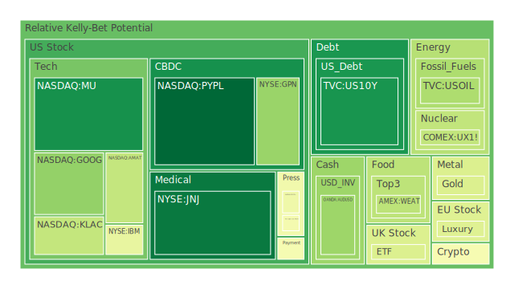
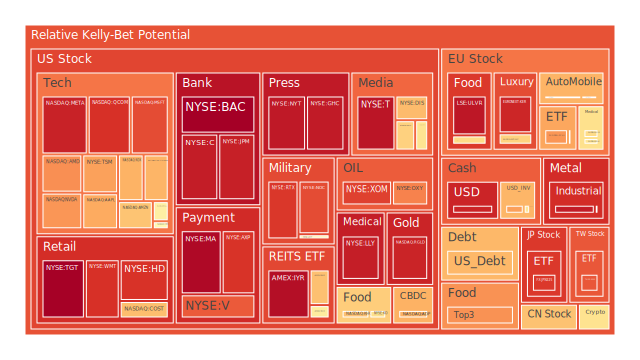
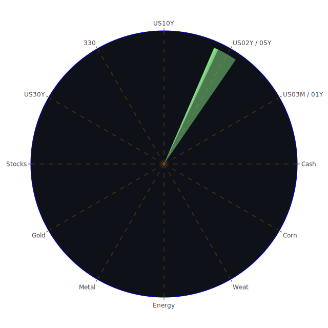

# **投資商品泡沫分析**

在當前複雜的全球金融環境下，各類資產的價格波動與潛在風險成為市場參與者關注的焦點。以下將針對特定投資商品，基於2025年5月29日的數據，結合近期市場動態與宏觀背景，進行泡沫風險的觀察與分析。此處所謂的泡沫風險，乃是根據一系列量化指標綜合評估而來，分數越高，則潛在的價格波動風險或非理性繁榮的可能性越大。

* **美國國債 (US10Y, US03MY, US01Y, US05Y, US02Y, US30Y)**

美國國債市場近期呈現出複雜的局面。以十年期美國國債 (US10Y) 為例，其2025年5月29日的即日風險評分為0.0936，相較於七日平均的0.2223及月平均的0.3870，顯示短期風險有所下降，但月度累積的風險仍值得關注。整體來看，各期限國債的風險評分分佈不均：三個月期國債 (US03MY) 的即日風險評分為0.5058，顯著高於其七日 (0.3750) 和月度 (0.3091) 平均，暗示短期流動性或政策預期可能帶來擾動。一年期 (US01Y) 即日風險0.7430，亦高於月平均0.4684。二年期 (US02Y) 風險指標在各週期均穩定於0.6099，三十年期 (US30Y) 即日風險0.5917，高於月平均0.4916。

從經濟學角度觀察，聯準會資產負債表的縮減趨勢、逆回購市場規模的下降，以及相對較高的聯邦基金利率有效成交量，共同指向市場流動性環境的變化。同時，商業地產、消費信貸及房地產的違約率均處於相對高位，這通常會增加對避險資產的需求，但同時也反映了經濟中的潛在壓力。新聞層面，2025年5月27日關於「華爾街因川普稅收法案引發赤字擔憂，債券市場或迎更多動盪」 (負面, 95%) 的報導，直接點出了財政狀況對債券市場的潛在衝擊。歷史上，政府赤字擴大與高通膨時期，長期債券的吸引力常會下降，除非有強烈的衰退預期。心理層面，市場對於聯準會政策路徑的預期搖擺不定，影響了債券價格的穩定性。博弈論觀點下，投資者在通膨預期、經濟增長預期以及央行政策之間進行權衡，導致債券市場的供需力量不斷調整。目前聯準會釋放的鷹派訊號（過去一個半月有1次鷹派發言，0次鴿派發言）以及CPI年增率雖有下降但仍需時間穩固，使得債券市場前景更添變數。

* **美國零售股 (COST, HD, WMT, TGT)**

美國零售股板塊呈現顯著的風險分化。沃爾瑪 (WMT) 與塔吉特 (TGT) 的風險評分在2025年5月29日均處於高位，WMT的即日、七日、十四日及月度風險評分分別為0.8961、0.9047、0.9055及0.8902，顯示其風險水平持續偏高。TGT的即日風險更高達0.9933，月度平均亦有0.9324。家得寶 (HD) 的風險評分也偏高，即日為0.8928，月度為0.7439。相較之下，好市多 (COST) 的風險評分雖然也不低（即日0.6649，月度0.5686），但略低於前述三者。

經濟學上，零售業績效與消費者信心、就業市場及可支配收入密切相關。當前消費者信貸違約率處於相對高位，可能預示著消費能力的隱憂。社會學角度，消費習慣的轉變，如線上購物對實體店的衝擊，以及不同收入群體消費能力的差異，都會影響特定零售商的表現。心理層面，「黑色星期五」等促銷活動的預期、以及對經濟前景的悲觀或樂觀情緒，都可能放大市場波動。博弈論視角下，零售商之間的價格戰、供應鏈管理效率以及品牌忠誠度競爭，共同塑造其市場地位與盈利能力。新聞事件中，雖然沒有直接針對這些零售商的重大負面新聞，但整體經濟環境的壓力，如高利率、通膨黏滯，都可能間接影響其估值。歷史上，經濟衰退前期，零售股常因消費預期下降而承壓。

* **美國科技股 (AAPL, MSFT, GOOG, AMZN, NVDA, META, NFLX)**

科技股巨頭的風險狀況參差不齊，但整體偏高。Meta (META) 的即日風險評分高達0.9248，月平均為0.8762。亞馬遜 (AMZN) 即日風險為0.6526，月平均為0.7281。蘋果 (AAPL) 即日風險0.7008，月平均0.6387。微軟 (MSFT) 即日風險0.8491，月平均0.6483。谷歌 (GOOG) 即日風險0.2711，顯著低於其月平均0.5744，顯示短期風險壓力有所緩解，但仍需觀察。輝達 (NVDA) 作為近期市場焦點，其即日風險評分為0.7331，月平均為0.6702，考慮到其股價的巨大漲幅，此風險水平值得高度警惕。網飛 (NFLX) 即日風險0.6259，月平均0.4932。

經濟學視角，科技股的增長預期、創新能力、全球市場擴張以及利率環境對其估值有著決定性影響。高利率環境通常不利於成長型股票的估值。社會學上，科技產品的普及率、用戶黏性、以及潛在的社會責任與監管壓力（如數據隱私、壟斷問題）都是影響因素。2025年5月27日新聞「德國梅爾茨稱美國科技公司補助可能成為貿易戰目標」(正面, 90%) 以及「蘋果股價因川普貿易摩擦加劇連跌8天」(負面, 94%)，均反映了地緣政治與貿易政策對科技股的直接影響。心理層面，「錯失恐懼症」(FOMO) 與對未來科技的無限遐想可能推高股價，但也容易積累泡沫。博弈論下，科技巨頭間在人工智能、雲端計算、元宇宙等領域的競爭白熱化，其研發投入與市場策略的成敗直接關係到股價前景。歷史經驗（如2000年網路泡沫）提醒我們，即使是前景光明的產業，也可能出現階段性的非理性繁榮。近期「輝達的崛起可能對氣候目標構成壞消息」(負面, 88%) 及「輝達對投資者的震撼力暫時消失」(負面, 85%) 等新聞，暗示市場對其持續高速增長的可持續性及外部性開始進行更深入的思考。

* **美國房地產指數 (VNQ, IYR, RWO)**

美國房地產指數相關ETF的風險評分普遍偏高。IYR的即日風險評分為0.9645，月平均為0.8430，顯示風險持續累積。VNQ即日風險0.5598，月平均0.4672，相對較低但仍不可忽視。RWO即日風險0.6596，月平均0.5869。

經濟學上，房地產市場受利率、信貸條件、人口結構、就業及收入增長影響。當前30年期固定抵押貸款利率高達6.86%，遠高於去年同期的2.99%，對房地產市場構成顯著壓力。商業地產、消費信貸及總體房地產的拖欠率均處於相對高位，是重要的警示信號。社會學角度，居家辦公趨勢對商業地產需求的結構性改變，以及住房可負擔性問題，都深刻影響市場。心理層面，對房價只漲不跌的信仰一旦被打破，可能引發恐慌性拋售。博弈論觀點，開發商、購房者、租戶及金融機構間的預期與行為相互作用，共同決定市場走向。

* **加密貨幣 (BTCUSD, ETHUSD, DOGEUSD)**

加密貨幣市場波動劇烈，風險評分也普遍較高。比特幣 (BTCUSD) 2025年5月29日的即日風險評分為0.4858，月平均為0.5145。以太坊 (ETHUSD) 即日風險評分為0.4672，月平均為0.4532。狗狗幣 (DOGEUSD) 即日風險評分0.5881，月平均0.4774。這些數據表明，加密貨幣市場的投機氛圍依然濃厚。

經濟學上，加密貨幣的價值基礎、應用場景及監管政策是核心議題。其高波動性使其難以成為穩定的價值儲存或交易媒介。社會學角度，加密貨幣社群的文化、意見領袖的影響力，以及其在特定群體（如追求高風險高回報的年輕投資者）中的吸引力，都助長了其價格波動。心理層面，暴富神話與極端恐懼交織，使得市場情緒極易擺動。博弈論視角下，「鯨魚」大戶的操作、交易所的行為以及不同加密貨幣項目間的競爭，都充滿了博弈色彩。缺乏內在價值支撐以及高度依賴市場情緒的特性，使其泡沫風險始終較高。

* **金/銀/銅 (XAUUSD, XAGUSD, COPPER)**

貴金屬與工業金屬表現各異。黃金 (XAUUSD) 2025年5月29日的即日風險評分為0.4064，月平均為0.5522，顯示近期風險有所下降但整體仍處於中等偏高水平。白銀 (XAGUSD) 風險則顯著偏高，即日風險0.9370，月平均0.9070。銅 (COPPER) 的即日風險為0.5401，月平均為0.5357，處於中等水平。

經濟學上，黃金通常被視為避險資產及通膨對沖工具，其價格受美元匯率、實際利率、地緣政治風險及央行儲備政策影響。白銀兼具貴金屬與工業屬性，價格波動通常大於黃金。銅作為重要的工業金屬，其價格與全球經濟增長前景密切相關。金油比 (GOLD OIL RATIO) 為52.39，高於去年的32.54，顯示黃金相對原油強勢。金銅比 (GOLD COPPER RATIO) 為696.62，亦高於去年的649.76。社會學角度，黃金在特定文化中具有儲備價值，而銅的需求與工業化及綠色轉型進程相關。心理層面，市場恐慌時黃金吸引力上升，經濟復甦預期則提振銅價。博弈論觀點，大型基金在這些商品市場的持倉變動、主要生產國的政策調整等，均會引發價格博弈。

* **黃豆 / 小麥 / 玉米 (SOYB, WEAT, CORN)**

農產品方面，黃豆 (SOYB) 的即日風險評分為0.6066，月平均為0.6262。小麥 (WEAT) 即日風險為0.3424，月平均為0.4142。玉米 (CORN) 即日風險高達0.7875，遠超其月平均0.4680，顯示短期風險急劇上升。

經濟學上，農產品價格受天氣、種植面積、庫存、進出口政策、全球需求（尤其是新興市場的人口增長與飲食結構變化）以及能源價格（影響農業生產成本）等多重因素影響。社會學角度，糧食安全問題、貿易保護主義以及地緣政治衝突（如影響黑海糧食出口的事件）都可能引發價格劇烈波動。心理層面，對極端天氣事件的擔憂或豐收的預期，會迅速反映在期貨價格上。博弈論觀點，大型農業貿易商的庫存管理與採購策略，以及國家間的糧食儲備博弈，均對市場產生深遠影響。歷史上，惡劣天氣或地緣衝突常導致農產品價格飆升。

* **石油/ 鈾期貨UX\! (USOIL, UX1\!)**

能源產品中，石油 (USOIL) 的即日風險評分為0.3150，月平均為0.2928，處於相對溫和的水平。鈾期貨 (UX1\!) 即日風險為0.3530，月平均為0.4833，風險較石油略高，但近期有所回落。

經濟學上，石油價格由全球供需關係、OPEC+組織的產量政策、全球經濟增長（尤其是交通和工業需求）、美元匯率以及地緣政治緊張局勢決定。2025年5月27日新聞「歐洲天然氣價格因挪威供應中斷上漲」(負面, 88%) 及「石油價格在貿易緊張局勢緩和與OPEC+前景權衡中搖擺」(負面, 57%) 反映了供給端與需求端預期的不確定性。鈾作為核燃料，其價格與核電發展前景、庫存水平及地緣政治（如主要生產國的穩定性）相關。社會學角度，環保政策與能源轉型趨勢對化石燃料的長期需求構成壓力，但短期內替代能源的不足仍使傳統能源具有重要性。心理層面，對供應中斷的擔憂或經濟衰退的預期會放大價格波動。博弈論觀點，產油國之間的市場份額博弈，以及大國在核能領域的戰略佈局，都影響著這些商品的價格。

* **各國外匯市場 (EURUSD, USDJPY, AUDUSD, GBPUSD)**

外匯市場方面，美元兌日圓 (USDJPY) 的風險評分極高，即日達0.9193，月平均0.7705，暗示該貨幣對波動劇烈或已累積較高風險。歐元兌美元 (EURUSD) 即日風險0.7171，月平均0.9208，顯示月度風險較高但短期有所緩和。澳元兌美元 (AUDUSD) 即日風險0.2861，月平均0.2925，相對穩定。英鎊兌美元 (GBPUSD) 即日風險0.5749，月平均0.4749。

經濟學上，匯率主要受各國利率差異、經濟增長前景、通膨水平、國際收支狀況及央行政策影響。聯準會的鷹派立場和美國相對強勁的經濟數據（儘管近期有雜音）是美元強勢的基礎。然而，美國持續擴大的財政赤字和高企的政府債務是美元的長期隱憂。2025年5月27日新聞「拉加德認為有機會提升歐元全球地位」(正面, 90%) 或暗示歐洲央行對歐元匯率的期望。社會學角度，國際貿易關係、資本流動偏好以及地緣政治格局都會影響匯率。心理層面，市場對主要央行政策拐點的預期，以及避險情緒的變化，常導致匯率大幅波動。博弈論觀點，各國央行在制定貨幣政策時，既要考慮本國經濟狀況，也要顧及匯率波動對進出口和金融市場的影響，這本身就是一種複雜的博弈。

* **各國大盤指數 (NDX, GDAXI, FCHI, FTSE, JPN225, 0050, 000300\)**

全球主要股指風險普遍偏高。納斯達克100指數 (NDX) 即日風險0.6863，月平均0.7489。德國DAX指數 (GDAXI) 即日風險0.5344，月平均0.5062。法國CAC40指數 (FCHI) 即日風險0.7329，月平均0.5769。英國富時100指數 (FTSE) 即日風險0.4051，月平均0.5571，短期風險有所下降。日經225指數 (JPN225) 風險極高，即日0.8818，月平均0.8262。台灣50指數 (0050) 即日風險0.8319，月平均0.6385。滬深300指數 (000300) 即日風險0.6568，月平均0.7055。

經濟學上，股指是反映一國或地區經濟健康狀況的晴雨表，受企業盈利、利率水平、通膨預期、投資者信心等多重因素影響。當前全球經濟增長前景不明朗，通膨壓力持續，多國央行維持緊縮或觀望態度，對股市構成壓力。2025年5月27日新聞「歐盟貿易談判代表稱在川普延長關稅期限後與美國官員的通話'良好'」(正面, 92%) 及「歐盟計劃在中美關稅戰中'快速推進'與美國的貿易談判」(正面, 84%) 或為市場帶來短暫喘息，但「川普關稅延遲，股市上漲；美元波動：市場綜述」(負面, 82%) 的標題暗示市場情緒仍不穩定。社會學角度，財富效應、社會公平問題以及公眾對企業社會責任的期望，都會間接影響股市。心理層面，羊群效應、市場情緒的極端波動以及對政策的過度解讀，常導致股指偏離基本面。博弈論視角，大型機構投資者的資產配置策略、跨市場套利行為以及國家隊的潛在干預，都影響著股指的短期走勢。

* **美國半導體股 (NVDA, MU, AMAT, KLAC, INTC, AVGO, QCOM, TSM)**

半導體行業整體呈現高風險。台積電 (TSM) 風險極高，即日0.7169，但低於其月平均0.9697，可能意味著頂部風險略有釋放，但仍處絕對高位。輝達 (NVDA) 如前述，風險偏高。美光 (MU) 即日風險0.0843，遠低於月平均0.3295，顯示短期風險大幅下降。應用材料 (AMAT) 即日風險0.3577，月平均0.6197。科磊 (KLAC) 即日風險0.3568，月平均0.5413。英特爾 (INTC) 即日風險0.5199，月平均0.5179。博通 (AVGO) 即日風險0.6830，月平均0.8139。高通 (QCOM) 即日風險0.8960，月平均0.8511。

經濟學上，半導體是現代經濟的核心，其景氣週期與全球科技產品需求、產能擴張、庫存水平及技術迭代速度緊密相關。社會學角度，半導體技術的戰略重要性使其成為地緣政治競爭的焦點，各國政府紛紛出台產業扶持政策，但也帶來了市場分割和供應鏈安全的擔憂。心理層面，對人工智能、5G、物聯網等新興技術的樂觀預期，為半導體股注入了強勁的增長動力，但也容易催生估值泡沫。博弈論觀點，晶片設計、製造、設備等各環節的龍頭企業間存在激烈的技術競賽與市場份額爭奪，同時也面臨著潛在的「晶片戰爭」風險。

* **美國銀行股 (JPM, BAC, C, COF)**

美國主要銀行股風險普遍處於極高水平。美國銀行 (BAC) 即日風險高達0.9948，月平均0.9490。摩根大通 (JPM) 即日風險0.9294，月平均0.7801。花旗集團 (C) 即日風險0.9351，月平均0.8653。第一資本金融公司 (COF) 即日風險0.4724，月平均0.5067，相對較低但仍不可小覷。

經濟學上，銀行股的盈利能力受淨息差、信貸質量、非利息收入及監管政策影響。當前利率環境下，雖然淨息差可能擴大，但經濟下行壓力導致的信貸違約風險也在上升 (FED數據顯示各類拖欠率處於高位)。聯準會資產負債表縮減可能影響銀行準備金和放貸能力。社會學角度，金融普惠性、金融科技的挑戰以及銀行在社會經濟穩定中的責任，都是其面臨的長期課題。心理層面，對金融系統穩定性的擔憂，或對銀行盈利超預期的樂觀情緒，都可能引發股價波動。博弈論視角，大型銀行在爭奪市場份額、應對監管以及管理風險敞口方面，均存在複雜的博弈。歷史上，金融危機往往由銀行系統的問題引爆或放大。

* **美國軍工股 (LMT, NOC, RTX)**

美國軍工股風險評分普遍偏高且持續上升。洛克希德馬丁 (LMT) 即日風險0.5338，月平均0.7086。諾斯洛普格魯曼 (NOC) 即日風險0.8503，月平均0.6613。雷神技術 (RTX) 即日風險0.8844，月平均0.8403。

經濟學上，軍工股的業績與國防預算、地緣政治緊張程度及國際軍售訂單密切相關。當前全球地緣政治衝突頻發，各國國防開支普遍增加，為軍工企業帶來了訂單。社會學角度，軍工產業的發展與國家安全、倫理道德（如武器擴散問題）等複雜議題交織。心理層面，國際衝突的爆發或升級，往往會刺激軍工股的短期上漲。博弈論視角，國家間的軍備競賽、軍售市場的競爭以及軍工企業在爭取政府合約方面的遊說活動，都體現了博弈的特徵。然而，過高的估值以及對地緣政治局勢緩和的預期都可能帶來回調風險。2025年5月27日「白宮國安會大幅裁員重組」 (負面, 96%) 的新聞，可能暗示國安政策的某些調整，但具體影響尚不明朗。

* **美國電子支付股 (V, MA, PYPL, GPN)**

電子支付領域風險分化。萬事達卡 (MA) 風險極高，即日0.9755，月平均0.8243。Visa (V) 同樣風險偏高，即日0.8267，月平均0.8115。PayPal (PYPL) 風險最低，即日0.0000（可能為數據異常或無顯著波動），但其月平均風險高達0.7100，顯示此前壓力較大，近期劇烈波動後暫趨平靜或有特殊事件影響。Global Payments (GPN) 即日風險0.2801，月平均0.3574，處於中等水平。

經濟學上，電子支付公司的收入與交易額、費率水平、跨境支付活動及技術創新（如數字貨幣、移動支付）相關。全球數字化轉型和無現金化趨勢為其提供了長期增長動力，但競爭也日趨激烈，且面臨監管壓力。社會學角度，支付的便捷性、安全性以及對傳統金融模式的顛覆，是其核心影響。心理層面，消費者對新支付方式的接受程度和使用習慣，以及對數據安全的信任度，至關重要。博弈論視角，支付巨頭、銀行、科技公司以及初創企業在支付市場的份額爭奪、技術標準制定等方面展開激烈博弈。

* **美國藥商股 (JNJ, MRK, LLY, NVO)**

大型藥企風險狀況不一。禮來 (LLY) 風險極高，即日0.9334，月平均0.9335，持續在高位徘徊，可能與其明星藥物的市場預期有關。嬌生 (JNJ) 風險最低，即日0.0344，月平均0.2179。默克 (MRK) 即日風險0.5796，月平均0.4630。諾和諾德 (NVO) 即日風險0.6049，月平均0.5541，處於中等偏高水平。

經濟學上，藥企業績受藥品研發成功率、專利保護期、藥品定價、醫保政策及市場競爭格局影響。社會學角度，藥品的可及性、定價合理性以及企業在公共衛生事件中的角色備受關注。心理層面，新藥研發的突破性進展或失敗，以及對某些疾病治療前景的預期，都會顯著影響股價。博弈論視角，藥企在研發競賽、專利訴訟、藥品定價談判以及市場推廣方面存在複雜的博弈。

* **美國影視股 (DIS, NFLX, PARA)**

影視娛樂行業風險較高。迪士尼 (DIS) 即日風險0.6700，月平均0.7579。派拉蒙全球 (PARA) 即日風險0.5829，月平均0.4898。網飛 (NFLX) 已在科技股中提及，風險亦偏高。

經濟學上，影視股受內容創作能力、串流媒體訂閱增長、廣告市場景氣度、線下娛樂（如主題公園、電影院）復甦情況以及製作成本控制影響。社會學角度，文化產品的輸出、價值觀的傳播以及消費者娛樂方式的變遷是核心。心理層面，爆款內容的出現、明星效應以及對行業整合的預期，都可能刺激股價。博弈論視角，各大製片廠和串流平台在內容採購、用戶爭奪、定價策略等方面競爭激烈。

* **美國媒體股 (FOX, NYT)**

傳統媒體與新媒體的風險狀況亦值得關注。福斯公司 (FOX) 即日風險0.4674，但月平均高達0.8248，顯示此前風險較高，近期有所回落。紐約時報 (NYT) 風險極高，即日0.9430，月平均0.7562。

經濟學上，媒體行業收入來源包括廣告、訂閱、版權等，受宏觀經濟、技術變革（如AI對內容生成的影響）及讀者/觀眾偏好轉變的影響。社會學角度，媒體的公信力、輿論導向作用以及在信息傳播中的角色至關重要。心理層面，重大新聞事件的發生、以及公眾對特定媒體品牌的情感認同，會影響其市場表現。博弈論視角，不同媒體集團間的競爭、對抗假新聞的努力以及在新媒體時代的轉型策略，都是博弈的體現。

* **石油防禦股 (OXY, XOM)**

石油巨頭作為傳統能源的代表，其風險評分處於高位。西方石油 (OXY) 即日風險0.7630，月平均0.7298。埃克森美孚 (XOM) 即日風險0.8674，月平均0.8117。

經濟學上，這些公司的盈利與油氣價格、開採成本、煉油利潤及資本支出策略直接相關。儘管面臨能源轉型的長期壓力，但在可預見的未來，其提供的能源仍然是全球經濟運行的基礎。社會學角度，其環境影響、社會責任以及在能源安全中的作用是公眾關注焦點。心理層面，對油價的預期以及對公司分紅能力的信心，影響投資者行為。博弈論觀點，大型石油公司在產量協調、新技術投資（如碳捕捉）以及應對政策風險方面，均需進行戰略博弈。

* **金礦防禦股 (RGLD)**

皇家黃金 (RGLD) 作為一家貴金屬權利金公司，其風險評分極高，即日0.9212，月平均0.9264，顯示其風險持續處於警戒水平。

經濟學上，權利金公司的業績與貴金屬價格（尤其是黃金）以及合作礦場的產量和運營效率相關。其商業模式使其能夠在一定程度上規避直接開採的運營風險。社會學角度，其投資的礦業項目是否符合環境和社會標準，日益受到重視。心理層面，在市場不確定性增加或通膨預期升溫時，黃金及相關資產的吸引力通常會上升，但過高的估值本身也構成風險。博弈論視角，權利金公司在獲取優質項目、談判合同條款以及管理合作夥伴風險方面，需要精密的策略。

* **歐洲奢侈品股 (MC, RMS, KER)**

歐洲奢侈品板塊風險普遍較高。LVMH集團 (MC) 即日風險0.6256，月平均0.5127。愛馬仕 (RMS) 即日風險0.4130，月平均0.6119，近期風險有所下降但整體仍偏高。開雲集團 (KER) 風險極高，即日0.9165，月平均0.8503。

經濟學上，奢侈品行業的表現與全球高淨值人群的財富狀況、消費者信心、旅遊零售復甦以及品牌影響力密切相關。新興市場的增長潛力是重要驅動力，但也面臨經濟波動和消費觀念轉變的挑戰。社會學角度，奢侈品的象徵意義、文化價值以及可持續發展理念的融入，是影響其品牌形象和市場接受度的關鍵。心理層面，品牌忠誠度、稀缺性營銷以及對美好生活的嚮往，共同支撐著奢侈品的高溢價。博弈論視角，各大奢侈品集團在品牌定位、市場擴張、供應鏈控制以及應對仿冒品等方面存在激烈競爭。近期新聞中雖未直接提及這些公司，但全球貿易摩擦、經濟增長放緩等宏觀因素均可能對其構成不利影響。

* **歐洲汽車股 (BMW, MBG, PAH3)**

歐洲汽車股風險評分處於中高水平，且波動較大。寶馬 (BMW) 即日風險0.7285，月平均0.5450，短期風險顯著上升。賓士 (MBG) 即日風險0.5080，月平均0.4952。保時捷 (PAH3) 即日風險0.5983，月平均0.6198。

經濟學上，汽車行業是典型的週期性行業，受宏觀經濟、利率水平、消費者信貸、油價、以及產業政策（如電動車補貼、排放標準）的深刻影響。2025年5月27日新聞「中國電動車製造商降價，競爭加劇」(負面, 96%) 及「德國大眾汽車四名前經理因排放醜聞被判欺詐罪」(負面, 90%)，以及「沃爾沃汽車裁員3000人以降低成本」(負面, 65%)，均揭示了行業面臨的激烈競爭和轉型壓力。社會學角度，汽車不僅是交通工具，也關乎城市規劃、環境保護和生活方式的變革。心理層面，品牌形象、技術創新（如自動駕駛）以及對新能源汽車的接受程度，影響消費者的購買決策。博弈論視角，傳統車企與新勢力造車企業在技術路線、市場定位、供應鏈整合等方面展開全方位競爭。

* **歐美食品股 (KO, KHC, NESN, ULVR)**

主要食品飲料公司風險狀況各異。可口可樂 (KO) 即日風險0.5961，月平均0.6427。卡夫亨氏 (KHC) 即日風險0.6583，月平均0.7191。雀巢 (NESN) 即日風險0.6044，月平均0.5625。聯合利華 (ULVR) 風險極高，即日0.9469，月平均0.9439。

經濟學上，食品飲料行業屬於必需消費品，需求相對穩定，但仍受原材料成本、供應鏈效率、品牌競爭、消費者偏好變化（如對健康、有機食品的需求增加）以及定價能力的影響。2025年5月28日新聞「通用磨坊因重組在本季度計提7000萬美元費用」(負面, 96%)，反映了行業內部調整的壓力。社會學角度，食品安全、營養健康、可持續農業以及企業社會責任是核心關切。心理層面，品牌忠誠度、廣告營銷以及消費習慣的慣性，對其市場份額有重要影響。博弈論視角，大型食品飲料集團在渠道控制、新品推出、成本管理以及應對小型和特色品牌的競爭方面，面臨持續的挑戰。

# **宏觀經濟傳導路徑分析**

當前宏觀經濟環境呈現多重矛盾與不確定性。聯準會總資產下降、逆回購規模縮減，反映出流動性收緊的趨勢。然而，貨幣市場基金總資產上升及SOFR成交量增加，又顯示部分資金在尋求短期避險或更高收益的貨幣市場工具。這可能意味著市場對長期資產的風險偏好有所降低。

高利率環境的影響正逐步顯現。30年期固定抵押貸款利率維持在6.86%的高位，遠超往年，對房地產市場構成持續壓力，相關拖欠率（商業地產、住宅地產）均處於高位，預示著信用風險的累積。消費者信貸拖欠率亦在高位，這將直接影響消費支出，進而傳導至零售、非必需消費品等行業。儘管信用卡壞帳率及其100大銀行對應指標尚處低位，但這可能是滯後指標，需警惕後續上升風險。

通膨方面，CPI年增率已從去年的3.33%降至2.33%，顯示通膨壓力有所緩解，但聯準會仍釋放鷹派信號，表明其對通膨的警惕性未減。這使得市場對未來利率路徑的預期持續波動。美國各期限公債殖利率曲線形態值得關注，例如10年期與3個月期利差 (0.14) 已轉正，去年同期為-1.19，顯示衰退預期有所減弱或通膨預期在長端有所抬升。然而，整體殖利率水平仍處高位，對經濟活動的抑制作用不容忽視。

財政方面，公共債務佔GDP比率高企，以及外國機構持有美國國債流通量處於低位，引發了對美國財政可持續性的擔憂，如新聞所述「華爾街因川普稅收法案引發赤字擔憂，債券市場或迎更多動盪」。這可能導致未來債券發行成本上升，進一步推高利率，對股市估值和實體經濟融資構成壓力。

國際貿易方面，貿易保護主義的陰影依然存在。「川普關稅」的討論以及「美歐貿易談判」的進展，都牽動著全球供應鏈和相關產業的敏感神經。例如，「中國電動車製造商降價，競爭加劇」以及「美國科技公司補助可能成為貿易戰目標」等新聞，都反映了全球貿易格局重塑下的產業壓力。

地緣政治風險亦是重要考量。全球多地衝突與緊張局勢（如新聞中提及的俄烏衝突、中東局勢、朝鮮半島問題等），不僅直接影響軍工等特定行業，也通過能源價格、供應鏈穩定性、市場避險情緒等渠道，廣泛傳導至全球經濟。

# **微觀經濟傳導路徑分析**

從微觀層面觀察，企業的盈利能力與融資成本是核心。高利率環境直接增加了企業的借貸成本，尤其是對那些依賴債務融資擴張的成長型企業或高負債企業。這可能迫使企業削減資本開支、延緩擴張計劃，甚至進行裁員（如沃爾沃、通用磨坊的重組），從而影響經濟增長和就業。

供應鏈瓶頸問題雖有所緩解，但特定領域（如新聞提及的歐洲航運瓶頸）仍可能對企業的生產和物流成本造成困擾。同時，地緣政治因素也可能導致供應鏈的區域化、本土化調整，增加企業的運營複雜性和成本。

勞動力市場方面，儘管整體失業率可能仍處低位，但部分行業的結構性失業或技能錯配問題依然存在。企業在控制勞動力成本與吸引和保留人才之間面臨平衡。

消費者行為的轉變也對微觀企業產生深遠影響。例如，對可持續性、個性化、數字化體驗的追求，迫使企業在產品設計、營銷策略、服務模式上不斷創新。電子商務的持續滲透，對傳統零售業態構成挑戰，也為具備數字化能力的企業提供了機遇。

企業的定價能力在當前環境下備受考驗。一方面，原材料和勞動力成本的上升推高了生產成本；另一方面，消費者對價格的敏感度增加以及市場競爭的加劇，限制了企業將成本完全轉嫁給消費者的能力。這可能導致企業利潤空間受擠壓。

特定行業的技術變革，如人工智能的快速發展，正深刻改變相關企業的競爭格局。以半導體行業為例，對AI晶片的巨大需求推動了如輝達等公司的快速增長，但也加劇了行業內的軍備競賽和人才爭奪。同時，AI技術的應用也可能導致某些行業的勞動力需求發生結構性變化。

# **資產類別間傳導路徑分析**

資產類別間的傳導路徑錯綜複雜，常呈現此消彼長的關係，但也可能出現同漲共跌的局面。

首先，利率是串聯各大類資產的核心紐帶。美國國債殖利率的變動，尤其是長端利率，直接影響全球資產的定價錨。利率上升通常會：1) 壓低債券價格（直接）；2) 增加企業融資成本，抑制盈利預期，對股市（尤其是成長股）估值不利；3) 抬高持有無息資產（如黃金）的機會成本，理論上對金價不利，但若利率上升源於通膨高企，黃金的抗通膨屬性又可能凸顯；4) 影響房地產市場，高利率降低購房者負擔能力和投資回報率。

美元匯率是另一條重要的傳導路徑。美元走強通常會：1) 對以美元計價的商品（如石油、黃金、基本金屬、農產品）價格構成壓力；2) 影響美國跨國公司的匯兌損益；3) 吸引資金流入美元資產，可能對新興市場資金面造成壓力。聯準會的鷹派立場和避險情緒可能階段性推高美元。

股市與債市的關係通常被認為是負相關（「股債蹺蹺板」），尤其是在避險情緒升溫時，資金可能從股市流向債市。然而，在通膨高企、央行被迫同時收緊貨幣政策以抑制通膨和經濟過熱的環境下，也可能出現股債雙殺的局面。當前環境下，由於對經濟前景和通膨路徑的高度不確定性，股債關係可能更為複雜。

商品市場內部，能源價格（如石油）的變動會影響農業生產成本（化肥、運輸），進而傳導至農產品價格。工業金屬（如銅）價格與全球製造業景氣度高度相關，可以視為經濟的領先指標之一，其走勢也會影響相關工業股和礦業股。

房地產市場的波動會通過財富效應影響消費支出，進而影響零售和消費品行業。同時，房地產行業的信貸風險也會傳導至銀行體系。

加密貨幣市場作為一個相對新興且高波動的資產類別，其與傳統金融市場的聯動性日益增強，尤其是在市場情緒極端波動時。部分投資者可能將其視為另類避險資產，但在流動性收緊和監管趨嚴的背景下，其風險暴露也更大。

地緣政治風險的傳導路徑則更為直接和廣泛。衝突升級可能推高油價、金價和軍工股，同時打擊受影響地區的股市和貨幣，並加劇全球供應鏈的脆弱性。例如，俄烏衝突對能源和糧食市場的衝擊，以及對歐洲經濟的影響，都是顯著的例證。

新聞事件如「中國電動車製造商降價，競爭加劇」不僅影響汽車行業內部，也可能通過產業鏈傳導至上游的半導體、電池材料等行業，並對相關國家的貿易平衡和就業產生影響。

# **投資建議**

基於上述分析，並考慮到當前市場環境的複雜性和不確定性，以下提供穩健、成長與高風險三種投資組合配置建議，每種組合均選擇三個子投資項目。總配置比例為100%。請注意，此處的「泡沫分數」或「風險評分」僅為參考，高分並不必然意味著崩盤，低分也不代表全無風險，僅提示潛在的非理性程度或波動可能。

**一、穩健型投資組合 (100%)**

此組合旨在保本增值，追求長期穩定的回報，適合風險承受能力較低的投資者。

1. **短期美國國債 (US03MY / US01Y) \- 40%**  
   * **理由：** 在利率環境相對較高且未來走向不明朗的時期，短期國債提供了相對較高的票息收入和較低的利率風險。FED數據顯示3個月期和1年期國債殖利率分別為4.34%和4.16%，具有一定的吸引力。儘管US03MY和US01Y的即日風險評分近期有所抬升，但其本質仍是低風險資產，是現金管理和短期避險的良好工具。  
   * **觀察視角：** 關注聯準會的利率政策路徑及短期通膨數據。若通膨超預期頑固，短期利率可能維持高位。  
2. **優質醫療保健股 (例如 JNJ) \- 30%**  
   * **理由：** 醫療保健需求具有剛性，受經濟週期影響較小。嬌生 (JNJ) 的風險評分在各週期均處於極低水平（即日0.0344，月平均0.2179），顯示其估值相對合理，泡沫風險低。公司業務多元化，現金流穩定，具有較強的防禦性。  
   * **觀察視角：** 關注其藥品研發管線進展、全球銷售情況以及潛在的訴訟風險。行業併購活動也可能帶來催化。  
3. **必需消費品龍頭股 (例如 KO 或風險評分相對較低的食品股) \- 30%**  
   * **理由：** 必需消費品需求穩定，具有抗通膨和防禦衰退的特性。可口可樂 (KO) 的風險評分處於中等水平（即日0.5961，月平均0.6427），但其品牌護城河深厚，全球業務廣泛。或者可以考慮如數據中雀巢 (NESN) 風險評分相對更為溫和（即日0.6044，月平均0.5626），雖然也非極低，但在食品股中可選。  
   * **觀察視角：** 關注原材料成本波動、新興市場增長以及消費者口味變化。這些公司的定價能力是關鍵。

**二、成長型投資組合 (100%)**

此組合旨在追求長期資本增值，願意承受一定的市場波動，適合風險承受能力中等的投資者。

1. **精選科技股 (例如 GOOG 或 MSFT，視乎短期風險調整) \- 40%**  
   * **理由：** 科技進步是長期趨勢，人工智能、雲計算等領域仍有巨大增長潛力。谷歌 (GOOG) 的即日風險評分 (0.2711) 相對其月平均 (0.5744) 有所下降，可能提供了介入機會，其在AI領域的佈局深遠。微軟 (MSFT) 雖然即日風險評分 (0.8491) 較高，但其在雲計算和企業服務領域的領導地位穩固，增長前景依然看好，可待風險指標回落時考慮。  
   * **觀察視角：** 關注其在新技術領域的突破、全球市場擴張、監管環境變化以及宏觀經濟對企業IT支出的影響。  
2. **半導體產業鏈核心企業 (例如 MU 或估值相對合理的設備/設計公司) \- 30%**  
   * **理由：** 半導體是所有科技應用的基石。美光 (MU) 的即日風險評分 (0.0843) 大幅低於其月平均 (0.3295)，可能反映了市場對其記憶體週期拐點的正面預期，或短期超跌。或者關注產業鏈中估值相對合理的其他細分龍頭。  
   * **觀察視角：** 關注半導體行業的庫存週期、終端需求（PC、手機、汽車、伺服器等）、產能擴張情況以及地緣政治對供應鏈的影響。  
3. **新興市場指數基金 (分散投資) \- 30%**  
   * **理由：** 新興市場長期增長潛力較大，但波動性也較高。通過指數基金可以分散單一國家或地區的風險。目前部分新興市場股指（如滬深300，000300，即日風險0.6568）估值相對發達市場有吸引力。  
   * **觀察視角：** 關注全球經濟復甦力度、美元匯率走勢、地緣政治風險以及新興市場國家的內部改革進程。

**三、高風險型投資組合 (100%)**

此組合旨在追求高回報，願意承受較大的市場波動甚至本金損失風險，適合風險承受能力較強且對市場有深入理解的投資者。

1. **高成長科技股/賽道股 (例如 NVDA，但需嚴控倉位與時機) \- 35%**  
   * **理由：** 輝達 (NVDA) 在AI晶片領域具有壟斷性優勢，成長前景廣闊，但其風險評分也持續偏高（即日0.7331，月平均0.6702），股價已大幅上漲，波動劇烈。此類投資需基於對行業和公司基本面的深刻理解，並設好止損。  
   * **觀察視角：** 密切關注其業績增長的可持續性、競爭對手的追趕情況、產能瓶頸、以及AI行業的整體發展和潛在泡沫。  
2. **加密貨幣 (例如 BTCUSD 或 ETHUSD 的一小部分倉位) \- 30%**  
   * **理由：** 加密貨幣市場具有高波動性和潛在的高回報（同時也有高損失風險）。比特幣 (BTCUSD) 和以太坊 (ETHUSD) 作為市值最大的兩種加密貨幣，其風險評分分別為0.4858和0.4672（即日），處於中等偏高水平。配置此類資產應僅佔整體投資組合的一小部分，且需有歸零的心態準備。  
   * **觀察視角：** 關注全球宏觀流動性變化、監管政策進展、機構投資者接受程度以及區塊鏈技術的實際應用落地情況。  
3. **特定主題/轉機型股票 (例如 PARA，若其重組或併購預期實現) \- 35%**  
   * **理由：** 某些面臨困境但有潛在重大利好（如併購、業務重組成功、行業反轉）的公司，可能帶來較高的超額收益，但也伴隨極高風險。派拉蒙全球 (PARA) 的即日風險評分0.5829，市場對其未來走向存在較大分歧。此類投資如同風險投資，需要深入研究和運氣。  
   * **觀察視角：** 緊密跟蹤公司基本面變化、管理層動態、行業競爭格局以及潛在的催化劑事件。嚴格的風險控制和退出機制至關重要。

# **風險提示**

投資有風險，市場總是充滿不確定性。本報告所有分析和建議僅基於當前獲取的有限數據和筆者對市場的理解，不構成任何投資邀約或最終操作依據。過往的表現並不能預示未來的結果。投資者應充分理解各類資產的風險特徵，根據自身的財務狀況、風險承受能力、投資目標及投資經驗，獨立做出審慎的投資決策，並自行承擔相關風險。在做出任何投資決策前，建議諮詢專業的財務顧問。市場情況瞬息萬變，請投資者時刻保持警惕，理性對待市場波動。

 
Daily Buy Map:

 
Daily Sell Map:

 
Daily Radar Chart:

 
