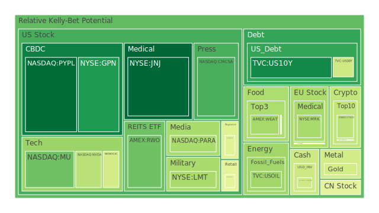
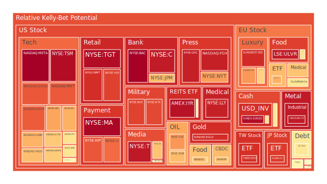
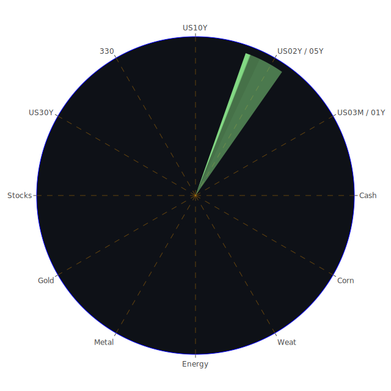

好的，這是一份根據您提供的資料與指示所撰寫的投資報告。

# **投資商品泡沫分析**

在當前複雜的全球經濟環境下，各類資產的價格波動與潛在泡沫風險成為市場參與者高度關注的焦點。我們將秉持公正客觀的態度，解析各類主要投資商品的現狀，旨在提供一個基於數據與觀察的深思熟慮的結論。一切市場現象，無論看似多麼劇烈或反常，均為多重因素交織下的自然結果。

**美國國債**

美國國債作為全球最重要的避險資產之一，其殖利率的變動直接反映了市場對經濟前景、通膨預期以及貨幣政策的判斷。觀察近期數據，美國10年期國債殖利率(US10Y)在2025年5月30日報4.43%，泡沫指數D1為0.096006，D30為0.377275。相較於一個月前的4.28%及一年前的4.20%，殖利率有所上升，但短期泡沫程度相對較低，長期則略有積累。美國3個月期國債殖利率(US03MY)為4.35%，D1為0.527430，D30為0.316870，短期泡沫讀數較高，可能反映了市場對短期流動性或政策變動的敏感。

從經濟學角度看，聯準會（FED）總資產持續下降，逆回購（RRP）規模縮減，顯示市場流動性趨緊。然而，聯邦基金利率有效交易量（EFFR Volume）仍處於相對高位，暗示市場資金拆借需求依然旺盛。這種現象可能源於對未來經濟不確定性的預期，部分資金傾向於短期停泊。社會學層面，當經濟前景不明朗或地緣政治風險升高時，公眾的避險情緒會推升對國債的需求，但同時對政府債務持續擴張的擔憂也可能抑制這種需求。心理學上，投資者在經歷了長期的低利率環境後，對於利率的正常化過程仍在適應，任何超預期的通膨數據或政策指引都可能引發市場情緒的劇烈波動。博弈論觀點下，市場參與者正在揣摩聯準會的政策路徑，一方面預期為抑制潛在衰退而降息，另一方面又擔心通膨的頑固性導致政策持續緊縮。

歷史上，在經濟轉折點或政策調整期，國債市場常出現顯著波動。例如，1970年代末至1980年代初的沃克時期，為對抗高通膨而急劇提升利率，導致債券價格大幅下跌。新聞事件方面，「美國30年期國債殖利率出現3月以來最大跌幅，投資者被重新吸引」以及「華爾街為更多債券市場動盪做準備，交易員押注華盛頓不會解決赤字問題」等消息，均反映了市場對長天期債券前景的多空交織看法。高收益債券利率處於相對低位，但其上升趨勢惡化後趨於穩定，暗示風險偏好有所收斂。美國公債殖利率曲線（如10年期減3個月期）雖仍為正值0.07，但較前一週的0.16有所收窄，顯示市場對短期風險的定價更為謹慎。

**美國零售股**

零售股的表現與消費者信心、就業市場及整體經濟狀況緊密相關。沃爾瑪（WMT）泡沫指數D1為0.909956，D30為0.890923；塔吉特（TGT）D1為0.973607，D30為0.941972；好市多（COST）D1為0.447533，D30為0.569070；家得寶（HD）D1為0.875398，D30為0.752945。這些數據普遍顯示零售股，特別是WMT與TGT，其短期與長期泡沫指數均處於高位，暗示市場可能對其未來增長給予了較高甚至過高的預期。

經濟學上，消費者拖欠款項（Consumer Delinquent）處於相對高位，信用卡拖欠款項（Credit Card Delinquent）卻處於相對低位，這可能反映了消費者在優先償還高利率的信用卡債務，但在其他消費信貸方面已顯現壓力。這種分化值得關注。社會學角度，消費習慣的改變，如線上購物的普及、對可持續性產品的偏好，以及貧富差距擴大對不同消費層級的影響，都在重塑零售業格局。心理學層面，「消費者信心在五月反彈，因川普暫停中國關稅」這類新聞，短期內能提振市場情緒，但其持續性取決於政策的穩定性及經濟基本面的改善。博弈論視角下，零售商在定價策略、庫存管理、供應鏈優化等方面持續博弈，以應對成本上升和競爭加劇的局面。

歷史上，經濟衰退期或高通膨時期，非必需消費品零售商往往受創較重，而必需消費品零售商則展現出較強的韌性。近期新聞中，通用磨坊（General Mills）宣布因重組產生費用，可能預示著食品行業成本壓力增加。相對價格關係上，必需消費品與非必需消費品的股價表現差異，常被用來判斷經濟景氣程度。

**美國科技股**

科技股一直是市場關注的焦點，其高成長性也伴隨著高波動性。微軟（MSFT）D1為0.837623，D30為0.671936；蘋果（AAPL）D1為0.721253，D30為0.646652；谷歌（GOOG）D1為0.839328，D30為0.573661；亞馬遜（AMZN）D1為0.653667，D30為0.719434；Meta（META）D1達到1.000000（最高值），D30為0.874137。這些龍頭科技股的泡沫指數普遍偏高，尤其是META的短期指數已達極值，顯示市場情緒極度樂觀或存在過度炒作。

經濟學上，科技進步是推動生產力提升的關鍵因素，AI浪潮的興起為科技股注入了新的增長想像空間。新聞「AI股引領市場反彈，Nvidia財報前夕」以及「加州最大電力公司稱資料中心興趣大增逾40%」，都反映了AI發展帶來的實質需求。然而，高利率環境對成長型科技股的估值構成壓力。社會學角度，科技發展帶來了生活方式的變革，但也引發了關於就業、隱私、倫理等問題的討論，這些都可能間接影響行業監管與發展。心理學層面，科技股容易受到「錯失恐懼症」（FOMO）情緒的驅動，導致估值快速偏離基本面。博弈論觀點，科技巨頭在AI、雲端運算、元宇宙等新興領域的競爭日趨激烈，其投入與產出、市場份額的爭奪，都充滿博弈色彩。

歷史上，2000年的網路泡沫破裂是科技股投資者記憶猶新的教訓。當時，許多缺乏盈利基礎的網路公司股價飛漲，最終泡沫破裂。當前AI概念的火熱，需警惕是否會重蹈覆轍。相對價格方面，成長股與價值股的輪動，以及科技股內部不同細分領域（如硬體、軟體、服務）的表現差異，值得關注。

**美國房地產指數**

房地產市場對整體經濟有著重要影響。美國房地產指數（VNQ）D1為0.562834，D30為0.474997；（IYR）D1為0.962953，D30為0.853220；（RWO）D1為0.238104，D30為0.581986。其中IYR的泡沫指數顯著偏高。

經濟學上，30年期固定抵押貸款利率（Fixed Morgage 30Y Rate）為6.89%，遠高於一年前的2.99%，這無疑加重了購房者的負擔，並對房地產市場的活躍度構成壓力。商業房地產拖欠率（Commercial Real Estate Delinquent）和房地產拖欠率（Real Estate Delinquent）均處於相對高位，顯示房地產市場，特別是商業地產領域面臨困境。社會學角度，居家辦公趨勢的普及對商業辦公樓需求產生結構性影響，而人口結構變化和城市化進程也影響著住宅需求。心理學上，房價的持續上漲預期一旦逆轉，可能引發恐慌性拋售。博弈論視角，開發商、投資者、購房者和監管機構在房地產市場中的行為相互影響，政策的微小調整都可能改變市場均衡。

歷史上，2008年的次貸危機便是由房地產市場泡沫破裂引發的全球金融危機。當前需關注高利率環境下，商業地產風險是否會外溢。

**加密貨幣**

加密貨幣市場以高波動性著稱。比特幣（BTCUSD）D1為0.485759，D30為0.509507；以太幣（ETHUSD）D1為0.362161，D30為0.440593；狗狗幣（DOGEUSD）D1為0.546558，D30為0.477877。整體泡沫指數處於中等偏高水平。

經濟學上，加密貨幣的價值基礎、監管框架以及其作為支付手段或價值儲存工具的有效性仍在爭論中。其去中心化特性吸引了一部分追求獨立於傳統金融體系的投資者。社會學角度，加密貨幣社群文化的形成、意見領袖的影響力，以及其在特定群體中的接受程度，都對價格產生影響。心理學層面，加密貨幣市場極易受到市場情緒和新聞事件驅動，暴漲暴跌並不罕見。博弈論觀點，大型投資者（所謂「巨鯨」）的行為、交易所的運營策略、以及不同加密貨幣項目之間的競爭，共同構成了複雜的博弈格局。

歷史上，加密貨幣經歷了多次牛熊轉換，如2017年底的比特幣大漲及隨後的崩盤。監管政策的變化是影響加密貨幣市場的關鍵因素之一。

**金/銀/銅**

貴金屬和工業金屬是重要的避險和經濟指標。黃金（XAUUSD）D1為0.404223，D30為0.555054；白銀（XAGUSD）D1為0.947924，D30為0.909476；銅（COPPER）D1為0.499285，D30為0.519423。白銀的泡沫指數在近期顯著偏高，黃金和銅則相對溫和。

經濟學上，黃金通常被視為抗通膨和避險資產，其價格與美元指數、實際利率呈負相關。白銀兼具貴金屬和工業屬性。銅價則被視為經濟的「晴雨表」，反映工業活動的景氣程度。金油比（GOLD OIL RATIO）為54.49，高於去年的31.15，顯示黃金相對原油強勢。金銅比（GOLD COPPER RATIO）為711.16，亦高於去年的648.25。社會學角度，黃金在許多文化中具有特殊的價值儲存地位。心理學層面，地緣政治緊張或金融市場動盪時，黃金的避險需求會上升。博弈論視角，各國央行的黃金儲備策略、大型基金的頭寸調整，都會影響金價。

歷史上，金價在經濟危機時期通常表現良好。例如，1970年代的滯脹時期，金價大幅上漲。新聞「加拿大鋁交易商將其破產歸咎於貿易戰」間接反映了全球貿易環境對工業金屬需求的潛在影響。

**黃豆 / 小麥 / 玉米**

農產品價格受天氣、地緣政治、能源成本和供需關係等多重因素影響。玉米（CORN）D1為0.483052，D30為0.471396；小麥（WEAT）D1為0.320340，D30為0.414264；黃豆（SOYB）D1為0.500201，D30為0.609560。黃豆的泡沫指數相對偏高。

經濟學上，農產品是重要的民生商品和工業原料，其價格波動直接影響通膨（CPI）。社會學角度，糧食安全是各國政府高度重視的問題，相關政策對市場有深遠影響。心理學層面，極端天氣事件或供應鏈中斷的擔憂容易引發囤積行為和價格上漲。博弈論視角，大型糧食貿易商的庫存管理和交易策略，以及出口國的出口政策，都在塑造市場格局。

歷史上，異常氣候（如聖嬰、反聖嬰現象）常導致全球農產品價格大幅波動。俄烏衝突也曾一度引發全球對糧食供應的擔憂。

**石油/ 鈾期貨UX\!**

能源商品是現代經濟的血液。美國原油（USOIL）D1為0.313452，D30為0.299688，泡沫指數相對較低。鈾期貨（UX1\!）D1為0.510716，D30為0.489060，處於中等水平。

經濟學上，石油價格受OPEC+產量政策、全球經濟增長（影響需求）、地緣政治（影響供應）以及美元匯率等多重因素影響。鈾是核能發電的關鍵原料，其需求與全球核電發展政策相關。新聞「核能股延續漲勢，因川普目標到2050年將美國核能產能提高三倍」對鈾價構成利多。社會學角度，能源轉型和氣候變化議題對傳統化石能源和新能源的發展路徑產生深遠影響。心理學層面，對能源供應短缺的恐慌容易推高價格。博弈論視角，產油國之間的合作與競爭，以及核電技術國之間的技術與資源博弈，都在影響市場。

歷史上，數次石油危機對全球經濟造成了巨大衝擊。當前，能源轉型背景下，不同能源品種之間的替代與競爭關係值得關注。

**各國外匯市場**

外匯市場是全球資本流動的樞紐。美元兌日圓（USDJPY）D1為0.590278，D30為0.771705；歐元兌美元（EURUSD）D1為0.974855，D30為0.920670；英鎊兌美元（GBPUSD）D1為0.603887，D30為0.478622；澳元兌美元（AUDUSD）D1為0.393067，D30為0.304103。EURUSD的泡沫指數非常高，USDJPY的長期泡沫指數也處於高位。

經濟學上，匯率由各國經濟基本面、利率差異、國際收支、通膨預期等因素決定。社會學角度，國民對本國貨幣的信心、以及國際事件對國家形象的影響，都可能間接作用於匯率。心理學層面，市場對央行政策的預期，以及避險情緒的變化，常導致匯率短期大幅波動。博弈論視角，各國央行在外匯市場的干預行為，以及跨國資本的套利活動，構成了複雜的博弈。

歷史上，廣場協議等重大國際協調行動曾導致主要貨幣匯率發生劇變。當前，全球主要央行貨幣政策的分化是影響匯率走勢的重要因素。

**各國大盤指數**

各國股市大盤指數是衡量該國經濟整體狀況的重要指標。美國那斯達克100指數（NDX）D1為0.703979，D30為0.739999；日本日經225指數（JPN225）D1為0.885804，D30為0.833641；德國DAX指數（GDAXI）D1為0.528106，D30為0.514254；英國富時100指數（FTSE）D1為0.519192，D30為0.560047；法國CAC40指數（FCHI）D1為0.703933，D30為0.577221；中國滬深300指數（000300）D1為0.448877，D30為0.706219；台灣加權股價指數（0050）D1為0.904318，D30為0.648210。多個主要股指的泡沫指數，特別是日經225、那斯達克100和台股，均處於較高水平。

經濟學、社會學、心理學和博弈論的視角與前述個股或板塊分析有共通之處，但更側重於宏觀層面的影響。例如，新聞「日本日經指數預計年底前上漲約5%，擺脫川普關稅影響：路透調查」反映了市場對特定區域的預期。然而，「中國汽車市場價格戰引發行業洗牌擔憂」則可能對相關經濟體的股市構成壓力。

歷史上，全球性或區域性的經濟危機往往導致各國股市聯動下跌。相對價格關係上，已開發市場與新興市場的表現差異、不同國家股市之間的估值比較，是投資者進行全球資產配置時的重要參考。

**美國半導體股**

半導體是科技產業的基石。輝達（NVDA）D1為0.358249，D30為0.670290；超微（AMD）D1為0.696640，D30為0.664092；英特爾（INTC）D1為0.600513，D30為0.534281；美光（MU）D1為0.239329，D30為0.320249；博通（AVGO）D1為0.676752，D30為0.806657；科磊（KLAC）D1為0.408528，D30為0.541144；應用材料（AMAT）D1為0.833366，D30為0.618841；台積電（TSM）D1為0.973337，D30為0.969224。此板塊泡沫指數普遍偏高，尤其是TSM和AVGO。

新聞「半導體ETF期權顯示Nvidia業績前市場謹慎」以及「Nvidia中國營收Q1預計將超過60億美元，投資者為出口禁令影響做準備」，反映了市場對該行業機遇與風險並存的看法。經濟學上，半導體周期性明顯，受終端需求（如PC、手機、汽車、AI伺服器）影響巨大。地緣政治對半導體供應鏈的影響日益凸顯。心理學上，對新技術突破的期待容易推高估值。博弈論下，晶片設計、製造、設備商之間的競爭與合作關係複雜。

**美國銀行股**

銀行股是經濟的晴雨表。摩根大通（JPM）D1為0.682729，D30為0.781970；美國銀行（BAC）D1為0.996780，D30為0.949051；花旗集團（C）D1為0.945345，D30為0.878141；第一資本（COF）D1為0.436847，D30為0.503554。BAC、C、JPM的泡沫指數均處於高位，BAC的短期指數已接近極值。

經濟學上，銀行利潤受淨息差、信貸質量、非利息收入等因素影響。FED數據顯示，商業銀行房地產和消費者貸款拖欠率上升，但信用卡核銷率仍低，顯示風險可控但需警惕。美國銀行總存款處於相對高位，提供了穩定的資金來源。社會學角度，金融科技的發展對傳統銀行業務模式構成挑戰。心理學上，對經濟衰退的擔憂會壓低銀行股估值。博弈論下，銀行在吸引存款、發放貸款、風險管理方面的競爭激烈。

**美國軍工股**

軍工股受地緣政治局勢和國防預算影響。洛克希德馬丁（LMT）D1為0.330775，D30為0.687800；諾斯洛普格魯曼（NOC）D1為0.874193，D30為0.660955；雷神技術（RTX）D1為0.865372，D30為0.847582。RTX和NOC的泡沫指數偏高。

新聞「印度批准隱形戰機計畫，應對與巴基斯坦的緊張關係」以及「克里姆林宮批評烏克蘭盟友解除向俄羅斯發射遠程導彈的禁令」，均指向地緣政治緊張局勢的延續或升級，這通常對軍工股構成利多。然而，也需考慮國防預算的可持續性。

**美國電子支付股**

電子支付是金融科技的重要組成部分。Visa（V）D1為0.808637，D30為0.808296；萬事達卡（MA）D1為0.985856，D30為0.832017；PayPal（PYPL）D1為0.038445，D30為0.679365；Global Payments（GPN）D1為0.130577，D30為0.329030。MA和V的泡沫指數非常高，PYPL短期泡沫極低但長期仍有壓力，GPN則相對溫和。

經濟學上，電子支付的增長受益於消費線上化和無現金化趨勢。社會學角度，支付習慣的變革深刻。心理學上，便捷性和安全性是使用者選擇支付方式的重要考量。博弈論下，支付網路之間的競爭、與新興支付方式的博弈持續存在。

**美國藥商股**

藥商股具有防禦性和成長性。嬌生（JNJ）D1為0.029894，D30為0.208520；默克（MRK）D1為0.325784，D30為0.462250；禮來（LLY）D1為0.935443，D30為0.933592；諾和諾德（NVO）D1為0.666677，D30為0.552917。JNJ泡沫指數非常低，LLY則非常高，顯示市場對不同藥企的預期差異巨大。

經濟學上，藥品需求相對剛性，但同時面臨藥品專利懸崖、研發投入巨大和政策控價等壓力。社會學角度，人口老化、公共衛生事件對藥品需求產生影響。心理學上，新藥研發成功的消息常能大幅提振股價。

**美國影視股**

影視娛樂行業面臨流媒體轉型。迪士尼（DIS）D1為0.668957，D30為0.757604；奈飛（NFLX）D1為0.532799，D30為0.488388；派拉蒙（PARA）D1為0.329183，D30為0.468306。DIS的泡沫指數相對較高。

經濟學上，內容為王，但製作成本高昂，流媒體盈利模式仍在探索。社會學角度，觀影習慣的改變、文化內容的多元化需求影響行業發展。心理學上，爆款作品的出現能迅速提升公司價值。

**美國媒體股**

媒體行業同樣面臨數位化轉型和廣告市場的挑戰。福斯（FOX）D1為0.935668，D30為0.832828；紐約時報（NYT）D1為0.732334，D30為0.750875；康卡斯特（CMCSA）D1為0.187951，D30為0.439471。FOX和NYT泡沫指數較高。

**石油防禦股**

如艾克森美孚（XOM）D1為0.684108，D30為0.806419；西方石油（OXY）D1為0.743705，D30為0.727316。泡沫指數均處於偏高水平，可能反映了市場對能源價格持續高位或地緣政治溢價的預期。

**金礦防禦股**

如Royal Gold（RGLD）D1為0.911321，D30為0.924561。泡沫指數非常高，與近期黃金、白銀價格強勢表現一致，但需警惕短期過熱風險。

**歐洲奢侈品股**

如LVMH集團（MC）D1為0.741131，D30為0.522925；開雲集團（KER）D1為0.912567，D30為0.859179；愛馬仕（RMS）D1為0.638598，D30為0.614058。開雲集團的泡沫指數顯著偏高。奢侈品消費受全球宏觀經濟、高淨值人群財富效應影響。

**歐洲汽車股**

如寶馬（BMW）D1為0.489000，D30為0.550503；賓士（MBG）D1為0.508003，D30為0.495204；保時捷（PAH3）D1為0.600913，D30為0.629733。泡沫指數處於中等偏高水平，反映了傳統車企在電動化轉型中的挑戰與機遇。新聞「中國汽車市場價格戰引發行業洗牌擔憂」對全球汽車行業均有警示意義。

**歐美食品股**

如可口可樂（KO）D1為0.519652，D30為0.635423；雀巢（NESN）D1為0.604597，D30為0.562533；卡夫亨氏（KHC）D1為0.687032，D30為0.719612；聯合利華（ULVR）D1為0.944391，D30為0.944035。ULVR和KHC泡沫指數偏高。食品股通常具備防禦性，但同樣面臨成本上漲和消費趨勢變化的壓力。

# **宏觀經濟傳導路徑分析**

當前宏觀經濟環境的核心特徵是：聯準會資產負債表收縮、短期流動性尚可但長期趨緊、通膨有所回落但仍具不確定性（CPI YoY 2.33%）、勞動市場相關數據（如各類拖欠率）顯示部分壓力。這些因素通過以下路徑傳導：

1. **貨幣政策到實體經濟**：聯準會總資產下降和潛在的利率維持高位，旨在抑制總需求，降低通膨。這會提高企業融資成本，可能抑制投資擴張和招聘，進而影響經濟增長。高抵押貸款利率已對房地產市場產生顯著影響。  
2. **通膨預期到資產價格**：若市場預期通膨能成功受控，則有利於債券等固定收益資產；若擔心通膨再起或演變成滯脹，則黃金等避險資產可能受追捧，而高估值成長股壓力增大。  
3. **地緣政治到市場情緒**：全球多點地緣政治衝突（新聞中提及俄烏、中東、朝鮮半島等），以及貿易摩擦（如加拿大鋁交易商破產歸咎於貿易戰、川普關稅政策），均會提升市場避險情緒，推升美元、黃金，並對風險資產構成壓力。軍工股在此環境下可能受益。  
4. **消費者行為到行業表現**：消費者信心（新聞提及五月反彈）及實際購買力（受通膨和就業影響）直接作用於零售、非必需消費品等行業。消費者拖欠率上升是警訊。  
5. **全球聯動**：主要經濟體（美、歐、中、日）的經濟狀況和政策通過貿易、資本流動和匯率相互影響。例如，中國汽車市場的價格戰不僅影響中國本土品牌，也對全球汽車製造商構成競爭壓力。

# **微觀經濟傳導路徑分析**

企業層面的事件和決策也對市場產生重要影響：

1. **企業財報與預期管理**：如Okta、Semtech雖銷售超預期但股價下跌，或因指引不及預期，或因市場已充分定價。Box業績超預期則股價上漲。這顯示市場對企業未來盈利能力的預期管理至關重要。  
2. **行業特定動態**：AI對半導體、軟體、電力需求的拉動（Nvidia、MSFT、加州電力公司新聞）；核能政策對鈾礦股的影響；汽車行業電動化和智能化轉型；流媒體行業的競爭格局。  
3. **併購與重組**：摩托羅拉解決方案的收購、通用磨坊的重組，這些事件會直接改變相關公司的基本面和股價，並可能引發行業內的連鎖反應。  
4. **供應鏈與成本控制**：貿易戰、地緣政治衝突可能擾亂全球供應鏈，推高企業成本。企業如何應對成本壓力（如通用磨坊的重組）是市場關注點。  
5. **管理層變動與公司治理**：麥肯錫裁員、美國支持的加薩援助組織負責人辭職等，雖非直接上市公司新聞，但反映了宏觀環境對組織的影響，或組織內部治理問題，這些因素最終會體現在經濟效率和市場信心上。

# **資產類別間傳導路徑分析**

不同資產類別之間存在複雜的相互影響和輪動關係：

1. **股債蹺蹺板效應的變異**：傳統上，股市和債市呈負相關。但在高通膨和貨幣緊縮環境下，可能出現股債雙殺。近期美國30年期國債殖利率下跌吸引投資者，可能部分反映了對經濟前景的擔憂，資金從股市流向債市避險。然而，對赤字的擔憂又可能限制債券漲幅。  
2. **利率對高估值資產的影響**：無風險利率（如國債殖利率）是資產定價的錨。利率上升，對科技股、成長股等高估值、長久期資產的折現率提高，估值壓力增大。這解釋了為何在利率預期波動時，科技股常出現較大波動。  
3. **美元與大宗商品**：美元走強通常會壓低以美元計價的大宗商品價格（如黃金、石油）。當前美元因避險需求或利差因素維持強勢，可能對商品價格構成一定壓力，但地緣政治和供應因素也可能抵銷部分影響（如金油比、金銅比均上升）。  
4. **黃金與加密貨幣**：兩者都被部分投資者視為抗通膨或另類避險資產。在市場動盪時，資金可能同時流向這兩者，也可能出現競爭關係。加密貨幣的高波動性使其風險特徵與黃金有顯著差異。  
5. **能源價格與整體通膨**：石油等能源價格是CPI的重要組成部分。能源價格上漲會推高運輸成本和眾多商品服務的價格，加劇通膨壓力，進而影響央行政策和整體市場。  
6. **房地產與銀行體系**：房地產市場的健康狀況（特別是商業地產的拖欠率）直接關係到銀行體系的資產質量。房地產風險的暴露可能引發對銀行壞帳增加的擔憂，從而打壓銀行股。  
7. **新聞情緒的跨市場傳染**：特定行業的重大利空（如某科技巨頭業績爆雷）可能迅速傳染至整個科技板塊，甚至影響大盤指數。同樣，重大利好消息（如AI技術突破性進展）也能帶動相關產業鏈集體上漲。例如，「‘惡意行為’導致尼斯停電」這類基礎設施受攻擊的新聞，雖然發生在法國，但也可能引發市場對全球關鍵基礎設施脆弱性的擔憂，間接影響投資者對公用事業、網路安全等領域的看法。

# **投資建議**

基於上述分析，並考慮到當前市場環境下各類資產的泡沫程度不一，我們提出以下三種不同風險偏好的配置建議。需要強調的是，任何投資決策都應基於投資者自身的風險承受能力、投資目標和獨立判斷。

**穩健型投資組合 (總占比 50%)**

此組合旨在保本並尋求穩定增長，重點配置於低泡沫、基本面穩健或具有防禦屬性的資產。

1. **嬌生 (JNJ) \- 20%**：作為醫療保健龍頭，其業務多元化，需求相對穩定。當前泡沫指數D1為0.029894，D30為0.208520，均處於極低水平，顯示市場並未過度追捧，具有較好的安全邊際。  
2. **美國短期國債 (以US01Y為參考) \- 20%**：在利率環境仍不明朗的背景下，短期國債提供了相對穩定的票息收入和較低的利率風險。US01Y當前殖利率約4.14%，泡沫指數D1為0.578060，D30為0.471536，雖然短期指數略高，但其避險屬性和流動性佳。  
3. **可口可樂 (KO) \- 10%**：作為必需消費品巨頭，品牌力強，現金流穩定，具有較強的抗通膨和抗衰退能力。泡沫指數D1為0.519652，D30為0.635423，處於中等偏高水平，但考慮到其防禦屬性，仍可適度配置。

**成長型投資組合 (總占比 30%)**

此組合尋求在可控風險下實現較高回報，重點配置於具有良好成長前景但泡沫程度尚可接受的資產。

1. **谷歌 (GOOG) \- 10%**：在AI領域具有領先技術和應用場景，廣告業務基本盤穩固，雲端業務持續增長。泡沫指數D1為0.839328，D30為0.573661，雖短期指數偏高，但相較其他科技巨頭，長期泡沫積累尚可，且AI前景廣闊。  
2. **諾和諾德 (NVO) \- 10%**：在減肥藥和糖尿病治療領域具有強大產品線和市場領導地位，成長前景明確。泡沫指數D1為0.666677，D30為0.552917，處於中等偏高水平，但考慮到其行業龍頭地位和高成長性，值得關注。  
3. **鈾期貨 (UX1\!) \- 10%**：在全球能源轉型和部分國家重啟核電的背景下，鈾的長期需求看好。「核能股延續漲勢，因川普目標到2050年將美國核能產能提高三倍」等新聞也提供了催化劑。泡沫指數D1為0.510716，D30為0.489060，處於中等水平。

**高風險型投資組合 (總占比 20%)**

此組合追求高回報，願意承擔較高風險，重點配置於高波動性或具有困境反轉潛力的資產。

1. **比特幣 (BTCUSD) \- 8%**：作為市值最大的加密貨幣，具有一定的市場共識和機構參與度。雖然波動巨大且泡沫指數D1為0.485759，D30為0.509507處於中等，但其作為另類資產的配置價值仍被部分投資者認可。  
2. **PayPal (PYPL) \- 7%**：電子支付領域的老牌企業，近期股價經歷大幅調整。當前泡沫指數D1為0.038445，處於極低水平，顯示市場短期悲觀情緒可能過度，若公司能成功應對競爭和宏觀挑戰，具備一定的反彈潛力。其D30為0.679365，仍顯示長期壓力。  
3. **超微 (AMD) \- 5%**：在CPU和GPU市場均是Nvidia和Intel的有力競爭者，受益於AI和數據中心需求。泡沫指數D1為0.696640，D30為0.664092，處於偏高水平，但其成長潛力仍被市場看好，適合風險承受能力較高的投資者。

# **風險提示**

投資有風險，市場總是充滿不確定性。我們的建議僅供參考，投資者應根據自身的風險承受能力和投資目標，做出獨立的投資決策。歷史數據和泡沫指數分析是對過去和當前市場狀況的一種解讀，並不保證未來表現。任何投資都可能產生虧損。請務必謹慎評估各類資產的潛在風險，包括但不限於市場風險、流動性風險、信用風險、政策風險和地緣政治風險。在做出任何投資決策前，建議諮詢專業的財務顧問。對泡沫指數偏高的資產，尤其需要警惕其價格波動放大的可能性。

 
Daily Buy Map:

 
Daily Sell Map:

 
Daily Radar Chart:

 
