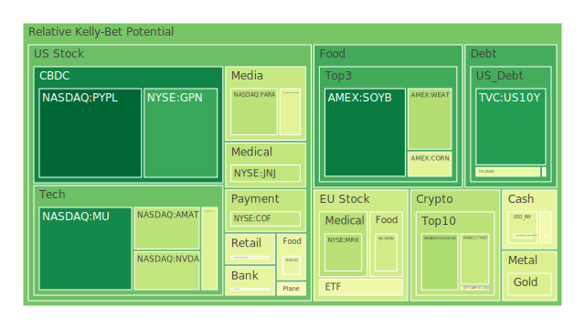
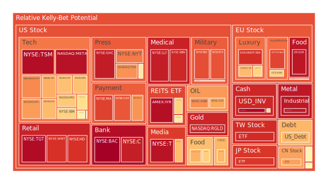
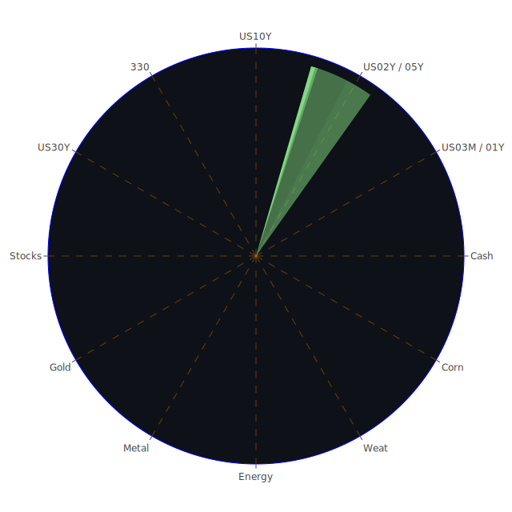

# **投資商品泡沫分析**

當前全球金融市場，在多重因素交織影響下，呈現高度複雜與動態的局面。美國聯邦儲備系統的總資產持續下降，有效聯邦基金利率(EFFR)成交量一度攀升後呈現穩定，逆回購協議(RRP)規模縮減，顯示市場流動性狀況正經歷微妙變化。與此同時，商業房地產、消費信貸及整體房地產市場的拖欠率均處於相對高位，警示潛在的信用風險。然而，信用卡相關的拖欠與沖銷率，尤其是來自百大銀行的數據，卻相對較低，這可能反映了信貸質量的分層，或是風險暴露的滯後性。高收益債券利率處於低位，可能暗示市場在追求收益的同時，對風險的定價偏樂觀，或存在流動性充裕的現象。鑑於此背景，我們將對各類主要投資商品進行深入的泡沫分析。

* 美國國債  
  美國國債市場作為全球資產定價之錨，其殖利率的波動深刻影響著所有資產類別。觀察近期數據（2025-05-31），美國十年期國債殖利率 (US10Y) 為4.40%，相較於上週的4.60%及去年的4.02%有所波動，但高於上月的4.33%。其泡沫指數D1為0.111618，月平均D30為0.369979，顯示短期風險不高，但中期累積了一定程度的價格壓力，可能源於市場對未來聯準會政策路徑、通膨預期以及經濟增長前景的博弈。從歷史視角看，債券市場的泡沫通常伴隨著過低的殖利率和過度樂觀的經濟預期，或是在避險情緒極度高漲時，資金過度湧入導致價格偏離。目前10年期與3個月期國債殖利率差 (US Yield 10Y-03M) 為0.05，雖已轉正，但仍處於歷史低位，暗示經濟前景的不確定性。聯準會總資產下降趨勢在2023年8月14日惡化，可能長期對債券價格構成壓力（殖利率上升）。新聞中並未直接提及美國國債的重大事件，但全球地緣政治緊張，例如俄烏衝突的持續，以及中美科技戰的延伸（如Nvidia H20晶片許可要求導致數十億美元營收損失的預期），均可能間接提升避險需求，對短期國債價格形成支撐，但長期來看，美國政府債務佔GDP比重攀升，是個不容忽視的隱憂。  
* 美國零售股  
  美國零售股，如沃爾瑪 (WMT) 和塔吉特 (TGT)，其表現與消費者信心、就業市場及可支配收入密切相關。沃爾瑪泡沫指數D1為0.895272，月平均D30為0.890283；塔吉特D1為0.971673，月平均D30為0.941202。兩者均顯示出較高的短期與長期泡沫風險。這可能反映了市場對其品牌實力、供應鏈管理能力以及在通膨環境下價格競爭力的樂觀預期。然而，消費者拖欠率處於相對高位，這對零售業的未來銷售和利潤是個潛在威脅。歷史上，零售股在經濟衰退前夕，即使業績尚可，也可能因市場預期轉差而大幅回調。新聞中，維多利亞的秘密 (Victoria's Secret) 網站因安全事件下線，以及重型卡車零件製造商與分銷商在經營46年後將關閉，這類事件雖非直接衝擊大型零售商，但也反映了行業競爭的激烈和潛在的營運風險。家得寶 (HD) 的泡沫指數D1為0.895129，月平均D30為0.762232，同樣偏高，房地產市場的降溫和高企的抵押貸款利率（30年期固定抵押貸款利率6.89%）可能對其未來增長構成挑戰。  
* 美國科技股  
  美國科技股，尤其是大型股如微軟 (MSFT)、蘋果 (AAPL)、谷歌 (GOOG)、亞馬遜 (AMZN) 及元宇宙 (META)，一直是市場關注的焦點。微軟泡沫指數D1為0.752118，D30為0.677812；蘋果D1為0.722453，D30為0.646725；谷歌D1為0.510902，D30為0.574880；亞馬遜D1為0.655611，D30為0.710752；META泡沫指數D1高達0.956829，D30為0.874223。整體來看，科技巨頭的泡沫風險評分處於中高水平，META尤為突出。這與近期AI熱潮的持續、企業雲端服務需求的強勁增長有關。新聞中，Nvidia財報超預期、克服關稅影響，以及CEO黃仁勳宣揚美國製造計劃等，均為科技行業帶來正面情緒，但也伴隨著對中國出口管制威脅美國晶片領導地位的警告。歷史上，科技股經歷過2000年的科網泡沫，當時的特徵是極高的估值、脫離基本面的股價以及對新技術的過度炒作。當前AI領域的發展迅猛，部分個股估值高企，確實存在一定的泡沫化傾向。然而，與2000年不同的是，目前許多科技巨頭擁有實質性的盈利和現金流。但美國宣布針對社交媒體「審查制度」的簽證限制，以及民主黨參議員華倫對美國關稅協議可能有利於大型科技公司而非工人的擔憂，都為科技股帶來了政策和監管上的不確定性。  
* 美國房地產指數  
  美國房地產指數，如AMEX:VNQ和AMEX:IYR，反映了房地產投資信託基金 (REITs) 的整體表現。VNQ的D1為0.562226，D30為0.482072；IYR的D1為0.963730，D30為0.873692。IYR的泡沫風險顯著偏高。這與FED經濟數據中商業房地產拖欠率和整體房地產拖欠率均處於相對高位形成對比，可能市場對REITs的分紅能力和資產質量仍有信心，或者高泡沫評分反映了利率敏感性的價格波動。30年期固定抵押貸款利率高達6.89%，遠高於去年的2.96%，這對住宅房地產市場的交易活躍度和價格構成壓力。歷史上，房地產市場的重大調整往往與信貸收緊、利率急升以及經濟衰退相伴，2008年的次貸危機便是一個深刻教訓。當前高企的拖欠率值得高度警惕，若情況惡化，可能導致REITs資產價值重估和現金流壓力。  
* 加密貨幣  
  加密貨幣市場以其高波動性著稱。比特幣 (BTCUSD) 的D1為0.485759，D30為0.506826；以太坊 (ETHUSD) D1為0.364547，D30為0.441315；狗狗幣 (DOGEUSD) D1為0.310705，D30為0.469476。目前主流加密貨幣的泡沫指數處於中等水平，並未顯示極端泡沫化。然而，GameStop宣布購買價值5億美元的比特幣，這一新聞事件將傳統金融市場的迷因股現象與加密貨幣市場聯繫起來，增加了市場的投機色彩和不確定性。歷史上，加密貨幣經歷過多次暴漲暴跌，其價格受市場情緒、監管政策、技術進展以及宏觀流動性等多重因素影響。各國對加密貨幣的監管態度不一，美國對部分中國學生的「驅逐」威脅以及針對社交媒體的簽證限制，雖然並非直接針對加密貨幣，但也反映了監管環境的複雜性。加密貨幣作為一種新興資產類別，其內在價值和長期前景仍在探索之中，高波動性和高風險是其固有屬性。  
* 金/銀/銅  
  貴金屬和工業金屬是衡量經濟健康狀況和避險情緒的重要指標。黃金 (XAUUSD) 的D1為0.403904，D30為0.555043，泡沫指數中等，反映其避險屬性在當前地緣政治不確定和通膨環境下的吸引力。白銀 (XAGUSD) 的D1為0.946383，D30為0.909424，泡沫指數顯著偏高，可能受到工業需求預期和投機資金追捧的雙重影響。銅 (COPPER) 作為重要的工業金屬，其D1為0.500296，D30為0.519456，泡沫指數中等，反映市場對全球經濟復甦前景的謹慎樂觀。黃金石油比率 (GOLD OIL RATIO) 為54.22，遠高於去年的31.15，通常暗示市場避險情緒較濃或對經濟前景擔憂。黃金銅比率 (GOLD COPPER RATIO) 為701.04，亦高於去年，這可能意味著相對於工業前景，市場更看重黃金的保值功能。歷史上，金價往往在通膨高漲、貨幣貶值或地緣政治危機時表現良好。白銀則兼具貴金屬和工業屬性，其價格彈性通常大於黃金。銅價與全球工業生產和經濟增長高度相關。新聞中雖無直接重大消息，但全球供應鏈的潛在調整和主要經濟體的增長前景，均會對這些金屬價格產生影響。金礦防禦股如RGLD，其D1高達0.919384，D30為0.922734，顯示出極高的泡沫風險，可能已過度反映了金價上漲的預期。  
* 黃豆 / 小麥 / 玉米  
  農產品是關係國計民生的重要大宗商品。黃豆 (SOYB) D1為0.040711，D30為0.609447，短期風險極低，但月平均風險較高，顯示近期價格有所回落或波動加大。小麥 (WEAT) D1為0.321918，D30為0.414701，泡沫指數中等。玉米 (CORN) D1為0.423725，D30為0.478320，泡沫指數亦處於中等水平。農產品價格受天氣、地緣政治（如影響黑海糧食出口的俄烏衝突）、能源價格（影響化肥和運輸成本）、各國農業政策以及美元匯率等多重因素影響。歷史上，極端天氣事件或主要出口國的供應中斷，都可能導致農產品價格飆升。新聞中提到中國南方地區的洪水預警以及印度金融之都孟買因季風提早來臨而遭受洪水侵襲，澳洲洪水恢復可能需要數月，這些極端天氣事件可能對全球農產品供應鏈造成衝擊。十一國要求歐盟進一步削弱森林砍伐法，也可能對長期農產品供應格局產生影響。  
* 石油/ 鈾期貨UX\!  
  能源市場對全球經濟和通膨有著舉足輕重的作用。美國原油 (USOIL) 的D1為0.534628，D30為0.307061，顯示短期風險有所上升，但月平均風險不高，價格似乎在尋找方向。鈾期貨 (UX1\!) D1為0.510716，D30為0.496143，泡沫指數中等。石油需求增長面臨顯著逆風的報導，以及主要產油國的政策動向，都對油價構成影響。歷史上，地緣政治衝突、OPEC+產量決策以及全球經濟增長預期是影響油價的主要因素。鈾作為核燃料，其價格與核電發展前景和能源轉型政策相關。目前，俄烏衝突持續，中東局勢緊張，這些因素都可能推高能源價格。然而，全球經濟若放緩，則會抑制能源需求。石油防禦股如XOM和OXY，其泡沫指數也值得關注。埃克森美孚 (XOM) D1為0.744333，D30為0.802010；西方石油 (OXY) D1為0.706046，D30為0.725992，均處於較高水平，反映了市場對其盈利能力的樂觀預期，但也累積了較高風險。  
* 各國外匯市場  
  外匯市場是全球資本流動的鏡子。美元兌日圓 (USDJPY) D1為0.464989，D30為0.767529；歐元兌美元 (EURUSD) D1為0.978138，D30為0.920779；英鎊兌美元 (GBPUSD) D1為0.589353，D30為0.478137；澳元兌美元 (AUDUSD) D1為0.421543，D30為0.305053。可以看出，歐元兌美元的泡沫風險非常高，暗示歐元短期可能相對美元超買，或美元有走弱壓力。美元兌日圓的月平均泡沫指數也較高，反映日圓持續弱勢的趨勢可能已累積一定風險。外匯市場的波動受各國央行貨幣政策差異、經濟增長前景、利率水平、資本流動以及地緣政治等多重因素影響。例如，聯準會的政策動向直接影響美元指數，進而影響其他主要貨幣對。日本央行若調整其超寬鬆貨幣政策，可能導致日圓大幅波動。歐洲央行的利率決策也直接影響歐元走勢。從歷史經驗看，外匯市場的趨勢一旦形成，往往具有較強的慣性，但也容易在關鍵轉折點出現劇烈波動。  
* 各國大盤指數  
  全球主要股市指數表現各異。納斯達克100指數 (NDX) D1為0.691804，D30為0.740064，泡沫風險較高，與科技股的強勢表現一致。英國富時100指數 (FTSE) D1為0.519181，D30為0.560047；德國DAX指數 (GDAXI) D1為0.471095，D30為0.512354；法國CAC40指數 (FCHI) D1為0.451302，D30為0.568800。歐洲主要股指泡沫風險相對溫和。中國滬深300指数 (000300) D1為0.714622，D30為0.709765，風險處於中高水平。日經225指數 (JPN225) D1為0.886937，D30為0.833679，泡沫風險很高，可能與日圓貶值刺激出口企業盈利以及日本股市自身的結構性改革有關。台灣加權股價指數0050 (元大台灣50) 的D1為0.905473，D30為0.648249，短期風險極高，但月平均風險相對較低，顯示近期漲幅較大，可能與台積電等權值股的強勁表現有關。各國股市的表現反映了其國內經濟狀況、企業盈利能力、利率環境以及全球投資者的風險偏好。  
* 美國半導體股  
  半導體股是科技行業的核心。除了Nvidia (NVDA D1 0.353882, D30 0.661968) 外，超微 (AMD D1 0.641670, D30 0.658730)、高通 (QCOM D1 0.659290, D30 0.840115)、英特爾 (INTC D1 0.595592, D30 0.547459)、美光 (MU D1 0.071489, D30 0.313292)、應用材料 (AMAT D1 0.341555, D30 0.602398)、科磊 (KLAC D1 0.418273, D30 0.541220)、博通 (AVGO D1 0.670351, D30 0.798684) 和台積電 (TSM D1 0.966288, D30 0.968485) 均為代表性企業。整體而言，半導體股泡沫風險參差不齊。台積電和高通的風險評分極高，而美光科技的短期風險則非常低。Nvidia雖然近期股價強勢，但其D1相對D30有所回落。新聞中關於美國限制向中國出售晶片及相關技術的消息（如Nvidia H20晶片和Chip Software Stocks Tumble on Report Trump Orders They Stop Selling to China），對半導體行業構成了顯著的地緣政治風險和市場不確定性。然而，AI發展的長期趨勢又為半導體帶來巨大需求。歷史上，半導體行業具有明顯的周期性，受供需關係、技術革新和資本支出周期的影響。當前，行業面臨地緣政治分裂和供應鏈重塑的挑戰，同時也孕育著AI等新興領域的巨大機遇。  
* 美國銀行股  
  美國銀行股，如摩根大通 (JPM)、美國銀行 (BAC)、花旗集團 (C) 和第一資本 (COF)，其表現與利率環境、信貸質量和經濟活動密切相關。摩根大通D1為0.438580，D30為0.779085；美國銀行D1為0.995114，D30為0.949042；花旗集團D1為0.932686，D30為0.880965；第一資本D1為0.361040，D30為0.499966。美國銀行和花旗集團的泡沫風險指數極高，摩根大通的月平均風險也偏高，而第一資本相對較低。這可能反映了市場對大型銀行在當前利率環境下淨息差擴大的預期，但也可能忽略了潛在的信貸風險（如商業房地產拖欠率高企）。FED數據顯示美國銀行總存款處於相對高位，但商業房地產、消費者和整體房地產的拖欠率也處於高位，這對銀行資產質量構成潛在威脅。歷史上，銀行股在金融危機中首當其衝。當前環境下，雖然利率上升有利於擴大淨息差，但也可能增加信貸成本和壞賬風險。  
* 美國軍工股  
  美國軍工股，如洛克希德馬丁 (LMT)、諾斯洛普格魯曼 (NOC) 和雷神技術 (RTX)，在全球地緣政治緊張局勢加劇的背景下，受到市場關注。洛克希德馬丁D1為0.549831，D30為0.675509；諾斯洛普格魯曼D1為0.846899，D30為0.679029；雷神技術D1為0.837782，D30為0.854050。這些軍工股的泡沫風險均處於中高至高水平，雷神技術尤為突出。這與全球國防開支增加、地區衝突頻發（如俄烏衝突、中東緊張局勢）的預期相符。新聞中，克里姆林宮批評烏克蘭盟友解除對俄發射遠程導彈的禁令，以及印度批准隱形戰鬥機計劃，均反映了全球軍備競賽的升溫。歷史上，軍工股在戰爭或冷戰時期通常表現良好。然而，其估值也容易受到市場情緒和對未來訂單預期的過度炒作。  
* 美國電子支付股  
  電子支付行業，如Visa (V)、Mastercard (MA)、PayPal (PYPL) 和Global Payments (GPN)，受益於全球電子商務的發展和無現金化趨勢。Visa D1為0.736499，D30為0.804729；Mastercard D1為0.867968，D30為0.830874。這兩大巨頭的泡沫風險均處於高位。PayPal D1為0.000000，D30為0.647509，短期風險極低，但月平均風險較高，顯示近期價格壓力得到釋放。Global Payments D1為0.138533，D30為0.301383，風險相對較低。電子支付行業的增長潛力巨大，但也面臨日益激烈的競爭（來自金融科技新創企業）和監管審查。消費者支出和整體經濟狀況對其交易量有直接影響。高企的泡沫評分可能反映了市場對其商業模式和持續增長能力的信心，但也需要警惕估值過高的風險。  
* 美國藥商股  
  大型藥商股，如嬌生 (JNJ)、默克 (MRK)、禮來 (LLY) 和艾伯維 (ABBV)，通常被視為防禦性資產，因其產品需求相對穩定。嬌生D1為0.353203，D30為0.218160，泡沫風險較低，符合其傳統防禦屬性。默克D1為0.335582，D30為0.462274，風險中等。禮來D1為0.935381，D30為0.933688，泡沫風險極高，可能與其減肥藥等重磅產品的市場預期有關。艾伯維D1為0.914914，D30為0.637795，短期風險高，月平均風險中等偏高。諾和諾德 (NVO，雖為丹麥公司但在美股交易活躍) D1為0.523593，D30為0.548349，風險中等，同樣受益於減肥藥概念。美國取消對Moderna禽流感疫苗超過7億美元的資助，這類新聞可能對特定生物技術公司造成衝擊，但也凸顯了藥物研發的風險。大型藥企面臨專利懸崖、藥品定價壓力以及研發失敗的風險，但同時也受益於人口老化和醫療保健需求的持續增長。  
* 美國影視股  
  影視娛樂行業，如迪士尼 (DIS)、Netflix (NFLX) 和派拉蒙 (PARA)。迪士尼D1為0.670233，D30為0.757478，泡沫風險較高，可能反映了市場對其主題公園業務復甦和流媒體業務整合的預期。Netflix D1為0.423269，D30為0.479307，風險中等，顯示在流媒體競爭加劇的環境下，市場對其估值趨於謹慎。派拉蒙D1為0.337691，D30為0.469341，風險中等。影視行業正面臨流媒體轉型、內容成本上升、廣告市場波動以及罷工等潛在風險。迪士尼和Netflix作為行業領導者，其策略調整和業績表現對行業有風向標意義。  
* 美國媒體股  
  媒體行業，如康卡斯特 (CMCSA)、福斯 (FOX) 和紐約時報 (NYT)。康卡斯特D1為0.561161，D30為0.435981，風險中等。福斯D1為0.740196，D30為0.830390，泡沫風險較高。紐約時報D1為0.778367，D30為0.753657，泡沫風險也較高。傳統媒體面臨數位化轉型的挑戰，廣告收入受到新媒體平台的擠壓。新聞中提到美國之音剩餘員工本週預計將收到解僱通知，反映了部分媒體機構的困境。然而，具有強大品牌和優質內容的媒體公司，仍能在市場中佔據一席之地。福斯和紐約時報較高的泡沫評分可能與其在特定細分市場的影響力或轉型進展有關。  
* 石油防禦股  
  已在「石油/鈾期貨UX\!」部分提及埃克森美孚 (XOM) 和西方石油 (OXY)。它們的高泡沫風險反映了市場對能源價格和石油公司盈利能力的樂觀預期，但同時也隱含了若油價大幅回落或全球經濟超預期放緩，其股價可能面臨較大調整壓力。  
* 金礦防禦股  
  已在「金/銀/銅」部分提及皇家黃金 (RGLD)。其極高的泡沫風險 (D1 0.919384, D30 0.922734) 值得高度關注。這通常意味著市場對金價上漲的預期已經非常充分地反映在股價中，甚至可能存在過度樂觀。如果金價未能持續上漲或出現回調，金礦股的調整幅度可能更大。  
* 歐洲奢侈品股  
  歐洲奢侈品股，如路威酩軒 (MC)、開雲集團 (KER) 和愛馬仕 (RMS)。路威酩軒D1為0.618335，D30為0.528516，風險中等。開雲集團D1為0.899653，D30為0.868770，泡沫風險很高。愛馬仕D1為0.670763，D30為0.613879，風險中等偏高。奢侈品行業對全球宏觀經濟，特別是高淨值人群的消費能力和信心非常敏感。中國作為重要的奢侈品消費市場，其經濟復甦力度對行業影響巨大。開雲集團的高泡沫風險可能與其品牌轉型、特定市場表現或併購傳聞等因素有關，但同時也使其更容易受到負面消息的衝擊。  
* 歐洲汽車股  
  歐洲汽車股，如賓士 (MBG)、寶馬 (BMW) 和保時捷 (PAH3)。賓士D1為0.508003，D30為0.495204，風險中等。寶馬D1為0.626799，D30為0.547233，風險中等偏高。保時捷D1為0.861759，D30為0.638729，泡沫風險較高。歐洲汽車行業面臨向電動化轉型的巨大挑戰，同時也受到來自中國電動車品牌的激烈競爭以及全球供應鏈不穩定性的影響。日產工廠可能關閉的消息，雖然是日本車企，但也反映了傳統汽車製造商在全球市場競爭中面臨的壓力。汽車股的估值需要考慮其在技術轉型中的投入、市場份額的變化以及宏觀經濟對汽車消費的影響。  
* 歐美食品股  
  歐美大型食品飲料公司，如雀巢 (NESN)、可口可樂 (KO)、卡夫亨氏 (KHC) 和聯合利華 (ULVR)。雀巢D1為0.385446，D30為0.561664，風險中等。可口可樂D1為0.443390，D30為0.627233，風險中等偏高。卡夫亨氏D1為0.687576，D30為0.717437，泡沫風險較高。聯合利華D1為0.948217，D30為0.944456，泡沫風險極高。麥當勞 (MCD) D1為0.629765，D30為0.699489，風險也處於中高水平。這些公司通常被視為防禦性股票，因其產品需求相對穩定。然而，高企的泡沫評分，特別是聯合利華和卡夫亨氏，可能反映了市場對其品牌定價能力和成本控制能力的過度樂觀，尤其是在當前通膨環境和消費者購買力可能承壓的背景下。它們也面臨原材料成本波動、供應鏈挑戰以及消費者偏好變化的影響。

# **宏觀經濟傳導路徑分析**

當前宏觀經濟環境的核心驅動力來自於各國央行的貨幣政策、持續的地緣政治風險以及全球供應鏈的重塑。聯準會持續縮減資產負債表，儘管近期未有明確的鷹派或鴿派發言，但市場對未來利率路徑的預期主導著資產價格。

正向傳導路徑（Thesis）：若通膨數據持續降溫（如CPI YoY已降至2.33%），市場可能預期聯準會提前結束緊縮週期甚至轉向降息。這將導致：

1. 債券殖利率下降（價格上漲），尤其是對利率敏感的長期國債。目前美國10年期國債殖利率已從高位回落。  
2. 股市估值提升，特別是成長型科技股，因其未來現金流折現率降低。  
3. 美元可能走弱，有利於非美貨幣和以美元計價的大宗商品。  
4. 房地產市場壓力減輕，因抵押貸款利率有望下降。

反向傳導路徑（Antithesis）：然而，多重負面因素可能阻礙或逆轉此樂觀路徑：

1. 居高不下的各類貸款拖欠率（商業地產、消費、房地產）可能引發信用事件，導致信貸市場緊縮，即使聯準會降息，其實體經濟傳導效果也可能打折。  
2. 地緣政治衝突（俄烏、中東、中美科技戰）的升級可能導致能源和商品價格再次飆升，推高通膨預期，迫使央行維持緊縮政策。例如，Nvidia因H20晶片出口許可損失數十億美元營收的預期，以及美國據報命令晶片軟體公司停止向中國銷售，均是地緣政治對經濟的直接衝擊。  
3. 全球供應鏈重塑過程中的摩擦成本和效率損失，可能在中期內持續帶來通膨壓力。

綜合效應（Synthesis）：市場正處於多空因素的拉鋸戰中。一方面，通膨有緩解跡象，為政策轉向帶來希望；另一方面，經濟內部的脆弱性（高拖欠率）和外部的衝擊（地緣政治）不容忽視。因此，市場波動性可能加劇。資金可能在避險資產（如短期國債、黃金）和風險資產（如部分科技股、高股息股）之間快速輪動。高收益債券利率雖低，但若風險事件爆發，其利差可能迅速擴大。整體而言，經濟呈現「軟著陸」還是「硬著陸」的概率，以及通膨是否會二次抬頭，是影響宏觀傳導路徑的關鍵變數。從FED數據看，美國公眾持有的債務佔GDP比重上升，以及貨幣市場基金總資產上升，均顯示市場對未來不確定性的擔憂和避險需求的增加。

# **微觀經濟傳導路徑分析**

在企業層面，宏觀因素通過影響企業的營運成本、融資成本、市場需求和競爭格局，進而傳導至其盈利能力和股價表現。

成本端傳導：

1. **原材料與能源價格**：石油、天然氣、金屬和農產品價格的波動直接影響製造業、農業、運輸業等眾多行業的生產成本。例如，油價若持續上漲，航空、物流以及大量依賴運輸的零售業成本將增加。  
2. **勞動力成本**：雖然未直接提供失業率和薪資增長數據，但McKinsey裁員超過10%的新聞暗示部分行業可能面臨需求放緩或成本壓力。勞動力市場的緊張程度影響薪資水平，進而影響企業利潤率。  
3. **融資成本**：利率水平直接影響企業的借貸成本。高利率環境下，高負債企業的利息支出增加，盈利受壓，資本支出意願降低。對於依賴持續融資的成長型科技企業，融資成本上升可能限制其擴張速度。

需求端傳導：

1. **消費者信心與支出**：消費者拖欠率高企，可能預示著未來消費支出的疲軟，這對零售、非必需消費品、旅遊娛樂等行業構成壓力。維多利亞的秘密網站安全事件、重型卡車零件商倒閉等，均是微觀層面需求或經營困境的體現。  
2. **企業投資與採購**：企業對未來經濟前景的預期影響其資本支出和採購決策。若預期經濟放緩，企業可能削減投資，影響相關供應鏈企業的需求。  
3. **國際市場需求與貿易政策**：對於出口導向型企業，全球經濟狀況及貿易政策（如關稅、出口管制）至關重要。Nvidia對中國市場的依賴以及相關出口限制，直接影響其營收。美國民主黨參議員華倫對關稅協議可能偏袒大型科技企業的擔憂，也暗示了貿易政策的複雜影響。

競爭與創新傳導：

1. **行業競爭格局**：SentinelOne雖然營收符合預期但股價大跌並下調全年營收預測，顯示在網路安全等高科技領域競爭異常激烈，市場對增長放緩的容忍度低。  
2. **技術創新與替代**：AI技術的快速發展為Nvidia等公司帶來巨大機遇，但也可能對傳統行業或未能及時轉型的企業構成顛覆性衝擊。  
3. **監管環境變化**：美國針對社交媒體「審查制度」的簽證限制，以及對Moderna禽流感疫苗資助的取消，都顯示了政府政策和資金導向對特定行業或企業的直接影響。

例如，Nvidia的案例是典型的多重傳導路徑交匯點：宏觀上，AI的長期趨勢帶來巨大需求（正向）；但中美科技戰導致的出口管制限制了其部分市場（負向）。微觀上，其技術領先地位使其享有高毛利，但也面臨其他晶片廠商的追趕和潛在的供應鏈風險。其高泡沫評分正是這些複雜因素綜合作用下，市場情緒和預期的極端體現。

# **資產類別間傳導路徑分析**

資產類別之間的價格聯動和風險傳導是金融市場的重要特徵，常呈現此消彼長或同漲同跌的關係，這背後是共通的宏觀因子、市場情緒以及資金流動在起作用。

1. **股債關係**：傳統上，股債常呈負相關，尤其在經濟衰退或避險情緒升溫時，資金從股市流向債市，導致股價跌、債券價格漲（殖利率跌）。然而，在通膨高企、央行被迫同時收緊貨幣政策的環境下，股債可能同跌，即所謂的「股債雙殺」。當前美國10年期國債殖利率處於4.40%，而納斯達克100指數泡沫風險較高，顯示市場對利率路徑和經濟前景的看法仍有分歧。若經濟數據進一步走弱，債券的避險屬性可能凸顯；反之，若通膨頑固，則股債均可能承壓。  
2. **美元與大宗商品**：美元指數的強弱通常與以美元計價的大宗商品價格呈負相關。強勢美元使得購買大宗商品的成本對非美元國家而言更高，抑制需求。目前USDJPY月平均泡沫指數較高，而EURUSD泡沫指數亦極高，顯示美元對不同貨幣表現分化。黃金石油比率大幅高於去年，可能反映了相對於石油的工業需求預期，黃金的避險或貨幣屬性更受青睞。若美元因聯準會政策預期轉向而走弱，可能對金、銀、銅、油等大宗商品價格形成支備。  
3. **科技股與加密貨幣**：近年來，高成長性的科技股（尤其是納斯達克指數成分股）與比特幣等主流加密貨幣之間表現出較強的正相關性。這主要因為兩者均被視為風險資產，受市場流動性和風險偏好情緒的共同影響。當市場情緒樂觀、流動性充裕時，兩者易同漲；反之亦然。GameStop購買比特幣的行為，更是強化了這種高風險偏好資產之間的聯動印象。  
4. **房地產與銀行股**：房地產市場的健康狀況直接影響銀行業的資產質量。美國商業房地產和住宅房地產拖欠率的高企，對銀行股構成潛在威脅。若房地產價格大幅下跌，可能引發抵押貸款違約潮，衝擊銀行盈利甚至系統穩定性。因此，房地產指數（如IYR的高泡沫風險）與銀行股（如BAC、C的高泡沫風險）之間存在密切的風險傳導路徑。  
5. **黃金與地緣政治/通膨**：黃金作為傳統的避險資產，在地緣政治緊張局勢加劇（如俄烏衝突、中東局勢）或通膨高企時，其價格往往上漲。金礦股（如RGLD）的表現與金價高度相關，但其股價彈性通常更大，泡沫風險也可能更高。當前全球多點地緣政治衝突，為黃金提供了支撐。  
6. **奢侈品股與全球經濟/中國市場**：歐洲奢侈品股的表現高度依賴全球高淨值人群的消費能力和意願，其中中國市場的貢獻尤為關鍵。若中國經濟復甦不及預期，或全球貧富差距擴大導致社會對奢侈消費的態度轉變，都可能對奢侈品行業造成衝擊。開雲集團的高泡沫指數警示了這種脆弱性。  
7. **農產品與氣候/能源價格**：極端天氣事件（洪水、乾旱）直接影響農產品產量，推高價格。能源價格上漲則推高化肥和運輸成本，進一步助長農產品價格。中國南方的洪水和印度的早季風是潛在的供應衝擊。

漣漪效應傳導路徑示例：若美國商業房地產風險全面爆發（高拖欠率惡化），可能導致：  
\* 持有大量商業房地產貸款的銀行股（如BAC, C）壞帳撥備增加，股價下跌。  
\* REITs（如IYR, VNQ）估值下挫，租金收入和資產價值雙降。  
\* 市場避險情緒升溫，資金流向美國國債（尤其是短期限），壓低殖利率。  
\* 美元因避險需求短期走強，但若危機蔓延損及美國經濟基本面，則可能轉弱。  
\* 股市整體承壓，尤其是對經濟敏感的周期性行業。  
\* 消費信心受挫，進一步影響零售股（如WMT, TGT）和非必需消費品。  
這種傳導路徑並非單一線性，而是多重因素相互作用的複雜網絡。例如，央行若為應對房地產危機而大幅降息，又可能刺激通膨，使問題複雜化。

# **投資建議**

基於前述分析，並綜合考量當前市場環境的機遇與風險，我們提出以下三種不同風險偏好的資產配置建議。需強調的是，所有泡沫指數均為動態變化，投資者應密切關注市場動態並結合自身情況進行決策。

**一、 穩健型投資組合 (Conservative Portfolio)**

此組合旨在實現資本保值，並在此基礎上爭取溫和回報，適合風險承受能力較低的投資者。

1. **美國短期國債 (如US03MY, US01Y, US02Y)**：配置比例40%。  
   * 理由：在利率環境相對較高且未來可能緩步下行的預期下，短期國債提供了相對不錯的票息收入和較高的流動性。其泡沫指數（如US02Y D30約0.609932）雖非極低，但在當前環境下仍具吸引力。主要對沖經濟下行風險和市場劇烈波動風險。  
2. **優質大型製藥股 (如嬌生 JNJ)**：配置比例35%。  
   * 理由：嬌生 (JNJ) 的泡沫指數持續處於低位 (D30約0.218160)，顯示其估值相對合理。醫藥需求具有剛性，不受經濟週期影響較小，大型藥企通常擁有穩定的現金流和分紅。可對沖通膨和部分市場下行風險。  
3. **黃金 (XAUUSD)**：配置比例25%。  
   * 理由：黃金 (XAUUSD) 的泡沫指數中等 (D30約0.555043)。在地緣政治不確定性持續、全球央行購金以及對沖潛在貨幣貶值風險的需求下，黃金仍是重要的避險工具。可對沖地緣政治風險、通膨超預期風險。

**二、 成長型投資組合 (Growth Portfolio)**

此組合旨在尋求資本的長期增值，願意為此承受中等程度的市場波動，適合對市場前景相對樂觀且有一定風險承受能力的投資者。

1. **美國大型科技股 (如谷歌 GOOG, 微軟 MSFT)**：配置比例40%。  
   * 理由：谷歌 (GOOG D30約0.574880) 和微軟 (MSFT D30約0.677812) 在AI、雲端計算等領域具有領先地位和強勁的長期增長潛力。雖然泡沫指數處於中等偏高水平，但其基本面和盈利能力仍具吸引力。它們代表了新經濟的核心驅動力。  
2. **全球大盤指數ETF (分散投資於美國以外發達市場，如追蹤MSCI EAFE指數的ETF，或可考慮SPDR Portfolio Developed World ex-US ETF \- SPDW等作為參考，此處以歐洲主要指數FTSE/GDAXI為例，其泡沫指數D30約0.5-0.56)**：配置比例35%。  
   * 理由：通過投資於美國以外的發達市場，可以分散單一市場風險，捕捉全球經濟復甦的機會。歐洲股市估值相對美股可能更具吸引力，且部分企業在全球市場具有競爭力。  
3. **工業金屬 \- 銅 (COPPER)**：配置比例25%。  
   * 理由：銅 (COPPER D30約0.519456) 是重要的工業原材料，被視為經濟的「晴雨表」。若全球經濟逐步復甦，特別是綠色能源轉型（電動車、風電、太陽能等）加速，對銅的需求將持續增長。其泡沫指數中等，提供了參與經濟上行週期的機會。

**三、 高風險型投資組合 (Aggressive Portfolio)**

此組合旨在追求最大化的資本回報，願意為此承受較高的市場波動和潛在損失，適合風險承受能力強、投資期限較長且對特定高增長領域有信心的投資者。

1. **美國半導體龍頭股 (如輝達 NVDA, 台積電 TSM)**：配置比例50%。  
   * 理由：輝達 (NVDA D30約0.661968) 和台積電 (TSM D30約0.968485) 是全球AI和半導體行業的領導者，具有強大的技術壁壘和市場需求。儘管泡沫指數偏高甚至極高（尤其是TSM），但其在高成長賽道上的卡位優勢使其具備博取高回報的潛力。投資者需密切關注其估值變化和行業風險。  
2. **加密貨幣 (如比特幣 BTCUSD, 以太坊 ETHUSD)**：配置比例30%。  
   * 理由：比特幣 (BTCUSD D30約0.506826) 和以太坊 (ETHUSD D30約0.441315) 作為主流加密貨幣，儘管波動巨大，但也被部分投資者視為具有長期潛力的新興資產類別和對沖傳統金融體系風險的工具。其泡沫指數目前處於中等水平，但風險依然很高。  
3. **歐洲奢侈品龍頭股 (如路威酩軒 MC 或考慮泡沫指數更高的開雲集團 KER)**：配置比例20%。  
   * 理由：奢侈品行業具有較強的品牌壁壘和定價能力。路威酩軒 (MC D30約0.528516) 作為行業龍頭，業務多元化，風險相對可控。若選擇開雲集團 (KER D30約0.868770)，則風險與潛在回報更高，需關注其品牌重塑和市場表現。此配置旨在捕捉全球高淨值人群消費復甦的機會，並對沖部分通膨風險。

# **風險提示**

投資有風險，市場總是充滿不確定性。本報告所提供的分析和建議僅基於當前獲取的數據和筆者對市場的理解，不構成任何投資邀約或最終操作指引。過往業績並不預示未來回報，資產的泡沫指數和價格會隨市場環境變化而波動。

各類資產均面臨其特定的風險：債券受利率和信用風險影響；股票受企業盈利、行業前景和市場情緒影響；大宗商品受供需、地緣政治和美元匯率影響；加密貨幣則面臨極高的波動性、監管不確定性和技術風險。

我們強烈建議投資者在做出任何投資決策前，應充分了解相關投資產品的特性與風險，審慎評估自身的財務狀況、風險承受能力、投資目標和投資期限，並在必要時尋求獨立的專業財務意見。市場的「泡沫」與「價值」往往在一線之間，且常在事後才能被清晰界定。保持警惕，理性分析，分散投資，是應對市場不確定性的重要原則。請對自己的投資行為負最終責任。

 
Daily Buy Map:

 
Daily Sell Map:

 
Daily Radar Chart:

 
