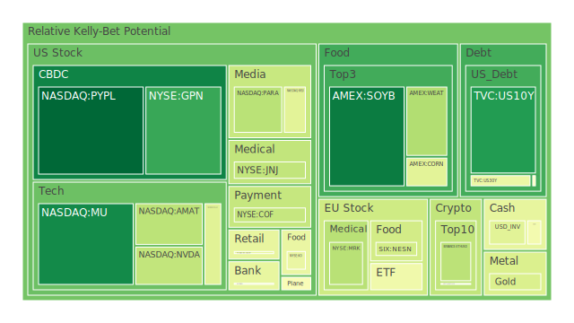
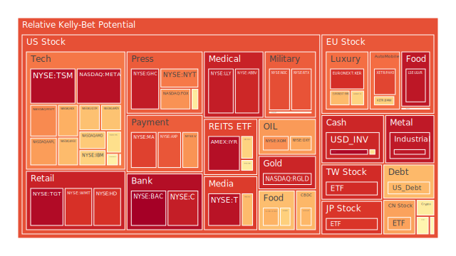
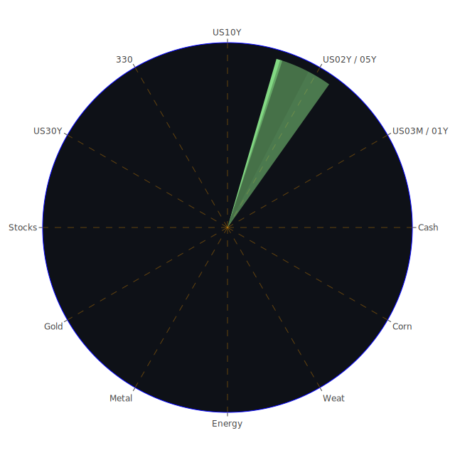

好的，這是一份根據您提供的資料與指示所撰寫的市場分析報告。本報告的目標是客觀呈現當前市場狀況，並基於經濟學、社會學、心理學與博弈論等多維度視角，進行審慎的推論與假設。

# **投資商品泡沫分析**

在當前全球金融市場環境中，多種資產類別呈現出不同程度的價格波動與潛在泡沫風險。以下將針對各主要投資商品，結合近期數據與市場觀察，進行專業論述。我們的分析旨在揭示現狀背後的深層邏輯，並導引出經過深思熟慮的結論，而非簡單的市場預測。報告中提及的泡沫分數（D1, D7, D14, D30）為衡量短期至中期市場情緒與價格偏離的指標，分數越高，潛在的調整壓力或非理性繁榮的成分可能越大。

**美國國債 (US Treasuries)**

美國國債市場近期呈現複雜局面。以2025年6月1日的數據觀察，十年期美國國債(US10Y)的現價對應的泡沫分數D1為0.1095，月平均D30為0.3699，顯示短期壓力有所緩和，但中期仍有一定程度的非理性交易。三十年期國債(US30Y)的D1為0.4480，D30為0.4898，泡沫程度相對較高，可能反映了市場對長期通脹預期和財政赤字的可持續性的擔憂。短期國債方面，三年期(US03MY)的D1為0.5086，一年期(US01Y)D1為0.7140，兩年期(US02Y)D1則為0.6099，均處於中高水平，這與聯準會持續縮減資產負債表（FED Total Assets is getting lower）以及市場對未來利率路徑的不確定性有關。

從經濟學角度看，國債殖利率的變化是市場對未來經濟增長、通脹預期及貨幣政策的直接反映。當前聯準會經濟數據顯示，核心個人消費支出物價指數年增率(CPIYOY)為2.33%，較去年的3.33%有所回落，但多項債務違約率（Commercial Real Estate Delinquent, Consumer Delinquent, Real Estate Delinquent）均處於相對高位，顯示經濟中存在脆弱環節。美國10年期與3個月期公債殖利率差(US Yield 10Y-03M)為0.05，略微轉正，歷史上這種極度平坦甚至倒掛的殖利率曲線往往被視為經濟衰退的潛在信號，儘管近期略有改善，但仍需警惕。

社會學層面，公眾對政府財政紀律的信心、對未來社會福利體系的預期，都會間接影響國債的吸引力。博弈論觀點下，大型機構投資者在國債市場的配置行為，以及外國政府（US Treasury circulation held by Foreigners is at relatively high level）的持有意願，都構成了複雜的市場博弈。新聞事件中，華爾街對預算法案中外國稅可能降低美國資產吸引力的擔憂（"Wall Street fears foreign tax in budget bill may reduce allure of US assets", negative 96%），可能對國債需求造成潛在影響。

**美國零售股 (US Retail Stocks)**

零售股板塊在當前環境下面臨多重挑戰與機遇。好市多(COST)泡沫分數D1為0.4367，月平均D30為0.5691，沃爾瑪(WMT)D1為0.8952，D30為0.8902，塔吉特(TGT)D1為0.9716，D30為0.9412。家得寶(HD)D1為0.8951，D30為0.7622。可見，塔吉特與沃爾瑪的泡沫指數偏高，反映市場對其定價的樂觀情緒可能已達極致，或存在一定程度的非理性追逐。

經濟學上，零售業績效高度依賴消費者信心、可支配收入以及就業市場狀況。聯準會數據顯示消費者違約率(Consumer Delinquent)處於相對高位，這對非必需消費品零售構成壓力。然而，部分主打性價比的零售商如好市多，其財報顯示消費者在關稅不確定性中尋求價值（"Costco posts mixed earnings results as consumers seek value amid tariff uncertainty", negative 96%），這是一種理性的消費行為轉移。另一方面，Gap Inc. (GAP)銷售超預期但股價下跌（negative 97%），以及American Eagle Outfitters (AEO)虧損超預期（negative 95%），顯示了行業內部基本面的分化。

心理學角度，消費者的購物習慣在通脹和經濟不確定性環境下發生轉變，更注重“價值”而非單純的“品牌”或“衝動消費”。這種心理轉變有利於折扣零售商和必需消費品。博弈論視角下，零售商之間的價格戰、供應鏈管理效率以及對線上渠道的佈局，都是其市場份額博弈的關鍵。新聞中提及的特朗普關稅問題及其法律糾紛（"Court battle over Trump tariffs prolongs shipper uncertainty as holiday season nears", negative 93%），為零售業的成本控制和定價策略帶來了額外的不確定性。

**美國科技股 (US Technology Stocks)**

科技股，特別是大型科技股和半導體股，近期一直是市場焦點。以2025年6月1日數據，Meta Platforms (META)泡沫分數D1為0.9568，月均D30為0.8742，處於極高水平，投資者需高度警惕其回調風險。輝達(NVDA)D1為0.3538，D30為0.6619，雖然D1不高，但月平均顯示其熱度持續。蘋果(AAPL)D1為0.7224，微軟(MSFT)D1為0.7521，谷歌(GOOG)D1為0.5108，亞馬遜(AMZN)D1為0.6556，這些龍頭科技股的泡沫指數均在中高區間。

經濟學上，科技股的增長預期與利率環境密切相關。較低的利率有利於高成長性股票的估值。當前聯準會數據中，雖然OIS FED Fund Rate (4.33)及各期限美債殖利率仍處於高位，但相較前幾週有所回落，這或許為科技股提供喘息空間。然而，"高收益債券利率(High Yield Bond Interest Rate)處於相對低位"這一描述，若指信用利差收窄，可能暗示市場風險偏好尚可，但若指絕對利率水平，則需結合歷史數據判斷其真實含義。不過，"高收益債券利率上升趨勢惡化於2023-08-15，後趨於穩定"的歷史註記，說明市場曾對信用風險有所擔憂。戴爾公司宣稱AI伺服器需求空前（"Dell Reports 'Unprecedented Demand' for AI Servers Powers Revenue Growth", positive 94%）以及Marvell Technology (MRVL)的樂觀財報（positive 92%）是AI趨勢的明證。

社會學觀點，科技的滲透改變生活方式，使得科技公司具有強大的社會影響力。同時，對數據隱私、壟斷行為的擔憂也帶來監管壓力。心理學上，"錯失恐懼症"(FOMO)在AI等熱門主題的炒作中扮演重要角色，可能推高相關股票估值。博弈論角度，科技巨頭在AI、雲計算、元宇宙等領域的競爭，如同多方參與的複雜棋局，每一次技術突破或戰略調整都可能改變市場格局。新聞中蘋果iPhone銷量的好消息（"Apple finally got good news about the iPhone this week", positive 91%）與特斯拉(TSLA)在自動駕駛計程車方面的進展（"Tesla stock higher as robotaxi 'golden age' begins with June 12 start date", positive 67%）為特定公司帶來正面催化，但同時，Elastic (ESTC)財報超預期股價卻下跌（negative 97%），以及惠普(HPQ)因關稅下調展望導致股價下挫（negative 85%），顯示市場情緒的敏感和行業內部的分化。

**美國房地產指數 (US Real Estate Index)**

美國房地產市場的壓力顯著。相關ETF如RWO泡沫分數D1為0.6236，月均D30為0.5893；VNQ的D1為0.5622，D30為0.4820；IYR的D1為0.9637，D30為0.8736。其中IYR的泡沫指數極高，值得高度關注。聯準會數據顯示商業房地產違約率(Commercial Real Estate Delinquent)和整體房地產違約率(Real Estate Delinquent)均處於相對高位，這與30年期固定抵押貸款利率高達6.89%（Fixed Morgage 30Y Rate is at 6.89）的背景相符。

經濟學上，房地產市場對利率極為敏感。高利率環境增加了購房和融資成本，抑制了需求和投資。歷史上，房地產周期的下行往往與經濟衰退相伴。社會學角度，住房可負擔性成為重要的社會問題，影響社會穩定和勞動力流動。心理學上，房價的持續下跌可能引發負財富效應，打擊消費者信心。博弈論中，開發商、銀行、購房者和監管機構之間的互動決定了市場的走向。當前，銀行在商業地產貸款上的謹慎態度，以及投資者對REITs未來分紅能力的擔憂，都影響著市場表現。

**加密貨幣 (Cryptocurrencies)**

加密貨幣市場波動性依然較大。比特幣(BTCUSD)以2025年6月1日數據，現價104616美元，泡沫分數D1為0.4857，D30為0.5179，處於中等水平。以太幣(ETHUSD)現價2527.32美元，D1為0.3411，D30為0.4406，相對較低。狗狗幣(DOGEUSD)現價0.1926美元，D1為0.5579，D30為0.4665，處於中等偏高水平。

經濟學角度，加密貨幣作為一種新興資產類別，其價值支撑和內在邏輯仍在探索中。部分觀點視其為通脹對沖工具或下一代互聯網的基礎設施，而另一些觀點則強調其投機屬性和監管風險。美國證券交易委員會(SEC)駁回對幣安(Binance)的訴訟（"US SEC dismisses lawsuit against Binance crypto exchange", negative 85%）這一新聞，儘管被標記為負面市場影響（可能是指對SEC權威的影響或市場對缺乏明確監管的擔憂），但對交易所本身而言或許是短期利好。然而，監管的不確定性始終是懸在加密市場頭上的達摩克利斯之劍。

心理學上，加密市場極易受到情緒驅動，暴漲暴跌屢見不鮮。“社群共識”和“網絡效應”在其價格形成中扮演重要角色。博弈論觀點，早期採用者、大型持有者（“巨鯨”）、交易所和監管機構之間的博弈，深刻影響市場走向。OpenAI就其營利性轉變與馬斯克之間的訴訟（"OpenAI argues to keep countersuit against Musk in trial over for-profit shift", negative 69%）雖然與加密貨幣無直接關聯，但反映了科技創新領域的控制權和理念之爭，這種氛圍也可能間接影響到同屬創新領域的加密行業。

**金/銀/銅 (Gold/Silver/Copper)**

貴金屬和工業金屬表現各異。黃金(XAUUSD)現價3289.70美元，泡沫分數D1為0.4038，D30為0.5550，處於中等水平，反映了市場在避險需求和高利率環境下的權衡。白銀(XAGUSD)現價32.99美元，D1高達0.9465，D30亦有0.9094，泡沫風險顯著，可能與短期投機資金湧入或供需失衡有關。銅(COPPER)現價4.69美元，D1為0.5022，D30為0.5195，處於中等水平，其價格與全球工業活動和綠色能源轉型需求相關。

經濟學上，黃金通常被視為避險資產和通脹對沖工具。當前金油比(GOLD OIL RATIO)為54.22，金銅比(GOLD COPPER RATIO)為701.04，這些比率的歷史波動能提供資產相對價值的參考。例如，金油比高於歷史均值可能意味著黃金相對石油昂貴，反之亦然。白銀兼具貴金屬和工業屬性。銅價則被視為經濟的“晴雨表”。

社會學角度，黃金在多種文化中具有儲值和保值功能，影響著民間需求。心理學上，市場恐慌時，資金湧向黃金是常見現象。博弈論視角，央行購金行為、大型基金的配置策略以及礦商的生產決策，共同影響貴金屬價格。羅馬尼亞Praid鹽礦受洪水威脅（"Heavy floods threaten Romania's Praid salt mine, a tourism magnet", negative 95%）雖然不是直接的金屬礦，但類似的自然災害或地緣政治事件若影響大型礦區，則可能導致相關商品價格劇烈波動。

**黃豆/小麥/玉米 (Soybeans/Wheat/Corn)**

農產品市場受天氣、地緣政治和政策影響顯著。黃豆(SOYB)現價21.62美元，泡沫分數D1為0.0407，D30為0.6094，日度泡沫低但月度偏高。小麥(WEAT)現價4.53美元，D1為0.3219，D30為0.4147。玉米(CORN)現價18.12美元，D1為0.4237，D30為0.4783。整體看，農產品泡沫指數處於中低至中等水平，但月度數據提示部分品種可能已累積一定漲幅。

經濟學上，農產品價格影響CPI，並與農業補貼、貿易政策（如關稅）和能源價格（影響化肥和運輸成本）相關。地緣政治方面，烏克蘭危機持續影響全球糧食供應鏈，新聞中提及澤連斯基指責俄羅斯在和平備忘錄上“再次欺騙”（"Zelenskiy accuses Russia of 'another deception' by holding back peace memorandum", negative 91%），這類事件會加劇市場對糧食安全的擔憂。中國南方地區的洪水警報（"China issues flood warnings after heavy rain in southern regions", negative 91%）也可能影響農作物收成和進口需求。

心理學上，糧食危機的恐慌容易導致囤積行為和價格的非理性上漲。博弈論中，出口國的出口限制、進口國的戰略儲備以及大型糧商的市場操作，都是影響價格的關鍵因素。

**石油/鈾期貨 (Oil/Uranium Futures)**

能源市場持續受到關注。美國原油(USOIL)現價60.68美元，泡沫分數D1為0.5346，D30為0.3070，日度泡沫中等，月度相對較低，顯示近期價格有所反彈，但整體可能仍受制於全球經濟增長預期。鈾期貨(UX1\!)現價71.70美元，D1為0.5107，D30為0.4961，處於中等水平，核能作為清潔能源的重新定位可能為鈾價提供長期支撐。

經濟學角度，石油價格受供需兩端影響。OPEC+產量政策、全球經濟復蘇力度、地緣政治衝突（如加沙地區衝突，"Israeli government hits back as international pressure over Gaza mounts", negative 85%）以及美元匯率都是關鍵變數。Enterprise Products表示其對華出口可能因許可要求而下降（"Enterprise Products says its China exports could fall due to license requirement", negative 97%），這對特定能源產品的貿易流向構成影響。南非提議與美國簽訂十年液化天然氣購買協議（"South Africa Proposes 10-Year Purchase Deal For U.S. LNG", positive 82%）則反映了全球能源供應格局的變化。

心理學上，對能源短缺的擔憂會刺激投機性需求。博弈論視角，產油國之間的合作與背叛、消費國的能源安全戰略以及新能源技術的發展，共同塑造能源市場的未來。

**各國外匯市場 (Forex Markets)**

外匯市場波動受到各國經濟基本面、利率差異和避險情緒的影響。美元兌日元(USDJPY)現價144.06，泡沫分數D1為0.4673，但D7高達0.8903，D30為0.7676，顯示近期有劇烈波動且整體泡沫偏高，可能與日本央行政策預期和美日利差相關。歐元兌美元(EURUSD)現價1.13美元，D1為0.9781，D30為0.9207，泡沫指數極高，需警惕調整風險。英鎊兌美元(GBPUSD)現價1.35美元，D1為0.5893，D30為0.4781。澳元兌美元(AUDUSD)現價0.64美元，D1為0.4215，D30為0.3050。

經濟學上，利差是驱动汇率的重要因素。美联储相对鹰派的立场（尽管近期无明确鹰鸽表态）以及美国相对较高的利率水平，为美元提供了支撑。然而，美国债务占GDP比重持续上升（Debt held by the public (% of GDP) is getting higher）是美元的长期隐忧。英国首相斯塔默警告法拉奇的财政计划可能冲击经济（"UK PM Starmer warns Farage's 'fantasy' fiscal plans would crash the economy", negative 93%），这类政治不确定性会直接影响英镑走势。

心理學上，對一國經濟前景的悲觀或樂觀預期會放大匯率波動。博弈論中，各國央行的干預、大型投機基金的倉位以及跨境資本流動，都是匯率博弈的組成部分。

**各國大盤指數 (Global Stock Indices)**

全球主要股指表現分化。美國納斯達克100指數(NDX)泡沫分數D1為0.6918，D30為0.7400，處於偏高水平。中國滬深300指數(000300)D1為0.7146，D30為0.7097，亦處於偏高水平。英國富時100指數(FTSE)D1為0.5191，D30為0.5600。德國DAX指數(GDAXI)D1為0.4710，D30為0.5142。法國CAC40指數(FCHI)D1為0.4513，D30為0.5688。日本日經225指數(JPN225)D1為0.8868，D30為0.8336，泡沫程度較高。台灣加權股價指數相關的ETF(0050)D1為0.9054，D30為0.6482，日度泡沫很高。

經濟學角度，各國股指是其經濟健康狀況的反映，但也受到全球流動性、行業結構和投資者情緒的影響。新聞中提到“華爾街擔心預算法案中的外國稅可能降低美國資產的吸引力”，這不僅影響美債，也可能影響美股。特朗普關稅的法律挫折一度提振市場，但隨後市場意識到不確定性或將持續（"The stock market cheered Trump's tariff setback. But the new reality may be more 'uncertainty.'", negative 62%）。

歷史視角，全球股市聯動性在增加，但區域性差異依然存在。例如，日本股市的強勢可能與其公司治理改革、日元貶值以及資金從其他市場輪動有關。中國股市則受到國內經濟復甦步伐和政策支持的影響。

**美國半導體股 (US Semiconductor Stocks)**

半導體行業處於AI浪潮的風口浪尖。輝達(NVDA)已在前述科技股中提及，其D30為0.6619。美光科技(MU)D1為0.0714，D30為0.3132，泡沫程度相對較低。科磊(KLAC)D1為0.4182，D30為0.5412。英特爾(INTC)D1為0.5955，D30為0.5474。高通(QCOM)D1為0.6592，D30為0.8401，泡沫較高。博通(AVGO)D1為0.6703，D30為0.7986，也處於高位。超微半導體(AMD)D1為0.6416，D30為0.6587。應用材料(AMAT)D1為0.3415，D30為0.6023。台積電ADR(TSM)泡沫指數D1高達0.9662，D30亦達0.9684，風險極高。

經濟學上，半導體行業具有強周期性，但也受益於數字化和智能化的大趨勢。AI的爆發式增長為相關晶片設計和製造商帶來巨大需求。然而，供應鏈瓶頸、地緣政治（如美國對華半導體出口限制）以及高昂的研發投入是行業面臨的挑戰。Marvell Technology和戴爾的積極財報驗證了AI驅動的需求。

博弈論視角，半導體行業是典型的“贏家通吃”或“寡頭壟斷”市場，技術領先和產能規模至關重要。各國政府將半導體產業提升至戰略高度，也加劇了國際競爭。

**美國銀行股 (US Bank Stocks)**

銀行股對經濟周期和利率環境敏感。摩根大通(JPM)泡沫分數D1為0.4386，D30為0.7790。第一資本金融(COF)D1為0.3610，D30為0.4999。花旗集團(C)D1為0.9326，D30為0.8809，泡沫高企。美國銀行(BAC)D1為0.9951，D30為0.9490，泡沫極高，需重點關注。

經濟學上，銀行的淨息差受益於利率上升，但經濟下行則會導致信貸損失增加。聯準會數據顯示各類貸款拖欠率有所上升，這對銀行資產質量構成威脅。另一方面，美國銀行總存款(US Bank Total Deposits)處於相對高位，顯示銀行體系流動性總體充裕。前高盛銀行家因1MDB案被判刑（"Ex-Goldman Sachs banker gets 2 years in prison for plot to fleece billions from Malaysia's 1MDB fund", negative 74%）這類事件會影響行業聲譽，但對整體基本面影響有限。

**美國軍工股 (US Defense Stocks)**

地緣政治緊張局勢的加劇，通常利好軍工股。洛克希德馬丁(LMT)泡沫分數D1為0.5498，D30為0.6755。雷神技術(RTX)D1為0.8377，D30為0.8540，泡沫偏高。諾斯洛普格魯曼(NOC)D1為0.8468，D30為0.6790，也處於較高水平。

經濟學上，軍工訂單往往來自政府，具有一定的穩定性，但在和平時期可能增長乏力。當前全球多點衝突，如加沙、烏克蘭局勢，以及亞太地區的潛在摩擦，都為軍工企業提供了訂單預期。社會學和心理學角度，國家安全感的下降會提升社會對軍事投入的容忍度。博弈論中，軍備競賽是典型的“囚徒困境”，一旦開啟，各方都難以單方面停止。

**美國電子支付股 (US Electronic Payment Stocks)**

電子支付行業受益於現金交易的減少和電子商務的普及。PayPal (PYPL)泡沫分數D1為0.0000，D30為0.6478，日度泡沫極低，月度顯示前期有一定熱度後降溫。Global Payments (GPN)D1為0.1385，D30為0.3013，泡沫不高。Visa (V)D1為0.7365，D30為0.8047。萬事達卡(MA)D1為0.8679，D30為0.8308。美國運通(AXP)D1為0.8343，D30為0.8672。後三者泡沫指數均處於高位。

經濟學上，支付公司的收入與交易量和交易額密切相關，因此也受整體經濟活動水平影響。行業競爭激烈，金融科技的創新不斷帶來新的挑戰者。CVS和Express Scripts就藥房福利管理問題起訴阿肯色州（"CVS and Express Scripts sue Arkansas over restriction on pharmacy benefit managers", negative 89%），這類跨行業的法律糾紛，如果涉及到支付清算規則，也可能間接影響支付行業。

**美國藥商股 (US Pharmaceutical Stocks)**

製藥股通常被視為防禦性板塊，但也受到藥品專利、研發成功率和政策（如藥價談判）的影響。嬌生(JNJ)泡沫分數D1為0.3532，D30為0.2181，泡沫較低。默克(MRK)D1為0.3355，D30為0.4622。諾和諾德(NVO)D1為0.5235，D30為0.5483。禮來(LLY)D1為0.9353，D30為0.9336，泡沫極高。艾伯維(ABBV)D1為0.9149，D30為0.6377，日度泡沫高。

經濟學上，人口老齡化和醫療保健需求的持續增長為製藥行業提供長期支撐。然而，新藥研發成本高昂且成功率不確定。禮來等公司因減肥藥等重磅產品而受到市場追捧，推高了其估值。

**美國影視股 (US Entertainment Stocks)**

影視娛樂行業面臨流媒體競爭加劇、內容成本上升以及廣告市場波動的挑戰。Netflix (NFLX)泡沫分數D1為0.4232，D30為0.4793，處於中等水平。派拉蒙全球(PARA)D1為0.3376，D30為0.4693。迪士尼(DIS)D1為0.6702，D30為0.7576，泡沫偏高。

經濟學上，消費者在娛樂上的支出屬於可自由支配開支，易受經濟景氣影響。流媒體平台的訂閱用戶增長和盈利能力是市場關注的焦點。

**美國媒體股 (US Media Stocks)**

傳統媒體和新媒體都面臨轉型壓力。康卡斯特(CMCSA)泡沫分數D1為0.5611，D30為0.4359。紐約時報(NYT)D1為0.7783，D30為0.7508，泡沫偏高。福克斯公司(FOX)D1為0.7401，D30為0.8303，泡沫偏高。美國之音(Voice of America)裁員的消息（"Termination notices for remaining Voice of America employees expected this week", negative 94%）反映了媒體行業的困境。

**石油防禦股 (Oil Defensive Stocks)**

大型綜合石油公司如埃克森美孚(XOM)和西方石油(OXY)在油價上漲時表現良好，並提供股息，具有一定防禦特性。XOM泡沫分數D1為0.7443，D30為0.8020，處於高位。OXY的D1為0.7057，D30為0.7259，也處於偏高水平。這些公司受益於油價上漲，但也需投入大量資本開支，並面臨能源轉型壓力。

**金礦防禦股 (Gold Mining Defensive Stocks)**

金礦股，特別是權益金公司如皇家黃金(RGLD)，在金價上漲時通常表現優異，且其商業模式使其免受運營成本波動的部分影響。RGLD泡沫分數D1為0.9193，D30為0.9227，泡沫指數很高，可能已充分反映金價預期。

**歐洲奢侈品股 (European Luxury Stocks)**

奢侈品行業對全球經濟增長，特別是高淨值人群的消費能力敏感。歷峰集團(RMS)泡沫分數D1為0.6707，D30為0.6138。路威酩軒(MC)D1為0.6183，D30為0.5285。開雲集團(KER)D1為0.8996，D30為0.8687，泡沫偏高。近期中國市場的需求變化以及全球主要市場的經濟前景，是影響該板塊的關鍵。

**歐洲汽車股 (European Auto Stocks)**

歐洲汽車製造商面臨向電動汽車轉型的挑戰，以及來自中國和其他地區競爭者的壓力。寶馬(BMW)泡沫分數D1為0.6267，D30為0.5472。賓士(MBG)D1為0.5080，D30為0.4952。保時捷控股(PAH3)D1為0.8617，D30為0.6387，泡沫偏高。關稅問題、供應鏈穩定性和消費者對電動車的接受程度是主要影響因素。

**歐美食品股 (Euro/US Food Stocks)**

食品飲料股通常被視為防禦性股票，因其需求相對穩定。可口可樂(KO)泡沫分數D1為0.4433，D30為0.6272。卡夫亨氏(KHC)D1為0.6875，D30為0.7174。雀巢(NESN)D1為0.3854，D30為0.5616。聯合利華(ULVR)D1為0.9482，D30為0.9444，泡沫極高。麥當勞(MCD)D1為0.6297，D30為0.6994。這些公司雖屬防禦，但也面臨成本上漲和消費者口味變化的挑戰。聯合利華的高泡沫值得關注。

# **宏觀經濟傳導路徑分析**

當前宏觀經濟環境呈現多個關鍵特徵與傳導路徑。

**正向路徑（潛在的增長或穩定因素）**：

1. **通脹回落 \-\> 利率預期穩定/下降 \-\> 估值修復**：CPIYOY從去年的3.33%降至2.33%，若此趨勢持續，可能促使聯準會放緩緊縮步伐或考慮未來降息。這將降低折現率，有利於成長型股票（尤其是科技股）的估值修復，並減輕債券市場的壓力。美債殖利率如US10Y從上週的4.60降至4.40，已部分反映此預期。  
2. **AI技術突破 \-\> 生產力提升 \-\> 經濟增長**：新聞中戴爾和Marvell的AI伺服器需求強勁，表明AI正從概念走向實際應用。若AI能廣泛提升各行業生產力，則可能帶來非通脹性的經濟增長，利好整體股市，特別是AI相關產業鏈。

**反向路徑（潛在的風險或衰退因素）**：

1. **高利率持續 \-\> 信貸緊縮加劇 \-\> 違約率上升 \-\> 經濟衰退**：聯準會數據顯示多項貸款拖欠率（商業地產、消費、房地產）處於高位，30年期抵押貸款利率亦在6.89%的高位。若高利率環境持續過久，企業融資成本居高不下，消費者支出受抑，可能導致更多企業和個人違約，進而拖累經濟活動，甚至引發衰退。美國10年期與3個月期公債殖利率差雖然微幅轉正，但歷史上極度平坦的殖利率曲線仍是警訊。  
2. **地緣政治衝突/貿易摩擦升級 \-\> 供應鏈中斷/成本上升 \-\> 通脹重燃/避險情緒升溫**：新聞中提及多起地緣政治事件（加沙、烏克蘭、南海等潛在衝突）以及貿易保護主義的擔憂（特朗普關稅、出口許可）。若這些風險加劇，可能導致能源、糧食等大宗商品價格再次上漲，推升通脹預期，迫使央行維持緊縮，同時打擊全球貿易和投資信心，資金流向避險資產如黃金或美元。  
3. **財政赤字擴大 \-\> 主權信用擔憂 \-\> 國債殖利率上行壓力**：美國公眾持有債務佔GDP比重上升（Debt held by the public (% of GDP) is getting higher）。若市場對美國財政可持續性的擔憂加劇，可能要求更高的風險溢價，推高長期國債殖利率，進而對所有資產估值構成壓力。新聞中“華爾街擔心預算法案中的外國稅可能降低美國資產的吸引力”也與此相關。

**博弈論視角下的宏觀傳導**：

* **央行-市場博弈**：聯準會試圖在控制通脹和維持金融穩定之間取得平衡。市場則不斷猜測其政策意圖。當前聯準會“無鷹派、無鴿派”表態，可能是一種“模糊策略”，以時間換空間，觀察更多數據。但這種策略也可能增加市場的不確定性。  
* **國家間博弈**：貿易戰、科技戰、匯率戰，本質上是大國之間的經濟利益博弈。例如，美國試圖通過關稅和出口管制來限制競爭對手，但這也可能反噬自身經濟（如企業成本上升、出口受阻）。

**心理學視角下的宏觀傳導**：

* **預期自我實現**：若市場普遍預期衰退，企業和消費者可能會削減開支和投資，從而真的導致衰退。反之，樂觀預期也能刺激經濟。當前市場情緒複雜，新聞中正面和負面消息交織，使得預期管理更為困難。  
* **羊群效應與避險情緒**：當地緣政治風險或金融市場大幅波動時，投資者容易產生恐慌心理，不問基本面地拋售風險資產，追逐避險資產，放大市場波動。

# **微觀經濟傳導路徑分析**

從企業和行業層面觀察，也存在一些值得關注的傳導路徑。

**正向路徑**：

1. **特定行業需求爆發 \-\> 產業鏈受益 \-\> 盈利增長**：AI產業是典型例子。從輝達、AMD等晶片設計公司，到台積電等代工廠，再到戴爾等伺服器製造商，以及使用AI技術的軟體和服務公司（如微軟、谷歌），都可能受益於AI需求的擴散。這種需求也可能帶動相關基礎設施（如數據中心）的投資。  
2. **成本壓力緩解/轉嫁成功 \-\> 利潤率改善 \-\> 股價上漲**：若大宗商品價格回落（如油價近期從高位調整），或企業能成功將增加的成本轉嫁給消費者（需具備定價權），則其利潤率可能改善。例如，部分必需消費品公司（如可口可樂、寶潔等，儘管後者未在數據中列出）歷史上展現出較強的成本轉嫁能力。

**反向路徑**：

1. **需求疲軟/競爭加劇 \-\> 價格戰 \-\> 利潤率受損 \-\> 估值下調**：在非必需消費品領域，若消費者因經濟壓力而減少開支（如聯準會數據顯示的消費者拖欠率上升），相關公司可能面臨需求不足。同時，行業內競爭激烈也可能引發價格戰，損害盈利。Gap和American Eagle Outfitters的負面財報是例證。  
2. **供應鏈瓶頸/關鍵技術依賴 \-\> 生產受限/成本上升 \-\> 經營困境**：半導體行業的供應鏈高度全球化且複雜，任何環節（如特定化學品、製造設備）的瓶頸都可能影響產出。地緣政治因素導致的技術脫鉤風險，也可能迫使企業重構供應鏈，增加成本。  
3. **監管政策變化 \-\> 商業模式受挑戰 \-\> 行業重塑**：科技巨頭面臨的反壟斷調查、金融行業的資本充足率要求、製藥行業的藥價管制等，都可能對相關企業的商業模式和盈利能力產生深遠影響。新聞中CVS就藥房福利管理問題起訴阿肯色州，即是面對監管挑戰的案例。

**博弈論視角下的微觀傳導**：

* **龍頭企業 vs. 追趕者**：在技術密集型行業（如半導體、AI），龍頭企業通常擁有先發優勢和規模效應，追趕者則試圖通過差異化競爭或顛覆式創新來改變格局。英特爾在CPU領域面臨AMD的強勢挑戰，在AI領域則需追趕輝達，即是此類博弈的體現。  
* **企業 vs. 勞工**：勞動力成本是企業重要的支出。在勞動力市場緊張或工會力量較強的地區，企業可能面臨薪資上漲壓力。這在服務業尤為明顯。

**社會學與心理學視角下的微觀傳導**：

* **品牌忠誠度與消費心理**：在奢侈品、高端消費電子等領域，品牌形象和消費者心理認同至關重要。蘋果的品牌號召力是其能維持較高利潤率的原因之一。然而，年輕一代消費者的偏好變化也可能重塑品牌格局。  
* **企業社會責任與ESG**：越來越多的投資者和消費者關注企業的環境、社會和治理（ESG）表現。ESG表現不佳的公司可能面臨聲譽風險和融資成本上升的壓力。

# **資產類別間傳導路徑分析**

不同資產類別之間存在複雜的相互影響和傳導機制。

1. **利率 \-\> 股債匯**：  
   * **債券市場**：利率上升（或預期上升）直接導致現有債券價格下跌，殖利率上升。如美國國債殖利率近期波動劇烈。  
   * **股票市場**：高利率環境下，一方面企業融資成本增加，盈利受壓；另一方面，未來現金流折現值下降，對成長股估值打擊尤甚（如科技股）。但若利率上升是因經濟強勁，則周期股可能受益。  
   * **外匯市場**：一國利率相對較高，通常吸引資本流入，推升該國貨幣匯率。美元強勢與美聯儲相對鷹派的政策及較高利率有很大關係。  
2. **大宗商品 \-\> 通脹 \-\> 利率 \-\> 股票/債券**：  
   * 石油、農產品等大宗商品價格上漲，會推升通脹（CPI）。  
   * 通脹上行壓力迫使央行收緊貨幣政策（提高利率、縮表），進而影響股債市場，如前所述。  
   * 黃金作為抗通脹資產，在通脹預期升溫時可能受到追捧，但高利率環境會增加持有黃金的機會成本。金油比、金銅比等指標可以反映其相對強弱。  
3. **房地產 \-\> 金融穩定 \-\> 消費/投資**：  
   * 房地產市場大幅波動，特別是價格急跌，可能引發金融機構的信貸危機（如美國商業地產貸款拖欠率上升），威脅金融穩定。  
   * 房地產是居民財富的重要組成部分，房價下跌會產生負財富效應，抑制消費。房地產投資的下滑也會拖累整體經濟增長。  
4. **加密貨幣 \-\> 風險偏好 \-\> 傳統金融市場**：  
   * 加密市場的劇烈波動，往往被視為市場風險偏好的“溫度計”。當加密市場狂熱時，可能意味著整體市場投機情緒高漲，資金也可能從傳統市場流向加密市場。反之，加密市場崩盤可能引發避險情緒，波及其他風險資產。  
   * 隨著越來越多機構投資者涉足加密資產，其與傳統金融市場的聯動性可能增強。  
5. **地緣政治風險 \-\> 避險資產/特定行業股**：  
   * 地緣政治緊張局勢升級，通常會推高避險資產如黃金、美元、瑞士法郎的價格。  
   * 軍工股、能源股（若衝突影響能源供應）可能短期受益。  
   * 全球貿易和供應鏈受到衝擊，對依賴國際貿易的企業和行業不利。

**三位一體視角的傳導路徑分析**

* **空間維度 (Spatial)**：  
  * **正 (Thesis)**：全球化帶來高效的資源配置和市場擴展。  
  * **反 (Antithesis)**：地緣政治衝突、貿易保護主義導致全球市場割裂，供應鏈區域化、本土化（如新聞中美國對華出口許可要求）。  
  * **合 (Synthesis)**：形成多個經濟集團和勢力範圍，資本在不同區域間流動呈現新的模式，例如資金從地緣風險高的地區流向相對安全的地區，或從受貿易壁壘影響的行業流向受益於本土保護的行業。  
* **時間維度 (Temporal)**：  
  * **正 (Thesis)**：長期的低利率和量化寬鬆環境催生了資產泡沫。  
  * **反 (Antithesis)**：通脹飆升迫使央行快速收緊貨幣政策，導致資產價格調整和去槓桿壓力（如聯準會縮表，利率上升）。  
  * **合 (Synthesis)**：市場進入一個“新常態”，利率中樞可能高於過去十年，波動性加大，投資者更注重基本面和現金流，而非單純依賴流動性推動。資產輪動加快，從高估值成長股向價值股、防禦性資產或特定主題（如AI）轉移。  
* **概念維度 (Conceptual \- 以風險認知為例)**：  
  * **正 (Thesis \- 傳統風險認知)**：風險主要來自經濟周期波動、企業基本面惡化等。  
  * **反 (Antithesis \- 新興風險衝擊)**：氣候變化、網絡安全、疫情、地緣政治衝突等非傳統風險日益突出，且具有高度不確定性和連鎖效應（如疫情對供應鏈的衝擊，俄烏衝突對能源和糧食市場的影響）。  
  * **合 (Synthesis \- 全面風險管理)**：投資者需要將更廣泛的風險因素納入考量，資產配置更強調韌性和多元化，對沖策略不僅僅是傳統的股債平衡，可能還包括對沖尾部風險的工具、關注ESG因素、以及對地緣政治風險的動態評估。

# **投資建議**

基於上述分析，我們提出以下在當前環境下（截至2025年6月1日）的資產配置建議。請注意，所有泡沫分數高的資產均應謹慎對待，高泡沫本身即是最大的風險警示。

**穩健型投資組合 (Conservative Portfolio) \- 總佔比 40%**

此組合目標是資本保值和適度收益，優先考慮低波動性和高信用評級資產。

1. **短期美國國債 (US Short-Term Treasuries) \- 15%**  
   * 子項目建議：US03MY (三個月期國庫券) / US01Y (一年期國庫券)  
   * 理由：流動性好，信用風險低。儘管泡沫分數D1分別為0.5086和0.7140，但主要反映了市場對聯準會政策的預期博弈，而非信用本身問題。在不確定性較高的環境中，短期國債仍是重要的現金管理和避險工具。相對較高的殖利率提供了不錯的持有收益。  
2. **優質製藥股 (Selected Pharmaceutical Stocks) \- 15%**  
   * 子項目建議：嬌生(JNJ)  
   * 理由：JNJ泡沫分數D1為0.3532，D30為0.2181，相對較低，業務多元化，股息穩定，具有較強的防禦特性。製藥行業需求相對剛性，受經濟周期影響較小。需注意禮來(LLY)等泡沫過高的同類股票。  
3. **必需消費品龍頭 (Consumer Staples Leaders) \- 10%**  
   * 子項目建議：雀巢(NESN)  
   * 理由：NESN泡沫分數D1為0.3854，D30為0.5616，相對合理。食品飲料需求穩定，雀巢在全球市場擁有強大品牌和分銷網絡，具有較好的定價能力以應對成本壓力。注意聯合利華(ULVR)的泡沫風險較高。

**成長型投資組合 (Growth Portfolio) \- 總佔比 40%**

此組合目標是尋求長期資本增值，願意承擔中等程度的風險。

1. **人工智能產業鏈核心企業 (Core AI Industry Chain) \- 15%**  
   * 子項目建議：微軟(MSFT) / 谷歌(GOOG)  
   * 理由：MSFT (D1 0.7521, D30 0.6778) 和 GOOG (D1 0.5108, D30 0.5748) 泡沫指數雖在中高位，但其在AI領域的佈局全面（雲計算、大模型、應用生態），擁有強大的研發能力和市場轉化能力。AI是未來數年重要的成長引擎。可關注其泡沫指數變化，逢調整佈局。  
2. **半導體設備或利基市場龍頭 (Semiconductor Equipment or Niche Leaders) \- 15%**  
   * 子項目建議：科磊(KLAC) / 美光科技(MU)  
   * 理由：KLAC (D1 0.4182, D30 0.5412) 在半導體過程控制領域具有壟斷地位，受益於全球晶圓廠擴建。MU (D1 0.0714, D30 0.3132) 泡沫指數相對較低，作為存儲晶片巨頭，受益於AI對高性能內存的需求以及行業周期性復蘇。需避開如TSM等泡沫極高的個股。  
3. **新興市場指數基金 (Emerging Markets Index Fund) \- 10%**  
   * 子項目建議：可考慮追蹤MSCI新興市場指數或特定區域（如印度、東南亞）的ETF（數據中未直接提供此類ETF，投資者需自行選擇）。  
   * 理由：新興市場長期增長潛力較大，但波動也較高。通過指數基金分散風險。當前美元強勢對新興市場構成壓力，但若未來美元走弱或全球經濟同步復蘇，新興市場可能迎來機會。

**高風險型投資組合 (Aggressive/High-Risk Portfolio) \- 總佔比 20%**

此組合目標是追求高回報，願意承擔較大波動和潛在損失。

1. **特定加密貨幣 (Selected Cryptocurrencies) \- 7%**  
   * 子項目建議：以太幣(ETHUSD)  
   * 理由：ETHUSD (D1 0.3411, D30 0.4406) 泡沫指數相對比特幣和其他一些山寨幣更低，其區塊鏈生態系統更為活躍，具有較多的應用場景（DeFi, NFTs, Layer2）。加密貨幣整體風險極高，只宜小倉位配置。  
2. **鈾期貨或相關鈾礦公司 (Uranium Futures or Related Miners) \- 7%**  
   * 子項目建議：鈾期貨(UX1\!)  
   * 理由：UX1\! (D1 0.5107, D30 0.4961) 泡沫中等。核能作為低碳能源在全球能源轉型中的重要性日益提升，多國重啟或新建核電站，對鈾的長期需求構成支撐。供應端相對集中，價格彈性較大。  
3. **事件驅動型特殊機會 (Event-Driven Special Situations) \- 6%**  
   * 子項目建議：可關注因特定新聞事件（如併購重組、政策巨變、技術突破但股價尚未充分反應）而具有短期較大上漲潛力的個股或行業。此類機會需要密切跟蹤市場動態和深入研究。例如，若有公司在AI領域取得突破性進展但泡沫指數尚低，可納入考慮。目前數據中派拉蒙全球(PARA)D1為0.3376，若其有潛在併購或重大利好，可能存在機會，但這純屬假設，需實際分析。

風險對沖機會的思考：  
尋求彼此相位盡量滿足120度，相關係數約-0.5的投資組合是理想狀態，實踐中較難精確達成，但可通過資產類別的內在屬性來構建。例如：

* **股債平衡的變種**：在股市（特別是高泡沫科技股，如META, TSM）有較大倉位時，可配置一定比例的短期國債(US03MY, US01Y)和黃金(XAUUSD)。黃金與股市在危機時常呈負相關。  
* **通脹對沖**：若預期通脹走高，可考慮增持大宗商品（如USOIL, SOYB, FX:COPPER），同時減持對利率敏感的成長股和長期債券。  
* **貨幣對沖**：持有大量美元資產的投資者，若預期美元貶值，可通過買入其他主要貨幣（如歐元EURUSD，但需注意其當前極高的泡沫指數）或其資產進行對沖。反之亦然。  
* **利用波動率**：在市場預期波動加劇時，可考慮買入波動率指數相關產品（若有）作為對沖。

# **風險提示**

投資有風險，市場總是充滿不確定性。本報告所有分析和建議僅基於截至2025年6月1日的可用數據和一般性市場認知，不構成任何個性化的投資邀約或最終決策依據。泡沫分數是基於歷史數據和特定算法的量化結果，高分僅為警示，並不必然意味著資產價格會立即下跌，低分也不代表沒有風險。

新聞事件的影響具有時效性和多重解讀性。宏觀經濟指標的變化及其傳導路徑複雜且可能滯後。投資者應充分理解各類資產的風險收益特徵，結合自身的風險承受能力、投資目標、財務狀況以及對市場的獨立判斷，謹慎做出投資決策。在做出任何投資決定前，建議諮詢專業的財務顧問。過往業績並不代表未來表現，投資可能帶來本金損失。請務必對所有投資行為保持警惕，並對自己的決策負責。

 
Daily Buy Map:

 
Daily Sell Map:

 
Daily Radar Chart:

 
