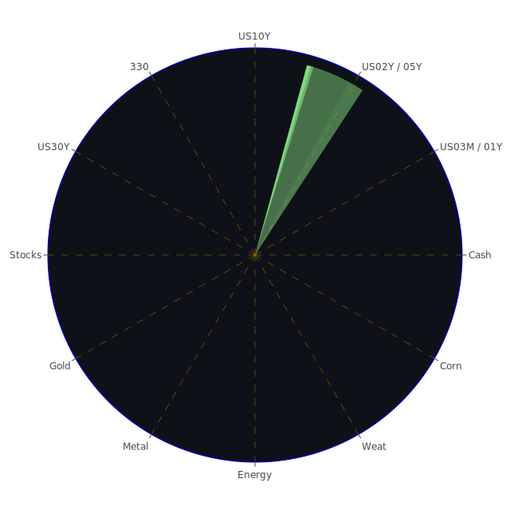

# **投資商品泡沫分析**

在當前複雜的全球經濟環境下，各類資產的估值與潛在泡沫風險成為市場參與者關注的焦點。我們將基於截至2025年6月2日的數據，對一系列主要投資商品進行深入分析，旨在客觀評估其現狀，並揭示潛在的風險與機遇。分析將融合經濟學、社會學、心理學及博弈論等多個視角，並參考近期新聞事件與歷史相似場景，力求提供一個全面且具深度的觀察。

**美國國債**

美國國債市場近期呈現微妙的動態。以十年期美國國債 (US10Y) 為例，其當前價格對應的殖利率為4.40%，泡沫指數D1為0.111389，月平均D30為0.369971，顯示短期風險相對較低，但長期累積的風險意識略高。三十年期美國國債 (US30Y) 殖利率為4.92%，D1為0.448025，D30為0.489812，泡沫感知度相對較高。較短天期的國債，如二年期 (US02Y) 殖利率3.90%，其各天期泡沫指數均為0.609932，一年期 (US01Y) 殖利率4.12%，D1為0.714714，D30為0.480516，三月期 (US03MY) 殖利率4.35%，D1為0.505821，D30為0.319636。

從經濟學角度觀察，聯準會 (FED) 的總資產持續下降，但其儲備仍處於相對高位，顯示市場流動性總體尚可，但緊縮趨勢明顯。EFFR成交量上升，顯示銀行間拆借活躍。然而，各類貸款拖欠率，特別是商業房地產、消費及一般房地產貸款的拖欠率均處於相對高位，這通常是經濟承壓的信號。殖利率曲線方面，十年期與三月期利差 (10Y-3M) 為0.05，去年同期為-1.27，倒掛現象消失，轉為輕微陡峭，歷史上這可能預示著經濟衰退風險的減退或通膨預期的變化。然而，FED近期一次鷹派發言，疊加公開市場操作賬戶 (RRP) 規模下降，暗示政策制定者對通膨的警惕未減。

新聞事件中，市場對聯準會可能維持現有利率水平的預期 (Fed set to hold rates steady despite 'as good as it gets' inflation print, positive 58%)，以及戴利認為四月PCE通膨數據令人寬慰但尚不完整的表態 (Fed's Daly: April PCE inflation is a 'relief,' but incomplete, Fox Business reports, positive 55%)，均對債券市場情緒產生影響。歷史上，在經濟轉折點或政策不確定性高的時期，國債市場常出現顯著波動。當前國債的泡沫讀數，尤其是短天期債券，反映出市場對未來利率路徑及經濟前景的博弈。心理學上，持續的負面經濟新聞（如裁員、貿易摩擦）可能推升避險情緒，對國債形成支撐，但若通膨頑固，則可能打擊債券價格。

**美國零售股**

美國零售股，如家得寶 (HD) 現價368.29，月平均泡沫指數D30為0.762209，沃爾瑪 (WMT) 現價98.72，D30為0.890272，塔吉特 (TGT) 現價94.01，D30為0.941202，好市多 (COST) 現價1040.18，D30為0.569169。整體而言，大型零售商的泡沫指數處於中高水平，尤其是沃爾瑪和塔吉特，其月平均泡沫讀數接近0.9，顯示市場對其估值存在較高疑慮。

經濟學上，消費者拖欠率處於相對高位，信用卡拖欠率雖然在100大銀行中較低，但整體消費信貸環境趨緊。這對依賴消費者支出的零售業構成挑戰。社會學角度看，持續的科技業裁員新聞 (LinkedIn cuts 281 workers in California as tech layoffs continue, negative 97%) 可能影響消費者信心和未來支出預期。Gap執行長表示貿易戰未阻礙公司轉型 (Gap CEO: The trade war has not stalled our turnaround, positive 50%)，但同時亦有Gap股價因零售商警告關稅衝擊而下跌的觀察 (Watch These Gap Price Levels as Stock Plunges After Retailer Warns of Tariff Hit, negative 84%)。這些訊息的矛盾性加劇了市場對零售業前景判斷的難度。

歷史上，零售股的表現與消費者信心、就業市場及可支配收入密切相關。在經濟下行或高通膨時期，非必需品零售受到的衝擊尤為顯著。當前情況下，高企的泡沫指數可能反映了市場對這些零售巨頭在成本上升、競爭加劇及消費者行為轉變環境下維持盈利能力的擔憂。博弈論視角下，投資者在這些高泡沫讀數的股票中，可能在賭注其品牌護城河、供應鏈管理能力以及潛在的通縮或刺激政策能帶來轉機。

**美國科技股**

美國科技股呈現分化格局。以納斯達克100指數 (NDX) 為例，現價21340.99，月平均泡沫指數D30為0.740075，處於較高水平。龍頭股如微軟 (MSFT) 現價460.36，D30為0.677777；蘋果 (AAPL) 現價200.85，D30為0.646723；谷歌 (GOOG) 現價172.85，D30為0.575543；亞馬遜 (AMZN) 現價205.01，D30為0.710755；Meta (META) 現價647.49，D30為0.874225；特斯拉 (TSLA) 現價346.46，D30為0.522423。其中Meta的泡沫指數尤為突出。

AI相關領域持續火熱，新聞提及Anthropic營收因企業對AI的需求而達到30億美元年化水平 (Anthropic hits $3 billion in annualized revenue on business demand for AI, positive 93%)，Palantir股價飆升，聯邦業務擴展 (Palantir Is Surging. The Stock Leads Nasdaq Gains So Far This Year as Federal Work Expands, positive 93%)。這反映了市場對特定科技主題的追捧，形成了“AI驅動”的投資邏輯。然而，經濟學上，高利率環境對成長型科技股的估值構成壓力。LinkedIn裁員等新聞亦提醒我們科技行業並非全面向好。

歷史上，科技股泡沫並不罕見，例如2000年的科網泡沫。當時的特徵是脫離基本面的瘋狂炒作和對“新經濟”的無限遐想。當前AI的熱潮，部分投資者擔憂是否會重蹈覆轍。心理學上，FOMO（害怕錯過）情緒在AI等熱門板塊中可能扮演重要角色。博弈論角度看，投資者在追逐高成長故事的同時，也在與市場對賭這些公司能否將技術潛力轉化為持續的盈利增長。蘋果被指為今年表現最差的Mag 7股票 (Apple is the worst-performing Mag 7 stock this year. Here's what analysts and investors say about whether you should buy the dip., negative 54%)，顯示即使是巨頭也面臨挑戰。

**美國房地產指數**

美國房地產指數如VNQ現價89.32，月平均泡沫指數D30為0.482072，IYR現價94.54，D30為0.873692，RWO現價44.53，D30為0.589241。其中IYR的泡沫指數顯著偏高，而VNQ相對溫和。

經濟數據顯示，商業房地產、消費及一般房地產貸款的拖欠率均處於相對高位。30年期固定抵押貸款利率高達6.89%，遠高於去年的2.96%，對房地產市場構成顯著壓力。從經濟學角度看，高利率環境增加了購房和融資成本，抑制了需求和投資。社會學層面，居家辦公趨勢的延續對商業房地產（尤其是辦公樓）的空置率和租金回報率產生長期影響。

歷史上，房地產市場的周期性波動顯著，且往往與金融穩定風險緊密相連。2008年的次貸危機便源於房地產泡沫的破裂。當前，雖然整體金融體系的韌性有所增強，但商業房地產的壓力不容忽視。高企的IYR泡沫指數可能反映了市場對特定房地產投資信託基金所持資產質量或其槓桿水平的擔憂。博弈論視角下，一些投資者可能在押注利率見頂回落或政府可能出台支持措施，而另一些則對持續的拖欠率上升和高昂的融資成本保持警惕。

**加密貨幣**

加密貨幣市場以比特幣 (BTCUSD) 和以太坊 (ETHUSD) 為代表。比特幣現價105655.00，月平均泡沫指數D30為0.516142。以太坊現價2538.61，D30為0.442134。狗狗幣 (DOGEUSD) 現價0.1944，D30為0.468978。整體來看，主流加密貨幣的泡沫指數處於中等水平。

經濟學上，加密貨幣作為一種新興資產類別，其價值支撐和內在邏輯仍在探索之中。其價格波動往往受到市場情緒、宏觀流動性、監管政策以及特定技術發展（如比特幣減半、以太坊升級）的影響。近期新聞中，馬斯克對狗狗幣的評論 (Elon Musk stands up another goalpost for DOGE on his way out, saying savings will come 'over time', positive 77%) 再次顯示了意見領袖對市場情緒的影響力。

歷史上，加密貨幣經歷了多次劇烈的牛熊轉換，顯示其高度投機性和波動性。心理學上，暴富神話和社群效應是吸引參與者的重要因素，同時也容易放大市場的非理性行為。博弈論角度，加密市場是典型的多方博弈場所，參與者包括長期信仰者、短期投機者、套利者以及大型機構。當前中等水平的泡沫指數，可能意味著市場在經歷了前期的劇烈波動後，情緒有所降溫，但也積聚了一定的風險，等待下一個催化劑。

**金/銀/銅**

貴金屬和工業金屬方面，黃金 (XAUUSD) 現價3311.66，月平均泡沫指數D30為0.557462；白銀 (XAGUSD) 現價33.08，D30為0.917022；銅 (COPPER) 現價4.77，D30為0.514566。白銀的泡沫指數顯著偏高，黃金和銅則處於中等偏高水平。

經濟學上，黃金通常被視為避險資產和抗通膨工具。當前全球地緣政治緊張局勢（新聞中多有提及，如加薩、俄烏相關議題）、貿易摩擦以及對主權貨幣信心的潛在擔憂，都可能為黃金提供支撐。FED數據顯示，黃金石油比率 (GOLD OIL RATIO) 為53.42，黃金銅比率 (GOLD COPPER RATIO) 為693.93，均處於歷史相對高位，反映了黃金相對於這些商品的強勢。白銀兼具貴金屬和工業屬性，其高泡沫指數可能與投機性買盤以及對其工業需求（如太陽能）的樂觀預期有關。銅作為重要的工業金屬，其價格與全球經濟增長預期密切相關。

歷史上，在經濟不確定性上升、通膨高企或金融市場動盪時期，貴金屬往往表現良好。例如1970年代的滯脹時期，黃金價格大幅上漲。心理學角度，對未來的恐懼和不安全感會驅使資金流向被認為是“硬資產”的貴金屬。博弈論中，央行購金行為、大型基金的配置策略以及散戶的投機行為共同影響著貴金屬價格。白銀的高泡沫指數尤其值得警惕，可能存在短期情緒過熱的風險。

**黃豆 / 小麥 / 玉米**

農產品方面，黃豆ETF (SOYB) 現價21.62，月平均泡沫指數D30為0.609447；小麥ETF (WEAT) 現價4.53，D30為0.414685；玉米ETF (CORN) 現價18.12，D30為0.478303。黃豆的泡沫指數相對較高，小麥和玉米則處於中等水平。

經濟學上，農產品價格受供需關係、氣候條件、地緣政治（影響貿易和供應鏈）、能源價格（影響種植成本）以及政府政策（如補貼、儲備）等多重因素影響。新聞中提及的羅馬尼亞鹽礦受洪水威脅 (Heavy floods threaten Romania's Praid salt mine, a tourism magnet, negative 95%)，雖然並非直接關聯農產品，但極端天氣事件對農業生產的潛在威脅是市場持續關注的焦點。俄烏衝突對全球糧食供應格局的影響依然存在。

歷史上，糧食危機往往與地緣政治衝突或大規模自然災害相伴相生。社會學角度，糧食安全是各國政府高度重視的問題，相關政策調整可能對市場產生顯著影響。心理學上，對糧食短缺的恐懼可能引發囤積行為和價格上漲預期。當前黃豆相對較高的泡沫指數，可能反映了市場對特定區域供應緊張或需求旺盛的預期。

**石油/ 鈾期貨UX\!**

能源市場方面，美國原油 (USOIL) 現價62.02，月平均泡沫指數D30為0.324315，處於相對較低水平。鈾期貨 (UX1\!) 現價71.70，D30為0.496143，處於中等水平。

經濟學上，原油價格受OPEC+產量政策、全球經濟增長前景、地緣政治風險（尤其在中東地區）以及美元匯率等多方面因素影響。新聞提及油價因貿易緊張及OPEC+會議不確定性而小幅下跌 (Oil Edges Down on Trade Jitters, Uncertainty Over OPEC+ Meeting, negative 95%)。FED數據中的黃金石油比率處於高位，也間接反映了當前油價的相對弱勢。鈾作為核燃料，其價格與核電發展前景、能源轉型政策以及地緣政治供應風險相關。

歷史上，石油危機曾多次對全球經濟產生巨大衝擊。當前油價泡沫指數不高，可能反映了市場對全球經濟增長放緩的擔憂以及OPEC+維持相對充足供應的預期。鈾的價格在過去幾年經歷了較大波動，能源轉型和能源安全考量為其長期需求帶來想象空間，但也面臨核安全、核廢料處理等挑戰。博弈論角度，OPEC+成員國之間的產量協調、主要消費國的戰略儲備釋放以及投機基金的倉位變動，共同塑造了能源市場的複雜格局。

**各國外匯市場**

外匯市場方面，美元日圓 (USDJPY) 現價143.72，月平均泡沫指數D30為0.767296；歐元美元 (EURUSD) 現價1.1400，D30為0.921247；澳元美元 (AUDUSD) 現價0.6400，D30為0.302573；英鎊美元 (GBPUSD) 現價1.3500，D30為0.480531。歐元美元的泡沫指數異常之高，美元日圓也處於高位。

經濟學上，匯率由兩國相對利率水平、經濟增長前景、國際收支狀況、通膨差異以及央行政策等因素決定。新聞提及美元創下2020年以來最長月度連跌紀錄 (Dollar Notches Its Longest Monthly Losing Streak Since 2020, negative 90%)，這與歐元美元極高的泡沫指數（若1.14為近期高點，則暗示強勢歐元或極弱美元已累積較大風險）形成了有趣的對照或潛在的矛盾。FED數據中，外國官方持有的美國國債及回購協議規模相對較低，而美國銀行體系中的外國相關辦事處淨應付款項處於高位，這些都可能對美元流動性和匯率產生影響。

歷史上，廣場協議等重大政策協調曾導致主要貨幣匯率的劇烈調整。當前，全球主要央行政策步調不一，可能加劇匯市波動。歐元美元高達0.978137的D1泡沫指數（基於1.13的價格）以及0.92的月平均泡沫指數，強烈暗示該貨幣對可能處於極端超買或蘊含重大反轉風險的狀態。心理學上，對某種貨幣的強烈趨勢預期可能導致羊群效應。博弈論視角，各國央行在穩定本幣匯率、控制通膨和促進經濟增長等多重目標間的權衡，以及大型跨國資本的流動，共同構成了外匯市場的複雜動態。

**各國大盤指數**

除美股外，其他主要股指方面，法國CAC40 (FCHI) 現價7740.80，月平均泡沫指數D30為0.569304；德國DAX (GDAXI) 現價24003.00，D30為0.510586；英國富時100 (FTSE) 現價8786.20，D30為0.563498；日經225 (JPN225) 現價37567.03，D30為0.840780；中國滬深300 (000300) 現價3840.23，D30為0.709785；台灣加權股價指數ETF (0050) 現價179.75，D30為0.648232。日經225和滬深300的泡沫指數相對較高。

經濟學上，各國股市表現反映了其國內經濟基本面、企業盈利前景、利率環境以及全球宏觀聯動。新聞中提及的中國稀土限制對汽車製造商的警告 (Exclusive-Car makers warn China's rare-earth curbs could halt production, negative 95%)，以及美國對華貿易協定的評論 (Stocks flat after Trump says China ‘totally violated’ trade agreement with U.S., negative 94%)，均對全球貿易和相關國家股市構成影響。英國首相斯塔默警告法拉奇的財政計劃將衝擊經濟 (UK PM Starmer warns Farage's 'fantasy' fiscal plans would crash the economy, negative 93%)，也反映了政治因素對市場的擾動。

歷史上，全球股市聯動性強，但也常因區域性因素出現分化。日經指數今年的強勢與日本經濟走出通縮、企業治理改革等因素有關，但其高泡沫指數也提示了回調風險。滬深300指數的泡沫指數則可能反映了市場對中國經濟復甦力度和政策支持的複雜預期。心理學上，投資者情緒的區域性差異，以及對特定市場的樂觀或悲觀預期，會影響資金流向。博弈論角度，國際資本在不同市場間的配置，以及各國國內投資者的行為，共同決定了股指的表現。

**美國半導體股**

美國半導體股是科技板塊中的焦點。英偉達 (NVDA) 現價135.13，月平均泡沫指數D30為0.662017；超微半導體 (AMD) 現價110.73，D30為0.658513；英特爾 (INTC) 現價19.55，D30為0.547461；高通 (QCOM) 現價145.20，D30為0.840123；博通 (AVGO) 現價242.07，D30為0.798688；美光 (MU) 現價94.46，D30為0.313279；應用材料 (AMAT) 現價156.75，D30為0.602406；科磊 (KLAC) 現價756.88，D30為0.541371；台積電ADR (TSM) 現價193.32，D30為0.968381。高通、博通和台積電ADR的泡沫指數尤為突出，美光則相對較低。

經濟學上，半導體行業具有強周期性和高資本開支的特點。AI的爆發式增長為圖形處理器 (GPU) 和相關芯片帶來巨大需求，是英偉達等公司估值高企的主要原因。然而，中國對稀土出口的潛在限制，可能對半導體供應鏈構成威脅。新聞提及英偉達股價因特朗普涉華貿易言論下跌 (Nvidia stock falls as Trump says China 'violated' trade deal with US, negative 91%)，也凸顯了地緣政治對該行業的影響。

歷史上，半導體行業經歷過多次供需失衡和技術迭代引發的景氣周期。當前AI芯片的熱潮，部分觀點認為其需求具有長期性和結構性，但也有觀點擔憂短期供給過剩或需求不及預期的風險。台積電ADR極高的泡沫指數，反映了市場對其行業龍頭地位和先進製程技術的高度認可，但也蘊含了估值過高的風險。心理學上，對技術革命的樂觀預期容易推高相關股票估值。博弈論中，各大芯片設計和製造商在技術路線、產能擴張和市場份額上的競爭異常激烈。

**美國銀行股**

美國銀行股方面，摩根大通 (JPM) 現價264.00，月平均泡沫指數D30為0.779129；美國銀行 (BAC) 現價44.13，D30為0.949045；花旗集團 (C) 現價75.32，D30為0.880954；第一資本 (COF) 現價189.15，D30為0.499049。美國銀行和花旗集團的泡沫指數顯著偏高，摩根大通也處於高位。

經濟學上，銀行股的表現與利率環境、信貸質量、經濟增長和監管政策密切相關。FED數據顯示，商業房地產、消費及一般房地產貸款的拖欠率均處於相對高位，這對銀行資產質量構成潛在威脅。雖然信用卡撇帳率在百大銀行中尚低，但整體信貸環境的惡化不容忽視。另一方面，美國銀行總存款量處於相對高位，顯示銀行體系流動性尚可。新聞提及匯豐銀行將關閉其美國商業銀行業務以簡化運營 (HSBC to close its US business banking unit to simplify operations, negative 66%)，反映了部分銀行在當前環境下的戰略調整。

歷史上，銀行業危機往往對經濟產生系統性影響。當前，雖然尚未出現系統性危機的明確信號，但持續的貸款拖欠率上升和部分銀行的壓力（如此前區域性銀行事件），使得市場對銀行股的風險評估更為謹慎。美國銀行和花旗集團的高泡沫指數，可能反映了市場對其在複雜環境下維持盈利能力和風險控制的擔憂，或是對其估值與基本面之間差距的警示。

**美國軍工股**

美國軍工股方面，洛克希德馬丁 (LMT) 現價482.38，月平均泡沫指數D30為0.675491；雷神技術 (RTX) 現價136.48，D30為0.854018；諾斯洛普格魯曼 (NOC) 現價484.77，D30為0.679029；波音 (BA) 現價207.32，D30為0.326328。雷神技術的泡沫指數相對較高，波音則因自身問題泡沫指數不高但基本面臨挑戰。

經濟學上，軍工股的表現與國防預算、地緣政治緊張局勢以及國際軍售訂單密切相關。當前全球多點地緣衝突（新聞中以色列與加薩、俄烏等均有體現），以及大國競爭態勢，為軍工行業帶來了持續的訂單預期。新聞中以色列政府反擊國際社會對加薩問題的壓力 (Israeli government hits back as international pressure over Gaza mounts, negative 85%)，俄羅斯軍方人士在國內爆炸中身亡 (Russian military figure killed in explosion inside the country, authorities say, negative 87%)，均反映了持續緊張的國際局勢。

歷史上，戰爭和軍備競賽時期往往是軍工股的黃金時代。然而，軍工行業也面臨政治風險、技術變革以及和平紅利時期的需求下降等挑戰。雷神技術的高泡沫指數，可能反映了市場對其在當前地緣政治格局下受益的強烈預期，但也需警惕預期過高或地緣局勢緩和帶來的估值回調風險。波音的問題更多是公司內部管理和產品質量，其股價表現與行業整體趨勢有所偏離。

**美國電子支付股**

美國電子支付股方面，Visa (V) 現價365.19，月平均泡沫指數D30為0.804131；萬事達卡 (MA) 現價585.60，D30為0.830837；美國運通 (AXP) 現價294.05，D30為0.867206；PayPal (PYPL) 現價70.28，D30為0.650998；Global Payments (GPN) 現價75.61，D30為0.301365。Visa、萬事達卡和美國運通的泡沫指數均處於高位。

經濟學上，電子支付行業受益於現金使用減少和電子商務的持續增長。其商業模式通常具有網絡效應和規模經濟，盈利能力較強。然而，該行業也面臨日益激烈的競爭（來自金融科技初創企業）、監管審查加強以及宏觀經濟波動（影響消費支出）等挑戰。消費者拖欠率上升的FED數據，可能對支付處理量和壞賬風險產生負面影響。

歷史上，支付行業的創新（如信用卡、移動支付）不斷推動行業格局演變。當前高企的泡沫指數，可能反映了市場對這些支付巨頭持續增長和盈利能力的樂觀預期，但也可能包含了對其市場主導地位面臨挑戰的擔憂。PayPal相對較低的泡沫指數可能與其近期業績壓力及轉型挑戰有關。GPN的泡沫指數則處於相對低位。

**美國藥商股**

美國大型藥商股方面，嬌生 (JNJ) 現價155.21，月平均泡沫指數D30為0.218491；默克 (MRK) 現價76.84，D30為0.462293；禮來 (LLY) 現價737.67，D30為0.933687；艾伯維 (ABBV) 現價186.11，D30為0.638192；諾和諾德 (NVO) 現價71.50（此處價格可能需確認，若為ADR，則需注意與丹麥股價的轉換），D30為0.548298。禮來的泡沫指數極高，嬌生則非常低。

經濟學上，醫藥行業具有需求剛性、研發周期長、高投入高風險高回報以及嚴格監管的特點。減肥藥等重磅新藥的推出，為禮來和諾和諾德等公司帶來了巨大的市場想象空間和業績增長，是其估值高企的主要原因。新聞提及Hims削減勞動力以應對減肥藥仿製品禁令 (Hims to cut 4% of workforce amid ban on weight-loss drug copies, negative 94%)，也從側面反映了減肥藥市場的熱度和競爭。

歷史上，新藥研發的成功與否、專利懸崖以及藥品定價政策是影響藥企股價的關鍵因素。禮來極高的泡沫指數，反映了市場對其GLP-1類藥物前景的極度樂觀預期，但也蘊含了藥效不及預期、競爭加劇或醫保支付壓力等潛在風險。嬌生相對較低的泡沫指數，可能與其業務多元化、訴訟風險以及近期增長相對平穩有關。

**美國影視股**

美國影視股方面，奈飛 (NFLX) 現價1207.23，月平均泡沫指數D30為0.479358；派拉蒙全球 (PARA) 現價12.10，D30為0.469330；迪士尼 (DIS) 現價113.04，D30為0.757478。迪士尼的泡沫指數相對較高。

經濟學上，影視行業面臨流媒體競爭白熱化、內容成本不斷上升、廣告市場波動以及消費者娛樂方式多樣化等挑戰。盈利模式從傳統的院線、有線電視轉向訂閱和廣告支持的流媒體，對各大公司的戰略和執行力提出了考驗。

歷史上，技術變革（如電視的出現、互聯網的普及）不斷重塑影視行業格局。當前，AI技術在內容創作、個性化推薦等方面的應用，可能為行業帶來新的機遇和挑戰。迪士尼相對較高的泡沫指數，可能反映了市場對其強大IP庫、主題公園業務復甦以及流媒體業務最終實現盈利的預期，但也需關注其在內容投入和競爭壓力下的盈利能力。

**美國媒體股**

美國媒體股方面，康卡斯特 (CMCSA) 現價34.57，月平均泡沫指數D30為0.436000；福克斯 (FOX) 現價50.28，D30為0.830390；紐約時報 (NYT) 現價57.12，D30為0.754209。福克斯和紐約時報的泡沫指數處於高位。

經濟學上，媒體行業受到廣告市場景氣度、用戶付費意願、內容質量以及新技術（如AI生成內容）的影響。傳統媒體面臨數字化轉型的壓力，而數字媒體則需應對信息爆炸和用戶注意力稀缺的挑戰。新聞提及Voice of America員工預計本週收到解僱通知 (Termination notices for remaining Voice of America employees expected this week, Politico reports, negative 94%)，反映了部分媒體機構的困境。

歷史上，媒體行業的公信力和影響力是其核心價值所在。在信息真偽難辨的時代，提供高質量、可信賴內容的媒體機構仍具競爭力。福克斯和紐約時報的高泡沫指數，可能反映了市場對其在特定受眾群體中的影響力、以及在數字化轉型和多元化經營方面取得進展的認可，但也需警惕政治極化、廣告收入波動等風險。

**石油防禦股**

石油防禦股，如埃克森美孚 (XOM) 現價102.30，月平均泡沫指數D30為0.801770；西方石油 (OXY) 現價40.78，D30為0.719531。兩者的泡沫指數均處於較高水平。

經濟學上，大型綜合石油公司的股價與原油價格、煉油利潤、化工產品景氣度以及公司的資本開支和股東回報政策相關。在油價相對穩定或上行時期，這些公司通常能產生強勁的現金流。然而，其也面臨能源轉型帶來的長期挑戰和ESG投資理念的壓力。儘管美國原油 (USOIL) 的泡沫指數不高，但這些石油巨頭的泡沫指數卻相對較高，這可能反映了市場對其穩定派息、股票回購以及在傳統能源領域的持續盈利能力的信心，或者也包含了對其轉型速度和成效的溢價。

歷史上，石油巨頭經歷了多次行業周期和地緣政治衝擊。當前，它們在保障傳統能源供應和投資新能源技術之間尋求平衡。高泡沫指數提示，若油價大幅下跌或能源轉型進程超預期，其估值可能面臨壓力。

**金礦防禦股**

金礦防禦股，如皇家黃金 (RGLD) 現價178.12，月平均泡沫指數D30為0.922728，泡沫指數極高。

經濟學上，金礦股的股價與黃金價格、開採成本、儲量情況以及公司的經營效率密切相關。通常情況下，金礦股的股價彈性大於黃金本身，即金價上漲時，金礦股漲幅更大，反之亦然。皇家黃金作為一家貴金屬權利金公司，其商業模式相對獨特，不直接參與礦山運營，而是通過收取權利金獲得收入，這使其在一定程度上規避了運營風險，但其股價仍高度依賴黃金等貴金屬價格。

歷史上，在金價牛市中，金礦股往往有突出表現。當前黃金價格處於歷史高位附近，RGLD極高的泡沫指數，反映了市場對金價持續強勢以及該公司盈利能力的極度樂觀預期。然而，這也意味著一旦金價回調或公司業績不及預期，其股價可能面臨較大下行風險。

**歐洲奢侈品股**

歐洲奢侈品股方面，LVMH (MC) 現價478.25，月平均泡沫指數D30為0.527891；開雲集團 (KER) 現價172.36，D30為0.868753；愛馬仕 (RMS) 現價2428.00，D30為0.613880。開雲集團的泡沫指數顯著偏高，LVMH和愛馬仕則處於中等偏高水平。

經濟學上，奢侈品行業的需求與全球高淨值人群的財富效應、消費者信心以及特定市場（如中國、美國）的經濟表現密切相關。該行業具有強品牌壁壘和定價能力。新聞提及德意志銀行看好拉夫勞倫股價 (Deutsche Bank Goes Bullish on Luxury Brand Ralph Lauren's Stock, negative 89% \- 此處情緒標記為負面可能指消息本身對市場其他奢侈品牌的競爭壓力，或數據標註本身的特殊性)，間接反映了市場對奢侈品行業的持續關注。

歷史上，奢侈品行業展現出較強的抗周期性，但在嚴重經濟衰退時期也難免受到衝擊。開雲集團的高泡沫指數，可能與旗下品牌（如Gucci）的轉型挑戰和市場對其未來增長路徑的擔憂或過高預期有關。LVMH和愛馬仕相對穩健的泡沫指數，反映了其更強的品牌力和市場地位。

**歐洲汽車股**

歐洲汽車股方面，寶馬 (BMW) 現價78.10，月平均泡沫指數D30為0.547208；賓士 (MBG) 現價52.59，D30為0.495204；保時捷 (PAH3) 現價35.10，D30為0.638827。保時捷的泡沫指數相對較高。

經濟學上，汽車行業是資本密集型和技術密集型產業，正經歷向電動化、智能化轉型的深刻變革。傳統汽車製造商面臨來自特斯拉以及中國電動汽車企業的激烈競爭。新聞中提及汽車製造商警告中國稀土限制可能導致停產，對歐洲汽車股構成直接利空。

歷史上，汽車行業的技術變革（如內燃機的普及、流水線生產）曾帶來行業的巨大飛躍。當前，電動化轉型帶來了新的機遇，但也伴隨著巨大的投資壓力和不確定性。保時捷相對較高的泡沫指數，可能反映了市場對其在高端市場的品牌吸引力和盈利能力的認可，但也需關注其在電動化轉型中的進展和挑戰。

**歐美食品股**

歐美食品股方面，雀巢 (NESN) 現價87.70，月平均泡沫指數D30為0.561660；可口可樂 (KO) 現價72.10，D30為0.627233；麥當勞 (MCD) 現價313.85，D30為0.699489；卡夫亨氏 (KHC) 現價26.73，D30為0.717437；聯合利華 (ULVR) 現價4707.00，D30為0.944456。聯合利華的泡沫指數極高，其他個股也處於中高水平。

經濟學上，食品飲料行業通常被視為防禦性行業，需求相對穩定。然而，它們也面臨原材料成本波動、消費者偏好轉變（如對健康、可持續產品的需求增加）、零售渠道變革以及日益激烈的品牌競爭。

歷史上，大型食品飲料公司通過品牌建設、渠道控制和併購整合實現了長期增長。當前，聯合利華極高的泡沫指數值得警惕，可能反映了市場對其近期業績改善或特定業務分拆的過高預期，或者也存在其他非基本面因素的擾動。其他食品股的泡沫指數也處於不低水平，提示投資者關注其在成本壓力和消費趨勢變化下的盈利前景。

# **宏觀經濟傳導路徑分析**

當前宏觀經濟環境呈現多重矛盾疊加的複雜局面。FED總資產下降與高儲備並存，顯示緊縮政策仍在推進，但市場流動性尚未枯竭。然而，一個關鍵的傳導路徑始於持續高位的各類貸款拖欠率。商業地產、消費信貸及一般房地產的壓力，正通過金融系統向實體經濟滲透。高拖欠率首先衝擊銀行業的資產負債表和盈利能力（美國銀行、花旗泡沫指數高企），進而可能導致信貸標準收緊，這將進一步抑制企業投資和個人消費，尤其對依賴融資的行業（如房地產、汽車）構成壓力。

新聞中頻繁提及的貿易摩擦與地緣政治緊張局勢（如中美貿易、稀土管制、俄烏衝突、中東局勢），構成了另一條重要的宏觀傳導路徑。這些因素首先通過影響供應鏈穩定性（如稀土之於汽車、半導體），推高特定商品成本，加劇通膨壓力或抑制產出。其次，不確定性增加會打擊企業信心，延緩投資決策。再者，避險情緒升溫，資金可能流向黃金、美元等傳統避險資產，推高其價格（黃金、白銀泡沫指數偏高），同時對風險資產（如新興市場股市、高估值科技股）造成壓力。特朗普關於大幅提高鋼鐵關稅的言論，雖對特定國內產業短期利好，但長期看可能加劇全球貿易保護主義，推高整體物價，損害全球經濟效率。

FED的鷹派立場與市場對未來政策路徑的博弈，是第三條核心傳導路徑。目前CPI年增率2.33%尚屬溫和，但FED對通膨的警惕未消。若通膨因供應鏈問題或薪資壓力再度抬頭，FED可能被迫採取更激進的緊縮措施，這將通過提高借貸成本、壓低資產估值（尤其是長久期資產如科技股、高估值成長股）的方式傳導至整個經濟體。相反，若經濟數據迅速惡化，FED也可能轉向寬鬆，但目前看此機率較低。殖利率曲線的形態變化（10Y-3M轉正）傳統上被視為衰退風險緩和的信號，但在此輪獨特的經濟週期中，其指示意義可能需要更審慎的解讀。高盛石油比率與高盛銅比率均處於歷史高位，暗示市場對避險資產的偏好以及對全球工業活動前景的相對悲觀。

# **微觀經濟傳導路徑分析**

在微觀層面，企業的行為和特定行業的動態也揭示了經濟力量的傳導。科技行業的AI熱潮與裁員並存，便是一個顯著案例。Anthropic和Palantir等AI公司的強勁增長，帶動了相關芯片（NVDA、TSM泡沫指數高企）和軟件服務的需求，資金追捧形成正反饋。然而，LinkedIn等公司的裁員，則顯示了科技行業其他領域或整體盈利壓力下的成本控制需求。這種“K型”分化會通過就業市場傳導：AI相關高技能人才需求旺盛，而傳統科技崗位可能面臨壓力，進而影響整體薪資增長和消費能力。

供應鏈的脆弱性在稀土問題上再次凸顯。中國若限制稀土出口，將直接衝擊依賴稀土的下游產業，如汽車製造（尤其是電動車電機）和半導體。這會導致相關企業生產成本上升、產量下降，最終可能傳導至消費者，推高終端產品價格，或迫使企業尋找替代供應源，進行供應鏈重構。這對歐洲汽車股（MBG、BMW、PAH3）和全球半導體企業（QCOM、AVGO等泡沫指數高企者尤其脆弱）構成直接威脅。

企業的定價能力和成本轉嫁能力是另一條重要的微觀傳導路徑。在通膨背景下，如奢侈品（LVMH、Hermes）、部分食品飲料龍頭（可口可樂、雀巢）因其強大的品牌護城河，能將部分成本上漲轉嫁給消費者，維持利潤率。然而，競爭激烈的行業或品牌力較弱的企業，則可能面臨利潤空間被擠壓的困境。觀察零售股（WMT、TGT泡沫指數高）和歐美食品股（ULVR泡沫指數極高）的泡沫讀數，可以發現市場對這些企業在成本壓力下維持業績的預期存在分歧。

# **資產類別間傳導路徑分析**

資產類別間的價格傳導與相互影響是理解市場整體動態的關鍵。美國國債殖利率的變動是重要的起點。當前10年期美債殖利率在4.4%左右，若其因通膨預期或FED鷹派立場而上升，將對多個資產類別產生負面傳導：首先，高估值的成長型股票（如科技股NDX、半導體股）的貼現率將上升，理論估值下降；其次，固定收益資產的吸引力相對提升，可能導致資金從股市流向債市；再者，美元可能因利差擴大而走強（USDJPY泡沫指數已高），進一步壓制以美元計價的商品價格（如黃金XAUUSD、原油USOIL），並對新興市場貨幣和資產構成壓力。

黃金與美元通常呈現負相關關係，但當地緣政治風險極高或對法定貨幣體系信心動搖時，兩者可能同漲。當前黃金價格堅挺（XAUUSD泡沫指數中高），部分反映了避險需求。若美元因美國經濟相對強韌或避險資金流入而持續走強，理論上不利黃金；但若市場焦點轉向全球地緣政治不確定性或通膨失控風險，黃金仍可能受追捧。白銀（XAGUSD泡沫指數極高）兼具貴金屬和工業屬性，其價格除了受黃金帶動，還受工業需求（特別是綠色能源相關）預期的影響，其高泡沫指數可能已包含了對這兩方面因素的樂觀預期。

原油價格（USOIL泡沫指數相對較低）的波動直接影響通膨預期和實體經濟成本。油價上漲會推高運輸和生產成本，加劇通膨壓力，對除能源股（XOM、OXY泡沫指數高）外的多數行業不利。反之，油價下跌有助於緩解通膨，但若因需求疲軟導致，則可能是經濟下行的信號。加密貨幣（BTCUSD、ETHUSD泡沫指數中等）近年來與高風險科技股的相關性有所提升，在市場風險偏好較高、流動性充裕時表現較好。若宏觀環境趨緊，避險情緒升溫，加密貨幣可能與科技股一同承壓。

房地產市場（VNQ、IYR）與利率水平和信貸環境高度相關。利率上升會增加購房成本，打擊房地產價格。商業房地產的困境可能通過銀行系統（影響其貸款損失準備和放貸意願）傳導至更廣泛的經濟領域。高收益債券利率（FED數據顯示處於相對低位，這與高拖欠率似乎矛盾，可能反映市場對高收益債違約風險定價不足或尋求高票息）的變化，也會影響企業融資成本和投資者對風險的態度。

# **投資建議**

基於上述分析，我們在當前市場環境下，提出以下穩健、成長與高風險三種配置方案。請注意，所有比例均為建議，投資者應根據自身風險承受能力進行調整。

**一、 穩健型投資組合 (總計100%)**

此組合旨在保本增值，追求較低波動和穩定現金流。

1. **短期美國國債 (US03MY / US01Y) \- 40%**: 鑒於FED短期內維持緊縮政策的可能性較大，短期國債能提供相對穩定的票息收入，且流動性好，泡沫指數相對可控（US03MY D30為0.319636，US01Y D30為0.480516）。  
2. **優質大型藥商股 (JNJ) \- 35%**: 嬌生公司業務多元，需求剛性，股息穩定，且當前泡沫指數極低（D30為0.218491），具有較好的防禦性和估值安全邊際。  
3. **黃金 (XAUUSD) \- 25%**: 在地緣政治不確定性及潛在通膨風險下，黃金仍是重要的避險工具。當前泡沫指數中等偏高（D30為0.557462），可作為對沖尾部風險的配置。

**二、 成長型投資組合 (總計100%)**

此組合旨在平衡風險與收益，捕捉結構性增長機會。

1. **美國科技龍頭股 (MSFT / GOOG) \- 35%**: 雖然整體科技股估值不低，但微軟（D30為0.677777）和谷歌（D30為0.575543）在AI領域佈局領先，擁有強大護城河和現金流產生能力，是長期增長的核心標的。可考慮分批介入或選擇泡沫讀數相對更合理的個股。  
2. **全球半導體龍頭 (TSM / MU) \- 35%**: 台積電ADR（D30為0.968381）泡沫指數雖高，但其行業地位難以撼動。美光（D30為0.313279）泡沫指數相對健康，受益於存儲芯片周期反轉。投資者可根據風險偏好選擇，或以ETF形式分散。  
3. **銅 (COPPER) \- 30%**: 作為重要的工業金屬，銅在能源轉型和全球經濟復甦（若出現）中將持續受益。當前泡沫指數中等（D30為0.514566），具備一定的增長潛力。

**三、 高風險型投資組合 (總計100%)**

此組合旨在追求高回報，適合風險承受能力較強的投資者。

1. **AI概念股 (NVDA) \- 40%**: 英偉達（D30為0.662017）作為AI浪潮的核心受益者，儘管泡沫指數不低，但其技術領先地位和市場需求短期內難以改變，仍具備較高彈性。  
2. **主流加密貨幣 (BTCUSD / ETHUSD) \- 30%**: 比特幣（D30為0.516142）和以太坊（D30為0.442134）作為市值最大的加密貨幣，在市場情緒回暖時可能會有較大漲幅，但波動性極高。  
3. **高泡沫指數日經ETF或個股 (JPN225相關) \- 30%**: 日經225指數（D30為0.840780）今年表現強勁，若日本經濟持續復甦且資金持續流入，仍有上行空間，但需警惕高位回調風險。

# **風險提示**

投資有風險，市場總是充滿不確定性。本報告所有分析均基於當前獲取之數據及對市場的理解，不構成任何投資邀約或最終操作建議。歷史數據和分析不能完全預示未來表現。各類資產的泡沫指數是動態變化的，反映了市場情緒和風險認知，高泡沫指數本身即是重要的風險警示。投資者應在充分理解相關風險的前提下，結合自身的財務狀況、風險承受能力和投資目標，獨立做出審慎的投資決策，並在必要時尋求專業財務顧問的意見。市場波動可能導致本金損失。

 
Daily Buy Map:

 
Daily Sell Map:

 
Daily Radar Chart:

 
