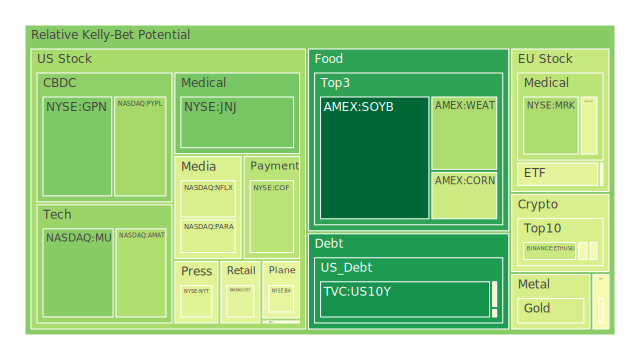
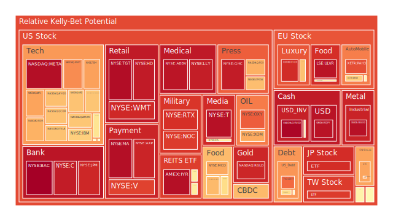

好的，這是一份根據您提供的資料與指示所撰寫的市場分析報告。

# **投資商品泡沫分析**

當前全球金融市場正處於一個資訊爆炸且快速變化的時代，各種資產類別在經濟數據、地緣政治及市場情緒的多重影響下，展現出複雜的價格動態與潛在風險。本報告旨在客觀分析各類主要投資商品的現狀，並探討其潛在的泡沫風險。

**美國國債**

美國國債市場作為全球金融的基石，其殖利率的波動深刻影響著所有資產的定價。從近期數據觀察，美國各年期國債的泡沫指數呈現分化。例如，10年期美國國債 (US10Y) 在2025年6月3日的當日泡沫指數 (D1) 為0.100836，相較於6月1日的0.109521有所下降，顯示短期風險略有緩和。然而，觀察更長期的30日平均泡沫指數 (D30) 為0.357986，仍處於一定水平。其他年期如3個月期 (US03MY) 的D1為0.487905，1年期 (US01Y) D1高達0.804780，2年期 (US02Y) 的各期泡沫指數均為0.609932，顯示短期國債市場存在較高的風險警示。

從經濟學角度看，聯準會的資產負債表規模下降、逆回購操作 (RRP) 金額減少，以及近期一次鷹派的官員發言，都對債券市場構成壓力。新聞中提及的「美國GDP下滑」及「勞動力市場狀況劣於表面」可能增加市場對經濟衰退的擔憂，這在傳統上會推升避險需求，對長債有利。然而，同時「HELOC利率因通膨降溫而下降」與「抵押貸款利率下降」又暗示通膨壓力可能趨緩，這對債券是正面消息。目前CPI年增率為2.33%，遠低於去年的3.33%，但聯準會似乎仍保持謹慎。美國公眾持有的債務佔GDP比重處於高位，外國機構持有的美國國債流通量則處於相對低位，這反映了全球資金流動的微妙變化。收益率曲線上，例如10年期與3個月期利差 (US Yield 10Y-03M) 為0.10，雖仍為正，但已從去年的深度倒掛中恢復，市場對短期衰退的極度恐慌有所緩解，但長期隱憂仍在。從歷史視角看，快速的利率調整週期後，市場通常需要時間來消化和重新定價風險。心理層面，對通膨是否持續降溫以及聯準會政策路徑的不確定性，主導著市場情緒。

**美國零售股**

美國零售股如好市多 (COST)、沃爾瑪 (WMT)、目標百貨 (TGT) 和家得寶 (HD) 的泡沫指數普遍偏高。以沃爾瑪為例，其D1泡沫指數從6月1日的0.895272微升至6月3日的0.913016，D30指數高達0.890426，顯示持續的泡沫積累。好市多D1雖從0.436725降至0.434090，但其價格PP100為1056.85，遠高於PP80的1053.09，且D30為0.561381。家得寶HD的D1從0.895129上升至0.940168，D30為0.770805。目標百貨TGT的D1為0.969536，D30高達0.941268，風險警示強烈。

經濟數據中，消費者拖欠款項處於相對高位，這對零售業績構成潛在威脅。新聞中「勞動力市場狀況劣於表面」可能影響消費者信心和支出能力。「聯合航空執行長稱廉價航空模式已死」雖非直接零售新聞，但也反映出企業對成本和消費者承受能力的擔憂。從社會學角度，消費習慣的改變、線上與實體零售的持續競爭，以及貧富差距對消費結構的影響，都是零售股必須面對的長期課題。心理層面上，品牌忠誠度、促銷活動的吸引力以及對經濟前景的預期，共同塑造了零售股的市場表現。博弈論觀點則體現在各大零售商之間的定價策略與市場份額競爭。

**美國科技股**

美國科技股呈現顯著的泡沫化傾向，尤其是半導體相關股票。輝達 (NVDA) 的D1泡沫指數從6月1日0.353883升至6月3日的0.507099，D30高達0.666841，其執行長黃仁勳看好汽車業務為數兆美元機遇的消息，無疑為股價火上澆油。蘋果 (AAPL) D1從0.722453微降至0.716275，D30為0.654378；微軟 (MSFT) D1從0.752117微升至0.752766，D30為0.686621；亞馬遜 (AMZN) D1從0.655611降至0.654358，但D30高達0.710830；谷歌 (GOOG) D1從0.510888大幅上升至0.655711；Meta (META) D1從0.956829升至0.965335，D30為0.874370；特斯拉 (TSLA) D1從0.543789升至0.662116。整體納斯達克100指數 (NDX) 的D1為0.693627，D30高達0.739935。

新聞中「AI正在顛覆就業市場，即使在AI公司也是如此」以及「NAACP呼籲孟菲斯官員停止xAI的『骯髒數據中心』運營」揭示了AI發展背後的社會與倫理爭議，可能為行業帶來監管風險。川普的貿易戰對蘋果等公司造成影響，也波及401(k)帳戶，顯示地緣政治對科技股的殺傷力。從經濟學角度，科技股對利率變動極為敏感，聯準會的鷹派立場構成壓力。然而，AI的革命性前景吸引大量資金湧入，形成典型的成長型投資與泡沫風險並存的局面。歷史上，科網泡沫的破裂提供了前車之鑑。心理層面，「害怕錯過」(FOMO)情緒在AI相關股票中尤為明顯。博弈論視角下，各大科技巨頭在AI領域的軍備競賽，既推動創新，也累積了巨大的投資風險。

**美國房地產指數**

美國房地產指數如VNQ、IYR、RWO的泡沫指數也處於中高水平。VNQ的D1從6月1日的0.562226微升至6月3日的0.563425，IYR的D1則從0.963730微降至0.962954，但其D30仍高達0.886256，風險顯著。RWO的D1從0.623615降至0.563843。

聯準會經濟數據顯示，商業房地產拖欠款項和房地產拖欠款項均處於相對高位。新聞中「HELOC利率因通膨降溫而下降」和「抵押貸款和再融資利率下降，15年期利率重回6%以下」對房地產市場而言是正面消息，有助於降低購房成本。然而，30年期固定抵押貸款利率仍高達6.89%，遠高於去年的2.96%，對市場的壓力依然存在。從歷史上看，房地產市場受利率、就業及信貸環境綜合影響，具有明顯的週期性。社會學上，居家辦公趨勢對商業地產的長期影響，以及住房可負擔性問題，都是重要的考量因素。

**加密貨幣**

比特幣 (BTCUSD) 的D1泡沫指數從6月1日的0.485759微降至6月3日的0.478199，其價格PP100為105828，波動劇烈。以太坊 (ETHUSD) D1則從0.341160上升至0.379469。狗狗幣 (DOGEUSD) D1從0.557903降至0.474850，馬斯克關於狗狗幣的言論仍能引發市場波動。

新聞中「SEC對提供質押獎勵的加密貨幣ETF表示擔憂」反映了監管趨嚴的態勢，這對加密貨幣市場構成潛在利空。加密貨幣市場本身高度波動，其價值很大程度上依賴市場信心和流動性。從心理學角度，投機情緒和對未來技術的信仰是主要驅動力。博弈論在加密貨幣市場中體現為早期採用者的巨大回報與後期進入者的高風險。其去中心化的特性使其在某些情境下被視為避險資產，但同時也因缺乏內在價值支撐和監管不確定性而風險極高。

**金/銀/銅**

黃金 (XAUUSD) 的D1泡沫指數從6月1日的0.403857微降至6月3日的0.402828，價格PP100高達3385.12，D30為0.558648。白銀 (XAGUSD) 的D1從0.946528升至0.959695，D30為0.922621，泡沫風險極高。銅 (FX:COPPER) D1從0.502259升至0.542171。黃金石油比率 (GOLD OIL RATIO) 為53.71，黃金銅比率 (GOLD COPPER RATIO) 為698.93，均處於相對高位，暗示黃金相對於這些工業商品更為強勢，可能反映了避險情緒或對工業需求前景的擔憂。

新聞中地緣政治緊張，如「美國呼籲亞洲盟友加強國防以應對中國的『迫在眉睫』的威脅」，「以色列接受美國新的與哈馬斯停火提議」，以及「印度軍方承認在與巴基斯坦的衝突中損失戰機」，通常會提升黃金等避險資產的吸引力。經濟學上，黃金是對沖通膨和貨幣貶值的傳統工具。當前實際利率水平、美元強弱以及央行購金行為都會影響金價。白銀兼具貴金屬和工業金屬屬性，其價格波動通常大於黃金。銅價則與全球工業活動和經濟增長預期密切相關。

**黃豆 / 小麥 / 玉米**

農產品方面，黃豆 (SOYB) 的D1泡沫指數從6月1日的0.040711大幅降至6月3日的0.013736，顯示短期風險降低，D30為0.578353。小麥 (WEAT) D1從0.321921微降至0.321172。玉米 (CORN) D1則從0.423725降至0.382677。

新聞中「鋼鐵關稅飆升可能危及川普降低食品雜貨價格的承諾」，間接暗示了農產品價格可能面臨的成本壓力。農產品價格受天氣、地緣政治（影響出口）、能源成本（影響種植和運輸成本）以及全球供需基本面等多重因素影響。從社會學角度，糧食安全是各國政府高度重視的問題。心理層面，對未來供應短缺的擔憂可能引發囤積行為，推高價格。

**石油/ 鈾期貨UX\!**

美國原油 (USOIL) 的D1泡沫指數從6月1日的0.534628微降至6月3日的0.532240，D30為0.340786。鈾期貨 (UX1\!) D1從0.510716微降至0.510716（數據無變化），D30為0.496143。

新聞方面，「敘利亞和沙烏地阿拉伯同意在西方制裁放寬後加強經濟合作」可能對中東地區的石油供應產生影響。「川普緊急命令阻止第二座發電廠關閉」可能與能源政策及電力結構有關，間接影響鈾等核燃料需求。石油價格受OPEC+政策、全球經濟增長（影響需求）、地緣政治風險（影響供應）以及美元匯率等多重因素影響。鈾作為核燃料，其價格與核電發展政策、全球能源轉型趨勢以及地緣政治穩定性相關。

**各國外匯市場**

美元兌日圓 (USDJPY) 的D1泡沫指數從6月1日的0.467374飆升至6月3日的0.956804，D30為0.778507，風險極高，顯示日圓持續弱勢或美元極度強勢。歐元兌美元 (EURUSD) D1從0.978137微升至0.982259，D30為0.926041，同樣處於高風險區域。英鎊兌美元 (GBPUSD) D1從0.589355降至0.570489。澳元兌美元 (AUDUSD) D1從0.421546升至0.477164。

外匯市場的波動反映了各國經濟基本面、利率政策差異以及國際資本流動。聯準會的鷹派立場和相對強勁的美國經濟數據（儘管近期GDP有所下滑）支撐了美元強勢。日本央行持續的寬鬆政策導致日圓疲軟。歐洲央行和英國央行的政策走向也深刻影響歐元和英鎊。從博弈論角度，各國央行在制定貨幣政策時，既要考慮本國經濟狀況，也要預判其他主要央行的行動及其對本國貨幣的影響。

**各國大盤指數**

除美國納斯達克100指數外，日本日經225指數 (JPN225) 的D1泡沫指數從6月1日的0.886818升至6月3日的0.904296，D30為0.847513。中國滬深300指數 (000300) D1從0.714622微升至0.714715。法國CAC40指數 (FCHI) D1從0.451302降至0.437416。德國DAX指數 (GDAXI) D1從0.471096升至0.501870。英國富時100指數 (FTSE) D1從0.519181升至0.544312。台灣加權股價指數 (0050) D1從0.905473降至0.879796，但D30仍有0.655655。

各國股市表現反映了其國內經濟狀況、企業盈利前景以及全球宏觀環境的影響。新聞中「中國五月工廠活動萎縮，但有改善跡象」和「歐盟委員會對美國宣布提高鋼鐵關稅表示『強烈』遺憾」都對相關市場產生影響。「南韓總統候選人誓言改變，提前投票人數創紀錄」等政治事件也可能帶來市場波動。全球股市聯動性增強，但區域性差異依然存在。

**美國半導體股**

如前述科技股部分已提及，美光 (MU)、應用材料 (AMAT)、科磊 (KLAC)、英特爾 (INTC)、高通 (QCOM)、博通 (AVGO) 以及在美上市的台積電 (TSM) 等半導體股泡沫指數普遍較高。台積電TSM的D1從6月1日的0.966280大幅降至6月3日的0.720357，但D30高達0.959629，仍需警惕。高通QCOM的D1從0.659290微升至0.662672，D30高達0.836625。英特爾INTC的D1為0.587510。

半導體行業受益於AI、5G、物聯網等長期趨勢，但同時也面臨週期性波動、高資本支出以及地緣政治（如晶片法案、出口管制）的影響。其高泡沫分數反映了市場對未來成長的高度預期與現實挑戰之間的張力。

**美國銀行股**

摩根大通 (JPM)、第一資本 (COF)、美國銀行 (BAC)、花旗集團 (C) 等銀行股的泡沫指數也值得關注。摩根大通JPM的D1從6月1日的0.438624大幅上升至6月3日的0.915978，D30為0.786318。美國銀行BAC的D1從0.995114微升至0.995186，幾乎達到極限，D30高達0.949069，風險極高。花旗集團C的D1從0.932685微升至0.937595。

聯準會數據顯示信用卡拖欠率和註銷率（100家銀行）處於相對低位，但整體消費者和小企業信貸環境趨緊。利率上升初期有利於擴大銀行淨息差，但若經濟大幅放緩或衰退，則壞帳風險會隨之上升。銀行股的表現與整體經濟健康狀況密切相關。

**美國軍工股**

洛克希德馬丁 (LMT)、諾斯洛普格魯曼 (NOC)、雷神技術 (RTX)、波音 (BA) 等軍工股在當前地緣政治环境下受到关注。LMT的D1从6月1日的0.549839降至6月3日的0.495161，但D30高达0.664084。NOC的D1从0.846902升至0.879369。RTX的D1从0.837782升至0.899435。波音BA的D1从0.481766降至0.442456，其股價也受自身經營問題困擾。

新聞中「美國呼籲亞洲盟友加強國防」、「印度軍方承認衝突中損失戰機」、「俄羅斯軍事人物在國內爆炸中喪生」以及「以色列與哈馬斯停火談判」等地緣政治事件，直接或間接影響軍工股的市場預期。從歷史上看，地緣政治緊張時期，軍工股通常表現較好，但其估值也容易被推高。

**美國電子支付股**

PayPal (PYPL)、Global Payments (GPN)、Visa (V)、萬事達卡 (MA)、美國運通 (AXP) 代表了電子支付行業。PYPL的D1從6月1日的0大幅升至6月3日的0.309286。GPN的D1從0.138534升至0.247789。Visa的D1從0.736503大幅上升至0.867315，D30為0.805142。萬事達卡MA的D1從0.867969大幅上升至0.965343，D30為0.830019。美國運通AXP的D1從0.834374升至0.922481，D30高達0.867475。這些高泡沫指數值得警惕。

電子支付行業受益於現金交易向數位支付的長期轉變。然而，行業競爭激烈，監管加強以及經濟放緩對消費支出的影響是主要風險。其高估值反映了市場對其持續增長和盈利能力的信心，但也使其對市場情緒變化更為敏感。

**美國藥商股**

默克 (MRK)、嬌生 (JNJ)、禮來 (LLY)、艾伯維 (ABBV) 以及在美上市的諾和諾德 (NVO) 是大型藥企的代表。MRK的D1從6月1日的0.335583微降至6月3日的0.321363。嬌生JNJ的D1從0.353213大幅降至0.239863。禮來LLY的D1則從0.935381微降至0.934125，D30高達0.933675，泡沫風險極高。艾伯維ABBV的D1從0.914913升至0.952255。諾和諾德NVO的D1從0.523595降至0.441447。

新聞中「數百萬老年人因醫療保險未支付部分而負債纍纍」反映了醫療支付體系的壓力。藥企的股價受新藥研發成功率、專利保護、藥品定價政策以及併購活動等多重因素影響。減肥藥等爆款藥物為相關公司帶來巨大收益，但也推高了其估值和市場預期。

**美國影視股**

奈飛 (NFLX)、迪士尼 (DIS)、派拉蒙全球 (PARA) 在流媒體時代面臨激烈競爭。NFLX的D1從6月1日的0.423268降至6月3日的0.407137。迪士尼DIS的D1從0.670233降至0.569577，D30為0.745753。派拉蒙PARA的D1從0.337689升至0.415790，其泡沫指數相對較低。

影視行業面臨內容成本上升、用戶增長放緩以及廣告市場不確定性等挑戰。從社會學角度，觀眾偏好的快速變化和多樣化娛樂方式的競爭，都對傳統影視公司構成壓力。

**美國媒體股**

康卡斯特 (CMCSA)、福斯公司 (FOX)、紐約時報 (NYT) 代表了傳統與新興媒體。CMCSA的D1從6月1日的0.561160升至0.668678。福斯FOX的D1從0.740196降至0.696251，D30高達0.821324。紐約時報NYT的D1從0.778381大幅降至0.427892，但D30仍高達0.746068。

媒體行業正經歷數位化轉型，廣告收入模式面臨挑戰，假新聞和信息可信度問題也備受關注。這些因素共同影響著媒體股的估值和前景。

**石油防禦股**

埃克森美孚 (XOM) 和西方石油 (OXY) 是主要的石油生產商。XOM的D1從6月1日的0.744337降至6月3日的0.704866，D30為0.801966。OXY的D1則從0.705729大幅上升至0.823974，D30為0.724000。這些高泡沫分數反映了市場對能源價格和公司盈利能力的預期。

石油股與原油價格高度相關，同時也受全球經濟狀況、能源政策及地緣政治因素影響。作為傳統能源的代表，其在能源轉型背景下的長期前景存在不確定性。

**金礦防禦股**

皇家黃金 (RGLD) 的D1泡沫指數從6月1日的0.919384微降至6月3日的0.918164，D30高達0.920747，泡沫風險極高。金礦股通常被視為黃金價格的槓桿化投資，其股價波動往往大於金價本身。其高風險評分與近期黃金和白銀價格的高位運行及高泡沫分數相一致。

**歐洲奢侈品股**

LVMH (MC)、開雲集團 (KER) 以及在瑞士上市的歷峰集團 (RMS) 是奢侈品行業的巨頭。LVMH的D1從6月1日的0.618335大幅降至6月3日的0.495971。開雲KER的D1從0.899653微升至0.908203，D30為0.875586，風險很高。歷峰RMS的D1從0.670763降至0.663695。

奢侈品行業的表現與全球財富效應、主要消費市場（如中國、美國）的經濟狀況以及消費者信心密切相關。地緣政治和貿易保護主義也可能對其全球供應鏈和銷售產生影響。

**歐洲汽車股**

梅賽德斯賓士 (MBG)、寶馬 (BMW) 以及保時捷控股 (PAH3) 代表了歐洲汽車製造業。MBG的D1從6月1日的0.508003微升至0.531011。BMW的D1從0.626799微升至0.637815。保時捷PAH3的D1從0.861760降至0.848984，D30為0.646366。

歐洲汽車股面臨電動化轉型、來自中國等新興市場的競爭以及日益嚴格的環保法規等多重挑戰。其估值反映了市場對這些挑戰和機遇的評估。

**歐美食品股**

雀巢 (NESN)、可口可樂 (KO)、卡夫亨氏 (KHC)、麥當勞 (MCD) 以及聯合利華 (ULVR) 是大型食品飲料公司。雀巢NESN的D1從6月1日的0.385442升至0.575296。可口可樂KO的D1從0.443393大幅上升至0.606752。卡夫亨氏KHC的D1從0.687577降至0.676949，D30高達0.708256。麥當勞MCD的D1從0.629769升至0.710132，D30為0.700544。聯合利華ULVR的D1從0.948218微升至0.954596，D30高達0.945077，風險極高。

食品股通常被視為防禦性板塊，但在成本上漲（如原材料、運輸）和消費者價格敏感性增加的背景下，其盈利能力也面臨考驗。品牌力、供應鏈管理和產品創新是其核心競爭力。

# **宏觀經濟傳導路徑分析**

當前宏觀經濟環境呈現複雜交織的局面。聯準會總資產下降、逆回購操作規模縮減，以及近期一次鷹派講話，共同指向偏緊的貨幣政策立場。然而，美國第一季GDP成長率不如預期，顯示經濟動能有所放緩；勞動力市場數據亦暗示不如表面強勁。與此同時，通膨數據（CPI年增率2.33%）雖有回落，但核心通膨的黏性及服務業通膨壓力仍使聯準會保持警惕。高企的政府債務佔GDP比重，以及相對較高的商業與消費者信貸拖欠率，是潛在的風險點。

傳導路徑來看：

1. **聯準會政策 \-\> 利率市場 \-\> 實體經濟**：聯準會的緊縮姿態（或預期）維持了較高的實際利率水平，這直接推高了企業和個人的借貸成本。30年期固定抵押貸款利率雖略有下降但仍處高位 (6.89%)，持續抑制房地產市場活動。企業融資成本上升，可能延緩投資擴張，進而影響就業和產出。  
2. **通膨預期與現實 \-\> 消費與投資行為**：通膨雖有降溫跡象（如HELOC利率新聞所示），但若市場對未來通膨路徑仍不確定，將影響消費者的消費意願和企業的投資決策。黃金石油比率及黃金銅比率處於高位，可能反映市場對經濟前景的擔憂多於對通膨失控的恐懼。  
3. **全球經濟連動 \-\> 貿易與資本流動**：美國GDP數據及貿易逆差擴大，不僅影響美國本土，也透過貿易渠道影響夥伴國。美元強勢（如USDJPY泡沫指數極高）對新興市場構成壓力，同時也影響以美元計價的商品價格。新聞中歐盟對美國鋼鋁關稅的反應，以及美中貿易摩擦的持續影響，都體現了全球經貿關係的緊張。敘利亞與沙烏地阿拉伯加強經濟合作，巴基斯坦與阿富汗改善外交關係等，則代表區域性合作的努力，可能重塑局部貿易格局。  
4. **勞動力市場 \-\> 消費者信心 \-\> 經濟增長**：「勞動力市場狀況劣於表面」的新聞若持續發酵，將打擊消費者信心，進而拖累佔經濟主導地位的消費支出，形成負向循環。  
5. **地緣政治風險 \-\> 能源價格與供應鏈 \-\> 通膨與避險情緒**：中東、東歐及印巴等地的地緣政治緊張局勢，不僅推升避險資產（如黃金）需求，也對能源供應穩定性構成威脅，可能引發新一輪的輸入性通膨壓力，並擾亂全球供應鏈。

從**空間維度**看，美國聯準會的政策具有全球性的外溢效應，透過美元及國際資本市場影響各國。而各區域的地緣政治新聞（如亞洲軍事緊張、歐洲對美貿易摩擦）則形成反向衝擊波，影響全球市場情緒與特定產業鏈。

從**時間維度**看，當前正處於後疫情時代高通膨及快速升息週期的尾聲或轉折點，市場努力在歷史經驗（如1970年代的滯脹）與當前獨特因素（如AI革命、地緣政治格局重塑）之間尋找定位。短期新聞（如單月非農數據、CPI）引發的市場波動，需要放在更長週期的經濟轉型背景下解讀。

從**概念維度**看，市場在「理性」評估經濟數據與「感性」受新聞情緒驅動之間擺盪。例如，AI概念股的高估值包含了對未來巨大潛力的理性預期，但也夾雜了非理性的投機狂熱。地緣政治新聞則更容易觸發市場的恐懼或貪婪等原始情緒。

# **微觀經濟傳導路徑分析**

宏觀經濟的變化最終會體現在微觀主體（企業和個人）的行為和績效上。

1. **企業盈利壓力**：高利率環境增加了企業的融資成本，特別是對於高負債或依賴持續融資的成長型企業（如部分科技公司）。需求端，若經濟如GDP數據所示放緩，企業營收增長將面臨挑戰。成本端，雖然部分商品價格回落，但勞動力成本、能源價格仍可能構成壓力（例如，「鋼鐵關稅飆升可能危及川普降低食品雜貨價格的承諾」暗示終端產品價格壓力）。這將直接影響企業的利潤率和股票估值。例如，聯合航空CEO對廉價航空模式的悲觀論調，可能反映了成本上升和競爭加劇對特定行業盈利能力的擠壓。  
2. **消費者行為轉變**：高利率、通膨壓力（雖有緩解）以及對就業市場前景的擔憂，可能導致消費者更趨謹慎。消費者拖欠款項增加是警訊。「數百萬老年人因醫療保險未支付部分而負債纍纍」則揭示了特定群體的財務脆弱性。這可能導致消費降級，或將支出優先級轉向必需品，對非必需消費品行業（如部分零售、旅遊娛樂）構成壓力。  
3. **行業分化加劇**：不同行業對宏觀環境的敏感度不同。  
   * **利率敏感行業**：房地產、汽車、高估值科技股等對利率較為敏感。  
   * **週期性行業**：工業、原材料、非必需消費品等與經濟週期密切相關。  
   * **防禦性行業**：公用事業、必需消費品、醫療保健等在經濟下行期通常表現相對穩健，但目前部分食品股和藥股泡沫指數也偏高，顯示其價格已充分反映甚至透支了預期。  
   * **受政策/事件驅動行業**：軍工股受益於地緣政治緊張；AI相關產業鏈（半導體、軟體）則受技術突破和投資熱潮驅動；新能源相關產業受各國能源政策影響。新聞中「Nvidia汽車業務上季激增」即為技術驅動的典型案例。  
4. **供應鏈調整**：地緣政治緊張和貿易保護主義（如美中貿易摩擦、美國鋼鋁關稅）促使企業重新評估和調整供應鏈佈局，以降低風險。這可能在短期內增加企業成本，但長期有助於提升供應鏈韌性。  
5. **勞動力市場動態**：「AI顛覆就業市場」的新聞不僅影響科技行業本身，也預示著更廣泛的勞動力結構調整。企業可能透過引進自動化來應對勞動力成本上升或勞動力短缺問題，這將對不同技能水平的勞動者產生不同影響。

從**空間維度**看，跨國企業的供應鏈和市場佈局使其微觀運營直接暴露於全球各地的經濟和政治風險中。例如，蘋果公司既要應對美國市場的需求變化，也要管理其在亞洲的生產基地風險。

從**時間維度**看，企業的短期財務表現受當期經濟波動影響，但其長期價值更取決於其適應技術變革（如AI、電動化）、人口結構變化和可持續發展趨勢的能力。

從**概念維度**看，企業的品牌形象、管理層的信譽以及其對ESG（環境、社會和治理）的承諾，都越來越影響投資者和消費者的決策，進而影響其微觀經營成果。例如，NAACP對xAI數據中心的批評，可能影響該企業的社會觀感。

# **資產類別間傳導路徑分析**

不同資產類別之間並非孤立存在，而是透過多種路徑相互影響、相互傳導。

1. **利率為核心的傳導**：美國國債殖利率作為無風險利率的標竿，其變動直接影響所有風險資產的定價。  
   * **債券與股票**：通常情況下，利率上升對股市構成壓力，尤其是成長股（如科技股），因為未來現金流的折現值下降。反之，利率下降則利好股市。然而，若利率因經濟衰退預期而下降，股市也可能因盈利前景惡化而下跌。當前短期國債泡沫指數較高，可能反映市場對聯準會短期內降息預期不高，或流動性問題。  
   * **債券與房地產**：抵押貸款利率與國債殖利率密切相關。利率上升增加購房成本，打壓房地產市場（如VNQ、IYR等）。  
   * **債券與黃金**：實際利率（名目利率減去通膨預期）是影響黃金價格的關鍵因素。實際利率上升，持有黃金的機會成本增加，不利金價；反之則利好。  
2. **風險偏好傳導**：市場整體風險偏好的變化會導致資金在不同資產間流動。  
   * **避險資產與風險資產**：當地緣政治風險加劇或經濟前景不明朗時，資金可能從股票等風險資產流向黃金、美元、日圓（傳統上）或高評級債券等避險資產。目前黃金、白銀泡沫指數偏高，USDJPY泡沫指數極高，或反映了市場一定的避險需求或特定貨幣政策差異的極端化。  
   * **加密貨幣與科技股**：加密貨幣市場的情緒有時會與高風險的科技股產生聯動，反映了市場對投機性資產的整體態度。SEC對加密ETF的擔憂可能同時影響這兩類資產的投資者情緒。  
3. **商品價格傳導**：  
   * **原油與通膨/經濟**：原油價格上漲會推升通膨預期，增加企業成本，擠壓消費者支出，對整體經濟和股市不利。石油股（XOM、OXY）則直接受益。  
   * **工業金屬（銅）與經濟**：銅價被視為經濟的「晴雨表」，其上漲通常預示經濟擴張，反之亦然。  
   * **農產品與消費/通膨**：農產品價格上漲直接影響食品通膨和消費者生活成本，進而影響零售股和食品股。  
4. **匯率傳導**：  
   * **美元與大宗商品**：大宗商品多以美元計價，美元升值通常對商品價格構成壓力，反之亦然。  
   * **美元與跨國企業盈利**：強勢美元會減少美國跨國企業的海外盈利（換算回美元後）。  
   * **匯率與國際資本流動**：匯率預期影響國際資本流動，進而影響各國股市和債市。  
5. **特定產業鏈傳導**：  
   * **半導體與下游應用**：半導體是AI、電動車、消費電子等眾多產業的上游，其供應和價格波動會直接傳導至下游產業。NVDA對汽車業務的樂觀預期，即是此類傳導的體現。  
   * **奢侈品與財富效應**：奢侈品消費與股市、房市等資產價格形成的財富效應密切相關。

從**空間維度**看，一個地區的資產價格泡沫（如美國科技股）可能透過全球資本流動和情緒蔓延，影響其他地區的相關資產。

從**時間維度**看，資產間的領先滯後關係值得關注。例如，債券市場的變動有時會領先於股票市場。短期的高頻新聞可能首先衝擊流動性最好的外匯和股指期貨市場，然後再逐步傳導至個股和實體經濟。

從**概念維度**（以博弈論為例），當市場普遍預期某類資產（如AI概念股）將持續上漲時，會吸引更多資金追逐，形成正反饋循環，推高泡沫。然而，當「聰明錢」開始預判泡沫頂部並反向操作時，則可能觸發價格反轉。這種預期與反預期的博弈，在各資產類別間持續上演。

# **投資建議**

基於上述分析，並綜合考量當前市場環境的潛在風險與機會，我們提出以下三種不同風險偏好的資產配置建議。所有配置均以追求風險與回報的平衡為目標，並強調在泡沫風險較高的資產類別中保持謹慎。

**一、穩健型配置 (Conservative Portfolio)**

* **目標**：資本保值，追求穩定的絕對回報，波動性較低。  
* **核心觀點**：鑑於多數資產泡沫指數偏高，且宏觀經濟前景不明，穩健型配置應優先考慮低風險、高流動性及能提供一定通膨保護的資產。  
* **配置比例與子項目**：  
  1. **短期美國國債 (U.S. Short-Term Treasuries) \- 40%**  
     * 子項目1: **美國3個月期國庫券 (US03MY related ETF/instrument)** (泡沫指數D1: 0.487905，但作為現金管理工具，其短期波動風險相對可控，且能受益於當前較高的短期利率)  
     * 子項目2: **美國1年期國庫券 (US01Y related ETF/instrument)** (泡沫指數D1: 0.804780，此處選擇需謹慎，或尋找波動性更低的短期債券基金，但若市場避險情緒升溫，短期債仍有需求)  
     * 子項目3: **超短期債券ETF (Ultra-Short Bond ETF)** (分散投資於多種短期高評級債券，降低單一債券風險)  
     * *理由*：在利率環境仍然偏高且經濟前景不明朗時，短期國債提供相對較高的無風險收益和流動性。儘管部分短期國債泡沫指數因特定計算方式偏高，但其本質仍是避險工具。  
  2. **黃金 (Gold) \- 30%**  
     * 子項目1: **實體黃金ETF (XAUUSD backed ETF)** (泡沫指數D1: 0.402828，D30: 0.558648，作為傳統避險及抗通膨資產)  
     * 子項目2: **黃金礦業股ETF中波動較低的個股/ETF (Low-volatility Gold Miners)** (避免如RGLD這類泡沫指數極高的個股，選擇經營穩健、成本控制較好的大型礦商，謹慎參與)  
     * 子項目3: **與黃金價格正相關的其他貴金屬 (e.g., Diversified Precious Metals ETF excluding silver due to high bubble score)** (適度分散，但需注意白銀泡沫指數極高)  
     * *理由*：地緣政治風險猶存，經濟衰退擔憂未消，黃金的避險屬性使其具備配置價值。黃金石油比率和黃金銅比率高企，也顯示黃金相對強勢。  
  3. **優質必需消費品股票 (High-Quality Consumer Staples) \- 30%**  
     * 子項目1: **嬌生 (JNJ)** (泡沫指數D1: 0.239863，相對較低，業務多元化，具防禦性)  
     * 子項目2: **默克 (MRK)** (泡沫指數D1: 0.321363，穩健的製藥龍頭)  
     * 子項目3: **部分低泡沫指數的食品飲料龍頭 (Selected Food & Beverage with lower D scores)** (需仔細篩選，避開如聯合利華、麥當勞等高泡沫指數個股，尋找估值更合理的防禦性品種)  
     * *理由*：必需消費品需求相對穩定，受經濟週期影響較小。選擇財務狀況良好、股息穩定且泡沫指數相對較低的龍頭企業。

**二、成長型配置 (Growth Portfolio)**

* **目標**：在可承受風險範圍內追求資本增值，兼顧成長性與穩定性。  
* **核心觀點**：科技進步（尤其是AI）和部分行業的結構性增長帶來機會，但需警惕高估值風險，透過分散化和精選個股來平衡。  
* **配置比例與子項目**：  
  1. **全球科技領先企業 (Global Technology Leaders) \- 40%**  
     * 子項目1: **微軟 (MSFT)** (泡沫指數D1: 0.752766，AI領域領導者，業務多元)  
     * 子項目2: **谷歌 (GOOG)** (泡沫指數D1: 0.655711，AI技術積累深厚，估值相對其他巨頭略有優勢)  
     * 子項目3: **蘋果 (AAPL)** (泡沫指數D1: 0.716275，強大生態系統和品牌護城河，但需關注其在AI時代的轉型)  
     * *理由*：科技仍是未來增長的主要驅動力。選擇基本面扎實、具有持續創新能力和廣闊市場前景的龍頭，即使泡沫指數偏高，也因其行業地位和盈利能力而納入，但倉位需控制。  
  2. **醫療保健創新 (Healthcare Innovation) \- 30%**  
     * 子項目1: **禮來 (LLY)** (泡沫指數D1: 0.934125，高風險高潛力，受益於爆款藥物，需嚴控倉位)  
     * 子項目2: **諾和諾德 (NVO)** (泡沫指數D1: 0.441447，特定治療領域領導者，財務穩健)  
     * 子項目3: **醫療科技ETF (Medical Technology ETF)** (分散投資於醫療設備、診斷等創新領域，避免單一藥股風險)  
     * *理由*：人口老化、健康意識提升以及技術進步（如基因療法、AI輔助診斷）為醫療保健行業帶來長期增長動力。  
  3. **精選新興市場股票 (Selected Emerging Market Equities) \- 30%**  
     * 子項目1: **台灣加權股價指數ETF (0050 related ETF)** (泡沫指數D1: 0.879796，但台灣在全球科技供應鏈中地位重要，關注半導體景氣)  
     * 子項目2: **印度市場ETF (India Market ETF)** (人口紅利、經濟改革，長期潛力較大，但需注意其市場波動性)  
     * 子項目3: **部分東南亞國家市場ETF (ASEAN Market ETF)** (受益於供應鏈轉移和區域經濟增長)  
     * *理由*：新興市場提供更高的增長潛力，但風險也相對較高。透過ETF分散投資於基本面較好、具備結構性增長機會的區域。避開地緣政治風險過高或經濟基本面脆弱的市場。

**三、高風險型配置 (Aggressive/High-Risk Portfolio)**

* **目標**：追求高額回報，願意承擔較大波動性和潛在損失。  
* **核心觀點**：在泡沫指數極高的資產中尋找仍有催化劑的機會，或佈局具有顛覆性潛力但風險極大的領域。此配置適合風險承受能力極強且有專業判斷能力的投資者。  
* **配置比例與子項目**：  
  1. **半導體與AI產業鏈 (Semiconductor & AI Ecosystem) \- 40%**  
     * 子項目1: **輝達 (NVDA)** (泡沫指數D1: 0.507099，AI晶片龍頭，股價已高但趨勢仍在)  
     * 子項目2: **超微 (AMD)** (泡沫指數D1: 0.659851，CPU/GPU市場挑戰者，受益於AI)  
     * 子項目3: **台積電 (TSM)** (泡沫指數D1: 0.720357，晶圓代工絕對龍頭，但需關注其月度泡沫指數極高)  
     * *理由*：AI是當前市場最強主線，半導體是其基石。儘管泡沫指數高企，但行業景氣度和技術革新預期仍可能推動價格。  
  2. **加密貨幣 (Cryptocurrencies) \- 30%**  
     * 子項目1: **比特幣 (BTCUSD)** (泡沫指數D1: 0.478199，市場共識度最高的加密資產)  
     * 子項目2: **以太坊 (ETHUSD)** (泡沫指數D1: 0.379469，應用生態豐富的公鏈龍頭)  
     * 子項目3: **其他具備技術創新或特定應用場景的潛力幣種 (Selected Altcoins with caution)** (風險極高，需深入研究，小額參與)  
     * *理由*：加密貨幣市場高波動高風險，但也可能帶來高回報。SEC對ETF的態度是重要觀察點。此配置僅限於能承受巨大波動的投資者。  
  3. **高Beta值或事件驅動型股票 (High-Beta / Event-Driven Stocks) \- 30%**  
     * 子項目1: **特斯拉 (TSLA)** (泡沫指數D1: 0.662116，電動車及自動駕駛領域領導者，但受多方因素影響波動大)  
     * 子項目2: **部分高泡沫軍工股 (Selected High-Bubble Defense Stocks like RTX or NOC)** (泡沫指數D1 RTX: 0.899435, NOC: 0.879369，若地緣政治持續緊張，可能仍有上行動力，但風險極大)  
     * 子項目3: **具備併購重組潛力或困境反轉預期的中小盤股 (Small/Mid-Cap with M\&A or Turnaround Potential)** (需要極強的個股挖掘能力和風險控制)  
     * *理由*：這類股票價格彈性大，特定事件可能催化股價大幅波動。例如，軍工股受地緣政治事件影響，科技股受新產品發布或行業整合影響。

**重要提示**：以上配置比例及子項目均為基於當前數據和新聞的示例性建議。市場狀況瞬息萬變，任何投資決策都應結合自身的財務狀況、風險承受能力、投資期限以及對市場的獨立判斷。在泡沫風險高的資產上投入需格外謹慎。

# **風險提示**

投資有風險，市場總是充滿不確定性。本報告所提供的分析和建議僅為基於當前可獲取數據和信息的判斷，不構成任何投資邀約或最終操作建議。過往表現並不預示未來回報。投資者應充分理解各類資產的風險特徵，根據自身的風險承受能力和投資目標，審慎做出獨立的投資決策，並在必要時尋求專業財務顧問的意見。市場泡沫的累積和破裂是自然現象，可能導致投資本金的重大損失。請務必謹慎對待高泡沫風險的投資標的。

 
Daily Buy Map:

 
Daily Sell Map:

 
Daily Radar Chart:

 
