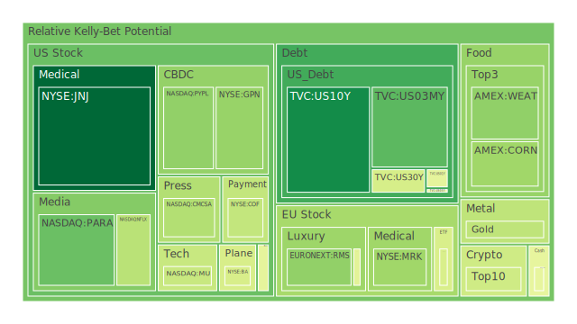
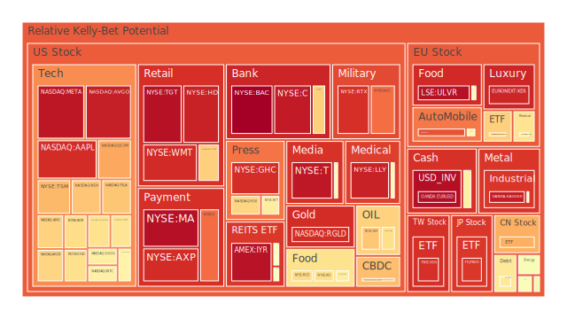
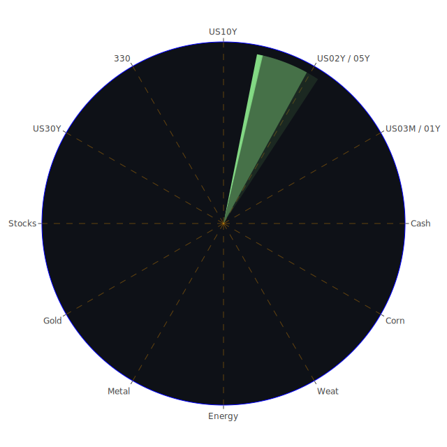

# **投資商品泡沫分析**

本報告旨在客觀分析當前各類投資商品之潛在泡沫風險，並結合宏觀經濟數據、新聞事件及歷史經驗，提出可能的市場傳導路徑與投資建議。我們將嚴格遵循公正客觀的原則，將一切市場波動視為自然現象進行解讀。報告日期為2025年6月4日。

當前市場呈現複雜多變的局面。一方面，部分資產的泡沫警示持續閃爍，另一方面，特定領域的樂觀情緒依然存在。聯邦儲備系統的數據顯示，雖然其總資產持續下降，有效聯邦基金利率（EFFR）交易量增加，貨幣市場基金總資產亦見增長，顯示市場對流動性的需求及避險情緒。然而，商業房地產、消費者及整體房地產的拖欠率均處於相對高位，這與信用卡壞帳率及拖欠率相對較低形成對比，可能意味著壓力集中在特定領域，或相關數據存在滯後性。高收益債券利率雖處於低位，但其上升趨勢一度惡化後趨穩，暗示市場對風險的定價經歷波動。美國十年期公債殖利率為4.46%，一年期為4.13%，三月期為4.35%，殖利率曲線極度平坦，10年期與3月期利差僅0.11，去年同期則為-1.33，這種從深度倒掛到平坦的轉變，歷史上常被視為經濟前景不明朗的信號。與此同時，消費者物價指數年增率（CPIYOY）為2.33%，較去年顯著回落但與上月持平，顯示通膨壓力有所緩解但仍具黏性。聯儲自四月下旬以來釋放的鷹派言論多於鴿派，暗示其政策立場依然謹慎。

從空間維度觀察，全球市場呈現分化。例如，美國科技股的高估值與歐洲奢侈品股的泡沫疑慮並存，而新興市場則面臨資本流動和本幣貶值的壓力。時間維度上，當前市場與歷史上數個高估值、政策緊縮及經濟轉型期有相似之處，例如2000年科技泡沫破裂前夕或2008年金融海嘯的前奏，但每次危機的具體觸發點和傳導機制均有所不同。概念維度上，經濟學中的效率市場假說與行為金融學中的羊群效應、非理性繁榮等理論，為我們理解市場現象提供了多重視角。博弈論的觀點則提醒我們，市場參與者之間的互動和預期管理，本身就是市場動態的重要組成部分。

* **美國國債 (US10Y, US02Y, US30Y, US05Y, US01Y, US03MY)** 美國國債市場近期呈現殖利率曲線平坦化的特徵。十年期國債 (US10Y) 當前價格對應殖利率約4.46%，其即日泡沫分數相對較低，月平均泡沫分數亦處於中低水平 (D1: 0.158, D30: 0.351)。兩年期國債 (US02Y) 殖利率約3.96%，其泡沫分數在各天期均保持在0.61附近，顯示短期內風險感知穩定但偏高。三十年期國債 (US30Y) 殖利率約4.98%，其泡沫分數呈現波動，月平均為0.493。短天期如三月期國債 (US03MY) 殖利率4.35%，其泡沫分數近期有所下降，D1為0.260，但D7曾達0.401。

從歷史視角看，殖利率曲線平坦化甚至倒掛，往往被視為經濟衰退的先行指標。當前10年期與3月期利差 (0.11) 雖已轉正，但仍處於歷史低位，反映市場對未來經濟增長前景的擔憂。新聞事件中，台灣央行稱美國債務「健全」，對美元儲備地位無擔憂，這為美債提供了一定的正面情緒。然而，美國債務佔GDP比重處於高位，且外國機構持有的美國國債流通量相對較低，這在概念上構成了潛在的脆弱性。經濟學上，債券價格與利率成反比，若通膨持續或聯儲立場更趨鷹派，債券價格可能進一步承壓。社會心理學角度，市場對聯儲政策的預期極大影響債券交易行為，任何風吹草動都可能引發波動。從博弈論看，債券市場參與者正在與聯儲的政策意圖進行博弈，試圖預判其利率路徑。聯儲總資產下降，暗示縮表的持續，這對債券供給有影響。

* **美國零售股 (WMT, COST, TGT, HD)** 沃爾瑪 (WMT) 的泡沫分數持續偏高 (D1: 0.917, D30: 0.898)。好市多 (COST) 的泡沫分數亦處於中高水平 (D1: 0.666, D30: 0.566)。塔吉特 (TGT) 泡沫分數極高 (D1: 0.967, D30: 0.941)。家得寶 (HD) 的泡沫分數也居高不下 (D1: 0.936, D30: 0.780)。這些零售巨頭普遍面臨高泡沫的警示。

經濟學角度，零售業績與消費者信心、可支配收入及就業狀況密切相關。當前消費者拖欠率處於相對高位，可能對未來零售銷售構成壓力。新聞中提及小企業在關稅政策下掙扎，這也可能間接影響整體消費環境。歷史上，在經濟下行週期，非必需消費品零售受創往往較重，而必需消費品零售則相對穩健。社會學層面，消費習慣的改變（如電商滲透率提升）對傳統零售商構成持續挑戰。心理學上，品牌忠誠度和促銷活動對消費者購買決策影響巨大。博弈論觀點，零售商之間的價格戰和市場份額爭奪，是常態化的競爭。

* **美國科技股 (AAPL, MSFT, GOOG, AMZN, META, NVDA, TSLA)** 蘋果 (AAPL) 的泡沫分數回升至高位 (D1: 0.916, D30: 0.661)。微軟 (MSFT) 的泡沫分數也處於較高水平 (D1: 0.622, D30: 0.690)。谷歌 (GOOG) 的泡沫分數中等偏高 (D1: 0.591, D30: 0.582)。亞馬遜 (AMZN) 泡沫分數維持在較高區域 (D1: 0.655, D30: 0.702)。Meta (META) 泡沫分數極高 (D1: 0.955, D30: 0.874)。輝達 (NVDA) 泡沫分數波動劇烈，目前D1為0.631，但D30為0.669，顯示近期風險感知有所調整但整體偏高。特斯拉 (TSLA) 的泡沫分數處於中高水平 (D1: 0.684, D30: 0.540)。

新聞中「大型科技股重回標普500指數火車頭位置，因其獲利引擎轟鳴」為科技股提供了正面支撐。然而，歷史經驗表明，科技股的高增長預期往往伴隨高波動性，一旦業績不及預期或宏觀環境逆轉，可能出現劇烈調整（如2000年）。經濟學上，科技股的估值常依賴於未來現金流折現，對利率變動極為敏感。社會學角度，科技產品的普及和創新周期，深刻影響行業格局。心理學上，「錯失恐懼症」(FOMO) 常在科技股行情中扮演推波助瀾的角色。博弈論中，科技巨頭間的平台競爭、生態系統構建及對新興技術的搶占，均是激烈的博弈。

* **美國房地產指數 (VNQ, IYR, RWO)** Vanguard Real Estate ETF (VNQ) 的泡沫分數處於中高水平 (D1: 0.534, D30: 0.497)。iShares U.S. Real Estate ETF (IYR) 泡沫分數極高 (D1: 0.964, D30: 0.907)。SPDR Dow Jones Global Real Estate ETF (RWO) 泡沫分數也偏高 (D1: 0.552, D30: 0.599)。

美國房地產市場面臨挑戰。聯儲數據顯示商業房地產和整體房地產拖欠率高企。新聞亦指「房地產市場潮流正在轉向，頂級都會區房價下跌，預示今年稍晚將出現更廣泛跌勢」以及「今天房貸和再融資利率，2025年6月1日：30年期下降，15年期微升」， HELOC利率亦走低。30年期固定房貸利率雖從去年高位回落，但仍處於6.89%的水平，遠高於前幾年。歷史上，利率上升週期通常對房地產市場構成壓力。經濟學上，房地產市場受利率、信貸可得性、人口結構及經濟增長等多重因素影響。社會學觀點，居家辦公趨勢對商業地產需求產生結構性影響。心理學上，購房者的預期和市場情緒，對房價有顯著助漲助跌作用。

* **加密貨幣 (BTCUSD, ETHUSD, DOGEUSD)** 比特幣 (BTCUSD) 的泡沫分數處於中等水平 (D1: 0.517, D30: 0.509)。以太坊 (ETHUSD) 泡沫分數亦為中等 (D1: 0.430, D30: 0.436)。狗狗幣 (DOGEUSD) 的泡沫分數也類似 (D1: 0.491, D30: 0.467)。加密貨幣市場的泡沫感知度在近期相對穩定，但整體處於需要關注的水平。

新聞中提及「第二名男子在紐約暴力綁架加密貨幣案件中被起訴」，這類負面安全事件可能影響市場信心。歷史上，加密貨幣市場以高波動性和易受監管政策、市場情緒影響著稱。經濟學角度，加密貨幣的價值基礎、內在價值及其作為支付手段或價值儲存工具的角色仍在探討和演進中。社會學而言，加密社群的共識和網絡效應是其發展的重要驅動力。心理學上，暴富神話和社群狂熱對投資者行為有顯著影響。博弈論觀點，早期採用者的優勢、礦工與投資者的利益平衡、監管機構與市場的博弈，均是加密市場的複雜面向。

* **金/銀/銅 (XAUUSD, XAGUSD, COPPER)** 黃金 (XAUUSD) 的泡沫分數處於中等偏高水平 (D1: 0.407, D30: 0.559)。白銀 (XAGUSD) 的泡沫分數極高 (D1: 0.944, D30: 0.923)。銅 (COPPER) 的泡沫分數處於中等水平 (D1: 0.555, D30: 0.515)。黃金/石油比率為53.12，遠高於去年的32.36。黃金/銅比率為691.53，亦高於去年。

黃金和白銀作為貴金屬，通常在經濟不確定性增加、通膨預期上升或美元走弱時受到青睞。銅作為工業金屬，其價格與全球經濟增長前景密切相關。歷史上，地緣政治風險升溫也常推升金價。新聞中，以色列接受美國新的停火協議，可能短暫緩和避險情緒，但中東整體局勢依然複雜。經濟學上，實際利率是影響黃金吸引力的關鍵因素。社會心理學上，黃金的傳統避險地位深入人心。當前金油比和金銅比高企，可能反映市場對經濟前景的擔憂（銅需求預期下降）以及對避險資產的偏好（黃金）。

* **黃豆 / 小麥 / 玉米 (SOYB, WEAT, CORN)** 黃豆 (SOYB) 的泡沫分數在6月4日出現一個相對高的D1值0.500，但其月平均D30為0.578，整體偏高。小麥 (WEAT) 的泡沫分數中等 (D1: 0.333, D30: 0.414)。玉米 (CORN) 的泡沫分數亦為中等 (D1: 0.356, D30: 0.473)。

農產品價格受天氣、地緣政治、全球供需、能源價格（影響化肥和運輸成本）及政府政策等多重因素影響。歷史上，極端天氣事件或主要出口國的供應中斷，都可能導致價格大幅波動。新聞中提及加薩地區人道援助卡車遭劫掠，糧食危機惡化，雖非直接關聯這些農產品期貨，但突顯了全球糧食安全問題的敏感性。經濟學角度，農產品是民生必需品，其價格波動對通膨有直接影響。社會學上，糧食安全是國家穩定的基石。

* **石油/ 鈾期貨UX\! (USOIL, UX1\!)** 美國原油 (USOIL) 的泡沫分數波動較大，D1為0.533，但D7曾低至0.416，月平均D30為0.356，整體中等偏低。鈾期貨 (UX1\!) 泡沫分數中等 (D1: 0.526, D30: 0.497)。

新聞中「航空業受益於油價下跌」以及「OPEC+堅持7月產量增幅與6月持平後油價反彈」，顯示了供需兩端對油價的影響。歷史上，地緣政治衝突（特別是中東地區）常導致油價飆升。經濟學上，石油需求與全球經濟活動緊密相關，而供給則受OPEC+政策、非OPEC產量及地緣政治因素影響。鈾作為核燃料，其價格與核電發展前景、全球能源轉型政策及地緣政治（如對俄羅斯鈾的依賴）相關。社會學角度，能源轉型和氣候變化議題，對傳統化石能源和核能的未來蒙上複雜色彩。

* **各國外匯市場 (EURUSD, USDJPY, GBPUSD, AUDUSD)** 歐元兌美元 (EURUSD) 的泡沫分數極高 (D1: 0.970, D30: 0.929)。美元兌日圓 (USDJPY) 的泡沫分數先升後略降，但整體偏高 (D1: 0.592, D30: 0.773)。英鎊兌美元 (GBPUSD) 泡沫分數中等偏高 (D1: 0.486, D30: 0.487)。澳元兌美元 (AUDUSD) 泡沫分數中等 (D1: 0.488, D30: 0.319)。

外匯市場受各國利率政策差異、經濟增長前景、資本流動、地緣政治及市場情緒等多重因素影響。歷史上，主要央行的政策分歧期，往往是匯率大幅波動的時期。新聞中，美國聯儲的鷹派立場可能為美元提供支撐，而其他央行的行動則會影響相對匯率。例如，日本央行若未能有效退出超寬鬆政策，日圓可能持續承壓。經濟學中的利率平價理論和購買力平價理論為理解匯率提供了基本框架，但短期內市場情緒和資本流動的影響可能更大。心理學上，對一國經濟前景的信心，直接影響其貨幣的吸引力。

* **各國大盤指數 (NDX, GDAXI, FTSE, FCHI, JPN225, 000300, 0050\)** 納斯達克100指數 (NDX) 泡沫分數處於高位 (D1: 0.684, D30: 0.740)。德國DAX指數 (GDAXI) 泡沫分數中高 (D1: 0.666, D30: 0.521)。英國富時100指數 (FTSE) 泡沫分數中等 (D1: 0.533, D30: 0.559)。法國CAC40指數 (FCHI) 泡沫分數中等偏高 (D1: 0.454, D30: 0.567)。日經225指數 (JPN225) 泡沫分數極高 (D1: 0.900, D30: 0.859)。中國滬深300指數 (000300) 泡沫分數偏高 (D1: 0.724, D30: 0.719)。台灣50指數 (0050) 泡沫分數亦極高 (D1: 0.910, D30: 0.665)。

全球主要股指普遍呈現中高至極高的泡沫警示，反映了市場對持續上漲的擔憂以及對潛在回調的警惕。新聞中，美國科技股的強勢表現是推動納指的重要因素，但也加劇了估值擔憂。地緣政治方面，中國與美國在亞洲國防論壇上的態度差異，以及俄烏衝突的持續，都為全球市場帶來不確定性。歷史經驗表明，全球股市聯動性強，一個主要市場的劇烈波動很容易傳導至其他市場。經濟學上，股指是經濟的晴雨表，但也受流動性、市場情緒等因素影響。社會心理學角度，投資者情緒的集體表現是股指波動的重要推手。

* **美國半導體股 (NVDA, AMD, QCOM, AVGO, INTC, AMAT, MU, KLAC, TSM)** 除已在科技股中提及的NVDA、TSM外，AMD的泡沫分數中高 (D1: 0.661, D30: 0.644)。高通 (QCOM) 泡沫分數高企 (D1: 0.735, D30: 0.833)。博通 (AVGO) 泡沫分數極高 (D1: 0.941, D30: 0.795)。英特爾 (INTC) 泡沫分數中等偏高 (D1: 0.588, D30: 0.565)。應用材料 (AMAT) 泡沫分數中高 (D1: 0.584, D30: 0.578)。美光 (MU) 泡沫分數中等，但近期D1有所上升 (D1: 0.424, D30: 0.304)。科磊 (KLAC) 泡沫分數中高 (D1: 0.634, D30: 0.545)。台積電 (TSM) 泡沫分數極高 (D1: 0.707, D30: 0.950)。

半導體行業處於科技發展的核心，受益於人工智能、5G、物聯網等趨勢，但也具有高度的週期性和資本密集性。歷史上，半導體行業經歷過多次繁榮與蕭條的週期。新聞中，對華為的制裁以及美國試圖構建「芯片聯盟」等地緣政治因素，對全球半導體供應鏈格局產生深遠影響。經濟學上，供需失衡（如過去的芯片短缺）會導致價格劇烈波動。技術創新是行業發展的關鍵驅動力。

* **美國銀行股 (JPM, BAC, C, COF)** 摩根大通 (JPM) 泡沫分數偏高 (D1: 0.665, D30: 0.787)。美國銀行 (BAC) 泡沫分數極高 (D1: 0.999 \- 幾乎是最高警示, D30: 0.949)。花旗集團 (C) 泡沫分數極高 (D1: 0.947, D30: 0.898)。第一資本 (COF) 泡沫分數中等偏高 (D1: 0.415, D30: 0.491)。

銀行股的表現與利率環境、信貸質量、監管政策及整體經濟健康狀況密切相關。當前，聯儲數據顯示商業房地產及消費者貸款拖欠率上升，對銀行資產質量構成潛在威脅。然而，銀行總存款量仍處於高位。歷史上，金融危機往往與銀行系統的脆弱性相關。經濟學上，淨息差是影響銀行盈利能力的關鍵。監管資本要求和壓力測試旨在增強銀行系統的穩健性。新聞中關於房地產市場的負面消息，以及消費者信貸壓力的增加，都可能對銀行股構成負面影響。

* **美國軍工股 (LMT, NOC, RTX, BA)** 洛克希德馬丁 (LMT) 泡沫分數中高 (D1: 0.484, D30: 0.648)。諾斯洛普格魯曼 (NOC) 泡沫分數高 (D1: 0.818, D30: 0.715)。雷神技術 (RTX) 泡沫分數極高 (D1: 0.910, D30: 0.872)。波音 (BA) 泡沫分數在經歷了生產問題後，近期有所波動，D1為0.452，D30為0.313，但新聞提及阿聯酋航空對其進展感樂觀，這對股價有正面提振。

軍工股受地緣政治緊張局勢和國防預算驅動。近期全球多點衝突及大國競爭態勢，為軍工行業帶來訂單預期。新聞中，美國要求澳洲將國防開支提升至GDP的3.5%，以及呼籲亞洲盟友在中國「迫在眉睫」的威脅面前加強防禦，均利好軍工股。歷史上，戰爭時期和冷戰時期，軍工股表現往往突出。經濟學角度，國防開支具有乘數效應，但也可能擠出其他領域的投資。社會心理學上，國家安全感的需求是國防投入的根本動力。

* **美國電子支付股 (PYPL, V, MA, AXP, GPN)** PayPal (PYPL) 的泡沫分數中等，但月平均值偏高 (D1: 0.334, D30: 0.608)。Visa (V) 泡沫分數高 (D1: 0.819, D30: 0.805)。萬事達卡 (MA) 泡沫分數極高 (D1: 0.970, D30: 0.849)。美國運通 (AXP) 泡沫分數極高 (D1: 0.916, D30: 0.876)。Global Payments (GPN) 泡沫分數中等偏低 (D1: 0.344, D30: 0.284)。

電子支付行業受益於現金支付向數字支付的長期轉型趨勢，以及電子商務的發展。然而，競爭激烈，且面臨監管和技術變革的挑戰。經濟學上，交易費用和網絡效應是該行業的關鍵特徵。消費者支出模式的轉變（如先買後付BNPL的興起）也帶來影響。歷史上，支付技術的創新（如移動支付）曾重塑行業格局。

* **美國藥商股 (JNJ, MRK, LLY, ABBV)** 嬌生 (JNJ) 的泡沫分數顯著下降，目前處於低位 (D1: 0.091, D30: 0.206)。默克 (MRK) 的泡沫分數中等 (D1: 0.356, D30: 0.457)。禮來 (LLY) 泡沫分數持續極高 (D1: 0.936, D30: 0.934)，其減肥藥等創新產品備受市場追捧。艾伯維 (ABBV) 泡沫分數中高，近期有所反覆 (D1: 0.564, D30: 0.668)。

藥企股受藥品研發成功率、專利保護、醫保政策及人口老齡化等因素影響。歷史上，重磅新藥的推出能顯著提振公司業績和股價。新聞中提及的「醫療保險未支付部分成為數百萬老年人的沉重債務」可能引發對藥品定價和醫保覆蓋範圍的社會討論，從而影響行業政策環境。經濟學上，藥品研發的高投入和高風險，以及專利帶來的壟斷定價權是行業顯著特徵。

* **美國影視股 (NFLX, DIS, PARA)** 奈飛 (NFLX) 泡沫分數中等偏高 (D1: 0.398, D30: 0.477)。迪士尼 (DIS) 泡沫分數中高 (D1: 0.565, D30: 0.742)。派拉蒙全球 (PARA) 泡沫分數中等 (D1: 0.279, D30: 0.469)。

影視行業面臨流媒體競爭加劇、內容成本上升及消費者口味變化等挑戰。經濟學上，內容為王，但優質內容的獲取和製作成本高昂。訂閱模式的增長潛力與用戶疲勞並存。社會學角度，影視內容是文化傳播和價值觀塑造的重要載體。

* **美國媒體股 (NYT, FOX, CMCSA)** 紐約時報 (NYT) 泡沫分數高位回落但仍偏高 (D1: 0.597, D30: 0.750)。福斯 (FOX) 泡沫分數中高 (D1: 0.653, D30: 0.818)。康卡斯特 (CMCSA) 泡沫分數中等 (D1: 0.387, D30: 0.433)。

傳統媒體面臨數字化轉型和廣告收入下滑的壓力，而新興媒體則在爭奪用戶注意力和影響力。經濟學上，廣告市場的景氣度、訂閱收入的可持續性是關鍵。社會學和政治學角度，媒體在輿論形成和信息傳播中扮演重要角色，但也面臨信任危機和假新聞的挑戰。

* **石油防禦股 (XOM, OXY)** 埃克森美孚 (XOM) 泡沫分數中高 (D1: 0.636, D30: 0.799)。西方石油 (OXY) 泡沫分數中高 (D1: 0.682, D30: 0.724)。

大型石油公司在油價上漲時通常受益，並可能因其現金流和股息支付而被視為具有一定的防禦性。然而，其長期前景受到能源轉型和ESG投資趨勢的影響。經濟學上，其盈利能力與原油價格、煉油利潤率及勘探開發成本密切相關。

* **金礦防禦股 (RGLD)** 皇家黃金 (RGLD) 作為權利金公司，其泡沫分數極高 (D1: 0.915, D30: 0.920)。

金礦股通常在金價上漲時表現良好，並被部分投資者視為對沖通膨和市場不確定性的工具。其股價表現與金價、開採成本、儲量發現及地緣政治風險（礦山所在地）相關。RGLD的權利金模式使其避免了直接的運營風險，但其估值仍高度依賴黃金前景。

* **歐洲奢侈品股 (MC, RMS, KER)** LVMH (MC) 泡沫分數中高 (D1: 0.477, D30: 0.526)。愛馬仕 (RMS) 泡沫分數中等，但近期有所下降 (D1: 0.335, D30: 0.602)。開雲集團 (KER) 泡沫分數極高 (D1: 0.927, D30: 0.886)。

奢侈品行業的增長依賴全球高淨值人群的消費能力和信心，特別是新興市場的增長。歷史上，經濟衰退期奢侈品消費通常會受到衝擊。當前，對全球經濟放緩的擔憂可能對行業前景構成壓力。經濟學上，品牌價值、稀缺性營銷和高利潤率是其特點。社會學角度，奢侈品消費與社會地位和身份認同相關。

* **歐洲汽車股 (MBG, BMW, PAH3)** 梅賽德斯賓士 (MBG) 泡沫分數中等 (D1: 0.508, D30: 0.497)。寶馬 (BMW) 泡沫分數中等 (D1: 0.575, D30: 0.543)。保時捷 (PAH3) 泡沫分數高 (D1: 0.857, D30: 0.656)。

歐洲汽車製造商面臨向電動汽車轉型的巨大挑戰，同時也受到來自美國和中國競爭對手的壓力。供應鏈問題、能源成本和環保法規是影響行業的重要因素。經濟學上，規模經濟、技術創新和品牌忠誠度是競爭關鍵。

* **歐美食品股 (NESN, KO, MCD, KHC, ULVR)** 雀巢 (NESN) 泡沫分數中等 (D1: 0.559, D30: 0.562)。可口可樂 (KO) 泡沫分數中高 (D1: 0.635, D30: 0.621)。麥當勞 (MCD) 泡沫分數中高 (D1: 0.643, D30: 0.700)。卡夫亨氏 (KHC) 泡沫分數中高 (D1: 0.597, D30: 0.696)。聯合利華 (ULVR) 泡沫分數極高 (D1: 0.967, D30: 0.946)。

食品飲料行業通常被視為防禦性行業，因為其產品需求相對穩定。然而，它們也面臨原材料成本波動、消費者偏好轉向更健康產品以及零售商議價能力的挑戰。經濟學上，品牌效應和分銷網絡是重要資產。

# **宏觀經濟傳導路徑分析**

當前宏觀經濟環境的核心特徵是：通膨壓力雖有緩解但仍具黏性，主要央行（特別是聯儲）維持謹慎甚至偏鷹的政策立場，全球經濟增長前景不明朗，地緣政治風險持續存在。

從聯儲的行動來看（總資產下降、EFFR交易量增加），市場流動性正在被逐步回收。這通常會抬高融資成本，對高槓桿的企業和依賴外部融資的成長型資產（如部分科技股、房地產）構成壓力。這一效應的空間傳導體現為美元相對強勢，資本可能從新興市場回流美國，加劇新興市場的金融壓力。時間維度上，歷史經驗顯示，快速的貨幣緊縮往往伴隨著經濟活動的降溫，甚至衰退。概念上，費雪的債務通縮理論指出，在物價下跌（或通膨急劇下降）而名義債務不變時，實際債務負擔加重，可能引發連鎖反應。

消費者及房地產拖欠率的高企，是經濟壓力向微觀主體傳導的直接體現。這可能首先衝擊銀行業的資產質量（正反合：銀行壞帳增加 vs 銀行撥備充足 vs 整體信貸緊縮）。進而，信貸緊縮會抑制企業投資和個人消費（正反合：投資下降 vs 儲蓄增加 vs 總需求萎縮）。若此情況惡化，失業率可能上升，進一步打擊消費信心，形成負向循環。

新聞中提及的「小企業在關稅政策下掙扎」是另一個重要的宏觀傳導路徑。關稅增加了進口成本，可能推高通膨（正反合：成本推動型通膨 vs 需求減弱抑制通膨 vs 企業利潤受損），或迫使企業吸收成本導致利潤下降，甚至裁員。這對整體經濟的就業和增長都構成負面影響。

地緣政治風險（如烏克蘭危機持續、中東局勢、中美關係緊張）則通過能源價格（如石油、天然氣）、供應鏈擾動（如航運、關鍵零部件）和市場避險情緒（推高黃金、美元等避險資產）傳導至全球經濟。例如，俄烏衝突導致的能源和糧食價格上漲，加劇了全球通膨壓力。

# **微觀經濟傳導路徑分析**

在企業層面，原材料成本上升、融資成本提高、需求前景不明朗，正擠壓企業的利潤空間。例如，面臨高泡沫警示的零售股（WMT, TGT），其定價能力將受到考驗。如果它們無法將成本壓力完全轉嫁給消費者（因消費者拖欠率已在高位），則其利潤率將受損，可能導致股價下修。這就是一個「成本推動-需求約束-利潤受損-股價調整」的微觀傳導鏈。

科技行業，特別是半導體（如TSM, QCOM的高泡沫分數），雖然受益於長期需求，但也面臨高庫存、產能過剩以及地緣政治引發的供應鏈重構風險。如果終端需求（如智能手機、PC）復甦緩慢，而前期過度投資導致產能過剩，則可能出現價格戰，侵蝕企業利潤。這是一個「預期過高-投資過度-需求不足-價格競爭」的路徑。

銀行股（如BAC, C的極高泡沫分數）的微觀傳導路徑與信貸週期密切相關。房地產市場的疲軟和商業貸款拖欠率的上升，直接威脅銀行資產負債表。若出現大規模違約，銀行需要提高壞帳撥備，侵蝕利潤，甚至引發資本充足率擔憂。這是一個「資產質量惡化-撥備增加-盈利下降-資本壓力」的路徑。

新聞中「阿聯酋航空對波音進展感樂觀」，對波音(BA)而言是正面消息，有助於修復因生產問題受損的市場信心，可能帶來訂單回流，改善現金流，進而修復股價。這是一個「問題改善-信心恢復-訂單增加-股價回升」的正面傳導。

# **資產類別間傳導路徑分析**

資產類別間的傳導效應在當前環境下尤為複雜。首先，債券市場的波動是重要的起點。若聯儲持續鷹派導致美債殖利率進一步上升（債券價格下跌），將提高全球無風險利率的定價基準。這會對股票市場，特別是高估值的成長股（如科技股、半導體股），產生負面估值壓力，因為未來現金流的折現率上升（債券 \-\> 股票）。

其次，商品市場的動盪會向通膨和企業成本傳導。例如，油價若因地緣政治再度飆升，將直接推高通膨預期，迫使央行維持緊縮政策，同時增加企業（特別是運輸、化工、航空等行業）的運營成本，侵蝕利潤（商品 \-\> 通膨 \-\> 企業盈利 \-\> 股票）。反之，若油價因需求疲軟下跌，雖有助於緩解通膨，但也可能是經濟衰退的信號。

房地產市場的風險可能向金融體系蔓延。商業地產價格下跌和違約率上升，可能導致相關貸款和房地產抵押貸款支持證券（RMBS/CMBS）價值縮水，衝擊持有這些資產的金融機構（房地產 \-\> 金融機構 \-\> 信貸市場）。

外匯市場的波動反映了資本流動和相對經濟實力。美元強勢通常伴隨著新興市場貨幣貶值和資本外流，可能引發新興市場的債務危機或金融不穩定（外匯 \-\> 新興市場）。

黃金等避險資產的表現，往往與市場整體風險偏好呈負相關。當股市、信用市場風險上升時，資金可能流向黃金，推高金價（市場風險厭惡 \-\> 黃金）。

一個值得關注的「正反合」傳導是： Thesis（危機初期）：經濟數據惡化，股市下跌，避險情緒升溫，美元和黃金上漲。Antithesis（政策干預）：央行可能轉向鴿派，釋放流動性，試圖托底市場。Synthesis（政策效果不確定）：若政策有效，市場可能反彈；若問題根深蒂固，則可能陷入長期停滯或進一步下跌，形成更複雜的資產輪動。

例如，從空間三位一體看，美國科技股的高泡沫（Thesis）與歐洲奢侈品的高泡沫（Antithesis）可能同時面臨全球需求放緩的壓力，資金可能尋求更安全的政府債券或現金（Synthesis），導致風險資產普遍承壓。從時間三位一體看，當前高企的資產價格和收緊的流動性（Thesis），類似於歷史上泡沫破裂前的某些階段（Antithesis），未來可能的路徑是痛苦的去槓桿和價值重估，但也可能通過技術革新和生產力提升實現軟著陸（Synthesis）。從概念三位一體看，市場的非理性繁榮（Thesis \- 心理學）遭遇了利率上升的引力（Antithesis \- 經濟學），結果可能是均值回歸，但也可能在新的敘事下找到新的平衡點（Synthesis \- 博弈論下的預期轉變）。

# **投資建議**

基於上述分析，我們需要構建能夠應對潛在波動並捕捉結構性機會的投資組合。以下配置建議僅為參考，總比例為100%。

**一、 穩健型投資組合 (Conservative Portfolio)**

此組合旨在保本並尋求穩定回報，對沖市場下行風險。

1. **短期美國國債 (US03MY, US01Y) \- 40%**：鑑於當前殖利率曲線平坦，短期國債提供了相對不錯的收益率和高度流動性。其泡沫分數相對較低（US03MY D1: 0.260, US01Y D1: 0.483但月平均較低）。這部分資產可以作為市場動盪時的「現金停泊港」。  
2. **黃金 (XAUUSD) \- 35%**：黃金的泡沫分數中等偏高 (D1: 0.407, D30: 0.559)，但在地緣政治不確定性和潛在經濟衰退風險下，仍具備避險價值。金油比和金銅比高企也支持其相對強勢。  
3. **必需消費品龍頭股 (例如：KO, NESN 中選取一個或分散) \- 25%**：可口可樂 (KO) 和雀巢 (NESN) 的泡沫分數分別為中高和中等。這類公司業務需求相對穩定，受經濟週期影響較小，能提供一定的防禦性。歷史上，在經濟下行期，必需消費品表現通常優於非必需品。

此組合中，短期國債與黃金通常呈負相關或低相關（尤其在避險時期黃金可能與債券同漲，但此處短期債券主要取其現金替代和穩定收益屬性），黃金與必需消費股在某些市場環境下也可能呈現低相關性。目標是使資產間的相位盡量錯開。

**二、 成長型投資組合 (Growth Portfolio)**

此組合旨在尋求高於市場平均的回報，願意承擔中等程度的風險。

1. **美國科技股中的特定細分領域龍頭 (例如：MSFT, GOOG 中選取一個或分散，避開泡沫極高者) \- 40%**：微軟 (MSFT) 和谷歌 (GOOG) 的泡沫分數雖偏高，但其在人工智能等領域的領先地位和強勁盈利能力，使其仍具備長期增長潛力。需警惕其高估值風險，但作為成長組合的核心配置，其創新能力是關鍵。  
2. **美國藥商股中的創新型公司 (例如：LLY) \- 30%**：禮來 (LLY) 泡沫分數極高，顯示市場對其熱捧，風險巨大，但其創新藥物帶來的增長前景亦十分可觀。此處配置代表對高風險高回報的博弈，需嚴控倉位，並認識到其泡沫警示。  
3. **鈾期貨 (UX1\!) 或相關鈾礦公司股票 \- 30%**：鈾期貨 (UX1\!) 泡沫分數中等。在全球能源轉型和能源安全考量下，核電作為低碳穩定基荷能源的地位可能提升，對鈾的需求有望增加。此配置著眼於能源結構轉型的長期趨勢。

此組合中，科技股與藥股可能同時受市場情緒和利率影響，但其各自的行業驅動因素（技術創新vs藥品研發週期）不同。鈾則與傳統商品及股市的關聯性在特定時期可能較低。

**三、 高風險型投資組合 (Aggressive Portfolio)**

此組合旨在追求最大化回報，願意承擔較高風險和波動性。

1. **加密貨幣 (BTCUSD, ETHUSD) \- 35%**：比特幣和以太坊的泡沫分數中等，但其高波動性和潛在的高回報（或高損失）特性符合高風險偏好。它們代表了對新興資產類別和區塊鏈技術前景的投機性押注。  
2. **特定高泡沫半導體股 (例如：TSM, NVDA 中選其一或分散，但需認知其極高風險) \- 35%**：台積電 (TSM) 和輝達 (NVDA) 的泡沫分數均處於高位或波動劇烈。它們是AI和高性能計算趨勢的核心受益者，但其估值已反映極高預期，風險極大。此配置是純粹的動量和趨勢追逐，需有嚴格的風險管理和退出策略。  
3. **歐洲奢侈品股中的部分標的 (例如：KER) \- 30%**：開雲集團 (KER) 泡沫分數極高。此配置押注於其品牌價值和全球財富效應的持續，但需警惕經濟放緩對奢侈品消費的衝擊。它與科技股和加密貨幣的驅動因素有所不同，或可提供一定分散。

此組合的各個組成部分波動性均較高，但其驅動邏輯和所屬賽道有所差異，試圖在高風險領域內尋求一定的非完全正相關性。例如，加密貨幣的政策風險與半導體的產業週期風險、奢侈品的宏觀消費風險，其觸發點和影響路徑不盡相同。

# **風險提示**

投資有風險，市場總是充滿不確定性。上述分析和建議基於當前可得數據和我們的理解，但未來市場發展可能遠超預期。泡沫分數僅為一種量化參考，不構成最終的投資決策依據。各類資產的價格波動可能導致本金損失。投資者應充分理解各類資產的風險特徵，結合自身的風險承受能力、財務狀況和投資目標，獨立審慎地做出投資決策。在做出任何投資決策前，建議諮詢專業的財務顧問。歷史業績不代表未來回報。本報告不應被視為任何形式的投資邀約或承諾。

 
Daily Buy Map:

 
Daily Sell Map:

 
Daily Radar Chart:

 
