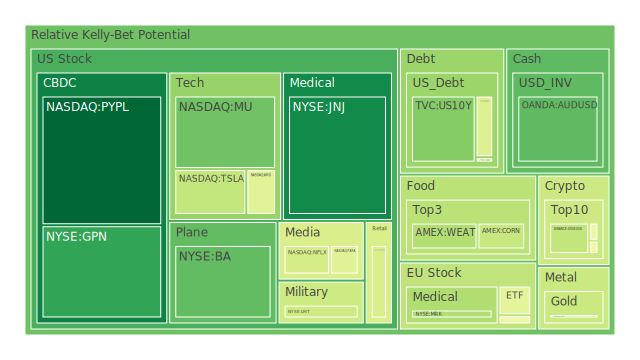
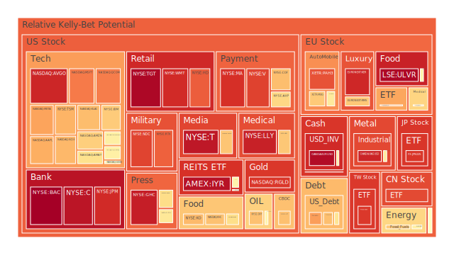
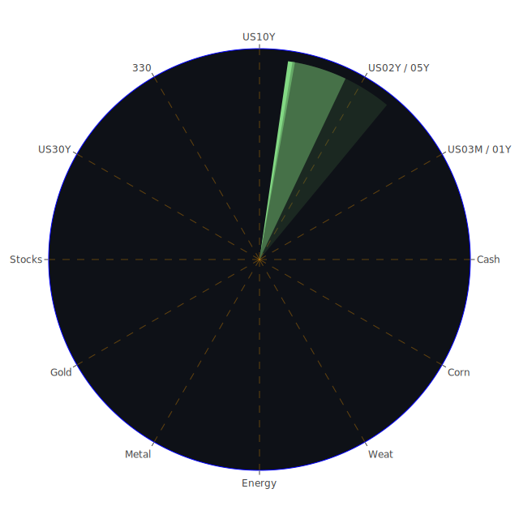

# **投資商品泡沫分析**

當前全球金融市場呈現複雜多變的格局，各類資產在不同因素的驅動下，展現出迥異的價格動態與風險特徵。深入剖析這些現象，有助於我們更清晰地把握市場脈動，並作出更為審慎的投資決策。

* **美國國債 (US10Y, US03MY, US05Y, US30Y, US02Y, US01Y)**

美國國債市場作為全球金融的基石，其殖利率的波動深刻影響著各類資產的定價。從數據來看，截至2025年6月5日，各期限美國國債的泡沫指數呈現分化。例如，十年期美國國債 (US10Y) 的當日泡沫指數 (D1) 為0.293108，相較於七天平均 (D7) 的0.132036有所上升，但仍處於相對溫和的水平。短期國債方面，三個月期國債 (US03MY) 的D1為0.686523，一年期國債 (US01Y) D1為0.740372，兩年期國債 (US02Y) D1維持在0.609932，顯示短期利率市場的波動與不確定性相對較高。長天期如三十年期國債 (US30Y) D1為0.448025，亦處於中等水平。

從經濟學角度觀察，聯準會 (FED) 的政策動向是影響國債價格的核心因素。提供的FED經濟數據顯示，EFFR成交量上升，FED總資產下降，逆回購 (RRP) 規模縮減，這些通常指向市場流動性的收緊。同時，聯準會官員近期釋放的鷹派言論 (自2025年5月3日以來有1次鷹派發言，0次鴿派發言) 也強化了市場對未來利率可能維持高檔或進一步上升的預期。歷史上，當央行採取緊縮政策以對抗通膨時，國債殖利率通常會上行，價格則相應下跌。目前美國10年期與3個月期公債殖利率差 (US Yield 10Y-03M) 為0.01，略高於上月的-0.02，顯示殖利率曲線極度平坦，這在歷史上往往被視為經濟前景不明朗，甚至可能步入衰退的信號，但相較於去年的深度倒掛 (-1.34) 已有所改善。

社會心理學層面，市場對通膨持續性的擔憂以及對未來經濟增長放緩的預期，使得投資者在國債市場的博弈更為複雜。一方面，避險情緒可能推升對國債的需求；另一方面，若通膨預期高於名目殖利率，則國債的實際回報將為負，降低其吸引力。新聞事件中，諸如「製造業活動在五月萎縮，進口降至2009年以來最低水平」等負面經濟消息，理論上會增加避險需求，對國債價格構成支撐 (殖利率下降)。然而，若市場同時預期聯準會將因此更長時間維持高利率以刺激經濟 (儘管傳統上是降息刺激)，則可能導致殖利率上升。

從博弈論角度看，市場參與者正在評估聯準會的決心與經濟數據之間的拉鋸。若經濟數據持續疲軟，聯準會可能被迫轉向；反之，若通膨數據頑固，緊縮政策或將持續。目前各期限泡沫指數的分化，也反映了市場對於不同時期利率路徑預期的不一致。

* **美國零售股 (WMT, COST, TGT, HD)**

美國零售股的表現與消費者信心、就業市場及整體經濟狀況緊密相連。觀察數據，沃爾瑪 (WMT) 的D1泡沫指數為0.917494，好市多 (COST) 為0.433990，塔吉特 (TGT) 高達0.984105，家得寶 (HD) 亦有0.836223。這些數據，特別是TGT和WMT的較高泡沫指數，暗示了該板塊可能存在一定的價格過熱風險。

經濟學上，零售銷售是衡量消費支出的重要指標。新聞中提到「Campbell's Co. 表示銷售額上升，因更多美國人在家做飯」以及「Roark Capital 以10億美元收購 Dave's Hot Chicken 並計劃迅速擴張」，這些顯示部分消費領域仍具韌性。然而，「零售商Temu在『最低限度』漏洞結束後，美國日活躍用戶減半」則揭示了特定商業模式的脆弱性及消費者行為的轉變。聯準會數據中，「消費者拖欠率相對較高」是一個警訊，可能預示未來消費能力的下降，對零售股構成壓力。

從社會學角度，消費習慣的變遷，如線上購物與實體店的競爭、對價格敏感度的提升、以及對可持續性和品牌價值的重視，都在重塑零售業格局。心理學上，消費者的「財富效應」 (資產價格上漲帶動消費意願) 與對未來經濟前景的預期，直接影響其消費決策。若市場瀰漫悲觀情緒，即使收入穩定，消費者也可能傾向儲蓄而非支出。

歷史經驗表明，在經濟下行週期或高通膨環境下，非必需消費品零售商往往受創較重，而必需消費品零售商則相對具有防禦性。目前WMT和TGT等廣泛型零售商的高泡沫指數，可能反映了市場對其品牌護城河及規模效應的樂觀預期，但也可能忽視了潛在的消費降級風險。相對價格方面，必需消費品與非必需消費品的股價表現差異，以及高低端零售品牌的估值分化，值得關注。

* **美國科技股 (AAPL, MSFT, GOOG, AMZN, NVDA, TSM, AVGO, QCOM, MU, INTC, AMD)**

科技股，特別是大型科技股和半導體股，近年來一直是市場關注的焦點。數據顯示，蘋果 (AAPL) D1泡沫指數為0.716250，微軟 (MSFT) 為0.793148，谷歌 (GOOG) 為0.525119，亞馬遜 (AMZN) 為0.655505。半導體領域，輝達 (NVDA) D1為0.578973，台積電 (TSM) 高達0.706693，博通 (AVGO) 為0.925965，高通 (QCOM) 為0.788153，美光 (MU) 為0.263981，英特爾 (INTC) 為0.576319，超微 (AMD) 為0.456951。其中，AVGO和TSM的泡沫指數相對較高。

經濟學角度看，科技股的增長預期、利率敏感性以及創新週期是核心驅動因素。新聞中「Alphabet股價在法官下令剝離Google Chrome的情況下，可能在『黑天鵝事件』中下跌高達25%」，顯示了監管風險對大型科技股的潛在衝擊。「Applied Digital股價因與Nvidia支持的CoreWeave達成AI數據中心協議而飆升」，則突顯了人工智能 (AI) 浪潮對相關股票的巨大提振作用。聯準會的利率政策對科技股影響顯著，較高的利率環境通常不利於成長型科技股的估值。

社會學及心理學層面，「錯失恐懼症」(FOMO) 在AI等熱門主題的炒作中扮演重要角色，可能推高相關股票的泡沫水平。同時，技術變革對社會結構的影響，如就業替代、數據隱私等問題，也可能間接影響科技行業的發展前景和公眾接受度。從博弈論角度，科技巨頭之間的競爭與合作，以及各國政府在科技領域的戰略佈局 (如晶片法案、反壟斷調查)，都在重塑產業格局。

歷史上，科技股曾多次經歷泡沫與破裂，如2000年的互聯網泡沫。當時，對新技術的無限憧憬推動股價遠離基本面，最終導致市場大幅回調。目前AI領域的熱潮與當時有相似之處，但亦有不同，例如AI技術的應用落地速度更快，且部分龍頭企業已具備強勁的盈利能力。然而，泡沫指數的整體偏高，特別是部分AI概念股的短期巨大漲幅，仍需警惕。TSM的高泡沫指數可能與其在全球半導體製造鏈中的關鍵地位及AI需求驅動有關，但也反映了市場的高度期望。

* **美國房地產指數 (VNQ, IYR, RWO)**

美國房地產市場的健康狀況對整體經濟至關重要。房地產指數VNQ的D1泡沫指數為0.563856，IYR為0.965223，RWO為0.515957。IYR的泡沫指數顯著偏高，值得高度關注。

經濟學上，利率是影響房地產市場的關鍵變數。FED數據顯示，30年期固定抵押貸款利率為6.89%，較去年同期的2.96%大幅上升，這顯著增加了購房成本，對房地產需求構成壓力。同時，「商業房地產拖欠率相對較高」和「房地產拖欠率相對較高」的數據，是房地產市場承壓的直接證據。歷史上，利率急劇上升時期往往伴隨著房地產市場的降溫甚至衰退。

社會學角度，人口結構變化、城鄉遷移趨勢、以及遠程工作的普及，都在影響不同地區和不同類型房地產 (住宅、商業、工業) 的需求。心理學上，購房者的預期 (房價是否會繼續上漲或下跌) 對市場交易活躍度有重大影響。目前高利率環境下，潛在購房者的觀望情緒可能較濃。

新聞事件中雖然沒有直接提及房地產指數，但「製造業活動萎縮」可能暗示商業地產需求的疲軟。博弈論視角下，開發商、投資者和購房者在當前的市場環境中都在進行策略調整。開發商可能放緩新項目，投資者可能重新評估風險回報，而購房者則在權衡購買力與市場前景。IYR的極高泡沫指數可能反映了市場對特定房地產投資信託 (REITs) 的過度追捧，或者數據本身的特殊性，需要結合其持倉結構進一步分析。若整體房地產市場面臨下行壓力，如此高的泡沫指數預示著較大風險。

* **加密貨幣 (BTCUSD, ETHUSD, DOGEUSD)**

加密貨幣市場以其高波動性和高風險性著稱。比特幣 (BTCUSD) D1泡沫指數為0.485759，以太坊 (ETHUSD) 為0.489506，狗狗幣 (DOGEUSD) 為0.394117。這些數值表明，主流加密貨幣的短期泡沫風險處於中等水平。

經濟學上，加密貨幣的價值來源和定價機制仍存在較大爭議。其價格受到市場供需、投資者情緒、監管政策、宏觀流動性以及技術發展等多重因素影響。聯準會緊縮政策導致的流動性收緊，理論上不利於風險資產，包括加密貨幣。然而，部分投資者將比特幣視為「數位黃金」，在特定避險情境下可能受到追捧。

社會心理學角度，加密貨幣社群的共識機制、意見領袖的影響力以及市場的「羊群效應」非常顯著。新聞和社交媒體的情緒極易引發價格的劇烈波動。博弈論觀點看，早期參與者、機構投資者、散戶以及監管機構之間的互動，共同塑造了市場的演進路徑。

歷史上，加密貨幣市場多次經歷暴漲暴跌。例如2017年和2021年的牛市，以及隨後的深度熊市。監管的不確定性一直是懸在加密貨幣頭上的達摩克利斯之劍。近期雖然泡沫指數中等，但考慮到其內在的高波動性和缺乏基本面支撐的特性，投資者仍需謹慎。

* **金/銀/銅 (XAUUSD, XAGUSD, COPPER)**

貴金屬和工業金屬在投資組合中扮演不同角色。黃金 (XAUUSD) D1泡沫指數為0.407877，白銀 (XAGUSD) 為0.927542，銅 (COPPER) 為0.591219。白銀的泡沫指數顯著偏高，黃金和銅則處於中等偏高水平。

經濟學上，黃金通常被視為避險資產和抗通膨工具。其價格受實際利率 (名目利率減去通膨率)、美元匯率、地緣政治風險以及全球央行儲備政策影響。FED數據顯示黃金石油比率 (GOLD OIL RATIO) 為53.94，黃金銅比率 (GOLD COPPER RATIO) 為690.37，這些相對價格關係可提供一些觀察視角。白銀兼具貴金屬和工業金屬屬性，其價格波動往往大於黃金。銅作為重要的工業金屬，其價格與全球經濟增長前景密切相關。「製造業活動萎縮」的新聞對銅價構成潛在壓力。

社會心理學方面，在不確定性增加的時期，黃金的避險需求往往上升。投資者對通膨的恐懼也可能推高金價。銅價則更多反映對未來工業生產和經濟活動的預期。白銀的高泡沫指數可能與其近期價格大幅波動或特定供需失衡有關，也可能受到投機資金的推動。

歷史上，黃金在經濟危機和高通膨時期通常表現良好。例如1970年代的石油危機和滯脹時期，金價大幅上漲。銅價則在經濟復甦和擴張期表現強勁。目前全球地緣政治緊張局勢 (新聞中提及多起衝突和緊張關係) 為黃金提供了支撐，但美元的相對強勢和較高的實際利率可能構成壓制。白銀的高泡沫指數需要警惕，其波動性可能被放大。

* **黃豆 / 小麥 / 玉米 (SOYB, WEAT, CORN)**

農產品是關係國計民生的重要商品。黃豆 (SOYB) D1泡沫指數為0.499941，小麥 (WEAT) 為0.363657，玉米 (CORN) 為0.402174。整體而言，農產品的泡沫指數處於中等水平。

經濟學上，農產品價格主要受供需基本面、氣候條件、地緣政治 (影響出口)、能源價格 (影響種植和運輸成本) 以及政府農業政策等因素影響。新聞中「近80輛載有糧食的援助卡車週六在加薩被洗劫，世界糧食計劃署稱饑荒加劇」，以及「印度東北部因嚴重洪水至少34人死亡」，「加拿大艾伯塔省野火導致約7%的石油產量關閉」(野火也可能影響農業區域)，這些事件都可能對特定農產品的供應造成衝擊，推升價格。

社會學角度，全球人口增長和飲食結構變化對農產品長期需求構成支撐。心理學上，對糧食安全的擔憂可能引發囤積行為或投機性購買。博弈論視角下，大型糧商、農戶、以及國家戰略儲備之間的互動，影響著全球糧食市場的定價和供應鏈穩定。

歷史上，極端天氣事件 (如乾旱、洪水) 和地緣政治衝突 (如影響黑海糧食出口的俄烏衝突) 曾多次導致農產品價格大幅波動。目前中等的泡沫指數可能反映了市場對供需狀況的相對平衡預期，但也需關注潛在的供應鏈中斷風險和氣候異常帶來的影響。

* **石油/ 鈾期貨UX\! (USOIL, UX1\!)**

能源商品對全球經濟和通膨有著舉足輕重的影響。美國原油 (USOIL) D1泡沫指數為0.668435，鈾期貨 (UX1\!) D1為0.576675。兩者均處於中等偏高水平，顯示市場對能源價格的波動性有所警惕。

經濟學上，原油價格受OPEC+產量政策、全球經濟增長 (需求端)、地緣政治風險 (供應端)、美元匯率以及替代能源發展等多重因素影響。新聞中「石油因OPEC+增產與地緣政治風險角力而上漲」、「加拿大艾伯塔省野火導致約7%的石油產量關閉」、「低於65美元的原油擠壓美國頁岩油商，即使司機們慶祝」，這些消息揭示了供需兩端的複雜博弈。鈾作為核燃料，其價格與核電發展前景、地緣政治以及全球能源轉型政策相關。

社會心理學角度，對能源短缺的恐懼或對油價持續上漲的預期，可能引發市場的超買行為。地緣政治衝突往往會放大市場的焦慮情緒。博弈論中，OPEC+與非OPEC產油國之間的產量博弈，以及各國在能源安全和氣候變化問題上的政策取向，深刻影響著能源市場。

歷史上，石油危機 (如1973年、1979年) 曾對全球經濟造成巨大衝擊。鈾價則在核能復興或重大核事故等事件影響下出現大幅波動。目前原油泡沫指數偏高，反映了市場對供應緊張和地緣政治溢價的擔憂，但同時也需關注全球經濟放緩可能帶來的需求下降風險。鈾市場則受到能源轉型中對核電角色的重新評估以及部分國家延長核電站壽命或新建核電站計劃的影響。

* **各國外匯市場 (EURUSD, GBPUSD, AUDUSD, USDJPY)**

外匯市場是全球資本流動的鏡子。歐元兌美元 (EURUSD) D1泡沫指數高達0.975555，英鎊兌美元 (GBPUSD) 為0.577610，澳元兌美元 (AUDUSD) 為0.239257，美元兌日元 (USDJPY) 為0.532461。EURUSD的泡沫指數極高，顯示該貨幣對可能存在顯著的失衡或投機壓力。

經濟學上，匯率由兩國的相對利率水平、經濟增長前景、通膨差異、國際收支狀況以及央行政策等因素決定。美元作為全球主要的儲備貨幣和貿易結算貨幣，其走勢對其他貨幣影響巨大。聯準會的鷹派立場和美國相對穩健 (儘管有放緩跡象) 的經濟數據，可能為美元提供支撐。新聞中「華爾街預計隨著美元接近2023年低點，市場將出現更深層次的潰敗」似乎與當前美元強勢的普遍認知有所不同，或許暗示了市場對未來美元轉弱的預期，或指特定時間節點的美元指數。但FED數據中「外國機構持有的美國國債流通量處於相對較低水平」可能暗示外資對美元資產配置的謹慎。

社會心理學層面，市場對一國經濟前景的信心、政治穩定性以及避險情緒，都會影響該國貨幣的匯率。例如，地緣政治緊張時，美元和瑞士法郎等傳統避險貨幣可能走強。博弈論視角下，各國央行之間的政策協調與競爭，以及大型跨國公司和對沖基金的匯率操作，都在影響外匯市場的動態。

歷史上，重大的經濟或政治事件往往引發匯率大幅波動。例如，歐洲主權債務危機曾導致歐元大幅貶值。日本長期的寬鬆貨幣政策使其與美國的利差擴大，導致日元持續貶值。EURUSD的極高泡沫指數，可能反映了市場對歐洲央行未來政策路徑的特定預期，或是對歐元區經濟前景的極度樂觀/悲觀情緒的集中釋放，亦或是數據計算的邊際效應，需要警惕其潛在的劇烈回調風險。AUDUSD泡沫指數相對較低，可能與澳洲聯儲的政策以及大宗商品價格走勢有關。

* **各國大盤指數 (NDX, 000300, FCHI, GDAXI, FTSE, JPN225, 0050\)**

全球主要股市指數的表現反映了各國經濟的整體狀況和投資者情緒。納斯達克100指數 (NDX) D1為0.698287，滬深300指數 (000300) 為0.866222，法國CAC40指數 (FCHI) 為0.728264，德國DAX指數 (GDAXI) 為0.463456，英國富時100指數 (FTSE) 為0.531437，日經225指數 (JPN225) 為0.897944，台灣50指數 (0050) 為0.893719。中、日、台股指的泡沫指數相對偏高。

經濟學上，股指受企業盈利、利率水平、經濟增長預期、通膨以及全球宏觀環境影響。新聞中「股市今日：道瓊、標普500、納斯達克期貨下滑，華爾街準備應對重燃的貿易緊張局勢」、「美中貿易緊張局勢加劇，道瓊、標普500、納斯達克收高」(顯示市場波動和情緒反覆)，以及「美國要求亞洲盟友在中國『迫在眉睫』的威脅面前加強防禦」等地緣政治新聞，都對全球股市構成影響。

社會心理學層面，投資者的風險偏好、市場情緒的傳染以及從眾行為，是推動股指波動的重要因素。國際間的資本流動和地緣政治考量，也會影響不同國家股市的相對表現。博弈論視角下，各國政府的產業政策、貿易保護措施以及大型機構投資者的全球資產配置策略，都在塑造全球股市的格局。

歷史經驗顯示，全球股市聯動性較高，但也存在區域差異。例如，美國科技股的強勢表現往往帶動全球科技板塊，而中國經濟的周期性波動則深刻影響亞洲乃至全球市場。目前，日本股市在擺脫長期通縮和公司治理改革的背景下表現強勁，但泡沫指數偏高值得注意。中國股市在經歷較長時間調整後，其高泡沫指數可能反映了市場對政策刺激和經濟復甦的預期。台灣股市則受益於科技週期的帶動。德國DAX指數泡沫相對較低，可能反映了歐洲經濟面臨的挑戰。

* **美國半導體股 (NVDA, TSM, AVGO, QCOM, MU, INTC, AMD, KLAC, AMAT)**

已在美國科技股部分涵蓋，此處補充科磊 (KLAC) D1為0.690312，應用材料 (AMAT) D1為0.617746。半導體行業處於本輪科技浪潮的核心，AI需求的爆發為其帶來巨大增長動力，但也伴隨著高估值和高波動的風險。供應鏈安全、地緣政治摩擦以及技術迭代速度是影響該行業的關鍵變數。

* **美國銀行股 (JPM, BAC, C, COF)**

銀行股的表現與利率環境、信貸週期和經濟健康狀況密切相關。摩根大通 (JPM) D1泡沫指數為0.916767，美國銀行 (BAC) 高達0.999810，花旗集團 (C) 為0.957737，第一資本 (COF) 為0.687817。JPM, BAC, C 的泡沫指數均處於極高水平，預示該板塊可能面臨較大回調壓力。

經濟學上，銀行在利率上升初期通常受益於淨息差擴大，但若利率過高或經濟陷入衰退，則可能面臨信貸損失增加和貸款需求萎縮的風險。FED數據顯示「商業房地產拖欠率相對較高」、「消費者拖欠率相對較高」、「房地產拖欠率相對較高」，這些都是銀行資產品質的潛在威脅。儘管「信用卡銷帳率相對較低」且「信用卡拖欠率相對較低」，但整體信貸環境趨緊的態勢明顯。

社會心理學角度，市場對金融系統穩定性的信心至關重要。歷史上的銀行危機往往伴隨著恐慌性擠兌和信貸凍結。博弈論視角下，監管機構的壓力測試、銀行的風險管理策略以及大型儲戶的資金流向，共同影響銀行體系的穩定性。

歷史上，銀行股在金融危機期間往往首當其衝。2008年全球金融危機的導火索便是次級抵押貸款問題，導致大量銀行陷入困境。目前美國銀行股極高的泡沫指數，與其面臨的潛在信貸風險和經濟下行壓力形成鮮明對比，這可能反映了市場對大型銀行「大到不能倒」的隱性預期，或是對其盈利能力的過度樂觀，亦或是短期資金追逐的結果。這種背離值得高度警惕。

* **美國軍工股 (LMT, NOC, RTX, BA)**

軍工股的表現與地緣政治緊張局勢、國防預算以及國際軍售訂單密切相關。洛克希德馬丁 (LMT) D1泡沫指數為0.413758，諾斯洛普格魯曼 (NOC) 為0.875199，雷神技術 (RTX) 為0.830330，波音 (BA) (兼具民用航空) 為0.244962。NOC和RTX的泡沫指數相對較高。

經濟學上，國防開支通常具有逆週期性，即在經濟其他部門疲軟時，政府可能增加國防投入。新聞中「美國要求亞洲盟友在中國『迫在眉睫』的威脅面前加強防禦，Hegseth在頂級國防論壇上表示」、「美國要求澳大利亞將國防開支增加到GDP的3.5%」、「印度軍方首長承認在五月與巴基斯坦的衝突中損失了戰鬥機」，這些都預示著全球國防支出的增加趨勢。

社會心理學層面，地區衝突和國際關係緊張會提升社會對國防安全的關注度，進而影響對軍工企業的估值。博弈論視角下，國家間的軍備競賽、軍事同盟的構建以及軍事技術的發展，都是推動軍工行業發展的動力。

歷史上，在冷戰時期或地區衝突加劇的階段，軍工股往往有較好表現。當前全球地緣政治風險顯著上升，為軍工企業帶來了新的訂單預期。NOC和RTX的高泡沫指數反映了市場對此的樂觀情緒。然而，也需注意國防預算審批的政治不確定性以及技術快速迭代帶來的挑戰。波音的低泡沫指數則更多受到其民航業務持續面臨的生產、安全和監管問題的拖累。

* **美國電子支付股 (V, MA, PYPL, GPN)**

電子支付行業受益於全球數位化轉型和無現金化趨勢。Visa (V) D1泡沫指數為0.878534，萬事達卡 (MA) 為0.906925，PayPal (PYPL) 為0.059500，Global Payments (GPN) 為0.183367。V和MA的泡沫指數顯著偏高，而PYPL和GPN則處於低位。

經濟學上，電子支付公司的收入與交易量和交易額密切相關，因此也受到整體消費支出的影響。行業競爭激烈，創新（如先買後付、加密貨幣支付）和監管是影響其發展的關鍵因素。「Uber送餐業務負責人離職；內部人士Macdonald被任命為營運長」這類科技公司人事變動，可能間接影響支付生態。

社會心理學角度，消費者對支付便捷性和安全性的追求，推動了電子支付的普及。然而，數據隱私和網絡安全問題也日益受到關注。博弈論視角下，傳統金融機構、科技巨頭和金融科技初創企業在支付領域的競爭與合作，正在重塑市場格局。

歷史上，V和MA作為卡組織巨頭，憑藉其強大的網絡效應和品牌優勢，長期保持穩健增長。其高泡沫指數可能反映了市場對其持續盈利能力和行業領導地位的信心。PYPL和GPN泡沫指數較低，可能與其近年來面臨的增長放緩、競爭加劇或特定業務調整有關，但也可能意味著其估值更具吸引力。

* **美國藥商股 (JNJ, MRK, LLY, ABBV)**

藥股通常被視為具有防禦性，且受益於人口老化和醫療保健支出的持續增長。嬌生 (JNJ) D1泡沫指數為0.126223，默克 (MRK) 為0.362173，禮來 (LLY) 高達0.935429，艾伯維 (ABBV) 為0.671265。禮來的泡沫指數極高。

經濟學上，藥企的盈利能力取決於藥品研發的成功率、專利保護期、藥品定價以及醫保政策等。禮來近年來因其在減肥藥和糖尿病治療領域的突破性產品而備受市場追捧，推動其股價大幅上漲，這也解釋了其極高的泡沫指數。嬌生和默克的泡沫指數相對溫和，可能反映了其產品線的成熟和穩定性。

社會心理學層面，公眾對健康和長壽的追求為醫藥行業提供了持續的需求。然而，藥價過高問題也常常引發社會爭議和政策干預。博弈論視角下，大型藥企之間的研發競賽、仿製藥廠商的挑戰以及政府藥品集中採購等因素，都在影響行業生態。

歷史上，成功的重磅新藥往往能為藥企帶來豐厚的回報，但專利懸崖和研發失敗的風險也始終存在。禮來的高泡沫指數提示投資者需警惕其股價是否已過度反映樂觀預期，一旦產品銷售不及預期或出現新的競爭者，可能面臨較大回調風險。

* **美國影視股 (NFLX, DIS, PARA)**

影視娛樂行業正面臨流媒體轉型帶來的機遇與挑戰。奈飛 (NFLX) D1泡沫指數為0.427516，迪士尼 (DIS) 為0.675108，派拉蒙全球 (PARA) 為0.455334。迪士尼的泡沫指數相對偏高。

經濟學上，影視公司的收入來源包括訂閱費、廣告、票房、版權授權和主題公園等。內容製作成本高昂，行業競爭激烈，用戶增長和盈利能力是市場關注的焦點。新聞中「迪士尼將在全球裁員數百人」、「迪士尼裁員數百人」，反映了該公司在流媒體轉型和成本控制方面面臨的壓力。

社會心理學角度，消費者對娛樂內容的偏好不斷變化，IP的吸引力和品牌忠誠度至關重要。流媒體平台的用戶體驗和內容庫的豐富程度，直接影響其市場競爭力。博弈論視角下，各大流媒體平台之間的「內容軍備競賽」、傳統媒體與新媒體的融合與競爭，以及演員和編劇工會的罷工等事件，都在影響行業格局。

歷史上，影視行業經歷了從傳統廣播電視到有線電視，再到如今的流媒體時代的多次變革。迪士尼憑藉其強大的IP庫和多元化的業務組合，長期以來被視為行業領導者，其相對較高的泡沫指數可能反映了市場對其品牌價值的認可，但也需關注其流媒體業務盈利能力和主題公園業務受宏觀經濟影響的程度。奈飛和派拉蒙的泡沫指數處於中等水平，反映了市場對其未來發展的觀望態度。

* **美國媒體股 (NYT, FOX)**

媒體行業受到數位化轉型、廣告市場變化以及公眾信息獲取方式變革的深刻影響。紐約時報 (NYT) D1泡沫指數為0.512421，福克斯 (FOX) 為0.600322。兩者均處於中等偏高水平。

經濟學上，媒體公司的收入主要來自廣告和訂閱。傳統媒體面臨數位媒體的激烈競爭，廣告收入向大型科技平台集中。新聞的真實性、客觀性和深度是建立品牌信譽的關鍵。

社會心理學層面，公眾對信息的信任度、媒體的社會責任以及虛假信息的傳播，是行業面臨的重要挑戰。黨派化和觀點極化現象也對媒體生態產生影響。博弈論視角下，不同媒體機構在內容定位、受眾爭奪以及商業模式創新方面的競爭日趨激烈。

歷史上，權威媒體機構在社會中扮演著重要角色。然而，隨著社交媒體的興起和信息傳播方式的改變，傳統媒體的影響力面臨挑戰。紐約時報和福克斯的泡沫指數處於中等偏高水平，可能反映了市場對其品牌價值和特定受眾群體的認可，但也需關注其在數位化轉型和應對行業變革方面的挑戰。

* **石油防禦股 (XOM, OXY)**

大型綜合性石油公司通常在油價上漲時受益，並因其規模和一體化業務而被視為具有一定的防禦性。埃克森美孚 (XOM) D1泡沫指數為0.560498，西方石油 (OXY) 為0.681911。西方石油的泡沫指數相對較高。相關分析已在石油部分提及。這些公司在高油價環境下盈利能力增強，但也面臨能源轉型和ESG投資趨勢帶來的長期壓力。

* **金礦防禦股 (RGLD)**

金礦股的表現與金價密切相關，通常在金價上漲或避險情緒升溫時受到追捧。皇家黃金 (RGLD) D1泡沫指數高達0.894648，處於極高水平。這可能反映了市場對金價持續上漲的強烈預期，或對該公司特定基本面的樂觀看法，但也預示著較高的回調風險，尤其是在金價波動或市場情緒轉變時。

* **歐洲奢侈品股 (MC, KER, RMS)**

歐洲奢侈品行業以其強大的品牌影響力和全球化的市場著稱。LVMH集團 (MC) D1泡沫指數為0.488508，開雲集團 (KER) 高達0.923052，歷峰集團 (RMS) 為0.668359。開雲集團的泡沫指數極高。

經濟學上，奢侈品消費受全球高淨值人群財富效應、消費者信心以及旅遊零售等因素影響。中國市場的表現在很大程度上影響著奢侈品行業的整體增長。新聞中「設計師手袋引發的抗議如何使蒙古陷入政治危機」雖然地點不同，但也間接反映了奢侈品在某些情境下的社會敏感性。

社會心理學層面，奢侈品消費與身份認同、社會地位和個人品味緊密相連。品牌的稀缺性、歷史傳承和工藝價值是其核心競爭力。博弈論視角下，各大奢侈品集團在品牌併購、市場拓展、數位化轉型以及可持續發展方面的競爭日趨激烈。

歷史上，奢侈品行業展現出較強的抗週期性，尤其是在財富持續集中的背景下。然而，全球經濟放緩、地緣政治衝突以及消費觀念的轉變（如對二手奢侈品的接受度提高）都可能對行業構成挑戰。開雲集團的極高泡沫指數，可能與其旗下特定品牌的強勁表現或市場對其轉型策略的樂觀預期有關，但也需要警惕其估值是否過高，尤其是在全球宏觀經濟不確定性增加的背景下。

* **歐洲汽車股 (MBG, BMW, PAH3)**

歐洲汽車行業正經歷向電動化和智能化轉型的關鍵時期。梅賽德斯-賓士 (MBG) D1泡沫指數為0.665423，寶馬 (BMW) 為0.593034，保時捷 (PAH3) 為0.853412。保時捷的泡沫指數相對較高。

經濟學上，汽車銷售受經濟週期、消費者收入、利率水平、油價以及政府補貼政策等因素影響。來自美國和中國電動汽車製造商的競爭日趨激烈。新聞中「特斯拉在關鍵歐洲市場的銷售額暴跌」對歐洲傳統汽車製造商而言，既是警示也是機遇。

社會心理學層面，消費者對汽車品牌的偏好、環保意識的提升以及對新技術的接受程度，都在影響汽車市場的格局。博弈論視角下，傳統汽車巨頭、科技公司和新能源汽車新貴在技術研發、供應鏈佈局和市場份額爭奪方面的競爭異常激烈。

歷史上，歐洲汽車工業以其精湛的工藝和品牌影響力著稱。然而，在電動化轉型浪潮中，部分傳統車企面臨較大挑戰。保時捷作為高端跑車製造商，其高泡沫指數可能反映了市場對其品牌價值和盈利能力的信心，但也需關注其在電動化轉型方面的進展以及宏觀經濟對高端消費的影響。

* **歐美食品股 (KO, KHC, NESN, ULVR, MCD)**

食品飲料行業通常被視為防禦性板塊，因其需求相對穩定。可口可樂 (KO) D1泡沫指數為0.694496，卡夫亨氏 (KHC) 為0.682812，雀巢 (NESN) 為0.563751，聯合利華 (ULVR) 高達0.983380，麥當勞 (MCD) 為0.625082。聯合利華的泡沫指數極高。

經濟學上，食品飲料企業的盈利能力受原材料成本、定價能力、品牌影響力以及消費者偏好變化等因素影響。新聞中「Campbell's Co. 表示銷售額上升，因更多美國人在家做飯」反映了部分家庭消費習慣的改變。通膨壓力下，企業的成本轉嫁能力至關重要。

社會心理學層面，消費者對健康、營養、便利性和可持續性的關注度日益提升，推動食品飲料行業的產品創新和結構調整。品牌忠誠度和口碑效應在行業競爭中扮演重要角色。博弈論視角下，大型食品飲料集團、新興健康食品品牌以及零售渠道之間的議價能力和合作關係，共同影響市場格局。

歷史上，具有強大品牌護城河和全球分銷網絡的食品飲料巨頭，往往能夠實現長期穩健增長。聯合利華的極高泡沫指數，可能與其近期業績表現、成本控制措施或市場對其特定產品線的樂觀預期有關，但也需要警惕其估值是否過高，尤其是在全球經濟增長放緩的背景下，消費者可能轉向更具性價比的產品。

# **宏觀經濟傳導路徑分析**

當前宏觀經濟環境呈現多重因素交織的複雜局面。首先，聯準會的貨幣政策是主導性力量。數據顯示，EFFR成交量上升、FED總資產下降、RRP規模縮減，均指向流動性環境的持續收緊。疊加近期鷹派言論，市場普遍預期利率將在較長時間內維持高位。這一方面有助於抑制通膨 (CPIYOY為2.33%，雖較去年3.33%有所回落，但仍是關注焦點)，但另一方面也推高了融資成本，對經濟增長構成壓力。

其次，全球供應鏈的脆弱性和地緣政治的緊張局勢不容忽視。新聞中提及「製造業活動萎縮，進口降至2009年以來最低水平」、「美中貿易緊張局勢」、「俄烏衝突持續影響」、「中東地區衝突」，以及「印度與巴基斯坦的軍事摩擦」，這些因素都可能擾亂正常的貿易秩序，推高運輸成本，甚至引發特定商品（如能源、糧食）的供應短缺，從而加劇通膨壓力或抑制經濟活動。例如，「加拿大艾伯塔省野火導致約7%的石油產量關閉」直接影響能源供應。

第三，實體經濟的健康狀況面臨挑戰。FED數據中，「商業房地產拖欠率相對較高」、「消費者拖欠率相對較高」、「房地產拖欠率相對較高」等指標亮起紅燈，表明企業和家庭部門的財務壓力正在增加。這可能導致信貸緊縮，進一步抑制投資和消費。30年期固定抵押貸款利率高達6.89%，對房地產市場的壓力尤為明顯。

傳導路徑來看：

1. **利率路徑**：聯準會維持高利率 \-\> 企業融資成本上升 \-\> 投資意願下降，盈利能力受損 \-\> 股市估值承壓，特別是成長型股票。同時，高利率也可能吸引資本流入，推高美元匯率，對美國出口構成不利影響，並可能引發新興市場資本外流和貨幣貶值壓力。  
2. **通膨與供應鏈路徑**：地緣政治衝突/供應鏈瓶頸 \-\> 關鍵商品價格上漲 (如石油、部分農產品) \-\> 輸入性通膨壓力增加 \-\> 企業生產成本上升 \-\> 若無法有效傳導至終端消費，則企業利潤受損；若成功傳導，則消費者購買力下降，需求萎縮。  
3. **信貸風險路徑**：經濟下行壓力/高利率環境 \-\> 企業和家庭償債能力下降 \-\> 拖欠率上升 \-\> 銀行等金融機構資產品質惡化，惜貸情緒增加 \-\> 信貸市場緊縮 \-\> 進一步加劇經濟下行壓力，可能形成負向循環。  
4. **全球經濟連動路徑**：主要經濟體 (如美國、中國、歐洲) 經濟增長放緩 \-\> 全球總需求下降 \-\> 影響出口導向型經濟體 \-\> 全球貿易萎縮，大宗商品價格可能承壓 (需求側)。

從社會心理學角度看，持續的負面經濟新聞和對未來的不確定性會降低消費者和投資者的信心，導致預防性儲蓄增加、消費意願降低、風險資產拋售等行為，進一步放大宏觀經濟的波動。博弈論的觀點則強調，各國政府在貿易政策、產業政策和貨幣政策上的互動，可能導致「以鄰為壑」的局面或意外的連鎖反應。

# **微觀經濟傳導路徑分析**

微觀層面，宏觀因素和特定行業/公司事件共同塑造資產價格。

1. **企業盈利與成本傳導**：「製造業活動萎縮」直接影響工業企業的訂單和收入。若同時面臨原材料價格上漲 (如能源、金屬) 和勞動力成本上升，企業利潤空間將受到擠壓。例如，汽車製造商 (MBG, BMW) 不僅要應對宏觀需求變化，還要消化晶片供應、電池成本等問題。  
2. **監管與政策影響**：「Alphabet股價在法官下令剝離Google Chrome的情況下，可能在『黑天鵝事件』中下跌高達25%」，這類反壟斷或行業監管的突發事件，會直接導致相關公司市值劇烈波動，並可能波及整個行業的估值邏輯。軍工股 (LMT, NOC, RTX) 則直接受益於政府國防開支的增加。  
3. **技術創新與顛覆**：「Applied Digital股價因與Nvidia支持的CoreWeave達成AI數據中心協議而飆升」，顯示AI等顛覆性技術正快速重塑產業格局。掌握核心技術或處於關鍵生態位的公司 (如NVDA, TSM) 獲得市場高度關注和估值溢價，而未能及時轉型的公司則面臨被邊緣化的風險。特斯拉 (TSLA) 在歐洲市場銷售下滑，部分原因也來自於日益激烈的競爭和技術迭代。  
4. **消費者行為變遷**：「Campbell's Co. 表示銷售額上升，因更多美國人在家做飯」，「零售商Temu在『最低限度』漏洞結束後，美國日活躍用戶減半」，這些案例表明消費者偏好、購物渠道和對價格敏感度的變化，正深刻影響零售 (WMT, TGT)、餐飲 (MCD) 和電商 (AMZN) 等行業。電子支付 (V, MA, PYPL) 的普及也是消費者行為變遷的結果。  
5. **供應鏈韌性與風險**：Chiquita Panama在管理層離開該國後將裁掉剩餘工人，這類事件凸顯了跨國公司在特定地區運營的政治和供應鏈風險。農產品 (SOYB, WEAT, CORN) 的價格易受極端天氣和地緣政治導致的供應鏈中斷影響。

從歷史視角看，行業龍頭企業通常具備更強的抗風險能力和成本轉嫁能力，但在重大技術變革或商業模式顛覆面前，也可能面臨「柯達時刻」。心理學上，市場情緒對特定股票的影響往往被放大，例如對AI概念股的過度樂觀可能導致泡沫，而對陷入困境公司的過度悲觀則可能錯失價值投資機會。博弈論觀點下，企業間的價格戰、專利戰、人才爭奪戰，以及與供應商和客戶的議價能力，都是影響其微觀經營績效的重要因素。

# **資產類別間傳導路徑分析**

不同資產類別之間存在複雜的相互影響和傳導機制。

1. **利率對各類資產的影響**：美國國債殖利率 (特別是US10Y) 是全球資產定價的錨。殖利率上升，意味著無風險回報率提高，會對股票估值構成壓力，尤其是對利率敏感的成長股 (如科技股NDX, AAPL, MSFT) 和房地產 (VNQ, IYR)。同時，高利率也可能吸引資金從黃金 (XAUUSD) 等無息資產流出，儘管在避險情緒高漲時黃金仍可能受捧。  
2. **美元與商品/新興市場**：美元走強 (可能由美國利率上升或避險情緒驅動) 通常會對以美元計價的大宗商品 (如USOIL, COPPER) 構成壓力。同時，強勢美元也可能導致新興市場貨幣貶值和資本外流，影響其股市 (如000300若外資流出) 和債市表現。EURUSD的極高泡沫指數若意味著美元短期可能相對走弱，則商品或有支撐。  
3. **股市與債市的蹺蹺板效應**：傳統上，股市和債市存在一定的負相關性，即股市下跌時，資金可能流入債市避險，反之亦然。然而，在「股債雙殺」或「股債雙牛」的特定宏觀環境下，這種關係可能被打破。目前殖利率曲線平坦，暗示經濟前景不明，股債關係可能更為複雜。  
4. **通膨預期與實物資產**：若市場通膨預期上升，實物資產如房地產、大宗商品（黃金、原油、基本金屬、農產品）可能因其保值屬性而受到追捧。這也可能推升相關股票，如能源股 (XOM, OXY)、礦業股 (RGLD)。  
5. **風險偏好與資產輪動**：當市場風險偏好較高時，資金傾向於流入高beta值的股票 (如科技股、小型股)、加密貨幣 (BTCUSD, ETHUSD) 等高風險資產。當風險偏好下降時，資金則可能流向低beta值的防禦性股票 (如公用事業、必需消費品KO, NESN)、高評級債券和黃金。新聞中股市的日內反轉，也反映了風險偏好的快速切換。  
6. **地緣政治與避險資產/特定行業**：地緣政治緊張局勢升級，通常會推升黃金、美元等避險資產的價格，同時利好軍工股 (LMT, NOC)。能源供應若受影響，油氣價格也會上漲。相反，高度依賴國際貿易和全球供應鏈的行業可能受損。  
7. **行業間的漣漪效應**：例如，半導體行業 (TSM, NVDA) 的景氣度直接影響下游的消費電子、汽車電子、數據中心等行業。房地產市場的興衰則會影響建築材料、家電、家具等相關產業。

從既有理論之外觀察，市場情緒的極端化和社交媒體的放大效應，可能導致某些資產價格短期內嚴重偏離基本面，形成「迷因股」現象或特定主題的過度炒作，這在加密貨幣和部分科技股中較為常見。此外，ESG（環境、社會和治理）因素日益成為影響資金流向和資產定價的重要考量，例如對化石能源行業的限制和對綠色能源的鼓勵。

# **投資建議**

基於上述分析，並考慮到當前市場環境的複雜性和不確定性，我們提出以下三種不同風險偏好的資產配置建議。配置比例的設計旨在平衡風險與回報，並尋求資產間的適度負相關性以分散風險。

**一、穩健型投資組合 (總計 100%)**

此組合適合風險承受能力較低，追求資產保值和穩定增長的投資者。

1. **短期美國國債 (US01Y / US02Y / 相關ETF)：35%**  
   * 理由：在利率相對較高且前景不明的環境下，短期國債提供了相對確定的票息收入和較低的利率風險。泡沫指數雖不算最低，但流動性好，可作為現金管理和避險工具。FED數據顯示1年期和2年期殖利率分別為4.08%和3.87%，仍具吸引力。  
2. **黃金 (XAUUSD / 黃金ETF)：35%**  
   * 理由：D1泡沫指數0.407877，處於中等水平。在全球地緣政治風險頻發、通膨壓力猶存以及對經濟前景擔憂的背景下，黃金的避險屬性和潛在保值功能凸顯。FED數據中黃金石油比和黃金銅比較高，顯示黃金相對強勢。  
3. **必需消費品龍頭股 (例如 JNJ, MRK，或相關產業ETF)：30%**  
   * 理由：嬌生 (JNJ) D1泡沫指數0.126223，默克 (MRK) D1為0.362173，均處於相對較低或中等水平，顯示估值相對合理。這類公司業務需求穩定，受經濟週期影響較小，具有較好的防禦性。在經濟不確定性增加時，能提供相對穩定的股息和現金流。

**二、成長型投資組合 (總計 100%)**

此組合適合風險承受能力中等，期望在可控風險下實現資本增值的投資者。

1. **全球科技股龍頭 (例如 MSFT, GOOG，或涵蓋全球科技龍頭的ETF)：40%**  
   * 理由：MSFT (D1: 0.793148), GOOG (D1: 0.525119)。儘管泡沫指數中等偏高，但考慮到AI等技術革新的長期趨勢，這些具備強大護城河、持續創新能力和健康現金流的科技龍頭，仍是獲取成長性收益的核心標的。需關注其反壟斷風險和估值波動。  
2. **美國半導體產業鏈核心企業 (例如 TSM, QCOM，或相關產業ETF)：30%**  
   * 理由：TSM (D1: 0.706693), QCOM (D1: 0.788153)。半導體是數字經濟的基石，AI發展進一步推升需求。選擇在產業鏈中具有關鍵地位、技術領先且客戶多元化的公司，有望分享行業成長紅利。高泡沫指數提示需警惕短期波動，適合分批佈局。  
3. **特定主題/新興市場ETF (例如 印度/東南亞股市ETF 或 清潔能源/基礎建設主題ETF)：30%**  
   * 理由：全球經濟增長點的轉移和結構性趨勢的發展帶來投資機會。例如，印度等新興市場具備人口紅利和較高增長潛力 (可關注相關ETF，因未直接提供印度股指泡沫數據，此處為概念性建議)。清潔能源和全球基礎設施建設也是長期趨勢。選擇波動性較高但成長潛力大的主題，同時透過ETF分散個股風險。

**三、高風險型投資組合 (總計 100%)**

此組合適合風險承受能力較高，追求高回報並能承受較大波動的投資者。

1. **比特幣 (BTCUSD)：30%**  
   * 理由：D1泡沫指數0.485759，處於中等。作為市值最大的加密貨幣，比特幣在機構接受度逐步提高和潛在「數位黃金」敘事的推動下，仍具備較高的上行潛力，但也伴隨著極高的波動性和政策不確定性。  
2. **高成長潛力科技股 (例如 NVDA，或專注於AI、雲計算等高成長領域的小型科技股ETF)：40%**  
   * 理由：NVDA (D1: 0.578973)。選擇處於高成長賽道、具有顛覆性技術或商業模式的公司。這些公司通常估值較高，波動巨大，但若成功抓住市場機遇，回報也可能非常可觀。AI領域的領導者或具備獨特利基市場的創新型企業可重點關注。  
3. \*\* uranium期貨 (UX1\!) 或相關鈾礦公司股票：30%\*\*  
   * 理由：UX1\! D1泡沫指數0.576675，中等偏高。在全球能源轉型和能源安全考量下，核能作為低碳穩定基載電源的地位可能被重新評估，推動鈾需求的長期增長。鈾市場相對小眾，價格彈性較大，具備較高的投機潛力，同時風險也較高。

# **風險提示**

投資有風險，市場總是充滿不確定性。本報告僅為基於當前數據和資訊的分析，不構成任何投資邀約或最終操作建議。過去的表現不預示未來的結果。泡沫指數是基於特定模型的量化結果，僅為參考，不能完全預測市場的實際走向。

所有投資決策應在充分了解相關風險、結合自身財務狀況、風險承受能力和投資目標後獨立作出。建議投資者在做出任何投資決策前，尋求專業財務顧問的意見。市場波動可能導致本金損失。請務必謹慎評估。

 
Daily Buy Map:

 
Daily Sell Map:

 
Daily Radar Chart:

 
