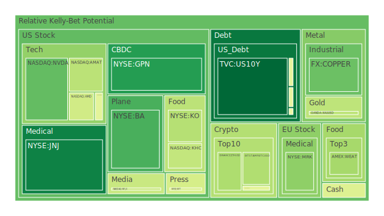
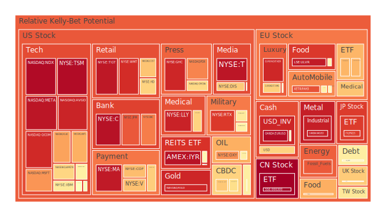
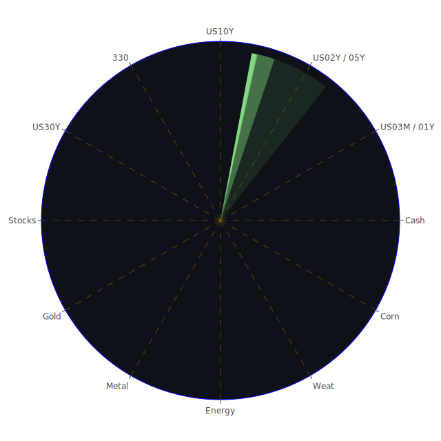

# **投資商品泡沫分析**

當前全球金融市場，在經濟數據與地緣政治多重因素的交織影響下，呈現出極為複雜且分歧的景觀。各類資產的價格動能與潛在風險並存，泡沫化的警訊在部分領域頻繁閃現，而在另一些領域則相對沉寂。以下將針對各主要資產類別，進行深入的泡沫分析與專業論述。

* **美國國債**

美國國債市場作為全球金融的定價之錨，其一舉一動皆牽動著市場的神經。從數據觀察，十年期國債（US10Y）的當日泡沫指數（D1）僅為0.085，處於極低水平，顯示市場短期內對其價格穩定性抱持高度共識。儘管近期聯準會官員發表了兩次鷹派言論，理論上應對債券價格構成壓力（即推高收益率），但市場的實際反應卻是收益率微幅走低，十年期收益率自上週的4.47%下降至4.39%。

此現象可從博弈論角度解讀：市場參與者或許正在進行一場與聯準會預期管理的博弈。他們可能認為，儘管官方言辭強硬，但經濟數據中隱含的風險，如商業地產與消費貸款的違約率攀升，將最終迫使貨幣政策轉向。因此，市場提前佈局了這種可能性，將資金泊入被視為避風港的國債。從歷史視角看，在經濟週期的轉折點，債券市場的價格行為往往領先於央行的實際行動。十年期與三個月期國債的利差（US Yield 10Y-03M）從去年的深度倒掛（-1.34%）回升至微幅為正（0.05%），這傳統上被視為經濟衰退風險下降的信號，但其微弱的正值也暗示著增長動能的匱乏。因此，國債市場目前的低泡沫狀態，是一種多方力量拉鋸下的脆弱平衡，是市場對未來不確定性投下的謹慎信任票。

* **美國零售股**

零售板塊內部呈現出顯著分化。以沃爾瑪（WMT）和塔吉特（TGT）為代表的必需消費品巨頭，其泡沫指數持續處於高位，沃爾瑪的月平均風險分數（D30）高達0.90，塔吉特更是接近0.94。這反映了在經濟前景不明朗時，資金向防禦性、現金流穩定的企業集中的社會心理。消費者即使縮減開支，也無法完全削減生活必需品的採購，這為這類企業提供了穩固的基本盤。新聞中提及的「Dollar General Stock Soars」也印證了折扣零售商在當前環境下的受歡迎程度。

然而，另一端如體育用品零售商Sportsman's Warehouse（SPWH）儘管財報強勁，股價卻應聲大跌，顯示市場對非必需消費品的前景極度悲觀。這背後的邏輯是，當消費者實際感受到還貸壓力（如FED數據顯示的消費者拖欠率上升）時，最先削減的便是非必要的娛樂和高端消費。因此，零售股的泡沫集中在「防禦」與「折扣」的敘事上，而對多數中端及非必需品類的零售商而言，市場情緒則極為悲觀，泡沫風險相對較低，但基本面壓力巨大。

* **美國科技股**

科技股，特別是半導體與人工智慧相關領域，是當前市場泡沫化最為顯著的區域。以納斯達克100指數（NDX）為例，其當日泡沫指數已攀升至0.978的極高水平，而作為AI晶片龍頭的輝達（NVDA），其新聞熱度與股價動能形成強力正回饋，新聞報導其市值飆升，成為全球最具價值公司，這種敘事極大地強化了市場的樂觀情緒。從社會心理學角度分析，這是一種典型的「錯失恐懼症」（FOMO）驅動的羊群行為，投資者唯恐錯過這場技術革命，從而不斷推高相關資產的估值，使其遠離傳統的基本面分析框架。

然而，泡沫的表象之下暗流湧動。台積電（TSM）的泡沫指數達到驚人的0.976，作為晶圓代工的核心，其高風險意味著整個半導體產業鏈都處於高度風險之中。與此同時，新聞中也出現了警訊，如雲端安全公司CrowdStrike發布了令人失望的第二季營收預測，導致股價下跌。這如同一道裂縫，揭示了並非所有科技公司都能均等地享受AI的紅利。這是一個重要的信號，表明市場的狂熱可能開始分化，從普漲轉向對個別公司實現AI盈利能力的嚴格審視。蘋果（AAPL）、微軟（MSFT）、Meta（META）等巨頭的泡沫指數均處於0.7至0.95之間的高位，顯示風險已全面擴散。一旦作為龍頭的輝達或台積電出現價格劇烈修正，其傳導效應將迅速波及整個科技板塊。

* **美國房地產指數**

美國房地產市場的信號極為混亂，相關指數如IYR和VNQ的泡沫分數均處於0.96以上的極高區域。這與基礎經濟數據形成了鮮明對比。一方面，聯準會數據明確指出「商業地產拖欠率處於相對高位」，且三十年期固定抵押貸款利率（Fixed Morgage 30Y Rate）高達6.85%，遠高於去年同期的2.96%，這對房地產市場應是重大利空。

這種矛盾可以用「預期博弈」和「結構性分化」來解釋。市場可能在押注聯準會將很快降息以挽救經濟，從而提前反應在對利率敏感的房地產指數上。此外，房地產市場並非鐵板一塊，商業地產（特別是辦公樓）的困境，與可能因供應短缺而依然堅挺的住宅市場，形成了不同景象。投資者可能認為，領先的房地產投資信託（REITs）能夠憑藉其優質資產組合和專業管理能力，穿越週期。然而，指數的高泡沫分數與疲軟的實體經濟數據之間巨大的背離，構成了顯著的風險。這意味著當前的價格很可能已完全消化了最樂觀的降息預期，一旦降息延遲或幅度不及預期，市場將面臨劇烈的回檔壓力。

* **加密貨幣**

以比特幣（BTCUSD）和以太幣（ETHUSD）為代表的加密貨幣市場，呈現出中等偏高的泡沫水平。比特幣的月平均風險分數約為0.50，以太幣約為0.42。相較於科技股的極度狂熱，加密市場的情緒顯得更為謹慎。近期價格雖有波動，但並未出現去年那樣的極端漲勢。

從市場心理學看，經歷了前幾輪的劇烈牛熊轉換後，投資者可能變得更加成熟，對單純的敘事炒作有所免疫。同時，加密貨幣作為一種與傳統金融體系關聯度較低的資產，其價格驅動因素更為複雜，包括監管政策的變化、技術升級的進展（如以太坊的後續發展）以及宏觀流動性的鬆緊。當前，聯準會數據顯示貨幣市場基金總資產（Money Market Funds Total Assets）正在攀升，意味著大量資金停泊在場外，這對加密貨幣等風險資產而言是潛在的資金來源，但前提是市場風險偏好需要回歸。DOGEUSD這類迷因幣的泡沫分數起伏不定，顯示投機情緒依然存在，但未能引發市場的普遍跟隨。加密市場正處於一個十字路口，等待下一個宏觀催化劑來決定方向。

* **金/銀/銅**

貴金屬與工業金屬的表現出現分化。黃金（XAUUSD）和白銀（XAGUSD）的泡沫指數異常之高，特別是白銀，其D14和D30指數均在0.94以上。黃金的月平均風險分數也達到0.56。這在美元相對強勢、實際利率為正的環境下，是不尋常的。傳統理論認為，這兩者應對黃金構成壓力。

這種現象的背後，可能反映了市場對更深層次風險的擔憂。首先是地緣政治風險，全球衝突與不確定性增加了黃金的避險屬性。其次，是對主權信用貨幣（特別是美元）長期價值的懷疑。聯準會數據顯示，「由外國持有的美國國債流通量」處於相對低位，這與多國央行增加黃金儲備的新聞相符，反映了一種全球性的「去美元化」趨勢。高達53.21的「金油比」（GOLD OIL RATIO），遠超歷史常態，也顯示相對於能源，黃金的避險價值被市場高度認可。

相比之下，作為經濟晴雨表的銅（COPPER），其泡沫分數雖在中等水平（約0.51），但近期有所回落。這暗示市場對全球實體經濟的復甦前景並不如對金融風險的擔憂那樣強烈。金、銀的高泡沫，更多是避險情緒和對沖貨幣貶值需求的體現，而非經濟繁榮的信號。

* **黃豆 / 小麥 / 玉米**

農產品市場的泡沫程度中等，且呈現波動。小麥（WEAT）的月平均風險分數約為0.38，玉米（CORN）約為0.48，黃豆（SOYB）則在0.56左右。這些商品的價格，除了傳統的供需與氣候因素外，也越來越受到宏觀金融環境的影響。例如，強勢美元會對以美元計價的農產品價格構成壓力。此外，能源價格也是一個關鍵的傳導路徑，高油價會增加農業生產的成本（化肥、運輸），從而支撐農產品價格。當前油價相對穩定但處於高位，為農產品價格提供了一定的成本支撐。然而，新聞中提及的「加拿大野火煙霧觸及歐洲」，這類極端氣候事件提醒我們，供應端的突發衝擊永遠是農產品市場最大的不確定性來源。目前的泡沫分數反映了市場在權衡宏觀壓力與潛在的供應風險。

* **石油/ 鈾期貨UX\!**

能源市場呈現出有趣的對比。美國石油（USOIL）的泡沫指數從高位回落，當日指數雖因短期反彈升至0.84，但其月平均值僅為0.37，顯示長期趨勢疲軟。這可能與市場對全球經濟增長放緩的擔憂有關，特別是新聞中提到的「美國五月汽車銷量驟降」，直接指向了終端需求的疲軟。

與此同時，鈾期貨（UX1\!）的泡沫指數維持在0.5左右的穩定水平。這背後是強勁的長期結構性需求。在全球追求能源轉型和能源安全的背景下，核能作為一種穩定的低碳能源，其重要性被重新評估。許多國家宣布新建或延長現有核電站的壽命，這為鈾創造了穩定而長期的需求。因此，石油價格更多反映的是短期經濟週期的波動，而鈾價則植根於更長期的能源戰略轉型敘事，兩者走勢的分化，是短期週期性因素與長期結構性趨感到徑的鮮明對比。

* **各國外匯市場**

外匯市場的波動性顯著，特別是與美元相關的貨幣對。美元兌日圓（USDJPY）的泡沫指數居高不下，月平均分數達到0.76，顯示市場對美日利差持續擴大的預期非常強烈。在聯準會維持鷹派立場的同時，日本央行仍在寬鬆的泥潭中掙扎，這為利差交易提供了溫床。

歐元兌美元（EURUSD）和英鎊兌美元（GBPUSD）的泡沫指數也處於高位，特別是歐元，D1指數高達0.97。這可能反映了市場在歐洲央行與聯準會政策路徑上的分歧進行博弈。荷蘭政府的倒台等政治新聞，增加了歐洲政治格局的不確定性，理論上對歐元不利，但高泡沫指數可能意味著市場正在定價一種「美元見頂」的預期，或者說，認為歐洲的通膨問題比美國更為棘手，迫使歐洲央行採取更激進的措施。澳幣兌美元（AUDUSD）的泡沫分數相對較低，反映出其作為商品貨幣，在全球經濟前景不明朗時承受的壓力。

* **各國大盤指數**

除了美國市場外，其他主要股指也呈現高泡沫風險。日本日經225指數（JPN225）的月平均風險分數高達0.85，台灣加權股價指數的代表0050 ETF的泡沫指數也處於高位。這兩者都受益於全球半導體產業鏈的強勁表現。

歐洲方面，德國DAX指數（GDAXI）和法國CAC40指數（FCHI）的泡沫分數處於中高水平。歐洲市場面臨的挑戰更為複雜，一方面要應對持續的通膨和能源問題，另一方面，其內部經濟增長動力不如美國。然而，歐洲奢侈品股（如LVMH的MC和Kering的KER）的泡沫指數極高，反映了全球財富效應下，高端消費的韌性，這部分需求對經濟週期的敏感度較低。中國滬深300指數（000300）的泡沫指數在近期急劇拉升，D1達到1.0的滿值，這可能與市場預期中國政府將推出更強力的經濟刺激措施有關，屬於典型的政策市博弈。

* **美國半導體股**

此板塊是本輪市場泡沫的核心。除了前述的輝達和台積電，其他關鍵企業如應用材料（AMAT）、科林研發（KLAC）、高通（QCOM）、超微（AMD）、英特爾（INTC）和美光（MU）等，無一不處於中高至極高風險區域。高通的月平均泡沫指數高達0.82，台積電更是超過0.94。這反映了市場將整個產業鏈視為一個單一的「AI載體」進行投資。

然而，內部存在溫度差。英特爾（INTC）和美光（MU）的泡沫分數相對較低，這與它們在AI晶片核心競爭中的追趕者地位有關。這提供了一個視角：市場的狂熱主要集中在處於領導地位、掌握定價權的公司。相對價格關係在此處極為重要，輝達相對於英特爾的估值溢價，達到了歷史性的高度。這種極端的估值分層，本身就是一個風險信號，表明市場可能過度獎勵了領先者，而低估了追趕者的潛力或整個行業面臨的週期性風險。

* **美國銀行股**

銀行股，包括摩根大通（JPM）、美國銀行（BAC）、花旗（C）和第一資本（COF），其泡沫指數普遍處於高位，特別是美國銀行，其月平均風險分數接近0.95。這與聯準會數據中高漲的貸款拖欠率形成了尖銳的矛盾。

一個合理的解釋是，市場可能認為最壞的時期已經過去。新聞中「富國銀行（Wells Fargo）資產上限被解除」的事件，被市場解讀為監管環境趨於寬鬆的重大利好，這極大地提振了整個行業的信心。博弈論的角度看，投資者可能在押注，銀行作為經濟的核心，不會被允許出現系統性風險，即存在隱性的「政府兜底」預期。然而，從歷史上看，1980年代的儲貸危機和2008年的金融海嘯都始於對房地產和信貸風險的低估。當前的高泡沫分數，表明市場再次選擇性地忽視了資產負債表上明顯的風險信號。

* **美國軍工股**

洛克希德·馬丁（LMT）、諾斯洛普·格魯曼（NOC）和雷神技術（RTX）等軍工股的泡沫指數處於高位，且持續攀升。例如，雷神的月平均風險分數高達0.87。這背後的驅動力十分清晰：全球地緣政治緊張局勢的加劇。從烏克蘭到中東，再到亞太地區，不斷升溫的衝突和對抗，直接轉化為各國國防預算的增加和對先進武器系統的訂單。

這類股票的投資邏輯，在本質上是對沖地緣政治風險。其價格與全球的和平穩定程度呈現負相關。從社會學角度看，這反映了全球範圍內安全感的下降和對「硬實力」的重新重視。只要國際關係持續緊張，軍工複合體的訂單就能得到保障。然而，風險在於，一旦出現超預期的和平進程或外交突破，可能導致市場對未來訂單的預期逆轉，從而引發板塊性的回調。

* **美國電子支付股**

威士（V）、萬事達卡（MA）、美國運通（AXP）和PayPal（PYPL）等電子支付公司，其泡沫指數普遍非常高，威士和萬事達卡的月平均風險分數均超過0.80。這反映了市場對全球消費從現金轉向電子的長期結構性趨勢抱有堅定信念。這些公司掌握了全球支付的基礎設施，具有強大的網絡效應和定價權，構成了寬闊的護城河。

然而，PayPal的泡沫指數相對較低且波動較大，這暗示了行業內部的競爭格局正在發生變化。新興的金融科技公司和「先買後付」（BNPL）等模式，對傳統支付巨頭的市場份額構成了挑戰。此外，全球消費者的消費能力，是這些公司業績的根本。聯準會數據顯示的消費者信貸拖欠率上升，是對其未來增長的一個潛在威脅。高泡沫分數表明，市場可能過於看重其結構性優勢，而低估了週期性下行和競爭加劇的風險。

* **美國藥商股** 大型製藥公司內部出現顯著分化。禮來（LLY）的泡沫指數達到了0.93的極高水平，而嬌生（JNJ）則僅有0.18。這種差異的核心在於「爆款藥物」的敘事。禮來憑藉其在減肥藥和糖尿病領域的突破性產品，獲得了市場極高的增長預期，投資者願意為此支付極高的估值溢價。這是一種典型的「成長型投資」邏輯，關注的是未來的潛力而非當前的價值。

與此同時，像嬌生（JNJ）、默克（MRK）這類產品線更多元化、增長更穩定的傳統藥企，雖然基本面穩固，但在當前追逐高成長的市場氛圍中，未能獲得同等的關注，其泡沫指數也因此較低。這揭示了當前市場的一種心理偏好：寧願為一個激動人心的未來故事支付高價，也不願為一個穩定但乏味的現在支付合理的價格。這使得禮來等明星股的風險極高，因為任何關於其核心藥物專利、副作用或競爭格局的負面消息，都可能導致估值的急劇崩潰。

* **美國影視股** 影視媒體行業正處於轉型的陣痛中，相關公司的泡沫指數普遍偏高，但背後的邏輯充滿矛盾。迪士尼（DIS）的月平均泡沫指數高達0.74，Netflix（NFLX）約為0.47，而派拉蒙全球（PARA）則在0.46左右。高指數反映了市場對這些公司在流媒體戰爭中最終能夠實現盈利的預期。

然而，Warner Bros Discovery股東否決高管薪酬方案的新聞，以及迪士尼樂園的鬥毆事件，從側面揭示了行業內部的管理混亂和消費者體驗問題。從博弈論角度看，流媒體平台之間為了爭奪用戶而進行的內容投入競賽，是一場典型的「膽小鬼博弈」，誰先退縮削減開支，就可能失去市場份え，但持續投入又會不斷侵蝕利潤。高泡沫分數與不穩定的盈利前景之間的矛盾，是該行業核心的風險所在。

* **美國媒體股** 傳統媒體與新媒體的界限日益模糊，其泡沫指數也反映了這種掙扎。紐約時報（NYT）的泡沫指數極高，月平均達到0.75，而福斯公司（FOX）也處於0.81的高位。這表明市場相信，擁有強大品牌和獨家內容的媒體公司，能夠在碎片化的信息時代中成功轉型，並實現數位訂閱的增長。

然而，新聞中「川普要求國會削減對NPR、PBS的資助」，顯示了政治對媒體行業的深刻影響。媒體的公信力和黨派立場，成為其商業模式的一部分，這在社會撕裂的環境下既是機遇也是風險。從社會學角度看，媒體正在從「公共知情權的守護者」轉變為「特定價值觀社群的服務者」。這種轉變或許能鞏固其特定用戶群，但也使其面臨來自對立陣營的政治壓力和抵制。

* 石油防禦股  
  以埃克森美孚（XOM）和西方石油（OXY）為代表的石油股，其泡沫指數處於中高水平，月平均分數分別為0.79和0.72。在傳統認知中，石油股是典型的週期股，但當前市場似乎賦予了其一定的「防禦」屬性。這背後的邏輯是，在全球能源供應鏈脆弱、地緣政治風險高企的背景下，擁有優質油氣資產的公司，其戰略價值凸顯。它們不僅能從高油價中獲益，也能在通膨環境下起到保值作用。BlackRock因其ESG政策退縮而被德州移出抵制名單，也顯示了傳統能源在現實世界中的政治與經濟力量。然而，其防禦屬性是建立在高油價預期之上的，一旦全球經濟陷入深度衰退，需求崩潰將使其週期性風險暴露無遺。  
* 金礦防禦股  
  金礦股如Royal Gold（RGLD）的泡沫指數極高，月平均接近0.92。其走勢與黃金價格高度相關，但往往帶有更高的貝他係數（beta）。金礦股可以被視為一種對黃金價格的槓桿化投資。當投資者預期黃金將進入牛市時，他們會湧入金礦股以期獲得超額收益。當前金礦股的高泡沫，完全是建立在黃金本身價格高企且預期持續上漲的基礎之上的。它繼承了黃金所有的避險、抗通膨和對沖貨幣貶值的邏輯，並將其放大。其風險也同樣被放大：一旦黃金價格因美元意外走強或實際利率上升而回落，金礦股的跌幅將遠超黃金本身。  
* 歐洲奢侈品股  
  LVMH集團（MC）、開雲集團（KER）和愛馬仕（RMS）等歐洲奢侈品巨頭，其泡沫指數長期維持在高位。開雲集團的月平均風險分數接近0.90。這類股票展現了超越經濟週期的強大韌性。其核心邏輯在於，其服務的客群是全球最頂層的富裕階層，這部分人群的消費能力幾乎不受宏觀經濟波動的影響。從社會學角度看，奢侈品不僅是商品，更是社會地位和身份認同的符號，這種符號價值在貧富差距拉大的時代甚至會被強化。因此，只要全球財富持續向少數人集中，奢侈品行業的增長引擎就不會熄火。風險在於針對性的財富稅、地緣政治衝突導致的特定市場（如大中華區）需求銳減，或是品牌自身出現的聲譽危機。  
* 歐洲汽車股  
  歐洲汽車製造商如賓士（MBG）、寶馬（BMW）和保時捷（PAH3），其泡沫指數處於中等偏高水平，但顯著低於美國的特斯拉（TSLA）。這反映了市場對傳統車企在電動化轉型過程中的疑慮。它們面臨著來自特斯拉和中國新興電動車品牌的雙重夾擊。一方面，它們需要投入巨資進行電動化研發和生產線改造；另一方面，它們在軟體和自動駕駛領域的進展普遍被認為落後於競爭對手。相對合理的泡沫分數，既體現了其強大的品牌價值和製造工藝，也包含了對其轉型前景不確定性的折價。  
* 歐美食品股  
  食品股，如雀巢（NESN）、卡夫亨氏（KHC）、可口可樂（KO）和聯合利華（ULVR），作為典型的防禦性板塊，其泡沫指數普遍處於高位。聯合利華的月平均風險分數高達0.94。其邏輯與零售股中的必需消費品類似：無論經濟如何波動，人們總需要吃喝。這些公司擁有強大的品牌、廣泛的分銷網絡和定價權，能夠將部分成本上漲轉嫁給消費者。在一個不確定的世界裡，這種確定性本身就成為了稀缺品，吸引了大量避險資金的追捧。然而，極高的泡沫分數也意味著其價格已經完全反映了這些優勢，安全邊際極低。任何利潤率的意外下滑或消費者轉向更廉價的自有品牌，都可能導致估值的高位回落。

# **宏觀經濟傳導路徑分析**

當前的宏觀經濟格局，由一條核心主線貫穿：聯準會的鷹派立場與市場對經濟衰退的擔憂之間的持續博弈。這條主線引發了多條傳導路徑。

路徑一：鷹派預期與資產定價。聯準會的鷹派講話和高位的聯邦基金利率，直接推高了短期國債收益率（如三個月期國債收益率高達4.34%）。這提升了無風險回報率，對所有風險資產的估值模型都構成了壓力，尤其是對那些依賴未來現金流折現的成長型科技股（如NVDA、META）。高利率環境也使得企業和消費者的借貸成本增加，抑制了投資和消費，最終可能傳導至企業盈利的下滑。新聞中美國汽車銷量的下滑，便是此傳導路徑的直接體現。

路徑二：避險情緒與資金流向。儘管聯準會立場鷹派，但經濟數據中商業地產和消費者的拖欠率攀升，引發了市場對經濟硬著陸的深層憂慮。這種憂慮情緒觸發了避險需求，資金從高風險資產流出，尋找避風港。這解釋了為何在鷹派言論下，長期國債收益率不升反降，以及黃金、白銀價格在強美元環境下依然能創出新高。這是一條典型的「恐懼傳導路徑」。

路徑三：全球貨幣政策分化與外匯波動。美國維持高利率，而日本等經濟體仍深陷寬鬆，歐洲則在抗通膨與保增長之間搖擺。這種政策分化導致了劇烈的外匯波動，特別是美元兌日圓（USDJPY）的持續走強。強勢美元一方面吸引國際資本流入美國，支撐其資產價格；另一方面則對新興市場構成資本外流壓力，並壓低以美元計價的商品價格。

# **微觀經濟傳導路徑分析**

在企業和行業層面，傳導路徑更加具體而直接。

路徑一：AI產業鏈的內部傳導。AI的狂熱始於上游的晶片設計（NVDA）和製造（TSM），然後向下傳導。首先受益的是伺服器和硬體製造商（如HP Enterprise），其強勁財報便得益於此。隨後，大型雲端服務商（AMZN的AWS、MSFT的Azure）通過提供算力服務而獲利。然而，傳導至下游的軟體應用層面時，則出現了分化。CrowdStrike的案例表明，並非所有軟體公司都能輕易地將AI轉化為收入和利潤。這條路徑揭示了，技術紅利在產業鏈中的分配是不均勻的，上游的壟斷者攫取了大部分利潤。

路徑二：成本傳導與利潤擠壓。能源價格（石油、天然氣）雖然有所回落，但仍處於歷史高位。這作為基礎成本，通過運輸和製造，向上游的農產品（化肥成本）、工業品傳導，最終影響到下游的零售和食品行業。可口可樂（KO）、雀巢（NESN）等公司憑藉其品牌力，可以將部分成本轉嫁給消費者，維持利潤率。但對於議價能力較弱的中小企業，則面臨著嚴重的利潤擠壓。

路徑三：消費者行為的變化傳導。聯準會數據顯示的消費者拖欠率上升，是一個關鍵的微觀起點。這首先衝擊的是非必需消費品，如中端汽車、非必需的電子產品和旅遊娛樂。這條路徑解釋了為何特斯拉銷量承壓，而折扣零售商Dollar General的股價卻能上漲。消費降級的趨勢，會沿著供應鏈向上反噬，最終影響到相關行業的每一個環節。

# **資產類別間傳導路徑分析**

不同資產類別之間的漣漪效應，構成了複雜的市場互動網絡。

路徑一：利率 \-\> 科技股 \-\> 避險資產。這是一條經典的傳導路徑。當國債收益率（特別是長天期）上升時，科技股的估值會受到壓力，因為其未來盈利的折現值下降。科技股的下跌會引發市場的避險情緒，資金可能轉而流入國債、黃金或防禦性股票（如公用事業、必需消費品），形成一個循環。

路徑二：美元 \-\> 商品 \-\> 新興市場。美元的強弱是全球資產價格的關鍵變數。強勢美元通常會壓低以其計價的黃金（XAUUSD）、石油（USOIL）和銅（COPPER）的價格。同時，強美元也意味著新興市場貨幣相對貶值，可能引發資本從新興市場流出，對其股市和債市造成雙重打擊。

路徑三：地緣政治 \-\> 軍工/能源 \-\> 全球股市。當特定地區爆發衝突，最直接的反應是軍工股（LMT, RTX）和相關能源（石油）價格的上漲。這種避險情緒和通膨預期會迅速擴散至全球股市，引發普遍的拋售。黃金作為傳統的避險工具，在此路徑中也會受到提振。這條路徑的特點是傳導迅速、影響廣泛。

路徑四：黃金 \-\> 金礦股。這是一條直接且相關性極高的傳導路徑。黃金價格的上漲，會直接提升金礦公司（RGLD）的盈利預期，從而驅動其股價以更高的彈性上漲。反之亦然。這是一個典型的、資產與其衍生/相關公司之間的價格傳導。

# **投資建議**

基於上述分析，我們在充分認知市場泡沫風險的前提下，提出針對不同風險偏好的資產配置建議。所有配置均旨在通過不同資產間的低相關性，優化風險調整後的回報。

**穩健型投資組合 (總和100%)**

此組合旨在最大限度地保全資本，並獲取超越通膨的穩健回報，適合風險承受能力較低的投資者。

* **40% 美國短期國債 (以US03MY為代表):** 在當前高利率環境下，短期國債提供了具吸引力且風險極低的收益。其極低的泡沫分數（D30約0.33）和與風險資產的負相關性，使其成為投資組合的壓艙石。  
* **30% 美國十年期國債 (US10Y):** 泡沫指數極低（D1僅0.085），在經濟衰退預期升溫時，能提供資本利得的潛力。配置長短期國債，可以平衡收益率和利率風險。  
* **30% 嬌生 (JNJ):** 作為大型綜合性醫療保健公司，其業務不受經濟週期影響，且當前泡沫指數處於0.18的低位，提供了顯著的安全邊際。在市場動盪時，其防禦屬性將會凸顯。

**成長型投資組合 (總和100%)**

此組合尋求在可控風險下，捕捉市場的主要增長趨勢，適合有一定風險承受能力，追求資本增值的投資者。

* **40% 微軟 (MSFT):** 雖然泡沫指數偏高（D30約0.70），但其在AI領域（特別是通過對OpenAI的投資和Azure雲服務）的領導地位和強勁的盈利能力，使其成為分享AI紅利的相對穩妥的選擇。其多元化的業務也提供了比純晶片股更好的風險分散。  
* **30% 摩根大通 (JPM):** 儘管銀行業面臨信貸風險，但摩根大通作為行業領袖，擁有最穩健的資產負債表和多元化的收入來源。其高泡沫分數（D30約0.80）反映了市場對其龍頭地位的認可。在一個潛在的「大浪淘沙」的行業環境中，強者恆強的邏輯將會應驗。  
* **30% 埃克森美孚 (XOM):** 配置能源股旨在對沖潛在的通膨風險和地緣政治風險。石油價格與多數金融資產的相關性較低。XOM（D30約0.79）作為行業巨頭，能提供穩定的股息，並在全球能源轉型中仍佔有重要地位。

**高風險投資組合 (總和100%)**

此組合旨在通過承擔高風險，博取超額回報，僅適合風險承受能力極高，且對市場有深刻理解的投資者。

* **40% 台積電 (TSM):** 泡沫指數極高（D1達0.976），但作為全球AI晶片製造的命脈，其在產業鏈中的地位無可替代。投資TSM是對AI革命核心基礎設施的最直接押注，高風險與高回報潛力並存。  
* **30% 比特幣 (BTCUSD):** 加密貨幣作為一種另類資產，與傳統金融市場的相關性較低，能提供有效的投資組合分散。雖然波動巨大，但其「數位黃金」的敘事和機構採用的長期趨勢，為其提供了巨大的上行想像空間。其中等的泡沫分數（D30約0.50）表明當前的狂熱程度尚不及科技股。  
* **30% 禮來 (LLY):** 其極高的泡沫指數（D30達0.93）完全由其在減肥藥等領域的爆款產品驅動。這是一場對生物科技突破和未來市場需求的豪賭。一旦成功，其增長潛力巨大，但任何挫折都可能導致股價劇烈回調。

# **風險提示**

投資有風險，市場總是充滿不確定性。本報告完全基於給定時間點的數據和新聞進行分析，不構成任何投資要約或承諾。過去的表現不能預示未來的回報，泡沫指數高低也僅為一種風險參考，不代表價格必然上漲或下跌。市場情緒和基本面都可能在短時間內發生劇烈變化。我們的建議僅供參考，投資者應根據自身的風險承受能力、財務狀況和投資目標，在進行獨立思考和深入研究後，做出自己的投資決策。

 
Daily Buy Map:

 
Daily Sell Map:

 
Daily Radar Chart:

 
