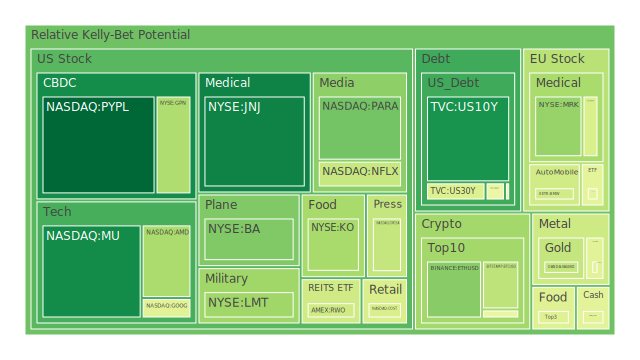
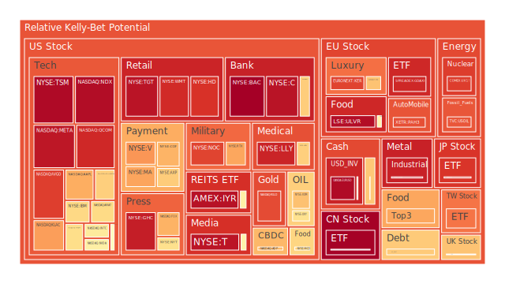
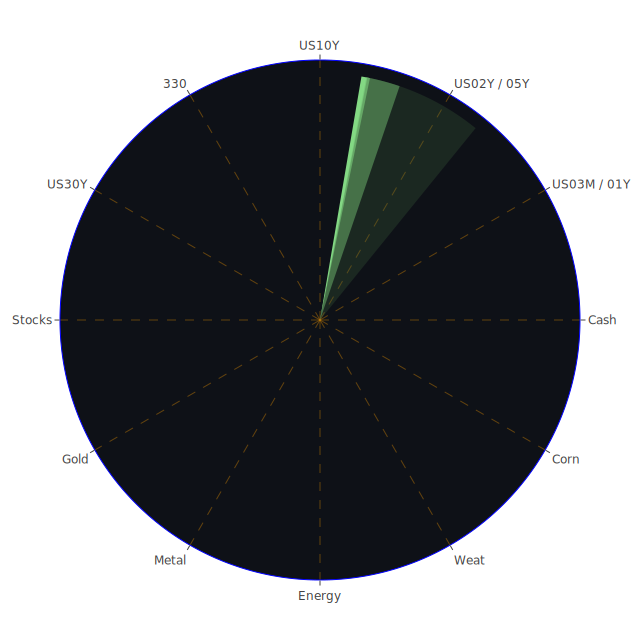

# **投資商品泡沫分析**

在當前2025年6月的宏觀環境下，全球金融市場正處於一個複雜而微妙的平衡點。一方面，由人工智能（AI）革命引發的樂觀情緒，持續推動特定板塊走向歷史新高；另一方面，持續的利率壓力、潛在的經濟放緩跡象以及不斷加劇的地緣政治緊張局勢，為市場蒙上了一層濃厚的陰影。這種正反力量的交織，形成了一個充滿機遇與風險的投資格局。本報告將深入剖析各大類資產的現狀，並探討其潛在的傳導路徑與投資策略。

* **美國國債** 美國國債市場正處於一個關鍵的轉折點。從數據上看，短期國債（如三個月、一年、兩年期）與長期國債（十年、三十年期）的泡沫風險指數相對分化但整體處於中等水平。例如，十年期美國國債（US10Y）的當前風險評分約為0.15，相較於其他資產類別，顯得較為安全。然而，我們必須觀察到更深層次的動態。

從時間維度看，去年此刻，殖利率曲線呈現深度倒掛（例如10年期與3個月期利差為-1.35%），這是市場對未來經濟衰退的強烈預期。如今，利差已轉正至0.16%，這種陡峭化過程，在歷史上往往是經濟衰退即將發生或正在發生的信號，因為市場開始定價聯準會未來的降息週期。然而，矛盾的是，近一個月所有期限的國債殖利率均在上升，這反映了來自聯準會的鷹派言論（近期有兩次鷹派發言，無鴿派發言）以及市場對通膨黏性的擔憂。

這種現象可以理解為一種博弈：市場交易員預期經濟放緩將迫使聯準會降息（ thesis），但聯準會為了控制通膨，又不得不維持鷹派立場（antithesis）。其結果是，債券市場充滿了不確定性，價格波動加劇（synthesis）。投資者一方面因經濟衰退預期而買入長債，另一方面又因當前的鷹派政策而拋售，導致長債殖利率處於高位震盪。聯邦基金利率期貨（OIS）與固定抵押貸款利率的高企，都證實了當前資金成本的壓力依然巨大。

* **美國零售股** 零售股呈現出明顯的K型分化。沃爾瑪（WMT）與好市多（COST）這類必需品零售巨頭，其泡沫指數持續處於高位（WMT的月平均風險分數高達0.9，COST亦在0.56以上），顯示資金持續湧入這些被視為具有防禦性的股票。這反映了一種社會心理學現象：在經濟不確定性增加時，消費者會縮減非必要開支，資金會從高端消費流向性價比高的必需品消費。新聞也證實了這一點，指出「美元店正在看到高收入購物者湧入」，這本身就是一個經濟警訊。

與此相對，目標百貨（TGT）的風險指數也極高（超過0.95），但其基本面可能面臨更大挑戰。而ChargePoint（CHPT）和Tilly's（TLYS）等非必需品或成長型零售商，則面臨著銷售不如預期的困境，其股價波動劇烈。這形成了鮮明的對比：市場在獎勵確定性（沃爾瑪），同時在懲罰不確定性（ChargePoint）。這種空間上的分化，是宏觀經濟壓力在微觀企業層面的直接體現。

* **美國科技股** 科技股是當前市場的核心驅動力，同時也是泡沫風險最集中的領域。以納斯達克100指數（NDX）為代表，其月平均風險評分高達0.75，近期更是飆升至0.97，顯示出極度的市場亢奮。這場狂熱的核心，無疑是圍繞AI展開的。

從概念上看，這是一場由強大敘事（AI將重塑世界）所主導的行情（thesis）。這種敘事吸引了大量資金，推動了如輝達（NVDA）、微軟（MSFT）、Meta（META）等公司的估值達到極高水平。然而，反作用力同樣強大（antithesis）：蘋果（AAPL）因AI競爭激烈而被降級，特斯拉（TSLA）因銷售數據疲軟而股價下滑，這些信號表明，即便是行業巨頭也並非無懈可擊。更重要的是，聯準會的報告明確指出「經濟正在放緩」，關稅問題也讓企業感到困惑。

這兩股力量的合成（synthesis）結果是，科技股內部出現了劇烈分化。資金高度集中於少數幾家被認為是AI革命最終贏家的公司，例如台積電（TSM）的泡沫指數已接近1.0的極限值，顯示其承載了市場最極端的期望。與此同時，像英特爾（INTC）這樣的傳統晶片巨頭，其風險指數相對較低（約0.57），反映出市場對其轉型前景的疑慮。這種分化本身就是一個警訊，表明市場的廣度正在收窄，由少數股票支撐的漲勢往往更為脆弱。這類似於1990年代末的網路泡沫，當時市場也只追逐與「網路」相關的龍頭股，而忽視了整體經濟的基本面。

* **美國房地產指數** 美國房地產市場的風險信號非常明確。相關指數如IYR和VNQ的泡沫指數均處於極高水平（IYR的D14和D30均值超過0.9），顯示出嚴重的泡沫化傾向。背後的驅動因素是矛盾的。一方面，在經濟不確定時期，房地產作為實物資產被視為抗通膨的工具。另一方面，FED數據顯示，商業地產、消費者和房地產的拖欠率都處於「相對高位」。

三十年期固定抵押貸款利率高達6.85%，遠高於去年同期的2.93%，這對新的購房者構成了巨大的負擔。這形成了一個危險的組合：資產價格處於高位，而融資成本和違約風險也在同步上升。這是一個典型的負反饋循環的開端：高利率壓制需求，高違約率促使銀行收緊信貸，進而可能導致資產價格的回調。從博弈論角度看，當前的持有者在賭聯準會能夠在不刺破泡沫的情況下成功轉向，而潛在的買家則在等待價格的修正。

* **加密貨幣** 以比特幣（BTCUSD）和以太幣（ETHUSD）為首的加密貨幣市場，呈現出與主流風險資產既同步又分離的特性。其泡沫指數處於中高水平（比特幣約0.4，以太幣約0.3），相較於科技股的極端亢奮，顯得更為「理性」。

從概念上講，加密貨幣的支持者將其視為對沖法幣體系風險的「數位黃金」（thesis）。在政府債務高企、貨幣超發的背景下，這種敘事具有強大的吸引力。然而，其作為高風險投機資產的屬性，使其價格與納斯達克指數等風險指標高度相關，尤其是在市場流動性收緊時，會面臨巨大的拋售壓力（antithesis）。

當前的狀態（synthesis）是，加密貨幣市場正在努力尋找自身的定位。一方面，Stablecoin發行人Circle的成功IPO，顯示出該行業正逐步走向合規化和主流化。另一方面，像狗狗幣（DOGEUSD）這樣純粹由社群情緒驅動的資產，其價格波動依然巨大，泡沫分數在0.47左右徘徊，提醒著我們這個市場的投機本質。加密貨幣的未來，將取決於它究竟是成為新的資產類別，還是僅僅是風險偏好的終極溫度計。

* **金/銀/銅** 貴金屬與工業金屬市場呈現出不同的景象。黃金（XAUUSD）和白銀（XAGUSD）的泡沫指數極高，尤其是白銀，其月平均風險分數超過0.92。這反映了強烈的避險需求和對未來貨幣寬鬆的預期。黃金/石油比率高達51.14，遠高於歷史常態，顯示相對於能源，黃金的定價非常昂貴。這可以解讀為市場對經濟增長的悲觀（石油需求下降）和對金融穩定性的極度擔憂（黃金需求上升）。金礦股如RGLD的風險指數同樣處於0.9以上的高位，顯示整個產業鏈都處於亢奮狀態。

相比之下，銅（COPPER）作為全球經濟的「溫度計」，其泡沫指數約為0.5，處於中等水平，但近期有所回落。這與全球製造業數據的疲軟和對經濟放緩的擔憂相符。黃金與銅的價格比率（GOLD COPPER RATIO）處於685的歷史高位，這是一個經典的衰退信號，表明避險情緒遠遠壓倒了對經濟增長的樂觀情緒。

* 黃豆 / 小麥 / 玉米  
  農產品市場的泡沫指數處於中等水平（WEAT約0.4，CORN約0.6，SOYB約0.7）。這些商品的價格更多受到天氣、地緣政治（如黑海走廊的運輸問題）和季節性供需的影響。加拿大野火等新聞事件可能對全球糧食供應鏈造成干擾。在宏觀層面，美元的強弱和全球經濟增長前景，也會影響對這些大宗商品的需求。目前看來，農產品市場並未出現極端的泡沫，但其價格波動性不容忽視，可以作為對沖其他金融資產風險的潛在工具。  
* 石油/ 鈾期貨UX\!  
  能源市場呈現分化。美國石油（USOIL）的泡沫指數從一個月前的低位（約0.36）顯著攀升至近期的0.84，但隨後又有所回落。這反映了市場在經濟放緩（需求下降）和OPEC+減產（供應減少）之間的搖擺。從社會學角度看，高油價會加劇通膨，侵蝕消費者購買力，對零售和非必需品消費構成壓力，形成負反饋。

鈾期貨（UX1\!）的泡沫指數在近期大幅飆升至0.88，一個月前僅為0.5左右。這反映了全球對核能作為清潔、穩定基載能源的重新評估，尤其是在能源轉型和地緣政治導致化石燃料供應不穩定的背景下。這是一條獨立於主流經濟週期的長期敘事，吸引了大量投機和戰略性資金。

* **各國外匯市場** 外匯市場是全球資本流動和利率預期的直接體現。美元兌日圓（USDJPY）的泡沫指數極高（月平均超過0.76，近期更一度觸及0.84的高位），這反映了美國和日本之間巨大的利率差距。市場在賭日本央行無法在不引發自身債務危機的情況下大幅升息，因此做空日圓成為一種擁擠的交易。

歐元兌美元（EURUSD）和英鎊兌美元（GBPUSD）的泡沫指數同樣處於高位（EURUSD超過0.9）。這可能反映了市場對歐洲央行（ECB）和英國央行（BOE）在應對通膨和經濟放緩方面所面臨的困境，其政策空間可能比聯準會更小。歐洲央行降息的新聞，可能會在短期內對歐元構成壓力。

* 各國大盤指數  
  全球主要股指普遍處於高風險區域。除了上文提到的納斯達克指數，日本日經225指數（JPN225）和德國DAX指數（GDAXI）的泡沫指數也分別在0.85和0.5以上。台灣的0050 ETF風險指數也高達0.8以上。這表明當前的樂觀情緒具有一定的全球性，但根基並不穩固。值得注意的是，中國滬深300指數（000300）的泡沫指數在數據末尾達到了1.0的極值，這通常意味著市場處於一個極不穩定的狀態，可能面臨劇烈的雙向波動。全球市場的高度相關性意味著，任何一個主要經濟體的危機，都可能迅速傳導至其他市場。  
* 美國半導體股  
  這是AI狂熱的震央。台積電（TSM）的風險接近極限，輝達（NVDA）和超微（AMD）的風險評分也居高不下。高通（QCOM）、博通（AVGO）、應用材料（AMAT）和科磊（KLAC）等整個產業鏈的公司，其泡沫指數普遍處於0.7以上的高風險區間。這是一個典型的「概念驅動」市場，其估值已經遠遠脫離了傳統的市盈率等指標。當前的市場參與者，更像是在進行一場凱因斯所謂的「選美競賽」，他們買入不是因為認為股票便宜，而是因為他們相信其他人會在更高的價格上接盤。這種博弈一旦信心動搖，就可能發生踩踏。美光（MU）是個例外，其泡沫指數顯著低於同行（約0.13），可能意味著它被市場低估，或者其產品線（主要是記憶體）被認為在AI浪潮中的受益程度不如邏輯晶片。  
* 美國銀行股  
  銀行股的風險指數極高，美國銀行（BAC）、花旗（C）、摩根大通（JPM）的泡沫指數均超過0.9。這是一個令人極度警惕的信號。一方面，高利率環境擴大了銀行的淨息差，有利於利潤（thesis）。但另一方面，我們從FED數據中看到，商業地產、房地產和消費者的拖欠率正在上升，這意味著潛在的信貸損失巨大（antithesis）。同時，殖利率曲線的波動和未實現的債券投資組合損失，依然是懸在銀行頭上的達摩克利斯之劍。銀行股的高泡沫指數與實體經濟的風險信號（高拖欠率）形成了尖銳的矛盾，這暗示市場可能正在忽視潛在的系統性風險（synthesis）。  
* 美國軍工股  
  軍工股如洛克希德馬丁（LMT）、諾斯洛普格魯曼（NOC）和雷神（RTX）的泡沫指數處於高位且持續攀升。這背後是清晰的地緣政治邏輯。從以色列的國防交易創紀錄，到烏克蘭戰事，再到全球範圍內國防開支的普遍增加，都為這些公司提供了穩定的訂單流。這是一個獨立於經濟週期的增長動力。從社會學角度看，全球安全感的下降，直接轉化為對軍工產品的需求。投資這些股票，本質上是在對沖一個更加動盪和分裂的世界秩序。  
* 美國電子支付股  
  Visa（V）、萬事達卡（MA）、美國運通（AXP）等支付巨頭的泡沫指數非常高，普遍在0.8甚至0.9以上。這反映了它們強大的市場地位和持續的盈利能力。然而，它們的業務與消費者支出密切相關。在消費者拖欠率上升、經濟放緩的大背景下，其高估值面臨挑戰。PayPal（PYPL）的泡沫指數相對較低（約0.06），顯示其在激烈的競爭中面臨增長困境，已被市場拋棄。Global Payments（GPN）的風險指數也相對溫和。這表明，即便在一個強大的行業中，市場的分化也在加劇。  
* 美國藥商股  
  大型藥廠如禮來（LLY）、默克（MRK）、嬌生（JNJ）、艾伯維（ABBV）等，表現各異。禮來因其減肥藥和阿茲海默症藥物的巨大潛力，泡沫指數高達0.93，是典型的由革命性產品驅動的成長股。嬌生的泡沫指數則非常低（約0.12），顯示其作為一個龐大而穩定的醫療集團，被視為避風港。諾和諾德（NVO）和艾伯維的風險指數則處於中高水平。這個行業同時具備防禦性（人口老化帶來的穩定需求）和高成長性（突破性新藥），為投資者提供了多樣的選擇。  
* 美國影視股  
  影視股如迪士尼（DIS）和Netflix（NFLX）的泡沫指數處於中高水平（約0.5-0.6）。它們面臨著從有線電視向串流媒體轉型的結構性挑戰，以及日益激烈的內容競爭。迪士尼試圖阻止YouTube挖角的失敗，顯示了人才競爭的激烈。這些公司需要巨大的資本投入來製作內容，而在高利率環境下，這變得更加困難。派拉蒙全球（PARA）的泡沫指數相對較低，反映了其在行業整合中的不確定地位。  
* 美國媒體股  
  媒體股如紐約時報（NYT）和福斯（FOX）的泡沫指數處於高位。這可能反映了在一個信息爆炸和充滿不確定性的時代，市場對權威信息來源和特定意識形態媒體的需求。然而，它們的商業模式同樣面臨來自社交媒體和新興平台的巨大挑戰。  
* 石油防禦股  
  石油巨頭如埃克森美孚（XOM）和西方石油（OXY）的風險指數處於中高區間（約0.6-0.7）。它們受益於高油價，並提供可觀的股息，使其在尋求收益的投資者中具有吸引力。巴菲特對西方石油的持續投資，也為其提供了心理上的支撐。然而，它們的命運與波動劇烈的石油市場緊密相連，同時也面臨能源轉型的長期壓力。  
* 金礦防禦股  
  如前所述，金礦股（RGLD）的泡沫指數處於極高水平。它們是黃金價格的槓桿化投資。在黃金本身已經非常昂貴的背景下，投資金礦股意味著雙重槓桿，風險極高。這是一種純粹的動量和避險情緒交易。  
* 歐洲奢侈品股  
  路威酩軒（MC）、開雲集團（KER）、愛馬仕（RMS）等奢侈品股的泡沫指數處於中高至極高水平。它們的業績與全球高淨值人群的財富效應密切相關。當前科技股泡沫創造的財富，一部分轉化為了對奢侈品的需求（thesis）。然而，全球經濟放緩，特別是重要市場（如中國）的消費前景不明，對其構成了威脅（antithesis）。這些公司的高泡沫指數，表明市場仍在為其品牌護城河和定價權支付高昂的溢價，但任何關於全球財富效應逆轉的信號，都可能導致其估值的迅速回調（synthesis）。  
* 歐洲汽車股  
  德國汽車製造商如寶馬（BMW）和賓士（MBG）的泡沫指數處於中等水平（約0.5）。它們正處於從傳統燃油車向電動車轉型的痛苦過程中，面臨著來自特斯拉和中國製造商的激烈競爭。其相對溫和的泡沫指數，反映了市場對其轉型成功與否的疑慮。保時捷（PAH3）的風險指數較高，可能因為其在高端市場的獨特定位。  
* 歐美食品股  
  食品股如雀巢（NESN）、可口可樂（KO）、卡夫亨氏（KHC）、聯合利華（ULVR）和麥當勞（MCD），其泡沫指數普遍處於中高區間。作為典型的消費必需品，它們在經濟下行週期中具有防禦性。然而，它們也面臨著成本上升和消費者轉向更廉價替代品的壓力。它們的高風險評分可能表明，在一個避險情緒濃厚的市場中，過多的資金湧入了這些傳統的「安全」板塊，導致其價格不再便宜，防禦性可能已經被高估。

# **宏觀經濟傳導路徑分析**

當前的宏觀經濟傳導路徑呈現出多條相互交織且充滿矛盾的鏈條。

一條主要路徑始於**聯準會的貨幣政策**。持續的鷹派立場和高利率環境，直接推高了整個經濟的融資成本。這首先傳導至**信貸市場**，表現為各類貸款拖欠率的上升（商業地產、房地產、消費信貸）。這一步對**銀行系統**構成直接壓力，侵蝕其資產質量和盈利能力，從而可能引發信貸收縮。信貸收縮將進一步傳導至**實體經濟**，抑制企業投資和個人消費，導致經濟增長放緩，正如ADP就業報告所揭示的那樣。最終，經濟放緩將影響**企業盈利**，對處於歷史高位的股市估值構成根本性威脅。

另一條路徑是**心理預期與市場行為**的路徑。由AI引發的技術革命敘事，創造了一種強烈的樂觀預期，吸引大量資本流入**科技和半導體行業**，製造了顯著的資產泡沫。這種財富效應暫時支撐了部分**高端消費**（如奢侈品）和風險偏好。然而，這條路徑極其脆弱。一旦宏觀經濟的負面數據（如就業、通膨）開始動搖AI敘事的根基，或者出現類似蘋果被降級的標誌性事件，就可能觸發心理預期的逆轉，導致資金從高風險資產中大規模撤出，引發**流動性危機**和市場踩踏。

第三條路徑來自**全球化與地緣政治**。貿易關稅的不確定性，直接影響企業的供應鏈和利潤預期。地緣衝突則推高了**國防開支**和部分**大宗商品**（如石油、鈾）的價格，加劇了全球通膨壓力，並使得各國央行的政策協調變得更加困難。例如，美元的強勢（部分源於美國的相對高利率）對新興市場構成了資本外流和償債壓力，可能成為下一場金融動盪的導火索。

# **微觀經濟傳導路徑分析**

在企業層面，傳導路徑更為直接。

**成本傳導**：高企的能源價格（石油、天然氣）和勞動力成本，直接擠壓了**製造業**、**零售業**和**服務業**的利潤空間。那些缺乏定價權的公司，如部分零售商（Tilly's），其盈利能力將首先受到衝擊。

**需求傳導**：消費者的購買力正在被通膨和高利率侵蝕。這首先體現在**非必需消費品**的銷售下滑上，如汽車（特斯拉銷售數據疲軟）、高端電子產品等。隨後，壓力可能傳導至服務業，如旅遊和娛樂（迪士尼）。最終，即便是必需品消費，也可能出現「消費降級」現象，即從品牌商品轉向廉價替代品，這將對卡夫亨氏、聯合利華等品牌食品公司構成挑戰。

**創新與淘汰傳導**：AI技術的興起正在加速行業內部的優勝劣汰。在半導體領域，輝達和台積電的崛起，伴隨著的是英特爾的相對掙扎。在軟體領域，微軟和Google憑藉其在AI的深度佈局而受到追捧。這種「贏家通吃」的動態，將導致行業集中度進一步提高，未能跟上技術變革的公司將面臨被邊緣化的風險。

# **資產類別間傳導路徑分析**

資產類別之間的漣漪效應是理解當前市場的關鍵。

1. **美債與股市的負相關性失效與回歸**：在通膨高企的環境下，美債與股市一度呈現正相關（壞的通膨消息對兩者都不利）。然而，隨著經濟衰退擔憂的加劇，這種關係可能重新轉為負相關。即，若出現嚴重的經濟衝擊，資金將從股市（特別是高風險的科技股）湧入美債避險，導致股價下跌而債券價格上漲（殖利率下降）。當前殖利率曲線的陡峭化，正是市場對這種可能性進行定價的表現。  
2. **美元與大宗商品**：美元指數的走強，通常會對以美元計價的大宗商品（黃金、石油、銅）構成壓力。然而，當避險情緒極度強烈時，美元和黃金可能同漲。當前黃金和美元的雙雙強勢（相對於其他貨幣），表明市場的避險需求壓倒了傳統的定價關係。  
3. **科技股泡沫與實體經濟**：科技股的巨大泡沫，通過財富效應，對房地產、奢侈品等資產價格起到了支撐作用。如果科技股泡沫破裂，將引發負向財富效應，首當其衝的便是這些高beta值的消費領域。同時，銀行體系因向科技公司及其員工提供了大量貸款和服務，也將面臨風險暴露。例如，商業地產的危機，很大程度上與科技公司遠程辦公導致的辦公樓空置率上升有關。  
4. **黃金與加密貨幣**：黃金和比特幣之間存在著複雜的競爭與協同關係。在一些投資者眼中，它們都是對沖法幣貶值的工具。在流動性充裕、風險偏好高的時期，比特幣的表現可能優於黃金。但在真正的系統性危機中，資金是否會從「數位黃金」流向數千年來經過考驗的實物黃金，仍是一個懸而未決的問題。它們之間的資金流動，將是觀察市場真實風險偏好的重要指標。

# **投資建議**

基於上述分析，當前市場環境的核心特徵是**高風險、高分化、高不確定性**。任何單一方向的押注都可能面臨巨大風險。因此，我們建議採取一個高度分散且結構均衡的投資組合策略，將資產配置於三個不同風險收益特徵的籃子中。

**總體配置比例：**

* **穩健型資產 (Robust Bucket): 40%**  
* **成長型資產 (Growth Bucket): 40%**  
* **高風險資產 (High-Risk Bucket): 20%**

---

**穩健型資產 (Robust Bucket) \- 佔總投資組合40%**

此部分旨在對沖市場下行風險，保全資本，並提供穩定現金流。

1. **短期美國國債 (例如1-2年期) \- 20%**: 在殖利率曲線倒掛結束，但經濟衰退風險上升的環境下，短期國債提供了相對較高的票息收入（目前2年期殖利率約4.04%），同時其久期風險遠低於長期國債。在市場發生危機時，它們是首選的避風港。其泡沫指數處於中等可控範圍。  
2. **醫療保健龍頭 (JNJ) \- 10%**: 嬌生公司（JNJ）的業務遍及製藥、醫療設備和消費品，需求穩定，受經濟週期影響小。在整個市場數據中，其泡沫指數是最低的之一（D1約0.11），提供了極佳的安全邊際。  
3. **黃金 (XAUUSD) \- 10%**: 儘管黃金的泡沫指數已高，但在一個全球債務高企、地緣政治緊張、央行信用面臨挑戰的時代，黃金作為最終保險的角色無可替代。它可以有效對沖嚴重的金融危機和惡性通膨風險，與股票、信貸資產形成負相關。

---

**成長型資產 (Growth Bucket) \- 佔總投資組合40%**

此部分旨在捕捉市場的結構性增長機會，但選擇那些估值相對合理或具有獨特護城河的標的。

1. **科技巨頭 (GOOG) \- 15%**: 谷歌母公司Alphabet（GOOG）是AI領域的核心玩家，擁有強大的數據、算法和生態系統護城河。相較於其他AI概念股，其估值更為合理（泡沫指數約0.5），且業務多元化，現金流充裕，具備穿越週期的能力。  
2. **製藥公司 (MRK) \- 15%**: 默克集團（MRK）同樣受益於人口老化和醫療創新的長期趨勢，但其泡沫指數（約0.3）遠低於禮來（LLY），提供了更好的風險回報比。其在腫瘤等領域的強大產品線提供了穩健的增長預期。  
3. **半導體價值股 (MU) \- 10%**: 美光科技（MU）作為記憶體晶片巨頭，同樣是AI發展不可或缺的一環。其泡沫指數在半導體板塊中處於極低水平（約0.13），表明市場對其的熱情遠不如其他AI股票。這可能為尋求逆向投資和價值修復的投資者提供了一個獨特的切入點。

---

**高風險資產 (High-Risk Bucket) \- 佔總投資組合20%**

此部分配置於高波動性資產，旨在博取超額收益，但必須嚴格控制倉位。

1. **半導體領導者 (TSM) \- 10%**: 台積電（TSM）是AI硬體革命的基石，擁有無可匹敵的製程技術和市場地位。投資它，就是直接押注AI趨勢將持續。其極高的泡沫指數（接近1.0）意味著巨大的風險，但也反映了市場最強的共識和動量，適合風險承受能力極高的投資者。  
2. **數位資產 (BTCUSD) \- 5%**: 比特幣（BTCUSD）提供了一種與傳統金融體系弱相關的資產選擇。它可以作為對沖主權貨幣風險的工具，也可能在下一輪風險偏好上升週期中獲得巨大漲幅。5%的少量配置可以在控制下行風險的同時，捕捉其潛在的巨大上行空間。  
3. **軍工複合體 (RTX) \- 5%**: 雷神公司（RTX）處於一個需求確定性高的行業。在全球地緣政治緊張局勢加劇的背景下，其訂單能見度高，業務不受經濟衰退的直接影響。其高泡沫指數（約0.8）反映了市場對這一趨勢的認可，投資它是在為一個更加分裂的世界格局進行定價。

# **風險提示**

投資有風險，市場總是充滿不確定性。我們的建議僅供參考，投資者應根據自身的風險承受能力和投資目標，做出獨立的投資決策。本報告基於特定時間點的數據和假設，市場情況瞬息萬變，過去的表現不代表未來的回報。尤其是報告中提到泡沫指數較高的資產，其價格可能隨時出現劇烈波動，投資者應保持高度警惕。

 
Daily Buy Map:

 
Daily Sell Map:

 
Daily Radar Chart:

 
