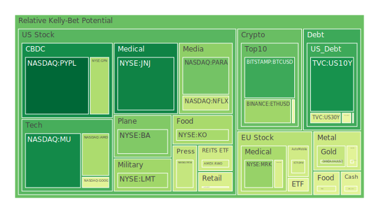
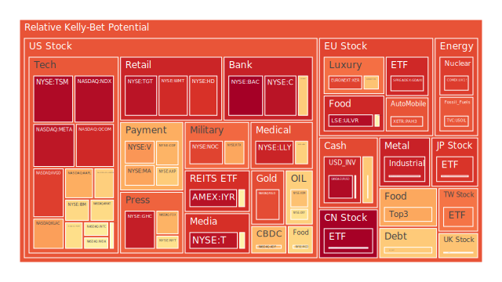
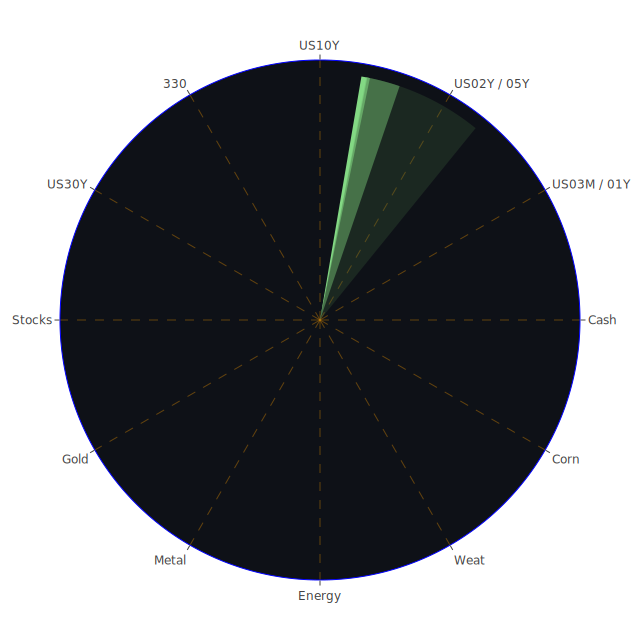

# **投資商品泡沫分析**

在當前2025年6月的宏觀環境下，全球市場正處於一個充滿矛盾與不確定性的微妙平衡點。一方面，通膨數據（CPIYOY）已從去年的3.33%回落至2.33%，聯準會（FED）的資產負債表持續收縮，且殖利率曲線倒掛現象（例如10年期與3個月期美債利差）已由負轉正，這些傳統信號似乎預示著經濟正走向軟著陸。然而，另一方面，聯準會官員的鷹派言論、居高不下的30年期抵押貸款利率（6.85%），以及商用與消費性不動產貸款違約率的顯著上升，又為前景蒙上了一層陰影。系統中充裕的流動性（貨幣市場基金資產規模持續走高）並未退潮，反而可能正在加劇特定資產的泡沫化風險。地緣政治的緊張局勢，特別是圍繞以色列的衝突以及美國與國際刑事法院（ICC）的摩擦，為市場注入了持續的避險情緒。在這樣的背景下，我們將對各類資產的現況進行深入剖析。

* 美國國債  
  美國國債市場正上演一場複雜的博弈。從數據上看，短、中、長期公債的風險分數普遍處於中低水平。例如，10年期美國國債（US10Y）的當前風險分數約為0.147，遠低於許多股票資產。這在經濟學上反映了其作為全球資產定價之錨的避險屬性。在社會心理層面，當市場充斥著如「特斯拉因政治爭端股價暴跌」或「裁員潮達到疫情以來新高」等負面新聞時，資金自然會尋求國債的庇護。  
  然而，我們必須體察其內部的張力。殖利率曲線的正常化（例如10年期與3個月期利差轉正至0.16）在歷史上往往是經濟衰退結束或即將到來的信號，這是一個模稜兩可的指標。一方面，它可能意味著市場對未來經濟增長恢復信心（正向解讀）；另一方面，它也可能反映了短期資金因避險需求推高短債價格（壓低短債利率），而長期通膨預期依然存在，使得長債殖利率維持高位（反向解讀）。當前30年期公債（US30Y）殖利率高達4.97%，顯著高於去年的3.99%，這對需要長期融資的行業（如基礎建設、房地產）構成了實質壓力。從博弈論角度看，聯準會的鷹派立場與市場對降息的預期形成對峙。數據顯示聯準會官員近期發表了2次鷹派言論，無鴿派言論，這表明其抑制通膨的決心依然堅定，這將在中短期內支撐殖利率，對國債價格構成壓力。風險分數雖低，但並非全無風險，特別是考慮到美國高企的公共債務佔GDP比重。  
* 美國零售股  
  零售股的表現呈現出明顯的階級分化，這深刻反映了當前的社會經濟結構。以沃爾瑪（WMT）和塔吉特（TGT）為代表的平價零售商，其風險分數持續處於極高水平（WMT約0.916，TGT約0.959）。這看似矛盾，但在經濟學上可以解釋為「口紅效應」的延伸：在經濟不確定性增加、消費者實際收入承壓的環境下，消費者會削減高端消費，轉向更具性價比的零售通路，從而推高了這些公司的營收預期。然而，極高的風險分數也警告我們，市場對其的定價可能已過於樂觀，完全消化了避險需求所帶來的好處，使其變得極易受到任何風吹草動的影響。  
  相比之下，高端零售品牌則面臨不同挑戰。新聞中提及的Lululemon（LULU）因財報展望不及預期而股價暴跌，正是一個典型案例。這反映出中產階級及以上消費者的消費意願正在減弱，這與數據中消費性貸款違約率走高的趨勢相吻合。從心理學角度看，持續的負面經濟新聞（如裁員）會抑制消費者的衝動性購買和對非必需品的支出。好市多（COST）的風險分數處於中等偏高水平（約0.440），其會員制的商業模式在一定程度上鎖定了客戶群，表現出比普通零售更強的韌性，但同樣無法完全豁免於宏觀經濟的逆風。  
* 美國科技股  
  科技股，特別是大型股與半導體股，是當前市場的核心矛盾體。以科技股為主的納斯達克100指數（NDX）風險分數高達0.974，顯示出極端的泡沫化傾向。這一現象的背後，是經濟學上的結構性轉變與心理學上的集體狂熱。AI的革命性敘事，如新聞中博通（AVGO）「由AI強勁需求驅動」的創紀錄營收，為整個板塊提供了強勁的基本面支撐（正方論點）。這使得微軟（MSFT）、谷歌（GOOG）、亞馬遜（AMZN）等巨頭的風險分數居高不下。  
  然而，反方論點同樣清晰。特斯拉（TSLA）因其CEO與前總統的政治爭端而股價大跌，這是一個鮮明的例證，說明當前的科技股估值不僅基於業績，更高度依賴於市場情緒、關鍵人物的影響力，甚至是政治氣候，這引入了巨大的不確定性。社會學層面，財富與權力向少數科技巨頭集中，引發了監管機構的審視，美國證券交易委員會（SEC）對股東提案規則的勝利，預示著未來監管可能收緊。從博弈論角度，投資者陷入了一種「囚徒困境」：儘管知道估值過高，但由於害怕錯過（FOMO）AI列車，他們被迫繼續持有或買入，進一步推高了泡沫。Meta（META）高達0.953的風險分數，蘋果（AAPL）的0.719，都反映了這種極度樂觀但脆弱的狀態。  
* 美國房地產指數  
  美國房地產市場的風險信號不容忽視。以房地產信託指數（IYR, VNQ, RWO）為例，其風險分數均處於中高至極高區間（IYR高達0.964）。這一數據與宏觀經濟數據形成了直接且令人擔憂的印證。聯邦數據顯示，商業地產、消費性地產的拖欠率均處於「相對高位」，這直接侵蝕了REITs的租金收入與資產價值。  
  從經濟學角度看，高達6.85%的30年期固定抵押貸款利率，是壓在市場頭上的巨石，它極大地抑制了新的購房需求，並增加了現有浮動利率貸款持有者的壓力。歷史上，房地產危機往往是系統性金融風暴的導火線，因為其牽涉範圍廣，從銀行資產負債表到普通家庭的財富。新聞中雖未直接提及房地產崩盤，但「裁員潮」和「消費者拖欠率上升」等消息，都在削弱潛在購房者的支付能力和信心。心理層面上，高利率和高拖欠率的新聞會形成負面預期，導致潛在買家持幣觀望，賣家則因流動性枯竭而難以脫手，形成惡性循環。家得寶（HD）作為房地產後周期的代表，其高達0.903的風險分數，可能反映了市場仍在交易其過去的強勁表現，而未充分計價未來房市下行帶來的衝擊。  
* 加密貨幣  
  加密貨幣市場在2025年呈現出分化與成熟的跡象。比特幣（BTC）和以太坊（ETH）的風險分數已從過去的極端狂熱回落至中等水平（BTC約0.201，ETH約0.336）。這在心理學上表明，經歷了多輪牛熊洗禮後，投資者群體對其認知更為深入，投機性狂熱有所降溫。  
  經濟學上，Circle（USDC發行商）的成功IPO並獲得市場追捧，以及新聞中提到的「為其他加密貨幣公開上市鋪平道路」，標誌著加密資產正加速融入傳統金融體系。這為其提供了新的合法性來源與資金渠道（正方論點）。然而，這也意味著它將越來越受到宏觀經濟因素的影響，例如聯準會的利率政策和全球流動性狀況。狗狗幣（DOGE）等迷因幣的風險分數維持在0.485左右，顯示其純粹由社區情緒和名人效應驅動的屬性依然存在，但相比主流幣種，其基礎更為脆弱。博弈論視角下，監管的不確定性始終是懸在加密貨幣頭上的達摩克利斯之劍。SEC對股東提案規則的勝利，可能預示著其將有更多精力來規範這個新興市場。當前，加密貨幣市場處於「從野蠻生長到合規發展」的過渡期，風險與機遇並存。  
* 金/銀/銅  
  貴金屬與工業金屬的表現揭示了市場對未來經濟走向的矛盾預期。黃金（XAUUSD）的風險分數處於中等水平（0.401），表現出其典型的雙重屬性。一方面，地緣政治風險（中東衝突、美歐制裁）和對沖法定貨幣信用的需求為其提供了堅實支撐。黃金/石油比率高達51.14，遠高於去年的32.19，顯示黃金相對於能源的強勢。另一方面，較高的真實利率環境在理論上會壓抑黃金這種無息資產的價格。目前黃金價格的穩定，是這兩種力量拉鋸的結果。  
  白銀（XAGUSD）的風險分數則異常之高（0.933），新聞明確指出「白銀漲幅超過黃金，達到2012年以來最高點」。這背後是其工業與金融屬性的共振。經濟學上，白銀不僅是貴金屬，也是光伏、新能源車等綠色產業不可或缺的原料。市場可能在押注，即使經濟放緩，能源轉型的大趨勢也不會逆轉，從而帶動白銀的工業需求（正方）。心理上，白銀價格波動性遠大於黃金，更容易吸引投機性資金，形成正回饋循環。  
  銅（COPPER）的風險分數則回落至中等水平（0.460）。作為全球經濟的「溫度計」，銅價的回落與中國滬深300指數（SSE:000300）的極高風險（接近1.0）形成鮮明對比，這暗示市場對全球，特別是中國的實體經濟復甦力度存有疑慮。黃金/銅比率（685.74）處於歷史高位，也反映了避險情緒遠勝於對經濟增長的樂觀情緒。  
* 黃豆 / 小麥 / 玉米  
  農產品市場的風險分數呈現分化，主要反映了供給端和氣候的影響。小麥（WEAT）的風險分數為0.452，黃豆（SOYB）為0.775，玉米（CORN）為0.612。這些波動在很大程度上獨立於金融市場的宏觀敘事，而更多地與特定產區的天氣、地緣政治（如影響黑海糧食走廊的衝突）以及貿易政策相關。  
  從社會學角度看，糧食安全是各國政府的重中之重。任何關於主要出口國限制出口或惡劣天氣影響產量的消息，都可能引發全球性的價格波動，進而影響通膨預期。目前來看，農產品的風險分數並未達到極端水平，表明全球糧食供應鏈雖有壓力，但尚未出現重大危機。然而，地緣政治新聞中，哥倫ビア的森林砍伐減少和加薩地區因戰爭缺乏肉食的報導，從側面提醒我們，環境與衝突是影響農業生產的長期變量。投資者在分析此類資產時，需要更多地關注氣象報告、農業政策和國際關係，而非單純的金融指標。  
* 石油/ 鈾期貨UX\!  
  能源市場正處於高風險區域。美國原油（USOIL）的風險分數高達0.846，這似乎與經濟放緩的預期相悖。然而，這恰恰反映了供給側的脆弱性。地緣政治上，以色列對貝魯特的空襲等中東緊張局勢，隨時可能點燃市場對供給中斷的擔憂。從博弈論角度看，OPEC+的減產聯盟仍在發揮作用，他們有動機維持油價於高位，以彌補能源轉型帶來的長期收入損失。因此，當前油價更多是「地緣政治溢價」和「供給壟斷溢價」的體現，而非強勁需求的結果。  
  鈾期貨（UX1\!）的風險分數同樣高達0.886。這背後是全球能源結構轉型的宏大敘事。在追求碳中和的過程中，核能作為一種穩定的低碳基載電力，其戰略價值被重新認識。社會心理層面，過去對核能的恐懼正在逐漸被對氣候變遷的擔憂所取代。許多國家宣布延長現有核電站壽命或計劃新建核電站，這從根本上改變了鈾的長期供需格局。當前的高風險分數，反映了市場正在為這種長期且確定的需求增長進行定價，但短期內也積聚了大量的投機性頭寸。  
* 各國外匯市場  
  外匯市場是全球宏觀經濟力量的直接交鋒之地。美元/日圓（USDJPY）的風險分數處於0.668的中高水平，這背後是日美兩國貨幣政策的巨大差異。聯準會維持鷹派，而日本央行即便有所行動，其利率水平與美國相比仍有天壤之別。這種利差交易（Carry Trade）在經濟學上為做多USDJPY提供了堅實基礎。然而，當避險情緒極度高漲時，日圓的傳統避險屬性可能被觸發，導致匯率劇烈反轉，這是其風險所在。  
  歐元/美元（EURUSD）和英鎊/美元（GBPUSD）的風險分數則極高，分別為0.977和0.563。EURUSD的高風險可能反映了市場對歐洲央行降息前景的定價，以及對歐洲經濟（以德國GDAXI和法國FCHI指數為代表，兩者風險分數均不低）的擔憂。英國富時100指數（FTSE）風險分數處於中高位（0.679），顯示英國市場相對穩定，但英鎊本身仍受制於美元的強勢和國內經濟挑戰。澳幣/美元（AUDUSD）風險分數為0.463，作為商品貨幣，其走勢與銅價、鐵礦石價格及全球經濟前景高度相關，目前的中等風險反映了市場對前景的矛盾心態。  
* 各國大盤指數  
  全球主要股指普遍處於高風險區域，但成因各異。美國納斯達克100指數（NDX）風險分數為0.974，由科技股泡沫驅動。日本日經225指數（JPN225）風險分數高達0.899，這既有公司治理改革、資金回流的積極因素，也反映了日圓貶值帶來的帳面牛市，其中包含了匯率風險。  
  歐洲方面，德國DAX指數（GDAXI）風險分數0.921，法國CAC40指數（FCHI）為0.465。德國作為出口導向型經濟體，其股市對全球需求和能源價格高度敏感，高風險分數可能反映了對其經濟韌性的過度樂觀。相比之下，法國指數風險較低。英國富時100指數（FTSE）風險為0.679，其成分股多為大型跨國公司，如能源、礦業、金融等，使其表現更為穩健。  
  值得注意的是中國滬深300指數（SSE:000300），其風險分數在數據中多次觸及1.0的極值。這通常意味著市場存在巨大的潛在波動性。一方面，可能反映了政策刺激下的強烈預期；另一方面，也可能是在房地產危機和地方政府債務壓力下，市場信心極度脆弱，任何風吹草動都可能引發劇烈拋售。這是一個需要高度警惕的信號。台灣加權指數（0050）風險分數為0.802，主要受台積電等半導體產業鏈的高度景氣影響，與納斯達克指數高度相關，同樣面臨全球科技週期和地緣政治的雙重風險。  
* 美國半導體股  
  半導體行業是當前市場的「風暴眼」，其風險分數普遍處於高位。輝達（NVDA）的月度風險雖高（0.661），但短期有所回落（0.578），可能意味著經歷了瘋狂上漲後，市場出現了短暫的觀望和分歧。超微（AMD）的風險分數則維持在0.356的中高水平，作為追趕者，其估值壓力相對較小。  
  然而，供應鏈上的其他關鍵企業風險極高。全球晶圓代工龍頭台積電（TSM）風險分數達0.979，應用材料（AMAT）為0.635，科磊（KLAC）為0.740，博通（AVGO）為0.883。這構成了一個完整的「正回饋」生態：AI的巨大需求（新聞） \-\> 輝達等設計公司下單 \-\> 台積電產能吃緊 \-\> 應用材料等設備商訂單飽和 \-\> 市場進一步調高整個產業鏈的盈利預期 \-\> 股價上漲，風險分數飆升。  
  從博弈論角度，這是一個典型的「贏家通吃」市場。資金和人才高度集中於少數龍頭企業。但這也造成了極度的脆弱性。任何關於AI需求放緩的信號、地緣政治對台灣供應鏈的干擾，或是中美之間新的科技制裁，都可能導致整個多米諾骨牌的連鎖倒塌。歷史上，1999-2000年的科網泡沫破裂前，半導體行業也曾出現過類似的極度樂觀景象。  
* 美國銀行股  
  美國銀行股正處於冰火兩重天。以美國銀行（BAC）、花旗銀行（C）、摩根大通（JPM）為代表的大型銀行，其風險分數處於驚人的高位（BAC接近1.0，C為0.960，JPM為0.660）。這背後隱藏著深刻的風險傳導路徑。一方面，聯準會維持高利率，擴大了銀行的淨息差（NIM），這是其利潤的核心來源（正方）。  
  然而，反方論據更為有力。宏觀數據中「商業地產拖欠率」和「消費性地產拖欠率」的高企，對銀行資產負債表的直接威脅。歷史上，銀行危機往往由資產質量惡化引發。此外，「美國公債外國持有量處於低位」和「聯準會縮表」意味著銀行需要吸收更多的國債發行，這在高利率環境下可能導致其債券投資組合出現未實現虧損，重演2023年矽谷銀行的危機。當前的高風險分數，反映了市場對其利潤增長的樂觀預期，與其資產負債表面臨的巨大潛在風險之間，存在著劇烈的衝突。這是一個極不穩定的狀態。  
* 美國軍工股  
  軍工股的強勢，是地緣政治緊張局勢最直接的市場體現。洛克希德·馬丁（LMT）、諾斯洛普·格魯曼（NOC）、雷神技術（RTX）的風險分數均處於中高至極高區間（LMT約0.337，NOC約0.875，RTX約0.729）。波音（BA）雖然也屬軍工板塊，但其民航業務的持續問題使其風險分數相對較低（0.291），走勢獨立。  
  從新聞面看，美國制裁國際刑事法院法官、以色列空襲貝魯特、法國碼頭工人阻止對以軍援等事件，都指向一個更加分裂和衝突頻發的世界格局。在這種社會氛圍下，各國政府增加國防預算的確定性極高。經濟學上，國防開支具有逆週期的特性，不易受經濟衰退影響，這使其成為投資組合中理想的防禦性板塊。心理學上，持續的衝突新聞會強化投資者對「安全」的需求，不僅是資金上的安全，也是對國家安全的押注，從而推高軍工股估值。當前的高風險分數反映了市場已充分定價了這種預期。其風險在於，任何突發的和平進程或外交突破，都可能導致板塊估值的快速回調。  
* 美國電子支付股  
  電子支付行業展現了內部分化的趨勢，反映了宏觀經濟對不同消費層級的影響。萬事達卡（MA）和Visa（V）的風險分數均處於高位（MA為0.731，V為0.753）。作為全球支付網絡的雙寡頭，其業績與全球消費總量掛鉤，具有強大的網絡效應和定價權。高風險分數反映了市場相信，即使在經濟放緩中，其剛性需求和市場地位依然穩固。美國運通（AXP）的風險分數也很高（0.662），其業務更側重於高淨值客戶，顯示高端消費市場仍有韌性。  
  然而，PayPal（PYPL）和Global Payments（GPN）的風險分數則處於極低到中等水平（PYPL約0.065，GPN約0.362）。這反映了它們面臨著更激烈的競爭（來自蘋果支付、BNPL等新模式）和更敏感的客戶群體（中小企業和普通消費者）。在消費者信貸緊縮、違約率上升的背景下，這些公司的增長前景更受質疑。從博弈論角度，PYPL的極低風險分數意味著市場可能已經過度悲觀，任何積極的轉型信號都可能引發股價的強力反彈，使其成為一個潛在的逆向投資標的。  
* 美國藥商股  
  大型製藥公司內部也出現了顯著分化，揭示了市場從「防禦性」到「成長性」的估值邏輯轉變。嬌生（JNJ）的風險分數極低（0.117），符合其傳統上作為醫療保健領域穩定、防禦性資產的定位。其多元化的業務（藥品、醫療設備、消費品）提供了穩定的現金流，在不確定時期受到青睞。  
  相比之下，禮來（LLY）和諾和諾德（NVO）的風險分數則高得驚人（LLY為0.929，NVO為0.441）。這背後是GLP-1類減肥藥的革命性成功。市場不再將它們視為傳統的防禦性藥企，而是當作擁有爆炸性增長潛力的科技公司來估值。這種高估值反映了對其未來幾年壟斷性市場地位和巨大盈利潛力的預期。默克（MRK）的風險分數處於中等水平（0.323），反映了其穩健的產品線和研發管線，但缺乏類似禮來的現象級產品。艾伯維（ABBV）風險分數較高（0.656），可能與其明星藥物專利到期後，市場對其後續產品的預期有關。這個板塊的估值分化，是「舊價值」與「新成長」敘事在同一行業內碰撞的結果。  
* 美國影視股  
  影視媒體行業正處於轉型陣痛期，其風險分數反映了市場對其未來商業模式的疑慮。迪士尼（DIS）的風險分數處於中高水平（0.566）。它正努力應對從傳統有線電視向流媒體轉型的挑戰，這期間伴隨著巨大的內容投入和盈利壓力。其股價波動反映了市場對其轉型能否成功的持續評估。  
  Netflix（NFLX）作為流媒體的先行者，其風險分數處於中等水平（0.406）。市場對其的關注點已從用戶增長轉向盈利能力和自由現金流，顯示其已進入相對成熟的階段。派拉蒙（PARA）的風險分數為0.271，處於較低水平，這反映了市場對其在激烈競爭中處於相對弱勢地位的定價，但也可能意味著其資產價值被低估，存在被收購或重組的可能。整個行業的博弈核心在於，如何在內容投入、訂戶增長和實現盈利之間找到可持續的平衡點。  
* 美國媒體股  
  傳統媒體與新媒體的界限日益模糊，它們共同面臨著廣告市場的挑戰和信息傳播方式的變革。紐約時報（NYT）的風險分數較高（0.621），反映了其成功從印刷媒體向數位訂閱轉型的成果，獲得了市場的認可。然而，其估值也使其對宏觀經濟導致的訂閱和廣告收入波動更為敏感。  
  福斯公司（FOX）的風險分數很高（0.708），這可能與其在美國政治光譜中的獨特定位有關。在政治極化加劇的社會中，立場鮮明的媒體能夠鞏固其核心受眾，但也面臨著廣告商的壓力以及非核心受眾的抵制。其高風險分數可能反映了即將到來的選舉週期為其帶來更高關注度和廣告收入的預期。康卡斯特（CMCSA）作為集內容、有線網絡和寬頻於一身的綜合性媒體集團，風險分數為0.402，反映了其多元化業務帶來的穩定性，但也面臨著「掐線潮」（cord-cutting）帶來的長期壓力。  
* 石油防禦股  
  石油防禦股，如埃克森美孚（XOM）和西方石油（OXY），其風險分數高企（XOM為0.683，OXY為0.617）。這與原油本身的高風險分數（0.846）相呼應。在經濟學上，這些大型一體化能源公司在高油價時期能產生巨額的自由現金流，從而進行股票回購和高額分紅，對投資者極具吸引力。  
  然而，高風險分數也揭示了其脆弱性。首先，它們的盈利能力完全依賴於其無法控制的油價。任何導致油價暴跌的事件（如全球深度衰退或地緣政治局勢緩和）都將重創其股價。其次，從社會學角度看，全球範圍內的能源轉型和ESG（環境、社會、治理）投資理念，對其構成了長期生存威脅。儘管短期內它們因地緣政治和供給限制而受益，但其長期前景充滿不確定性。投資這些股票，本質上是在做多地緣政治風險和做空全球能源轉型的速度。  
* 金礦防禦股  
  金礦股的表現通常與黃金價格正相關，但又疊加了自身的運營槓桿。例如，Royal Gold（RGLD）作為一家黃金權利金公司，其風險分數高達0.863。這類公司不直接參與礦山開採，而是通過提供前期融資換取未來產量的固定比例，商業模式風險較低。其高風險分數可能反映了在金價前景看好時，市場給予了其商業模式穩定性的溢價。  
  然而，金礦股與實物黃金之間存在重要差異。金礦公司需要應對運營成本上升（能源、勞動力）、礦山所在國的政治風險、環保法規收緊等挑戰。因此，即使金價上漲，個別公司的股價也可能因自身問題而下跌。金礦股的高風險分數，是對金價上漲的高 beta 押注，但也承擔了黃金本身所沒有的企業運營風險。  
* 歐洲奢侈品股  
  歐洲奢侈品股是全球財富效應的晴雨表。路威酩軒（MC）的風險分數為0.507，開雲集團（KER）的風險分數則高達0.877，愛馬仕（RMS）為0.679。開雲的高風險尤其值得警惕。奢侈品消費高度依賴於全球高淨值人群的信心和資產價格。當前美國科技股和加密貨幣等資產的泡沫化，製造了巨大的財富效應，直接支撐了奢侈品的銷售（正方）。  
  然而，反方論點是，這種依賴性也使其極為脆弱。任何導致資產價格大幅回調的事件，都會迅速傳導至奢侈品行業。新聞中，儘管沒有直接的負面報導，但全球性的高利率環境、房地產市場的壓力以及對經濟衰退的擔憂，都在侵蝕潛在消費者的購買力。高風險分數意味著市場可能低估了全球宏觀經濟逆風對其銷售的滯後影響。  
* 歐洲汽車股  
  歐洲汽車股正處於行業變革的十字路口。寶馬（BMW）、賓士（MBG）以及保時捷（PAH3）的風險分數分別處於中等偏高（0.423）、中等（0.508）和極高（0.858）的水平。這反映了市場對它們在電動化轉型和應對中國市場競爭方面的不同看法。  
  從經濟學角度，傳統豪華車企在燃油車時代積累的品牌和技術優勢，正在被電動化和智能化浪潮所削弱。來自特斯拉和中國新勢力的競爭，正嚴重擠壓其利潤空間。新聞中「汽車製造商業績預期下調」的標題，點明了行業的普遍困境。社會心理層面，消費者對品牌的認知正在發生變化，科技屬性、智能化體驗的重要性日益提升。保時捷的極高風險分數，可能與其獨立上市後的財務運作和估值預期有關，而非完全基於基本面。整個行業的博弈點在於，這些傳統巨頭能否在保持盈利的同時，成功完成電動化轉型這一艱鉅任務。  
* 歐美食品股  
  大型食品股通常被視為防禦性資產，但在當前的通膨環境下，其表現也出現了分化。可口可樂（KO）的風險分數為0.349，處於中等水平，顯示其強大的品牌護城河和定價能力，使其能夠較好地將成本壓力轉嫁給消費者。卡夫亨氏（KHC）的風險分數則偏高（0.499），可能反映了其在與零售商進行價格談判時面臨更大壓力，以及消費者轉向商店自有品牌的趨勢。  
  歐洲方面，雀巢（NESN）和聯合利華（ULVR）的風險分數分別為0.566和0.973。聯合利華的極高風險值得關注，可能與其內部的品牌重組、成本控制以及在新興市場的表現有關。從社會學角度，全球消費者對健康、可持續食品的需求日益增長，這對傳統食品巨頭的產品組合提出了新的挑戰。它們能否成功創新以適應新的消費趨勢，是決定其長期價值的關鍵。

# **宏觀經濟傳導路徑分析**

當前的宏觀經濟傳導路徑呈現出多條複雜且相互交織的線索。最核心的路徑始於聯準會的貨幣政策。

1. **利率與信貸路徑**：聯準會維持高利率（OIS FED Fund Rate 4.33%） \-\> 推高長期融資成本（30年房貸利率6.85%） \-\> 抑制房地產市場活動 \-\> 導致商業及住宅地產貸款拖欠率上升 \-\> 對持有大量相關貸款的銀行（特別是區域性銀行）構成資產質量壓力 \-\> 引發市場對銀行股（BAC, C）的風險重估（其風險分數飆升） \-\> 若風險發酵，可能引發信貸緊縮，進而衝擊依賴融資的實體經濟部門和成長型科技股。  
2. **地緣政治與避險路徑**：中東衝突加劇（以色列空襲、ICC制裁等新聞）及全球政治碎片化 \-\> 提升市場避險情緒 \-\> 資金流向傳統避險資產，如美元、短期美國國債 \-\> 同時推高國防預算預期，利好軍工股（NOC, RTX） \-\> 避險情緒也支撐黃金（XAUUSD）價格，但與高利率環境形成對抗 \-\> 石油價格（USOIL）因供給中斷擔憂而獲得風險溢價，獨立於經濟基本面走強。  
3. **流動性與投機路徑**：儘管聯準會縮表，但貨幣市場基金資產規模等指標顯示系統流動性依然充裕 \-\> 在缺乏普遍投資機會的背景下，資金追逐確定性高的敘事 \-\> AI革命成為最大風口，導致資金湧入半導體（NVDA, TSM, AVGO）和大型科技股（META, MSFT） \-\> 形成資產價格泡沫（如NDX指數極高的風險分數） \-\> 這種泡沫創造的財富效應外溢至奢侈品（KER, RMS）等領域 \-\> 但此路徑極度脆弱，高度依賴市場情緒，任何負面催化劑（如TSLA的政治風波）都可能引發快速去槓桿和資產拋售。

# **微觀經濟傳導路徑分析**

在企業層面，我們觀察到幾條關鍵的傳導路徑，它們揭示了產業內部的動態和跨行業的漣漪效應。

1. **AI供應鏈路徑**：從輝達（NVDA）等AI晶片設計商的強勁需求開始 \-\> 向上游傳導至晶圓代工廠台積電（TSM），使其產能利用率和定價能力提升 \-\> 進一步傳導至應用材料（AMAT）、科磊（KLAC）等半導體設備製造商，訂單飽滿 \-\> 這條路徑的繁榮，是以吸走市場大量資金和人才為代價的，可能導致其他非AI科技領域的投資受到排擠。  
2. **消費降級路徑**：宏觀層面的消費者貸款拖欠率上升和裁員新聞 \-\> 體現在微觀層面，是消費者行為的轉變 \-\> Lululemon等中高端非必需品銷售不及預期，股價承壓 \-\> 資金和消費者流量轉向沃爾瑪（WMT）、塔吉特（TGT）等平價零售商，推高其營收預期和股價，但同時也使其風險分數達到極值 \-\> 此路徑也影響到支付行業，對主營中小商戶和C2C業務的PayPal（PYPL）構成壓力，而Visa/Mastercard因其網絡剛性受影響較小。  
3. **CEO個人風險路徑**：特斯拉CEO馬斯克與前總統川普的公開爭執，導致特斯拉股價暴跌。這條路徑揭示了一個新的風險維度：在社交媒體時代，高知名度CEO的個人言行和政治立場，可以直接轉化為公司的市值波動和監管風險（新聞中提及川普威脅取消其政府合約）。這對其他由明星CEO領導的公司（如META）構成了警示，即個人品牌與公司風險已深度綁定。

# **資產類別間傳導路徑分析**

不同資產類別之間的價格關係和傳導機制，正呈現出既有理論與現實脫節的現象。

1. **股票與債券的關係**：傳統理論認為股債呈負相關，可以相互對沖。但在當前環境下，若市場的主要驅動力是對聯準會政策的預期，則可能出現股債雙殺（若通膨頑固，聯準會更鷹派）或股債雙漲（若經濟數據惡化，市場預期降息）。目前美國國債風險分數較低，而股票指數風險極高，顯示市場暫時將其視為有效的對沖工具。然而，一旦風險來自於主權信用本身（鑑於高額債務），這種關係將被打破。  
2. **黃金與美元的關係**：理論上，黃金以美元計價，兩者呈負相關。但在當前，地緣政治風險同時推高了作為避險資產的美元和黃金。這使得兩者在特定時期內可能呈正相關。它們共同的對立面是市場的「風險偏好」，當風險偏好上升時，資金會從黃金和美元流向風險資產（如科技股），反之亦然。  
3. **科技股與實體經濟指標的脫鉤**：納斯達克指數（NDX）的飆升與銅價（COPPER）的疲軟、房地產違約率的上升形成了鮮明反差。這顯示領漲的科技股行情，其驅動力並非來自於實體經濟的廣泛復甦，而是基於AI這一特定領域的結構性敘事。這種脫鉤是不可持續的，最終，要麼是AI的生產力革命切實地帶動整體經濟增長，要麼是實體經濟的疲軟最終會侵蝕科技股的盈利基礎和市場情緒。資產價格的巨大分歧，預示著未來可能出現劇烈的收斂過程。

# **投資建議**

基於上述分析，我們認識到市場正處於一個高風險、高波動、結構性分化極其嚴峻的時期。任何單一方向的押注都可能面臨巨大回撤。因此，我們建議採用高度分散化、注重風險對沖的啞鈴型配置策略，即同時持有極度安全和極度風險的資產，而減少配置中間地帶的資產。

以下是針對穩健、成長與高風險偏好的優化配置建議：

**1\. 穩健型配置 (總計 60%)**

此配置旨在最大程度保全資本，應對潛在的市場衝擊，並從當前的高利率環境中獲益。

* **短期美國國債 (例如1-3個月期) (25%)**: 在殖利率曲線相對平坦的背景下，短期國債提供了與長期國債相近的收益率，但久期風險極低。在市場動盪時，它們是最終的避風港。其風險分數極低，是現金的優良替代品。  
* **防禦性醫療保健股 (JNJ \- 嬌生) (20%)**: 嬌生的風險分數在所有股票中處於極低水平（0.117），反映了市場對其的高度認可。其業務不受經濟週期影響，多元化的產品組合提供了穩定的現金流，是核心防禦持倉的理想選擇。  
* **黃金 (XAUUSD) (15%)**: 鑑於持續的地緣政治風險和對全球法定貨幣體系的長期擔憂，黃金是不可或缺的保險性資產。其中等的風險分數（0.401）表明其尚未被過度炒作，相對於白銀和高風險股票，提供了更穩健的避險價值。

**2\. 成長型配置 (總計 30%)**

此部分旨在捕捉市場中相對確定且估值不過於極端的成長機會，避免直接參與泡沫最嚴重的領域。

* **半導體設備股 (AMAT \- 應用材料) (10%)**: 作為AI淘金熱中的「賣鏟人」，AMAT直接受益於全球晶圓廠的資本開支。相較於輝達等終端晶片設計商，其估值更為合理，風險分數（0.635）雖高但不及行業頂峰，提供了參與AI趨勢的較高安全邊際。  
* **全球食品飲料龍頭 (NESN \- 雀巢) (10%)**: 雀巢的業務遍及全球，品牌深入人心，具有強大的定價能力以應對通膨。其風險分數處於中等水平（0.566），在全球經濟不確定性中提供了穩定的增長來源。  
* **軍工巨頭 (RTX \- 雷神技術) (10%)**: 在全球地緣政治緊張局勢常態化的背景下，國防開支的增長具有高度確定性。RTX業務多元，涵蓋航空航天與國防，風險分數（0.729）雖高，但反映了其穩固的訂單和行業地位，是成長組合中有效的地緣政治對沖工具。

**3\. 高風險配置 (總計 10%)**

此部分配置少量資金於高波動性資產，旨在博取超額收益，包括對深度價值反轉和新興趨勢的押注。

* **白銀 (XAGUSD) (4%)**: 其極高的風險分數（0.933）和相對於黃金的強勢，表明市場投機動能強烈。白銀兼具工業屬性（綠色能源）和貴金屬屬性，使其在特定敘事下具有極高的價格彈性。此項配置是高風險高回報的通膨和投機押注。  
* **以太坊 (ETHUSD) (3%)**: 作為智能合約平台的領導者，以太坊是整個去中心化應用（dApp）生態的基石。其風險分數（0.336）遠低於許多科技股，顯示其投機泡沫有所降溫。投資以太坊是對下一代互聯網基礎設施的長期押注。  
* **電子支付逆向投資 (PYPL \- PayPal) (3%)**: PYPL的風險分數處於極低的0.065，意味著市場的悲觀情緒可能已經觸底。該公司擁有龐大的用戶基礎和品牌知名度。此項配置是一次典型的逆向投資，押注其在新管理層下可能出現的經營好轉和價值重估。

# **風險提示**

投資有風險，市場總是充滿不確定性。本報告完全基於所提供的歷史數據和新聞進行分析，不構成任何投資邀約。過去的表現不能預示未來的回報。數據中極高的泡沫風險分數，尤其是在美國銀行股、半導體、大型科技股和部分零售股中，是對潛在巨大下行風險的嚴重警告。地緣政治衝突、央行政策的突然轉向以及未預見的黑天鵝事件都可能導致市場劇烈波動。我們的建議僅供參考，投資者應根據自身的風險承受能力、財務狀況和投資目標，在進行獨立思考和深入研究後，做出審慎的投資決策。

 
Daily Buy Map:

 
Daily Sell Map:

 
Daily Radar Chart:

 
