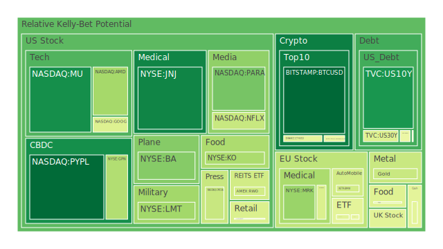
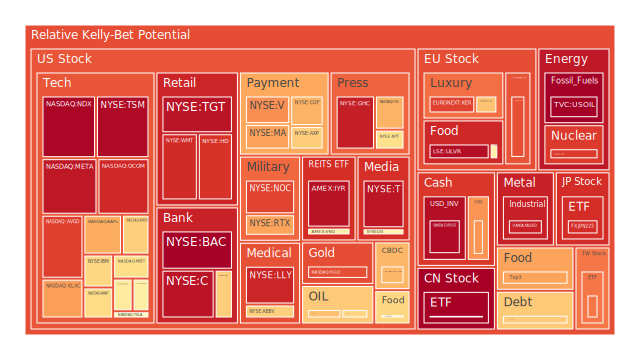
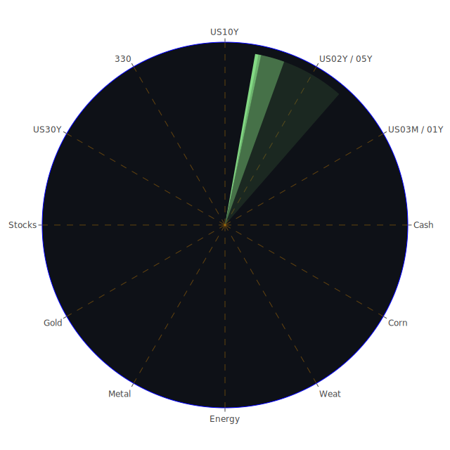

# **投資商品泡沫分析**

在當前2025年六月初的金融環境中，市場呈現出高度分歧且複雜的景象。各種資產類別的價格動能與潛在風險分佈極不均勻，這反映了投資者在面對持續的宏觀經濟不確定性、地緣政治緊張局勢以及特定產業革命性技術發展時，其集體心理與資本流動的拉鋸戰。以下將針對主要資產類別的現況進行深入剖析，以期從中洞察潛在的結構性機會與風險。

* **美國國債** 美國國債市場正處於一個微妙的平衡點。從數據上看，短天期國債如三月期(US03MY)、一年期(US01Y)及兩年期(US02Y)的泡沫指數處於中高水平，分別為0.697、0.483及0.609。這主要反映了市場對聯準會（FED）在短期內將維持較高利率的預期，此預期因近期強勁的就業報告而進一步鞏固。與此同時，長天期國債如十年期(US10Y)與三十年期(US30Y)的泡沫指數相對較低，分別為0.149和0.448。

此種期限結構的差異，揭示了一種博弈論中的「分裂均衡」。一方面，短期的高利率壓抑了長債的吸引力；另一方面，部分市場參與者可能正在為未來經濟放緩甚至衰退的可能性進行佈局，他們押注FED最終將不得不降息，從而導致長債價格上漲。值得注意的是，去年此時（2024年）收益率曲線呈現嚴重倒掛（例如10Y-3M為-1.35），是市場公認的衰退信號。然而，當前利差已轉正至0.16，這在歷史上通常意味著市場最恐慌的階段已經過去，但也可能預示著新一輪動盪的開始。從社會學角度看，公眾對於美國高達GDP一定比例的國債水平的擔憂，與外國機構持有量相對較低的事實，共同構成了一個潛在的信任脆弱點。

* **美國零售股** 零售行業正上演一齣冰與火之歌。沃爾瑪(WMT)與好市多(COST)等民生必需品巨頭，其泡沫指數分別高達0.916和0.440，顯示在經濟不確定性中，資金尋求確定性消費的避險特性。與之形成鮮明對比的是，目標百貨(TGT)的泡沫指數也攀升至0.959，但這更可能反映了市場對其轉型成功的過度樂觀預期。新聞中提及的Lululemon（LULU）因消費前景謹慎和關稅憂慮而導致的股價暴跌，以及小型企業因不確定性而縮減招聘，都為整個零售業蒙上了一層陰影。

這體現了消費者心理的兩極分化：一方面是對於日常用品價格的敏感，另一方面則是對非必需品消費的緊縮。此現象可以用社會學的「階層消費」理論解釋，經濟壓力加劇了不同收入群體消費行為的差異。沃爾瑪的強勢與Lululemon的困境，正是此社會趨勢在資本市場的投射。

* **美國科技股** 科技股，特別是大型科技股，是當前市場的核心驅動力，同時也可能是風險的集中營。納斯達克100指數(NDX)的單日泡沫指數高達0.988，顯示出極端的市場情緒。微軟(MSFT)、蘋果(AAPL)、亞馬遜(AMZN)和Meta(META)的泡沫指數分別為0.624、0.719、0.656和0.952，均處於高位。

這背後的邏輯三位一體非常清晰：正方（Thesis）是人工智慧（AI）革命帶來的生產力提升預期，這是經濟學上的供給側革命；反方（Antithesis）是持續的高利率環境，這對高估值的科技股構成了估值壓力；合方（Synthesis）則是市場將資金不成比例地集中於少數能夠將AI敘事轉化為實質性現金流的巨頭（如MSFT、NVDA），形成了一種自我實現的預言。新聞中提到Meta對擴增與虛擬實境的「關鍵一年」的展望，以及AI公司CoreWeave的驚人漲幅，都在不斷強化這一敘事。然而，這種高度集中的投資行為，本身就蘊含著巨大的博弈風險——一旦領頭羊出現問題，可能引發踩踏效應。

* **美國房地地產指數** 美國房地產市場的信號錯綜複雜。代表性的房地產指數ETF如IYR和VNQ，其泡沫指數分別為0.964和0.575，顯示市場情緒偏高。這與聯準會數據中商業地產和住宅地產拖欠率處於相對高位的現實，形成了鮮明的對比。同時，高達6.85%的30年期固定房貸利率，對潛在購房者構成了巨大的壓力。

這種矛盾可以用心理學上的「錨定效應」來解釋。投資者可能仍將房地產視為傳統的抗通膨資產，其心理錨定於過去數十年的牛市，而未能充分定價當前高利率和高拖欠率帶來的風險。另一個視角是，像RWO這樣的全球房地產ETF泡沫指數（0.422）相對溫和，表明風險可能更多集中在美國本土市場。這是一個空間上的三位一體：全球流動性（正方）、美國國內貨幣緊縮（反方）與高度分化的房地產市場表現（合方）。

* **加密貨幣** 比特幣(BTC)與以太幣(ETH)等主流加密貨幣，其泡沫指數近期有所回落但仍處於中等水平，BTC的D1泡沫指數為0.059，而ETH則為0.466。這表明在經歷了前一輪的狂熱後，市場情緒趨於謹慎。從歷史上看，加密貨幣市場的波動與宏觀流動性高度相關。當前聯準會的鷹派立場顯然對其構成壓制。

然而，加密貨幣的敘事正在發生微妙的變化。它不再僅僅是「數位黃金」或「去中心化金融」，更被一部分投資者視為對沖主權債務風險和傳統金融體系失靈的工具。這種觀點在美國國債規模持續擴張的背景下，獲得了更多關注。這構成了一個概念上的三位一體：技術採用曲線（正方）、宏觀流動性緊縮（反方）、以及作為一種新型避險資產的敘事演變（合方）。DOGEUSD這類迷因幣的泡沫指數（0.480）依然不低，顯示市場中投機和娛樂心理的持續存在。

* **金/銀/銅** 貴金屬與工業金屬的表現出現了顯著分化。白銀(XAGUSD)的泡沫指數高達0.935，黃金(XAUUSD)則相對溫和（0.406），而銅(COPPER)處於中等水平（0.499）。白銀的極高泡沫分數，可能源於其雙重屬性——既是貴金屬避險資產，又是工業（特別是綠色能源）金屬。這種雙重敘事在當前環境下產生了共振。

黃金價格的堅挺，在美元強勢和高利率環境下顯得尤為突出。這表明地緣政治風險（如以色列與哈馬斯衝突的新聞）和對長期法定貨幣信用的擔憂，正成為黃金定價的主導因素。黃金/石油比率（51.38）遠高於去年同期的31.98，說明市場的避險情緒遠大於對經濟增長的預期。黃金、白銀與銅的三位一體，可以看作是：全球工業需求（正方，由銅代表）、貨幣與地緣政治恐慌（反方，由黃金代表）以及兩者結合的投機性預期（合方，由白銀代表）。金礦防禦股如RGLD的泡沫指數高達0.861，也印證了市場對黃金上游產業的追捧。

* 黃豆/小麥/玉米  
  農產品市場的泡沫指數普遍不高。黃豆(SOYB)、小麥(WEAT)和玉米(CORN)的泡沫指數分別為0.773、0.450和0.568。黃豆的指數相對較高，可能與特定的供需關係或天氣預期有關。總體而言，農產品市場似乎並未出現由宏觀因素驅動的系統性泡沫。從歷史上看，糧食價格危機往往與極端天氣事件、能源價格飆升或重大的地緣政治衝突（如影響主要出口國）相連。當前環境下，這些因素雖有體現，但尚未達到引發市場恐慌的程度。這提供了一個相對價格關係的視角：相較於金融資產和能源，糧食資產的估值似乎更為「冷靜」。  
* 石油/鈾期貨  
  能源市場呈現出短期與長期的顯著差異。美國石油(USOIL)的單日泡沫指數在數據最後一天躍升至1.000，這是一個極端的信號，表明可能有突發事件或重大的資金流動影響了市場。然而其7日和30日平均泡沫指數（分別為0.607和0.356）則溫和得多，說明這種波動是近期才發生的。地緣政治新聞，特別是以色列在中東的軍事行動，無疑是影響油價的關鍵變數。

與此相對，鈾期貨(UX1\!)的泡沫指數處於高位（0.889），反映了市場對核能復興的長期樂觀預期。這是一個基於能源轉型和能源安全敘事的概念性投資。石油的短期地緣政治博弈與鈾的長期結構性趨勢，構成了一個有趣的時間維度上的對照。石油防禦股如XOM和OXY的泡沫指數分別為0.684和0.644，表明投資者同時在佈局能源價格上漲的直接受益者。

* 各國外匯市場  
  美元的強勢是當前外匯市場的主旋律。聯準會的鷹派立場和相對穩健的經濟數據支撐了美元。與此同時，日圓(USDJPY)的泡沫指數達到0.756，表明市場存在強烈的貶值預期，這與日本央行和聯準會之間巨大的利率差距直接相關。歐元(EURUSD)和英鎊(GBPUSD)的泡沫指數分別為0.979和0.509，歐元的指數極高，暗示市場可能正在定價歐洲經濟相對於美國的某種脆弱性。澳元(AUDUSD)作為商品貨幣，其泡沫指數相對較低（0.463），反映了全球經濟增長前景的不確定性。外匯市場的表現，是各國經濟體質、貨幣政策和風險偏好的一面鏡子，清晰地勾勒出全球資本流動的空間路徑：從邊緣流向中心，從疲軟經濟體流向強勢經濟體。  
* 各國大盤指數  
  全球主要股指表現分化。美國納斯達克(NDX)如前述，泡沫指數極高。台灣0050 ETF (0050)的泡沫指數也處於0.797的高位，這很大程度上得益於其在全球半導體產業鏈中的核心地位，特別是台積電(TSM)的強勢表現。日本日經225指數(JPN225)泡沫指數為0.911，反映了公司治理改革和資金回流的積極影響。

相比之下，歐洲股指如法國FCHI（0.471）和德國GDAXI（0.457）的泡沫指數較為溫和，而英國FTSE（0.459）亦然。中國滬深300指數(000300)的單日泡沫指數雖高達0.996，但其長期平均值較低，暗示這可能是短期波動而非趨勢性泡沫，整體市場情緒依然脆弱。這種空間上的差異，揭示了全球經濟增長的引擎正高度集中於特定主題（AI、半導體）和特定地區（美國、台灣、日本）。

* **美國半導體股** 半導體是本輪牛市的「震央」。台積電(TSM)的泡沫指數高達0.979，輝達(NVDA)為0.578，超微(AMD)為0.342，高通(QCOM)為0.920，應用材料(AMAT)為0.632，科磊(KLAC)為0.738，博通(AVGO)為0.883。這一系列的數據描繪了一幅複雜的圖景。

這其中存在一個清晰的產業鏈傳導邏輯：AI應用的爆發（正方），首先利好處於最上游的設計商（NVDA）和代工廠（TSM）。這種樂觀情緒隨後傳導至其他相關晶片公司（AMD, QCOM, AVGO）和設備製造商（AMAT, KLAC）。然而，泡沫分數的巨大差異也揭示了市場的精明之處。投資者似乎在博弈誰是這場革命的最終贏家。TSM和QCOM的極高分數，與AMD的相對低分，可能反映了市場對各公司在AI領域競爭地位的判斷。這是一個典型的「贏家通吃」市場的心理預期。

* 美國銀行股  
  銀行股的泡沫指數呈現嚴重分化。摩根大通(JPM)為0.658，而美國銀行(BAC)與花旗(C)則分別高達0.998和0.961。這種差異極不尋常。一方面，高利率環境擴大了銀行的淨息差，對盈利是利好。但另一方面，聯準會數據中高企的商業地產和消費貸款拖欠率，以及縮表的壓力，對銀行的資產負債表構成了威脅。BAC和C的極高泡沫指數可能是一種反常信號，或許市場在押注它們因「大到不能倒」而獲得隱性支持，或者其股價相對於賬面價值仍有折讓。而JPM的溫和指數可能反映了其作為行業龍頭更穩健的風險管理。  
* 美國軍工股  
  地緣政治的惡化是軍工股最直接的催化劑。洛克希德·馬丁(LMT)、諾斯洛普·格魯曼(NOC)和雷神(RTX)的泡沫指數分別為0.337、0.875和0.732。其中NOC和RTX的指數相當高。新聞中關於以色列、烏克蘭以及波蘭推遲採購直升機等事件，都在不斷提醒市場，全球衝突的風險正在上升。從博弈論角度看，軍工股是大國競爭敘事下的必然產物。只要大國之間的信任侵蝕持續，國防開支就具備結構性的增長動力。這類股票的表現，與全球和平的期望呈現負相關，是投資組合中一種獨特的「混亂對沖」。  
* 美國電子支付股  
  電子支付行業面臨著來自多方面的挑戰。Visa(V)、萬事達卡(MA)、美國運通(AXP)的泡沫指數分別為0.763、0.734和0.659，均處於高位，這反映了它們在支付網絡中的寡頭壟斷地位和強大的定價能力。然而，PayPal(PYPL)的泡沫指數僅為0.064，處於極低水平。這揭示了行業內部的顛覆與被顛覆。PYPL面臨著來自蘋果支付等新興支付方式和傳統卡組織的雙重夾擊，其商業模式的護城河受到了質疑。從社會學角度看，支付習慣的變遷是一個緩慢但不可逆的過程，PYPL的困境是技術和商業模式迭代的典型案例。  
* 美國藥商股  
  大型製藥公司內部也出現了劇烈分化。禮來(LLY)和諾和諾德(NVO)因其在減肥藥和糖尿病領域的革命性產品，泡沫指數分別高達0.928和0.441。尤其是禮來，其指數已達極端水平，反映了市場對其產品成為世紀級「爆款」的狂熱預期。與此同時，傳統製藥巨頭如嬌生(JNJ)和默克(MRK)的泡沫指數則非常低，分別為0.116和0.323。這說明市場資金正在從傳統、多元化的製藥公司，湧向擁有顛覆性單品的「成長故事」。這是一種典型的概念驅動型泡沫，其風險在於，一旦藥物的副作用、競爭或定價壓力超出預期，可能引發劇烈的價格回調。  
* 美國影視股/媒體股  
  影視與媒體行業正處於結構性變革的陣痛期。迪士尼(DIS)、派拉蒙(PARA)的泡沫指數分別為0.567和0.272，處於中低水平，反映了市場對其從有線電視向流媒體轉型困難的擔憂。Netflix(NFLX)的指數為0.404，相對穩健，表明其在流媒體大戰中已確立領導地位。福斯(FOX)和紐約時報(NYT)的泡沫指數則較高，分別為0.708和0.622，這可能反映了它們在特定細分市場（如新聞和體育直播）的韌性。整個行業面臨的共同挑戰是內容成本的上升和用戶增長的放緩，這是一個典型的「紅海」市場。  
* 歐洲奢侈品股/汽車股  
  歐洲市場的代表性股票也顯示出壓力。奢侈品巨頭LVMH(MC)和開雲集團(KER)的泡沫指數分別為0.507和0.878。KER的指數偏高，可能暗示了更大的脆弱性。奢侈品的銷售高度依賴全球宏觀經濟，特別是富裕階層的消費信心。汽車製造商如寶馬(BMW)、賓士(MBG)和保時捷(PAH3)的泡沫指數分別為0.423、0.508和0.858。傳統汽車製造商面臨著向電動汽車轉型的巨大資本開支和來自特斯拉(TSLA)及中國製造商的激烈競爭，其未來充滿不確定性。PAH3的高泡沫指數可能與其控股結構和與大眾汽車的複雜關係有關，而非純粹的基本面樂觀。  
* 歐美食品股  
  食品股作為傳統的防禦性板塊，其表現也並非鐵板一塊。可口可樂(KO)、卡夫亨氏(KHC)、雀巢(NESN)、聯合利華(ULVR)和麥當勞(MCD)的泡沫指數分別為0.353、0.498、0.566、0.973和0.641。聯合利華的指數異常之高，可能與其特定的重組或成本削減計劃引發的市場樂觀情緒有關。總體而言，這些公司受益於其強大的品牌護城河和相對穩定的需求。然而，它們也面臨著投入成本上升和消費者轉向更廉價自有品牌的壓力。這是一個空間上的觀察：不同地區的消費降級壓力，會對這些跨國公司的盈利能力產生不同的影響。

# **宏觀經濟傳導路徑分析**

當前的宏觀經濟環境，其核心傳導路徑始於美國聯準會的貨幣政策姿態。聯準會的兩次鷹派講話，疊加強於預期的就業數據，共同強化了「更高更久」（Higher for Longer）的利率預期。此預期的第一層傳導是，推高了整個美國國債收益率曲線，特別是短端利率，使得美國兩年期國債收益率維持在4.04%的高位。

第二層傳導是透過利率平價理論，引發美元走強。強勢美元對全球經濟產生漣漪效應：它加劇了日本（USDJPY）和部分新興市場的資本外流和本幣貶值壓力；同時，以美元計價的商品（如石油、黃金）對非美元國家的購買者來說變得更加昂貴，從而可能抑制全球需求。

第三層傳導路徑在美國國內。高利率環境直接衝擊利率敏感部門。高達6.85%的三十年期抵押貸款利率，正在冷卻房地產市場的交易活動，並增加了現有浮動利率貸款持有者的壓力，這從商業和住宅地產拖欠率處於高位可見一斑。對於企業而言，高融資成本抑制了資本支出和招聘意願，新聞中「小型企業拉回招聘」即是明證。

第四層傳導則更為隱蔽，涉及金融穩定。聯準會數據顯示，美國銀行總存款處於高位，但商業地產和消費貸款的拖欠率也在上升。這意味著銀行體系的資產負債表面臨潛在壓力。同時，政府公共債務佔GDP比重高企，而外國機構持有美債比例相對較低，這條路徑的終點可能指向對主權信用的質疑，儘管這在短期內是小概率事件，但其潛在影響是災難性的。

# **微觀經濟傳導路徑分析**

在微觀層面，企業和消費者的行為模式揭示了經濟的真實溫度。新聞中關於Lululemon的案例是絕佳的傳導路徑樣本。路徑始於「關稅不確定性」和「消費者謹慎情緒」這兩個外部衝擊。它首先傳導至公司的預期，導致其下調盈利預測。此預期變化迅速在資本市場得到反應，引發股價暴跌。這條路徑並未就此停止，它會進一步反饋到實體經濟：公司可能為了保住利潤而削減成本，包括裁員或減少供應商訂單，這又會加劇宏觀層面的就業和消費壓力。

另一條重要的微觀傳導路徑是圍繞AI技術的。Meta宣布2025年是其AR/VR的「關鍵一年」，這類來自行業領導者的前瞻性聲明，會引導整個生態系統的資源配置。資本會流向相關的軟硬體供應商，大學會開設更多相關課程，人才會湧入該領域。這條路徑創造了一個正向反饋循環，即「反射性」（Reflexivity）：對未來的樂觀預期本身，正在塑造那個未來。然而，這條路徑的風險在於，如果技術的商業化進程不及預期，之前投入的巨大資源就可能變成沉沒成本，導致泡沫破裂。

# **資產類別間傳導路徑分析**

不同資產類別之間的相互作用，構成了市場最複雜的傳導網絡。

第一條是經典的「風險開/關」（Risk-On/Risk-Off）路徑。當市場情緒樂觀時（例如，受AI新聞驅動），資本會從避險資產流向風險資產。具體表現為：資金從美國國債（特別是長債）和黃金中流出，導致其價格下跌、收益率上升；同時湧入科技股（NDX、NVDA）和高風險貨幣（如澳元）。當前市場部分呈現此特徵，但又不完全是，因為黃金和軍工股等避險資產同樣表現強勢。

這引出了第二條傳導路徑：「地緣政治風險」路徑。以色列、中東的緊張局勢升級，其傳導路徑首先是推高石油價格（USOIL），因為市場擔心供應中斷。油價上漲會引發通膨擔憂，這可能迫使聯準會維持更長時間的緊縮政策。這條路徑對資產價格的影響是分裂的：它利好石油股（XOM）、軍工股（RTX、NOC）和黃金（XAUUSD），但對依賴低利率和穩定通膨的科技股和消費股則構成重大利空。

第三條是「價值重估」路徑。當利率中樞系統性抬高時，所有資產的估值模型都必須調整。這條路徑解釋了為何像PayPal（PYPL）這樣增長故事不再性感的公司，其股價會受到不成比例的懲罰，而像可口可樂（KO）這樣擁有穩定現金流的公司則相對抗跌。它也解釋了為何高分紅的防禦性股票和短期債券在當前環境下具備吸引力。

第四條，也是最值得警惕的，是「泡沫傳染」路徑。單一資產類別的極端情緒可能蔓延至其他領域。例如，半導體行業的狂熱，正透過台積電（TSM）的股價，將整個台灣股市（0050）的情緒推至高位。同樣，對減肥藥的狂熱追逐，不僅推高了禮來（LLY）的股價，也可能溢出到整個醫療保健行業，導致投資者忽視了其他細分領域的風險。這種傳導路徑在心理學上稱為「羊群效應」，是市場系統性風險的重要來源。

# **投資建議**

基於上述分析，我們認識到市場正處於一個由少數強勢主題（AI、地緣政治、精選藥品）和廣泛的宏觀壓力（高利率、消費謹慎）共同塑造的環境。泡沫與價值並存，機遇與風險同在。因此，投資組合的構建需要極強的平衡性和選擇性。以下是針對不同風險偏好的優化配置建議：

**穩健型投資組合 (Robust Portfolio)**

此組合旨在實現資本保值，並在動盪的市場中獲取穩定的真實回報，核心思路是防禦、對沖通膨和地緣政治風險。

* **短期美國國債 (例如，1-2年期) \- 40%**：在當前高利率環境下，短期國債提供了數十年來罕見的高票息回報，同時其久期風險極低，能有效對抗利率的進一步波動。它在組合中扮演「現金等價物」和「穩定器」的角色。  
* **黃金及金礦股 (XAUUSD, RGLD) \- 35%**：黃金是應對地緣政治風險、主權債務擔憂和長期貨幣貶值的最傳統工具。其溫和的泡沫指數提供了安全邊際。配置一部分高質量的金礦股（RGLD泡沫指數雖高，但反映了行業槓桿效應）可以增強回報彈性。  
* **防禦性消費與醫療保健股 (JNJ, KO, MRK) \- 25%**：選擇那些需求穩定、品牌護城河深、且當前泡沫指數較低的龍頭企業。嬌生、可口可樂和默克等公司能在經濟放緩時提供相對穩定的現金流和股息，是組合的「壓艙石」。

**成長型投資組合 (Growth Portfolio)**

此組合旨在捕捉市場最強勁的結構性趨勢，同時保持一定的風險分散，適合能夠承受中等波動的投資者。

* **核心AI與半導體龍頭 (MSFT, TSM) \- 50%**：承認並順應AI革命這一核心敘事，但將籌碼集中在最具確定性的平台型公司和產能核心上。微軟憑藉其在軟體和雲端的生態優勢，台積電憑藉其在先進製程上的絕對壟斷地位，是這場革命中最堅固的兩個支點。它們的高泡沫指數是風險，也是趨勢的證明。  
* **全球軍工與航太 (LMT, RTX) \- 30%**：在全球地緣政治緊張局勢常態化的背景下，國防開支的增長具備高度的確定性。配置此類資產不僅是對沖地緣政治風險的有效手段，其本身也構成了一個獨立的成長邏輯。  
* **全球製藥創新龍頭 (LLY) \- 20%**：儘管禮來（LLY）的泡沫指數極高，但其產品管線的顛覆性不容忽視。此處的配置是帶有風險控制的「動能投資」，旨在捕捉其主導市場帶來的超額收益，但比例需嚴格控制，以防範潛在的劇烈回調。

**高風險投資組合 (High-Risk Portfolio)**

此組合專為尋求最大化回報、並對高波動性有充分認知和承受能力的投資者設計，核心是押注於高波動性和高潛在回報的資產。

* **高Beta半導體組合 (NVDA, AMD, QCOM) \- 45%**：在AI主題內，選擇波動性更高、更具進攻性的標的。輝達是AI計算的王者，AMD是挑戰者，高通則在邊緣AI計算領域潛力巨大。這個組合旨在最大化AI主題的敞口，但也意味著在市場回調時將面臨更大的跌幅。  
* **白銀 (XAGUSD) \- 30%**：白銀的泡沫指數極高，顯示其市場情緒極度亢奮。其價格彈性遠超黃金，是黃金的「槓桿版本」。押注白銀，既是在押注貴金屬的避險屬性，也是在押注未來工業需求（特別是綠色能源）的爆發。這是一個高風險高回報的選擇。  
* **主流加密貨幣 (BTC, ETH) \- 25%**：將加密貨幣視為一種數位時代的「風險投資」。它代表了對現行金融體系的一種顛覆性押注，也是對沖極端宏觀事件（如主權債務危機）的潛在工具。其與主流金融市場的低相關性（儘管近年有所提高）能在特定情況下提供獨特的多元化價值。

# **風險提示**

投資有風險，市場總是充滿不確定性。本報告的分析與結論，是基於當前可得數據和一系列理論假設，其本身受到數據和模型的局限性影響。歷史不會簡單重複，未來總會帶來意外。我們提供的建議僅供參考，不構成任何投資要約或承諾。投資者應根據自身的財務狀況、風險承受能力和投資目標，在進行充分研究後，做出獨立的投資決策，並對自己的投資行為負全部責任。

 
Daily Buy Map:

 
Daily Sell Map:

 
Daily Radar Chart:

 
