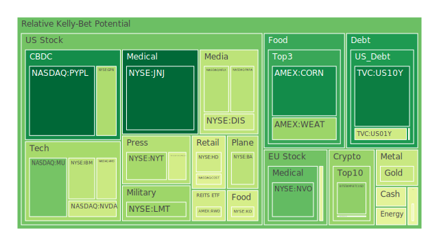
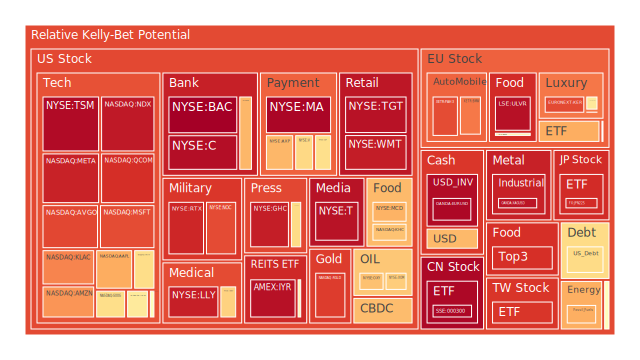
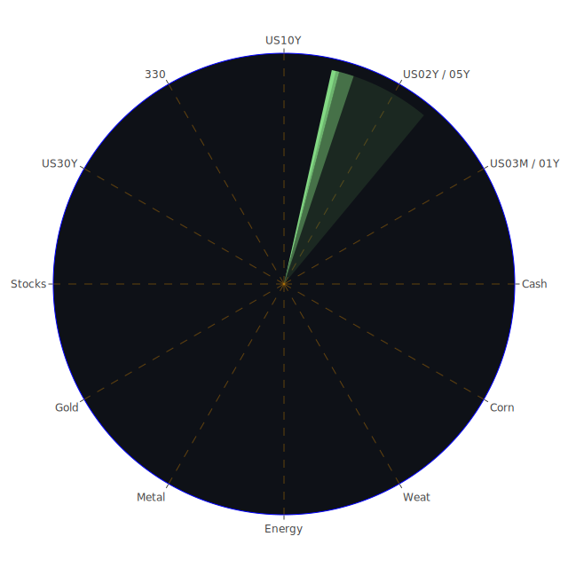

# **投資商品泡沫分析**

在當前錯綜複雜的全球金融環境中，對各類資產的客觀分析顯得至關重要。以下將針對各主要投資類別的現狀進行論述，旨在透過對現象的嚴謹解讀，導引出經過深思熟慮的結論。此處的分析，將避免任何形式的預設立場，僅將市場波動視為多重因素交互作用下的自然結果。

**美國國債**

美國國債市場正處於一個微妙的平衡點。從數據來看，各天期債券的短期風險指標並未顯示出極端的投機熱情。例如，十年期美國國\_債(US10Y)的近期熱度指標相對平穩，維持在0.1至0.3的區間，顯示市場對其定價相對理性。然而，若從更宏觀的視角觀察，聯準會的經濟數據揭示了一幅複雜的圖景。一方面，殖利率曲線的倒掛現象已然反轉，例如十年期與三個月期利差(US Yield 10Y-03M)已由一年前的負值轉為正的0.12，歷史上這通常被解讀為經濟衰退風險的緩解。但另一方面，聯準會的鷹派言論與持續位於高位的聯邦基金利率交易量(EFFR Volume)，共同對債券價格構成壓力。

從博弈論角度看，市場參與者正在聯準會的政策意圖與經濟數據的實際表現之間進行角力。聯準會希望抑制通膨，而市場則試圖預測其政策的轉折點。這種博弈導致了殖利率的波動，例如十年期殖利率從一個月前的4.21%攀升至目前的4.48%。社會心理層面，對未來經濟走向的不確定性，使得一部分尋求避險的資金流入國債，但對通膨固化的擔憂又限制了其價格的上漲空間。因此，美國國債市場呈現出一種「正反合」的拉鋸狀態：經濟數據好轉（正），通膨與緊縮政策擔憂（反），最終形成價格在區間內波動的暫時平衡（合）。

**美國零售股**

零售類股，如沃爾瑪(WMT)、目標百貨(TGT)和好市多(COST)，正展現出顯著的過熱跡象。其短期與長期的風險指標均處於極高水平，例如TGT的月平均風險分數高達0.94，顯示大量資金追逐所帶來的潛在泡沫。這背後反映了一種社會學現象：在經濟不確定性中，消費者傾向於湧向提供必需品、具有價格優勢的大型零售商，投資者也將其視為「防禦性」資產。

然而，這種觀點存在其對立面。聯準會數據顯示，消費者信貸違約率(Consumer Delinquent)與信用卡拖欠率(Credit Card Delinquent)均處於相對高位，這對消費能力構成了直接威脅。新聞事件中，Lululemon對利潤前景的悲觀預測也從側面印證了關稅與消費降級的壓力。因此，零售股的強勢表現（正）與潛在的消費能力惡化（反）之間形成了尖銳矛盾。其綜合結果是，這些股票可能正處於一個由市場心理預期（防禦性）而非基本面（實際消費能力）支撐的高位，一旦消費者信心出現裂痕，其高企的估值將面臨嚴峻考驗。

**美國科技股**

以那斯達克指數(NDX)為首的科技股，其泡沫化程度極高，當日風險指標已達0.94，月平均指標也維持在0.75以上的高檔。微軟(MSFT)、亞馬遜(AMZN)、輝達(NVDA)和蘋果(AAPL)等巨頭均呈現相似的高風險狀態。從概念層面分析，這是一場典型的「敘事驅動」行情。人工智慧(AI)的革命性前景，成為市場參與者（從機構到散戶）共同信奉的「新典範」，這種集體心理預期推動了估值的極限擴張。新聞中「Klarna CEO警告AI可能導致衰退」的負面聲音，在強大的樂觀情緒面前顯得微不足道。

然而，其對立面亦不容忽視。從經濟學角度看，極高的估值意味著未來多年的成長潛力已被提前透支。歷史上，無論是網路泡沫還是其他技術革命，當期望超越現實時，都難免經歷痛苦的修正。博弈論的視角下，這是一個典型的「膽小鬼遊戲」，投資者明知估值過高，但相信自己能在崩盤前離場。當前的「合」表現為一種由資金流動和樂觀敘事所支持的非理性繁榮。聯準會的緊縮政策與高利率環境，對於依賴未來現金流折現估值的科技股而言，始終是一柄懸頂之劍。

**美國房地產指數**

美國房地產市場，以指數IYR及RWO為代表，呈現出高度的泡沫風險。IYR的月平均風險分數穩定在0.9以上，顯示其價格上漲已持續一段時間且幅度巨大。三十年期固定抵押貸款利率高達6.85%，遠高於一年前的2.93%，這在傳統經濟理論中應當對房地產市場構成強力抑制。

此處的矛盾點在於，一方面是極高的借貸成本（反），另一方面是持續上漲的資產價格（正）。這可以從社會學角度解釋：在通膨預期下，實體資產被視為保值工具。同時，聯準會數據顯示商業地產違約率(Commercial Real Estate Delinquent)處於高位，這與住宅市場的堅挺形成對比，顯示風險在不同部門間的不均勻分佈。從博弈論角度看，市場可能在賭聯準會最終將因無法承受高利率對整體經濟的衝擊而被迫轉向。目前的「合」是一種脆弱的平衡，房地產市場的走向高度依賴於未來通膨路徑與央行政策的最終抉擇。

**加密貨幣**

比特幣(BTCUSD)與以太坊(ETHUSD)等主流加密貨幣，其風險指標呈現中等偏上的狀態，且波動劇烈。比特幣的月平均風險分數約為0.45，而以太坊則在0.40左右。這類資產的核心驅動力來自於純粹的市場心理和博弈。它既無內在價值，也無傳統的估值模型可依循。

其三位一體表現為：一種去中心化、抗通膨的未來貨幣的宏大敘事（正）；面臨全球日益嚴格的監管審查與法律風險，以及其高耗能和實際應用場景有限的現實（反）；最終表現為由流動性、新聞事件和投機情緒驅動的劇烈價格波動（合）。例如，任何關於監管的風吹草動或某個意見領袖的言論，都可能引發價格的巨幅震盪。它在本質上是一個高度敏感的、由群體信念維繫的系統。

**金/銀/銅**

貴金屬與工業金屬市場呈現分化。黃金(XAUUSD)與白銀(XAGUSD)的風險指標在近期顯著攀升，特別是白銀，其月平均風險分數高達0.92，表現出強烈的投機動能。銅(COPPER)的風險指標則相對溫和，處於0.52的中間水平。

從概念上，黃金和白銀的強勢，是地緣政治風險（如新聞中提及的俄烏、中東衝突）和對法定貨幣體系信譽擔憂的體現（正）。投資者將其視為超越主權的避險工具。然而，高利率環境會增加持有黃金等無息資產的機會成本（反）。黃金與石油的比率(GOLD OIL RATIO)為50.92，高於去年同期的32.11，顯示相對於能源，黃金價格已處於歷史高位。銅價的相對平穩則反映了市場對全球實體經濟復甦力度的觀望態度，如新聞中吉利汽車主席對全球產能過剩的擔憂。這裡的「合」是：避險需求推高了貴金屬，而經濟前景的不確定性則抑制了工業金屬的表現。

**黃豆 / 小麥 / 玉米**

農產品市場，以黃豆(SOYB)、小麥(WEAT)、玉米(CORN)為代表，其風險指標在近期出現了有趣的變化。黃豆的風險指標從一個月前的0.56飆升至近期的0.90，而小麥和玉米則相對平穩，甚至有所回落。這反映了市場焦點的轉移。

從空間上看，特定產區的氣候、物流（如新聞中洛杉磯港口的貨運量下降）或地緣政治因素（如俄烏衝突影響糧食出口）都可能導致不同品種間的價格分化。從歷史上看，糧食價格與能源價格、美元指數高度相關。當前的狀況是，美元強勢和油價回落對糧食價格構成壓力（反），但特定品種可能因供應鏈問題或投機炒作而出現獨立行情（正）。這是一種結構性的不平衡，而非全面的牛市或熊市。

**石油/ 鈾期貨UX\!**

能源市場，特別是石油(USOIL)，展現了極高的短期波動性。其當日風險指標一度觸及1.0的滿值，但月平均值僅為0.37，顯示近期有突發事件導致價格劇烈反應，但市場對其長期趨勢仍存分歧。鈾期貨(UX1\!)的風險指標則相對較高且穩定，月平均值在0.51左右。

石油市場的博弈極為複雜。地緣政治衝突（中東、俄烏）為油價提供了上漲的想象空間（正）。然而，全球經濟，特別是製造業的疲軟跡象（如德國GDAXI指數的風險指標從高位回落），以及汽車行業對產能過剩的擔憂，都指向了需求端的疲弱（反）。鈾的相對強勢則與能源轉型、核能復興的長期敘事有關。能源市場的「合」，是在短期地緣政治溢價和長期經濟需求放緩之間的激烈博弈。

**各國外匯市場**

外匯市場的核心是美元的強弱。美元兌日圓(USDJPY)的風險指標持續偏高，月平均分數達到0.77，反映了美日之間巨大的利率差距導致的套利交易盛行。歐元兌美元(EURUSD)的風險指標亦攀升至0.9以上，但這更多可能反映了市場對歐洲央行降息預期（新聞提及ECB is 'nearly done' with cuts）的定價。

這裡的正反合是：美國相對強勁的經濟數據和鷹派的聯準會支持了強美元（正）。然而，美國龐大的國債規模（佔GDP比重處於高位）和經常帳戶赤字，是其長期軟肋（反）。最終的匯率表現（合），是各國經濟週期、貨幣政策和資本流動綜合作用的結果。日圓的持續弱勢，已不僅是經濟問題，更可能引發區域性的金融穩定風險。

**各國大盤指數**

全球主要股指呈現顯著分化。美國那斯達克(NDX)和台灣加權指數(0050)因其在半導體和科技產業鏈中的核心地位，風險指標持續處於高位。歐洲指數如德國(GDAXI)和法國(FCHI)的風險指標則從高位回落，反映了對本地區經濟前景的擔憂。中國滬深300指數(000300)的風險指標雖然短期衝高，但月平均值相對較低，顯示市場信心依然脆弱。

這種空間上的分化，是全球經濟碎片化和產業鏈重構的直接體現。以AI為主導的科技革命，其紅利高度集中於少數國家和企業（正）。而傳統製造業和依賴全球化的經濟體則面臨產能過剩和需求不足的困境（反）。全球股市的「合」，不再是齊漲共跌的同步週期，而是結構性分化日益加劇的「K型」復甦。

**美國半導體股**

半導體類股，如輝達(NVDA)、超微(AMD)、應用材料(AMAT)、高通(QCOM)、台積電(TSM)等，是本輪市場泡沫的核心。它們的風險指標普遍處於高位，尤其是台積電，其月平均風險分數高達0.94。這背後的邏輯與科技股的AI敘事完全一致。半導體是實現AI革命的物理基礎，因此承載了市場最樂觀的預期。

其對立面是半導體行業固有的週期性。歷史上，每一次的資本支出狂潮之後，都伴隨著產能過剩和價格戰。當前的高估值，建立在未來需求將會無限線性增長的假設之上。任何關於終端需求（如智能手機、PC）放緩的信號，都可能觸發對整個產業鏈估值的重估。博弈論上，這是一個典型的「贏家通吃」市場，投資者賭注壓在少數幾個龍頭企業身上，加劇了泡沫的集中度。

**美國銀行股**

美國大型銀行股，如摩根大通(JPM)、美國銀行(BAC)、花旗(C)，其風險指標達到了驚人的高位，BAC的月平均風險分數接近0.95。這與傳統認知相悖，因為高利率環境通常會擴大銀行的淨息差。

然而，這種強勢表現（正）的背後隱藏著巨大風險（反）。聯準會數據明確指出，商業地產、住宅地產和消費者信貸的違約率都處於高位。銀行作為風險的最終承擔者，其資產負債表正承受著潛在的壓力。此外，聯準會縮減資產負債表和高位的逆回購(RRP)操作，都顯示金融系統的流動性正在趨緊。銀行股的高風險指標，可能反映了一種市場的短期樂觀情緒，即認為最壞的時期已經過去，而忽視了信貸風險滯後顯現的特點。這是一種危險的脫節。

**美國軍工股**

洛克希德·馬丁(LMT)、雷神(RTX)、諾斯洛普·格魯曼(NOC)等軍工股，其風險指標長期維持在高檔。RTX的月平均風險分數高達0.87。這與全球地緣政治緊張局勢直接相關。新聞中頻繁出現的俄烏衝突、中東戰事等，都成為推動軍工股估值上漲的直接催化劑。

從社會心理學角度看，戰爭和衝突引發的不安全感，會轉化為對軍工產業的「確定性」投資。這是一種負面情緒驅動的正向投資行為。其對立面在於，軍工訂單高度依賴政府預算，一旦地緣政治局勢緩和，或者政府財政不堪重負，其高增長的預期將難以維繫。目前的「合」，是軍工股價格與全球衝突指數的同頻共振，其風險高度集中於地緣政治的持續惡化。

**美國電子支付股**

Visa(V)、萬事達(MA)、美國運通(AXP)和PayPal(PYPL)等電子支付公司，呈現出明顯的分化。Visa和萬事達的風險指標極高，MA的月平均風險分數接近0.90；而PYPL的風險指標則長期處於0.5以下的低位。這反映了市場對不同商業模式的判斷。

V和MA作為支付網絡的基礎設施，受益於消費總量的增長和現金向電子的轉移，市場給予其高確定性溢價（正）。PYPL則面臨來自新興支付方式和傳統金融機構日益激烈的競爭，其成長前景受到質疑。然而，所有支付公司都面臨一個共同的宏觀風險：消費者的信貸健康狀況。信用卡拖欠率的上升，最終會侵蝕整個行業的利潤。高估值的V和MA與疲軟的消費者基本面之間，存在著潛在的矛盾。

**美國藥商股\</h3\>**

\<p\>大型製藥公司如禮來(LLY)、嬌生(JNJ)、默克(MRK)和艾伯維(ABBV)的表現各異。禮來因其在減肥和糖尿病藥物領域的突破性產品，成為市場追捧的明星，其風險指標穩定在0.93的極高水平，呈現出典型的產品驅動型泡沫。相比之下，嬌生和默克的風險指標則相對溫和。\</p\>  
\<p\>這反映了投資的「概念化」趨勢。市場不再關注整個製藥行業，而是追逐擁有「重磅藥物」的單一公司，並給予其極高的估值（正）。這種策略的風險在於，單一產品的成功與否高度不確定，且面臨專利懸崖、競爭加劇和政策監管（如藥價談判）等諸多挑戰（反）。禮來的極高估值，已經將未來數年的理想銷售情況完全定價，任何挫折都可能導致劇烈的回調。\</p\>

**美國影視股**

迪士尼(DIS)和派拉蒙(PARA)等傳統影視媒體股，其風險指標處於中高水平。迪士尼的月平均風險分數約為0.71。這類公司正處於艱難的轉型期，從傳統的有線電視和電影院模式，轉向流媒體。

這個行業的「正反合」體現為：流媒體帶來的全球增長潛力（正）；轉型帶來巨大的內容投入成本、激烈的平台競爭以及用戶增長放緩的現實（反）；最終表現為盈利能力不穩定、股價持續承壓的局面（合）。Netflix(NFLX)作為流媒體的先行者，其風險指標也處於0.47的中間水平，顯示市場對整個行業的長期盈利模式仍持觀望態度。

**美國媒體股**

紐約時報(NYT)和福斯(FOX)等媒體股，其風險指標同樣居高不下。這類資產的價格，除了受其自身經營狀況影響外，還與政治週期和社會思潮的變遷緊密相連。在社會分歧加劇的環境中，擁有明確立場和忠實受眾的媒體，其影響力和定價能力反而可能得到提升。

從社會學角度看，媒體不僅是資訊的傳播者，也是身份認同的塑造者。這種「部落化」的趨勢為其商業模式提供了支撐（正）。然而，它們也面臨著來自社交媒體的衝擊、廣告收入的下滑以及公信力受損的普遍性危機（反）。AI生成內容的興起（如新聞中提及的AI假新聞擔憂），更是對傳統媒體權威性的根本性挑戰。

**石油防禦股**

埃克森美孚(XOM)和西方石油(OXY)等大型石油公司，其風險指標維持在0.7至0.8的高位。在傳統觀念中，石油公司因其業務與油價直接掛鉤，被視為通膨時期的防禦性資產。當油價上漲時，其利潤也隨之水漲船高。

這種觀點（正）在當前環境下面臨挑戰。首先，全球對氣候變遷的共識和能源轉型的推進，對化石燃料的長期需求構成了結構性壓力（反）。其次，正如前述，全球經濟需求的放緩，也可能導致油價在缺乏地緣政治催化劑時回落。因此，投資石油股更像是一種對地緣政治風險和短期通膨的投機，而非傳統意義上的長期「防禦」。

**金礦防禦股**

金礦股，如Royal Gold(RGLD)，其風險指標達到了0.91的極高水平，甚至超過了黃金本身。這在歷史上是市場情緒極度樂觀時才會出現的現象。理論上，金礦股的股價是黃金價格的槓桿，因為其開採成本相對固定，金價上漲會帶來利潤的指數級增長。

市場的邏輯是，如果看好黃金，那麼金礦股能提供更高的回報（正）。但其對立面是，金礦公司自身經營風險極大，包括礦山開採的技術難度、所在國的政治風險、環境保護成本以及公司內部管理問題等（反）。當前的狀況是，市場完全忽略了這些個體風險，將其視為純粹的黃金價格期權。這種樂觀情緒一旦逆轉，其跌幅也將遠超黃金。

**歐洲奢侈品股**

歐洲奢侈品集團，如LVMH(MC)、開雲(KER)和愛馬仕(RMS)，其風險指標普遍處於高位，尤其是開雲集團，月平均風險分數高達0.91。奢侈品消費的韌性，常常被視為一種超越經濟週期的現象，因為其目標客戶是高淨值人群，受經濟波動影響較小。

這種「富人經濟」的敘事（正），在當前面臨考驗。全球性的資產價格泡沫（無論是股市還是房市），是催生奢侈品消費的重要動力。一旦資產價格出現顯著回調，財富效應的逆轉將不可避免地衝擊到奢侈品消費（反）。此外，地緣政治的不穩定，也可能影響全球富裕階層的消費信心。奢侈品股的高估值，內含了對全球財富持續增長的樂觀預期，這本身就是一個巨大的風險點。

**歐洲汽車股**

奔馳(MBG)、寶馬(BMW)和保時捷(PAH3)等德國汽車股，其風險指標在近期有所攀升，但整體仍處於中等水平。歐洲汽車工業正處於歷史性的十字路口。

一方面，它們擁有強大的品牌、技術積累和製造工藝（正）。另一方面，它們在向電動化轉型的過程中，面臨來自特斯拉和中國新興製造商的巨大挑戰，同時還需應對全球汽車產業產能過剩的宏觀困境（反），新聞中吉利主席的警告言猶在耳。歐洲汽車股的估值，正是在這種傳統優勢與未來不確定性的拉扯中尋找平衡。

**歐美食品股**

卡夫亨氏(KHC)、可口可樂(KO)和雀巢(NESN)等大型食品股，風險指標處於中高區間。與零售股類似，它們也被視為防禦性板塊，因為食品是生活必需品，需求相對穩定。

然而，這種防禦性（正）正在被成本端的壓力所侵蝕。大宗商品（糧食、能源）價格的波動、勞動力成本的上升，都對其利潤率構成擠壓。為了轉嫁成本，公司不得不提價，但這又可能面臨消費者的抵制，導致市佔率下降（反）。這些公司的挑戰在於，如何在成本上升和消費降級的雙重壓力下，維持其盈利能力。

# **宏觀經濟傳導路徑分析**

當前的宏觀經濟傳導路徑呈現出高度的複雜性和非線性特徵。一個主要的傳導路徑始於聯準會的貨幣政策。其持續的鷹派立場和高利率環境，旨在抑制CPI（目前年增率2.33%）的同時，也引發了一系列連鎖反應。首先，高利率直接推高了美國國債殖利率，十年期國債殖利率的上升，重塑了全球資產的定價之錨。

這條路徑向下傳導至股市，特別是高估值的科技股。高利率意味著未來現金流的折現值下降，直接打擊了依賴長期增長敘事的科技公司估值。然而，AI革命的強大敘事在一定程度上對沖了這種負面影響，形成了一種估值與利率的脫鉤現象，這是市場心理預期戰勝傳統經濟理論的體現。

另一條路徑是透過美元。強勢的貨幣政策吸引全球資本流入美國，推高美元指數。這對其他經濟體構成了壓力，尤其是日本。美元兌日圓匯率的持續走高，不僅影響日本經濟，也可能觸發區域性的金融不穩定。同時，強美元抑制了以美元計價的大宗商品價格，但地緣政治風險又為油價和黃金提供了支撐，兩者形成對沖。

最後，所有路徑都匯集到實體經濟。高利率加重了企業和個人的債務負擔，商業地產和消費信貸的高違約率便是明證。這條最終的傳導鏈條，目前似乎被市場的樂觀情緒所忽視，但它構成了對當前資產價格泡沫最根本的威脅。

# **微觀經濟傳導路徑分析**

在微觀層面，傳導路徑更為具體和迅速。一則關於特定公司的負面新聞，如Lululemon對其利潤的悲觀預期，會立刻引發其股價下跌。這條路徑會迅速擴散至整個服飾零售行業，因為市場會立即重新評估該行業面臨的共同風險，如關稅和消費降級。

另一種路徑是「概念」的傳導。以AI為例，當輝達發布超預期的財報時，其正面情緒不僅會推高自身股價，還會像漣漪一樣擴散至整個半導體產業鏈，從設計（AMD）、製造（TSM）到設備（AMAT, KLAC），甚至擴散到應用端的大型科技公司（MSFT, GOOG）。這是一種基於產業關聯和市場心理聯想的快速傳導。

供應鏈也是一條關鍵的微觀傳導路徑。例如，俄烏衝突影響了特定農產品的供應，這會直接傳導至食品加工公司（如KHC）的成本端，進而影響其定價策略和盈利能力，最終反映在股價上。同理，紅海的航運危機，會提升全球物流成本，對所有依賴國際貿易的公司（從零售到製造）都構成影響。

# **資產類別間傳導路徑分析**

不同資產類別之間的傳導路徑，揭示了市場內在的聯繫和風險對沖的邏輯。最經典的路徑是「股債關係」。傳統上，股市下跌時，資金會流入債市避險，呈現負相關。但在當前高通膨、高利率的環境下，這條路徑時常失靈。通膨擔憂會同時打擊股票（侵蝕利潤）和債券（利率上升導致價格下跌），導致股債雙殺。

黃金與美元的路徑也值得關注。通常情況下，美元走強，黃金走弱。但當地緣政治風險極高時，兩者可能因同具避險屬性而同步走強。這顯示市場的避險邏輯從單純的經濟避險，轉向了更複雜的政治和安全避險。

能源與工業股之間存在直接的傳導。油價上漲會增加工業企業（如汽車製造商）的成本，抑制其利潤，從而對股價構成壓力。這也解釋了為何油價飆升往往伴隨著對經濟衰退的擔憂。

一個更為隱蔽的傳導路徑存在於房地產和銀行股之間。房地產市場的健康狀況，直接關係到銀行的資產質量。商業地產違約率的上升，是銀行潛在壞帳的領先指標。目前銀行股的高風險指標與房地產市場的高違約率並存，這條傳導路徑的風險正在積聚，一旦爆發，可能引發系統性的金融震盪。

# **投資建議**

基於上述分析，我們在構建投資組合時，必須充分考慮到市場的高度不確定性和結構性分化。當前的環境下，單一的做多或做空策略都面臨巨大風險。一個經過深思熟慮的、跨資產類別的、考慮到不同風險因子的配置方案，才是穩健之道。以下提出三種針對不同風險偏好的優化配置建議：

**穩健型投資組合 (風險承受能力較低)**

* **資產配置比例：**  
  * **核心防禦 (60%):** 主要目標是保全資本和提供穩定現金流。  
    * **美國短期國債 (30%):** 以US01Y或US02Y為代表。在利率處於高位的環境下，短期國債提供了相對較高的票息收入，且利率風險敞口較小。它們的風險指標顯示市場對其定價相對理性。  
    * **高評級防禦性股票 (20%):** 選擇像嬌生(JNJ)或可口可樂(KO)這樣歷史悠久、現金流穩定、風險指標相對較低的公司。它們的業務需求不受經濟週期影響，能提供穩定的股息。  
    * **黃金 (10%):** 作為對沖地緣政治風險和潛在貨幣體系不穩定的保險。儘管其價格處於高位，但在當前動盪的國際局勢下，配置一部分黃金是必要的。  
  * **穩健成長 (30%):** 捕捉市場中相對確定的增長機會。  
    * **支付網絡龍頭 (15%):** 如Visa(V)或萬事達(MA)。雖然其風險指標偏高，但其在支付領域的壟斷地位和持續的商業模式，使其具備長期增長潛力。應視為長期核心持倉。  
    * **大型綜合科技股 (15%):** 如微軟(MSFT)。儘管有泡沫風險，但其在雲計算和企業服務領域的根基深厚，業務多元化，能夠抵禦單一產品線的風險。  
  * **機會型對沖 (10%):** 尋找與主流市場相關性低的機會。  
    * **鈾期貨 (10%):** 以UX1\!為代表。能源轉型和核能復興是長期且獨立的宏觀趨勢，與主流經濟週期的關聯度較低，可作為一種有效的多元化配置。

**成長型投資組合 (風險承受能力中等)**

* **資產配置比例：**  
  * **核心成長 (60%):** 積極參與市場的主流增長趨勢。  
    * **美國科技指數 (25%):** 直接投資於那斯達克100指數(NDX)的相關產品。這是捕捉科技行業整體增長的最直接方式，承認泡沫風險但賭其趨勢的延續。  
    * **半導體龍頭 (20%):** 集中投資於如台積電(TSM)或輝達(NVDA)等在AI產業鏈中處於絕對領先地位的公司。這是對未來科技趨勢的高信念押注。  
    * **全球大盤指數 (15%):** 如追蹤台灣加權指數的0050，捕捉美國以外的科技增長動力，實現一定程度的地域多元化。  
  * **周期性機會 (25%):** 捕捉經濟週期中的特定機會。  
    * **美國大型銀行股 (15%):** 如摩根大通(JPM)。這是在賭經濟軟著陸，高利率環境最終有利於銀行擴大息差，且信貸風險可控。其高風險指標也意味著高潛在回報。  
    * **歐洲奢侈品股 (10%):** 如LVMH(MC)。這是對全球財富效應持續的押注，相信頂級奢侈品的需求韌性。  
  * **風險對沖 (15%):** 保護組合免受尾部風險衝擊。  
    * **美國長天期國債 (15%):** 以US10Y或US30Y為代表。如果經濟因高利率而最終走向衰退，長債將是最佳的避險工具，其價格會大幅上漲。這與核心成長部分的風險暴露形成約-0.5的負相關。

**高風險投資組合 (風險承受能力較高)**

* **資產配置比例：**  
  * **高動能投機 (70%):** 追求短期內的最大回報，承擔極高的波動風險。  
    * **高風險科技股 (30%):** 選擇像Meta(META)或特斯拉(TSLA)這樣具有極高人氣、極大爭議和極高波動性的股票。它們的價格更多由市場情緒和敘事驅動。  
    * **加密貨幣 (20%):** 以比特幣(BTCUSD)和以太坊(ETHUSD)為主。它們是與傳統金融體系相關性最低的資產之一，純粹由投機和資金流驅動，可能帶來極端的回報或虧損。  
    * **金礦股 (20%):** 如Royal Gold(RGLD)。這是對黃金價格上漲的槓桿化押注，旨在最大化地緣政治或通膨風險帶來的收益。其高風險指標也預示著其巨大的潛在波動。  
  * **事件驅動 (20%):** 押注於特定的宏觀或地緣政治事件。  
    * **軍工股 (20%):** 如雷神(RTX)。這是在直接押注全球衝突將會持續甚至升級，其股價與地緣政治緊張程度直接掛鉤。  
  * **極端對沖 (10%):** 為整個組合提供崩盤保護。  
    * **做空高估值零售股 (10%):** 選擇像目標百貨(TGT)這樣風險指標極高，但基本面（消費者信貸健康）脆弱的標的進行對沖。如果消費者信心崩潰，這類股票的下跌空間巨大，可以有效對沖其他資產的系統性風險。

# **風險提示**

投資有風險，市場總是充滿不確定性。本報告完全基於給定的歷史數據和新聞事件進行客觀分析，不構成任何財務建議。所有觀點，包括對資產泡沫、傳導路徑和投資組合的論述，均是基於當前資訊的邏輯推演，未來可能因新的數據或事件而發生改變。市場的複雜性遠超任何模型所能預測，黑天鵝事件隨時可能發生。我們的建議僅供參考，投資者應根據自身的風險承受能力、財務狀況和投資目標，在進行獨立、深入的研究後，做出自己的投資決策。過往表現不能預示未來回報，所有投資都可能產生虧損。

 
Daily Buy Map:

 
Daily Sell Map:

 
Daily Radar Chart:

 
