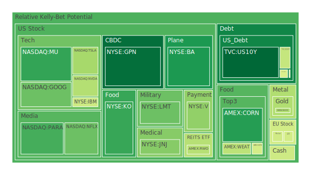
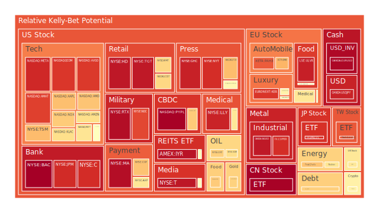
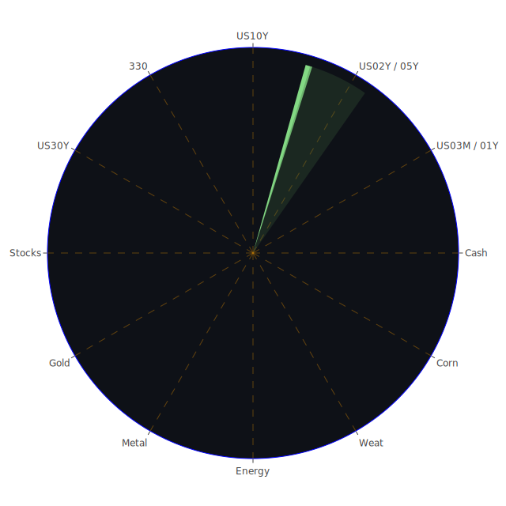

# **投資商品泡沫分析**

本報告旨在對當前全球金融市場的多元資產類別進行深入剖析。我們將摒除所有主觀情緒與偏見，純粹從數據與現象出發，運用經濟學、社會學、心理學及博弈論等多維度視角，解讀市場的複雜動態。當前市場的每一個價格波動、每一次情緒轉變，皆為多方力量交互作用下的自然呈現。我們將深入探討各資產類別的現狀，並追溯其背後的結構性成因與潛在風險。

**美國國債 (U.S. Treasuries)**

美國國債市場，作為全球金融體系的定價之錨，正處於一個極其微妙的十字路口。從數據觀察，短期國債如三個月期 (US03MY) 和兩年期 (US02Y) 的泡沫風險分數在過去一個月中處於中高水平，但近期有所波動。與此同時，十年期 (US10Y) 與三十年期 (US30Y) 的長期國債泡沫分數相對較低，尤其十年期國債的短期風險指標顯著低於市場平均。

這揭示了一種三位一體的市場格局。**正方（Thesis）**：基於經濟學的觀點，聯準會（FED）的鷹派言論以及相對較高的通膨數據（CPIYOY 2.33%），為短期利率提供了支撐，投資者尋求在短期內鎖定無風險收益，導致短期國債需求不墜。**反方（Antithesis）**：然而，從社會學與心理學角度觀察，市場對未來的經濟前景充滿憂慮。新聞中充斥著「AI可能引發衰退」、「經濟不確定性延遲市場復甦」等負面情緒（負面衝擊高達96%），這些預期使得投資者將長期國債視為避險港灣。高位的商業地產與消費者違約率數據，更強化了這種衰退恐懼。**合方（Synthesis）**：兩股力量的結合，導致了殖利率曲線的極度平坦化，甚至在去年出現了深度倒掛（例如，US Yield 10Y-03M 去年為-1.33%）。儘管當前曲線已轉正（0.12），但歷史上，衰退往往發生在倒掛結束之後的陡峭化過程中。博弈論的角度看，市場參與者正在與聯準會對賭，他們不相信在政治壓力與高額公共債務（Debt held by the public % of GDP 處於高位）的背景下，聯準會能夠長期維持緊縮政策。因此，他們願意以較低的長期收益率持有長債，賭未來必然降息。

**美國零售股 (U.S. Retail Stocks)**

零售業股票呈現出顯著的內部分化。一方面，如沃爾瑪 (WMT) 和塔吉特 (TGT) 等傳統零售巨頭的泡沫指數持續處於極高水平（月平均風險分數超過0.90）。另一方面，家得寶 (HD) 雖然泡沫分數也偏高，但其波動性更大。

這背後的三位一體邏輯如下：**正方（Thesis）**：從社會學角度看，面對高昂的生活成本與經濟不確定性，消費者行為出現了明顯的「降級消費」趨勢。資金流向了提供必需品與性價比的沃爾瑪等企業，其股價上漲反映了這種防禦性需求。這是一種集體性的安全感追尋。**反方（Antithesis）**：經濟學的數據卻描繪了另一幅圖景。高位的消費者違約率與僅僅是相對較低的信用卡違約率之間存在矛盾，這可能意味著消費者正在耗盡其信貸額度來維持消費，這種模式難以為繼。家得寶 (HD) 作為房地產市場的晴雨表，其股價的高泡沫分數與高位的房地產違約率和高企的30年期抵押貸款利率（6.85%）形成了鮮明對比，暗示其定價可能過於樂觀。**合方（Synthesis）**：市場似乎陷入了一種博弈困境。投資者一方面因恐懼衰退而買入防禦性的零售股，推高其估值至危險水平；另一方面，又忽視了支撐這些零售企業業績的消費能力本身正在被侵蝕的現實。這種脫節創造了一個脆弱的平衡，任何關於消費支出急劇下滑的信號，都可能導致這些高泡沫股票的崩潰。

**美國科技股 (U.S. Technology Stocks)**

科技股，特別是大型科技股，是當前市場的核心驅動力，同時也是泡沫風險最集中的領域之一。以納斯達克100指數 (NDX) 為例，其短期泡沫分數極高（接近0.99），儘管月度數據稍低，但仍處於危險區間。個股如微軟 (MSFT)、蘋果 (AAPL)、亞馬遜 (AMZN) 和Meta (META) 的泡沫分數均居高不下。

此處的三位一體顯而易見：**正方（Thesis）**：AI革命的敘事在心理學層面捕獲了市場的想像力。新聞中關於Meta投資Scale AI、蘋果WWDC的正面預期，為這個板塊注入了源源不斷的樂觀情緒。投資者相信，AI將帶來前所未有的生產力增長，從而證明當前的高估值是合理的。這是一種對未來無限潛力的集體信仰。**反方（Antithesis）**：然而，從經濟學基本面來看，聯準會的資產負債表正在收縮，流動性有所減弱。科技股作為長久期資產，對利率極為敏感。當前的高利率環境對其估值構成了實質性壓力。Klarna CEO警告AI可能導致白領失業與經濟衰退的新聞，恰恰是對主流AI樂觀敘事的有力反駁。**合方（Synthesis）**：科技股的現狀是「敘事驅動」與「流動性驅動」的結合體。在博弈論中，這被稱為「共有知識」（Common Knowledge）博弈：每個投資者都知道科技股被高估了，但他們也相信別人也知道這一點，並且沒人願意在趨勢結束前率先離場。這種「擊鼓傳花」的遊戲，使得泡沫得以持續。風險在於，一旦敘事出現裂痕（例如AI發展不及預期）或流動性突然收緊，將引發協同性的拋售。

**美國房地地產指數 (U.S. Real Estate Index)**

以 IYR 和 VNQ 等房地產信託基金（REITs）為代表的美國房地產指數，其泡沫分數達到了驚人的高位，月平均分數接近0.9。這與宏觀數據所揭示的風險形成了極大的反差。

**正方（Thesis）**：從投資組合理論來看，在傳統的股債配置中，REITs因其能提供穩定現金流和一定的通膨對沖能力，被視為一種分散風險的工具。投資者可能出於這種傳統的資產配置思維而持續買入。**反方（Antithesis）**：然而，現實經濟數據提供了強烈的警告信號。商業地產違約率（Commercial Real Estate Delinquent）處於高位，30年期固定抵押貸款利率（Fixed Morgage 30Y Rate）維持在6.85%的高位，這對房地產市場的交易活動和估值構成了雙重打擊。社會新聞中關於「HELOC利率大幅上升」的報導，也印證了借貸成本的壓力。**合方（Synthesis）**：市場對房地產指數的定價似乎存在嚴重的認知失調。投資者可能陷入了一種「錨定效應」的心理偏誤，即他們仍然基於過去十年的低利率環境來評估REITs的價值，而未能充分計入當前結構性的利率抬升和信貸緊縮風險。這種高泡沫分數與高違約率並存的現象，是市場失效的典型症狀，暗示著未來可能出現劇烈的價格修正。

**加密貨幣 (Cryptocurrencies)**

以比特幣 (BTCUSD) 和以太坊 (ETHUSD) 為代表的加密貨幣市場，在經歷了前期的劇烈波動後，當前的泡沫指數呈現出中等水平，且近期有從高位回落的跡象。例如，比特幣的單日泡沫分數從0.05到0.51，波動劇烈，但其月平均分數維持在0.46左右，遠低於許多股票資產。

此處的三位一體呈現出投機與反建制的交織。**正方（Thesis）**：從心理學和社會學角度看，加密貨幣是對傳統金融體系不信任的產物。每當銀行業出現壓力（如高違約率）、或是主權貨幣信用受到質疑時，加密貨幣作為「數位黃金」的敘事就會被強化。**反方（Antithesis）**：經濟學上，加密貨幣缺乏內在價值和穩定的現金流，其價格高度依賴於流動性供給和市場情緒。在聯準會收緊流動性的大背景下，其上漲基礎並不牢固。同時，地緣政治風險，如新聞中提到的「中國駭客導致的移動安全危機」，也對去中心化系統的安全性提出了挑戰。**合方（Synthesis）**：加密貨幣市場處於一種博弈的平衡態。它既是高風險的投機工具，也是部分投資者用以對沖系統性風險的另類資產。其相對溫和的泡沫分數可能表明，市場在經歷了多次崩盤後，投機情緒變得更加謹慎。然而，它與科技股一樣，對市場流動性和風險偏好極為敏感，任何宏觀層面的風吹草動都可能引發其價格的劇烈震盪。

**金/銀/銅 (Gold/Silver/Copper)**

貴金屬與工業金屬的表現出現分化。黃金 (XAUUSD) 和白銀 (XAGUSD) 的泡沫指數呈現出截然不同的面貌。黃金的泡沫分數處於中等水平（月均0.56），而白銀則持續處於極高的泡沫水平（月均超過0.92）。工業金屬銅 (COPPER) 的泡沫指數則從高位回落，目前處於中高水平。

金屬市場的三位一體反映了避險與工業需求的拉鋸。**正方（Thesis）**：地緣政治的高度不確定性（俄烏衝突、中東局勢）以及對主權債務的擔憂，為黃金和白銀等貴金屬提供了堅實的避險需求。從博弈論角度看，各國央行出於對美元體系不確定性的擔憂，持續增加黃金儲備，這為金價提供了長期支撐。**反方（Antithesis）**：銅作為全球經濟的「溫度計」，其價格與工業活動息息相關。新聞中關於「經濟不確定性」和中國經濟放緩的擔憂，對銅價構成了壓力。白銀之所以泡沫指數遠高於黃金，除了其避險屬性外，還疊加了其在新能源（如太陽能板）領域的工業需求敘事，這種「雙重屬性」使其吸引了更多投機性資金，推高了泡沫。**合方（Synthesis）**：GOLD/OIL Ratio（51.39）和GOLD/COPPER Ratio（680.42）均處於歷史較高水平，這表明相對於實體經濟需求（石油、銅），市場給予了避險資產（黃金）更高的溢價。這是一個典型的衰退信號。白銀的極高泡沫是這種分裂的極致體現：它既被當作避險資產，又被寄予了工業革命的厚望。這種雙重敘事使其處於一個極不穩定的狀態，一旦工業需求被證偽或避險情緒降溫，其價格可能面臨比黃金更劇烈的回調。

**黃豆/小麥/玉米 (Soybeans/Wheat/Corn)**

農產品市場的泡沫指數普遍不高，甚至可以說是處於中低水平。黃豆 (SOYB)、小麥 (WEAT)、玉米 (CORN) 的月平均泡沫分數均在0.5左右或以下。

這反映了全球供需關係的微妙平衡。**正方（Thesis）**：從社會學角度看，糧食安全是各國政府的核心關切。地緣政治衝突，如俄烏戰爭，持續對全球糧食供應鏈構成威脅。這為農產品價格提供了底層支撐。**反方（Antithesis）**：然而，從經濟學角度看，全球經濟放緩的預期抑制了對飼料（黃豆、玉米）和生物燃料的需求。同時，美元的強勢也對以美元計價的商品價格構成壓力。**合方（Synthesis）**：農產品市場目前處於一種「上有頂，下有底」的區間震盪格局。地緣政治風險構成了價格的「底」，而全球經濟放緩的預期則構成了價格的「頂」。這種相對較低的泡沫分數，可能使其成為在高度不確定的市場環境中，一個相對安全的資產類別，但其上行潛力也可能因此受限。

**石油/鈾期貨 (Oil/Uranium Futures)**

能源市場的表現同樣呈現分化。美國原油 (USOIL) 的泡沫分數在近期顯著下降，月平均分數已降至0.35的低位。與此相反，鈾期貨 (UX\!) 的泡沫分數雖然也有所回落，但仍維持在0.5以上的中等水平。

能源市場的三位一體是短期需求與長期結構性轉變的博弈。**正方（Thesis）**：石油價格的疲軟，直接反映了市場對全球經濟衰退的擔憂。新聞中「經濟不確定性延遲卡車運輸市場爆發」等消息，都指向了能源需求的下降。博弈論上，OPEC+的減產努力正在與市場的衰退預期進行艱難的抗衡。**反方（Antithesis）**：與此同時，鈾的表現則代表了另一種長期敘事。從社會和政治層面看，為了應對氣候變化和追求能源獨立（尤其是在俄烏衝突後），全球範圍內出現了對核能的重新審視。德國計劃擴建地堡、發展核能以應對俄羅斯威脅的新聞，正是這一趨勢的縮影。**合方（Synthesis）**：石油和鈾的價格動態，構成了對能源未來的兩種不同押注。石油代表了依賴於傳統經濟週期的「舊能源」，而鈾則代表了旨在解決能源安全和氣候問題的「新能源」敘事。石油的低泡沫與鈾的中等泡沫並存，表明市場在為短期衰退定價的同時，也願意為長期的能源結構轉型支付一定的溢價。

**各國外匯市場 (Global Forex Markets)**

外匯市場的核心是美元的強勢。美元兌日元 (USDJPY) 的泡沫指數處於0.7至0.8的高位，反映了美日之間巨大的利差驅動下的套利交易極度擁擠。歐元兌美元 (EURUSD) 和英鎊兌美元 (GBPUSD) 的泡沫指數則更高，特別是歐元兌美元接近飽和（0.98），這可能暗示市場對歐洲央行相對於聯準會的鴿派立場定價過度。

**正方（Thesis）**：經濟學的利率平價理論是當前外匯市場格局的主要解釋。聯準會的鷹派立場和相對較高的美國利率，吸引了全球資本流入美元資產。**反方（Antithesis）**：然而，從博弈論角度看，這種單邊的美元強勢是不可持續的。美國高額的財政赤字和公共債務，長期來看會侵蝕美元的信用。此外，過於擁擠的套利交易（如做多USDJPY）本身就蘊含著巨大的平倉風險。一旦市場情緒逆轉，可能引發劇烈的匯率波動。**合方（Synthesis）**：外匯市場的高泡沫指數，特別是在EURUSD和USDJPY上，表明市場可能正處於一個「範式轉換」的前夜。當前的匯率水平過度反映了已知的利率差異，而低估了潛在的經濟衰退風險（可能迫使聯準會轉向）和地緣政治風險。任何動搖美元信心的事件，都可能導致這些擁擠交易的踩踏式平倉。

**各國大盤指數 (Global Equity Indices)**

全球主要股指普遍處於高泡沫區域。除了前面提到的美國納斯達克 (NDX)，台灣50 (0050)、日經225 (JPN225)、德國DAX (GDAXI) 等指數的泡沫分數都非常高。值得注意的是，中國滬深300指數 (000300) 的泡沫指數也衝上了高位（接近0.99），儘管其長期均值相對較低。

**正方（Thesis）**：從全球資本流動的角度看，這是一種「TINA」（There Is No Alternative）心態的體現。在低利率或負利率的環境持續多年後，投資者在心理上已經習慣於將資金投入股市以尋求回報。即使利率已經上升，這種慣性思維依然存在。**反方（Antithesis）**：各國經濟基本面並不完全支持如此高的估值。歐洲面臨能源危機和地緣政治的雙重壓力，日本經濟結構性問題依然存在，而中國則面臨房地產危機和消費不振的挑戰。新聞中關於中美貿易爭端、英國脫歐後續問題的報導，都揭示了全球化合作的裂痕。**合方（Synthesis）**：全球股指的高泡沫化，是一種流動性氾濫與本土敘事結合的結果。例如，日本股市的上漲與公司治理改革有關，台灣股市則受益於半導體週期的預期。然而，這些本土敘事都高度依賴於全球宏觀環境的穩定。在一個緊密相連的全球體系中，一個主要市場的崩潰（如美國科技股泡沫破裂）很可能通過心理傳染和資本流動，引發全球性的連鎖反應。

**其他重要資產類別簡析**

* **美國半導體股 (NVDA,AMD,TSM,AVGO,QCOM,INTC,MU,KLAC,AMAT)**: 這是本輪AI狂熱的核心。以 TSM、AVGO 和 QCOM 為首，其泡沫指數普遍處於0.8-0.9的極高區間。這反映了市場對AI晶片需求近乎無限的預期。然而，這也使其成為市場上最擁擠、風險最高的板塊之一。任何關於需求放緩或庫存增加的信號都將是毀滅性的。歷史上，1995-2000年的網路泡沫中，思科（Cisco）等網路設備公司的股價走勢可作為參照。  
* **美國銀行股 (JPM,BAC,C,COF)**: 銀行股的泡沫指數異常之高（普遍超過0.9），這與FED數據中高企的商業地產違約率形成了尖銳的矛盾。市場似乎完全無視了信貸風險，而僅僅關注於高利率帶來的淨息差改善。這是一種危險的脫節，讓人聯想起2008年金融危機前夕，市場對次貸風險的集體忽視。  
* **美國軍工股 (LMT,NOC,RTX,BA)**: 這些股票的泡沫指數處於中高至高位。地緣政治衝突的常態化為其提供了持續的訂單預期。從博弈論角度看，只要大國競爭的格局不變，軍工股就擁有了長期且穩定的需求。然而，其高估值也使其對任何和平談判或國防預算削減的消息變得敏感。  
* **美國電子支付股 (V,MA,PYPL,GPN)**: 維薩 (V) 和萬事達 (MA) 的泡沫指數極高，反映了它們在全球支付網絡中的雙頭壟斷地位和強大的定價能力。相比之下，貝寶 (PYPL) 的泡沫指數從極高位回落，顯示其在競爭中面臨的壓力。這體現了市場對「護城河」的獎勵和對成長放緩的懲罰。  
* **美國藥商股 (LLY,JNJ,MRK,ABBV,NVO)**: 內部出現了巨大分化。禮來 (LLY) 和諾和諾德 (NVO) 因其在減肥藥領域的突破性進展，泡沫指數達到了極限水平（超過0.9）。這是一種典型的「贏家通吃」市場。而傳統藥廠如嬌生 (JNJ) 的泡沫指數則非常低，顯示資金高度集中於少數幾個熱門敘事。  
* **歐洲奢侈品股 (RMS,KER,MC)**: 普遍處於高泡沫水平。這類股票的表現高度依賴於全球富裕階層的資產價格和消費信心。當前科技股泡沫所創造的財富效應是其重要支撐。一旦股市回調，奢侈品消費將首當其衝，其股價面臨劇烈修正的風險。

# **宏觀經濟傳導路徑分析**

當前的宏觀經濟環境存在多條潛在的傳導路徑。最核心的路徑始於聯準會的政策。**路徑一：持續緊縮引發硬著陸。** FED為應對通膨而持續鷹派，維持高利率 \-\> 借貸成本居高不下 \-\> 企業投資和消費者支出萎縮 \-\> 高位的商業地產和消費者違約率演變為系統性信貸危機 \-\> 經濟陷入深度衰退 \-\> 股市（特別是高估值的科技股和週期股）暴跌，避險資產（長期國債、黃金）上漲。新聞中關於「AI引發衰退」的擔憂，可能在此路徑下成為現實。

**路徑二：過早寬鬆導致通膨復燃。** FED迫於經濟下行壓力或政治壓力而過早降息 \-\> 市場流動性再度氾濫 \-\> 需求被刺激，但供應鏈問題（地緣政治、貿易摩擦）依然存在 \-\> 通膨捲土重來，甚至更高 \-\> FED被迫採取更激烈的緊縮措施，即「走走停停」（Stop-and-Go） \-\> 市場陷入更長期的滯脹（Stagflation）環境，類似1970年代的場景。在此路徑下，實物資產（黃金、大宗商品）將是贏家，而股票和債券將遭受雙殺。

# **微觀經濟傳導路徑分析**

從微觀層面看，企業和消費者的行為變化是關鍵。**路徑一：消費降級的連鎖反應。** 消費者因實際收入下降和信心不足，持續從高端品牌轉向平價品牌 \-\> 奢侈品公司 (KER) 和高端餐飲業績下滑 \-\> 沃爾瑪 (WMT) 等平價零售商受益，但其利潤空間因競爭加劇而受擠壓 \-\> 最終，整體消費總額的下降將拖累所有零售企業，包括防禦性股票。

**路徑二：信貸緊縮的漣漪效應。** 銀行因擔憂高企的違約率而收緊信貸標準 \-\> 中小企業融資困難，擴張計劃擱置甚至破產 \-\> 失業率上升 \-\> 消費者信貸違約進一步惡化 \-\> 銀行壞帳增加，被迫進一步收緊信貸。這是一個典型的負反饋循環，也是經濟硬著陸最常見的微觀機制。高泡沫的銀行股 (JPM, BAC) 在此路徑下面臨巨大風險。

# **資產類別間傳導路徑分析**

資產價格的變動並非孤立，而是相互關聯、相互影響的。**路徑一：科技股泡沫破裂的傳導。** 假設 NVDA 或 NDX 因某種催化劑（如AI發展不及預期）而暴跌 \-\> 造成巨額財富蒸發，打擊投資者信心（心理傳染） \-\> 投資者拋售其他風險資產以彌補虧損，引發市場全面下跌 \-\> 避險情緒升溫，資金湧入美國國債 (US10Y) 和黃金 (XAUUSD) \-\> 美元因避險需求而走強，加劇新興市場的資本外流。

**路徑二：美元信用動搖的傳導。** 假設美國因債務問題或地緣政治失誤導致美元信用受損 \-\> 美元大幅貶值，擁擠的美元套利交易 (USDJPY) 崩潰 \-\> 以美元計價的商品（黃金、石油）價格飆升 \-\> 美國輸入性通膨加劇，迫使FED即使在經濟疲軟時也無法降息 \-\> 美國陷入惡性滯脹，全球金融體系面臨重置風險。

# **投資建議**

基於上述分析，我們必須承認市場正處於一個極度脆弱和不確定的狀態。高泡沫資產與潛在的宏觀風險並存，要求投資組合的構建必須極其謹慎和深思熟慮。以下是針對不同風險偏好的優化配置建議：

穩健型投資組合 (Conservative Portfolio)  
此組合旨在最大限度地保全資本，並從市場的極端定價中尋找相對安全的價值。

* **配置比例:**  
  * **現金及短期美國國債 (1-3年期): 60%**  
    * 子項目1: 直接持有1-3年期美國國債。  
    * 子項目2: 投資於主要投資短期國債的貨幣市場基金。  
    * 子項目3: 少量配置如嬌生 (JNJ) 這類泡沫指數極低、現金流穩定的高品質藍籌股。  
    * *理由*: 在殖利率曲線平坦且短期利率處於高位時，持有短期現金等價物能提供可觀的無風險收益（相對於通膨），同時保持極高的流動性以應對市場突變。JNJ的低泡沫分數為組合提供了一絲成長潛力而風險有限。  
  * **黃金: 25%**  
    * 子項目1: 實物黃金或黃金ETF (XAUUSD)  
    * 子項目2: 黃金礦業公司中風險較低的龍頭，如紐蒙特礦業 (NEM，未在數據中但作為示例)。  
    * 子項目3: 白銀 (XAGUSD)，但比例需嚴格控制，因其波動性更大。  
    * *理由*: 黃金是對沖地緣政治風險、主權債務危機和潛在滯脹的最佳工具。其當前的中等泡沫水平使其比許多股票更具吸引力。  
  * **農產品: 15%**  
    * 子項目1: 廣泛的農產品指數基金 (如DBA，未在數據中但作為示例)。  
    * 子項目2: 玉米ETF (CORN)  
    * 子項目3: 黃豆ETF (SOYB)  
    * *理由*: 農產品的泡沫指數較低，其價格受基本供需驅動，與金融市場的關聯性較低，能提供良好的分散化效果。

成長型投資組合 (Growth Portfolio)  
此組合試圖在風險與回報之間取得平衡，承認主流趨勢的同時，也為潛在的風格輪換做準備。

* **配置比例:**  
  * **全球科技與半導體: 40%**  
    * 子項目1: 納斯達克100指數基金 (NDX) 以分散風險。  
    * 子項目2: 半導體龍頭台積電 (TSM)，因其在產業鏈中的核心地位。  
    * 子項目3: 谷歌 (GOOG)，相對於其他科技巨頭，其估值和泡沫指數略微合理。  
    * *理由*: 無法完全忽視AI這一長期結構性趨勢。但通過指數化和選擇龍頭企業，來降低單一個股的非系統性風險。  
  * **能源與軍工: 35%**  
    * 子項目1: 石油防禦股如埃克森美孚 (XOM)。  
    * 子項目2: 鈾期貨 (UX\!) 或相關ETF，押注能源轉型。  
    * 子項目3: 軍工龍頭洛克希德·馬丁 (LMT)。  
    * *理由*: 這是對「通膨與衝突」主題的直接投資。無論經濟走向衰退還是滯脹，能源和國防開支都具有相對的韌性，可以有效對沖科技股的風險。  
  * **支付與金融基礎設施: 25%**  
    * 子項目1: 萬事達卡 (MA)，因其強大的網絡效應和定價權。  
    * 子項目2: 貝寶 (PYPL)，作為一個估值已大幅回調的逆向投資標的。  
    * 子項目3: 芝加哥商業交易所集團 (CME，未在數據中但作為示例)，因其在市場波動中受益的商業模式。  
    * *理由*: 投資於金融體系的「賣水人」，無論經濟好壞，交易和支付的需求持續存在。選擇高泡沫的龍頭和低泡沫的追趕者，形成內部對沖。

高風險型投資組合 (High-Risk Portfolio)  
此組合專為能夠承受巨大波動且尋求最大化回報的投資者設計，高度集中於當前市場的核心敘事和潛在轉折點。

* **配置比例:**  
  * **AI核心晶片與軟體: 50%**  
    * 子項目1: 英偉達 (NVDA)，作為AI計算領域的絕對領導者。  
    * 子項目2: 博通 (AVGO)，因其在網絡和定製晶片領域的護城河。  
    * 子項目3: 微軟 (MSFT)，因其將AI應用於軟體生態的強大能力。  
    * *理由*: 直接押注AI革命的核心。這是一個高動量、高風險的策略，賭的是當前的泡沫能夠持續甚至進一步膨脹。  
  * **生物科技突破: 30%**  
    * 子項目1: 禮來公司 (LLY)，減肥藥和阿茲海默症藥物的領導者。  
    * 子項目2: 諾和諾德 (NVO)，GLP-1藥物的另一巨頭。  
    * 子項目3: 小盤生物科技ETF，以捕捉下一個突破性技術。  
    * *理由*: 押注於能夠改變人類生活的顛覆性醫療技術。這同樣是一個贏家通吃的市場，潛在回報巨大，但政策和臨床試驗風險也很高。  
  * **去中心化金融與數位資產: 20%**  
    * 子項目1: 比特幣 (BTCUSD)。  
    * 子項目2: 以太坊 (ETHUSD)。  
    * 子項目3: Circle (USDC相關，正面新聞提及)，作為合規化穩定幣的代表。  
    * *理由*: 對沖傳統金融體系崩潰的「末日保險」。在經歷回調後，其風險回報比相對於高位的股票可能更具吸引力。這是一個與主流資產負相關性較強的押注。

# **風險提示**

投資有風險，市場總是充滿不確定性。本報告的所有分析均基於當前可得的數據和信息，並在特定的理論框架下進行解讀。過去的表現不預示未來的回報，極高的泡沫指數預示著潛在的劇烈回調風險。我們的建議僅供參考，不構成任何投資要約或承諾。投資者應根據自身的風險承受能力、財務狀況和投資目標，在進行獨立思考和深入研究後，做出審慎的投資決策。市場的複雜性遠超任何模型的預測能力，請務必保持敬畏之心。

 
Daily Buy Map:

 
Daily Sell Map:

 
Daily Radar Chart:

 
