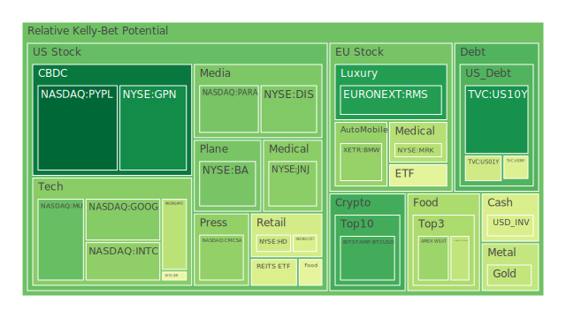
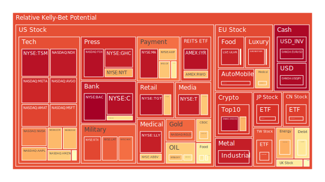
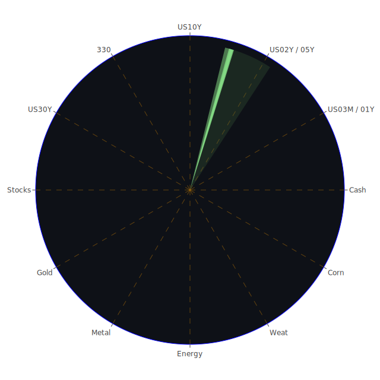

# **投資商品泡沫分析**

在當前錯綜複雜的全球金融環境下，各類資產的價格波動與潛在風險評估，成為了所有市場參與者最為關注的核心議題。我們將深入剖析各大資產類別的現狀，從數據中提煉觀點，旨在提供一個全面且深思熟慮的結論。

* **美國國債**

美國國債市場，作為全球金融體系的基石，其殖利率曲線的形態變化是解讀宏觀經濟預期的關鍵。從數據來看，短、中、長期公債的泡沫指數呈現出分化的態樣。例如，十年期美國國債(US10Y)的泡沫指數相對較低，其月平均(D30)分數約在0.29至0.31之間，顯示市場對其長期價值的認可度較高，或視為相對安全的避風港。然而，兩年期(US02Y)與三個月期(US03MY)公債的泡沫指數則相對偏高，特別是兩年期公債的各週期分數均穩定在0.60以上，這反映了市場對於聯準會短期利率政策的高度不確定性。

從歷史視角觀察，當前的殖利率曲線形態——儘管10年期與3個月期的利差（0.06）已由負轉正，但仍然處於極低水平——與過去經濟衰退前的景象有相似之處，但也有其獨特性。過去的深度倒掛往往預示著衰退，而目前的平坦化可能反映了市場正處於一種博弈狀態：一方押注聯準會將因經濟數據轉弱而降息，另一方則因持續的通膨壓力與聯準會的鷹派言論而保持謹慎。聯準會的經濟數據摘要中提到，儘管整體通膨年增率(CPIYOY)降至2.40%，但30年期固定抵押貸款利率仍高達6.85%，消費者與商業地產的違約率處於相對高位，這些都對未來的經濟路徑構成挑戰。這種矛盾的信號，正是短期債券市場風險情緒升高的根源。從社會學角度看，高漲的借貸成本直接衝擊普通家庭與企業，其傳導效應將逐步顯現。

* **美國零售股**

零售行業的表現是衡量消費信心的直接指標。數據顯示，大型零售商如沃爾瑪(WMT)與塔吉特(TGT)的泡沫指數異常之高，月平均分數雙雙超過0.90，沃爾瑪的短期泡沫分數(D1)雖有回落至0.67，但整體風險依然居高不下。另一家零售巨頭好市多(COST)的泡沫分數雖略低，但月平均值也達到了0.56。這呈現出一種弔詭的現象：在消費者信貸違約率攀升、經濟前景不明朗的背景下，作為民生必需品出口的龍頭企業，其股價卻被推升至高風險區域。

這背後可能存在多重假設。經濟學上，這或許反映了「口紅效應」的變體，即在經濟不確定性中，消費者傾向於在大型、可信賴的折扣零售商處集中消費，尋求性價比。心理學上，投資者可能將這些公司視為防禦性資產，認為其業務在經濟下行週期中具有韌性，從而產生了避險資金的湧入，推高了估值。然而，新聞事件揭示了另一面，例如全球最大廣告集團WPP下調2025年廣告收入預測，以及多家大公司宣布裁員的消息，都預示著未來消費力可能面臨的挑戰。將此情景與2008年金融海嘯前夕對比，當時市場也曾一度相信某些「大到不能倒」的企業具有絕對的防禦性，但最終系統性風險來臨時，所有資產都面臨重新定價。因此，當前零售股的高泡沫分數，很可能是一種市場在「防禦性」共識下的過度追捧，其脆弱性不容忽視。

* **美國科技股**

科技股，特別是大型科技巨頭與半導體產業，再次成為市場的焦點，但其內部已出現顯著分化。以微軟(MSFT)、META、蘋果(AAPL)為首的大型科技股，泡沫指數普遍偏高，月平均分數分別位於0.71、0.89與0.67左右。這反映了市場對於人工智慧(AI)革命的巨大憧憬，將其視為驅動下一輪增長的核心動力。從博弈論角度看，這是一場典型的「膽小鬼遊戲」，各大巨頭投入巨資進行軍備競賽，而投資者則押注領先者將贏家通吃，從而給予了極高的估值溢價。

然而，這種樂觀情緒並非沒有陰影。谷歌(GOOG)的泡沫指數相對較低（月平均約0.55），這可能反映了市場對其在AI領域競爭地位的一些疑慮。而傳統科技股如IBM，其泡沫指數也處於中高水平，顯示市場仍在尋找AI產業鏈中被低估的價值。新聞中關於GitLab等軟體公司財報不如預期導致股價大跌的事件，提醒我們，並非所有科技公司都能在AI浪潮中受益。這種「贏家通吃」的預期本身，就蘊含著巨大的風險。一旦領頭羊的業績增長無法匹配其高聳的估值，或是監管壓力（如美國調查外國賄賂團隊規模縮減等新聞所暗示的全球監管環境變化）加劇，可能引發劇烈的板塊回調。

* **美國房地產指數**

美國房地產市場的指標，如IYR與VNQ，均顯示出極高的泡沫風險，其各週期泡沫分數普遍在0.90以上，特別是短期指標已逼近滿分。這與宏觀數據形成了尖銳的對比：30年期固定抵押貸款利率高達6.85%，商業地產與房地產的拖欠率均處於相對高位。價格與基本面之間的巨大鴻溝，是理解當前房地產市場風險的關鍵。

從經濟學角度看，這種脫節可能是由供需失衡與持續的流動性所共同造成的。儘管借貸成本高昂，抑制了新購房者的需求，但市場上的存量房源可能依然稀缺。同時，聯準會資產負債表雖有縮減，但整體銀行體系的存款水平依然很高，部分資金可能仍在尋找實體資產以對抗潛在的通膨。從社會學角度分析，房地產作為財富儲存的傳統工具，其心理慣性依然強大。然而，歷史上，沒有哪個市場的泡沫能夠在利率持續高企的環境下長期維持。1980年代末日本的房地產泡沫，以及2007年美國的次貸危機，都是在前一輪加息週期之後破裂的。當前的高泡沫指數，是對未來利率將會大幅下降的極度樂觀預期，一旦這個預期落空，或者商業地產的危機向住宅地產蔓延，其調整的幅度將是劇烈的。

* **加密貨幣**

以比特幣(BTC)和以太坊(ETH)為代表的加密貨幣市場，呈現出冷熱不均的景象。比特幣的泡沫指數經歷了從高位回落的過程，其月平均泡沫分數約為0.45，而短期分數則更低，顯示市場的狂熱情緒有所降溫。以太坊的情況類似，月平均分數約為0.41。有趣的是，狗狗幣(DOGE)的泡沫指數在近期出現了劇烈波動，從低位飆升至0.97，這通常與特定的市場事件或情緒炒作有關，而非基本面驅動。

從心理學角度看，加密貨幣市場是投機情緒的放大器。其價格波動與傳統市場的關聯性時強時弱，使其成為一個獨特的觀察窗口。當前比特幣和以太坊泡沫指數的相對平穩，可能意味著在經歷了前幾年的劇烈波動後，市場參與者的結構發生了變化，更多機構投資者的入場可能平抑了部分短線投機。然而，Circle股價的連續上漲等新聞，顯示圍繞穩定幣與區塊鏈應用的資本熱情仍在。博弈論的視角下，加密貨幣市場是監管、技術創新與投機力量三方博弈的舞台。美國證券交易委員會(SEC)的態度、各國央行的數位貨幣計畫，都可能成為改變遊戲規則的關鍵變數。狗狗幣的脈衝式泡沫，則完美詮釋了社群情緒驅動下的「非理性繁榮」，其風險不言而喻。

* **金/銀/銅**

貴金屬與工業金屬市場的走勢揭示了市場對經濟前景的矛盾看法。黃金(XAUUSD)的泡沫指數處於中等水平（月平均約0.54），顯示其避險屬性與抗通膨敘事仍在發揮作用，但並未達到極度狂熱的程度。白銀(XAGUSD)的泡沫指數則異常之高，月平均值超過0.93，顯示其除了貴金屬屬性外，其工業屬性或投機屬性被市場極度放大。銅(COPPER)的泡沫指數則從高位回落，月平均約在0.53，反映了市場對全球工業活動前景的擔憂。

黃金與石油的比率(GOLD OIL RATIO)為49.15，高於去年同期的31.15，顯示相對於能源，黃金的定價權更強，這通常被解讀為避險情緒的體現。而黃金與銅的比率(GOLD COPPER RATIO)也處於歷史高位，進一步驗證了市場對經濟增長的疑慮。白銀的極高泡沫，可能是一種複雜的博弈。一方面，投資者可能看好其在綠色能源（如太陽能板）中的應用前景；另一方面，其相對於黃金的歷史低價，可能吸引了大量投機性買盤，試圖複製歷史上白銀價格的劇烈彈跳。這種投機性蓋過了其作為經濟晴雨表的工業屬性。金礦防禦股如RGLD的泡沫指數也處於高位（月平均0.90），顯示資金不僅在追逐金屬本身，也在追逐生產這些金屬的公司，這是一種加槓桿的避險行為，風險與回報同步放大。

* **黃豆 / 小麥 / 玉米**

農產品市場的泡沫指數呈現中等偏高的狀態。黃豆(SOYB)的泡沫指數在近期有所上升，月平均達到0.56。玉米(CORN)與小麥(WEAT)的泡沫指數則相對平穩，月平均分別在0.44和0.35左右。農產品價格受到天氣、地緣政治、能源成本和全球需求的綜合影響。

從歷史上看，農產品價格的飆升往往與供應鏈中斷（如戰爭、惡劣天氣）或通膨預期高漲有關。當前，俄烏衝突仍在繼續，全球部分地區面臨乾旱或洪澇，這些都為農產品價格提供了支撐。然而，世界銀行下調全球經濟增長預測的新聞，又為需求端蒙上了陰影。這種多空交織的局面，使得農產品市場處於一種微妙的平衡中。從社會學角度看，糧食安全是各國政府的核心關切。俄羅斯計畫加強與非洲的經濟和軍事聯繫，其中可能就包括糧食出口，這將對全球糧食貿易格局產生深遠影響。農產品市場的泡沫指數溫和，表明市場尚未就未來方向形成一致的極端預期，但潛在的供應衝擊風險依然存在。

* **石油/ 鈾期貨UX\!**

能源市場的信號複雜且分歧。美國原油(USOIL)的泡沫指數從高位回落，月平均值降至0.40以下，顯示市場對短期需求前景的擔憂超過了對供應中斷的恐懼。與此同時，鈾期貨(UX1\!)的泡沫指數保持在中等水平（月平均約0.51），反映了市場對核能作為長期清潔能源選項的持續興趣。

石油價格的回落，與世界銀行下調全球經濟預測、美國消費者信貸數據疲軟等宏觀信號相一致。然而，地緣政治風險並未消失。以色列與哈馬斯的衝突、俄烏戰爭仍在持續，任何一方的升級都可能迅速改變市場情緒。石油防禦股如埃克森美孚(XOM)和西方石油(OXY)的泡沫指數處於中高水平（月平均分別為0.75和0.71），這表明儘管油價回落，投資者仍然願意為這些現金流充裕、能夠在高油價環境下產生巨大利潤的公司支付溢價，這是一種對未來油價反彈的對沖。鈾市場則是一個更為純粹的長期敘事，其價格波動較少受到短期經濟週期的影響，更多地取決於全球能源政策的轉向和新核電站的建設規劃。

* **各國外匯市場**

外匯市場是各國經濟實力與貨幣政策的直接較量。美元兌日圓(USDJPY)的泡沫指數居高不下，月平均達到0.79，反映了美日之間巨大的利率差距導致的套利交易持續發酵。歐元兌美元(EURUSD)的泡沫指數同樣處於極高水平（0.93），英鎊兌美元(GBPUSD)也處於中高位（0.51）。這表明市場普遍預期美元將維持強勢，或者說，對歐元區和英國的經濟前景比對美國更為悲觀。

從博弈論角度看，日本央行處於兩難境地。過度寬鬆的貨幣政策導致日圓大幅貶值，輸入性通膨壓力巨大；但如果貿然收緊政策，又可能扼殺脆弱的經濟復甦，並引爆其龐大的國債市場。因此，市場押注其在短期內難有大作為。歐元區和英國則面臨經濟增長乏力與通膨並存的「滯脹」風險。新聞中提到歐洲市場如法國CAC40(FCHI)和德國DAX(GDAXI)的泡沫指數處於中等水平，但歐洲奢侈品股(KER, MC)的泡沫指數卻時高時低，顯示出結構性的分化。強勢美元環境下，非美貨幣普遍承壓，這也加劇了全球資本流動的複雜性。

* **各國大盤指數**

全球主要股市指數的泡沫水平呈現出明顯的地域差異。美國納斯達克100指數(NDX)的泡沫指數高企（月平均0.77），主要由大型科技股驅動。相比之下，歐洲的德國DAX指數和英國富時100指數(FTSE)的泡沫指數則溫和得多（月平均在0.53-0.57之間）。亞洲方面，日本日經225指數(JPN225)的泡沫指數極高（月平均0.87），而中國滬深300指數(000300)雖然近期有所反彈，但月平均泡沫指數仍高達0.81，顯示其波動性與政策敏感性。台灣加權指數的代表0050的泡沫指數也處於高位（月平均0.69）。

這種分化反映了全球經濟復甦的步伐不一，以及各自面臨的結構性問題不同。美國股市的強勢，很大程度上依賴於少數幾家科技巨頭的卓越表現，這是一種高度集中的風險。日本股市的上漲，部分得益於日圓貶值帶來的出口企業匯兌收益，以及公司治理改革的預期。中國股市則在努力擺脫房地產行業下行和地方政府債務問題的困擾，其反彈的可持續性仍有待觀察。從歷史上看，全球股市的高度分化往往難以持久，最終會通過資本流動或宏觀事件衝擊而趨於收斂。

* **美國半導體股**

半導體行業是本輪科技熱潮的「軍火商」，其泡沫化程度也最為嚴重。輝達(NVDA)、高通(QCOM)、博通(AVGO)以及台積電(TSM)的泡沫指數均處於極高水平，月平均值分別為0.63, 0.85, 0.82, 和0.93。應用材料(AMAT)和科磊(KLAC)等設備商的泡沫指數也同樣高企。這表明市場對AI驅動的晶片需求抱有近乎無限的樂觀預期。

經濟學中的「棘輪效應」可以用來解釋這種現象：一旦市場對某個行業的增長預期達到一個新的高度，就很難在沒有重大利空的情況下回落。投資者似乎相信，AI對算力的需求將是長期且指數級增長的，足以消化當前的高估值。然而，半導體行業歷史上是一個高度週期性的行業。歷史上，1995年和2000年的科技泡沫中，半導體股都經歷了從天堂到地獄的過程。當前的風險在於，如果AI的商業化落地速度不及預期，或者出現了新的、更節能的計算範式，對現有晶片的巨大需求可能會突然降溫。此外，地緣政治風險（如中美科技戰）始終是懸在該行業頭上的一把劍。

* **美國銀行股**

美國大型銀行股，如美國銀行(BAC)、摩根大通(JPM)和花旗(C)，其泡沫指數呈現出令人警惕的高水平，特別是美國銀行的月平均分數已達到0.94。這與去年區域性銀行危機時的恐慌情緒形成了鮮明對比。

這種高泡沫可能有多重解釋。從樂觀的角度看，市場可能認為聯準會的緊縮週期即將結束，銀行業最壞的時期（利率急升導致的未實現債券損失）已經過去。隨著經濟「軟著陸」，淨息差將保持在一個健康的水平。此外，大型銀行在行業整合中受益，吸收了部分從中小銀行流出的存款。然而，從悲觀的角度看，這完全忽視了潛在的風險。宏觀數據顯示，商業地產、房地產和消費信貸的違約率都在上升，這將直接侵蝕銀行的資產負債表。銀行股的高泡沫指數，與信貸風險上升的基本面背道而馳。這可能是一種博弈：市場押注聯準會和政府在必要時會再次出手救助「大到不能倒」的金融機構。這種隱含的道德風險，正是泡沫得以吹大的心理溫床。

* **美國軍工股**

軍工股，如洛克希德馬丁(LMT)、諾斯洛普格魯曼(NOC)和雷神(RTX)，其泡沫指數處於高位，月平均分數分別為0.62, 0.76和0.88。這直接反映了全球地緣政治緊張局勢的加劇。

從最直接的因果關係看，俄烏戰爭、中東衝突以及亞太地區的潛在緊張局勢，都導致各國國防預算顯著增加。加拿大承諾提前達到北約國防開支目標的新聞，就是一個縮影。從社會心理學角度，當外部威脅感知增強時，國家安全的需求會壓倒其他考量，為國防開支的合理性提供背書。投資者將軍工股視為地緣政治風險的直接對沖工具。然而，風險在於，首先，軍工股的估值已經計入了非常高的增長預期，任何和平的曙光或外交突破，都可能導致其估值快速回調。其次，國防合約的簽訂和執行週期很長，且受到政府預算和政治風向的嚴格約束，其業績增長並非線性。

* **美國電子支付股** 電子支付行業，包括Visa(V)、萬事達卡(MA)、PayPal(PYPL)和Global Payments(GPN)，呈現出顯著的分化。Visa和萬事達卡的泡沫指數處於中高至高位（月平均分別為0.77和0.91），顯示市場對這兩家支付網絡巨頭的商業模式護城河依然充滿信心。相比之下，PayPal和GPN的泡沫指數則低得多（月平均分別為0.48和0.24），反映了它們在日益激烈的競爭格局中面臨的挑戰。

這種分化背後，是商業模式的差異。Visa和萬事達卡作為底層支付軌道，受益於整體消費額的增長和現金向電子的轉移，其網絡效應構成了難以逾越的壁壘。PayPal等則面臨著來自蘋果支付、銀行自有支付系統以及各種新興金融科技公司的激烈競爭。從博弈論角度看，支付領域正在上演一場多方參與的平台戰爭。Visa和萬事達卡的高估值，是市場押注其「守城」成功的結果。而PayPal的低估值，則是對其能否在新的競爭格局中成功「突圍」的疑問。這也反映了投資者偏好的轉變：從追逐高增長的故事，轉向尋求確定性和壟斷地位。

* **美國藥商股** 大型製藥公司的泡沫指數呈現兩極分化，這主要由特定藥品的成敗所驅動。禮來(LLY)的泡沫指數達到了驚人的0.93，諾和諾德(NVO)的指數也處於中高水平。這兩家公司在GLP-1減肥藥領域的巨大成功，是其股價飆升的主要原因。與此同時，其他大型藥企如輝瑞(PFE)、默克(MRK)和嬌生(JNJ)的泡沫指數則相對溫和得多，其中嬌生的月平均指數僅為0.18。

這完美詮釋了「贏家通吃」的市場邏輯。市場給予了減肥藥這個單一賽道極高的估值，其樂觀預期甚至外溢到其他行業，例如新聞中提到麥當勞因減肥藥風險而遭到罕見的賣出評級。從社會學角度看，減肥藥的流行反映了當代社會對健康和外貌的極度焦慮，創造了一個巨大的潛在市場。然而，歷史經驗表明，押注於「重磅炸彈」藥物的策略風險極高。專利懸崖、競爭對手的新藥、未知的副作用以及政府對藥價的監管，都可能導致估值在短時間內崩塌。禮來的高泡沫指數，不僅押注了其當前藥品的成功，更押注了其未來數年內都將維持絕對的市場領導地位，這是一個需要高度警惕的信號。

* **美國影視股** 影視娛樂行業，如迪士尼(DIS)、Netflix(NFLX)和派拉蒙(PARA)，其泡沫指數處於中等水平，但內部存在差異。迪士尼的泡沫指數相對較高（月平均0.66），Netflix次之（0.48），而派拉蒙較低（0.44）。這反映了流媒體戰爭在經歷了初期的燒錢擴張後，進入了一個更加注重盈利和可持續性的新階段。

從經濟學角度看，流媒體行業正從追求用戶增長的「邊際成本為零」的理想模型，回歸到內容製作成本高昂、用戶付費意願有限的現實。Netflix泡沫指數的相對回落，可能與其打擊密碼共享、推出廣告套餐等一系列旨在提升單用戶收入（ARPU）的務實舉措有關。迪士尼則在傳統業務（主題公園、電影）與流媒體轉型之間尋求平衡，市場對其能否成功整合併實現協同效應抱有較高期望，但也因此給予了更高的風險定價。派拉蒙等規模較小的參與者，則面臨著是否要「賣身」的生存博弈。整個行業的未來，取決於能否在內容軍備競賽和用戶審美疲勞之間找到一個可持續的盈利模式。

* **美國媒體股** 傳統與新興媒體股的命運截然不同。福斯(FOX)的泡沫指數居高不下，月平均值達到0.80，而紐約時報(NYT)的泡沫指數波動劇烈，月平均也達到了0.72。這表明在資訊爆炸的時代，能夠吸引並鎖定特定受眾群體的媒體品牌，依然具有很高的市場價值。

從社會學和心理學角度分析，媒體行業的分化反映了社會的兩極化和資訊繭房的形成。福斯新聞憑藉其鮮明的政治立場，在特定觀眾群體中擁有極高的粘性，這為其帶來了穩定的廣告和訂閱收入，市場願意為這種確定性支付高溢價。紐約時報作為傳統權威媒體的代表，其高泡沫指數則可能來自於其在數位化轉型上的成功，以及市場認為在假新聞氾濫的環境下，對高品質、可信賴內容的需求將會回歸。然而，這兩個案例都顯示出，媒體的價值越來越依賴於其製造「稀缺性」（無論是獨特的觀點還是權威的報導）的能力。但這種商業模式也極易受到公信力危機或觀眾口味變化的衝擊。

* **石油防禦股**與**金礦防禦股** 這兩類資產通常在不同市場環境下受到青睞，但當前它們的泡沫指數都處於中高至高位。石油防禦股（XOM, OXY）的高泡沫指數前文已述，是對未來能源價格不確定性的一種對沖。金礦防禦股(RGLD)的高泡沫指數（月平均0.90）則更為引人注目，它遠高於黃金本身的中等泡沫水平。

這是一種典型的「賣鏟人」邏輯的極致演繹。投資者不僅看好黃金，更看好開採黃金的企業能夠帶來的經營槓桿。在金價上漲週期中，金礦公司的利潤增長速度會遠超金價本身的漲幅。然而，這也意味著風險的放大。金礦公司面臨著經營風險（如礦難、罷工）、地緣政治風險（礦山所在國的政策變化）以及成本上升（能源、人力）的壓力。將金礦股的泡沫指數與黃金本身的指數進行比較，兩者之間巨大的差距，暗示市場可能過於樂觀地評估了金礦公司的盈利前景，而低估了其內在的經營風險。這是一種在避險需求驅動下的高風險投機行為。

* **歐洲奢侈品股**與**歐洲汽車股** 歐洲市場的這兩個代表性行業，呈現出截然不同的景象。以開雲集團(KER)和LVMH集團(MC)為代表的奢侈品股，泡沫指數在高位震盪，KER的月平均分數高達0.92。而以賓士(MBG)、BMW(BMW)和保時捷(PAH3)為代表的汽車股，泡沫指數則處於中等偏高但相對溫和的水平。

這種分化揭示了全球消費降級與消費升級並存的K型復甦格局。奢侈品的核心消費者是金字塔頂端的富裕階層，其消費能力受宏觀經濟波動的影響相對較小。奢侈品公司強大的品牌護城河和定價權，使其成為抵禦通膨的優質資產。其高泡沫指數，是市場對這種稀缺性和韌性的高度認可。然而，風險在於，即便是富裕階層的消費信心也並非無限，特別是當資產價格（如股市、房市）出現大幅回調時。歐洲汽車股則面臨著來自中國電動車的激烈競爭和自身向電動化轉型的巨大挑戰。其溫和的泡沫指數，反映了市場對其未來盈利能力的不確定性。這是一場傳統巨頭與新興力量的博弈，結果遠未確定。

* **歐美食品股** 食品飲料巨頭，如可口可樂(KO)、卡夫亨氏(KHC)、雀巢(NESN)和聯合利華(ULVR)，作為傳統的防禦性板塊，其泡沫指數普遍處於中高水平。聯合利華的月平均指數甚至達到了0.95，可口可樂和卡夫亨氏也分別在0.56和0.62左右。

這與零售股的邏輯相似，是市場在不確定環境中尋求確定性的表現。這些公司擁有強大的品牌、廣泛的分銷網絡和相對穩定的需求。然而，與零售股一樣，它們的高估值也隱含著風險。首先，它們面臨著投入成本上升（農產品、能源、包裝）和消費者轉向自有品牌（消費降級）的雙重壓力。其次，健康飲食的趨勢（如對含糖飲料的抵制）對其長期增長構成了挑戰。GLP-1減肥藥的流行，對零食和飲料行業的潛在衝擊，就是一個鮮活的例子。將這些防禦性股票的估值推至高風險區間，本身就是一種市場集體心理的矛盾體現：為了規避風險，卻買入了價格過高的「安全」資產，從而創造了新的風險。

# **宏觀經濟傳導路徑分析**

當前的宏觀經濟格局，由聯準會的政策意圖與錯綜複雜的經濟數據共同塑造，其傳導路徑呈現出多鏈條、非線性的特徵。

主導路徑始於聯準會的鷹派立場。儘管有兩次鷹派發言，但市場更關注的是持續高位的利率對經濟的滯後影響。高利率首先通過信貸市場傳導。30年期抵押貸款利率維持在6.85%的高位，直接抑制了房地產市場的活力，推高了房地產相關的違約率。這條路徑的下一步，是通過財富效應的逆轉，影響到消費者信心和支出。

第二條傳導路徑是企業融資成本。高收益債券利率雖處於相對低位，但這是與歷史極低利率時期的比較，對於需要再融資的企業而言，成本壓力依然巨大。這條路徑的分岔點在於企業的資產負債表健康程度。對於現金流充裕的大型科技公司，影響有限；但對於依賴槓桿擴張的中小企業，壓力則顯著增加。這解釋了為何大型科技股泡沫高企，而整體經濟卻面臨壓力。

第三條路徑是美元流動性。聯準會縮表與美國公債海外持有量處於低位，意味著全球美元流動性趨緊。這導致美元維持強勢（USDJPY、EURUSD的高泡沫指數可為佐證），對新興市場構成壓力，並可能引發輸入性通膨和資本外流，進而影響全球供應鏈和需求，最終反作用於美國跨國企業的海外收入。

一個潛在的漣漪效應傳導路徑是：商業地產違約率持續攀升 \-\> 地方性中小銀行資產質量惡化 \-\> 信貸緊縮加劇 \-\> 中小企業融資困難，甚至倒閉 \-\> 失業率上升 \-\> 消費者信心崩潰 \-\> 經濟陷入衰退。目前，市場似乎押注這條路徑會被「大到不能倒」的邏輯或聯準會的及時轉向所阻斷，這也是銀行股泡沫高企的原因之一，但這個賭注的風險極高。

# **微觀經濟傳導路徑分析**

微觀層面的傳導，更多地體現為特定事件或行業趨勢的擴散效應。

一個顯著的路徑是從「明星產品」到整個生態系統的衝擊。以GLP-1減肥藥為例，其傳導路徑始於禮來(LLY)和諾和諾德(NVO)的股價暴漲和高泡沫指數。隨後，效應擴散至下游，快餐巨頭麥當勞(MCD)因投資者擔憂人們食量減少而評級被下調。此路徑還可能繼續延伸至零食公司（卡夫亨氏）、飲料公司（可口可樂），甚至健身行業和保險行業，重塑整個大健康領域的估值體系。

另一條路徑是企業盈利預警的擴散。遊戲驛站(GME)和GitLab(GTLB)等公司發布了令人失望的財報，導致股價暴跌。這首先在各自的行業板塊內引發悲觀情緒。隨後，通過供應鏈（如減少對上游軟硬件的採購）和廣告支出（如WPP下調預測）向上和向外傳導。當多家不同行業的公司（迪士尼、UPS、Meta）都傳出裁員新聞時，這些孤立的微觀事件就匯集成宏觀層面的信號，即勞動力市場可能比官方數據看起來更為疲軟，這會直接影響到對未來消費的預期，從而打壓零售股(WMT, TGT)和非必需消費品的估值。

# **資產類別間傳導路徑分析**

資產類別之間的互動，構成了理解市場整體風險的關鍵。

一條核心的傳導路徑是「風險偏好」的傳導。當以納斯達克指數(NDX)和半導體板塊(NVDA, TSM)為代表的風險資產泡沫指數持續走高時，這種樂觀情緒會外溢。部分資金可能會從科技股中獲利了結，轉而尋找「下一個風口」，這可能解釋了為何白銀(XAGUSD)和部分高風險零售股(TGT)的泡沫指數也被推至極端水平。這是一種流動性驅動的、跨資產類別的泡沫傳染。

另一條相反的路徑是「避險情緒」的傳導。當十年期國債殖利率(US10Y)的波動加劇，或地緣政治新聞（如加沙、烏克蘭局勢）惡化時，避險情緒升溫。資金首先流入美元和短期美國國債。隨後，尋求更高回報的避險資金會推高黃金(XAUUSD)和金礦股(RGLD)的價格。這條路徑的有趣之處在於，當前的市場同時存在著極度樂觀和極度悲觀的兩條傳導路徑，它們在不同資產上同時作用，導致市場整體呈現出高波動和高風險的特徵。

一個潛在的、破壞力巨大的傳導路徑假設是：半導體泡沫破裂 \-\> 納斯達克指數大幅回調 \-\> 引發對槓桿交易的強制平倉（margin call） \-\> 投資者被迫拋售其他流動性好的資產（包括本來作為避險的國債）以應對流動性需求 \-\> 導致「安全資產」和「風險資產」同跌的局面，類似於2020年3月的市場表現。最終，大規模的去槓桿化將導致信貸市場凍結，觸發系統性危機。目前銀行股和科技股的同步高泡沫，使得這種傳導路徑發生的可能性不容忽視。

# **投資建議**

基於上述分析，我們認識到市場正處於一個極不穩定的平衡點，高估值與宏觀風險並存。任何單一的投資策略都可能面臨巨大挑戰。因此，我們建議採用高度分散化和風險對沖的思維來構建投資組合。

**1\. 穩健型投資組合 (Conservative Portfolio)**

此組合旨在最大限度地保全資本，同時尋求超越通膨的溫和回報。核心思想是配置低泡沫、高確定性的資產，並利用不同資產間的負相關性。

* **美國中長期國債 (45%)**: 主要配置5-10年期美國國債。鑑於US10Y的泡沫指數相對較低，且在經濟下行時能提供良好的避險功能，是投資組合的壓艙石。  
* **低泡沫防禦性股票 (35%)**: 選擇如嬌生(JNJ)這類泡沫指數極低（D30約0.18）、業務穩定、現金流健康的醫療保健龍頭。它們能在市場動盪中提供穩定的股息和較強的抗跌性。  
* **現金及現金等價物 (20%)**: 持有充足的現金或短期貨幣市場基金。在高利率環境下，現金本身就是一種具備正回報且無風險的資產。同時，它提供了在市場出現大幅回調時買入廉價資產的寶貴彈藥。

**2\. 成長型投資組合 (Growth Portfolio)**

此組合旨在平衡風險與回報，捕捉市場結構性增長機會的同時，對潛在的系統性風險保持警惕。

* **大型科技價值股 (40%)**: 選擇如谷歌(GOOG)這類在AI領域有深厚佈局，但泡沫指數相對溫和（D30約0.55）的科技巨頭。相較於泡沫化嚴重的半導體股，其估值更具安全邊際，同時不失成長性。  
* **全球食品飲料龍頭 (30%)**: 配置如雀巢(NESN)等全球化程度高、品牌護城河深厚的食品公司。儘管其泡沫指數處於中高水平，但其非週期性需求和定價能力使其成為對抗滯脹環境的較好選擇。  
* **黃金 (30%)**: 直接配置實物黃金或黃金ETF(XAUUSD)。黃金的中等泡沫指數（D30約0.54）表明其尚未被過度炒作，作為傳統的避險資產，它可以有效對沖地緣政治風險、美元信用風險以及股市劇烈波動的風險。它與科技股的負相關性可以在組合中起到很好的平衡作用。

**3\. 高風險投資組合 (High-Risk Portfolio)**

此組合專為風險承受能力極高的投資者設計，旨在通過承擔高風險來博取超額回報。這需要對市場時機有精準的判斷和嚴格的風險控制。

* **半導體龍頭股 (40%)**: 選擇如台積電(TSM)或輝達(NVDA)。儘管其泡沫指數極高，但它們是當前市場最強勢的趨勢所在。此配置是押注AI驅動的算力需求在短期內將持續超出預期，是一種順勢而為的動量策略。  
* **加密貨幣 (30%)**: 以比特幣(BTC)為主，配置少量以太坊(ETH)。比特幣泡沫指數的回落可能為中長期入場提供了機會，它與傳統金融系統的弱相關性使其具備獨特的風險分散價值。此配置是押注其作為「數位黃金」的敘事將在下一輪宏觀不確定性中得到驗證。  
* **被低估的金融科技股 (30%)**: 選擇如PayPal(PYPL)這類泡沫指數較低（D30約0.48）的金融科技公司。市場可能過度反映了對其競爭格局的擔憂。此配置是一項逆向投資，押注其龐大的用戶基礎和品牌價值能夠幫助其在行業洗牌後重新找到增長點，實現價值回歸。

# **風險提示**

投資有風險，市場總是充滿不確定性。本報告的所有分析和結論，均基於截止至2025年6月12日的歷史數據和一系列假設，並不構成對未來市場走勢的任何保證。過去的表現不能預示未來的回報。數據顯示，多個重要資產類別，包括美國房地產、大型零售股、半導體股、銀行股以及部分防禦性板塊，均處於極高的泡沫風險區域。系統性風險的陰影籠罩市場，任何單一事件都可能觸發劇烈的連鎖反應。我們的建議僅供參考，投資者應根據自身的風險承受能力、財務狀況和投資目標，在進行獨立、審慎的研究後，做出自己的投資決策。在做出任何投資決定前，請諮詢專業的財務顧問。

 
Daily Buy Map:

 
Daily Sell Map:

 
Daily Radar Chart:

 
