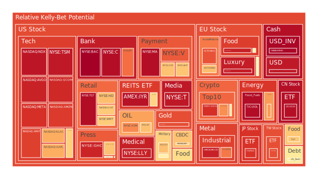

# **投資商品泡沫分析**

在當前2025年6月的市場環境中，我們觀察到一個顯著的二元對立現象。一方面，由人工智能（AI）革命引發的樂觀情緒，正以前所未有的力量推動特定科技股與半導體股的估值達到歷史高位，市場參與者的心理預期顯得極度亢奮。另一方面，宏觀經濟的基本面卻呈現出截然不同的景象：各國央行，特別是美國聯準會，釋放出持續緊縮的訊號，利率維持高檔，商業與消費者信貸違約率攀升，且關鍵的收益率曲線（例如十年期與三個月期國債利差）持續倒掛，這是歷史上預示經濟衰退的可靠指標。此種樂觀預期與悲觀現實之間的巨大鴻溝，形成了當前市場主要的矛盾，其間的博弈與傳導，決定了各類資產的風險與機會。

* 美國國債 (US Treasuries)  
  美國國債市場正處於一個複雜的十字路口。從正向論述（Thesis）來看，聯準會的鷹派立場以及持續高位的通膨預期，為短期國債（如US01Y, US02Y）提供了數十年來罕見的高票息收益，吸引了尋求穩定現金流的保守型資本。這些短期債券的風險指標相對溫和，顯示市場對其當前定價的共識較高。然而，其反向論述（Antithesis）在於長期國債（US10Y, US30Y）的困境。收益率曲線的倒掛，意味著市場預期未來經濟將放緩甚至衰退，從而迫使聯準會降息。這種預期與聯準會當前「更高更久」(higher for longer)的利率指引形成直接衝突。從博弈論角度看，債券投資者正在與央行進行一場關於未來政策路徑的對賭。目前，聯準會資產負債表的縮減與高額的公共債務佔GDP比重，對長期債券的價格構成持續壓力。其正反合的結論（Synthesis）是，債券市場內部出現了顯著分化。短天期國債因其高收益和相對安全性，成為了資金的避風港；而長天期國債則因其對未來利率路徑的高度不確定性，波動性加劇，其價格反映了市場對於經濟「軟著陸」或「硬著陸」的激烈辯論。當前30年期與3個月期利差（US Yield 30Y-03M）雖為正值，但較上週已收窄，顯示長期衰退的憂慮有所抬頭。  
* 美國零售股 (e.g., WMT, TGT, COST, HD)  
  零售股的表現是洞察消費者健康狀況的櫥窗。正向來看，像沃爾瑪（WMT）和好市多（COST）這類必需消費品巨頭，憑藉其規模經濟和供應鏈優勢，在通膨環境下展現出一定的定價能力與防禦性。然而，其反向的觀點是，整體消費市場的疲軟跡象日益明顯。GameStop（GME）的銷售下滑、多家大型企業的裁員潮（如迪士尼、Meta），以及消費者信貸違約率的上升，共同描繪了一幅消費者支出能力和意願都在減弱的畫面。塔吉特（TGT）和家得寶（HD）的風險指標在過去一個月持續處於極高水平，暗示市場對其應對消費降級的能力感到憂慮。從社會學角度看，這反映了財富K型分化下的消費結構轉變，高端消費者或仍有餘力，但中低收入群體的壓力正向大眾零售商傳導。最終的融合觀點是，零售業內部將出現嚴重分化。提供低價必需品的折扣零售商（如WMT）可能在消費降級趨勢中維持其市場份額，而定位於中端或非必需品的零售商（如TGT）將面臨更大的銷售壓力。整個板塊的估值風險偏高，反映了市場對即將到來的消費寒冬的定價。  
* 美國科技股 (e.g., AAPL, MSFT, GOOG, AMZN, META, TSLA)  
  科技巨頭是本輪市場多頭行情的絕對核心。其 thesis 在於AI革命帶來的生產力躍升預期。微軟（MSFT）、谷歌（GOOG）、亞馬遜（AMZN）和Meta（META）等公司，無論是投入數十億美元進行AI投資的新聞，還是其在雲端計算領域的領導地位，都讓投資者相信它們是新時代的贏家。這種強烈的心理預期，使得資金高度集中，推動其估值風險指標在過去一個月持續攀升。然而，其 antithesis 同樣不容忽視。首先，極高的估值本身已包含了未來多年的完美成長預期，任何基本面的風吹草動都可能引發劇烈回調。其次，聯準會的緊縮政策對這些長久期資產的估值構成天然壓制。第三，來自全球（特別是歐洲）的反壟斷監管壓力有增無減。特斯拉（TSLA）除了面臨日益激烈的電動車市場競爭外，其在自動駕駛技術的實現路徑上仍充滿不確定性。蘋果（AAPL）則在尋找繼iPhone之後的下一個革命性產品。這些巨頭的裁員和招聘凍結，也與其股價的樂觀表現形成諷刺對比。其 synthesis 結論是，科技股板塊正上演一場由信念驅動的投機盛宴。市場似乎願意為了一個宏大的AI敘事而暫時忽略傳統的估值指標和宏觀風險。這種情況在歷史上（如2000年的科網泡沫）曾多次出現。短期內，由AI驅動的動能可能持續，但其脆弱性極高，一旦AI商業化變現的進程不及預期，或宏觀衰退的現實壓力全面顯現，該板塊可能面臨劇烈的估值修正。  
* 美國房地產指數 (e.g., VNQ, IYR, RWO)  
  美國房地產市場，特別是商業地產，正處於風暴中心。其反向論述極為明確：遠程辦公的普及從根本上改變了對辦公空間的需求，而高利率環境則極大地提高了房地產開發商和持有者的融資成本。聯準會數據顯示，商業地產的拖欠率（Commercial Real Estate Delinquent）處於高位，這是最直接的警訊。與此同時，住宅地產也因30年期抵押貸款利率（Fixed Morgage 30Y Rate）維持在6.84%的高位而變得令人望而卻步。從社會學角度看，這加劇了住房負擔能力危機。然而，市場總存在正向的聲音。一些觀點認為，特定區域（如數據中心、物流倉儲）的房地產需求依然強勁，且隨著供應鏈回流美國本土，工業地產存在結構性機會。房地產指數（如IYR）的風險指標在過去一個月達到了非常高的水平（月均值超過0.9），這反映了市場對該行業系統性風險的極度擔憂。綜合來看，美國房地產市場正經歷一場深刻的結構性調整。傳統的辦公和零售地產面臨價值重估的巨大壓力，而與新經濟（如AI、電商）相關的特定地產類型則可能展現韌性。整體而言，在利率環境沒有實質性寬鬆之前，該板塊的下行風險遠大於上行潛力。  
* 加密貨幣 (e.g., BTCUSD, ETHUSD, DOGEUSD)  
  加密貨幣市場是投機情緒最極端的體現。其正向論述是，比特幣（BTC）作為一種「數位黃金」，在主權貨幣信用受到質疑的時代，被部分投資者視為對沖通膨和法定貨幣貶值的工具。相關新聞亦提及企業開始使用代幣對沖通膨，強化了此一敘事。以太坊（ETH）則憑藉其智能合約生態系統，被視為下一代互聯網（Web3）的底層基礎設施。然而，反向論述則強調其內在價值的缺失、監管打擊的巨大不確定性以及與高風險科技股極高的正相關性。在聯準會緊縮週期中，流動性的退潮對加密貨幣等投機性資產的打擊最為沉重。狗狗幣（DOGE）這類迷因幣（Meme Coin）的價格波動，則純粹由社群情緒和名人效應驅動，是市場非理性行為的縮影，其單日風險指標的大幅波動正體現了這一點。其 synthesis 觀點是，加密貨幣市場正在從一個完全無序的狂野西部，逐漸向一個受宏觀流動性週期影響的風險資產類別演變。其價格表現成為市場風險偏好（Risk-On/Risk-Off）的放大器。雖然其長期技術願景引人入勝，但短期內，其價格將高度依賴宏觀金融條件，並與納斯達克指數等風險指標同向波動。近期比特幣和以太坊的風險指標從高位回落，可能預示著在經歷了大幅上漲後，市場的亢奮情緒有所降溫。  
* 金/銀/銅 (XAUUSD, XAGUSD, COPPER)  
  貴金屬與工業金屬的走勢揭示了市場對經濟前景的矛盾看法。黃金（XAUUSD）與白銀（XAGUSD）的正向論述在於其傳統的避險屬性。在地緣政治風險加劇（如中東、東歐局勢）、全球央行持續買入黃金儲備以及對主權債務可持續性的擔憂下，黃金是對抗未知的終極保險。其月度風險指標維持在0.5以上的中高水平，顯示資金持續流入。白銀除了貴金屬屬性，還有工業屬性（如太陽能板），使其兼具避險和經濟增長的雙重主題。然而，反向論述是，在高利率環境下，持有黃金、白銀等無息資產的機會成本顯著增加，這對其價格構成壓力。銅（COPPER），作為全球經濟的晴雨表，其正向論述是能源轉型（電動車、電網升級）將帶來長期結構性的需求增長。但其反向論述則更為直接：全球製造業PMI數據普遍疲軟，特別是考慮到世界銀行下調全球經濟增長預測，銅的短期需求前景堪憂。其風險指標從高位回落，反映了對經濟衰退的擔憂。黃金/銅比率（GOLD COPPER RATIO）處於歷史高位，這是一個強烈的訊號，表明市場避險情緒遠遠壓倒了對經濟增長的樂觀預期。綜合來看，金屬市場的內部分歧恰恰反映了宏觀經濟的核心矛盾。黃金和白銀的強勢，是對沖體系性風險的理性選擇，而銅的相對弱勢，則預示著實體經濟的寒冬可能正在到來。  
* 黃豆/小麥/玉米 (SOYB, WEAT, CORN)  
  農產品市場受到氣候、地緣政治和經濟週期的多重影響。其正向論述來自於對供應鏈的擔憂。極端天氣事件的頻發、主要出口國（如俄烏地區）的地緣政治衝突，都可能隨時引發供給衝擊，從而推高價格。從社會學角度看，糧食安全是各國政府的首要任務，這為農產品價格提供了底層支撐。然而，反向論述則指向需求的疲軟。在全球經濟放緩的大背景下，對飼料（主要由黃豆、玉米構成）和工業用途的需求將會減弱。同時，美元的強勢也使得以美元計價的農產品對其他國家的買家而言更加昂貴。三大農產品期貨的風險指標在過去一個月處於中等水平，並未顯示出極端的泡沫化傾向，價格波動更多反映了對短期供需新聞的反應。其 synthesis 觀點是，農產品市場目前處於一種脆弱的平衡中。供應端的風險持續存在，但需求端的疲軟限制了價格的上行空間。其未來的走勢將高度依賴北半球的生長季節天氣狀況，以及全球經濟衰退的深度。  
* 石油/鈾期貨 (USOIL, UX1\!)  
  能源市場是通膨和地緣政治的焦點。石油（USOIL）的正向論述是，儘管經濟面臨逆風，但OPEC+的減產決心、地緣政治衝突（特別是在中東產油區）對供應的威脅，以及戰略石油儲備處於低位，都為油價提供了支撐。然而，反向論述是，全球經濟放緩，特別是製造業的衰退，將直接削弱對石油的需求。此外，能源轉型長期來看會降低對化石燃料的依賴。近期油價風險指標從高位顯著回落，似乎表明市場更傾向於為需求破壞定價。鈾（UX1\!）的邏輯則有所不同。其正向論述極為強大：在全球尋求能源獨立和脫碳的背景下，核能作為一種穩定的清潔基載電力，正迎來復興。從法國到日本，多國都在延長現有核電站壽命或計劃新建，這造成了對鈾的長期結構性需求。其反向論述則在於核安全事故的黑天鵝風險以及核廢料處理的政治難題。綜合來看，石油市場短期內將在經濟衰退導致的需求下滑與OPEC+減產決心之間進行博弈，波動性較高。而鈾市場則處於一個長期的結構性牛市中，其價格主要由供給側的瓶頸和需求側的長期增長所驅動，短期經濟週期的影響相對較小。  
* 各國外匯市場 (e.g., EURUSD, USDJPY, GBPUSD, AUDUSD)  
  外匯市場是各國經濟基本面和貨幣政策的直接反映。美元（以相對強勢體現，如USDJPY處於高位）是當前市場的Thesis。其強勢地位由三個支柱支撐：相對較高的利率（利差優勢）、全球儲備貨幣的地位以及在不確定時期作為避險資產的吸引力。聯準會的鷹派立場進一步鞏固了美元的強勢。歐元/美元（EURUSD）和英鎊/美元（GBPUSD）的風險指標接近極值，顯示市場對這兩種貨幣相對於美元的貶值預期已非常充分。其 Antithesis 則在於其他經濟體的反擊。日圓（USDJPY）的極度弱勢，可能引發日本央行的干預，從而導致美元的突然回調。歐洲央行如果因通膨頑固而被迫採取比預期更鷹派的立場，也可能提振歐元。澳元（AUDUSD）作為商品貨幣，其走勢與全球經濟增長和中國需求密切相關，目前的弱勢反映了對全球衰退的擔憂。從博弈論角度看，各國央行正在進行一場「非合作博弈」，試圖在抑制本國通膨和維持出口競爭力之間找到平衡。其 Synthesis 結論是，美元的王者地位短期內難以撼動，但其估值已處於極端水平，對任何顯示美國經濟超預期走弱或聯準會立場轉鴿的訊號都極為敏感。外匯市場的波動性將加劇，特別是圍繞主要央行的政策會議期間。  
* 各國大盤指數 (e.g., NDX, FTSE, GDAXI, FCHI, JPN225, 0050, 000300\)  
  全球股市呈現出顯著的地域分化。正向論述由美國納斯達克指數（NDX）和台灣加權指數（0050）所引領，這兩者都深度受益於AI半導體產業鏈的繁榮。它們的風險指標持續走高，顯示強勁的動能和資金追捧。日本日經225指數（JPN225）則受益於公司治理改革、弱勢日圓帶來的出口優勢以及資本從中國外流的再配置，其風險指標也處於高位。然而，反向論述則在歐洲和中國市場體現得更為明顯。歐洲的德國DAX指數（GDAXI）和法國CAC40指數（FCHI）面臨能源成本高昂、俄烏戰爭影響以及傳統汽車工業轉型緩慢的困境。中國滬深300指數（000300）則受到房地產危機、消費信心不足和地緣政治緊張關係的持續拖累。儘管其風險指標也處於高位，但這更可能反映了政策托底預期下的資金博弈，而非基本面的強勁復甦。其正反合的結論是，全球資本正在進行一場「優質成長」與「價值陷阱」的豪賭。資金明顯湧向那些擁有清晰技術護城河和成長故事的市場（美國、台灣、日本），而迴避那些結構性問題纏身的市場（歐洲、中國）。這種分化創造了跨區域的相對價值機會，但也加劇了全球市場的脆弱性——一旦領漲的AI板塊出現回調，可能會引發全球性的避險連鎖反應。  
* 美國半導體股 (e.g., NVDA, TSM, AMD, INTC, QCOM, AVGO, KLAC, AMAT)  
  半導體行業是當前市場最為炙手可熱的領域，也是泡沫風險最集中的地方。其 Thesis 極其清晰：AI的發展，從大型語言模型的訓練到終端設備的推理應用，都依賴於更強大、更高效的晶片。輝達（NVDA）、台積電（TSM）、博通（AVGO）等行業領導者，憑藉其技術壟斷或市場主導地位，成為這場革命最直接的受益者。它們的風險指標，特別是TSM和AVGO，在過去一個月內飆升至極高水平，顯示出市場極度的投機熱情。從心理學角度看，這是一種典型的FOMO（害怕錯過）情緒驅動的行情。然而，其 Antithesis 潛藏在繁榮的表象之下。首先，整個行業具有高度的週期性，目前的高資本支出可能在未來導致產能過剩。其次，地緣政治風險是懸在頭上的達摩克利斯之劍，任何圍繞台灣海峽的緊張局勢都可能對台積電等關鍵企業造成毀滅性打擊。第三，美國對中國的晶片出口管制，雖然打擊了競爭對手，但也損失了巨大的市場。英特爾（INTC）和AMD等公司在追趕輝達的過程中，其盈利能力和市場份額仍面臨巨大挑戰。其 Synthesis 是，半導體行業正處於一個由技術範式轉移驅動的超級週期之中，但其估值已經遠遠超前於現實的盈利增長。這是一個典型的「順風時超額上漲，逆風時劇烈下跌」的板塊。投資者在此領域的博弈，不僅是在賭AI的未來，更是在賭地緣政治的穩定和宏觀經濟的走向。 valuation指標的極端化預示著未來極高的波動性。  
* 美國銀行股 (e.g., JPM, BAC, C, COF)  
  美國銀行股的處境充滿矛盾。正向來看，利率的上升擴大了銀行的淨息差（NIM），這是其核心利潤的來源。摩根大通（JPM）等大型全能銀行的盈利能力依然強勁，展現了其在市場動盪中的韌性。然而，反向的觀點更為令人擔憂。首先，收益率曲線倒掛侵蝕了「借短貸長」的傳統盈利模式。其次，商業地產貸款的潛在違約風險，對中小型區域性銀行的資產負債表構成了巨大威脅。第三，聯準會的量化緊縮（QT）正在抽離系統中的流動性，導致銀行存款競爭加劇。美國銀行（BAC）和花旗集團（C）的風險指標在近期攀升至接近飽和的水平，反映市場對其資產質量和未來盈利能力的擔憂已達頂點。其綜合觀點是，大型「大到不能倒」的銀行（如JPM）與中小型銀行之間的生存狀況將出現天壤之別。大型銀行或許能憑藉其多元化的業務（投行、財富管理）度過難關，但眾多依賴傳統存貸業務的銀行將面臨嚴峻考驗。整個銀行板塊的高風險評分，實際上是市場對一場潛在信貸危機的提前預警。  
* 美國軍工股 (e.g., LMT, NOC, RTX, BA)  
  軍工股的表現與地緣政治的溫度計緊密相連。其 Thesis 在於一個日益動盪的世界格局。從歐洲到中東再到印太地區，不斷升級的緊張局勢和衝突，促使各國政府大幅增加國防預算。洛克希德·馬丁（LMT）、諾斯洛普·格魯曼（NOC）和雷神技術（RTX）等公司的訂單預期持續增長。這是一個由宏觀政治趨勢驅動的、相對獨立於經濟週期的行業。然而，其 Antithesis 同樣存在。首先，軍工股的估值已經計入了相當高的地緣政治風險溢價，如果全球局勢意外緩和，它們將面F臨回調壓力。其次，國防採購受到政府預算的嚴格約束，在各國財政赤字高企的背景下，國防支出的增長並非無限。波音（BA）除了軍工業務，其民航業務持續受到生產和安全問題的困擾，拖累了整體表現。其 Synthesis 結論是，軍工行業正處於一個由地緣政治驅動的長期上升通道中。它們是投資組合中對沖地緣政治風險的有效工具。然而，投資者需警惕，其價格已不便宜，且容易受到政治風向變化的影響。

# **宏觀經濟傳導路徑分析**

當前宏觀經濟的核心驅動力是聯準會的貨幣政策與全球地緣政治風險之間的相互作用。其傳導路徑可被設想為一個多層次的漣漪效應：

**起點：聯準會鷹派立場與持續的高利率**

1. **第一層傳導（金融市場）**:  
   * **債券市場**: 短期國債收益率（US02Y, US01Y）維持高位，吸引避險資金。長短期利差（如10Y-3M）維持在負值區間，發出強烈的經濟衰退信號。這壓制了長債（US10Y, US30Y）的表現。  
   * **外匯市場**: 美元因利差優勢而保持強勢（USDJPY高企，EURUSD疲軟），對全球貿易和以美元計價的商品（如石油、黃豆）構成壓力。  
   * **股權市場**: 高利率環境通過貼現率模型，對長久期資產（高成長科技股，如NDX）的估值構成頂部壓力。金融條件收緊，流動性減少，增加了市場的脆弱性。  
2. **第二層傳導（實體經濟）**:  
   * **信貸市場**: 企業和個人的借貸成本上升。高收益債券利率（High Yield Bond Interest Rate）雖然處於相對低位，但商業地產、消費者信貸的拖欠率（Delinquent Rate）均在高位，顯示壓力正在從金融傳導至實體。特別是房地產市場，30年抵押貸款利率高企，嚴重抑制了交易活動。  
   * **企業投資與消費**: 融資成本增加和未來需求的不確定性，導致企業推遲資本開支。消費者則因信貸成本上升和對未來就業的擔憂而縮減開支，這首先會衝擊非必需消費品和零售業（TGT, HD）。  
3. **第三層傳導（全球反饋迴路）**:  
   * **新興市場**: 強勢美元和全球需求放緩，對依賴出口和美元債務的新興市場構成雙重打擊。  
   * **全球貿易**: 世界銀行下調全球增長預測，反映了貿易活動的降溫。這會進一步影響到全球航運和製造業，如歐洲的汽車股（BMW, MBG）和工業巨頭。  
   * **地緣政治的放大效應**: 經濟的疲軟可能加劇國內社會矛盾，並誘發更激進的對外政策，從而使地緣政治風險（軍工股LMT, NOC的邏輯）與經濟下行風險形成惡性循環。

**綜合假設**: 當前的傳導路徑顯示，金融市場的樂觀情緒（特別是AI股）與實體經濟的悲觀數據之間存在巨大的斷裂。一個可能的引爆點是，當信貸市場的壓力（如商業地產大規模違約）或勞動力市場的顯著惡化（失業率大幅上升）成為無法忽視的現實時，衰退預期將從債券市場蔓延至股票市場，屆時高估值的科技股將面臨最猛烈的衝擊，引發全球性的「Risk-Off」事件，資金將大規模湧入短期美國國債和黃金。

# **微觀經濟傳導路徑分析**

微觀層面的傳導路徑，更多地體現為特定行業或公司的事件如何影響其上下游及相關領域。

1. **從科技巨頭的AI競賽出發**:  
   * **上游傳導**: Meta、Google、Microsoft對AI的大規模投資，直接轉化為對半導體（NVDA, TSM）和相關設備（KLAC, AMAT）的需求。這條路徑解釋了為何半導體行業的風險指標如此之高。  
   * **下游傳導**: AI技術的應用預期，提振了軟體服務（如MSFT的Office 365 Copilot）、廣告（META, GOOG的精準投放）乃至影視娛樂（NFLX的個性化推薦）的效率。  
   * **橫向傳導**: AI競賽引發了激烈的人才爭奪，推高了頂尖工程師的薪酬，但同時，這些公司為了將資源集中在AI上，正在裁減非核心部門的員工（如Google的買斷計畫），這對整體就業市場產生了結構性影響。  
2. **從消費者信心的變化出發**:  
   * **起點**: 消費者信貸違約率上升和裁員新聞（如UPS, Morgan Stanley）。  
   * **第一站：非必需消費品**: 消費者首先削減的是非必需開支，這會衝擊到影視娛樂（DIS, PARA）、高端餐飲和旅遊。迪士尼（DIS）的風險指標高企，部分反映了此類擔憂。  
   * **第二站：大眾零售**: 隨後，壓力傳導至一般零售商（TGT, HD），消費者轉向更具性價比的選擇。  
   * **第三站：支付行業**: 整體交易額的下降或增速放緩，最終會影響到電子支付公司（V, MA, AXP, PYPL）的營收。儘管V和MA的風險指標仍然很高，顯示其市場地位穩固，但PayPal（PYPL）相對較低的風險指標可能暗示市場對其增長前景的疑慮。  
   * **終點：銀行資產負債表**: 信用卡拖欠率（Credit Card Delinquent）的最終上升，會直接形成銀行的壞帳，衝擊其盈利（BAC, C）。

**綜合假設**: 微觀傳導路徑揭示了市場內部的「K型分化」。AI產業鏈處於一個自我強化的正向循環中，而廣泛的消費者相關行業則面臨著需求萎縮的負向傳導壓力。這兩條路徑的背離是當前市場不穩定性的主要來源。

# **資產類別間傳導路徑分析**

資產類別之間的相互作用，構成了複雜的市場生態系統。

1. **風險偏好（Risk-On/Off）傳導路徑**:  
   * **路徑**: 納斯達克指數（NDX）\<-\> 加密貨幣（BTCUSD）\<-\> 黃金（XAUUSD）/美元（USDJPY）  
   * **機制**: 在風險偏好高漲（Risk-On）時，資金傾向於從避險資產流向風險資產。我們會觀察到NDX和BTC同步上漲，而黃金和美元相對承壓。反之，當負面新聞（如地緣政治衝突、超預期的差勁經濟數據）觸發避險情緒（Risk-Off）時，資金會迅速從NDX和BTC撤離，湧入黃金和美元，導致它們的價格同步上漲。這解釋了為何科技股與加密貨幣高度相關，而它們又與黃金、美元在短期內呈現負相關。  
2. **通膨預期傳導路徑**:  
   * **路徑**: 石油（USOIL）/銅（COPPER） \-\> 美國國債收益率（US10Y）-\> 科技股（NDX）/黃金（XAUUSD）  
   * **機制**: 當石油和銅價上漲時，市場通膨預期升溫。這會迫使交易員預期聯準會將採取更鷹派的政策，從而推高國債收益率。更高的收益率會壓制科技股的估值（貼現率效應），但同時可能會提升黃金的吸引力，因為黃金被視為對抗通膨的工具（儘管高利率會增加持有黃金的機會成本，此處存在矛盾，結果取決於哪種力量更強）。當前的黃金/石油比率（GOLD OIL RATIO）從高位回落，可能暗示市場對通膨的擔憂有所緩解，或對經濟衰退的擔憂超過了通膨。  
3. **利率預期與行業輪動路徑**:  
   * **路徑**: 國債收益率（US10Y）-\> 銀行股（JPM）vs. 公用事業/房地產（IYR）  
   * **機制**: 當市場預期利率將持續走高時，資金傾向於流入能從中受益的銀行股（淨息差擴大），而流出對利率敏感的行業，如需要大量融資的房地產和派發高股息的公用事業股。反之，當市場預期利率將見頂回落時，則會出現相反的輪動。

**綜合假設與篩選**: 將上述路徑疊加分析，我們可以看到一個核心矛盾：AI驅動的「Risk-On」情緒，與通膨和利率驅動的「Risk-Off」壓力並存。一個關鍵的篩選假設是，哪種敘事將佔據主導？從聯準會數據和官員講話來看，宏觀緊縮的壓力是真實且持續的。因此，AI行情的脆弱性極高。一個可能的漣漪效應是：**通膨數據超預期 \-\> 油價上漲 \-\> 10年期國債收益率突破關鍵水平 \-\> 科技股（特別是半導體）估值崩潰 \-\> 市場恐慌性拋售（Risk-Off） \-\> 資金湧入美元、黃金、短期國債 \-\> 加密貨幣市場跟隨科技股暴跌 \-\> 全球股市（特別是與美國聯動性高的市場如0050, JPN225）受到拖累。** 這是一條合乎邏輯且高概率的風險傳導路徑。

# **投資建議**

基於上述分析，當前的市場環境是機會與風險並存的極端狀態。一方面是不可忽視的科技革命動能，另一方面是顯而易見的宏觀經濟逆風和高估值泡沫。因此，投資組合的構建應極度重視平衡與對沖。

以下是針對三種不同風險偏好的優化資產配置建議：

**1\. 穩健型投資組合 (Conservative Portfolio)**

* **目標**: 資本保值，賺取穩定票息，對沖極端風險。  
* **配置比例**:  
  * **50% 短期美國國債**: 選擇1-2年期的美國國債（如 **US01Y**, **US02Y**）。它們提供了數十年來最高水平的無風險收益率，且其風險指標（泡沫分數）處於全市場最低的區間，是當前環境下現金的最佳替代品和資產組合的壓艙石。  
  * **30% 黃金 (XAUUSD)**: 黃金是對沖地緣政治風險、主權債務危機以及潛在的貨幣信用危機的終極工具。在當前全球多處動盪、各國央行增持的背景下，黃金的戰略價值凸顯。其與股權資產的負相關性可以在市場動盪時提供保護。  
  * **20% 防禦性股票 \- 必需消費品龍頭 (e.g., KO)**: 選擇像可口可樂（KO）這樣業務遍及全球、需求穩定、現金流強勁的必需消費品公司。這類公司的產品需求不受經濟週期影響，能提供穩定的股息。其風險指標相對溫和，可在股市中提供防禦性。

**2\. 成長型投資組合 (Growth Portfolio)**

* **目標**: 參與科技成長主線，同時管理下行風險。  
* **配置比例**:  
  * **40% 核心科技與半導體股 (e.g., MSFT, TSM)**: 承認AI是長期趨勢，但避免過度投機。選擇行業內具有最寬護城河、最清晰盈利模式的公司，如擁有平台生態的微軟（MSFT）和晶片製造領域無可替代的台積電（TSM）。它們是AI趨勢的核心載體。  
  * **40% 能源與資源股 (e.g., XOM, COPPER)**: 配置石油巨頭埃克森美孚（XOM）和銅（COPPER）相關資產。這部分配置旨在對沖通膨風險。如果經濟並未如預期般深度衰退，而是陷入「停滯性通膨」（Stagflation），能源和工業金屬將表現優異。它們與科技股的相關性較低，能有效分散風險。  
  * **20% 日本股市 (JPN225)**: 投資於日本大盤指數。日本股市正受益於多重利好：擺脫通縮、公司治理改革、日圓貶值利好出口以及作為亞洲地區替代中國的投資目的地。這是一個具有獨立宏觀邏輯的市場，可以分散對美國市場的過度依賴。

**3\. 高風險投資組合 (Aggressive Portfolio)**

* **目標**: 最大化短期收益，承擔高波動風險。  
* **配置比例**:  
  * **50% 高動能半導體股 (e.g., NVDA, AVGO)**: 集中火力在當前市場動能最強、AI敘事最純粹的股票上，如輝達（NVDA）和博通（AVGO）。這個選擇是在賭AI泡沫會持續，旨在捕捉趨勢的主升浪。它們的風險指標極高，意味著潛在回報和風險都是巨大的。  
  * **30% 加密貨幣 (BTCUSD)**: 將比特幣作為「數位動能」資產納入組合。其與納斯達克指數，特別是高風險科技股的高相關性，使其成為一個放大版的動能賭注。在市場情緒高漲時，其上漲潛力巨大。  
  * **20% 軍工股 (e.g., NOC)**: 配置諾斯洛普·格魯曼（NOC）等軍工企業。這一配置看似矛盾，實則是一種對「黑天鵝」事件的投機性對沖。如果市場因突發的地緣政治惡性事件（而非經濟衰退）而崩潰，軍工股可能是極少數能夠逆勢上漲的板塊，為極度激進的組合提供一絲另類保護。

# **風險提示**

投資有風險，市場總是充滿不確定性。本報告完全基於所提供的歷史數據和新聞進行分析推演，不構成任何財務建議。所有提及的風險指標（泡沫分數）僅為量化分析的參考，不保證未來的市場表現。市場情緒的變化可能極其迅速，過去的表現無法預示未來的回報。投資者應根據自身的風險承受能力、財務狀況和投資目標，在進行獨立、審慎的思考後，做出自己的投資決策，並為其決策的後果負全部責任。

 
Daily Buy Map:

 
Daily Sell Map:

 
Daily Radar Chart:

 
