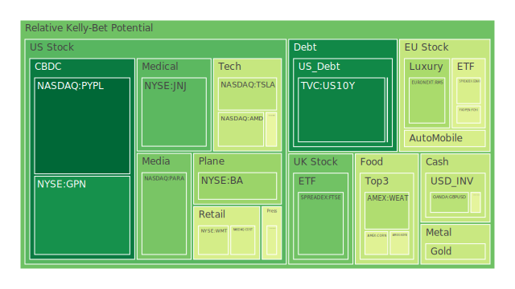
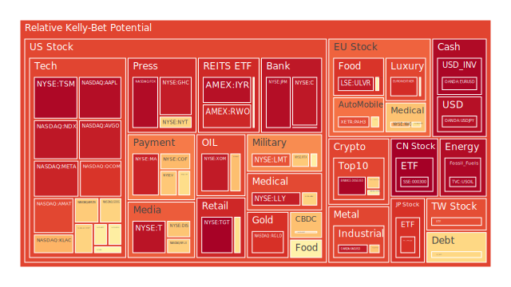
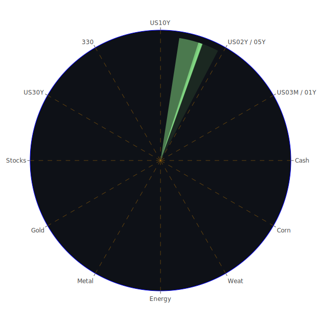

# **投資商品泡沫分析**

在當前錯綜複雜的全球金融環境中，對各類資產的泡沫風險進行審慎評估，是構建穩健投資策略的基石。時間來到2025年六月中旬，市場情緒在技術革新的狂熱、持續的宏觀經濟壓力以及潛在地緣政治衝突之間反覆拉扯。本報告將深入剖析各大類資產的現狀，並藉由歷史的迴響、社會心理的博弈以及經濟理論的透鏡，提供一個全方位的觀察視角。

* **美國國債**

美國國債市場，作為全球金融體系的定價之錨，正處於一個微妙的平衡點。從數據上看，各期限國債的風險指數普遍偏低至中等。例如，十年期國債(US10Y)的泡沫分數相對較低，這反映了其作為避險資產的傳統角色，在不確定性彌漫時仍受到市場青睞。

然而，我們必須從一個三位一體的視角來解讀。正題（Thesis）是，鑑於商業地產與消費性信貸的違約率處於高位，以及聯準會傳遞出的鷹派立場，市場對經濟硬著陸的擔憂，為國債提供了內在支撐。反題（Antithesis）則是，美國公共債務佔GDP比重已達歷史高點，外國持有者的龐大存量以及聯準會縮減資產負債表的行動，對國債價格構成了長期壓力。短期與長期殖利率曲線（例如10年期與3個月期）的利差極度平坦，僅剩微不足道的0.04個百分點，這在歷史上是經濟衰退的強烈預警訊號。回顧上世紀70年代末，保羅·沃克（Paul Volcker）為對抗通膨而採取的激進加息，同樣造成了殖利率曲線的倒掛，並最終引發了經濟衰退。

合題（Synthesis）在於，國債市場正上演一場複雜的博弈。一方面，它是應對短期衰退風險的避風港；另一方面，它又是長期財政可持續性風險的暴露點。投資者在其中，如同在狹窄的水道中航行，既要防備經濟衰退的暗流，又要警惕長期通膨與債務問題的礁石。當前的狀況是，儘管短期避險需求存在，但只要通膨預期未能完全受控，或地緣政治引發的供應鏈問題重燃（如中東緊張局勢），聯準會的鷹派立場就難以真正轉向，這將限制國債價格的上行空間。

* **美國零售股**

美國零售股呈現出明顯的內部分化。以沃爾瑪（WMT）與塔吉特（TGT）為代表的零售巨頭，其泡沫指數在近期持續處於高位，尤其是塔吉特的月均風險分數已達0.94，顯示市場對其估值抱持高度警惕。反觀家得寶（HD）與好市多（COST），其風險指數雖也不低，但相對穩定。

從社會學角度看，這反映了消費降級與K型復甦的雙重現象。在消費者信貸違約率攀升的背景下，家庭預算受到擠壓，消費行為趨向保守，更加注重性價比，這解釋了為何像沃爾瑪這樣的折扣零售商仍能維持強勁的銷售。然而，其高企的泡沫指數也暗示，市場可能已過度計價了其防禦性特質。新聞中提及的「特朗普關稅不確定性導致機票價格下跌」和「食品援助削減」，都指向了中低收入群體可支配收入的潛在壓力，這對零售業的未來是一個負面訊號。

歷史上，2008年金融海嘯前夕，零售股也曾表現出類似的韌性，因為投資者相信消費必需品的需求是穩定的。然而，當失業率急劇攀升，系統性危機全面爆發時，沒有任何一個行業可以獨善其身。目前，聯準會的數據顯示信用卡違約率尚處於低位，但這與高企的消費信貸總體違約率形成了矛盾，或許暗示著壓力正從其他貸款類型（如汽車、個人信貸）向信用卡傳導。這種滯後效應值得高度關注。零售股的高風險，是經濟基本面脆弱性與市場防禦性預期之間矛盾的集中體現。

* **美國科技股**

科技股無疑是當前市場的焦點，但也可能是風險的震央。以微軟（MSFT）、蘋果（AAPL）、Meta（META）、亞馬遜（AMZN）以及輝達（NVDA）為首的科技巨頭，其泡沫指數普遍處於中高至極高水平。特別是Meta，其月均風險分數接近0.90，而蘋果的短期風險指數在數據更新的數日內從0.71飆升至0.96，顯示出極大的不穩定性。

這是一場由人工智慧（AI）敘事主導的盛宴。正題是，AI技術正帶來一場堪比工業革命的生產力變革。新聞中「甲骨文因雲端服務需求強勁而上調年度預測」以及「蘋果藉助ChatGPT提升其服務」等消息，不斷強化這一樂觀預期。從經濟學角度，這是典型的技術創新驅動的超級週期，贏家通吃的網路效應使得領先企業能夠攫取絕大部分價值。

反題則是，我們是否正在重演2000年的網路泡沫？當時，任何與「.com」相關的公司都能獲得天價估值，但最終只有極少數存活下來。如今，「AI」正扮演著當年「.com」的角色。從心理學層面分析，這是一種典型的「錯失恐懼症」（FOMO），機構與散戶投資者擔心錯過下一個時代的浪潮，從而忽視了傳統的估值指標。新聞中「谷歌的收購可能指向更多科技業裁員」揭示了行業內部的殘酷現實：即便是引領AI發展的巨頭，也在進行成本優化，這與市場的無限增長預期形成了鮮明對比。

合題是，AI的長期潛力是真實的，但短期估值已嚴重脫離基本面。目前市場的博弈本質是流動性與敘事的狂歡。投資者押注的並非企業當下的盈利，而是遙遠未來的貼現現金流。這種預期的脆弱性極高，任何關於監管加強、技術瓶頸、或宏觀流動性收緊的風吹草動，都可能引發劇烈的連鎖反應。科技股內部的分化也值得注意，例如PayPal（PYPL）的風險指數極低，顯示市場對非AI相關的傳統金融科技領域持懷疑態度，資金高度集中的趨勢加劇了系統性風險。

* **美國房地地產指數**

以Vanguard房地產ETF（VNQ）和iShares美國房地產ETF（IYR）為代表的房地產指數，其泡沫指數呈現出中高且持續攀升的態勢，IYR的月均風險分數高達0.90以上。這與聯準會數據中「商業地產違約率處於高位」的事實形成了詭異的背離。

正題是，市場可能在押注聯準會最終將因經濟衰退而被迫降息，從而利好對利率敏感的房地產行業。此外，在通膨環境下，實體資產（如房地產）被視為保值工具。

反題是，基本面正在惡化。30年期固定抵押貸款利率維持在6.84%的高位，遠高於一年前的水平，極大地壓抑了購房需求。商業地產方面，遠程辦公的結構性轉變對辦公樓市場造成了長期性的衝擊，空置率上升與租金下降的趨勢難以逆轉。新聞中並未直接提及房地產，但科技業的裁員潮間接意味著對辦公空間需求的進一步萎縮。

合題是，房地產指數的高風險評分可能反映了一種投機性預期，而非基本面的改善。投資者似乎在忽略當前的違約風險，直接交易未來的降息週期。這種脫離現實的定價行為極度危險。歷史上，2006年的美國房地產市場在崩盤前也曾出現過價格與風險指標的背離。當時，市場普遍相信「房價永遠上漲」的神話，直到次貸危機的爆發才將其徹底戳破。當前，商業地產的高違約率是系統中的一個已知裂痕，若處理不當，極有可能傳導至更廣泛的金融體系。

* **加密貨幣**

比特幣（BTCUSD）與以太坊（ETHUSD）的風險指數呈現出中等水平，但波動劇烈。狗狗幣（DOGEUSD）這樣更具投機性的加密貨幣，其風險指數則出現了從極高位回落的跡象，但仍處於不穩定狀態。

從概念上講，加密貨幣是法定貨幣體系的一個「反題」。它的支持者認為，在全球央行普遍採取量化寬鬆、政府債務高企的背景下，比特幣等具有固定供應上限的資產是最終的價值儲存手段，能夠對抗法幣貶值。這一觀點在尋求替代性資產的投資者中產生了共鳴。

然而，其對立面也同樣強大。加密貨幣市場缺乏內在價值支撐，其價格主要由市場情緒、流動性和敘事驅動，使其極易受到操縱且波動性極高。監管的不確定性是懸在其頭上的達摩克利斯之劍，任何主要經濟體對其採取嚴厲打擊，都可能引發市場的崩潰。從博弈論角度看，這是一個「膽小鬼遊戲」，早期參與者寄望於後來的參與者以更高的價格接盤。新聞中「關注比特幣價格水平，因其接近歷史高點」的標題，本身就暗示了這是一個由動能和心理關口驅動的市場。

綜合來看，加密貨幣在當前宏觀背景下扮演著一個複雜角色。它既是部分投資者對沖傳統金融風險的工具，其本身又是一個巨大的、不受約束的風險源。其與納斯達克指數的相關性時而增強時而減弱，表明其在「風險資產」和「避險資產」之間的身份搖擺不定。在一個潛在的去槓桿化週期中，其作為高Beta資產的屬性可能會被放大，導致劇烈的價格下跌。

* **金/銀/銅**

貴金屬與工業金屬的表現出現了分化。黃金（XAUUSD）與白銀（XAGUSD）的風險指數在近期有所回落，但月均值依然處於中高至極高水平，特別是白銀，其月均風險分數超過0.93。銅（FX:COPPER）的風險指數則從高位回落，處於中等水平。

黃金與銅的比率（GOLD COPPER RATIO）處於722的歷史高位，這是一個經典的經濟衰退或避險情緒高漲的指標。它意味著市場對金融穩定性的擔憂（推高黃金）遠大於對全球工業增長的預期（壓抑銅價）。這一點與十年期國債殖利率持平、商業地產違約率高企的宏觀背景相互印證。黃金的強勢，是地緣政治風險的直接體現，如新聞中提及的「美國從中東撤離部分使館人員」以及「伊朗威脅打擊美國基地」，都為黃金的避險敘事提供了燃料。同時，「巴里克礦業將馬里金礦從2025年產量預測中移除」這類供應鏈中斷的消息，也為金價提供了支撐。

白銀兼具貴金屬和工業金屬的雙重屬性。其極高的泡沫指數可能反映了市場對其在綠色能源轉型（如太陽能電池板）中工業需求前景的樂觀預期，疊加了黃金上漲帶來的投機性買盤。然而，這種雙重屬性也使其風險倍增，一旦全球經濟放緩的預期被確認，其工業需求面將受到打擊，可能導致比黃金更為劇烈的回調。

銅價的回落則直接反映了對全球製造業，特別是中國經濟復甦動能的擔憂。關稅的不確定性、歐洲經濟的疲軟，都對工業金屬的需求構成了壓力。總體而言，金屬市場正在講述一個關於「金融風險」與「實體經濟風險」賽跑的故事。

* **黃豆 / 小麥 / 玉米**

農產品期貨，如黃豆（SOYB）、小麥（WEAT）、玉米（CORN），其風險指數普遍處於中等水平，且近期有從高位回落的趨勢。

從供需基本面看，農產品市場受到天氣、地緣政治和能源價格的多重影響。當前的中等風險水平可能反映了市場在權衡良好的生長預期與潛在的供應鏈風險。新聞中「美國移民突襲搜查奧馬哈肉類加工廠，引發食品生產擔憂」，以及「泰國執政黨應對邊境危機」，都屬於可能擾亂食品供應鏈的區域性事件。

從歷史上看，糧食價格的飆升往往與能源危機和地緣政治衝突相伴相生，例如上世紀70年代的石油危機就曾引發全球性的糧食通膨。當前，油價雖未極端飆升，但地緣政治的火藥味漸濃，為糧食價格的未來走勢增添了不確定性。此外，將糧食作為生物燃料的原料，也使其價格與能源市場的聯動性增強。農產品市場的相對平靜可能只是暴風雨前的寧靜，任何供應端的衝擊都可能迅速改變這一格局。

* **石油/ 鈾期貨UX\!**

能源市場的風險指數在近期急劇攀升。美國原油（USOIL）的泡沫指數在數日內從0.71躍升至0.98，顯示出極高的短期風險。鈾期貨（UX\!）的風險指數也從中等水平顯著上升。

這一變化與新聞中的地緣政治動態高度相關。「由於中東擔憂和貿易樂觀情緒，油價躍升至兩個月高點」以及「報導稱美國駐伊拉克大使館準備撤離，油價跳漲4%」等消息，是油價波動的直接催化劑。石油市場的博弈，是在全球經濟放緩可能抑制需求（反題）與中東衝突可能切斷供應（正題）之間的較量。目前看來，供應中斷的風險溢價正迅速壓倒需求疲軟的擔憂。

鈾期貨的走強，則反映了在全球能源轉型和尋求能源獨立的背景下，核能作為穩定基載電力的價值被重新評估。在天然氣和石油價格易受地緣政治影響的當下，核能的長期供應穩定性成為其核心吸引力。然而，鈾市場本身規模較小，流動性較差，使其價格更容易受到資金流動的影響，從而積聚泡沫。

* **各國外匯市場**

外匯市場的數據揭示了美元的強勢地位以及其他貨幣的脆弱性。歐元兌美元（EURUSD）和美元兌日圓（USDJPY）的泡沫指數均處於極高水平，尤其是歐元兌美元，其月均風險分數高達0.93以上。這表明市場對這兩種匯率的現有水平存在巨大爭議和潛在的逆轉風險。

美元的強勢，源於聯準會的鷹派立場、相對強韌的美國經濟數據，以及其作為全球首要避險貨幣的地位。在地緣政治緊張時，全球資本會湧入美元資產，推高美元匯率。這給日本和歐洲帶來了困境。日本央行若要干預以支撐日圓，將消耗其外匯儲備；歐洲央行則面臨在經濟疲軟的情況下，跟進聯準會加息以穩定匯率的兩難選擇。

歷史上，廣場協議（Plaza Accord）展示了主要經濟體協同干預匯市以扭轉美元過度強勢的先例。雖然目前尚未看到類似的政策協調意願，但美元的持續升值正在加劇全球金融狀況的收緊，對新興市場構成沉重壓力，並可能最終反噬美國自身的出口競爭力。極高的泡沫指數暗示，當前的匯率水平可能是不可持續的，任何關於聯準會政策轉向的信號，都可能引發劇烈的匯率重估。

* **各國大盤指數**

全球主要股指普遍呈現高風險狀態。美國的納斯達克指數（NDX）月均風險分數為0.77，但短期指數快速攀升至0.94。日本的日經225指數（JPN225）、中國的滬深300指數（000300）、德國的DAX指數（GDAXI）和法國的CAC40指數（FCHI）等，其風險指數也都處於中高或極高水平。

這反映了一種全球性的現象：市場上漲的廣度不足，而是由少數幾個行業或龍頭公司（如美國的AI科技股）所驅動。這種高度集中的上漲是非常脆弱的。正題是，全球化和技術進步使得優質企業能夠跨越國界，實現增長。反題是，各國經濟週期的不同步、貿易摩擦（如美墨鋼鐵關稅談判）以及區域性危機（如泰國政局不穩），使得全球市場面臨四分五裂的風險。

合題是，全球指數的高風險，是流動性驅動的估值擴張與日益惡化的宏觀基本面之間的脫節。投資者似乎陷入了一種博弈，即相信各國央行在危機時刻終將出手救市，從而忽視了眼前的風險。這種「央行看跌期權」的思維，在過去十幾年的低利率環境中屢試不爽，但在當前高通膨、高利率的「新範式」下，其有效性面臨嚴峻考驗。

* **美國半導體股**

半導體行業是科技股行情的「心臟」。輝達（NVDA）、超微（AMD）、博通（AVGO）、高通（QCOM）、台積電（TSM）等公司的風險指數普遍較高。其中，台積電和高通的月均風險分數均接近或超過0.90。

這不僅僅是AI的故事，也是地緣政治的故事。半導體是中美科技戰的核心領域，對供應鏈的控制權成為國家安全問題。正題是，AI、物聯網、5G等技術趨勢將在未來十年創造對先進晶片近乎無限的需求。反題是，供應鏈的脆弱性和地緣政治風險極高。任何圍繞台灣海峽的緊張局勢升級，都可能對全球半導體供應造成毀滅性打擊。

從博弈論角度看，各國政府都在通過補貼和產業政策，試圖實現半導體供應鏈的本土化或多元化，這在中長期內可能導致產能過剩和價格戰。當前的高估值，反映了市場對行業龍頭在技術和市場份額上壟斷地位的預期。然而，歷史告訴我們，半導體行業具有強烈的週期性。1995年和2000年的半導體週期頂峰，都伴隨著需求的突然逆轉和庫存的急劇增加，導致了行業長時間的蕭條。目前，市場似乎完全忽略了這種週期性風險。

* **美國銀行股**

美國主要銀行股，如美國銀行（BAC）、摩根大通（JPM）、花旗集團（C），其泡沫指數驚人地高，普遍處於0.95以上。這是一個極其危險的信號。

正題是，在利率上升的環境中，銀行的淨息差（NIM）會擴大，從而提高盈利能力。此外，大型銀行因其「大到不能倒」的地位，被認為具有隱性的政府擔保。

反題則是，銀行業正直接暴露在多重風險之下。首先是利率風險，聯準會持續加息導致其資產負負債表上持有的長期債券出現大量未實現損失。其次是信用風險，商業地產和消費貸款的違約率正在攀升，這將直接侵蝕銀行的利潤和資本。第三是流動性風險，存款的競爭加劇，資金成本上升。聯準會的數據顯示，儘管銀行總存款處於高位，但貨幣市場基金的總資產也在歷史高點，顯示資金正在從低息的銀行存款流向高息的貨幣市場基金。

合題是，銀行股的高泡沫指數，可能反映了市場對其短期盈利能力的樂觀預期，而嚴重低估了其資產負債表上潛藏的巨大風險。這與2007年的情況有驚人的相似之處，當時市場也對銀行的盈利能力充滿信心，卻忽視了其在次級抵押貸款上的巨大風險敞口。當前商業地產的困境，很可能就是下一個「次貸」。

* **美國軍工股**

洛克希德·馬丁（LMT）、諾斯羅普·格魯曼（NOC）、雷神技術（RTX）等軍工股的風險指數處於中高至高位，且有上升趨勢。

在全球地緣政治日益緊張的背景下，軍工股的邏輯非常清晰。正題是，從烏克蘭戰爭到中東衝突，再到印太地區的潛在對峙，各國的國防開支都在顯著增加。這為軍工企業提供了長期的、確定性極高的訂單流。新聞中關於中東局勢的報導，都成為推升其股價的催化劑。

反題是，軍工股的估值已經不菲，其股價在很大程度上已經反映了全球衝突加劇的預期。此外，國防採購往往受到政府預算和政治風向的影響，存在政策變動的風險。

合題是，軍工股在當前環境下是一種有效的「混亂對沖」（Chaos Hedge）。它們的表現與全球和平與穩定的前景呈現負相關。從投資組合的角度看，它們可以對沖掉其他資產因地緣政治風險而遭受的損失。然而，投資者也需要警惕，一旦全球緊張局勢出現任何實質性的緩和跡象，這些股票可能會面臨巨大的回調壓力。

* **美國電子支付股**

Visa（V）、萬事達卡（MA）、PayPal（PYPL）和Global Payments（GPN）等電子支付公司，呈現出有趣的分化。Visa和萬事達卡的泡沫指數相當高，而PayPal和GPN的指數則非常低。

正題是，全球從現金向數字支付的結構性轉變仍在繼續。Visa和萬事達卡憑藉其雙寡頭壟斷的卡網絡，成為這一趨勢的穩定受益者。在通膨環境下，它們按交易金額百分比收費的模式使其收入能夠自然增長。

反題則是，金融科技領域的「破壞性創新」對現有格局構成了威脅，儘管目前看來挑戰者仍難以撼動兩大巨頭的地位。更重要的是，作為消費的直接代理，它們的業績與宏觀經濟的健康狀況息息相關。消費者信貸的壓力最終會傳導至支付交易量和壞帳風險。PayPal的低迷，則反映了其在日益擁擠的線上支付領域面臨著來自蘋果支付、BNPL（先買後付）等新模式的激烈競爭，其增長故事受到了市場的質疑。

合題是，市場正在為「穩定壟斷」支付高昂的溢價（Visa/MA），而懲罰那些在競爭中前景不明的公司（PYPL/GPN）。這種分化本身揭示了市場在不確定環境中尋求確定性的心理。然而，即便對於Visa和萬- **美國藥商股**

大型製藥股呈現出鮮明對比。禮來（LLY）的泡沫指數持續處於0.93以上的極高水平，而嬌生（JNJ）和默克（MRK）的風險指數則處於低至中等水平。諾和諾德（NVO）和艾伯維（ABBV）則位居中高風險區域。

這種巨大的差異，主要源於單一藥品的爆炸性成功敘事。禮來和諾和諾德憑藉其在GLP-1類減肥和降糖藥物領域的壟斷性地位，引發了市場的狂熱追捧。正題是，全球肥胖人口的龐大規模為這類藥物提供了一個潛在的、數千億美元級別的市場，其增長潛力在未來數年似乎難以估量。

反題是，市場可能已經將未來十年的所有利好消息都提前計價。這種單一產品依賴的風險極高。任何關於藥品副作用、專利挑戰、價格壓力（如政府醫保談判）或競爭對手推出更優效藥物的消息，都可能導致估值的急劇崩潰。歷史上，許多製藥公司都曾因其「重磅炸彈」藥物專利到期而陷入「專利懸崖」，股價一蹶不振。

合題是，市場正在將禮來和諾和諾德視為科技股而非傳統的防禦性製藥股來定價。它們的股價走勢與納斯達克指數的動能股高度相關。與之相對，像嬌生這樣業務多元化、產品組合穩健的公司，雖然增長想象力不足，但在避險情緒升溫時，其低風險特徵和穩定的股息可能更受青睞。這種內部分化為投資者提供了清晰的風險選擇。

* **美國影視股**

影視娛樂行業的迪士尼（DIS）和派拉蒙（PARA）的泡沫指數處於中等水平，但呈現出不穩定的狀態。

正題是，這些公司擁有龐大的內容IP庫，這是它們在流媒體戰爭中的核心資產。隨著行業整合和對盈利能力的重新重視，市場期待它們能夠削減成本，實現流媒體業務的穩定盈利。

反題是，流媒體市場的競爭異常激烈，內容製作成本高昂，而用戶增長已趨於飽和。從社會學角度看，消費者的娛樂時間和預算是有限的，在眾多平台間的選擇導致了較低的用戶忠誠度和較高的流失率。新聞中「好萊塢與AI的版權之爭」揭示了一個新的威脅：AI技術可能顛覆傳統的內容創作模式，同時也引發了關於版權和創作者權益的複雜法律問題。

合題是，傳統媒體巨頭正處於痛苦的轉型期，其商業模式面臨結構性挑戰。它們的股價反映了這種轉型的巨大不確定性。投資者既要評估其傳統業務（如主題公園、有線電視網絡）的現金流產生能力，也要判斷其在新媒體領域的長期競爭力。派拉蒙等規模較小的公司，更是在行業整合的大潮中面臨被收購或邊緣化的壓力。

* **美國媒體股**

媒體股如康卡斯特（CMCSA）、福斯（FOX）和紐約時報（NYT），其風險指數分佈在中高區間，且波動較大。

正題是，在信息爆炸的時代，提供可靠新聞和優質內容的品牌具有獨特的價值。紐約時報向訂閱模式的成功轉型，證明了用戶願意為高質量的內容付費。福斯則在特定的受眾群體中擁有強大的影響力。

反題是，整個行業面臨著來自社群媒體和AI生成內容的巨大衝擊。廣告收入模式受到科技平台（如Google、Meta）的擠壓，而讀者的注意力也日益碎片化。AI技術不僅可能用於製造假新聞，擾亂信息生態，也可能在內容聚合與生成方面取代部分傳統媒體的功能。

合題是，媒體行業的未來取決於其能否在新的技術和傳播範式下，成功地建立並鞏固其品牌信任度和獨特的社群聯繫。這是一場關於公信力、商業模式創新和適應能力的賽跑。其股價的波動，反映了市場對這場賽跑結果的持續性懷疑。

* **石油防禦股**

以埃克森美孚（XOM）和西方石油（OXY）為代表的石油巨頭，其泡沫指數在近期顯著上升，達到中高乃至高風險水平。

這似乎與它們「防禦股」的傳統標籤相悖。正題是，在通膨和地緣政治風險高企的環境下，這些擁有上游開採業務的公司能從高油價中直接獲益，成為對沖宏觀風險的工具。它們強勁的現金流和派息能力，在市場動盪時對投資者具有吸引力。

反題是，全球對氣候變遷的擔憂和向綠色能源轉型的長期趨勢，對傳統化石燃料行業構成了生存威脅。儘管轉型過程是漫長的，但政策風險、ESG（環境、社會、治理）投資理念的壓力以及未來需求的不確定性，始終是懸在其估值之上的陰影。

合題是，石油股正在短期利好（高油價、高現金流）和長期挑戰（能源轉型）之間進行權衡。當前較高的風險指數表明，市場可能過於集中在短期利好上，而油價本身受到地緣政治消息的高度影響，波動性極大。投資這類股票，本質上是在做一個關於能源轉型速度和短期地緣政治衝突的雙重判斷。

* **金礦防禦股**

金礦公司如Royal Gold（RGLD），其泡沫指數極高，月均值超過0.90，顯示出與黃金本身相似但更為放大的風險。

正題是，金礦股是黃金價格的槓桿化投資。當金價上漲時，由於其開採成本相對固定，其利潤的增長速度會遠超金價本身的漲幅。在黃金的避險敘事走強時，金礦股自然成為投資者追逐的對象。

反題是，這種槓桿效應是雙向的。當金價下跌時，金礦股的跌幅也會更為慘重。此外，它們還面臨著運營風險（如礦場罷工、地質問題）、政治風險（如資源國的稅收政策變動，新聞中巴里克礦業在馬里的遭遇就是例證）和環境監管風險。

合題是，金礦股的高風險指數，反映了其高Beta（高波動性）的特性。它是在一個看漲黃金的判斷上，添加了額外一層運營和政治風險的投機工具。對於尋求避險的投資者而言，直接持有黃金可能更為穩妥；而對於能夠承受更高風險並尋求更高回報的投資者，金\_礦股則提供了這種可能性。

* **歐洲奢侈品股**

以LVMH集團（MC）和愛馬仕（RMS）為代表的奢侈品股，其風險指數處於中高水平，顯示市場對其高估值存在擔憂。開雲集團（KER）的風險指數則更高，已達0.90以上，反映了其旗下品牌（如Gucci）面臨的特定挑戰。

正題是，頂級奢侈品品牌具有極強的品牌護城河和定價權，使其能夠在一定程度上免疫於經濟週期的影響。其核心客戶群體——全球高淨值人士的財富增長，為其提供了穩定的需求基礎。

反題是，奢侈品消費終究並非完全不受宏觀經濟影響。全球經濟放緩，特別是關鍵市場（如中國）的復甦不如預期，會對其增長構成壓力。此外，地緣政治衝突和社會不安定因素，也會影響消費者的信心和旅遊零售。從社會心理學角度看，過度的貧富分化可能引發對炫耀性消費的反感，從而影響品牌形象。

合題是，奢侈品股的高估值，是建立在其能夠持續實現高利潤增長的預期之上的。任何顯示這一增長趨勢放緩的跡象，都可能引發市場的重新評估。開雲集團的高風險狀況，正是這種擔憂的體現，當核心品牌的吸引力出現波動時，市場會迅速給予懲罰。

* **歐洲汽車股**

以寶馬（BMW）、賓士（MBG）和保時捷（PAH3）為代表的德國汽車股，其風險指數處於中高至極高水平。

正題是，這些品牌在全球汽車市場，特別是高端市場，擁有強大的品牌認知度和工程技術實力。

反題是，整個行業正處於一場深刻的、代價高昂的電動化轉型之中。它們不僅要應對來自特斯拉（TSLA）等新興電動車企的激烈競爭，還要面對來自中國電動車品牌的挑戰，後者在成本控制和智能化方面已具備相當優勢。此外，全球貿易關係的緊張，特別是歐盟與中國之間潛在的關稅戰，將對其全球供應鏈和市場准入構成嚴重威脅。

合題是，歐洲汽車股的高風險，是其在轉型期的巨大不確定性的反映。市場正在試圖評估，這些傳統巨頭能否成功地從燃油車時代的王者，轉變為電動化和智能化時代的有力競爭者。這不僅是一場技術和資本的競賽，更是一場關於組織文化和戰略方向的深刻變革。

* **歐美食品股**

雀巢（NESN）、可口可樂（KO）、卡夫亨氏（KHC）、聯合利華（ULVR）等食品飲料巨頭，其風險指數普遍偏高，聯合利華和卡夫亨氏的風險尤為突出。

正題是，作為典型的消費必需品，食品飲料行業具有天然的防禦性。在經濟不景氣時，人們可能會減少外出就餐，但在家庭食品上的開支相對穩定。這些公司強大的品牌力和分銷網絡，構成了其寬闊的護城河。

反題是，它們正面临著多重壓力。首先是成本端，原材料和勞動力成本的上升侵蝕了其利潤率。其次是消費端，消費者對健康飲食的追求，以及對價格的敏感，使得自有品牌（Private Label）對其構成了越來越大的威脅。從社會學角度看，Z世代等年輕消費群體對品牌的忠誠度較低，更願意嘗試新興的、具有獨特價值主張的品牌。

合題是，這些傳統食品巨ot;正在努力應對一個變化的世界。它們需要不斷創新產品，調整營銷策略，並進行有效的成本控制，才能維持其市場地位。較高的風險指數表明，市場對它們應對這些挑戰的能力並非充滿信心，擔心它們可能成為增長緩慢、利潤率受壓的「價值陷阱」。

# **宏觀經濟傳導路徑分析**

當前的宏觀經濟格局，如同一部由多個主角共同演繹的複雜戲劇。其核心傳導路徑始於美國聯準會的貨幣政策。鑑於通膨數據雖有回落但仍具粘性（CPI年增率2.4%），且聯準會官員近期有兩次鷹派發言，市場預期高利率環境將持續更長時間。

第一條傳導路徑是：**鷹派聯準會 → 高實質利率與強勢美元 → 全球流動性收緊 → 新興市場與非美發達經濟體承壓**。聯準會的高利率政策使得美元資產吸引力大增，全球資本回流美國。這導致美元兌日圓、歐元等主要貨幣匯率飆升，其極高的泡沫指數（USDJPY 0.96, EURUSD 0.98）正是這種壓力的體現。這對歐洲和日本的出口商有利，但會加劇其國內的輸入性通膨，迫使其中央銀行在經濟疲軟時也可能需要考慮收緊政策。對於新興市場而言，強美元意味著償還美元債務的成本更高，資本外流壓力更大，極易觸發區域性金融危機。

第二條傳導路徑是：**地緣政治風險（中東、東歐）→ 能源與大宗商品價格衝擊 → 全球供應鏈擾動 → 通膨壓力重燃 → 央行政策兩難**。新聞中關於中東緊張局勢導致油價飆升（USOIL風險指數達0.98）是這一路徑的明證。油價上漲不僅直接推高通膨，還會增加農業（化肥、運輸）和工業的生產成本。這使得央行陷入兩難：若為抑制通膨而繼續加息，可能扼殺本已脆弱的經濟增長；若為刺激經濟而降息，則可能放任通膨失控。這正是上世紀70年代「停滯性通膨」（Stagflation）的典型場景。黃金與銅的比價處於歷史高位，也印證了市場對此的深度憂慮。

第三條傳導路徑是：**美國國內信貸週期見頂 → 消費與投資萎縮 → 經濟衰退風險上升 → 金融系統脆弱性暴露**。聯準會提供的數據點明了危險所在：商業地產、消費信貸的違約率均處於高位。這表明過去的低利率環境催生的信貸擴張已走到盡頭。當違約率攀升，銀行將收緊信貸標準，這會進一步抑制企業投資和居民消費，形成負向螺旋。銀行股（BAC, JPM, C）極高的泡沫指數，暗示市場可能嚴重低估了這一信貸風險的傳導威力。一旦某個大型金融機構因商業地產貸款壞帳而出現問題，極有可能觸發類似2008年的系統性風險。

# **微觀經濟傳導路徑分析**

在微觀層面，企業與個人的行為選擇，正在匯聚成宏觀趨勢的源頭。

其一，是**AI技術的「創造性破壞」路徑：AI投資熱潮 → 勞動力市場結構調整 → 行業利潤分配極化**。以輝達、微軟為代表的企業在AI領域投入巨資，推動了自身股價的飛漲。但新聞也揭示了其另一面：「谷歌的收購可能指向更多科技業裁員」。這意味著，AI帶來的效率提升，短期內可能表現為對現有崗位的替代，而非創造新的就業。這將加劇社會收入的K型分化：掌握AI技能的勞動者與AI資本所有者收入大增，而從事重複性、可被自動化工作的勞動者則面臨失業或薪資壓力。這種分化最終會體現在消費市場上，高端奢侈品與低端折扣零售或許尚能維持，但針對中產階級的商品和服務將面臨最大壓力。

其二，是**消費者的「去槓桿」路徑：高利率與高物價 → 家庭實際收入下降 → 償債壓力增大 → 可選消費削減 → 企業盈利預期下修**。聯準會數據顯示消費者信貸違約率走高，這是一個明確的警訊。當家庭需要將更多的收入用於支付利息和生活必需品時，必然會削減在旅遊、高端餐飲、非必需電子產品等方面的開支。新聞中「機票價格下跌」可能就是這一趨勢的早期信號。這條路徑將直接衝擊航空業、非必需零售業（如TGT）、娛樂業（如DIS）的盈利能力。目前這些股票的估值，可能尚未完全反映消費者行為的這一轉變。

其三，是**企業的「避險求生」路徑：宏觀不確定性（關稅、地緣政治）→ 企業推遲長期投資 → 專注於成本控制與股票回購 → 短期股東價值最大化但長期增長乏力**。新聞中「特朗普關稅不確定性」以及美墨鋼鐵談判等，都使得企業在進行跨國投資和擴建產能時猶豫不決。它們更傾向於將現金用於削減成本（如裁員）和回購股票以支撐股價。這種行為雖然在短期內對股價有利，但犧牲了長期的技術研發和市場擴張，可能導致經濟潛在增長率的下降。

# **資產類別間傳導路徑分析**

不同資產類別之間的相互作用，構成了複雜的市場生態系統。

首先，是\*\*「風險開關」（Risk-On/Risk-Off）的傳導路徑\*\*。在風險偏好高漲時（Risk-On），資金會從避險資產湧入風險資產。典型的路徑是：**美元、美債（US10Y）遭拋售 → 資金流入科技股（NDX）、加密貨幣（BTCUSD）、新興市場 → 推高其估值**。反之，在避險情緒升溫時（Risk-Off），路徑則完全相反：**科技股、高收益債券被拋售 → 資金湧入美元、美債、黃金（XAUUSD）→ 避險資產價格上漲**。當前的市場正處於一個矛盾的狀態，科技股和黃金同時處於高位，這暗示市場既有追逐高回報的投機動能，又有對沖未知風險的強烈需求，這是一種極不穩定的結構。

其次，是**通膨預期的傳導路徑**。通膨預期的變化會深刻影響資產的相對定價。路徑一：**通膨預期上升 → 聯準會鷹派預期增強 → 長期國債價格下跌（殖利率上升）→ 成長股（特別是科技股）估值受壓**。這是因為成長股的價值主要來自未來的現金流，更高的貼現率（由更高的無風險利率決定）會使其現值大幅縮水。路徑二：**通膨預期上升 → 侵蝕法定貨幣購買力 → 資金流向實物資產和硬資產 → 黃金、白銀、大宗商品、房地產價格上漲**。當前這兩條路徑同時在發生作用，對科技股的AI敘事狂熱，暫時壓倒了貼現率上升的負面影響，但這種背離不可能無限持續。

最後，是**信貸風險的傳導路徑，也是最具破壞性的路徑**。其傳導順序通常是：**商業地產/消費信貸違約 → 中小型銀行資產質量惡化 → 銀行間市場信任危機 → 信貸緊縮 → 企業融資困難、裁員 → 實體經濟衰退 → 全球股市拋售**。這就是「雷曼時刻」的重演。銀行股（BAC, C）和房地產指數（IYR）目前極高的風險評分，正是這條傳導路徑上最危險的兩個節點。任何一個節點的爆發，都可能引發多米諾骨牌效應，使得所有資產的相關性在短時間內趨向1，所有看似無關的資產都會一同下跌，屆時分散化投資將暫時失效。

# **投資建議**

基於上述分析，我們認識到市場正處於一個高風險、高不確定性的十字路口。一方面，由AI驅動的技術革命創造了結構性的增長機會；另一方面，宏觀經濟的逆風、高企的資產估值和潛在的信貸風險構成了巨大的威脅。因此，投資組合的構建需要極度的審慎和平衡。我們提出以下三種針對不同風險偏好的優化配置建議：

**1\. 穩健型投資組合（風險厭惡型）**

此組合旨在最大限度地保全資本，並在市場動盪中尋求穩定回報。核心邏輯是配置低泡沫風險、具有防禦性且彼此相關性低的資產。

* **美國十年期國債 (US10Y)：45%**  
  * **論述：** 儘管面臨長期債務壓力，但在經濟衰退風險加劇的背景下，美國國債作為全球最終避險資產的地位無可替代。其當前的泡沫指數處於全市場最低的區間之一，提供了良好的安全邊際。在「Risk-Off」情景下，資本將從股市湧入債市，推升其價格。配置較高比例的國債，是為了對沖本報告中提及的股市和信貸市場的巨大下行風險。  
* **嬌生公司 (JNJ)：35%**  
  * **論述：** 嬌生是典型的防禦性股票，其業務橫跨製藥、醫療器材和消費品，需求穩定，受經濟週期影響小。其泡沫指數在數據中持續處於低位，與禮來等高風險藥股形成鮮明對比。在人口老齡化的長期趨勢下，其醫療保健業務具有確定性的增長。在市場拋售中，其穩定的盈利和股息將提供強有力的支撐。  
* **PayPal (PYPL)：20%**  
  * **論述：** PayPal是所有被分析資產中泡沫指數最低的股票之一。市場對其競爭加劇和增長放緩的擔憂已過度反映在其股價中。然而，公司依然擁有龐大的用戶基礎和強大的品牌認知度。作為一個逆向投資標的，其極低的估值提供了巨大的潛在上行空間，同時下行風險相對可控。它與國債和傳統防禦股的相關性較低，能為組合提供額外的分散化效益。

**2\. 成長型投資組合（風險中性型）**

此組合旨在平衡風險與回報，在參與結構性增長機會的同時，通過資產類別的多元化來控制波動性。

* **Alphabet (GOOG)：40%**  
  * **論述：** 作為AI領域的核心玩家之一，Alphabet擁有從搜索、雲端計算到自動駕駛的全方位佈局。相較於其他一些AI概念股，其估值更為合理，泡沫指數處於中高而非極高水平。其強大的現金流和資產負債表使其能夠抵禦經濟下行。配置Alphabet，是為了在可控的風險下捕捉AI時代的核心增長紅利。  
* **Visa (V)：35%**  
  * **論述：** Visa在全球電子支付領域的雙寡頭壟斷地位難以撼動，構成了其深邃的護城河。其商業模式使其能直接受益於通膨（名義交易額增長），並持續從全球現金向數字化支付的轉變中獲益。儘管其泡沫指數偏高，但反映的是其極強的盈利能力和市場確定性。它代表了對全球消費韌性和商業活動持續性的投資。  
* **銅期貨 (FX:COPPER)：25%**  
  * **論述：** 銅被稱為「銅博士」，其價格是全球經濟健康的晴雨表。配置銅，一方面是對全球經濟最終復甦的押注。另一方面，也是對沖純科技股風險的有效工具。在全球能源轉型（電動車、電網升級、可再生能源）的大背景下，銅的長期結構性需求非常確定。其當前的中等風險水平提供了一個相對有吸引力的切入點，能夠平衡組合中科技和金融資產的屬性。

**3\. 高風險投資組合（風險偏好型）**

此組合專為能夠承受巨大波動性並尋求超額回報的投資者設計。它集中投資於高動能、高潛力但泡沫風險也極高的領域，並試圖通過資產間的另類相關性進行對沖。

* **輝達 (NVDA)：40%**  
  * **論述：** 輝達是本輪AI革命的「軍火商」，其GPU在數據中心和AI模型訓練中佔據絕對主導地位。其股價的高動能和高泡沫指數，正是其市場地位的體現。投資輝達，就是直接押注AI的顛覆性浪潮將持續下去。這是一個高風險高回報的選擇，旨在捕捉市場的核心敘事。  
* **比特幣 (BTCUSD)：30%**  
  * **論述：** 比特幣作為一種獨立於傳統金融體系的數字資產，與股票、債券的相關性較低（儘管並非完全沒有）。它為投資組合提供了一種獨特的、非對稱的回報可能性。在對法定貨幣和政府債務的信任受到侵蝕的宏觀背景下，其「數字黃金」的敘事可能吸引更多資金流入。其極高的波動性是風險所在，也是潛在回報的來源。  
* **洛克希德·馬丁 (LMT)：30%**  
  * **論述：** 在一個充滿不確定性的世界裡，配置軍工股是一種有效的「地緣政治對沖」。洛克希德·馬丁作為全球最大的國防承包商，將直接受益於全球國防開支的增加。其業績與經濟週期關聯度低，但在地緣政治緊張時往往表現出色。當市場因衝突而恐慌性拋售時（這可能導致輝達和比特幣下跌），軍工股可能逆勢上漲，從而為這個高風險的組合提供寶貴的穩定性。

# **風險提示**

投資有風險，市場總是充滿不確定性。本報告完全基於所提供的歷史數據、新聞事件和經濟指標進行分析和推演，不構成任何財務建議。所有觀點，包括對泡沫風險的評估和未來路徑的預測，均存在錯誤的可能性。市場的實際發展可能與本報告的分析大相徑庭。投資者應根據自身的風險承受能力、財務狀況和投資目標，在進行獨立、深入的研究後，做出審慎的投資決策。過去的表現不能保證未來的回報，投資可能導致本金的損失。

 
Daily Buy Map:

 
Daily Sell Map:

 
Daily Radar Chart:

 
