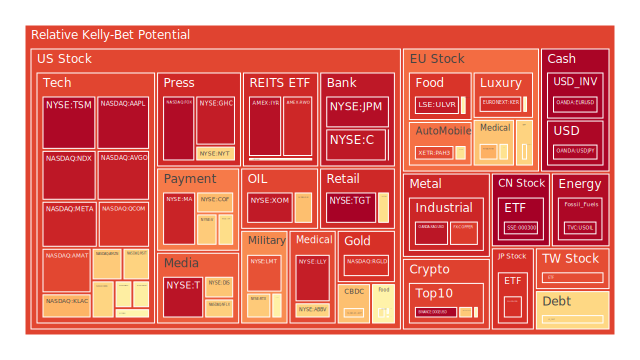

# **投資商品泡沫分析**

在當前的全球金融環境中，多重力量的交織正在塑造一個極其複雜且充滿不確定性的市場格局。從宏觀層面觀察，聯準會的鷹派立場與持續處於高位的利率，疊加消費者及商業地產領域日漸升高的拖欠率，共同構成了一幅經濟承壓的背景畫卷。微觀層面，地緣政治的烽火，特別是以色列與伊朗之間的緊張對峙，如同一塊巨石投入平靜的湖面，激起了層層漣漪，其傳導效應正透過能源價格、供應鏈穩定性及市場避險情緒，深刻影響著各類資產的定價邏輯。此刻，我們所觀察到的市場價格波動與風險評估，並非孤立的數字跳動，而是在此宏大敘事下，經濟、社會心理與博弈策略相互作用的自然顯現。

* **美國國債** 當前美國國債市場呈現出一個微妙且分裂的狀態。從數據上看，十年期美國國債（US10Y）的泡沫風險分數相對處於低位（約0.11），這在一個典型的「風險趨避」（Risk-Off）環境中，似乎是合理的避險選擇。然而，若將視角拉長，我們會發現整個殖利率曲線的結構性矛盾。短天期如一年期（US01Y）與二年期（US02Y）的公債，其風險分數顯著較高（分別約0.68與0.61），這反映了市場對於聯準會短期政策路徑的高度不確定性。

從一個空間性的三位一體視角來解析：市場（正方）將短期債券視為現金的替代品，提供了相對安全的收益率。新聞（反方）中，聯準會的鷹派發言以及中東衝突引發的石油價格上漲（USOIL泡沫分數高達0.98），共同指向了通膨可能捲土重來的威脅。這使得市場陷入兩難：一方面需要避險，另一方面又擔心聯準會為了對抗新一輪通膨而被迫將高利率維持更久，甚至再次升息，從而對債券價格構成打擊。其最終的合成（合方）結果是，資金雖然流入債券市場，但主要集中在對利率變動最不敏感的短天期債券，而長天期債券則因通膨預期與經濟衰退的雙重博弈而顯得乏人問津。

歷史上，1970年代的停滯性通膨時期，便出現過股市與債市同步下跌的窘境。當時的石油危機推高了通膨，迫使聯準會大幅升息，導致投資者無論是持有股票還是長期債券都遭受了損失。當前的情境與之有相似之處，高漲的能源價格、供應鏈的關稅壁壘（洛杉磯港進口下降19%的新聞為證）、以及已處於高位的公共債務，都為這種「股債雙殺」的場景埋下了伏筆。因此，儘管十年期國債當前的泡沫指數不高，但其潛在的價格風險，源於宏觀環境的根本性矛盾，不容忽視。

* **美國零售股** 美國零售股，如沃爾瑪（WMT）與目標百貨（TGT），正處於一個極度危險的泡沫區間。兩者的泡沫分數均處於極高水平，目標百貨的月平均風險分數甚至高達0.94以上。這一現象背後，是市場敘事與現實基本面的巨大脫節。

從社會學與心理學的角度切入，市場（正方）給予這些零售巨頭高估值，是基於其在經濟動盪時期的「防禦性」標籤，以及過去數十年來消費者支出持續增長的慣性思維。然而，新聞與經濟數據（反方）卻描繪了另一幅圖景：美國消費者信貸拖欠率處於相對高位，這直接削弱了消費者的購買力。同時，關稅導致的進口成本上升，正如家居品牌RH在財報會議上所言，經營環境充滿「混亂與不可預測性」，這將進一步壓縮零售商的利潤空間或以更高價格轉嫁給已然脆弱的消費者。

這種矛盾的綜合體（合方）是，股價的強勢，更多是源於一種博弈論中的「羊群效應」和路徑依賴。投資者相信，即使宏觀數據不佳，這些「大到不能倒」的零售企業總能找到出路。然而，歷史上不乏這樣的例子，2008年金融海嘯前夕，許多看似穩健的消費股同樣在風暴來臨之際遭遇了劇烈的價值重估。當前零售股的高泡沫，就像建立在一個日益脆弱的沙基之上，任何關於消費支出急劇放緩的明確信號，都可能成為戳破泡沫的利針。特斯拉在美國註冊量下滑16%的新聞，雖然是汽車行業，但也側面印證了高價消費品領域的疲軟，這種疲軟很可能向更廣泛的消費領域傳導。

* **美國科技股** 科技股，特別是那斯達克100指數（NDX），其泡沫分數已攀升至0.94的警戒水平，這主要由其中的大型權值股所驅動。微軟（MSFT）、亞馬遜（AMZN）、谷歌（GOOG）等巨頭的泡沫讀數普遍在0.6至0.7之間，而Meta（META）更是高達0.92。

這裡的三位一體辯證關係體現在「未來預期」與「當前現實」的對決中。市場（正方）對人工智慧（AI）革命抱持著極度樂觀的預期，Adobe的財報電話會議便是一個縮影，AI的採用被視為未來增長的核心驅動引擎。這種預期賦予了相關企業近乎無限的想象空間與估值溢價。然而，經濟現實（反方）是，高利率環境對成長股的估值模型構成最直接的壓力。高利率意味著未來現金流的折現值降低，這從根本上挑戰了科技股高估值的合理性。

心理學層面上，這是一種「錯失恐懼症」（FOMO）的極致體現。投資者擔憂錯過下一個科技浪潮，從而忽略了宏觀經濟的警訊。博弈論的角度看，這是一場膽小鬼遊戲，所有人都知道估值偏高，但在音樂停止之前，沒有人願意率先離場。最終的合成（合方）狀態是，科技股的價格由一種集體信念所支撐，而非穩固的現金流。這種由敘事驅動的漲勢，其脆弱性在於，一旦市場焦點從AI的長期願景被迫轉向企業短期的盈利壓力與宏觀衰退風險時，信心的崩潰可能引發劇烈的拋售。1999-2000年的網路泡沫破裂，便是前車之鑑，當時同樣是革命性的技術（網際網路）引發了非理性的繁榮，最終在聯準會升息與盈利不及預期的雙重打擊下轟然倒塌。

* **美國房地產指數** 以Vanguard房地產指數基金（VNQ）和相關ETF（IYR, RWO）為代表的美國房地產市場，正顯現出令人擔憂的信號。IYR的泡沫分數高達0.96，顯示出極高的風險。這一現象的根源在於利率環境的巨大變遷。

從經濟學的基本原理出發，房地產作為一種高度依賴信貸的資產，其價格與利率呈顯著的負相關。在當前30年期固定抵押貸款利率高達6.84%（去年同期僅為3.02%）的背景下，房地產市場的交易成本與持有成本都已大幅飆升。市場的定價（正方）似乎仍然部分沉浸在過去十餘年低利率時代的慣性中。然而，聯準會的經濟數據（反方）明確指出，商業地產和住宅地產的拖欠率均處於相對高位。這意味著高利率的衝擊已經實質性地傳導至終端借貸者，違約風險正在積聚。

社會層面上，高昂的房價與貸款利率，使得潛在購房者的負擔能力降至數十年來的低點，這將不可避免地抑制未來的需求。兩者的綜合（合方）結果是，當前房地產指數的高價格，可能更多地反映了存量資產的賬面價值，而未能充分計價流動性的枯竭與未來交易的萎縮。歷史上，2006-2007年的美國房地產市場，在利率持續上升後，最初也是呈現價漲量縮的局面，但最終由於次級抵押貸款違約的連鎖反應，引發了全面的崩盤。當前的高拖欠率，正是當年次貸危機的魅影，提醒我們房地產市場的泡沫風險不容小覷。

* **加密貨幣** 比特幣（BTCUSD）與以太坊（ETHUSD）等主流加密貨幣，在經歷了價格波動後，其泡沫風險呈現出複雜的態勢。比特幣的月平均泡沫分數約在0.45左右，而以太坊則在0.43附近，狗狗幣（DOGEUSD）在經歷一輪炒作後，風險分數從高位回落但近期又見攀升。這表明市場情緒有所降溫，但投機熱情並未完全消退。

從概念上解構，加密貨幣（正方）被其支持者視為一種對抗法幣體系通膨的「數位黃金」，或是一種去中心化金融（DeFi）革命的基礎設施。這種敘事賦予了它在特定社群中的價值共識。然而，從監管與宏觀經濟的角度看（反方），全球央行普遍的緊縮政策，抽走了市場的過剩流動性，而這正是過去幾年加密貨幣牛市賴以生存的土壤。此外，監管的不確定性始終是懸在其上方的達摩克利斯之劍。

博弈論的視角下，加密貨幣市場是一個典型的「資訊不對稱」與「信心驅動」的場域。少數巨鯨的動向可以輕易引發價格的劇烈波動，而大多數散戶投資者則是在追逐趨勢。其合成（合方）的結果是，加密貨幣的價格與傳統資產的關聯性時高時低，呈現出高度不穩定的特性。在地緣政治緊張時，它有時表現出避險屬性，但更多時候，當市場出現流動性危機時，它會因其高風險屬性而被首先拋售。其當前的泡沫水平處於中等，意味著市場正處於方向選擇的十字路口，既有的投機者尚未完全離場，而新的催化劑（無論是來自宏觀經濟還是行業內部）的缺席，使其難以形成明確的趨勢。

* **金/銀/銅** 貴金屬與工業金屬市場呈現出明顯的分化。白銀（XAGUSD）的泡沫分數極高，達到0.94，黃金（XAUUSD）則相對溫和，約在0.4至0.5之間，而銅（COPPER）作為工業活動的晴雨表，其泡沫讀數在近期顯著上升至0.88。

這一現象的三位一體分析如下：地緣政治危機（正方），特別是以色列與伊朗的衝突，為黃金和白銀提供了傳統的避險需求。新聞中油價的飆升也強化了它們作為通膨對沖工具的吸引力。然而，美元的強勢（反方）構成了對金屬價格的直接壓制。從數據上看，美元兌日元（USDJPY）的泡沫指數高達0.97，顯示出資金正在大規模流入美元資產。強美元使得以美元計價的金屬對持有其他貨幣的買家而言變得更加昂貴。

此處的合成（合方）結果是，黃金的價格在避險需求與強美元的拉鋸戰中陷入膠著，因此泡沫程度相對可控。白銀則因其額外的工業屬性以及更高的投機性，波動被放大，導致其泡沫風險遠高於黃金。銅價的飆升則更為複雜，一方面它受益於通膨預期和供應鏈瓶頸（如福特因稀土短缺停產的新聞所示），另一方面，它也反映了市場對某些領域（如國防、能源轉型基礎設施）需求韌性的押注，即便整體經濟面臨壓力。黃金/銅價比率（GOLD COPPER RATIO）處於歷史高位，這通常被解讀為避險情緒高於經濟增長預期，但當前銅價的強勢，可能意味著市場正在定價一種結構性的、與廣泛經濟脫鉤的需求。

* **黃豆 / 小麥 / 玉米** 農產品市場，如黃豆（SOYB）、小麥（WEAT）和玉米（CORN），其泡沫風險分數普遍處於0.35至0.58之間的中等水平。這反映了市場在多空因素交織下的觀望態度。

從基本面來看（正方），全球人口增長與飲食結構的改變，為農產品提供了長期穩定的需求基礎。然而，供給端的不確定性（反方）是影響價格的主要變數。這包括了氣候變遷導致的極端天氣、地緣政治衝突（例如俄烏衝突對全球糧食供應的歷史影響）以及各國的貿易政策。當前的中東危機，雖然不直接影響主要產糧區，但其推高的能源價格會增加化肥和運輸成本，間接對農產品價格構成支撐。

社會心理層面，糧食安全是各國政府和民眾最為敏感的話題之一。任何關於供應鏈中斷的風吹草動，都可能引發預防性的囤積行為，從而放大價格波動。此處的綜合（合方）表現為，農產品價格在等待下一個明確的驅動因素。當前的中等泡沫水平，意味著價格尚未完全反映潛在的供應風險。歷史上，在2008年和2011年的糧食危機中，能源價格上漲和投機資本的湧入，都曾扮演過關鍵的推手角色。考慮到當前能源價格的動盪，農產品市場的潛在風險正在積聚，它們可能成為下一階段通膨故事中的一個重要章節。

* **石油/ 鈾期貨UX\!** 能源市場是當前全球風險的震央。美國原油（USOIL）的泡沫分數已飆升至0.98的極限高位，清晰地反映了市場對中東供應中斷的恐懼。新聞中「油價跳漲7%」以及「以色列襲擊伊朗」的標題，是這一價格行為最直接的註解。鈾期貨（UX1\!）的泡沫分數則處於0.5至0.6的中等水平，顯示出市場對其的關注度正在提升，但尚未達到原油的狂熱程度。

從博弈論角度分析，石油市場（正方）正在上演一場典型的「升級博弈」。以色列與伊朗的每一次互相打擊，都將衝突推向更危險的邊緣，市場則在為最壞情況（如霍爾木茲海峽被封鎖）定價。與此同時，需求端（反方）卻存在隱憂，全球經濟放緩的預期、主要經濟體進口數據的下滑（如洛杉磯港），都可能抑制長期的石油需求。這兩股力量的撕扯（合方），使得油價雖然短期飆升，但其基礎並不穩固。一旦地緣政治局勢出現任何緩和跡象，或者經濟衰退的證據變得更加確鑿，高油價便可能迅速回落。

鈾的邏輯則有所不同。它代表了一種長期的、結構性的能源轉型敘事。在地緣政治導致化石能源供應不穩定的背景下，核能作為一種可靠的基載電力來源，其戰略價值日益凸顯。鈾市場的泡沫水平相對溫和，表明這更多是戰略投資者的長期佈局，而非短期投機者的狂熱追逐。黃金/石油比率（GOLD OIL RATIO）從上月的53.76降至47.20，直觀地顯示了在此輪危機中，石油的價格彈性遠超黃金，成為市場短期內最重要的風險指標。

* **各國外匯市場** 外匯市場是全球資本流動和風險情緒最直接的鏡子。美元兌日元（USDJPY）和歐元兌美元（EURUSD）的泡沫分數都處於0.96以上的極高水平，而英鎊兌美元（GBPUSD）和澳元兌美元（AUDUSD）則相對較低。

這揭示了一個清晰的三位一體邏輯：在全球不確定性上升時（反方，由中東危機和經濟衰退擔憂引發），資本會尋求「避風港」。傳統上，美元（正方）因其儲備貨幣地位和美國金融市場的深度，成為首要的避險選擇。儘管新聞中有人質疑美元的避險地位，但資金流動的數據不會說謊。結果（合方）便是美元相對於幾乎所有主要貨幣都表現強勢。

EURUSD的極高泡沫分數尤其值得玩味。這不僅反映了美元的強勢，也暴露了歐洲自身的脆弱性。歐洲經濟對俄羅斯能源的依賴尚未完全擺脫，且更容易受到中東衝突外溢效應的影響。德國（GDAXI）和法國（FCHI）的股指泡沫分數處於中高位，但其背後的經濟基本面遠不如美國穩固，這使得歐元面臨雙重壓力。日元的持續貶值，則是在日本央行鴿派立場與美日利差懸殊的背景下發生的，地緣政治風險只是加劇了這一趨勢。外匯市場的極端定價，實際上是在為全球經濟的「去同步化」投票——即美國的表現（至少在資本吸引力上）將持續優於世界其他地區。

* **各國大盤指數** 全球主要股指呈現出風險的全面擴散，但程度有所不同。美國那斯達克（NDX）風險最高（0.94），緊隨其後的是日本日經225指數（JPN225，泡沫分數0.89），台灣加權指數（0050，泡沫分數0.85），而歐洲的英國富時（FTSE）、德國DAX（GDAXI）和法國CAC（FCHI）則處於0.4至0.6之間的中高風險區。中國滬深300指數（000300）的泡沫分數則高達0.99。

空間上的比較揭示了風險的傳導路徑。以美國科技股為核心的AI狂熱（正方），透過全球化的產業鏈，將估值泡沫傳遞到了台灣的半導體產業（台積電TSM的泡沫分數高達0.97）和日本的相關設備與材料製造商。這形成了一個跨國界的「科技泡沫共同體」。然而，各國自身的經濟狀況（反方）則構成了差異化的背景。美國經濟雖然面臨挑戰，但其科技巨頭的盈利能力和市場領導地位依然強勁。歐洲則面臨更嚴峻的滯脹風險。日本股市的上漲，部分得益於公司治理改革和日元貶值帶來的出口競爭力。

滬深300指數的極高泡沫分數需要特別解讀。在中國經濟面臨內部結構性挑戰的背景下，如此高的風險讀數可能並非指向過熱的投機，而是一種價格與價值嚴重偏離、市場信心極度脆弱的表現。綜合來看（合方），全球股市的聯動性正在被一種「主題性」的驅動因素（AI）所主導，但各市場內在的脆弱性，使其在面對共同的宏觀衝擊（如中東危機引發的全球性風險趨避）時，會表現出不同的抗壓能力。

* **美國半導體股** 半導體行業是當前市場泡沫的核心。高通（QCOM）、應用材料（AMAT）、博通（AVGO）、台積電（TSM）等公司的泡沫分數普遍處於0.86到0.97的極高區間。輝達（NVDA）的月平均泡沫分數雖然在0.6左右，但其絕對價格和市場影響力使其成為整個板塊的風向標。

這是一個典型的「期望戰勝現實」的案例。市場（正方）為這些公司定價的基礎，是它們在AI軍備競賽中不可或缺的「賣鏟人」角色。這種預期是如此強烈，以至於完全蓋過了宏觀經濟的逆風。然而，博弈論的視角（反方）提醒我們，這是一場供應鏈的權力遊戲。福特因稀土短缺而停產的新聞，揭示了整個高科技產業鏈的脆弱性。任何一個環節的斷裂，都可能導致多米諾骨牌效應。

心理學上，投資者對半導體股的追捧，已經帶有非理性的宗教式狂熱。這導致了估值的極度延伸，遠超歷史常態。最終的合成（合方）是，半導體板塊的價格已經脫離了傳統的估值框架，成為一種衡量市場流動性和風險偏好的純粹指標。其巨大的權重意味著，該板塊的任何劇烈回調，都將直接引發科技股乃至整個市場的修正。這場盛宴何時結束，取決於AI的實際落地應用能否追上被無限拔高的期望，以及宏觀流動性是否會因意料之外的衝擊而突然收緊。

* **美國銀行股** 美國銀行股呈現出高度的風險積聚。摩根大通（JPM）、花旗（C）、美國銀行（BAC）等大型銀行的泡沫分數普遍在0.9以上。這與人們通常認為的「利率上升有利於銀行息差」的傳統觀念相悖。

正方的觀點是，高利率確實擴大了銀行的淨息差。然而，反方的證據則更為有力：聯準會的數據顯示，各類貸款的拖欠率正在全面上升，從商業地產到消費信貸。這意味著銀行即將面臨信貸損失大幅增加的局面。同時，高利率也導致銀行持有的長期債券資產出現巨額的未實現損失，去年矽谷銀行的倒閉便是前車之鑑。

從社會學角度看，銀行是整個經濟信用的中樞。當大範圍的信用違約事件發生時，銀行的資產負債表將首當其衝。此處的綜合（合方）結果是，市場對銀行股的高風險定價，實際上是在反映一種系統性風險的憂慮。投資者擔憂的不是單一銀行的經營問題，而是整個經濟體在高利率壓力下可能出現的「硬著陸」，以及由此引發的金融不穩定。銀行股的高泡沫，是經濟體健康狀況惡化的直接映射，而非其自身經營過熱的結果。

* **美國軍工股** 軍工股，如洛克希德·馬丁（LMT）、雷神（RTX）和諾斯洛普·格魯曼（NOC），是當前市場上少數幾個擁有明確利多催化劑的板塊。以色列與伊朗的衝突，以及全球地緣政治緊張局勢的普遍升級，為這些公司帶來了源源不斷的訂單預期。LMT的泡沫分數已達0.84，RTX和NOC則相對溫和，但整體處於上升趨勢。

從一個純粹的事件驅動視角來看（正方），衝突即是訂單，這是軍工行業最樸素的邏輯。新聞中「國防股走高」的報導證實了這一點。然而，從財政和政治的角度看（反方），各國的國防開支並非無限。美國高企的公共債務（佔GDP比重處於高位）可能會在未來限制國防預算的增長。此外，戰爭的不可預測性也帶來風險，任何和平的曙光都可能導致對該板塊的預期迅速逆轉。

博弈論的觀點（合方）是，投資軍工股是在對「世界將變得更加混亂」這一前景下注。這是一個與經濟周期關聯度較低的板塊，因此在市場普遍擔憂衰退時具有吸引力。然而，當一個交易變得如此顯而易見且廣為人知時，其本身就可能成為一個「擁擠的交易」（crowded trade）。當前的泡沫分數顯示，該板塊的估值已經部分反映了樂觀預期。投資者需要警惕的是，當好消息出盡時，股價可能面臨回調的風險，即使其長期基本面依然向好。

* **美國電子支付股** Visa（V）、萬事達卡（MA）、PayPal（PYPL）和Global Payments（GPN）等電子支付公司，其風險狀況呈現分化。Visa和萬事達卡作為行業雙寡頭，泡沫分數較高（V為0.66，MA為0.92），反映了它們強大的市場地位和穩定的商業模式。而PayPal和GPN的泡沫分數則低得多（PYPL約0.06，GPN約0.14），顯示出市場對它們的增長前景存在疑慮。

從經濟學的視角分析，支付公司的收入與名目消費支出（包括了通膨和實際增長）直接掛鉤。在一個通膨環境中（正方），它們的收入會自然增長。Visa和萬事達卡的全球網絡效應和輕資產模式，使其能夠有效地將成本轉嫁，維持高利潤率。然而，消費者的真實狀況（反方）是一個隱憂。高企的信用卡拖欠率表明，消費者正在承壓。如果經濟陷入衰退，失業率上升，那麼消費支出的總量將會萎縮，這將直接打擊所有支付公司的基本面。

兩者的綜合（合方）結果是，市場正在區別對待。投資者願意為Visa和萬事達卡的確定性和市場主導地位支付溢價，這推高了它們的泡沫指數。而對於像PayPal這樣面臨激烈競爭和轉型壓力的公司，市場則給予了極低的估值。這種分化反映了在不確定的宏觀環境中，資金向「品質資產」集中的趨勢。然而，即便是最強大的支付巨頭，也無法完全免疫於一場全面的消費衰退，其高企的泡沫分數中蘊含著對宏觀風險的低估。

* **美國藥商股** 大型製藥公司，如禮來（LLY）、默克（MRK）、嬌生（JNJ）、艾伯維（ABBV）和諾和諾德（NVO），呈現出極端的兩極分化。禮來因其在減肥藥和糖尿病領域的突破性產品，泡沫分數高達0.93。相比之下，JNJ、MRK、ABBV等傳統藥廠的泡沫讀數則處於0.2至0.7之間的中低或中等水平。

這是一個由「單一產品敘事」主導的市場。市場（正方）對禮來等公司的新一代藥物寄予厚望，認為它們將開創一個數千億美元的龐大市場，從而給予了其極高的估值。這是一種典型的「贏家通吃」的預期。然而，從行業競爭和監管的角度看（反方），製藥行業的專利懸崖、藥價談判壓力（尤其是在政府試圖控制醫療成本的背景下）以及新藥研發的失敗風險，是永恆存在的主題。

心理學層面，對「神藥」的追捧，使得投資者傾向於線性外推其初期的爆炸性增長，而忽略了競爭加劇和市場飽和的可能。綜合來看（合方），禮來的高泡沫是市場對其革命性產品的獎勵，但也使其股價對任何關於競爭、副作用或定價壓力的負面消息都極為敏感。而其他傳統藥廠的較低泡沫分數，則反映了市場對它們在專利到期和產品線老化等問題上的擔憂。這種劇烈的內部分化，使得投資製藥股從對一個行業的判斷，變成了對單個公司、單個產品成敗的豪賭。

* **美國影視股** 影視娛樂行業，如迪士尼（DIS）和派拉蒙（PARA），正處於轉型的陣痛期，其泡沫分數也反映了市場的掙扎。迪士尼的泡沫分數約為0.67，處於中高水平，而派拉蒙則僅為0.27。

這場變革的核心是商業模式的對立。傳統的線性電視和電影院業務（正方），曾經是穩定的現金牛，但如今正面臨觀眾流失和利潤下滑的困境。新興的串流媒體業務（反方），雖然代表了未來，但其高昂的內容成本和激烈的市場競爭，使得盈利之路異常艱難。強如Netflix（NFLX），其泡沫分數也僅在0.65左右，顯示市場對其長期盈利能力仍有保留。

從社會學角度看，觀眾的媒介消費習慣已經發生了不可逆轉的改變，他們追求的是更靈活、更個人化的內容體驗。這場變革的合成（合方）結果是，這些媒體巨頭陷入了「創新者的窘境」。它們必須不斷向低利潤的串流媒體投入巨資，同時還要維持日益萎縮的傳統業務。迪士尼的較高泡沫分數，得益於其無可比擬的IP（智慧財產權）庫和主題公園業務提供的緩衝。而派拉蒙等規模較小的公司，則在巨頭的夾縫中求生存，市場對其前景感到悲觀。該行業的未來，取決於誰能率先在串流媒體的「燒錢大戰」中實現可持續的盈利。

* **美國媒體股** 傳統媒體行業，如紐約時報（NYT）和福斯（FOX），其泡沫分數處於高位（NYT為0.64，FOX為0.97），這在一個看似夕陽的行業中顯得有些反常。

這背後是政治極化與資訊繭房的社會現象在起作用。在一個日益分裂的社會中（反方），持有特定立場的媒體（正方）能夠鞏固其特定的受眾群體，並將這種高度的用戶黏性轉化為商業價值（如訂閱收入或廣告收入）。福斯的高泡沫分數，可能反映了市場認為其在保守派受眾中擁有不可動搖的地位，這在政治選舉年尤其具有價值。

博弈論的視角下，這些媒體公司是在資訊市場中進行一場「定位賽」。它們不再追求廣泛的客觀性，而是透過鮮明的立場來吸引和固化自己的目標客群。這種策略的合成（合方）結果是，雖然整個傳統媒體行業的蛋糕在縮小，但頭部的、具有鮮明品牌定位的公司，卻能切下更大的一塊。然而，這種商業模式的風險在於，它高度依賴於社會的持續分裂，並且容易受到公信力危機或受眾疲勞的影響。其高泡沫分數，可能過度押注於政治對立的持續，而忽略了其商業基礎的長期脆弱性。

* **石油防禦股** 石油防禦股，如埃克森美孚（XOM）和西方石油（OXY），與油價本身一樣，展現出極高的風險。XOM的泡沫分數高達0.94，OXY也達到了0.68。

從資產定價的角度看，這些公司的股價（正方）是其主要產品——石油價格的直接映射。當中東危機推升油價時，它們的盈利預期和股價也隨之水漲船高。這是一個簡單明了的因果關係。然而，從更宏觀的經濟周期來看（反方），石油公司同時也受制於全球經濟的整體健康狀況。一場由高油價引發的全球性經濟衰退，最終會反噬石油需求，從而導致油價和石油公司股價的下跌。

這形成了一個自我限制的循環（合方）。石油股的漲勢，本身就在為未來的下跌埋下種子。歷史上，石油股的表現總是呈現出劇烈的周期性。在油價高漲的繁榮期，其股價大幅上揚，但在隨後的衰退和油價崩盤中，又會遭受重創。當前的極高泡沫分數，表明市場正處於這個周期的狂熱階段，短期內由地緣政治驅動的漲勢，完全壓倒了對長期需求破壞的擔憂。這是一個典型的順周期交易，其風險在於周期的拐點何時到來。

* **金礦防禦股** 金礦股，如Royal Gold（RGLD），其泡沫分數處於0.90的極高水平，這與黃金本身相對溫和的泡沫度數（約0.4-0.5）形成了鮮明對比。

這一現象背後的經濟學邏輯是「營運槓桿」。金礦公司的股價（正方）相當於帶有槓桿的黃金。當金價上漲時，由於其開採成本相對固定，其利潤的增長速度會遠超金價本身的漲幅，從而帶來更高的股價彈性。市場正是基於這種預期，給予了金礦股更高的估值溢價。然而，這種槓桿也是雙向的（反方）。一旦金價下跌，或者公司的營運成本（如能源、勞動力）因通膨而上升，其利潤就會受到雙重擠壓，導致股價的跌幅也遠超金價。

此處的綜合（合方）結果是，投資金礦股的風險與回報，都被不成比例地放大了。當前金礦股的極高泡沫，反映了市場對金價將會繼續上漲的強烈預期，甚至可能是在押注金價將會出現爆炸性行情。然而，鑑於黃金本身在強美元的壓制下表現膠著，金礦股的高估值就顯得格外脆弱。它與黃金實物之間巨大的風險溢價差異，本身就是一個警訊，表明投機情緒可能已經超越了基本面的支撐。

* **歐洲奢侈品股** 歐洲奢侈品巨頭，如LVMH集團（MC）和開雲集團（KER），其風險狀況也出現了分化。LVMH的泡沫分數處於0.55的中等水平，而規模較小的開雲集團則高達0.90。

奢侈品行業的基本盤（正方）在於其品牌所創造的「稀缺性」和「社會地位」象徵，這使其能夠在一定程度上抵禦經濟周期的影響。其目標客戶——高淨值人群的消費力相對穩固。然而，全球宏觀經濟的放緩，特別是重要市場的經濟表現（反方），依然會對其增長構成挑戰。此外，消費者的偏好變化和品牌間的激烈競爭也加劇了不確定性。

兩者的綜合（合方）結果，是市場對行業龍頭和追隨者給予了截然不同的評價。LVMH憑藉其多元化的品牌組合和在各個價位段的強大佈局，被認為具有更強的抗風險能力，因此市場給予的風險評價相對合理。而開雲集團，由於其對單一品牌的依賴度更高（尤其是Gucci），在品牌轉型期面臨更大的挑戰，市場對其前景的疑慮反映在了極高的泡沫分數上——這更像是一種對其未來不確定性的高風險定價。

* **歐洲汽車股** 歐洲汽車製造商，如寶馬（BMW）、賓士（MBG）和保時捷（PAH3），其泡沫分數在中高區間（BMW約0.43，賓士約0.60，保時捷高達0.85）。

該行業正處於一場深刻的歷史性變革之中。傳統的內燃機技術（正方），雖然仍是利潤的主要來源，但其前景已日益黯淡。電動化轉型（反方）則是不可逆轉的大勢所趨，但這條道路充滿了挑戰，包括巨額的研發投入、來自特斯拉和中國新興品牌的激烈競爭，以及充電基礎設施的不足。

從社會和政治層面看，各國政府的環保法規和補貼政策，正在強力引導這場轉型。這使得汽車公司的戰略決策，不僅是商業考量，更是一場政治博弈。最終的合成（合方）結果是，這些傳統汽車巨頭的估值，被夾在了舊時代的輝煌與新時代的不確定性之間。它們的泡沫分數，反映了市場對它們能否成功駕馭這場百年一遇的產業革命的疑慮。保時捷作為一個更偏向奢侈品和跑車的品牌，其較高的泡沫分數可能源於其品牌獨特性帶來的估值溢價，但也使其對高端消費市場的景氣度變化更為敏感。

* **歐美食品股** 全球性的食品飲料巨頭，如可口可樂（KO）、卡夫亨氏（KHC）、雀巢（NESN）和聯合利華（ULVR），其泡沫分數分佈在中高區域，從0.5到0.94不等。

從經濟學角度看，這些公司提供的產品（正方）屬於典型的「必需消費品」，需求彈性較低，因此在經濟下行周期具有天然的防禦屬性。在通膨環境下，它們還擁有將成本上漲轉嫁給消費者的定價能力。然而，從社會和健康趨勢的角度看（反方），消費者越來越追求健康、天然和環保的產品，這對以傳統加工食品為主的巨頭們構成了長期挑戰。

此處的綜合（合方）結果是，市場一方面承認它們在動盪時期的「避風港」價值，另一方面也擔憂其長期的增長潛力。聯合利華（ULVR）高達0.94的泡沫分數，可能反映了市場對其近期重組和成本控制措施的樂觀預期，但如此高的讀數也意味著容錯空間極小。可口可樂和雀巢等則處於中等風險區域，反映了其穩健但增長有限的特性。這些公司的股價，是在「短期防禦價值」和「長期增長焦慮」之間的平衡，其泡沫程度的差異，則體現了市場對每家公司應對長期挑戰能力的細微評判。

# **宏觀經濟傳導路徑分析**

當前市場最為關鍵的宏觀傳導路徑，始於中東的地緣政治衝突，並以一種教科書式的方式，層層遞進，撼動著全球金融體系。

第一步，是以色列與伊朗的直接對抗，這構成了整個鏈條的觸發點。這一事件迅速轉化為市場的恐慌情緒，新聞媒體上關於「油價跳漲7%」、「以色列攻擊伊朗核設施」的報導，成為點燃市場焦慮的火種。

第二步，是風險向能源市場的直接傳導。原油（USOIL）的泡沫指數應聲飆升至接近極限的0.98，黃金/石油比率的急劇下降，也標示著在此次危機中，石油相對於黃金，是更為敏感和劇烈的風險反應指標。這不僅是交易層面的反應，更反映了市場對全球經濟命脈——能源供應鏈可能中斷的深層恐懼。

第三步，是能源價格向通膨預期的傳導。儘管近期的CPI年增率（CPIYOY）已從去年的3.23%回落至2.40%，但油價的飆升構成了新的上行風險。這使得聯準會的處境變得極為棘手。聯準會官員近期的兩次鷹派發言，表明其對抗通膨的決心並未動搖。新的能源價格衝擊，將強化其「將高利率維持更長時間」（higher for longer）的政策傾向，甚至不排除在必要時再次升息的可能性。

第四步，是利率預期向資產定價的全面衝擊。這個階段，風險的傳導呈現出分叉和擴散。對於美國國債市場，短期國債因其避險屬性尚能獲得資金青睞，但長期國債則因通膨和利率的雙重壓力而受到拋售，導致殖利率曲線趨平（例如10年期與3個月期利差從上週的0.12收窄至0.04）。對於股市，高利率環境直接打擊了所有需要為未來增長進行貼現的資產，尤其是科技股和成長股。那斯達克指數（NDX）高達0.94的泡沫分數，正是在為這種宏觀壓力定價。對於實體經濟，高達6.84%的30年期抵押貸款利率和持續上升的各類貸款拖欠率，預示著金融緊縮的效應正從金融市場滲透到企業和家庭的資產負債表，經濟「硬著陸」的風險隨之上升。這條從地緣政治到全球資產價格重估的傳導路徑，是理解當前市場所有亂象的核心主線。

# **微觀經濟傳導路徑分析**

在宏觀風暴的背景下，一條同樣重要的微觀傳導路徑，正沿著全球供應鏈和企業成本悄然展開，最終匯集於終端消費者的購買力。

這條路徑的起點，是貿易保護主義的抬頭和供應鏈的瓶頸。新聞中提及的「洛杉磯港進口下降19%」以及「關稅打擊美國企業」，是這一趨勢的具體表現。家居品牌RH在其財報中坦言關稅帶來的混亂，福特汽車因稀土短缺而被迫停產，這些案例都說明，全球化合作的黃金時代或許正在退潮，取而代之的是一個更具摩擦和成本的貿易環境。

第二步，是成本壓力向企業端的傳導。企業面臨著兩難選擇：要麼自行吸收上升的成本，這將侵蝕其利潤率；要麼將成本轉嫁給下游。從眾多食品、消費品公司的財報和定價策略來看，後者往往是更普遍的選擇。

第三步，是價格上漲向消費者的傳導。這與宏觀層面的通膨壓力遙相呼輝，但在微觀層面，它體現為家庭生活成本的實質性增加。

第四步，是消費者壓力向零售業績的傳導。此處，我們看到了最為尖銳的矛盾。一方面，聯準會的數據顯示消費者信貸拖欠率處於高位，表明家庭財務狀況正在惡化。另一方面，市場卻給予了目標百貨（TGT）和沃爾瑪（WMT）等零售股極高的估值和泡沫評分。這種脫節，是市場慣性思維與現實困境的直接碰撞。特斯拉在美註冊量的下滑，是一個重要的警示信號，它表明即使在具有強大品牌光環的領域，消費者的支付能力和意願也已開始動搖。這條從關稅到消費者錢包的傳導路徑，揭示了看似繁榮的消費股背後，潛藏著巨大的需求懸崖風險。一旦消費者信心最終崩潰，其對相關企業的衝擊將是迅速而劇烈的。

# **資產類別間傳導路徑分析**

當前的市場環境，清晰地展示了風險情緒如何在不同資產類別之間引發連鎖反應，形成了幾條關鍵的傳導路徑。

第一條，是經典的「風險趨避」傳導路徑。由地緣政治衝突觸發的恐慌，導致資金從高風險資產（如科技股、新興市場股票）流出，湧入被視為安全的資產。這解釋了為何美元（以USDJPY的高泡沫分數為代表）表現強勢，以及為何防禦性板塊（如軍工股）受到追捧。然而，這條路徑在當前環境下出現了變異。傳統的避險資產——長期美國國債，因其對通膨和利率的高度敏感性，而在此次危機中失去了部分光環。資金的流動呈現出更為複雜和挑剔的模式，例如，湧入短債而非長債，追捧美元而非所有避險資產。黃金的表現相對平淡，也是因為其光芒在一定程度上被強勢美元所掩蓋。

第二條，是圍繞「人工智慧（AI）」主題的內部傳導路徑。這是一條由技術敘事驅動的獨立路徑。它始於核心的半導體設計公司（如NVDA、AVGO），然後傳導至晶圓代工廠（TSM）、半導體設備製造商（AMAT、KLAC），再到應用AI技術的軟體和平台公司（MSFT、GOOG、ADBE）。這條產業鏈上所有環節的公司，其股價都出現了高度的正相關性和集體性的估值膨脹，形成了一個巨大的「AI泡沫生態系統」。這個生態系統的風險在於其高度的內在關聯性。任何一個核心環節（如NVDA）的利潤不及預期或前景展望下調，都可能引發整個鏈條的信心危機和連鎖拋售。那斯達克指數之所以泡沫化嚴重，正是因為這些AI相關股票在其權重中佔據了主導地位。

第三條，是實物資產與金融資產之間的傳導路徑。中東危機首先衝擊的是實物資產——原油的價格。油價的飆升，進而影響了所有以能源為投入的行業成本，從航空、運輸到工業製造。這條路徑的下一步，是實物通膨壓力如何轉化為金融市場的利率預期，並最終重新為股票和債券等金融資產定價。同時，我們也看到了另一種反向傳導的可能：如果金融市場的信貸緊縮最終導致了嚴重的經濟衰退，那麼對實物資產（如原油、銅）的需求將會下降，從而又反過來打壓其價格。當前銅價和油價的強勢，與銀行股和房地產市場的疲軟，正構成了一種鮮明的對比，揭示了實體經濟中「通膨」與「衰退」兩種力量的激烈博弈。

# **投資建議**

基於上述分析，當前的市場環境核心特徵為：由地緣政治引發的滯脹（經濟停滯與通膨並存）風險急劇升高，市場流動性趨緊，且特定領域（尤其是AI相關科技股）存在顯著的估值泡沫。因此，投資組合的構建應以風險管理為首要原則，尋求在動盪中具備不對稱回報潛力的資產配置。

**穩健型投資組合 (總比例 100%)**

此組合旨在最大限度地保全資本，抵禦市場下行風險，追求絕對收益。

1. **短期美國國債 (例如1-3年期) (配置比例: 50%)**: 在利率環境不確定的背景下，短期國債是最佳的現金管理工具。它們提供了相對可觀的票息收入，同時其價格對利率變動的敏感度（久期）較低，能夠有效規避長期債券在利率上升時的資本損失風險。其當前的泡沫分數適中，是投資組合的穩定基石。  
2. **黃金 (XAUUSD) (配置比例: 30%)**: 作為跨越千年的終極避險資產，黃金在地緣政治危機和潛在的貨幣信用危機中具有不可替代的價值。雖然短期內受到強勢美元的壓制，但一旦市場焦點轉向對主權債務的擔憂或聯準會被迫轉向，黃金的上行潛力巨大。它與其他金融資產的低相關性，是構建穩健組合的關鍵。  
3. **必需消費品與醫療保健龍頭股 (例如JNJ, KO) (配置比例: 20%)**: 這些公司的業務不受經濟周期的直接影響，能夠提供穩定的現金流和股息。在經濟衰退預期升溫的環境中，其防禦屬性將凸顯。嬌生（JNJ）的泡沫分數極低，可口可樂（KO）處於中等水平，表明其估值相對合理，為投資組合提供了一定的增長潛力，同時風險可控。

**成長型投資組合 (總比例 100%)**

此組合旨在承擔中等風險，捕捉當前市場結構性機會，尋求在特定主題下的超額回報。

1. **國防軍工股 (例如LMT, RTX) (配置比例: 40%)**: 這是對當前地緣政治格局最直接的押注。在全球衝突加劇、國防預算普遍增加的趨勢下，該行業的增長確定性較高。雖然短期交易略顯擁擠，但其訂單的長期性使其具備穿越經濟周期的能力。它與廣泛市場的負相關性，使其成為對沖一般性衰退風險的有效工具。  
2. **能源股 (例如XOM, OXY) (配置比例: 30%)**: 在地緣政治風險導致油價高企的背景下，能源公司是直接的受益者。它們強勁的現金流能夠支持高額的股息和股票回購，為投資者提供回報。此配置是對「通膨將比預期更為持久」的戰術性押注，用以對沖投資組合中其他資產受通膨侵蝕的風險。  
3. **精選的非泡沫化科技股或基礎設施股 (例如IBM) (配置比例: 30%)**: 避開估值極度泡沫化的半導體和AI概念股，轉而尋找那些在數位轉型中扮演關鍵角色、但估值相對合理的科技公司。例如，專注於企業級服務、雲計算和諮詢的成熟科技公司（如IBM，泡沫分數中等），它們的業務黏性強，受宏觀經濟波動影響相對較小，能夠在不確定性中提供穩定的增長。

**高風險投資組合 (總比例 100%)**

此組合專為能夠承受較大波動的投資者設計，旨在透過對高風險、高潛在回報領域的精準押注，獲取最大化的資本增值。

1. **鈾期貨 (UX1\!) (配置比例: 40%)**: 這是一個對長期能源結構變革的投機性押注。化石能源的地緣政治風險，凸顯了核能作為清潔、可靠基載能源的戰略重要性。全球範圍內的核電復興趨勢，可能導致鈾的供需關係在未來幾年持續緊張。其當前中等的泡沫水平，表明這個故事尚未被市場完全定價，存在巨大的上行空間。  
2. **白銀 (XAGUSD) (配置比例: 30%)**: 白銀兼具貴金屬的避險屬性和工業金屬的需求屬性（尤其是在太陽能等綠色能源領域）。其價格彈性遠高於黃金，在通膨預期和投機情緒高漲的環境中，往往能爆發出驚人的漲幅。雖然其當前泡沫分數已高，但此配置是押注其波動性，博取在特定市場情緒下的超額收益。  
3. **加密貨幣 (例如BTCUSD, ETHUSD) (配置比例: 30%)**: 在全球主權債務高企、法幣信用面臨挑戰的宏觀背景下，比特幣作為一種獨立於央行體系的價值儲存手段，其長期敘事依然具有吸引力。以太坊則代表了去中心化金融的未來潛力。此配置是在承認其巨大波動性和風險的前提下，將其作為一個與傳統金融體系低相關的「彩票」式資產，用以捕捉非對稱的上行潛力。

# **風險提示**

投資有風險，市場總是充滿不確定性。本報告完全基於所提供的有限數據和特定時間點的觀察，不構成任何財務建議。所有分析和結論均存在局限性，且未來的市場發展可能與本報告的預期大相徑庭。投資者應根據自身的風險承受能力、財務狀況和投資目標，在進行充分研究後，做出獨立的投資決策。過去的表現不能預示未來的回報，所有投資都可能導致本金損失。

 
Daily Buy Map:

 
Daily Sell Map:

 
Daily Radar Chart:

 
