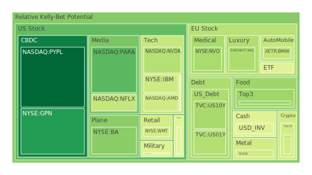
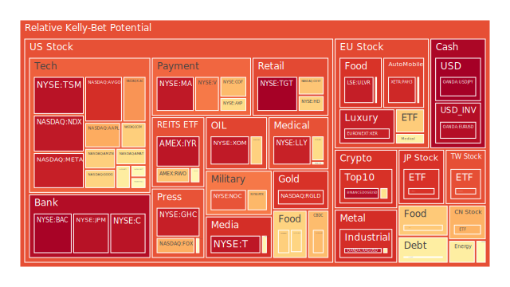
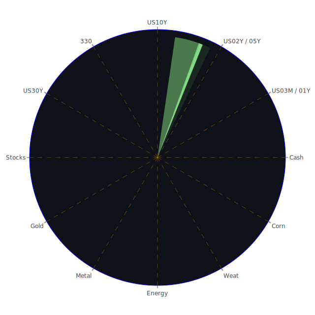

# **投資商品泡沫分析**

在當前2025年六月中旬的全球金融市場格局中，我們觀察到一個充滿矛盾與分歧的複雜畫面。地緣政治的陰霾，特別是中東地區的緊張局勢，正與特定科技領域的熾熱樂觀情緒交織，共同塑造著資產價格的未來路徑。聯準會的政策動向，在通膨數據看似溫和（年增率2.4%）但能源價格卻因衝突而蠢蠢欲動的背景下，顯得更加舉步維艱。兩次鷹派的發言暗示著貨幣政策的緊縮路徑可能比市場預期的更為漫長，這為所有資產的估值提供了嚴峻的背景。與此同時，經濟數據描繪了一幅雙速前行的景象：一方面，消費者與商業地產的違約率處於相對高位，暗示著實體經濟的潛在脆弱性；另一方面，貨幣市場基金總資產、美國銀行總存款等地緣流動性指標依然充裕。這種宏觀層面的不確定性，正以前所未有的方式滲透到各類資產的價格行為之中。

**美國國債**

美國國債市場正處於一個微妙的十字路口。從數據上看，各期限國債的泡沫風險分數普遍處於中低水平，但短期內呈現上升趨勢。例如，十年期國債（US10Y）的當日風險指標（0.342）顯著高於其月度平均（0.263），這反映出市場對持續通膨和聯準會鷹派立場的擔憂正在加劇。中東衝突導致油價上漲的新聞，直接強化了通膨預期，對債券價格構成壓力。

從歷史視角看，殖利率曲線的形態極具啟示性。當前，從三個月期到三十年期的殖利率曲線已經擺脫了去年的深度倒掛狀態，呈現出陡峭化的趨勢（例如，十年期與三個月期利差為正0.09）。在傳統經濟週期中，這通常被解讀為經濟復甦的信號。然而，在當前背景下，我們必須提出一個大膽的假設：這次的陡峭化並非源於對未來經濟強勁增長的樂觀預期，而是對「風險溢價」的重新定價。這其中融合了經濟學上的通膨風險、社會學層面的地緣政治不穩定性，以及心理學上的不確定性規避。投資者要求的補償更高，導致長天期債券價格相對承壓。

目前聯準會的資產負債表規模處於相對低位，而公眾持有的債務佔GDP比重卻處於高位，這構成了一種博弈。聯準會試圖通過縮表來抑制通膨，但龐大的政府融資需求使得市場必須吸收大量新增國債。外國機構的持有量雖高，但其未來的購買意願將取決於美元的強勢與美國地緣政治的穩定性。這是一場多方參與的信心博弈，任何一方的動搖都可能引發連鎖反應。

**美國零售股**

零售類股展現出令人高度警惕的訊號。以Target（TGT）為例，其泡沫風險指標已飆升至極端水平（當日0.997），且顯著高於其月度平均，顯示出短期內極度的投機熱情。Walmart（WMT）的情況稍好，但其長期風險指標也處於高位（0.852）。這背後可能存在一種社會心理學現象：在經濟不確定性增加時，消費者可能轉向他們熟悉和信任的大型零售品牌，從而給予這些公司一種虛假的安全光環。

然而，這種樂觀情緒與宏觀數據存在明顯的矛盾。聯準會數據顯示，消費者信貸違約率處於相對高位，這表明家庭預算的壓力正在增加。近期關於英國最大酒吧公司因債務危機而裁員的新聞，也為全球消費前景蒙上了一層陰影。因此，我們提出假設：零售股的高估值可能建立在一個脆弱的基礎之上，即市場過度相信品牌護城河能夠抵禦消費者購買力下降的衝擊。從博弈論角度看，這些公司與消費者之間正在進行一場價格與價值的博弈。當消費者財務狀況惡化到一定程度，他們將被迫放棄品牌忠誠度，轉向更廉價的替代品，這將是戳破泡沫的潛在觸發點。

**美國科技股**

科技股板塊呈現出顯著的內部分化，形成了一個概念上的三位一體：AI驅動的狂熱、平台巨頭的穩定，以及其他科技股的挣扎。NVIDIA（NVDA）作為AI革命的旗手，其風險指標近期有所回落（當日0.365，低於月均0.598），這可能意味著市場經歷了初期狂熱後，開始進行更為理性的評估，但也可能是暴風雨前的平靜。相比之下，Meta（META）的泡沫風險極高（0.938），這與其在AI領域投入巨資並與影響力人物（如Alexandr Wang）合作的積極新聞（正面影響84%）密切相關。市場正在為一個宏大的「AI敘事」定價，這種敘事的力量暫時壓倒了對高利率環境的擔憂。

從歷史上看，這與2000年初的網路泡沫有著驚人的相似之處。當時，任何與「網路」相關的公司都受到了市場的瘋狂追捧，其估值遠遠脫離了基本面。今天，「AI」正扮演著當年「網路」的角色。社會學上，這形成了一種「技術烏托邦」的集體信仰，投資者害怕錯過下一個時代的變革。

然而，Google（GOOG）、Microsoft（MSFT）、Amazon（AMZN）、Apple（AAPL）等巨頭雖然也受益於AI敘\[事，但其龐大的既有業務使其估值與宏觀經濟聯繫更為緊密。它們的風險指標普遍處於高位但相對穩定，反映出其市場主導地位。一個關鍵的傳導路徑是：如果宏觀經濟因高利率而放緩，企業客戶將縮減IT支出，這最終會影響到這些科技巨頭的雲端運算和軟體服務收入，從而挑戰其高估值。

**美國房地產指數**

美國房地產市場的風險指標，如IYR和VNQ，顯示出極高的泡沫水平（均超過0.95）。這與聯準會的數據形成了令人不安的共振：商業和住宅房地產的拖欠率均處於相對高位，而30年期固定抵押貸款利率維持在6.84%的高點。

這裡的三位一體是：高利率的「正」（Thesis）、高拖欠率的「反」（Antithesis），以及市場對房地產作為抗通膨資產的傳統觀念的「合」（Synthesis）。投資者可能認為，儘管融資成本高昂且違約風險上升，但持有實物資產是抵禦貨幣貶值的最佳方式。然而，這種信念在歷史上曾多次被證明是錯誤的，尤其是在信貸緊縮週期中。1980年代末的儲貸危機和2008年的次貸危機，都是房地產泡沫在高利率環境下破裂的經典案例。

目前的情況更加複雜。在家辦公的趨勢對商業地產構成了結構性挑戰，而住宅市場則面臨著可負擔性的極限。從博弈論角度看，買家、賣家和貸方陷入了僵局。賣家因鎖定低利率而不願出售，買家因高利率而無力購買，貸方則因擔心違約而收緊信貸標準。這種流動性的枯竭本身就是一個巨大的風險。高泡沫分數表明，當前的價格水平並未充分反映這些結構性問題。

**加密貨幣**

加密貨幣市場，特別是比特幣（BTCUSD）和以太坊（ETHUSD），其風險指標處於中等水平，但波動性極大，顯示出投機情緒的快速變化。狗狗幣（DOGEUSD）等迷因幣的風險指標則極高且不穩定（當日0.974），凸顯其純粹的投機屬性。

加密貨幣市場存在一個核心的概念三位一體：作為「數位黃金」的避險資產（正），作為高風險科技股的衛星資產（反），以及作為獨立於傳統金融體系的新興生態系統（合）。在市場動盪時，一些投資者湧入比特幣尋求避險，類似於黃金。然而，數據顯示，比特幣的價格行為往往與納斯達克指數高度相關，使其表現得更像一個高Beta值的風險資產。

從心理學角度看，加密貨幣吸引了對現有金融體系持懷疑態度或尋求快速致富的人群。這種強烈的社群共識和反建制的敘事，使其能夠在缺乏傳統基本面支撐的情況下維持高估值。然而，監管的不確定性、駭客攻擊的威脅以及其作為非法活動融資工具的用途，都構成了持續的潛在風險。當前的價格水平反映了這場關於未來貨幣形態的宏大博弈，但其基礎仍然是信念而非現金流。

**金/銀/銅**

貴金屬與工業金屬的表現出現分化。黃金（XAUUSD）和白銀（XAGUSD）的風險指標處於不同水平，黃金溫和（0.418），而白銀則非常高（0.964）。銅（COPPER）作為經濟的晴雨表，其風險指標也處於較高水平（0.571），但近期有所波動。

黃金的表現體現了典型的避險邏輯。中東衝突的新聞直接推高了其價格，使其成為地緣政治風險的對沖工具。然而，黃金也面臨來自強勢美元的壓力。美元兌日圓（USDJPY）的風險指標達到極值1.0，顯示出強烈的避險資金流向美元。黃金與美元的這種蹺蹺板關係，使得黃金的價格路徑變得複雜。黃金與石油的比率近期下降，表明相對於能源，黃金的避險吸引力有所減弱。

白銀兼具貴金屬和工業金屬的雙重屬性。其極高的泡沫分數可能反映了市場對其在綠色能源（如太陽能板）中應用的投機性押注，疊加了對通膨的擔憂。這種類似於1980年亨特兄弟操縱白銀市場的場景，儘管機制不同，但都顯示出當投機敘事與工業需求預期結合時，可能產生巨大的價格泡沫。

銅價則更直接地反映了對全球經濟增長的預期。其高風險分數與中國滬深300指數的高風險分數（0.706）可能存在關聯，市場或許在押注中國的經濟刺激政策將提振工業需求。這是一場對全球製造業復甦的博弈，但鑑於歐美經濟面臨的壓力，這場博弈的風險很高。

**黃豆 / 小麥 / 玉米**

農產品市場的風險指標普遍處於中等水平，如小麥（WEAT）、玉米（CORN）和黃豆（SOYB）。這類資產的價格主要受到供需基本面、天氣狀況和地緣政治的影響。中東的衝突雖然對能源市場影響直接，但對全球糧食供應鏈的間接影響也不容忽視。例如，能源價格上漲會推高化肥和運輸成本，從而傳導至糧食價格。

從歷史上看，糧食價格危機往往與能源危機同時發生，如1970年代和2008年。社會學上，糧食安全是所有國家最基本的關切。任何供應中斷的跡象都可能引發各國政府的囤積行為，從而加劇價格上漲。這是一個典型的「囚徒困境」博弈：單個國家囤積是理性的，但所有國家都囤積則會導致災難性的後果。當前溫和的風險指標表明市場尚未完全定價這種風險，但也為尋求多元化配置的投資者提供了潛在機會。

**石油/ 鈾期貨UX\!**

能源市場是當前地緣政治風險的風暴眼。美國原油（USOIL）的泡沫風險分數極高（當日0.587，但7日均線為0.776），反映出市場對以色列與伊朗衝突可能擴大並影響霍爾木茲海峽這一全球石油動脈的深切憂慮。新聞直接證實了這一點（「油價可能突破90美元」）。鈾期貨（UX1\!）的風險指標也處於中高水平（0.510），這不僅與能源整體的緊張局勢有關，也反映了全球向核能轉型的長期趨勢。

這裡的博弈論觀點非常清晰：主要產油國、消費國和地緣政治行動者之間正在進行一場高風險的膽小鬼遊戲。任何一方的誤判都可能導致供應鏈的實際中斷，從而引發全球性的經濟危機。歷史上，從1973年的石油禁運到1990年的海灣戰爭，中東衝突始終是油價飆升的主要催化劑。

從相對價格關係看，黃金/石油比率的變化是衡量市場恐慌情緒的重要指標。當前該比率的下降表明，市場認為短期內能源供應的風險比系統性金融崩潰的風險更為緊迫。

**各國外匯市場**

外匯市場是全球資本流動和風險偏好的最直接體現。美元的強勢是當前最顯著的特徵，美元兌日圓（USDJPY）的泡沫風險達到極值，反映出市場在尋求終極避險。聯準會的鷹派立場和美國作為全球最大經濟體的地位，使其成為動盪時期的首選。

歐元兌美元（EURUSD）的風險指標也極高（0.972），但其方向性可能更多反映了對歐洲經濟的擔憂。瑞士可能降息至零的新聞，以及英國經濟面臨的困境，都使得美元相對於歐洲貨幣更具吸引力。英鎊兌美元（GBPUSD）的風險指標也處於中高位。這形成了一個三位一體：美國的「避風港」地位（正），歐洲的「經濟停滯」擔憂（反），以及利差交易的獲利回吐（合），共同推動美元走強。

澳元兌美元（AUDUSD）作為商品貨幣，其風險指標溫和，反映出市場對全球經濟增長，特別是中國需求的矛盾看法。

**各國大盤指數**

各國股指的表現呈現分化，但普遍處於高風險區域。美國納斯達克100指數（NDX）風險極高（0.951），由少數科技巨頭驅動。與之相比，英國富時100（FTSE）、德國DAX（GDAXI）和法國CAC40（FCHI）的風險指標雖然也很高，但驅動因素更多來自於對各自國內經濟和歐洲央行政策的反應。

日本日經225指數（JPN225）的泡沫分數非常高（0.903），這與日圓的極度弱勢形成鮮明對比。這是一種奇特的現象：弱勢貨幣極大地提升了日本出口企業的盈利預期，吸引了大量外國資本流入股市，即使國內經濟本身可能並非十分強勁。這是一場由匯率驅動的資產通膨。

台灣加權指數（0050）和台積電（TSM）的風險指標也處於極高水平（分別為0.856和0.962），這完全由全球對半導體，特別是AI晶片的強勁需求所驅動。台灣在全球科技供應鏈中的關鍵地位，使其股市成為AI敘事的直接受益者，但也使其極易受到任何科技需求逆轉或地緣政治風險的衝擊。

**美國半導體股**

半導體行業是AI狂熱的核心。除了NVIDIA，高通（QCOM）、應用材料（AMAT）、科磊（KLAC）和博通（AVGO）的風險指標均處於高位或極高位。這反映了一種產業層面的樂觀預期，即AI將帶來長期的、巨大的晶片需求。台積電（TSM）作為全球最大的晶圓代工廠，其極高的風險分數（0.962）正是這一趨勢的頂點。

從既有理論看，半導體行業具有強烈的週期性。然而，市場當前的定價似乎認為AI的需求將打破這種週期性，帶來一個長期的「超級週期」。這是一個極為大膽的假設。歷史上，每一次技術革命（個人電腦、網路、智慧型手機）都曾引發類似的超級週期預期，但最終都未能完全擺脫宏觀經濟週期的引力。

風險在於，一旦AI的商業化應用不及預期，或者宏觀經濟衰退導致企業全面削減資本支出，對晶片的需求可能會出現斷崖式下跌。供應鏈中的任何一個環節出現問題（例如，美中科技戰升級限制了供應或市場），都可能引發整個板塊的劇烈回調。

**美國銀行股**

銀行股如摩根大通（JPM）、美國銀行（BAC）和花旗（C）的泡沫風險分數近期急劇攀升至非常高的水平。這與殖利率曲線陡峭化有關，因為陡峭的曲線通常有利於銀行的淨息差。市場可能在押注，銀行將從「更高更久」的利率環境中受益。

然而，這是一個危險的博弈。聯準會的數據顯示，商業地產和消費者的違約率正在上升。銀行作為信貸風險的最終承擔者，其資產負債表的健康狀況正面臨考驗。2023年的區域性銀行危機，已經揭示了利率迅速上升對銀行未實現損失的巨大影響。當前的高風險分數，可能表明市場忽視了信貸質量惡化的潛在威脅，過度關注了淨息差的改善。這是一種典型的「只見樹木，不見森林」的心理偏誤。

**美國軍工股**

洛克希德·馬丁（LMT）、雷神（RTX）和諾斯洛普·格魯曼（NOC）等軍工股的風險指標處於中高至高位，並且在近期有上升趨C勢。這與全球地緣政治緊張局勢的升級直接相關。以色列與伊朗的衝突、俄烏戰爭的持續，都轉化為對國防產品和服務的穩定需求。

從博弈論角度看，軍工股的投資邏輯是建立在一個「壞消息就是好消息」的基礎上。國際關係越緊張，衝突越多，這些公司的訂單就越多。這使其成為對沖地緣政治風險的一種獨特工具。然而，其估值也並非沒有上限。高昂的股價已經反映了大部分已知的衝突。只有當衝突規模出現超預期的擴大，或者開啟新的主要戰線時，才可能為股價提供新的動力。同時，和平的曙光或主要國家國防預算的削減，將是其面臨的最大風險。

**美國電子支付股**

Visa（V）、Mastercard（MA）、PayPal（PYPL）和美國運通（AXP）等電子支付公司，除了PayPal外，其餘的泡沫風險都處於極高水平。這反映了市場對其商業模式的極度信任。它們作為交易的「收費站」，受益於名目消費額的增長，無論這種增長是由於實際消費增加還是通貨膨脹。

然而，PayPal的低風險分數（0.053）提供了一個反向視角，揭示了行業內部的挑戰。競爭加劇、利潤率壓力以及對經濟放緩導致交易量下滑的擔憂，都是潛在的逆風。高風險分數的Visa和Mastercard，其估值可能已經完全消化了所有好消息。任何顯示消費者支出疲軟的信號（如我們在聯準會數據中看到的違約率上升），都可能對這些高高在上的股票構成嚴重威脅。

**美國藥商股**

大型製藥公司，如嬌生（JNJ）、默克（MRK）和艾伯維（ABBV），其風險指標普遍處於中低到中等水平。這符合其傳統的防禦性股票特徵。它們的需求相對不受經濟週期影響。然而，禮來（LLY）和諾和諾德（NVO）是例外，由於其在減肥藥領域的突破性進展，這兩家公司的泡沫風險分數極高。

這就形成了一個行業內的「新舊對立」。傳統藥廠依靠多元化的產品組合和穩定的現金流，成為市場動盪時的避風港。而以禮來為代表的創新型藥廠，則更像是高增長的科技股，其股價由單一重磅產品的巨大市場潛力所驅動。投資者在配置醫藥股時，必須清楚自己是在尋求穩定性，還是在押注下一個醫學奇蹟。禮來的高估值，歷史上可以與1990年代末搭上人類基因組計畫快車的生技公司相提並論，其風險與回報都是巨大的。

**美國影視股**

影視娛樂行業，如派拉蒙（PARA）和迪士尼（DIS），其風險指標處於中等水平。這個行業正處於結構性的轉型陣痛中。從有線電視向串流媒體的轉變，雖然是大勢所趨，但盈利模式尚未完全確立，競爭異常激烈。

從社會學角度看，影視內容是塑造文化和意識形態的重要工具。然而，在經濟壓力下，家庭會削減在娛樂上的非必要開支。Netflix（NFLX）的風險分數相對較高，表明市場認可其作為串流媒體龍頭的地位。迪士尼和派拉蒙則面臨著如何整合傳統媒體資產並在串流媒體大戰中盈利的挑戰。它們的股價反映了這種轉型的不確定性，既有潛在的價值，也存在巨大的執行風險。

**美國媒體股**

紐約時報（NYT）和福斯（FOX）等媒體股的風險指標處於中高水平。這個行業面臨著與影視股類似的數位化轉型挑戰，同時也受到政治兩極化的深刻影響。在一個社會日益分裂的環境中，擁有明確立場和忠實受眾的媒體品牌，似乎能夠建立起穩固的商業模式（如訂閱制）。

從心理學上講，人們傾向於消費與自己既有觀點一致的資訊，這就是「確認偏誤」。這為特定的媒體品牌創造了護城河。然而，這也使其增長潛力受限於特定的人群。此外，廣告收入對經濟週期高度敏感。最新的影響力行銷（Influencer Marketing）趨勢（正面影響94%），也對傳統媒體的廣告模式構成了新的挑戰。

**石油防禦股**

石油巨頭如埃克森美孚（XOM）的泡沫風險分數非常高（0.948）。這不僅僅是油價上漲的結果，也反映了在經歷了多年的資本支出不足後，這些擁有龐大儲備和現金流的公司，在能源緊張的時代成為了投資者眼中的「現金牛」。它們在傳統能源領域的防禦性，與在高油價環境下的高利潤預期，形成了一種強大的投資邏輯。這是一種對「舊經濟」的回歸，認為在世界應對能源轉型的混亂過程中，傳統能源的價值被低估了。

**金礦防禦股**

金礦股，如Royal Gold（RGLD），其風險指標處於高位（0.902）。金礦股通常被視為黃金價格的槓桿化投資。當金價上漲時，金礦公司的利潤率會不成比例地擴大。其高風險分數反映了市場對金價將在當前地緣政治和通膨環境下繼續走強的強烈預期。然而，這也使其對金價的下跌極為敏感。此外，運營成本（如能源和勞動力）的上升，也可能侵蝕其利潤，這是相對於直接持有黃金的額外風險。

**歐洲奢侈品股**

歐洲奢侈品巨頭，如LVMH（MC）和開雲集團（KER），其風險指標從中等到極高不等，顯示出市場對該行業的看法存在分歧。LVMH相對穩健，而開雲集團的風險分數則非常高。奢侈品行業的表現，是對全球財富效應和高淨值人群消費信心的直接反映。

從社會學角度看，奢侈品是地位和身份的象徵。在經濟繁榮時期，其需求旺盛。然而，當前全球經濟前景不明，特別是重要的中國市場復甦乏力，可能會對奢侈品銷售構成壓力。開雲集團極高的風險分數，可能是在博弈其旗下品牌（如Gucci）的重整能夠成功，這是一場高風險的賭注。歷史經驗表明，在經濟衰退期間，即使是富裕階層也會削減在奢侈品上的支出。

**歐洲汽車股**

歐洲汽車製造商，如寶馬（BMW）、賓士（MBG）和保時捷（PAH3），其風險指標處於中高到非常高的水平。它們正處於一場艱難的轉型之中：從傳統內燃機轉向電動車。這場轉型需要巨大的資本投入，但同時又面臨著來自特斯拉（TSLA）和中國電動車製造商的激烈競爭。

它們的困境是一個典型的「創新者窘境」。其傳統業務利潤豐厚，但正在萎縮；新興業務代表未來，但目前仍在虧損或利潤微薄。它們的高風險分數，反映了市場對其能否成功駕馭這場百年一遇的行業變革的深度不確定性。特斯拉相對較低的風險分數可能暗示，市場認為這位行業顛覆者在經歷了多年的高速增長後，也進入了一個更為成熟和充滿挑戰的階段。

**歐美食品股**

食品股，如雀巢（NESN）、卡夫亨氏（KHC）和可口可樂（KO），風險指標普遍處於中等水平。作為典型的防禦性板塊，它們的產品是生活必需品。然而，它們也面臨著成本上漲和消費者轉向自有品牌的壓力。聯合利華（ULVR）的風險分數較高，可能反映了市場對其成功進行品牌重組和成本控制的信心。食品股的投資邏輯，是在不確定時期尋求穩定現金流的博弈，但其利潤空間正面臨來自供應鏈和消費行為變化的雙重擠壓。

# **宏觀經濟傳導路徑分析**

當前的宏觀經濟傳導路徑，始於地緣政治這個外生變數。中東的衝突直接作用於石油市場，形成第一波衝擊。這條路徑如下：

以色列-伊朗衝突加劇 \-\> 市場擔憂霍爾木茲海峽運輸中斷 \-\> 油價飆升 \-\> 全球通膨預期上升。

這第一波衝擊，立即引發了第二條傳導路徑，即貨幣政策的再校準：

通膨預期上升 \-\> 聯準會和各國央行被迫維持鷹派立場，推遲降息 \-\> 全球利率在更長時間內維持高位 \-\> 借貸成本居高不下。

第三條路徑，是高利率環境對實體經濟的滲透與侵蝕：

高借貸成本 \-\> 企業資本支出減少，家庭信貸壓力增大 \-\> 商業地產及消費信貸違約率攀升（聯準會數據已證實）-\> 經濟活動放緩，失業率可能上升 \-\> 最終可能引發經濟衰退。

這三條路徑構成了一個負向的反饋循環。值得注意的是，目前市場似乎只完全定價了第一和第二步，對於第三步的嚴重性，從許多資產類別（如零售、銀行、科技股）極高的泡沫分數來看，市場顯然是過於樂觀了。歷史上，1970年代的滯脹就是沿著類似的路徑展開的，當時市場也經歷了從否認到恐慌的痛苦過程。

# **微觀經濟傳導路徑分析**

在微觀層面，我們看到了兩條截然不同且相互矛盾的傳導路徑。

第一條是「AI驅動的資本支出路徑」：

對AI技術潛力的巨大預期 \-\> 企業（特別是科技巨頭）投入巨資購買AI晶片和建設數據中心 \-\> 資本流向半導體（NVDA, TSM）和相關硬體公司 \-\> 這些公司的收入和利潤預期飆升，股價脫離宏觀基本面。

這是一條正向的、自我強化的路徑，由一個強大的技術敘事所驅動。新聞中Meta與Alexandr Wang的合作，正是這條路徑的催化劑。

第二條是「消費者壓力傳導路徑」：

通膨侵蝕實際工資，高利率增加償債負擔 \-\> 消費者可支配收入減少 \-\> 削減非必需品開支，尋求更便宜的替代品 \-\> 零售商（TGT, WMT）和消費品牌（KO）面臨利潤壓力 \-\> 支付處理商（PYPL）交易量增長放緩。

這是一條負向的路徑，由宏觀經濟壓力向下傳導。聯準會的消費者違約數據是這條路徑的早期預警信號。

目前，這兩條路徑正在並行發展，造成了市場的巨大分歧。關鍵問題是，它們何時會交會？傳導的交叉點可能是：當消費者壓力大到一定程度，導致整體經濟顯著放緩時，企業的收入和盈利也會受到影響，屆時它們將被迫重新評估其在AI上的巨大投入。那一刻，第一條路徑的樂觀預期就將與第二條路徑的殘酷現實發生碰撞。

# **資產類別間傳導路徑分析**

資產價格之間的漣漪效應，正通過幾條關鍵路徑傳導：

1. 能源 \-\> 債券 \-\> 股票估值路徑：  
   USOIL (↑) \-\> 通膨預期 (↑) \-\> US10Y 殖利率 (↑) \-\> 公司未來現金流折現率 (↑) \-\> NDX / 高成長股估值 (↓)。  
   這是一條經典的估值傳導路徑。目前，AI敘事暫時阻斷了這條路徑對部分半導體股的影響，但這種類「脫鉤」不可能無限期持續。納斯達克指數整體的高風險分數表明，該板塊的根基並不穩固。  
2. 地緣政治 \-\> 匯率 \-\> 全球資本流動路徑：  
   中東衝突 (↑) \-\> 市場避險情緒 (↑) \-\> USDJPY (↑) & EURUSD (↓) \-\> 資金從歐洲、日本流向美國 \-\> 強化美國資產（特別是國債和大型股）的避風港地位，但同時打擊美國出口企業的海外盈利。  
   這解釋了為何在風險高企的同時，美國主要股指依然堅挺。然而，過於強勢的美元本身對全球經濟而言是一種緊縮，其負面效應最終會反噬美國自身。  
3. 信貸風險 \-\> 金融體系 \-\> 實體經濟路徑：  
   商業地產/消費信貸違約率 (↑) \-\> BAC/JPM 資產質量擔憂 (↑) \-\> 銀行收緊信貸標準 (↑) \-\> 中小企業融資困難，經濟活動降溫 (↓)。  
   銀行股近期飆升的風險分數，表明市場可能完全無視了這條傳導路徑。2008年的教訓是，信貸市場的裂痕，最初看似微小，但其傳導可以是非常迅速和猛烈的。

# **投資建議**

基於上述分析，我們認識到市場正處於一個高風險、高不確定性的狀態。泡沫在多個領域積聚，而宏觀經濟的逆風卻在增強。因此，投資組合的構建應極度重視風險管理、多元化以及對不同傳導路徑的對沖。我們建議將資產按照「穩健」、「成長」與「高風險」三大類進行配置，總比例為100%。

**一個均衡型投資者的建議配置為：45% 穩健，35% 成長，20% 高風險。**

## **穩健型配置 (總計 45%)**

此部分旨在提供資本保護和穩定收益，作為風暴中的壓艙石。其核心邏輯是持有受宏觀逆風影響較小，或能從不確定性中受益的資產。

1. **短期美國國債 (25%)**: 選擇1至3年期的美國國債。它們提供了具吸引力的收益率（約4.1%至4.3%），同時久期風險遠低於長期國債，能在利率維持高位時提供穩定的票息收入。其風險指標溫和，是優質的現金替代品和避險工具。  
2. **防禦性大型製藥股 (10%)**: 配置如 JNJ (嬌生) 或 MRK (默克)。這些公司的產品需求剛性，現金流穩定，風險指標處於低位。它們提供了與經濟週期弱相關的穩定增長，是對沖經濟衰退風險的有效工具。  
3. **黃金 (10%)**: 直接持有黃金 (XAUUSD)。儘管面臨強勢美元的壓力，但在地緣政治衝突和長期貨幣貶值擔憂下，黃金的貨幣屬性和避險價值無可替代。其溫和的風險指標表明，相對於其他資產，其泡沫程度較低，是投資組合中不可或缺的保險。

## **成長型配置 (總計 35%)**

此部分旨在捕捉具備長期結構性增長潛力的領域，但承認其伴隨的較高波動性。配置的核心是尋找那些即使在宏觀逆風下，仍由強大趨勢驅動的資產。

1. **能源及核能 (15%)**: 平均配置於 XOM (埃克森美孚) 和 UX1\! (鈾期貨)。前者是對當前地緣政治驅動的能源價格上漲的直接押注，並能在通膨環境中提供分紅收益。後者則是對全球能源轉型和能源安全這一長期趨，勢的投資。這兩者結合，對沖了短期通膨和長期能源結構變革的風險。  
2. **全球醫療創新者 (10%)**: 配置 NVO (諾和諾德) 或 LLY (禮來)。雖然它們的泡沫風險很高，但其增長由減肥藥這一革命性產品驅動，這是一個獨立於傳統經濟週期的巨大市場。這是在高風險中尋求超額回報的選擇，但必須嚴格控制倉位。  
3. **精選半導體股 (10%)**: 配置於 NVDA (輝達) 或 AMD (超微)。鑑於NVDA的風險指標近期有所降溫，可能提供了一個相對更佳的風險回報切入點。這是對AI長期趨勢的投資，但必須認識到其高波動性和對市場情緒的高度敏感性。

## **高風險型配置 (總計 20%)**

此部分專為能夠承受巨大波動甚至本金損失風險的投資者設計。其目標是通過捕捉市場的短期動能和投機熱情來獲取高額回報。這部分倉位應被視為「衛星」配置。

1. **軍工複合體 (10%)**: 配置於 LMT (洛克希德·馬丁) 或 RTX (雷神)。在全球地緣政治持續緊張的「新常態」下，這些公司的訂單能見度高。這是對「世界變得更不太平」這一悲觀前景的直接對沖，其股價表現與大部分市場呈負相關或低相關。  
2. **支付基礎設施 (5%)**: 配置於 V (Visa) 或 MA (萬事達卡)。它們極高的風險分數反映了強勁的市場動能。投資邏輯是博弈其作為全球交易網絡核心的地位難以被撼動，能夠持續從名目消費增長中獲益。這是一場動能投資，需要密切關注消費者信貸數據的惡化趨勢。  
3. **加密貨幣龍頭 (5%)**: 配置於 BTCUSD (比特幣)。相對於其他加密貨幣，比特幣擁有最強的品牌共識和機構採用前景。將其作為一種數位商品和對沖法定貨幣體系長期風險的工具，以極小的比例配置，可以在風險可控的前提下，捕捉其巨大的潛在上行空間。

# **風險提示**

投資有風險，市場總是充滿不確定性。我們的建議僅供參考，投資者應根據自身的風險承受能力和投資目標，做出獨立的投資決策。過去的表現不代表未來的回報。本報告中提到的高泡沫風險資產，其價格可能在短期內發生劇烈且不可預測的波動，投資者應有損失部分甚至全部本金的準備。地緣政治事件的發展具有高度的不可預測性，可能隨時顛覆本報告中的所有假設。

 
Daily Buy Map:

 
Daily Sell Map:

 
Daily Radar Chart:

 
