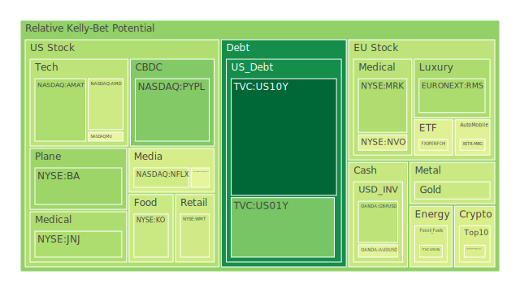
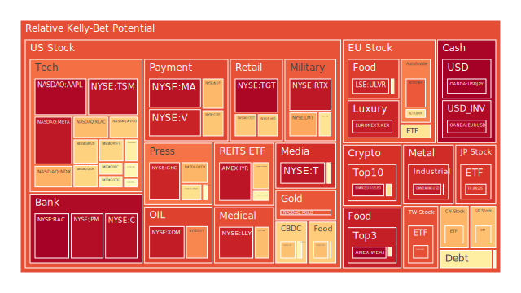
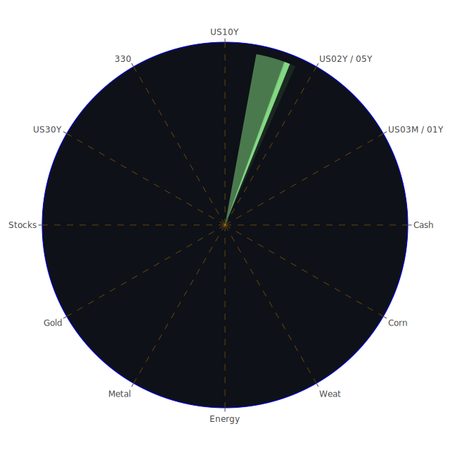

# **投資商品泡沫分析**

當前全球金融市場正航行於一片機遇與風險交織的迷霧之海。地緣政治的陰霾、中央銀行貨幣政策的轉向預期，以及科技革命的浪潮，三者共同構成了一幅複雜的圖景。從宏觀經濟數據來看，我們觀察到一個充滿矛盾的現象：一方面，美國公眾持有的債務佔GDP比重、貨幣市場基金總資產以及各項貸款違約率均處於相對高位，暗示系統性風險正在積聚；但另一方面，高收益債券的利率水平與信用卡壞帳率卻又處於相對低位，顯示市場情緒中仍帶有顯著的樂觀或稱之為麻木的成分。聯準會的鷹派言論與其資產負債表的持續縮減，形成了一種政策上的「正」，而市場對於降息的殷切期盼則構成了一股強大的「反」。這兩股力量的博弈，最終將「合」成何種市場走向，是我們當前分析的核心。

從資訊航母的空間(Spatial)維度來看，市場與新聞的三位一體體現在地緣政治、經濟數據與資產價格的共振上。中東地區以色列與伊朗的衝突升級，直接推高了石油價格，這是一個顯著的「正題」。其「反題」則是各國央行，特別是聯準會，為了對抗通膨而可能被迫維持更長時間的高利率政策。最終的「合題」表現為市場對供應鏈中斷和通膨再起的雙重恐懼，這使得軍工股、石油等避險資產受到追捧，同時也對科技股、非必需消費品等利率敏感性資產構成壓力。

從時間(Temporal)維度審視，當前的市場格局與歷史上的數個時期有著驚人的相似之處。例如，20世紀70年代的停滯性通膨（Stagflation）時期，其特徵便是高通膨與高失業率並存，能源危機是當時的核心驅動因素。今日，我們雖未見大規模失業，但地緣政治引發的能源價格上漲，疊加已然高企的通膨數據（CPI年增率2.4%），使市場對停滯性通膨的憂慮再現。這是一個歷史的「正題」。然而，與70年代不同的是，今日的科技發展，特別是人工智慧（AI）的突飛猛進，正以前所未有的方式提高生產效率，這構成了強大的「反題」。這兩者的結合，可能引導我們走向一個既非典型復甦，亦非典型衰退的未知「合題」領域，高科技成長股與傳統價值避險資產可能在不同階段交替表現。

從概念(Conceptual)維度剖析，我們看到傳統投資理論正在受到挑戰。「現金為王」的古老信條（正題），在各國政府普遍債台高築、貨幣超發的背景下受到質疑（反題）。投資者被迫在全球範圍內尋找能夠對沖法幣貶值風險的價值儲存手段，這導致了黃金、白銀等貴金屬，乃至加密貨幣等新興資產的崛起（合題）。博弈論的視角下，聯準會、各國政府、大型機構投資者與散戶之間正在進行一場複雜的多方博弈。聯準會希望以最小的經濟代價控制通膨，但地緣政治的「黑天鵝」使其任務變得異常艱鉅。投資者則試圖在聯準會的政策路徑、企業的盈利前景與突發新聞事件之間找到平衡點，每一個決策都是在不完全訊息下的機率賭注。

接下來，我們將深入探討各個具體資產類別的現狀與潛在風險。

* 美國國債  
  美國國債市場正處於一個微妙的十字路口。從數據上看，短、中、長期公債的泡沫風險分數普遍偏低，例如十年期國債（US10Y）的當日風險分數僅為0.0666，顯示市場並未出現恐慌性拋售，甚至在避險情緒升溫時仍有資金流入。這反映了其作為全球首要避險資產的傳統地位（正題）。然而，深入分析聯準會的經濟數據，我們看到美國政府債務佔GDP比重處於高位，且海外持有者佔比極高，這構成了其長期信譽的潛在威脅（反題）。收益率曲線的變化尤其值得玩味，去年此時（2024年6月）仍呈現深度倒掛（例如10年期與3個月期利差為-1.35%），而當前已轉為正值（+0.05%），這在歷史上往往是經濟衰退即將結束或開始的信號。這種正常化過程，是市場對未來經濟路徑的重新定價，亦是風險與機遇並存的「合題」。目前短期國債（如2年期US02Y）的泡沫風險相對較高且穩定在0.6左右，這可能反映了市場對聯準會短期內政策路徑的高度不確定性。  
* 美國零售股  
  以沃爾瑪（WMT）和塔吉特（TGT）為代表的美國零售股，呈現出截然不同的景象。沃爾瑪的泡沫風險指數在過去一個月內持續攀升，從月平均的0.868上升至近期高位，顯示其股價在高位積聚了相當大的風險。這背後是市場對其在通膨環境下成本轉嫁能力和必需消費品屬性的過度樂觀（正題）。然而，美國消費者信貸違約率處於高位的現實，以及高利率環境對消費能力的持續侵蝕，構成了嚴峻的挑戰（反題）。當前沃爾瑪的高估值，可能是市場忽視了宏觀壓力下的盈利放緩風險。相比之下，塔吉特的泡沫風險指數同樣極高，近期更是逼近飽和，其當日風險分數高達0.9855。這表明在消費降級的預期下，市場資金可能過度集中於少數幾家被認為是「贏家」的零售企業，形成了擁擠交易，其「合題」是，一旦財報或消費數據不及預期，可能引發劇烈的價格回調。  
* 美國科技股  
  科技股板塊呈現出顯著的內部分化。以大型股為主的納斯達克100指數（NDX）整體泡沫風險在過去一個月中有所回落，但近期又快速攀升至0.7119，顯示市場情緒的波動。輝達（NVDA）作為AI浪潮的領頭羊，其風險指數在月度級別（0.5976）相對較高，但短期內有所波動，反映出市場對其驚人漲幅後的估值進行反覆辯論。微軟（MSFT）、亞馬遜（AMZN）、谷歌（GOOG）等巨頭的風險指數也處於中高水平，顯示AI帶來的生產力革命預期（正題）已在很大程度上被計價。新聞中提到，英國電信預計AI將加劇裁員，這揭示了科技進步的社會成本（反題），即技術性失業可能在中長期抑制總需求，從而反噬科技公司的成長。這種「合題」意味著投資科技股需要精挑細選，不能再像過去那樣「雨露均霑」。相比之下，蘋果（AAPL）的泡沫風險近期急劇攀升至0.9835，可能與其新產品週期的市場預期或回購計劃有關，但如此高的風險讀數需要投資者高度警惕。  
* 美國房地產指數  
  以Vanguard房地產ETF（VNQ）和iShares美國房地地產ETF（IYR）為代表的房地產指數，其泡沫風險處於一個有趣的狀態。VNQ的月平均風險分數約為0.54，而IYR則高達0.90以上，且近期持續維持高位。這可能反映了不同地產子行業的差異。美國30年期固定抵押貸款利率從去年的3.02%飆升至現在的6.84%，商業地產和住宅地產的拖欠率均在高位徘徊，這是房地產市場面臨的最直接的宏觀逆風（正題）。然而，市場似乎對某些領域，如數據中心、物流倉儲等地產的需求抱有極高期望，或者預期聯準會最終將不得不降息以挽救市場，從而提前佈局（反題）。這種預期與現實的背離，導致了風險指數的居高不下，其「合題」是，房地產市場的穩定性極度依賴未來的利率路徑，任何鷹派的意外都可能戳破這個估值泡沫。  
* 加密貨幣  
  比特幣（BTCUSD）和以太幣（ETHUSD）的泡沫風險呈現中期降溫、短期反覆的態勢。比特幣的月平均風險分數約為0.45，而以太幣約為0.46，顯示在經歷了前期的劇烈上漲後，市場情緒趨於謹慎。從概念上看，加密貨幣被其支持者視為對抗法幣體系通膨的「數位黃金」（正題）。然而，其劇烈的價格波動、監管政策的不確定性以及與風險資產的高度相關性，使其避險屬性備受質疑（反題）。近期新聞中摩根大通申請區塊鏈相關商標的事件，暗示傳統金融巨頭正在加速佈局，這為加密市場的長期發展提供了潛在的合法性與資金來源。其「合題」是，加密貨幣正處於從純粹投機工具向被主流接納的另類資產過渡的階段，這個過程將充滿波動，其價格將同時受到宏觀流動性、市場風險偏好和產業內部創新（如ETF批准、技術升級）的多重影響。狗狗幣（DOGEUSD）這樣帶有濃厚迷因色彩的資產，其泡沫風險在短期內急劇拉升至0.9753，這純粹是投機情緒的體現，風險極高。  
* 金/銀/銅  
  貴金屬與工業金屬的表現揭示了全球經濟的複雜預期。黃金（XAUUSD）的泡沫風險保持在0.4至0.5的中等水平，顯示其價格上漲有相對堅實的支撐。在地緣政治緊張（以色列與伊朗衝突）、央行購金需求以及對沖主權債務風險等多重因素的推動下，黃金的避險價值凸顯（正題）。黃金與石油的比率（Gold Oil Ratio）從上月的54.35下降至45.98，顯示相對於黃金，石油價格的漲勢更為兇猛，這也從側面印證了市場對地緣政治風險的直接定價。白銀（XAGUSD）的泡沫風險則顯著高於黃金，近期一直維持在0.95左右的極高水平。這不僅因為白銀跟隨黃金上漲，更因為其在綠色能源（如太陽能板）中的工業需求預期（反題）。這種金融屬性與工業屬性的疊加，使其價格彈性更大，但也積聚了更高的泡沫。銅（COPPER）作為全球經濟的「溫度計」，其泡沫風險指數從月平均的0.55攀升至近期的0.88，後又回落至0.54。這反映了市場對於全球經濟復甦前景的矛盾心態。一方面，能源轉型和電氣化趨勢為銅帶來了長期結構性需求（合題），但另一方面，對主要經濟體（特別是中國和歐洲）增長放緩的擔憂限制了其上行空間。  
* 黃豆 / 小麥 / 玉米  
  農產品市場的泡沫風險整體處於中等偏下的水平。小麥（WEAT）的風險指數在短期內經歷了劇烈的波動，從0.3左右一度飆升至1.0的極值，然後又回落，反映了市場對供應鏈的極度敏感。地緣政治衝突，特別是涉及主要糧食出口國的衝突，很容易引發市場對糧食安全的擔憂，從而導致價格的脈衝式上漲（正題）。然而，全球庫存水平、天氣狀況以及美元匯率的變化共同影響著農產品的最終價格（反題）。黃豆（SOYB）和玉米（CORN）的風險指數相對平穩，處於0.5左右的中間區域。其「合題」在於，農產品市場的價格發現機制，是基本面（供需、天氣）與宏觀金融因素（匯率、投機資金流動）之間複雜互動的結果。在當前宏觀不確定性較高的背景下，農產品價格的突然波動仍是需要防範的風險。  
* 石油/ 鈾期貨UX\!  
  能源市場是當前地緣政治風險最直接的體現。美國原油（USOIL）的泡沫風險從月平均的0.43急劇拉升，近期維持在較高水平，這與新聞中大量關於以色列與伊朗衝突、伊朗油氣設施遇襲的報導完全一致。對供應中斷的恐懼是推動油價上漲的核心邏輯（正題）。然而，全球經濟增長放緩的預期，以及主要經濟體為對抗通膨而採取的緊縮政策，會抑制能源需求，這是油價上行的主要阻力（反題）。其「合題」是，油價將在地緣政治溢價和經濟衰退預期之間尋找平衡。鈾期貨（UX\!）的泡沫風險指數維持在0.5至0.6的區間，顯示市場對核能復興的長期趨勢抱有信心，但短期內情緒穩定。能源轉型和能源獨立的訴求，使得核能作為一種清潔、穩定的基載電力來源重新受到重視，這是其價格的長期支撐。  
* 各國外匯市場  
  外匯市場是各國經濟基本面和貨幣政策差異的集中體現。美元兌日圓（USDJPY）的泡沫風險指數極高，近期更是達到1.0的滿值。這反映了美國與日本之間巨大的利率差距，以及在套利交易驅動下的單邊市場行情。聯準會的鷹派立場（正題）與日本央行遲遲不願退出超寬鬆政策（反題）形成了鮮明對比，導致日圓持續貶值。這種極端的市場狀況積聚了巨大的回調風險，任何關於日本央行干預或聯準會政策轉向的信號都可能引發劇烈逆轉。歐元兌美元（EURUSD）的風險指數同樣處於0.97以上的高位，顯示市場可能正在對歐洲央行與聯準會政策的非同步性進行定價，或者存在大規模的投機頭寸。英鎊兌美元（GBPUSD）的風險在中等水平波動，反映了英國經濟自身的挑戰。  
* 各國大盤指數  
  全球主要股指表現分化。美國納斯達克指數如前述，風險較高。歐洲方面，德國DAX指數（GDAXI）和法國CAC40指數（FCHI）的泡沫風險處於0.5-0.6的中間區域，反映了歐洲經濟的疲軟和地緣政治的鄰近風險。英國富時100指數（FTSE）的風險水平與此類似。亞洲方面，日經225指數（JPN225）的泡沫風險長期維持在0.9以上的高位，這與日圓貶值推動出口企業盈利增長的邏輯一致，但也使其對匯率波動高度敏感。台灣加權指數（0050）的風險指數也處於0.85以上的高位，這主要由半導體產業的繁榮所驅動，特別是台積電的強勢表現。滬深300指數（000300）的泡沫風險在近期有所抬升，從月平均的0.82上升至近0.9，這可能與市場對政策支持的預期有關，但其長期趨勢仍面臨經濟結構性問題的挑戰。  
* 美國半導體股  
  半導體行業是本輪科技浪潮的核心，其內部也呈現出「K型」分化。輝達（NVDA）、台積電（TSM）、博通（AVGO）等直接受益於AI數據中心建設的企業，其股價和估值均處於歷史高位。台積電的泡沫風險指數從月平均的0.92攀升至近期的0.96，博通也維持在0.8以上的高位。這背後是市場對AI算力需求近乎無限增長的信仰（正題）。然而，整個半導體行業具有強烈的週期性，且面臨地緣政治（如晶片法案、出口管制）的直接影響（反題）。AMD、英特爾（INTC）、美光（MU）等公司的泡沫風險則相對較低或處於中等水平，反映了它們在AI競賽中的不同地位。其「合題」是，半導體行業的投資回報將高度集中於少數幾個技術路徑和生態位的領導者，而行業整體的繁榮能否持續，則取決於AI應用的普及速度是否能支撐起如此龐大的資本開支。  
* 美國銀行股  
  銀行股的泡沫風險呈現出驚人的一致性走高。美國銀行（BAC）、花旗集團（C）、摩根大通（JPM）的泡沫風險指數在近期均攀升至0.95以上。從表面上看，利率上升擴大了淨息差，有利於銀行盈利（正題）。然而，潛在的風險不容忽視。聯準會數據顯示商業地產和消費者貸款的違約率正在上升，而收益率曲線的平坦化甚至倒掛（儘管近期有所緩解）會侵蝕銀行的盈利能力。更重要的是，銀行持有大量在低利率時期購買的長期債券，利率的上升導致這些資產出現巨額的未實現虧損，這是銀行體系一個潛在的薄弱環節（反題）。當前銀行股的高泡沫風險，可能是市場低估了信貸風險和利率風險的滯後效應，其「合題」是，銀行股的表現將是淨息差擴張與資產質量惡化之間的一場賽跑。  
* 美國軍工股  
  地緣政治的緊張局勢是軍工股最直接的催化劑。洛克希德·馬丁（LMT）、諾斯洛普·格魯曼（NOC）、雷神技術（RTX）等國防承包商的泡沫風險指數在過去一個月顯著上升。例如，RTX的月平均風險為0.85，LMT和NOC的風險也在向高位移動。新聞中以色列與伊朗的衝突、俄烏戰爭的持續，以及全球範圍內國防開支的增加，為這些公司提供了清晰的訂單前景（正題）。從歷史上看，在冷戰時期，軍工複合體是一個獨立於經濟週期的存在。然而，任何地緣政治局勢的緩和都可能導致其估值溢價的快速回落（反題）。此外，政府預算的限制和採購流程的複雜性也構成了其增長的約束。其「合題」是，軍工股在當前环境下具有明確的事件驅動邏輯，但其高估值已部分反映了衝突預期，投資者需警惕局勢緩和帶來的「和平風險」。  
* 美國電子支付股  
  電子支付行業正面臨挑戰。Visa（V）、Mastercard（MA）的泡沫風險指數處於0.9以上的高位，這似乎與其市場壟斷地位和持續的消費增長預期有關。然而，PayPal（PYPL）的泡沫風險指數卻長期處於0.4以下的低位，顯示市場對其前景的悲觀。這反映了該行業內部的結構性變遷。Visa和Mastercard作為傳統支付網絡，受益於通膨帶來的名義交易額增長（正題）。但它們同時也面臨著來自新興支付方式（如先買後付BNPL、央行數字貨幣）和金融科技公司（如PYPL、GPN）的激烈競爭，以及監管機構對其費率的反壟斷審查（反題）。其「合題」是，傳統支付巨頭的護城河雖然深厚，但並非堅不可摧，而新興支付公司的股價則反映了市場對其能否在激烈競爭中突圍的疑慮。PYPL的低風險讀數可能意味著其已被市場過度懲罰，存在價值修復的可能。  
* 美國藥商股  
  大型製藥公司內部表現各異。禮來（LLY）的泡沫風險指數持續穩定在0.93以上的極高水平，這主要由其在減肥藥和糖尿病藥物領域的突破性產品驅動。諾和諾德（NVO）的情況與此類似，其風險指數也從中等水平攀升。市場對這些「爆款」藥物未來數年銷售額的樂觀預期，是其高估值的核心支撐（正題）。相比之下，嬌生（JNJ）、默克（MRK）、艾伯維（ABBV）等傳統藥廠的泡沫風險處於中等或偏低水平。大型藥廠普遍面臨專利懸崖（暢銷藥專利到期）和藥品定價的政治壓力（反題）。其「合題」是，製藥行業的投資邏輯正從過去的分散化、穩定現金流轉向對單一重磅藥物研發成功的巨大押注。這種模式雖然可能帶來超額回報，但也大大增加了單一公司投資的風險。  
* 美國影視股  
  影視與媒體行業正經歷深刻的結構性變革。Netflix（NFLX）的泡沫風險指數維持在0.4-0.6之間，顯示市場對其從用戶增長轉向盈利能力的戰略持肯定態度，但估值相對合理。迪士尼（DIS）的風險指數在0.5-0.6的區間波動，反映了其從傳統媒體向串流媒體轉型過程中遇到的困難，以及主題公園業務復甦與內容成本高昂之間的矛盾。派拉蒙（PARA）的風險指數在0.4左右，顯示市場對其前景較為悲觀。串流媒體的興起打破了傳統的發行渠道（正題），但也引發了激烈的內容軍備競賽和用戶審美疲勞（反題）。其「合題」是，只有那些能夠持續產生優質IP、有效控制成本並實現全球化分銷的平台才能最終勝出。整個行業的利潤率可能在長期內受到擠壓。  
* 美國媒體股  
  以紐約時報（NYT）和福斯公司（FOX）為代表的傳統媒體，其泡沫風險處於中高水平（0.6-0.7之間）。這反映了它們在數位化轉型中的相對成功，找到了訂閱和廣告之外的收入來源（正題）。然而，它們面臨著來自社交媒體、演算法推薦新聞的巨大挑戰，以及公眾對傳統媒體信任度下降的社會趨勢（反題）。其「合題」是，能夠建立強大品牌和獨特內容護城河的媒體公司仍有生存空間，但整個行業的增長天花板顯而易見。  
* 石油防禦股/金礦防禦股  
  這類股票的表現與其基礎商品價格高度相關，但又包含公司運營的個體風險。埃克森美孚（XOM）和西方石油（OXY）等石油公司的泡沫風險在油價上漲的推動下走高，XOM已達到0.94的高位。它們受益於高油價，並通過股票回購和分紅回饋股東（正題）。但它們也面臨著能源轉型帶來的長期生存威脅和巨大的資本開支需求（反題）。金礦股如Royal Gold（RGLD）的泡沫風險指數也處於0.9左右的高位，其股價是對金價的槓桿化反應。金礦公司的盈利能力不僅取決於金價，還取決於其開採成本、地緣政治風險和運營效率（合題）。投資這類股票是在押注商品價格上漲的同時，也承擔了公司層面的經營風險。  
* 歐洲奢侈品股/汽車股  
  歐洲市場的代表性行業也顯示出壓力。奢侈品巨頭如LVMH（MC）和開雲集團（KER）的泡沫風險指數處於中高位。KER的風險指數更是攀升至0.94。這些公司受益於全球高淨值人群的財富增長和品牌稀缺性（正題）。然而，它們對全球經濟週期，特別是主要消費市場（如中國）的景氣度高度敏感（反題）。汽車製造商如寶馬（BMW）、賓士（MBG）、保時捷（PAH3）的泡沫風險指數則處於中等到偏高的水平。它們正處於從傳統燃油車向電動汽車轉型的痛苦過程中，面臨著來自特斯拉和中國製造商的激烈競爭，以及高昂的研發和資本支出壓力。PAH3的風險指數高達0.84，可能還反映了其與大眾集團複雜持股結構相關的特定風險。其「合題」是，歐洲的傳統優勢產業正受到新技術和新地緣經濟格局的雙重衝擊，其未來表現充滿不確定性。  
* 歐美食品股  
  食品股通常被視為防禦性資選，但在當前的通膨環境下，其表現也出現了分化。聯合利華（ULVR）、雀巢（NESN）、卡夫亨氏（KHC）、可口可樂（KO）等公司的泡沫風險指數處於中高位。例如ULVR的風險指數高達0.93。這些公司擁有強大的品牌力，使其能夠在一定程度上將上升的成本轉嫁給消費者（正題）。然而，當通膨高到一定程度，消費者會開始尋求更便宜的替代品（自有品牌），出現消費降級現象，這會侵蝕品牌食品公司的市佔率和利潤率（反題）。其「合題」是，即使是防禦性板塊，在極端的宏觀環境下也無法完全倖免，公司的定價能力和成本控制能力成為決定其表現的關鍵。

# **宏觀經濟傳導路徑分析**

當前的宏觀經濟傳導路徑呈現出多條相互交織且可能相互矛盾的鏈條。  
第一條路徑，也是最顯著的一條，由地緣政治驅動：  
中東衝突升級 → 原油及大宗商品價格上漲 → 全球通膨壓力再起 → 歐美央行（特別是聯準會）被迫維持高利率，甚至進一步收緊貨幣政策 → 全球融資成本上升，美元走強 → 壓抑全球股市估值（特別是成長股），新興市場面臨資本外流和債務壓力 → 全球經濟增長進一步放緩，增加衰退風險。  
第二條路徑，由美國國內經濟數據驅動：  
高位的消費者及房地產違約率 \+ 高政府債務 → 市場對信貸風險和主權信譽的擔憂加劇 → 金融體系脆弱性增加（如區域性銀行壓力）→ 聯準會面臨「保金融穩定」與「抗通膨」的兩難困境 → 若選擇保穩定而提前降息，可能引發通膨失控；若堅持抗通膨，則可能刺破信貸泡沫 → 市場波動性急劇升高，避險資產（黃金、短期國債）需求增加。  
第三條路徑，由科技革命驅動：  
AI技術突破與應用普及 → 提高全要素生產率，帶來潛在的通縮效應 → 支撐科技公司盈利高速增長，吸引大量資本流入（如NVDA、MSFT）→ 加劇勞動力市場結構性失業，可能抑制長期總消費需求 → 貧富差距擴大，引發社會問題 → 對沖部分由供應鏈和地緣政治引發的通膨壓力，形成「科技通縮」與「現實通膨」並存的複雜局面。  
這三條路徑的相互作用，使得市場的最終走向極難預測。例如，AI帶來的效率提升可能部分抵銷能源價格上漲對企業成本的衝擊，而地緣政治風險引發的避險情緒又可能短暫地推高被高債務問題困擾的美國國債價格。

# **微觀經濟傳導路徑分析**

在企業和行業層面，傳導路徑同樣複雜。  
路徑一：成本傳導與利潤擠壓  
原物料價格上漲（石油、銅）+ 勞動力成本上升 → 企業生產成本增加 → 品牌力強的公司（如LVMH、可口可樂）通過提價將成本轉嫁給消費者，維持利潤率 → 品牌力弱或處於完全競爭行業的公司（部分零售、製造業）利潤空間被擠壓 → 引發盈利預警，股價下跌。  
路徑二：利率敏感性傳導  
聯準會維持高利率 → 企業融資成本和資本支出門檻提高 → 對高槓桿、需要持續投資的行業（如房地產、公用事業、部分資本密集型科技公司）構成壓力 → 另一方面，高利率使銀行淨息差擴大，但同時也增加了其資產端的信貸風險 → 消費者貸款成本上升（車貸、房貸），壓抑大宗商品消費（汽車、住房）。  
路徑三：AI的顛覆性傳導  
AI技術應用 → 在軟體、媒體、客戶服務等行業，AI替代部分人力，降低運營成本，提升效率（如微軟的Copilot）→ 在半導體行業，對AI晶片的需求呈爆炸性增長，利好上游設計和製造商（NVDA、TSM）→ 在傳統行業，未能及時採用AI技術的公司將面臨競爭劣勢，可能被市場淘汰 → 創造出新的商業模式和業態（如AI驅動的藥物研發），同時也顛覆現有市場格局。

# **資產類別間傳導路徑分析**

不同資產之間的漣漪效應構成了資產配置的核心考量。

1. **美元與大宗商品/新興市場**：強勢美元（由聯準會鷹派政策或避險情緒驅動）通常會壓低以美元計價的大宗商品價格（黃金除外，其有時與美元同漲）。同時，強勢美元會加重新興市場的美元債務負擔，引發資本外流，對新興市場股、匯、債市構成三重打擊。  
2. **利率與成長股/價值股**：長端利率（如美國10年期公債殖利率）是科技成長股估值的「地心引力」。利率上升，未來現金流的折現值下降，對高估值的成長股（如大部分科技股）打擊尤為嚴重。相反，在利率上升初期，價值股（如銀行、能源股）可能因其盈利與經濟週期和利率正相關而表現更優。  
3. **黃金與實際利率/加密貨幣**：黃金價格與美國實際利率（名目利率 \- 通膨預期）呈高度負相關。當實際利率為負或下降時，持有黃金的機會成本降低，金價易漲難跌。同時，黃金與比特幣之間存在複雜的「既替代又跟隨」的關係。在部分投資者眼中，比特幣是數位黃金，可以替代黃金的避險功能；但在宏觀流動性收緊時，兩者又可能同時被拋售。  
4. **石油與通膨/消費股**：油價是通膨預期的重要風向標。油價上漲會直接推高CPI，影響央行決策。同時，高油價會侵蝕消費者的可支配收入，如同對消費者徵稅，對非必需消費品股票（如汽車、旅遊、部分零售）構成利空。

# **投資建議**

基於上述分析，我們提出在當前環境下，旨在平衡風險與回報的三種資產配置組合。所有比例均為建議，投資者應根據自身情況進行調整。

**一、 穩健型投資組合 (Conservative Portfolio)**

此組合旨在最大限度地保全資本，對沖極端風險，追求穩定、低波動的回報。

* **配置比例：**  
  * **核心資產 (70%): 美國短期國債 (1-3年期)**  
    * *理由：* 在利率高企且未來路徑不確定的環境下，短期國債能提供具吸引力的票息收入，同時其久期較短，受利率波動的負面影響遠小於長期國債。它是當前現金的優質替代品，流動性極佳。  
  * **防禦性股票 (20%): 嬌生 (JNJ)**  
    * *理由：* 嬌生業務多元化，涵蓋製藥、醫療器材和消費品，受經濟週期影響較小。其泡沫風險指數長期處於中低水平（當前約0.36），估值相對合理，且有穩定的分紅歷史，提供了良好的防禦性。  
  * **價值修復機會 (10%): PayPal (PYPL)**  
    * *理由：* PayPal的泡沫風險指數極低（長期在0.4以下），表明市場對其的悲觀預期可能已經過度。作為全球領先的數位支付平台，其品牌和用戶基礎依然強大。此處配置是博弈其估值從極度低估狀態向合理水平修復的可能性，風險可控。

**二、 成長型投資組合 (Growth Portfolio)**

此組合旨在平衡成長性與風險控制，在承擔中等風險的前提下，捕捉結構性增長機會。

* **配置比例：**  
  * **科技核心 (40%): 微軟 (MSFT)**  
    * *理由：* 微軟在AI浪潮中處於應用層和平台層的絕對領先地位，其雲端業務(Azure)和軟體生態(Office 365 Copilot)構成了強大的護城河。其泡沫風險指數雖處於中高位（約0.64），但相較於純粹的硬體股，其商業模式更具韌性，能夠持續將技術優勢轉化為現金流。  
  * **全球工業金屬 (30%): 銅 (COPPER) 相關資產或ETF**  
    * *理由：* 銅是全球能源轉型和電氣化（電動車、電網升級）的核心金屬，長期需求有結構性支撐。其當前的泡沫風險處於中等水平（約0.54），價格波動既能反映全球經濟的短期健康度，也蘊含了長期增長的邏輯，與科技股形成一定的互補。  
  * **避險與保值 (30%): 黃金 (XAUUSD)**  
    * *理由：* 在地緣政治風險高企、全球主權債務高築的背景下，黃金的戰略配置價值凸顯。其泡沫風險適中（約0.41），能夠有效對沖投資組合在面臨黑天鵝事件時的尾部風險，並對抗潛在的貨幣信用危機。

**三、 高風險投資組合 (High-Risk Portfolio)**

此組合旨在追求最大化的資本增值，願意為此承擔顯著的價格波動和潛在損失。

* **配置比例：**  
  * **加密貨幣龍頭 (40%): 比特幣 (BTCUSD)**  
    * *理由：* 作為市值最大、共識最強的加密資產，比特幣是投資該新興領域的風向標。其泡沫風險處於中等水平（約0.43），顯示市場經過一輪狂熱後有所冷靜。投資比特幣是在押注其「數位黃金」敘事最終被主流接受，以及在未來的寬鬆週期中獲得巨大漲幅。  
  * **AI算力核心 (35%): 輝達 (NVDA)**  
    * *理由：* 輝達在AI訓練和推理晶片領域擁有近乎壟斷的地位，是本輪科技革命最直接、最核心的受益者。其高泡沫風險（月均約0.6）反映了市場的極高預期，但也意味著其股價對任何負面消息（如競爭加劇、需求放緩）都極為敏感。這是一個高風險、高潛在回報的選擇。  
  * **地緣政治投機 (25%): 鈾期貨 (UX\!) 相關資產或ETF**  
    * *理由：* 鈾是核能的關鍵燃料。在全球能源危機和追求能源獨立的推動下，核能復興的趨勢日益明朗。鈾的泡沫風險指數處於中等水平（約0.5-0.6），其價格同時受到長期供需基本面和短期地緣政治事件的雙重影響，具有很高的波動性和投機潛力。

# **風險提示**

投資有風險，市場總是充滿不確定性。本報告完全基於您所提供的歷史數據和新聞進行分析，不構成任何財務建議。所有觀點，包括對泡沫風險的評估和資產配置的建議，均是基於特定分析框架的推演，可能與實際市場發展存在巨大差異。過去的表現不能預示未來的回報。投資者應根據自身的風險承受能力、財務狀況和投資目標，在進行獨立、審慎的思考後，做出自己的投資決策，並為自己的決策負全部責任。市場價格可能隨時發生劇烈波動，投資者可能損失部分甚至全部本金。

 
Daily Buy Map:

 
Daily Sell Map:

 
Daily Radar Chart:

 
