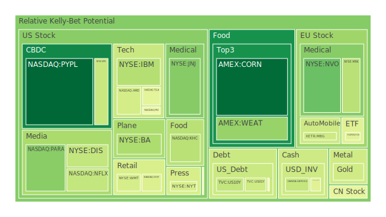
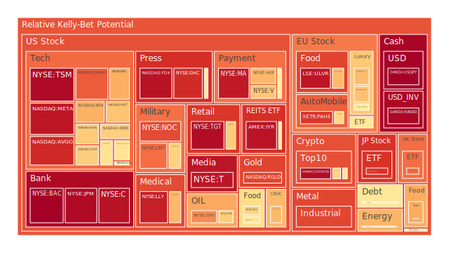
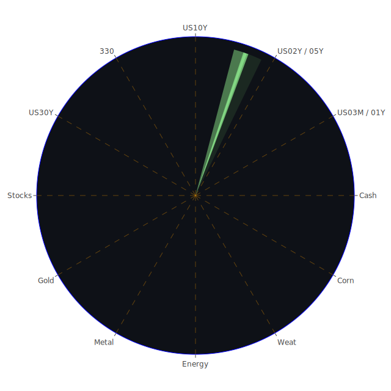

# **投資商品泡沫分析**

在當前的全球金融環境中，各種資產類別的價格動態與其內在風險之間的關係，呈現出極為複雜且多維度的樣貌。以下將針對各主要投資商品，進行深入的泡沫化程度與潛在風險剖析，旨在客觀呈現市場的自然現象，並從中導引出經過深思熟慮的觀察視角。

* **美國國債**

美國國債市場，作為全球金融體系的定價之錨，正處於一個微妙的平衡點。觀察數據顯示，十年期國債（US10Y）的殖利率在近期略有波動，但其短期泡沫指數相對偏低，顯示市場對其價格的共識度較高，或可解讀為避險情緒的體現。然而，更值得注意的是殖利率曲線的結構。10年期與3個月期國C的利差（10Y-03M）已從去年的深度倒掛轉為微幅正值（0.04），這在傳統經濟學理論中，被視為衰退風險降低的信號。

然而，我們必須從多個視角來解讀此現象。從**社會學**角度看，全球性的地緣政治動盪（如中東衝突加劇的新聞所示），促使國際資本湧入被認為是「最終避風港」的美國國債，人為地壓低了長天期殖利率，這扭曲了殖利率曲線的預測能力。從**心理學**角度分析，市場參與者可能在經歷了長期的倒掛後，產生了「警報疲勞」，對此信號的敏感度下降。**博弈論**的觀點則是，在聯準會（FED）釋出鷹派信號的背景下，債券交易員們正在進行一場複雜的博弈：一方面押注於聯準會因通膨頑固而必須維持高利率，另一方面又因潛在的經濟放緩（如商業地產與消費貸款違約率偏高所示）而預期未來終將降息。此種矛盾心態，使得短、中、長天期國債的泡沫指數呈現分歧，短天期國債（如US02Y、US01Y）的泡沫指數顯著高於長天期，反映了市場對於未來一年內政策路徑的高度不確定性。

* **美國零售股**

以Walmart（WMT）和Target（TGT）為代表的美國零售股，呈現出極高的泡沫化警訊。特別是TGT，其D1、D7至D30的泡沫分數持續處於0.97以上的高位，WMT的月平均泡沫分數也高達0.8以上。這現象的背後，存在著正反兩面的力量。

**正面（Thesis）**：從表面經濟數據看，這些零售巨頭的營收在通膨環境下似乎保持穩健，股價也隨之水漲船高。市場可能解讀為，即使在經濟壓力下，這些提供生活必需品的企業依然具有強大的定價能力與市場韌性。

**反面（Antithesis）**：然而，聯準會的數據明確指出「消費者貸款違約率處於相對高位」。這說明底層消費者的財務狀況正在惡化。高漲的股價與疲軟的消費者基礎之間形成了尖銳的矛盾。這種現象，或許可以用**社會學**的「K型復甦」來解釋：股市上漲的財富效應僅集中於少數高收入群體，他們維持了消費力；而廣大中低收入群體則面臨壓力，其消費降級的影響尚未完全反映在這些巨頭的總體財報中。從**心理學**角度看，投資者可能陷入了「追高」的慣性，忽略了基本面的警訊。

**綜合（Synthesis）**：零售股的高泡沫，是通膨數據、企業財報與真實消費者健康度三者脫鉤的產物。這是一個脆弱的結構，一旦通膨回落而消費者支出未能跟上，或者違約率進一步攀升，其估值將面臨嚴峻的修正壓力。新聞中提及的「貨運破產申請增加」，亦是供應鏈與實體經濟壓力的側面證明。

* **美國科技股**

科技股，特別是那斯達克100指數（NDX）及其成分股，是當前市場的核心驅動力，同時也是泡沫風險最集中的領域。微軟（MSFT）、蘋果（AAPL）、亞馬遜（AMZN）等巨頭的泡沫分數均處於中高水平，且呈現波動加劇的趨勢。

此處的三位一體，體現為「AI革命敘事」、「宏觀經濟逆風」與「市場資金流動」的互動。

**經濟學視角（Thesis）**：人工智慧（AI）無疑是推動這一輪牛市的核心敘事。投資者相信，AI將帶來堪比工業革命或網路革命的生產力飛躍，從而賦予相關企業極高的估值。這解釋了為何市場願意在聯準會鷹派立場和宏觀經濟數據疲軟的背景下，持續推高科技股。

**博弈論視角（Antithesis）**：然而，這是一場信念的博弈。每個參與者都相信別人會相信AI的故事，因此持續買入。歷史上，1990年代末的網路泡沫，亦有相似場景：一個革命性的技術敘事，吸引了大量資金，最終卻因獲利無法兌現而破滅。當前，儘管大型科技公司擁有穩健的現金流，但其估值已遠超歷史平均水平，這意味著它們需要實現近乎完美的增長，才能支撐現有股價。

**資金流動視角（Synthesis）**：一個不能忽視的現象是，全球資本的流動路徑。在歐洲經濟前景不明（可見法國FCHI、德國GDAXI指數的表現）、亞洲面臨自身結構性問題的背景下，美國科技股成為全球流動性的主要「蓄水池」。這解釋了為何即使聯準會收緊貨幣，科技股依然上漲。它不僅是美國國內的投資現象，更是一個全球性的資本避險與追逐成長的行為。然而，這種由資金流動驅動的上漲，其穩定性取決於全球宏觀環境的相對優劣，一旦其他地區出現更具吸引力的投資機會，或美國自身風險（如地緣政治）失控，資金可能迅速撤離。

* **美國房地地產指數**

美國房地產指數（VNQ、IYR）的泡沫指數極高，接近0.95的水平，這揭示了一個深刻的矛盾。一方面，聯準會數據顯示「商業地產違約率」和「房地產貸款違約率」均處於高位，30年期固定房貸利率也維持在6.81%的高點，這對房地產市場應是重大利空。另一方面，代表上市房地產投資信託（REITs）的指數卻處於高風險區域。

這可以用一種「分割市場」的理論來解釋。**Thesis**：受高利率衝擊最嚴重的是商業辦公樓和部分過度槓桿化的住宅項目，這反映在違約率上。**Antithesis**：然而，REITs的投資組合是多樣化的，可能包含了數據中心、物流倉儲、醫療保健設施等當前市場的熱門領域，這些子行業的需求（如AI對數據中心的需求）抵銷了傳統地產的頹勢。**Synthesis**：市場在對「房地產」這一籠統概念進行重新定價。投資者可能在拋棄舊的、受利率敏感的資產，同時瘋狂湧入被認為能受益於新經濟趨勢的新型地產資產。因此，高泡沫指數可能並非代表整個房地產市場的普遍繁榮，而是資金在板塊內部劇烈輪動和對特定「敘事」追捧的結果。Lennar公司超預期的季度營收報告，似乎也印證了在特定住宅市場領域（可能是供應緊張的地區）依然存在需求，但这更像是一個結構性亮點，而非全面復甦。

* **加密貨幣**

比特幣（BTCUSD）和以太坊（ETHUSD）的泡沫指數處於中等水平（約0.6），近期有所回落。這表明在經歷了前期的劇烈波動後，市場情緒趨於謹慎。加密貨幣市場的三位一體，是「技術革新」、「宏觀流動性」與「監管態度」的角力。

**心理學視角**：加密貨幣的投資者群體，在心理上呈現出兩極分化。一部分是堅定的技術信徒，將其視為對抗傳統金融體系通膨和審查的工具；另一部分則是純粹的投機者，被其高波動性所吸引。近期泡沫指數的平穩，可能意味著部分投機者的離場，市場正在尋找新的平衡點。

**宏觀流動性視角**：加密貨幣曾被認為是「數位黃金」，能在風險時期保值。然而，其價格走勢越來越表現出與高風險科技股的正相關性。這意味著，它更多地被視為一種對「未來流動性」的押注，而非當下的避險工具。在聯準會緊縮的環境下，其上行空間自然受到抑制。

**監管視角**：新聞中提到「摩根大通申請區塊鏈相關商標」，以及「Circle股價飆升」，這反映了傳統金融機構正在逐步介入這一領域。這既是利好（帶來合規性與資金），也是利空（可能帶來更嚴格的監管，並削弱其去中心化的初衷）。加密市場正處於從「蠻荒西部」向「合規化資產」過渡的十字路口，其間的不確定性抑制了極端泡沫的形成。

* **金/銀/銅**

貴金屬與工業金屬的表現呈現分化。黃金（XAUUSD）和白銀（XAGUSD）的價格處於歷史高位，其中白銀的泡沫指數（D1約0.94）顯著高於黃金（約0.41），顯示白銀的投機性更強。銅（FX:COPPER）的泡沫指數則處於中高水平（約0.6），反映了對未來工業需求的預期。

**歷史視角**：在歷史上，黃金通常在三種情況下表現優異：地緣政治危機、惡性通膨、以及對主權貨幣的信任危機。當前這三個條件似乎都部分滿足。中東衝突的新聞為黃金提供了地緣政治溢價；各國高懸的政府債務（如美國國債佔GDP比重處於高位）則侵蝕了人們對法定貨幣的長期信心。黃金的溫和泡沫指數表明，其上漲更多是基於避險需求的真實買盤，而非純粹投機。

**相對價格理論**：黃金/石油比率（Gold-Oil Ratio）和黃金/銅比率（Gold-Copper Ratio）提供了有趣的觀察視角。目前的黃金/石油比率（46.08）雖從上月高點回落，但仍處於歷史較高水平，這通常意味著市場對經濟前景的擔憂大於對通膨的擔憂。黃金相對於銅價的高昂，也暗示避險情緒壓倒了工業復甦的預期。

**白銀的雙重屬性**：白銀兼具貴金屬（避險）和工業金屬（如太陽能板、電動車）的雙重屬性。其極高的泡沫指數，可能源於投資者對這兩種敘事的雙重押注。這是一種高風險的疊加，如果工業需求未能兌現，或者避險情緒轉向黃金或美元，白銀的價格修正將會非常劇烈。

* **黃豆 / 小麥 / 玉米**

農產品市場呈現出波動和不確定性。小麥（WEAT）的泡沫指數在6月18日一度達到極值1.0，隨後回落，而玉米（CORN）和黃豆（SOYB）的泡沫指數則處於中等水平。

這反映了農產品市場對短期事件的高度敏感性。**Thesis**：供應鏈問題。地緣政治衝突（如中東局勢）雖然不直接影響美洲的種植，但會擾亂全球航運和能源價格，從而推高化肥和運輸成本。**Antithesis**：需求端的不確定性。在全球經濟可能放緩的預期下，大宗商品的需求前景並不明朗。**Synthesis**：氣候與政策的博弈。農產品的價格最終取決於天氣和主要出口國的貿易政策。小麥價格的短暫尖峰，可能就是對某個未在新聞中體現的供應鏈中斷或極端天氣預警的過度反應。這類資產的特點是，其基本面資訊不對稱性極高，容易引發基於傳聞的短線投機，導致泡沫指數的劇烈起伏。

* **石油/ 鈾期貨UX\!**

能源市場是當前地緣政治風險最直接的體現。石油（USOIL）的泡沫指數處於中高水平（D1約0.7），而鈾期貨（UX1\!）的泡沫指數則較為溫和（約0.5）。

**地緣政治博弈論**：中東衝突的每一條新聞，都在為油價這場複雜的博弈增添新的變數。市場參與者不僅要評估衝突的實際規模和對石油供應的直接影響（如霍爾木茲海峽的通行），還要猜測主要國家（美國、沙烏地阿拉伯、俄羅斯）的應對策略。當前中高的泡沫指數，反映了市場已將顯著的「戰爭溢價」計入價格，但尚未達到恐慌的程度。這是一種脆弱的平衡，任何一方的誤判都可能導致價格的劇烈波動。

**能源轉型敘事**：鈾的表現則處於另一條不同的邏輯線。在全球推動碳中和的背景下，核能作為一種穩定的清潔能源，其長期價值被重新評估。鈾價的穩定表現和溫和泡沫，反映了這是一種基於長期結構性轉變的價值投資，而非短期事件驅動的投機。它與石油之間，形成了一種新舊能源的對沖關係。

* **各國外匯市場**

外匯市場的數據揭示了全球資本流動的核心方向。美元兌日圓（USDJPY）的泡沫指數持續處於1.0的極高水平，而歐元兌美元（EURUSD）的泡沫指數也接近0.98。

這清晰地指向了一個方向：極度強勢的美元。**經濟學的三元悖論**在此得到體現：日本為了維持其寬鬆的貨幣政策以刺激經濟，不得不放棄匯率的穩定。而歐洲，則可能因其內部經濟的分化和地緣政治的鄰近風險，導致資本持續外流至美國。

**社會心理學**的「羊群效應」在此展露無遺。當一個趨勢（美元升值）形成後，無論其基本面是否完全支撐，出於對錯過趨勢的恐懼和對持有非美貨幣的風險規避，市場參與者會不斷自我強化這一趨勢。USDJPY的極端泡沫是一個警訊，表明這種單邊押注已經變得過於擁擠，任何日本央行的干預或美國經濟數據的意外轉向，都可能引發劇烈的逆轉。英鎊（GBPUSD）和澳幣（AUDUSD）相對溫和的泡沫指數，表明市場對這兩個經濟體的看法更為分化和不確定。

* **各國大盤指數**

各國股指的泡沫指數分化嚴重，反映了全球經濟的「K型」或多速復甦格局。美國那斯達克指數（NDX）風險較高，而中國滬深300指數（000300）的泡沫指數也處於高位，但其背後邏輯截然不同。歐洲的法國CAC40（FCHI）、德國DAX（GDAXI）和英國富時100（FTSE）則處於中等風險水平。

**美國（NDX, TWSE:0050/TSM）**：由AI科技股驅動，呈現出典型的敘事驅動型泡沫。台積電（TSM）作為AI產業鏈的核心，其極高的泡沫分數（接近0.98）是這一現象的縮影，並直接帶動了台灣加權指數（0050）的風險評級。

**中國（000300）**：其高泡沫指數可能並非來自於過熱的投機，而是一種「政策底」與「市場底」之間的博弈。在經濟數據疲軟的背景下，市場可能在押注政府將出台強有力的刺激政策。這種由政策預期支撐的估值，其基礎相對不穩，風險較高。

**歐洲（FCHI, GDAXI, FTSE）**：歐洲股指的溫和泡沫，反映了其經濟的複雜性。一方面，它們沒有美國那樣強勁的科技龍頭來驅動指數；另一方面，它們也面臨通膨、能源危機和地緣政治的多重壓力。奢侈品股（如RMS, MC, KER）的高泡沫是歐洲市場的一個結構性亮點，顯示全球富裕階層的消費力依然強勁，但這也加劇了市場的內部分化。

* **美國半導體股**

半導體是本輪市場週期的「震央」。輝達（NVDA）、超微（AMD）、博通（AVGO）、高通（QCOM）、台積電（TSM）、應用材料（AMAT）、科磊（KLAC）等，幾乎所有關鍵企業的泡沫指數都處於中高乃至極高水平。

這是一個典型的**正回饋循環**。**Thesis**：AI應用爆發，需要大量算力。**Antithesis**：算力需求推高了NVDA等公司的晶片訂單。**Synthesis**：NVDA的驚人業績和股價上漲，又進一步強化了市場對AI革命的信念，導致資金進一步湧入整個半導體產業鏈，從設計、製造到設備，無一例外。

**歷史類比**：這與19世紀的「淘金熱」有異曲同工之妙。在淘金熱中，最賺錢的不是絕大多數淘金者，而是賣鏟子和牛仔褲的人。在AI革命中，半導體公司就是「賣鏟子的人」。然而，任何淘金熱都有終點。風險在於：1. AI的實際應用和變現速度，能否跟上市場的無限預期？2. 供應鏈是否存在瓶頸，或者反過來，當所有廠商都瘋狂擴產後，是否會引發未來的產能過剩？3. 地緣政治風險（特別是涉及台灣的TSM）是否會中斷這條脆弱而關鍵的供應鏈？

* **美國銀行股**

摩根大通（JPM）、美國銀行（BAC）、花旗集團（C）等大型銀行股的泡沫指數處於極高區域（0.96以上），這與「商業地產高違約率」和「殖利率曲線平坦化」的宏觀背景形成了驚人的反差。

**博弈論的「大到不能倒」**：市場可能在玩一場經典的博弈。投資者似乎認為，儘管銀行面臨著商業地產貸款的潛在損失和淨息差收窄的壓力，但作為金融體系的支柱，它們「大到不能倒」。任何系統性危機的苗頭，都會引來聯準會或政府的救助。新聞中聯準會的數據顯示，儘管在縮表，但銀行準備金（FED Reserve）和政府支持企業（GSE）的資產規模依然處於高位，這可能被市場解讀為一種隱性的擔保。

**心理學的「風險忽視」**：在經歷了2023年的區域性銀行危機後，市場可能產生了一種心理上的鬆懈，認為最壞的時期已經過去，監管機構已經堵上了漏洞。這種心理，使得投資者願意忽視潛在的、正在發酵的信貸風險。銀行股的高泡沫，是對系統韌性的一種極度樂觀的押注，其風險不容小覷。

* **美國軍工股**

洛克希德·馬丁（LMT）、諾斯洛普·格魯曼（NOC）、雷神技術（RTX）等軍工股的泡沫指數在中高位徘徊，且隨著地緣政治新聞的發酵而波動。

這是最純粹的**地緣政治驅動型資產**。其價格的三位一體，是「國際衝突」、「國防預算」和「全球軍備競賽」的直接反映。

Thesis (新聞事件)：中東衝突升級的新聞，直接推升了對導彈、防空系統和戰鬥機的需求預期。  
Antithesis (財政壓力)：然而，美國及其他西方國家均面臨高額的政府債務。無限追加的國防開支，是否可持續？這是一個長期的制約因素。  
Synthesis (全球格局)：當前的綜合態勢是，全球正在從過去數十年的「和平紅利」時代，轉向一個多極對抗的「新冷戰」格局。在這種宏觀背景下，國防開支的增加可能成為一種結構性趨勢，而非短期現象。軍工股的估值，正是在反映這種長期的典範轉移。其風險在於，任何意外的和平協議或衝突降級，都會導致其「戰爭溢價」的迅速消失。

* **美國電子支付股**

Visa（V）、萬事達卡（MA）、美國運通（AXP）、PayPal（PYPL）等電子支付公司，呈現出內部分化。V、MA、AXP的泡沫指數相當高，而PYPL則相對較低。

**社會結構變遷**：這些公司是全球消費從現金轉向電子的長期趨勢的受益者。V和MA作為支付網絡的「軌道」提供商，具有天然的壟斷優勢和網絡效應，其高估值反映了這種穩固的市場地位。AXP則聚焦於高收入客戶，其表現與奢侈品和高端消費市場息息相關。

**技術顛覆的博弈**：PYPL的相對弱勢，則反映了市場對其未來競爭力的擔憂。在「先買後付」（BNPL）、加密貨幣支付、以及銀行自有支付系統（如Zelle）的多重夾擊下，PYPL的護城河正在受到侵蝕。這一板塊的內部差異，生動地展示了**創新者的窘境**：昔日的顛覆者，正在成為被顛覆的對象。市場正在對「支付」這一行為的未來形態進行投票，傳統網絡的價值依然穩固，而早期的線上支付先驅則面臨壓力。

* **美國藥商股**

大型藥廠如嬌生（JNJ）、默克（MRK）、艾伯維（ABBV）、禮來（LLY）、諾和諾德（NVO）等，表現各異。其中，LLY和NVO的泡沫指數尤為突出。

**人口結構與醫療創新**：製藥行業的長期驅動因素是全球人口老齡化和醫療技術的突破。JNJ、MRK等傳統藥廠，業務多元，增長穩健，其泡沫指數也相對溫和，具有防禦屬性。

**爆款藥品的敘事**：LLY和NVO的極高泡沫，則完全是由於其在減肥藥和糖尿病領域的革命性產品（GLP-1藥物）所驅動。這與半導體領域的AI敘事如出一轍，是一個由單一爆款產品線驅動的極端估值案例。市場預期這些藥物將帶來數千億美元的銷售額，並對食品、飲料甚至航空業（因乘客體重下降）產生深遠的連鎖反應。

**風險**：這種押注的風險同樣巨大。1. 藥物副作用的未知風險。2. 競爭對手推出效果更好或成本更低的同類藥物。3. 各國政府或保險公司出於成本考慮而限制其使用。這是一個贏家通吃的市場，但也意味著一旦領先地位發生動搖，股價將面E臨雪崩式的下跌。

* **美國影視股**

派拉蒙（PARA）、迪士尼（DIS）等傳統影視媒體公司，處於轉型的陣痛期，泡沫指數中等偏高，且波動劇烈。

**商業模式的顛覆**：這些公司正處於從線性電視和電影院線向串流媒體轉型的艱難過程中。**Thesis**：它們擁有寶貴的IP（智慧財產權）庫。**Antithesis**：串流媒體業務需要鉅額的內容投資，且競爭激烈（對手如Netflix），盈利能力至今仍不穩定。

**博弈論的併購預期**：PARA的價格波動，很大程度上是受到市場對其可能被收購的猜測所驅動。投資者不再僅僅根據其自身的基本面進行估值，而是在博弈它最終會賣給哪家科技巨頭或私募股權公司。這使得其股價脫離了內在價值，成為一個純粹的事件驅動型交易標的。DIS的情況類似，市場在觀察其串流業務能否成功盈利，以及傳統業務（如主題公園）能否抵禦經濟放緩的衝擊。

* **美國媒體股**

紐約時報（NYT）、福斯（FOX）等媒體股的泡沫指數處於高位。這在全球媒體行業普遍面臨挑戰的背景下，顯得有些反常。

**社會學的「後真相時代」**：在一個社會日益兩極分化的時代，擁有穩定受眾和清晰立場的媒體品牌，反而具有了更強的定價能力。它們販賣的不僅僅是新聞，更是一種身份認同和社群歸屬感。NYT代表了自由派精英的視角，而FOX則迎合了保守派觀眾。

**心理學的「資訊繭房」**：人們越來越傾向於只消費自己認同的觀點，這加強了這些頭部媒體品牌的護城河。其高泡沫指數，可能反映了市場認識到，在混亂的資訊環境中，「信任」或「品牌忠誠度」本身就是一種可以變現的稀缺資產。然而，這種商業模式也極易受到政治風向和社會情緒變化的影響。

* **石油防禦股 / 金礦防禦股**

埃克森美孚（XOM）、西方石油（OXY）等石油股，以及Royal Gold（RGLD）等金礦股，其泡沫指數均處於極高水平。

這兩類資產通常被視為「防禦股」，但在當前的數據中，它們的風險讀數反而最高。這揭示了「防禦」概念的演變。

**傳統防禦 vs. 新型防禦**：傳統的防禦股通常指消費必需品、公用事業等。但在一個地緣政治風險和通膨預期高漲的時代，能夠直接受益於這些風險的資產——即能源和黃金生產商——反而成為了新的「防禦」標的。投資者買入它們，不是為了防禦經濟衰退，而是為了**防禦混亂與通膨**。

**對沖基金的視角**：這是一種基於宏觀對沖策略的交易。當市場預期衝突和物價上漲時，做多這些股票成為一種主流策略。其極高的泡沫指數，表明這種交易已經變得非常擁擠。它們的風險在於，其股價與石油/黃金的商品價格高度相關，一旦商品價格因需求崩潰或風險緩解而下跌，這些股票的跌幅將會更大。

* **歐洲奢侈品股 / 汽車股**

路威酩軒（MC）、開雲（KER）、愛馬仕（RMS）等奢侈品股的泡沫指數居高不下，而寶馬（BMW）、賓士（MBG）、保時捷（PAH3）等汽車股的泡沫指數則波動較大，整體偏高。

**社會學的財富分化**：奢侈品股的強勢，是全球K型復甦最直接的證據。無論宏觀經濟如何波動，全球頂層財富的增長似乎並未受到影響，他們對奢侈品的需求依然旺盛。這些公司服務的是全球最頂尖的1%客戶，使其能夠在很大程度上免疫於普通消費者的經濟壓力。

**工業轉型的挑戰**：歐洲汽車股則面臨更複雜的局面。它們正處於從燃油車向電動車轉型的痛苦過程中。**Thesis**：它們擁有強大的品牌和製造工藝。**Antithesis**：在電動化和智能化方面，它們面臨著來自特斯拉（TSLA）和中國製造商的激烈競爭。其高泡沫指數，可能部分反映了市場對其成功轉型的樂觀預期，但其中也包含了巨大的不確定性。保時捷的高泡沫，更體現了其作為「奢侈品」而非普通汽車的屬性。

* **歐美食品股**

可口可樂（KO）、卡夫亨氏（KHC）、雀巢（NESN）、聯合利華（ULVR）等食品飲料巨頭，其泡沫指數普遍處於中高至極高水平。

**通膨的受益者與受害者**：在通膨初期，這些公司可以憑藉其品牌優勢，將成本上漲轉嫁給消費者，從而推高名目營收和利潤，股價也隨之上漲。這解釋了它們在過去一段時間的強勢表現。

**需求的極限**：然而，這種策略存在極限。當消費者實際收入下降，或對持續的價格上漲感到厭倦時，他們會開始尋找更便宜的替代品（消費降級）。這些公司的高泡沫，正是在測試這個極限。它們的未來表現，取決於通膨的走勢與消費者信心的微妙平衡。如果通膨頑固，而經濟陷入停滯（即「滯脹」），它們的銷量和利潤率將面臨雙重壓力。ULVR和NESN等歐洲公司的極高泡沫分數，也可能疊加了歐洲資本尋求「類債券」穩定現金流資產的因素。

# **宏觀經濟傳導路徑分析**

當前的宏觀經濟環境，如同一部由多個齒輪精密咬合，卻又互為掣肘的複雜機器。其傳導路徑並非線性，而是呈現出多條相互交織的漣漪效應。

**路徑一：地緣政治衝突 → 能源價格 → 全球通膨 → 央行政策 → 金融市場**

此為當前最清晰、影響最廣泛的傳導路徑。中東衝突的新聞（負面影響高達96%），是這條路徑的起點。

1. **衝突升級**直接推高石油（USOIL）價格。這不僅是供應中斷的風險，更是風險溢價的體現。  
2. **能源價格上漲**會迅速傳導至全球的生產和運輸成本，引發或加劇消費者物價指數（CPI）的上漲。當前的CPI（2.40%）雖較去年有所回落，但油價的再次飆升可能使其掉頭向上。  
3. **通膨壓力**將迫使以聯準會為首的各國央行維持鷹派立場。數據顯示聯準會近期有兩次鷹派發言，且持續縮減資產負債表。這意味著高利率環境將維持更長時間。  
4. **持續的高利率**會對整個金融市場產生抑制作用。它會壓低債券價格（殖利率上升），增加企業的借貸成本，並通過貼現率模型降低成長型股票（特別是科技股）的估值。同時，高利率也會加劇房地產市場的壓力，推高違約率。  
5. 最終，這條路徑的終點可能是\*\*「滯脹」\*\*——經濟增長停滯，而通膨居高不下。在這種情景下，股、債、房地產等傳統資產可能同時下跌，只有黃金（XAUUSD）和部分與衝突直接相關的軍工股（NOC, RTX）可能受益。

**路徑二：美國資本磁吸效應 → 強勢美元 → 全球失衡 → 風險回饋**

這是一條由資本流動主導的傳導路徑。

1. **美國的相對優勢**：在AI革命的引領下，美國科技股提供了全球獨一無二的成長故事。同時，美國國債市場的深度和廣度，使其在動盪時期成為資本的天然避風港。這兩者共同作用，形成了強大的「資本磁吸」效應。聯準會數據顯示，外國機構持有的美國國債數量處於高位，便是明證。  
2. **極端強勢的美元**：資本的大量流入，直接推高了美元匯率。USDJPY的泡沫指數達到極值，EURUSD也極度弱勢，這都是美元強勢的後果。  
3. **全球經濟失衡**：強勢美元對世界其他經濟體構成壓力。它加重了新興市場的美元債務負擔，導致輸入性通膨，並可能引發資本外逃和金融不穩定。日本和歐洲等已開發經濟體，也因本幣貶值而面臨挑戰。  
4. **風險回饋**：這種失衡本身孕育著風險。首先，過於強勢的美元會損害美國出口企業的競爭力。其次，如果全球其他地區因美元過強而陷入深度衰退，將會反過來衝擊美國企業的海外收入和全球供應鏈的穩定性。最後，極度擁擠的美元多頭交易，一旦反轉，將引發劇烈的市場動盪。這是一場全球性的懦夫博弈，沒有人願意先承受本幣升值的陣痛，但持續的失衡最終會讓系統變得脆弱不堪。

# **微觀經濟傳導路徑分析**

在宏觀背景之下，企業與行業層面的微觀傳導路徑同樣值得關注。

**路徑一：AI算力需求 → 半導體榮景 → 科技巨頭壟斷 → 市場集中度風險**

這是一條由技術創新驅動的內部傳導路徑。

1. **AI應用**（如大型語言模型）的爆發，創造了對高階計算晶片（GPU）前所未有的需求。  
2. **需求直接引爆了半導體產業**。輝達（NVDA）的業績和股價一飛沖天，並將這股熱潮傳導至整個產業鏈：上游的晶圓代工廠台積電（TSM），設備製造商應用材料（AMAT）和科磊（KLAC），以及其他晶片設計公司如博通（AVGO）和超微（AMD）。  
3. **科技巨頭的壟斷加劇**：只有像微軟（MSFT）、谷歌（GOOG）、Meta（META）這樣財力雄厚的公司，才有能力採購天價的AI晶片並建立自己的模型。這進一步鞏固了它們在市場上的主導地位。  
4. **市場集中度風險**：最終，整個股市的上漲越來越依賴於這少數幾家科技和半導體巨頭的表現。那斯達克指數（NDX）的命運與它們的股價緊密相連。這種極高的集中度意味著，一旦這個核心引擎熄火（無論是因技術瓶頸、需求放緩還是監管打壓），整個市場都將面臨劇烈的回調風險。

**路徑二：高利率環境 → 企業/個人信貸壓力 → 違約率上升 → 銀行系統潛在風險**

這是一條潛伏在繁榮表面之下的風險傳導路徑。

1. **聯準會維持高利率**，旨在抑制通膨，但這也大幅提高了企業和個人的融資成本。  
2. **信貸壓力浮現**：數據顯示，商業地產、消費者貸款和一般房地產的違約率都處於「相對高位」。新聞中「貨運破產申請增加」也是企業壓力的佐證。  
3. **銀行資產品質惡化**：作為主要的信貸提供方，銀行的資產負債表正受到這些違約事件的侵蝕。儘管其一級資本充足率可能依然穩健，但未實現的損失和未來可能發生的壞帳正在累積。  
4. **潛在的金融風險**：儘管大型銀行股（JPM, BAC）的泡沫指數極高，看似市場毫無懼色，但這恰恰是最大的風險所在。市場可能過於相信「大到不能倒」的邏輯，而忽視了信貸風險的持續累積。一旦某個領域（如商業地產）的危機全面爆發，其傳染效應可能超出預期，引發對整個銀行系統信心的動搖。

# **資產類別間傳導路徑分析**

不同資產類別之間的傳統關係正在被打破，新的傳導路徑正在形成。

**路徑一：股債關係的重構——從負相關到正相關**

傳統投資組合理論的核心是股債之間的負相關性。然而，在當前的「高通膨、高利率」環境下，這一關係變得不可靠。

* **情境A（通膨驅動的風險）**：如果風險來自於地緣政治導致的油價上漲和通膨重燃，那麼聯準會將被迫更加鷹派。在這種情況下，更高的利率預期會同時打壓股票（更高的貼現率）和債券（價格下跌），導致股債雙殺。  
* **情境B（衰退驅動的風險）**：如果風險來自於經濟突然的硬著陸（如信貸危機爆發），那麼市場會預期聯準會迅速降息。在這種情況下，債券價格會上漲，而股票會因企業盈利崩潰而下跌，恢復傳統的負相關性。

當前市場正處於這兩種情境的模糊地帶，導致股債關係極不穩定。美國10年期國債（US10Y）的低泡沫指數和那斯達克（NDX）的高泡沫指數並存，本身就是這種不確定性的體現。投資者既擔心通膨，又對AI驅動的增長抱有幻想。

**路徑二：避險資產的內部競爭——黃金 vs. 美元 vs. 比特幣**

在不確定的世界中，避險資產的選擇也變得複雜。

* **黃金（XAUUSD）**：作為數千年歷史的傳統避險工具，黃金受益於地緣政治風險和對法定貨幣的長期不信任。其溫和的泡沫指數表明買盤相對理性。  
* **美元（以USDJPY為代表）**：憑藉美國經濟的相對韌性和作為全球儲備貨幣的地位，美元在高利率環境下成為「套息交易」和避險的首選，表現出極強的勢頭。  
* **比特幣（BTCUSD）**：儘管有「數位黃金」之稱，但其表現越來越像一種高貝塔值的風險資產，與科技股走勢同步。它更多地是對未來技術範式和流動性寬鬆的押注，而非當下的避險工具。

這三者之間存在著競爭關係。在流動性極度緊張的危機時刻，美元往往是最終的贏家（現金為王）。在滯脹和地緣政治衝突的環境下，黃金可能表現最好。而比特幣則需要在市場風險偏好回歸時，才能展現其潛力。它們之間的相對強弱，是判斷市場處於何種宏觀情境下的重要指標。

# **投資建議**

基於上述分析，我們必須承認當前市場的極端複雜性和脆弱性。任何單一的押注都面臨巨大風險。因此，資產配置的核心思想應該是**結構性對沖**與**多元化**，尋找不同宏觀情境下的受益者，並構建能夠抵禦非對稱風險的投資組合。

以下提供三種不同風險偏好的配置建議，總比例為100%，旨在當前環境下實現最佳化。

**一、 穩健型投資組合 (總計 40%)**

此組合旨在最大限度地保全資本，並在市場動盪中尋求穩定回報。核心邏輯是防範「滯脹」和「地緣政治」風險。

1. **短期美國國債 (例如 US01Y 的概念) \- 20%**: 在高利率環境下，持有短期國債可以獲得相對可觀且低風險的票息收入，同時避免了長久期債券在利率繼續上升時的價格損失。它是投資組合的現金等價物和穩定器。  
2. **黃金 (XAUUSD) \- 15%**: 作為對沖地緣政治風險、通膨失控以及對主權信用懷疑的終極工具。其與主流股債市場的低相關性，可以在市場劇烈波動時提供保護。  
3. **大型防禦性製藥股 (例如 JNJ) \- 5%**: 選擇像嬌生這樣業務多元、現金流穩定、且泡沫指數相對較低的醫療保健龍頭。其產品需求不受經濟週期影響，可以在經濟放緩時提供穩定的股息和資本增長。

**二、 成長型投資組合 (總計 45%)**

此組合旨在捕捉市場的核心增長趨勢，同時通過行業和地域的分散來管理風險。

1. **核心科技龍頭 (例如 MSFT) \- 20%**: 投資於AI革命的核心受益者和推動者。選擇像微軟這樣擁有強大平台、多元化業務和穩健財務狀況的公司，而非純粹的硬體製造商，以平衡成長性與穩定性。其高泡沫分數是風險，但也反映了其市場領導地位。  
2. **全球化食品與消費品巨頭 (例如 NESN) \- 15%**: 選擇像雀巢這樣地域和產品線都高度分散的全球性公司。這不僅可以對沖單一國家（如美國）的經濟風險，其必需消費品的屬性也提供了防禦性。其高泡沫分數需要警惕，但反映了市場對穩定現金流的追捧。  
3. **鈾期貨 (COMEX:UX1\!) 或相關生產商 \- 10%**: 這是一項針對長期能源結構轉型的逆向投資。在全球去碳化趨勢下，核能的價值將被重估。它與化石能源（石油）和主流科技股的相關性較低，可以提供獨特的多元化效益。其泡沫指數相對溫和，表明尚未被過度炒作。

**三、 高風險投資組合 (總計 15%)**

此組合旨在通過承擔較高風險，博取超額回報。每個子項目都代表了一種對特定事件或趨勢的投機性押注。

1. **一線半導體製造商 (例如 TSM) \- 7%**: 這是對AI軍備競賽持續的最直接、最高風險的押注。台積電在先進製程上的壟斷地位使其成為不可或缺的一環。其極高的泡沫指數和地緣政治風險是需要面對的現實，但其潛在回報也相當可觀。  
2. **頂級軍工承包商 (例如 NOC) \- 5%**: 押注於全球地緣政治緊張局勢的持續或升級。諾斯洛普·格魯曼在隱形轟炸機、無人機和太空技術等領域的領先地位，使其在「新冷戰」格局下具有獨特的增長潛力。  
3. **歐洲頂級奢侈品牌 (例如 KER 或 RMS) \- 3%**: 這是對全球財富持續分化，頂層消費不受影響的押注。開雲集團或愛馬仕等品牌擁有極強的定價能力和品牌護城河。其極高的泡沫指數反映了這種交易的擁擠程度，但只要全球財富金字塔的結構不變，其基本面就依然穩固。

# **風險提示**

投資有風險，市場總是充滿不確定性。我們的建議僅供參考，投資者應根據自身的風險承受能力和投資目標，做出獨立的投資決策。本報告基於特定時間點的數據和新聞進行分析，市場情況瞬息萬變。數據中揭示的高泡沫分數資產，意味著其價格已嚴重偏離傳統估值指標，存在劇烈回調的風險。特別是那些由單一敘事（如AI、減肥藥）驅動的資產，以及與地緣政治高度相關的資產，其波動性可能遠超預期。投資者在做出任何決策前，應進行充分的研究和盡職調查。

 
Daily Buy Map:

 
Daily Sell Map:

 
Daily Radar Chart:

 
