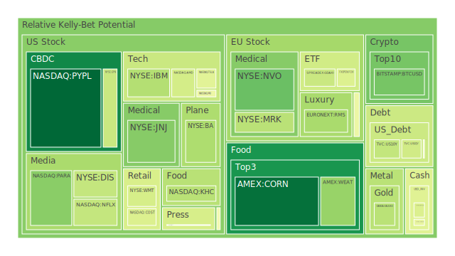
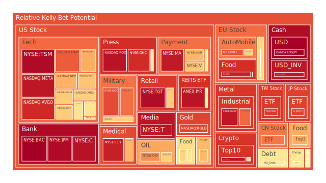
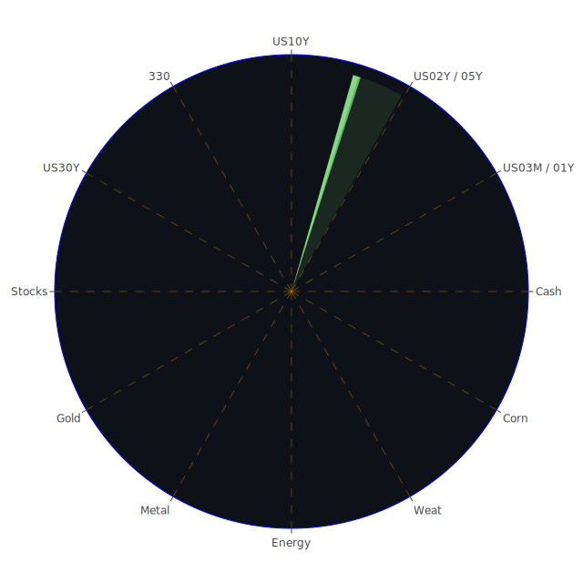

# **投資商品泡沫分析**

在當前錯綜複雜的全球金融環境中，各類資產的價格波動與潛在風險呈現出前所未有的多樣性。我們將深入剖析各大類資產的現狀，旨在揭示其內在的動能與潛藏的泡沫風險。此處的風險評估，並非簡單的漲跌預測，而是對資產價格相對於其內在價值與市場情緒的偏離程度進行的量化觀察。

* 美國國債  
  美國國債市場，作為全球金融的定價之錨，正處於一個微妙的平衡點。觀察數據顯示，短期國債（如一年期 US01Y）與長期國C（如十年期 US10Y、三十年期 US30Y）的風險結構成現分化。短期國債的風險分數相對溫和，但中期（如二年期 US02Y）的月度風險指標卻異常穩定地處於中高水平，這反映出市場對於未來一兩年內聯準會政策路徑的高度不確定性。從時間序列上看，殖利率曲線（例如十年期與三個月期 10Y-03M）從去年的深度倒掛（-1.30）回升至目前的微幅正值（0.04），這在歷史上常被解讀為經濟衰退風險的緩和，或即將步入衰退的最後階段。  
  然而，從博弈論的角度看，這更像是一場聯準會與市場之間的膽小鬼遊戲。聯準會的鷹派發言試圖管理市場的降息預期，而市場則不斷透過定價來測試聯準會的底線。社會學層面，新聞中提及的「外國對美國國債需求出現裂痕」是個危險信號。過去，美國國債作為全球性的安全資產，其地位不容置疑。如今，地緣政治的割裂（如G7內部分歧、中美緊張關係）正從根本上動搖這一信任基礎，這可能導致未來美國發行國債的成本被動抬升。心理學上，投資者對「長期通膨」的恐懼與對「經濟硬著陸」的擔憂相互交織，使得長期國債的定價極其困難，其風險分數在不同週期內波動，正體現了這種矛盾心態。  
* 美國零售股  
  零售股是觀測消費景氣的櫥窗。諸如沃爾瑪（WMT）、好市多（COST）與塔吉特（TGT）等巨頭，其月度平均風險分數普遍偏高，塔吉特的風險指標更是接近極值。這構成了一個顯著的矛盾體：一方面，它們作為必需消費品通路，應具備防禦性；另一方面，高漲的風險分數暗示其估值可能已充分計入了這種預期，甚至可能過度。  
  從經濟學角度看，這是「K型復甦」的體現。高收入群體依然消費旺盛，支撐了好市多等高端零售的業績，但更廣泛的消費者數據（如消費者拖欠率上升）則預示著以中低端客群為主的零售商（如沃爾瑪、塔吉特）將面臨巨大壓力。歷史上，在經濟下行週期初期，零售股往往因其「現金牛」特性而受到追捧，但當衰退真正深化時，銷售額的下滑會迅速侵蝕利潤，導致股價崩潰。當前的高風險讀數，或許正是市場對此歷史劇本重演的擔憂。新聞中亞馬遜等公司因應AI發展而預期裁減員工，這對整體就業市場和消費信心構成了潛在的負面衝擊，零售股首當其衝。  
* 美國科技股  
  科技股，特別是大型權值股，無疑是當前市場的核心。微軟（MSFT）、亞馬遜（AMZN）、蘋果（AAPL）、Meta（META）等公司的風險分數持續在高位徘徊。這是一個典型的「正向循環」與「泡沫化」並存的局面。  
  正方（Thesis），從經濟學概念出發，AI革命被視為新一輪的「生產力革命」，類似於網路時代的開啟。市場正在為這些掌握核心技術與數據的公司賦予極高的「期權價值」。其高估值是對未來壟斷性利潤的折現。新聞中亞馬遜CEO提及AI將重塑勞動力，這正是生產力提升的微觀體現。  
  反方（Antithesis），從心理學角度看，這是一場由「敘事驅動」的投機狂潮。投資者普遍存在FOMO（錯失恐懼症），忽略了宏觀經濟的警訊（如企業裁員、消費信貸惡化）。歷史上，1999-2000年的網路泡沫，當時的敘事是「點擊量代表一切」，最終泡沫破裂證明了現金流與利潤的重要性。如今，「AI」是否會成為下一個華麗但脆弱的敘事？新聞中Google Gemini在玩遊戲時出現混亂，暗示了當前AI技術在實際應用中仍有其侷限性與脆弱性。  
  合方（Synthesis），市場呈現出顯著的「二元性」。資金高度集中於少數AI巨頭，形成估值堰塞湖，而廣泛的非AI相關科技股，甚至是一些過去的明星股（如PYPL），則估值低迷，風險分數極低。這種極端的市場分化本身就是一種風險。其傳導路徑可能是：AI敘事一旦出現動搖（例如技術瓶頸、監管收緊），資金將從高估值的AI股中恐慌性撤出，由於市場缺乏其他有吸引力的標的，可能引發流動性危機，進而衝擊整個市場。  
* 美國房地地產指數  
  美國房地產指數（VNQ, IYR, RWO）的風險指標呈現出令人不安的穩定高位，特別是 IYR 的各週期風險分數均超過0.95，顯示出極高的脆弱性。這與FED經濟數據中「商業地產拖欠率處於相對高位」的觀察相互印證。  
  從社會學角度分析，遠距工作的普及化永久性地改變了城市商業中心的生態，商辦空置率的結構性上升是難以逆轉的趨勢。這對商業地產REITs構成了長期利空。歷史上，房地產危機往往是金融風暴的導火線，例如2008年的次貸危機。當時的起點是住宅地產，而現在的壓力點轉移到了商業地產。三十年期固定抵押貸款利率（Fixed Morgage 30Y Rate）高達6.81%，較之去年的3.02%已不可同日而語，這對住宅和商業地產的再融資和新投資都構成了沉重打擊。博弈論視角下，持有大量商業地產貸款的區域性銀行、保險公司與房地產基金之間，正在進行一場「誰先眨眼」的博-弈。無人願意率先大幅減記資產價值，因為這可能觸發連鎖性的保證金追繳和資產拋售。這種僵局使得風險不斷累積，一旦某個環節失守，可能引發劇烈的去槓桿過程。  
* 加密貨幣  
  比特幣（BTCUSD）和以太幣（ETHUSD）的風險動態呈現出從中期恐慌向短期穩定的過渡。其風險分數在6月18日一度較高，隨後幾天有所回落。這反映了加密貨幣市場的高度事件驅動特性。新聞中「參議院通過穩定幣法案」和「Coinbase尋求提供區塊鏈股票交易」是重要的積極催化劑，它們為加密貨產的合規化與主流化提供了想像空間，屬於概念上的「正方」論述。  
  然而，其「反方」在於，加密貨幣依然與高風險科技股的走勢高度相關。在宏觀流動性收緊的環境下，它很難走出獨立行情。聯準會的鷹派立場和全球風險趨避情緒的上升，都是其上行的阻力。其「合方」在於，加密貨幣正在分化。比特幣越來越呈現出「數位黃金」的避險屬性，而以太坊則更像是一個去中心化應用的「科技平台」。狗狗幣（DOGEUSD）的極高風險分數則代表了市場中純粹的投機力量，其走勢與前兩者分化，更多地受到社群情緒和名人效應的影響，缺乏基本面支撐。  
* 金/銀/銅  
  貴金屬與工業金屬的表現出現分化。黃金（XAUUSD）與白銀（XAGUSD）的風險指數處於截然不同的水平。黃金的風險分數溫和，在中高檔區間波動，反映其作為避險資產的穩定需求。白銀的風險分數則極高，特別是近期數據逼近滿分，顯示出強烈的投機交易活動。銅（FX:COPPER）的風險分數則從高位回落，顯示市場對全球工業活動前景的擔憂正在加劇。  
  從相對價格關係看，黃金/石油比率（GOLD OIL RATIO）從上月的53.19降至45.54，顯示相對於黃金，石油的價格在走強，這通常與地緣政治風險升溫有關。黃金/銅比率（GOLD COPPER RATIO）則維持在高位，這是一個經典的經濟衰退信號，即避險需求（黃金）遠大於工業需求（銅）。白銀兼具貴金屬和工業金屬的雙重屬性，其價格波動性遠大於黃金。當前極高的風險分數，可能是投機者在賭注未來工業需求（特別是綠色能源，如太陽能板）復甦的同時，疊加了貨幣金屬的抗通膨敘事。然而，一旦經濟衰退的擔憂壓倒一切，白銀的工業屬性將使其受到比黃金更沉重的打擊。  
* 黃豆 / 小麥 / 玉米  
  農產品市場的風險指標出現了有趣的變化。小麥（WEAT）在6月18日出現了瞬時的極高風險讀數（D1為1.0），隨後迅速回落，這通常與突發的供應中斷擔憂或大量的期貨平倉有關。玉米（CORN）和黃豆（SOYB）的風險分數則相對較低或處於中等水平，但呈現上升趨勢。  
  從社會學角度看，糧食安全是各國政府的重中之重。新聞中日本因禽流感暫停從巴西進口雞蛋，就體現了全球食品供應鏈的脆弱性。任何地緣政治衝突（如俄烏戰爭影響黑海穀物出口）或極端天氣事件，都可能迅速點燃農產品價格。心理學上，對食品通膨的擔憂根植於每個人的日常生活，使其價格預期容易產生自我實現的循環。目前溫和的風險分數，可能並未完全反映全球供應鏈在地緣政治緊張局勢下面臨的長期風險。  
* 石油/ 鈾期貨UX\!  
  能源市場是地緣政治最直接的反應器。石油（USOIL）的風險分數在中高位，且短期風險（D7）高於長期風險（D30），顯示近期市場對供應的擔憂加劇。新聞中中東緊張局勢升級（美、以、伊關係）、利比亞石油出口可能受阻，以及索馬利蘭在美國石油政策中戰略地位的提升，都為油價提供了上漲動能。鈾期貨（UX1\!）的風險分數也處於中等偏高水平，這與全球能源轉型和能源獨立的長期敘事有關。在俄羅斯能源被部分禁運的背景下，核能作為穩定、低碳的基載電力來源，其戰略價值被重估。  
  從博弈論角度分析，OPEC+的減產協議、美國的戰略儲備釋放、以及非OPEC國家的產能增長，構成了一個多方參與的複雜博弈。任何一方的誤判都可能導致油價的劇烈波動。鈾市場則更為寡頭壟  
  斷，供應端的任何風吹草動（如主要生產國的政治動盪）都會對價格產生巨大影響。  
* 各國外匯市場  
  外匯市場是宏觀經濟預期的交匯點。美元/日圓（USDJPY）的風險分數極高且持續，顯示市場在進行一場豪賭。一方面，美日之間的巨大利差為套利交易提供了燃料，不斷推高匯率。另一方面，如此高的偏離度也讓市場對日本央行的干預充滿警惕。這是一場典型的「趨勢跟隨」與「反轉博弈」的較量。歐元/美元（EURUSD）的風險分數同樣處於極高水平，反映出市場對歐美經濟體貨幣政策分歧的定價已達極致。英鎊/美元（GBPUSD）的風險則相對溫和，但澳元/美元（AUDUSD）的風險分數較低，顯示市場對與中國經濟關聯度較高的商品貨幣持謹慎態度。  
* 各國大盤指數  
  全球主要股指表現分化，反映出「空間三位一體」中的割裂。美國那斯達克指數（NDX）風險分數高企，是AI狂熱的中心。而中國滬深300指數（000300）的長期風險分數（D30）同樣很高，但其驅動邏輯截然不同，更多是基於對經濟刺激政策的預期與房地產危機尚未出清的擔憂之間的拉鋸。日本日經225指數（JPN225）的風險分數極高，反映了在擺脫數十年通縮後，企業治理改革和外資流入帶來的樂觀情緒，但也潛藏著日圓劇烈波動可能引發的風險。歐洲方面，德國（GDAXI）和法國（FCHI）指數風險分數中等偏高，英國（FTSE）也類似，它們共同面臨能源成本、烏克蘭戰爭外溢效應和自身經濟結構轉型的挑戰。  
* 美國半導體股  
  半導體行業是本輪AI敘事的「軍火商」。輝達（NVDA）、超微（AMD）、博通（AVGO）、台積電（TSM）、應用材料（AMAT）等公司的風險分數普遍處於高位或極高位。AVGO 和 TSM 的月度風險指標均非常高，顯示這場狂熱已持續一段時間。  
  這裡存在一個經典的「正反合」結構。正方：AI晶片的需求是真實且巨大的，這些公司處於價值鏈的頂端，擁有定價權。反方：歷史上的「晶片週期」極為殘酷。一旦需求放緩或新的競爭者出現（例如大型雲端服務商自研晶片），供給過剩會導致價格雪崩。新聞中，中國在半導體領域的困境與努力，以及中美之間的科技戰，都為全球半導體供應鏈的未來增添了巨大的不確定性。合方：半導體行業的估值已經「武器化」，其股價不僅反映了商業前景，也反映了國家的科技實力與戰略安全。因此，其價格波動會異常劇烈，受到地緣政治新聞的直接影響。  
* 美國銀行股  
  銀行股，如美國銀行（BAC）、摩根大通（JPM）、花旗（C）的風險分數普遍極高。這是一個極具警示意義的信號。在一個看似繁榮的股市中，金融系統的核心——大型銀行的風險指標卻亮起紅燈。  
  其內在矛盾在於：一方面，利率上升擴大了銀行的淨息差，有利於利潤。另一方面，經濟數據中攀升的商業地產和消費者信貸拖欠率，以及聯準會縮表導致的準備金下降，都對其資產負債表構成了實質性威脅。此外，手中持有的大量在低利率時期購買的長期美國國債，目前仍處於未實現虧損狀態。這意味著銀行體系的抗風險能力可能比表面上看起來要脆弱。歷史上，銀行股的高風險讀數往往是系統性危機的前兆。  
* 美國軍工股  
  洛克希德·馬丁（LMT）、諾斯洛普·格魯曼（NOC）、雷神（RTX）等軍工股的風險分數處於中高至高位。這與全球地緣政治緊張局勢直接相關。新聞中頻繁出現的地區衝突（中東、烏克蘭）以及大國之間的對抗態勢（G7與俄羅斯），為軍工企業提供了源源不斷的訂單預期。從社會學角度，全球範圍內「安全感」的缺失，促使各國政府增加國防開支，這是一個長期趨勢。軍工股的風險，更多地來自於和平預期的意外出現，或是特定武器系統在實際衝突中表現不佳所帶來的聲譽打擊。  
* 美國電子支付股  
  電子支付行業呈現分化。老牌巨頭如萬事達卡（MA）和威士卡（V）的風險分數極高，暗示其估值處於歷史高點，可能已過度反映其市場地位。而新興支付或轉型中的公司如PayPal（PYPL）的風險分數則極低，顯示市場對其未來增長持悲觀態度。這反映了市場對「網路效應」的重新評估。MA和V擁有難以撼動的支付網絡，而PYPL則面臨來自蘋果支付、銀行自有支付系統等多方面的激烈競爭。GPN 的低風險讀數也反映了市場對傳統收單業務前景的疑慮。  
* 美國藥商股  
  大型藥廠如禮來（LLY）、默克（MRK）、嬌生（JNJ）、艾伯維（ABBV）的風險動態各異。禮來（LLY）的風險分數持續處於極高水平，這主要由其在減肥藥和阿茲海默症藥物上的突破性進展驅動，市場給予了極高的成長預期。諾和諾德（NVO）情況類似。這類股票已經成為「敘事投資」的另一個典範。而像嬌生（JNJ）這樣傳統、多元化的藥企，風險分數則相對溫和，顯示市場對其穩定現金流的認可，但缺乏想像空間。  
* 美國影視股  
  影視娛樂行業，如迪士尼（DIS）、派拉蒙（PARA）的風險分數處於中等水平，但內部差異巨大。DIS 的問題在於從傳統媒體向串流媒體轉型的陣痛，以及主題公園業務與宏觀經濟的聯動。PARA 的風險分數相對更低，但其掙扎反映了在串流媒體大戰中，缺乏足夠規模和資本的參與者被邊緣化的困境。整個行業面臨著內容成本飆升、用戶增長放緩和AI對內容創作衝擊的三重挑戰。  
* 美國媒體股  
  媒體股如紐約時報（NYT）、福斯（FOX）的風險分數處於中高水平。它們面臨的共同挑戰是傳統廣告業務的萎縮和讀者向數位平台的遷移。NYT的成功轉型（訂閱制）為其提供了一定的護城河，但整體行業的未來，取決於如何在AI生成內容的衝擊下，維持自身新聞的可信度與價值。  
* 石油防禦股/金礦防禦股  
  埃克森美孚（XOM）和西方石油（OXY）等石油股的風險分數處於中高水平，與油價走勢高度相關，但同時也具備高股息的防禦特性。金礦股如 RGLD 的風險分數則顯著偏高，這通常意味著其股價的漲幅已經超過了黃金本身的漲幅。在經濟學上，金礦股可以被視為帶有槓桿的黃金投資。當金價上漲時，其利潤率會不成比例地擴大；反之亦然。當前的高風險讀數，暗示如果金價回調，金礦股的下跌壓力將會非常巨大。  
* 歐洲奢侈品股/汽車股  
  歐洲奢侈品股，如LVMH（MC）、開雲（KER）和愛馬仕（RMS）的風險指標呈現分化但整體偏高的態勢，特別是KER的風險分數極高。這反映出市場對全球（尤其是中國）高端消費需求前景的深度憂慮。奢侈品消費具有高度的順週期性，當前的高估值與疲軟的宏觀預期之間存在尖銳矛盾。汽車股如賓士（MBG）、寶馬（BMW）和保時捷（PAH3）的風險分數也處於中高乃至極高水平。它們同時面臨電動車轉型的巨額投資壓力、來自特斯拉和中國製造商的激烈競爭，以及傳統燃油車市場可能萎縮的多重困境。  
* 歐美食品股  
  食品股如可口可樂（KO）、卡夫亨氏（KHC）、雀巢（NESN）、聯合利華（ULVR）等，其風險分數普遍處於中高甚至極高水平。這與零售股的邏輯相似。作為典型的防禦性板塊，它們在不確定時期吸引了大量避險資金，從而推高了估值。然而，這種「擁擠的交易」本身就構成了風險。一旦市場情緒轉向樂觀，資金可能迅速從這些高估值的防禦股中流出，轉向高beta的成長股，導致其價格回調。

# **宏觀經濟傳導路徑分析**

當前宏觀經濟的核心矛盾，是聯準會試圖在抑制通膨、維持金融穩定與避免深度衰退之間走鋼索。一個可能的傳導路徑如下：  
地緣政治緊張（中東、烏克蘭） \-\> 能源與運輸成本上升 \-\> 輸入性通膨壓力再現 \-\> 聯準會被迫維持鷹派立場，推遲降息 \-\> 長期利率維持高位 \-\> 企業融資成本增加，住宅與商業地產壓力加劇 \-\> 企業裁員（如新聞中亞馬遜、孩之寶）與投資縮減 \-\> 消費者信心與支出下降（零售股壓力） \-\> 信貸違約率上升（銀行股風險） \-\> 最終引發經濟「硬著陸」。  
這個路徑的「正方」是勞動市場仍具韌性，AI帶來的生產力提升可能部分抵銷成本壓力。「反方」則是金融體系的脆弱性（商業地產、區域銀行），任何一個環節的爆雷都可能加速並放大這個負面傳導。其「合方」結果，很可能是一種長期化的「停滯性通膨」（Stagflation），即經濟低增長與高於目標的通膨率並存，這對股、債都是最不利的環境。

# **微觀經濟傳導路徑分析**

在企業層面，傳導路徑主要圍繞「成本-利潤-投資」循環。  
AI敘事驅動的投資狂熱 \-\> 半導體等特定行業需求旺盛，員工薪酬上漲 \-\> 成本向上游（原材料、能源）和勞動力市場傳導 \-\> 非AI行業面臨成本擠壓，同時需求疲軟 \-\> 利潤空間被壓縮 \-\> 被迫裁員和削減成本以求生存（如新聞中的製造業、零售業） \-\> 社會貧富差距擴大，形成「AI受益者」與「AI受損者」 \-\> 整體消費能力並未提升，甚至下降，進一步加劇非AI行業的困境。  
這條路徑解釋了為何股市（特別是那斯達克）屢創新高，而同時裁員新聞和信貸惡化數據頻傳的矛盾現象。這是一個自我強化的循環，短期內有利於特定股票，但長期看損害了經濟的整體健康度。

# **資產類別間傳導路徑分析**

1. **國債與科技股的蹺蹺板效應**：傳統上，十年期國債殖利率 (US10Y) 上升對高估值的科技股構成壓力。但在當前的「二元市場」中，此關係可能階段性失靈。AI的強大敘事暫時壓倒了利率的引力。然而，這更像是彈簧被極度壓縮，一旦敘事出現裂痕，利率的影響將會報復性地回歸，引發科技股的劇烈調整。  
2. **美元與大宗商品的負相關性**：強勢美元通常會壓抑以美元計價的大宗商品價格。然而，當前地緣政治風險成為主要驅動因素時，美元（避險屬性）和石油/黃金（避險屬性）可能出現短期的同漲同跌。USDJPY 的極高風險讀數與 XAUUSD 的溫和風險讀數並存，暗示市場的避險資金流向出現了分岔，一部分流向美元資產，一部分流向貴金屬。  
3. **房地產、銀行與消費的死亡螺旋**：這是一條潛在的最危險傳導路徑。商業地產 (IYR) 的困境 \-\> 衝擊持有相關貸款的區域性銀行資產負債表 \-\> 銀行收緊信貸，信貸利差擴大 \-\> 依賴信貸的消費者（汽車、房產）和中小企業受到衝擊 \-\> 消費全面下滑，衝擊零售股 (WMT, TGT) \-\> 進一步推高信貸違約率，回饋衝擊銀行體系 (BAC, JPM)。這個循環一旦啟動，具備強烈的自我加速特徵。

# **投資建議**

基於上述分析，我們在構建投資組合時，核心思路是「駕馭分化」與「對沖極端風險」。我們需要承認市場的二元性，同時為敘事的崩潰做好準備。

穩健型投資組合 (Conservative Portfolio)  
此組合旨在最大程度保全資本，應對停滯性通膨和市場高波動性。

* **短期美國國債 (e.g., US01Y 或相關ETF)**: 45%。在殖利率曲線平坦化的環境下，短期國債提供了相對較高的收益率和極低的久期風險。在市場恐慌時，是最終的「現金等價物」。  
* **黃金 (e.g., XAUUSD 或相關ETF)**: 35%。作為跨越數千年的價值儲存，黃金是對沖地緣政治風險、主權信用風險和長期通膨的最佳工具。其溫和的風險分數顯示其上漲較為穩健。  
* **全球醫療保健龍頭 (e.g., JNJ)**: 20%。選擇像嬌生這樣業務多元、現金流穩定、風險分數相對較低的傳統藥企，而非高估值的敘事驅動型藥股。其產品的需求剛性，受經濟週期影響較小。

成長型投資組合 (Growth Portfolio)  
此組合旨在參與市場的核心敘事，同時尋求一定的多樣化以分散風險。

* **半導體晶圓代工龍頭 (e.g., TSM)**: 40%。作為AI軍備競賽的基石，其地位難以取代。儘管風險分數高，但它是分享AI紅利最核心的「賣鏟人」。  
* **減肥藥/創新藥龍頭 (e.g., LLY 或 NVO)**: 30%。這是一個由真實需求和技術突破驅動的全新藍海市場，擁有改變社會的潛力。其極高的風險分數反映了市場的極高預期，但也蘊含著巨大的成長潛力。  
* **鈾期貨 (e.g., UX1\! 或相關礦業公司ETF)**: 30%。對沖AI消耗巨大能源的風險，同時受益於全球能源轉型和能源安全敘事。與科技股的相關性較低，能提供良好的分散效果。

高風險投資組合 (High-Risk Portfolio)  
此組合追求高回報，專注於市場中可能發生劇烈反轉的資產，風險極高。

* **白銀 (e.g., XAGUSD 或相關ETF)**: 40%。其極高的風險分數和相對於黃金的更高波動性，使其成為一個高槓桿的宏觀賭注。如果通膨預期再起或工業需求意外復甦，其上漲潛力巨大；反之，下跌也將非常慘烈。  
* **轉型中的支付/媒體股 (e.g., PYPL 或 PARA)**: 30%。這些公司估值處於歷史低位，風險分數極低，市場已經定價了最壞的情況。任何基本面的改善、成功的戰略轉型或被併購的可能性，都可能帶來數倍的回報。這是典型的「菸蒂股」投資邏輯。  
* **比特幣 (e.g., BTCUSD)**: 30%。在監管逐漸明朗的背景下，比特幣作為數位資產的「儲備貨幣」地位正在鞏固。在主權債務高企、法幣信用受到侵蝕的宏觀背景下，它為投資組合提供了一種非對稱的看漲期權。

# **風險提示**

投資有風險，市場總是充滿不確定性。本報告的所有分析均基於當前數據和一系列假設，未來實際情況可能與分析有極大差異。地緣政治的突發事件、技術的非線性發展、以及市場情緒的驟然轉變，都可能導致資產價格出現劇烈且無法預測的波動。特別需要警示的是，當前數據中多個核心資產類別（如美國大型科技股、銀行股、房地產指數、部分歐洲奢侈品股）的風險指標均處於歷史性的高位，這意味著市場可能正處於或接近一個關鍵的轉折點，發生系統性風險的可能性不可忽視。我們的建議僅供參考，投資者應根據自身的風險承受能力和投資目標，做出獨立的投資決策。

 
Daily Buy Map:

 
Daily Sell Map:

 
Daily Radar Chart:

 
