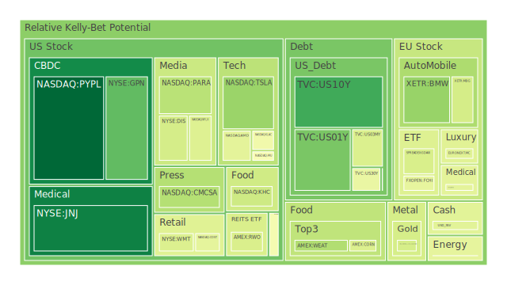

# **投資商品泡沫分析**

當前全球金融市場正處於一個複雜且充滿矛盾的十字路口。一方面，由人工智慧革命引領的科技股熱潮，為市場注入了強大的動能，推動指數屢創新高；另一方面，地緣政治的陰霾、頑固的通膨壓力，以及全球經濟增長前景的不確定性，又為市場的未來蒙上了一層厚厚的陰影。投資者似乎在極度的樂觀與深切的憂慮之間，進行著一場微妙的博弈。這種市場情緒的巨大分裂，正體現在各類資產的價格行為與風險評估之中。本報告旨在穿透表面的市場喧囂，深入剖析各類主要投資商品內在的風險結構，並試圖勾勒出潛在的宏觀與微觀傳導路徑，最終為投資者在當前混沌的環境中，提供經過深思熟慮的資產配置建議。

* 美國國債  
  美國國債市場作為全球金融的定價之錨，其當前的狀態極為微妙。從數據上看，各期限國債的風險指數呈現分化但整體可控的狀態。短期國債，如3個月期(US03MY)與1年期(US01Y)，其風險水平處於中等偏高的區間，這反映了市場對於聯準會短期內貨幣政策路徑的高度不確定性。雖然新聞層面傳達出2025年可能降息兩次的預期，但聯準會官員的鷹派言論以及依然相對較高的隔夜利率（OIS FED Fund Rate）讓短期利率的下行空間充滿博弈。  
  中長期國債，如十年期(US10Y)與三十年期(US30Y)，其風險指數相對較低。這背後隱含著一種正反合的邏輯。正方（Thesis）是市場對未來經濟衰退的擔憂，一旦經濟數據顯著惡化，長期國債將因其避險屬性而受到追捧。反方（Antithesis）則是對持續性通膨與龐大政府債務的憂慮。美國公共債務佔GDP比率處於高位，且聯準會仍在縮減其資產負債表，這對長期債券價格構成潛在壓力。合方（Synthesis）則是當前的市場均衡：收益率曲線（例如10年期與3年期之差）從去年的深度倒掛回升至微幅正值。歷史上，這種從倒掛恢復正常的階段，往往是經濟進入衰退前的最後信號，市場在此刻呈現出一種暴風雨前的寧靜。新聞中提及的「聯準會最新經濟預測暗示停滯性通膨擔憂」，正是這種矛盾心態的體現。投資者既擔心經濟停滯（利好債券），又害怕通膨（利空債券），導致長期國債價格處於一種脆弱的平衡。  
* 美國零售股  
  以沃爾瑪(WMT)、好市多(COST)與塔吉特(TGT)為代表的美國零售股，正呈現出極高的風險累積。特別是TGT，其近一個月的風險評估持續處於極高水平。這與宏觀經濟數據所揭示的圖景形成了鮮明對比。聯邦數據顯示，消費者信貸違約率，特別是商業房地產和一般消費貸款的違約率，正處於相對高位。這通常意味著家庭預算開始受到擠壓，消費能力正在減弱。  
  從社會學角度看，這反映了一種消費分級的現象。COST與WMT的商業模式在經濟壓力下具有一定的防禦性，它們的客戶群體更注重性價比。然而，它們高企的風險讀數表明，市場可能過度計入了這種防禦性，其估值已經脫離了基本面的支撐。新聞中Gap執行長提到「關稅和謹慎的消費者」，以及奢侈品行業「去年流失了五千萬客戶」的報導，都從側面驗證了消費者正變得日益謹慎。從心理學層面分析，投資者可能存在路徑依賴，認為這些零售巨頭在過往的經濟週期中表現穩健，因此在當前週期中也會如此，從而忽視了不斷惡化的消費者健康狀況。這種樂觀預期與疲軟現實之間的鴻溝，是零售股領域最大的風險來源。  
* 美國科技股  
  科技股，特別是納斯達克100指數(NDX)的成分股，無疑是本輪牛市的絕對核心，同時也是風險最為集中的領域。微軟(MSFT)、蘋果(AAPL)、亞馬遜(AMZN)、谷歌(GOOG)等巨頭的風險評估均處於高位。這場由AI敘事驅動的盛宴，其邏輯鏈條清晰而強大：AI將帶來生產力的大幅躍升，而這些巨頭是實現這一願景的基礎設施提供者。  
  然而，歷史的鏡子告誡我們，任何技術革命的早期階段都伴隨著巨大的泡沫。2000年的網路泡沫，其核心敘事也是網際網路將改變世界，這在事後被證明是完全正確的，但當時絕大多數網路公司的估值卻是建立在遙遠的未來，而非可預見的現金流上。當前，亞馬遜和微軟等公司一邊享受著創紀錄的股價，一邊卻在新聞中宣布裁員。這是一個關鍵的矛盾信號。從博弈論角度看，公司管理層的行為（裁員）與市場投資者的預期（無限增長）產生了背離。管理層可能預見到未來需求的放緩，或希望透過提高效率來應對潛在的經濟逆風，而市場則將其解讀為利潤率提升的利好。這種解讀的差異，是泡沫能否持續的關鍵。當前科技股的繁榮，更像是一場信心遊戲，一旦對AI變現能力的信心發生動搖，其引發的連鎖反應將是劇烈的。  
* 美國房地產指數  
  以VNQ、IYR、RWO等為代表的美國房地產指數，其風險評估普遍處於高位，尤其是IYR的月度風險讀數持續在0.9以上。這與聯邦經濟數據中商業房地產違約率高企、30年期固定抵押貸款利率維持在6.8%左右的高位形成了尖銳的對立。  
  從經濟學的基本原理看，利率是房地產價格的直接對手。高利率環境會顯著增加融資成本，抑制購房需求，並對商業地產的資本化率構成壓力。然而，REITs的價格卻似乎並未充分反映這一現實。這其中可能有幾個假設：其一，投資者押注聯準會將很快轉向大幅降息，從而提前搶跑。其二，在通膨環境下，房地產作為實物資產，其內在的抗通膨屬性吸引了部分資金。其三（心理學層面），可能存在一種「別無選擇」（There Is No Alternative, TINA）的思維，在股票風險極高、債券回報有限的情況下，資金被迫流入房地產尋求收益。倫敦豪宅銷售崩盤的新聞，雖然地域不同，但揭示了一個全球性的現象：當利率和稅收政策轉向不利時，高端房地產市場的流動性會迅速枯竭。美國房地產市場若持續無視高利率和高違約率的警示，其調整的風險正與日俱增。  
* 加密貨幣  
  比特幣(BTC)和以太坊(ETH)作為加密貨幣市場的兩大支柱，其風險指數在近期有所回落，但仍處於中高水平。有趣的是，狗狗幣(DOGE)這樣純粹由迷因（Meme）文化驱动的資產，其風險指數一度極高，近期波動劇烈。這揭示了加密市場的雙重屬性。  
  正方（Thesis），BTC和ETH的支持者將其視為對抗法幣體系通膨的「數位黃金」或下一代網際網路的底層協議（Web3）。它們的價格行為與高風險的科技股（特別是NDX）有著很強的正相關性，成為了主流資金追逐風險的延伸工具。反方（Antithesis），監管的不確定性、駭客攻擊的威脅（如新聞中伊朗最大加密貨幣交易所遭竊9000萬美元）以及其作為洗錢工具的負面形象，始終是懸在市場頭上的達摩克利斯之劍。合方（Synthesis），加密貨幣市場是流動性與市場情緒最極端的體現。當市場樂觀時，它是吸收剩餘流動性的最佳海綿；當市場恐慌時，其去槓桿化的過程也最為殘酷。目前BTC與ETH風險指數的波動，正反映了市場在科技樂觀主義與宏觀避險情緒之間的搖擺。捷克政府因比特幣醜聞面臨不信任動議等新聞，也顯示了加密貨幣融入現實世界時所面臨的政治與法律摩擦。  
* 金/銀/銅  
  貴金屬與工業金屬的表現呈現出明顯的分野。黃金(XAUUSD)和白銀(XAGUSD)的風險指數處於中高位，而銅(COPPER)的風險指數則在近期顯著攀升。這三種金屬的相對價格關係，提供了一個觀察全球經濟的獨特視角。  
  黃金/銅的比率（Gold/Copper Ratio）是一個經典的衡量經濟健康狀況的指標。當該比率上升時，意味著避險情緒（黃金）強於工業增長預期（銅），反之亦然。目前該比率處於歷史相對高位，暗示市場對全球經濟增長的真實信心並不如股市表現得那麼強勁。然而，銅價本身的風險指數也在走高，這似乎是個矛盾。此處的假設是，銅的價格上漲，可能並非完全由終端需求驅動，而是受到了供應鏈瓶頸、地緣政治風險（主要生產國政治不穩定）以及能源轉型（電動車、電網升級需要大量用銅）的長期敘事所支撐。  
  黃金的表現則更為複雜。它同時受到美元強弱、真實利率水平以及地緣政治風險的影響。新聞中，美伊衝突的威脅不斷升級，為黃金提供了傳統的避險支持。同時，全球央行，特別是新興市場國家，持續增加黃金儲備以去美元化，也為其提供了結構性支撐。白銀(XAGUSD)的風險指數極高，超過了黃金。這符合其歷史特性，白銀既有貴金屬的避險屬性，又有工業金屬的用途，其價格波動性（beta）通常高於黃金。當前市場對白銀的高風險評估，可能反映了投機資金在黃金價格上漲後的追逐效應。  
* 黃豆 / 小麥 / 玉米  
  農產品期貨，如黃豆(SOYB)、小麥(WEAT)和玉米(CORN)，其風險指數在所有資產類別中相對偏低。這在一個普遍高風險的市場環境中顯得尤為突出。從歷史上看，農產品價格主要受天氣、供需基本面和地緣政治（如主要出口國的戰爭）影響，與金融市場的關聯度較低。  
  當前的低風險狀態可以從幾個維度解讀。正方：全球農業迎來豐收，供應充足，壓抑了價格。反方：低迷的價格可能無法持續，因為氣候變遷導致的極端天氣事件頻率增加，任何一次大的乾旱或洪水都可能迅速改變供需格局。此外，能源價格（影響化肥和運輸成本）的潛在波動也可能傳導至農產品。合方：當前農產品市場可能處於一個被主流資金忽視的價值窪地。在一個所有金融資產估值都處於高位的世界裡，實物商品，特別是與人類生存息息相關的食品，其內在價值提供了一個天然的下行保護。從投資組合的角度看，它們與股票和債券的低相關性，使其成為一個極具吸引力的對沖工具。  
* 石油/ 鈾期貨UX\!  
  能源市場是當前地緣政治風險最直接的體現。石油(USOIL)的風險指數處於高位，這與新聞中「自以色列-伊朗戰爭開始以來，油價飆升10%」以及「美國是萬能牌」的報導完全吻合。市場正在為中東衝突擴大化的可能性定價。黃金/石油比率（Gold/Oil Ratio）從上月的53下降至45，清晰地表明相對於黃金的純粹避險，市場給予了石油更高的風險溢價。  
  鈾期貨(UX\!)的風險指數處於中等水平，但其背後的故事同樣深刻。從社會學和政治學角度看，全球對能源安全和碳中和的追求，正在引發一場對核能的重新評估。法國向瑞典採購監控飛機以保護其核設施、多國重啟或新建核電站，都構成了對鈾的長期結構性需求。然而，俄羅斯是全球濃縮鈾的主要供應商之一，地緣政治的緊張使其供應鏈變得脆弱。因此，鈾的價格博弈，是長期脫碳需求與短期地緣政治供應風險之間的平衡。與石油的短期衝擊不同，鈾的故事更偏向於一個長達數年的結構性轉變。  
* 各國外匯市場  
  外匯市場是國家之間經濟實力與貨幣政策的角力場。美元/日圓(USDJPY)的風險指數接近極限，反映了美日之間巨大的利率差距導致套息交易極度擁擠。這是一個高風險的交易，一旦日本央行政策轉向或美國經濟數據急劇惡化，其平倉過程可能引發劇烈的市場波動。  
  歐元/美元(EURUSD)的風險指數同樣處於極高水平。這表明市場對歐美經濟前景和央行政策的分歧充滿了投機。歐洲經濟面臨的挑戰（如俄羅斯經濟瀕臨衰退的報導）可能比美國更為嚴峻，但歐洲央行在抗通膨問題上似乎沒有聯準會那樣大的迴旋餘地。英鎊/美元(GBPUSD)的風險處於中等水平，但倫敦豪宅銷售崩盤、非定居居民外流等新聞，暗示英國經濟面臨結構性問題，這可能在未來對英鎊構成壓力。澳幣/美元(AUDUSD)作為商品貨幣，其走勢與全球經濟增長預期和中國經濟狀況息息相關，目前的溫和風險水平反映了市場對前景的矛盾看法。  
* 各國大盤指數  
  除了美股，全球其他主要股指也呈現出高風險狀態。日本日經225指數(JPN225)、德國DAX指數(GDAXI)、法國CAC40指數(FCHI)以及英國富時100指數(FTSE)的風險評估均處於高位或極高位。值得注意的是中國滬深300指數(00300)和台灣加權指數(0050)，其風險指數同樣非常高。  
  這呈現了一種全球性的風險資產同步膨脹現象。背後的驅動力可能是全球性的流動性泛濫以及對央行最終會出手救市的普遍信仰。然而，各經濟體的基本面卻存在巨大差異。歐洲面臨能源危機和地緣政治的直接衝擊。日本在擺脫通縮的同時，也面臨著貨幣政策正常化的巨大挑戰。中國經濟則在結構轉型和房地產危機中掙扎。台灣股市的強勁表現，與其在全球半導體產業鏈中的核心地位（特別是台積電TSM）密切相關，使其與美國科技股高度聯動，也因此承擔了相似的、由單一產業敘事驅動的估值風險。這種全球股市的「同漲同跌」模式，增加了系統性風險，一旦領頭羊（美國科技股）轉向，其他市場很可能跟隨下跌。  
* 美國半導體股  
  半導體是本輪AI狂潮的「軍火商」，其風險聚集程度甚至超過了一般的科技股。輝達(NVDA)、超微(AMD)、博通(AVGO)、台積電(TSM)、科磊(KLAC)和應用材料(AMAT)等公司的風險指數無一例外地處於極高區間。  
  這是一個典型的「賣鏟人」邏輯。無論最終哪個AI應用勝出，它們都需要半導體。這使得投資半導體看起來比押注單一AI應用更為穩妥。然而，這種一致性預期導致了整個行業的估值被推升至極端水平。歷史上，半導體行業具有強烈的週期性，其資本支出巨大，一旦需求不及預期，產能過剩會導致價格和利潤率的急劇下滑。當前，市場似乎完全忽略了這種週期性，而將其作為一個永續增長的行業來定價。高通(QCOM)的極高風險指數尤其值得警惕，因為其業務與消費者終端（如智慧型手機）的關聯度更高，更容易受到宏觀經濟下行的影響。半導體行業的繁榮，建立在一個完美的線性外推假設上，任何偏離都可能觸發劇烈的修正。  
* 美國銀行股  
  摩根大通(JPM)、美國銀行(BAC)、花旗集團(C)等大型銀行股的風險指數達到了驚人的高位。這與聯準會數據中多項貸款違約率上升、收益率曲線平坦（擠壓淨息差）以及監管機構可能對銀行槓桿提出更嚴格要求的現實，構成了最為鮮明的矛盾之一。  
  從博弈論角度分析，市場可能在與監管機構對賭。投資者可能認為，鑑於銀行系統的重要性，監管機構最終不敢過度收緊監管，甚至會在經濟惡化時提供流動性支持（即「聯準會看跌期權」的延伸版）。這種道德風險的預期，是支撐銀行股高估值的心理基礎。然而，歷史告訴我們，銀行業的危機往往源於對風險的錯誤定價和過度槓桿。當前對銀行股的極度樂觀，可能正是下一次危機的溫床。Capital One (COF)等專注於消費信貸的銀行，其風險尤其值得關注，因為它們是消費者健康狀況惡化的第一線承受者。  
* 美國軍工股  
  洛克希德·馬丁(LMT)、雷神(RTX)、諾斯洛普·格魯曼(NOC)等軍工股的風險指數持續處於高位。這與全球地緣政治緊張局勢的升級完全同步。從中東的美伊對峙，到未在新聞中提及但市場持續關注的東歐衝突，都轉化為了各國增長國防預算的實際行動。  
  軍工股的投資邏輯直接而清晰：世界越混亂，它們的訂單就越多。這是一個典型的「混亂對沖」資產。從社會學角度看，這反映了全球從過去數十年的和平與全球化，向大國競爭與地緣分裂的範式轉移。然而，其高企的風險指數也提示了幾個潛在風險：其一，估值已充分計入甚至過度計入了當前的衝突預期。其二，任何導致局勢顯著緩和的外交突破，都可能導致軍工股的拋售。其三，軍工企業的生產和交付週期長，其業績釋放並非一蹴可幾，市場的短期熱情可能與長期的基本面兌現節奏不匹配。  
* 美國電子支付股  
  t- Visa(V)、萬事達卡(MA)、美國運通(AXP)、PayPal(PYPL)等電子支付公司的風險評估出現了顯著分化。V、MA、AXP的風險指數處於極高位，而PYPL則異常地低。  
  V和MA作為支付領域的雙寡頭，其商業模式（按交易金額抽成）使其成為名義GDP增長的直接受益者，具有強大的網絡效應和定價權。市場給予其高估值，是押注全球消費和電子支付滲透率的持續增長。AXP則更專注於高淨值客戶，其股價表現與高端消費市場的景氣度息息相關。然而，它們的高估值使其對任何消費放緩的跡象都極為敏感。  
  PYPL的低風險指數則講述了另一個故事：一個昔日的成長明星，在面臨日益激烈的競爭（來自蘋果支付、銀行自有系統等）和創新瓶頸後，被市場拋棄。從逆向投資的角度看，當一個行業的龍頭企業風險高企，而一個失寵的競爭者風險極低時，這可能意味著風險回報的機會。市場可能過度懲罰了PYPL，而對V和MA的潛在威脅視而不見。  
* 美國藥商股  
  以禮來(LLY)、嬌生(JNJ)、默克(MRK)、艾伯維(ABBV)為代表的藥商股，內部也出現了巨大分化。LLY的風險指數極高，而JNJ和MRK則相對溫和。  
  LLY的股價飆升，主要由其在減肥藥和糖尿病領域的突破性產品驅動。這是一個由單一重磅產品催生的巨大泡沫，市場給予其的估值，已經遠遠超出了傳統的製藥公司估值框架，更像是在為一家科技公司定價。這種由單一敘事驅動的極端估值，其脆弱性不言而喻。任何關於藥品副作用、價格管制或競爭對手出現的新聞，都可能導致其股價劇烈波動。  
  相比之下，JNJ和MRK等傳統大型藥企，業務更多元化，風險也更為分散。它們的溫和風險指數，使其在一個高風險的市場中具有防禦屬性。從社會學角度看，人口老齡化是全球性的長期趨勢，為整個醫療保健行業提供了穩固的需求基礎。LLY的極端案例與JNJ的穩健形成了鮮明對比，揭示了市場在追逐「性感故事」與堅守「無聊但有效」的傳統價值之間的分野。  
* 美國影視股  
  迪士尼(DIS)、Netflix(NFLX)、派拉蒙(PARA)等影視媒體股的風險處於中等水平。這個行業正處於深刻的結構性變革之中。  
  正方（Thesis），流媒體取代傳統有線電視的趨勢不可逆轉，NFLX作為行業先驅，DIS憑藉其強大的IP庫存，依然佔據主導地位。反方（Antithesis），流媒體市場的競爭日益白熱化，內容製作成本不斷攀升，而用戶增長已顯現疲態。各家公司為了盈利，紛紛開始限制密碼共享、引入廣告，這又可能損害用戶體驗。合方（Synthesis），影視行業正從過去不計成本追求用戶增長的「圈地」階段，轉向更注重盈利和現金流的「守成」階段。PARA的風險指數相對較高，可能與其不斷傳出的併購傳聞有關，增加了事件驅動的不確定性。DIS的中等風險水平，則反映了市場對其轉型成功與否的矛盾心態，既看到了其IP的巨大潛力，也擔憂其龐大傳統業務轉身的困難。  
* 美國媒體股  
  以紐約時報(NYT)和福斯公司(FOX)為代表的媒體股，其風險評估處於高位，且近期有攀升跡象。在一個資訊爆炸且真假難辨的時代，傳統媒體的角色正變得既重要又尷尬。  
  從社會學角度看，社會的兩極分化，為持鮮明立場的媒體（如FOX）提供了穩固的受眾群體。它們的商業模式，從某種意義上說，是建立在社會分裂之上的。NYT則代表了另一種路徑，即試圖透過提供高質量的、付費的深度內容，在免費資訊的海洋中殺出一條血路。它們高企的風險指數表明，市場可能高估了它們在AI時代的定價能力和護城河。AI可以生成以假亂真的新聞，這對所有媒體的公信力都是一種潛在的侵蝕。此外，媒體行業與政治週期高度相關，隨著選舉臨近，其面臨的壓力和不確定性也將增加。  
* 石油防禦股  
  以埃克森美孚(XOM)、西方石油(OXY)等為代表的石油股，其高風險指數不僅僅反映了對油價上漲的預期，也體現了對其在當前環境下防禦屬性的認可。當通膨高企、地緣政治動盪時，這些能夠產生強勁現金流的能源巨頭，其股票性質介於工業股和避險資產之間。巴菲特對OXY的持續投資，強化了市場對其作為長期價值和通膨對沖工具的看法。然而，其高風險讀數也警示我們，它們的股價與波動的石油市場緊密相連，一旦地緣局勢緩和或全球經濟陷入深度衰退導致需求崩潰，它們的「防禦性」也將受到嚴峻考驗。  
* 金礦防禦股  
  以Royal Gold (RGLD)為代表的金礦股，其風險指數極高，甚至超過了黃金本身。這是一種典型的加槓桿行為。金礦公司的股價，可以被視為對黃金價格的看漲期權。它們的盈利能力對金價的變動極為敏感。當投資者強烈看好黃金後市時，往往會從投資黃金本身，轉向投資彈性更大的金礦股，以求獲取超額收益。Rio Tinto與蒙古政府就礦產達成和解的新聞，雖然不直接針對金礦，但也反映了礦業公司普遍面在的政治和運營風險。RGLD的極高風險指數，是市場對黃金避險敘事極度樂觀的體現，但也意味著一旦金價回調，其下跌的幅度也將遠超黃金。  
* 歐洲奢侈品股  
  以LVMH (MC)、開雲(KER)、愛馬仕(RMS)為代表的歐洲奢侈品股，正在經歷一場嚴峻的考驗。KER的風險指數持續處於極高水平，而MC和RMS也處於中高風險區。新聞報導直言不諱地指出，「奢侈品行業去年流失了五千萬客戶」，並且正面臨著對熱衷自拍的Z世代吸引力不足的問題。  
  從社會心理學角度分析，奢侈品的價值，很大程度上建立在「稀缺性」和「身份認同」的心理建構之上。當經濟下行，中產階級的財富感受惡化時，這種心理建構最先受到衝擊。此外，Z世代的消費觀念更注重體驗、可持續性和獨特性，傳統奢侈品大logo的吸引力正在下降。這是一場深刻的代際變革，而不僅僅是經濟周期的波動。這些公司的高風險指數，反映了市場對其過去輝煌的線性外推，與其正快速變化的消費者基礎和宏觀環境之間的脫節。  
* 歐洲汽車股  
  以寶馬(BMW)、賓士(MBG)、保時捷(PAH3)為代表的德國汽車股，風險指數普遍處於高位。它們正遭受三重夾擊：來自特斯拉和中國電動車企在技術和成本上的激烈競爭；歐洲本土經濟的疲軟；以及全球貿易緊張局勢（特別是歐中之間的關稅博弈）的威脅。它們的高風險指數，反映的不是樂觀預期，而更像是一種價值的陷阱。它們的市盈率看似很低，但市場擔憂的是其未來的盈利能力將會被結構性地侵蝕。這是一場關於「傳統製造業巨頭能否在新能源時代成功轉型」的豪賭，而目前來看，市場的疑慮遠大於信心。  
* 歐美食品股  
  卡夫亨氏(KHC)、可口可樂(KO)、雀巢(NESN)、聯合利華(ULVR)等食品飲料巨頭，其風險評估呈現中高且穩定的狀態。作為經典的防禦性板塊，它們在經濟不確定時期通常能表現出較強的韌性。因為無論經濟如何，人們總需要吃喝。它們的定價能力，是其在通膨環境下的核心優勢。然而，它們同樣面臨挑戰。消費者越來越追求健康、天然的食品，對傳統的加工食品和含糖飲料抱持警惕。此外，零售商自有品牌的崛起，也在不斷擠壓它們的利潤空間。KHC和ULVR較高的風險指數，可能反映了市場對它們轉型速度和應對成本壓力能力的擔憂。

# **宏觀經濟傳導路徑分析**

基於上述分析，幾條潛在的宏觀傳導路徑變得清晰可見。

第一條是「地緣政治衝擊路徑」。觸發點是美伊衝突的實質性升級，如新聞中提及的「美國考慮對伊朗進行打擊」。這將立刻引發石油和鈾等能源價格的飆升，推高全球通膨預期。這會迫使聯準會和各國央行放棄降息計劃，甚至重新考慮升息，導致全球債券市場遭到拋售，收益率飆升。高估值的科技股，其定價依賴於較低的貼現率，將在利率飆升的環境下經歷劇烈的殺估值過程。資金將從風險資產大規模流向避險資產，推高美元、黃金和軍工股的價格，形成一場完美的風險風暴。

第二條是「停滯性通膨路徑」。觸發點並非單一事件，而是當前趨勢的緩慢延伸。即通膨率（CPI目前為2.4%）持續高於央行目標，而經濟增長卻因高利率和高債務而放緩，失業率開始攀升。這將使央行陷入兩難境地：降息可能加劇通膨，不降息則可能加深衰退。在這種環境下，企業盈利增長停滯，消費者信心疲軟。股市將經歷漫長的橫盤或緩慢下跌，高槓桿、高估值的板塊（如科技、銀行、非必需消費品）表現最差，而具有定價權的必需消費品（食品飲料）、能源和黃金等實物資產則相對抗跌。

# **微觀經濟傳導路徑分析**

在企業和行業層面，最值得關注的傳導路徑是「AI敘事破滅路徑」。

觸發點可能是一家或幾家核心AI公司（如輝達、微軟）的業績或指引遠不及市場的極高預期，或者市場最終將科技公司的大規模裁員解讀為需求疲軟的信號。這將引發對整個AI產業鏈的信心危機。首先，晶片股（NVDA, TSM, AVGO）將領跌，並迅速傳導至軟體（MSFT, GOOG）和硬體（AAPL）巨頭。由於這些公司在指數中的巨大權重，它們的下跌將拖垮整個納斯達克和標普500指數。高度相關的加密貨幣市場將同步崩潰。投資者情緒將從極度貪婪轉向極度恐慌，引發大規模的資金輪動，從成長股轉向價值股和防禦性資產，如公用事業、醫療保健（JNJ）和必需消費品（KO）。這條路徑的破壞力在於，它攻擊的是當前市場最為擁擠、共識最強的交易，一旦發生，其去槓桿化的過程將是迅猛且痛苦的。

# **資產類別間傳導路徑分析**

當前市場最有趣的現象之一，是傳統資產相關性的失靈。例如，科技股（風險資產）和黃金（避險資產）在某些時候呈現同漲。這背後可能存在多重邏輯的疊加。一群投資者在追逐AI的趨勢，而另一群投資者則在對沖地緣政治風險，兩者同時行動，導致了這種看似矛盾的結果。

一個關鍵的傳導路徑是透過美元。當全球風險事件發生時，美元通常因其避險地位而走強。強勢美元對美國以外的經濟體構成緊縮效應，可能加劇全球經濟放緩，從而打擊對全球增長敏感的資產，如銅、新興市場股票和歐洲汽車股。同時，強美元也會對以美元計價的商品（如黃金和石油）構成名義上的壓力，但當地緣政治是主導因素時，這種壓力可能被避險或風險溢價的需求所抵消。

另一個重要的傳導關係體現在債券與股票之間。在傳統的經濟衰退中，債券和股票呈負相關（股跌債漲）。但在停滯性通膨的環境下，兩者可能呈正相關（股債雙殺），因為通膨對兩者都不利。當前市場正處於這兩種情景的臨界點。一旦市場確認進入衰退模式，資金將從股票湧入債券；但如果通膨失控，資金將同時逃離這兩大類資產，轉向現金和實物商品。

# **投資建議**

基於以上分析，我們為不同風險偏好的投資者，提出三種經過深思熟慮的優化配置方案。這些配置旨在平衡當前市場的巨大機遇與潛在風險。

穩健型投資組合 (總計 100%)  
此組合的核心目標是資本保值，並對沖停滯性通膨和地緣政治風險。

1. **長期美國國債 (40%)**: 在經濟衰退風險上升的背景下，長期國債是最佳的對沖工具。一旦聯準會被迫開啟降息週期，其價格上行潛力巨大。可透過代表性的ETF或期貨進行配置。  
2. **黃金 (40%)**: 作為跨越數千年的終極避險資產，黃金是對抗地緣政治不確定性、貨幣信用貶損和持續性通膨的基石配置。可直接持有實物黃金或透過相關ETF (如GLD)進行配置。  
3. **農業大宗商品 (20%)**: 以玉米(CORN)、黃豆(SOYB)為代表的農產品，其當前風險指數極低，與金融資產關聯度低，是極佳的多元化工具。其價格受到氣候和供應鏈影響，能在主流資產下跌時提供保護。可透過相關的商品ETF進行配置。

成長型投資組合 (總計 100%)  
此組合旨在謹慎地參與市場的核心增長主題，同時設置有效的風險對沖。

1. **美國優質科技股 (50%)**: 選擇性地投資於資產負債表健康、現金流充裕、在AI領域具有核心競爭優勢的龍頭企業，例如微軟(MSFT)和谷歌(GOOG)。避免追逐純粹概念炒作、估值最為極端的公司。這是在承認AI長期趨勢的同時，控制個股風險。  
2. **能源 (石油與鈾) (30%)**: 配置石油(USOIL)和鈾(UX\!)期貨或相關股票(XOM)。石油是對沖短期地緣政治衝突和通膨的工具，而鈾則是把握長期能源轉型和能源安全趨勢的結構性機會。兩者結合，可以捕捉不同時間維度的能源主題。  
3. **美元現金或短期國債 (20%)**: 持有部分高流動性的美元資產，作為「干火藥」。在市場劇烈波動時，這部分資產既能提供穩定性，又能隨時抓住被錯殺的資產出現的機會。

高風險型投資組合 (總計 100%)  
此組合專為具有高風險承受能力、尋求超額回報的投資者設計，採取逆向和高彈性策略。

1. **白銀 (40%)**: 相對於黃金，白銀的價格彈性更大。如果市場進入貴金屬牛市，或在通膨預期升溫及工業需求回暖（尤其是在能源轉型領域）的共振下，白銀的潛在回報率可能遠超黃金。其極高的風險指數也意味著需要嚴格的風險管理。可透過白銀ETF(SLV)或期貨配置。  
2. **金礦股 (30%)**: 作為黃金價格的槓桿，配置一籃子的優質金礦公司股票(如RGLD)。在金價上漲的週期中，金礦股的表現將極具爆發力。這是在高風險組合中，進一步放大對黃金方向性判斷的策略。  
3. **價值重估型股票 (30%)**: 尋找那些被市場過度拋棄，但基本面正在或可能出現拐點的公司。電子支付領域的PayPal (PYPL)是一個典型的例子，其風險指數極低，與同業形成巨大反差，任何積極的戰略轉變都可能帶來巨大的重估空間。

# **風險提示**

投資有風險，市場總是充滿不確定性。我們的建議僅供參考，投資者應根據自身的風險承受能力和投資目標，做出獨立的投資決策。過去的表現不能預示未來的回報。本報告中提及的高風險資產，其價格可能在短期內發生劇烈波動，導致重大損失。投資前請務必進行充分研究，並在必要時諮詢專業財務顧問。

 
Daily Buy Map:

 
Daily Sell Map:

 
Daily Radar Chart:

 
