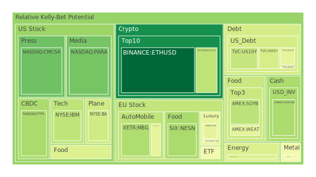
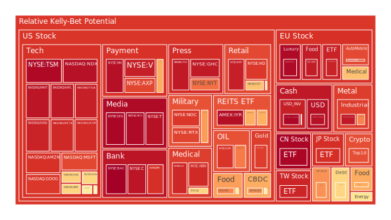
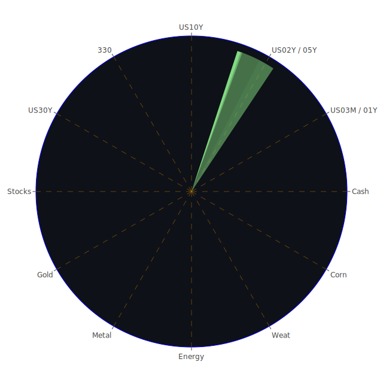

## **投資商品泡沫分析**

在當前全球金融市場的宏觀背景下，我們觀察到一個極為複雜且充滿矛盾的景象。一方面，以人工智慧為首的科技革命浪潮，持續推動特定領域資產價格屢創新高，市場情緒在貪婪與恐懼之間快速擺盪；另一方面，全球地緣政治衝突加劇，各國央行貨幣政策路徑出現分歧，經濟基本面數據亦透露出疲軟信號。這種基本面與市場價格的巨大背離，使得泡沫風險成為所有投資者無法迴避的核心議題。本報告將深入剖析各大類資產的現狀，旨在穿透表層的價格波動，探尋其背後由經濟學、社會學、心理學及博弈論交織而成的深層結構。

* **美國科技股與半導體股**

當前市場的核心驅動力無疑是圍繞人工智慧（AI）展開的敘事。以輝達（NVDA）、台積電（TSM）、微軟（MSFT）、蘋果（AAPL）及Google（GOOG）等為代表的科技巨頭，其資產價格的月度風險評分已達到極高的水平，部分龍頭企業如台積電的風險指數甚至逼近完美的泡沫狀態，顯示其價格已嚴重脫離傳統估值模型所能解釋的範疇。

從經濟學角度看，這是一場由供給側技術突破引發的生產力革命預期。市場正在以前所未有的樂觀情緒，將未來數十年的潛在利潤折現至當下。然而，這種預期本身具有高度的不確定性。從歷史視角觀察，這與1990年代末期的網際網路泡沫有著驚人的相似之處。當時，市場也為了一個革命性的新技術而瘋狂，無數公司在幾乎沒有盈利的情況下被賦予天價估值，最終泡沫的破裂對市場造成了深遠的影響。

社會學與心理學層面，我們看到了明顯的「羊群效應」與「錯失恐懼症」（FOMO）。AI的敘事不僅僅是投資主題，更演變為一種社會文化現象。媒體（如NYT、FOX）對其鋪天蓋地的報導，強化了公眾的認知，形成了一種「不參與即落後」的集體焦慮。這種群體心理放大了市場的動能，使得價格的上漲本身成為了繼續上漲的理由，這是一種典型的正回饋循環，也是泡沫形成的重要心理基礎。

從博弈論的角度分析，機構投資者或許認知到其中的風險，但在一個由流動性與市場情緒主導的賽局中，選擇「與泡沫共舞」而非過早離場，往往是短期內最優的策略。然而，當音樂停止時，率先離場者將獲得最大收益，而後知後覺者則將承擔不成比例的巨大損失。目前，半導體產業鏈中的應用材料（AMAT）、科磊（KLAC）等上游設備商的風險指數同樣居高不下，顯示整個產業鏈都處於高度亢奮的狀態。近期如Workday等軟體公司發布的令人失望的財測，以及特斯拉（TSLA）面臨的新聯邦調查，可被視為宏大敘事下的雜音，但這些微小的裂縫，是否會成為引發雪崩的起點，值得高度警惕。

* **美國國債**

美國國債市場正處於一個微妙的十字路口。從風險數據來看，各年期國債（US01Y, US02Y, US05Y, US10Y, US30Y）的泡沫指數普遍處於中低水平，遠低於權益類資產。這反映出在其傳統的避險屬性下，市場並未出現極端的投機行為。

然而，其背後的宏觀環境卻異常複雜。聯準會（FED）的資產負債表持續收縮，而美國政府的公共債務佔GDP比重卻不斷攀升，這構成了一對根本性的供需矛盾。從經濟學上看，這意味著未來需要有源源不斷的買家來吸收新增發的國債，否則將對殖利率構成上行壓力。

近期殖利率曲線的變化尤為關鍵。長短期利差（如10年期與3個月期）已從去年深度倒掛轉為小幅走正。歷史上，殖利率曲線的「正常化」過程往往伴隨著經濟從衰退預期走向現實，或是在貨幣政策轉向的初期發生，這兩個階段都充滿了不確定性。當前3個月期至2年期的短期殖利率顯著低於一年前的水平，而10年期以上的長期殖利率則高於去年，市場似乎在博弈聯準會短期內將放鬆政策，但對長期通膨或經濟增長抱持著更高的預期。

從全球博弈的角度看，外國機構持有美債的規模處於高位，顯示出美元資產在全球範圍內的核心地位依然穩固。然而，地緣政治的緊張局勢，可能會促使一些國家尋求外匯儲備的多元化，這對美債的長期需求構成潛在威脅。聯準會官員近期一鷹一鴿的發言，也加劇了市場對未來政策路徑的困惑，使得國債市場的定價變得更加困難。

* **美國銀行股與電子支付股**

銀行股，特別是美國銀行（BAC）、摩根大通（JPM）和花旗集團（C），近期呈現出極高的短期風險指標。美國銀行的D1與D7風險分數甚至攀升至接近極限值，這與其相對較低的月度風險形成鮮明對比，暗示市場對該行業的擔憂在近期急劇升溫。

這份擔憂並非空穴來風。聯準會的數據明確指出，商業地產、一般房地產及消費者貸款的拖欠率均處於「相對高位」。這對以信貸為生的銀行業而言，是直接的利潤侵蝕。歷史上，2008年的金融危機便是由房地產市場的信貸違約引發的連鎖反應。儘管當前的監管環境已大不相同，但信貸質量惡化的早期信號絕不能被忽視。

與此同時，電子支付公司如Visa（V）、萬事達卡（MA）、PayPal（PYPL）和Global Payments（GPN）則呈現出分化的態勢。Visa和萬事達卡憑藉其雙寡頭的市場地位，風險指數持續處於高位，反映了市場對其穩健商業模式的信心。然而，PayPal的短期風險指標出現了劇烈波動，而GPN的風險則處於相對低位。這背後反映的是支付行業內部的競爭加劇與創新壓力。從社會學角度看，消費者的支付習慣正在快速變遷，這對既有市場參與者既是機遇也是挑戰。高利率環境下，消費者信貸拖欠率的上升，同樣會傳導至這些公司的業績表現上。

* **美國房地-產指數**

房地產相關指數（VNQ, IYR, RWO）的泡沫風險分數普遍偏高，顯示這個對利率極為敏感的行業正承受著巨大壓力。儘管30年期固定抵押貸款利率已從高點回落至6.58%，但相較於前幾年的歷史低位，仍然對購房者的負擔能力構成嚴重挑戰。

經濟學的基本原理指出，資產價格是其未來現金流的折現。在利率中樞上移的背景下，房地產的估值基礎受到了根本性的動搖。聯準會數據中房地產貸款拖欠率處於高位的警訊，直接印證了這一點。PulteGroup等建築商面臨的抵押貸款欺詐調查新聞，則從微觀層面揭示了行業在壓力之下可能出現的亂象。

從社會層面看，住房是民生的基礎，高昂的房價與貸款成本加劇了社會的財富不平等。這可能引發更廣泛的社會問題，並反過來影響經濟的長期穩定。房地產市場的健康與否，是觀察整體經濟韌性的重要窗口。其高企的風險指數，是宏觀經濟中一個不容忽視的警報器。

* **加密貨幣**

加密貨幣市場，以比特幣（BTC）和以太坊（ETH）為代表，依然是高風險與高波動性的代名詞。比特幣的月度風險指數維持在0.42左右的中高水平，但近期有所回落，顯示市場情緒趨於謹慎。相比之下，狗狗幣（DOGE）這類帶有濃厚迷因色彩的資產，其風險指數則飆升至0.9以上，純粹由市場情緒和投機心理主導。

從心理學角度看，加密貨幣市場是研究集體情緒的絕佳案例。Trump-Backed World Liberty獲得Coinbase批准發行穩定幣的消息，能帶來正面的市場刺激；而價值9100萬美元的駭客詐騙案，則迅速引發恐慌。這顯示出市場的脆弱性以及對新聞事件的極端敏感。

博弈論的視角下，加密市場的參與者結構複雜，從長期信仰者到短期投機客，其目標和策略截然不同，加劇了價格的波動。OCC（美國貨幣監理署）對加密銀行的監管行動，以及Tornado Cash案件的進展，都表明監管的不確定性依然是懸在整個行業頭上的達摩克利斯之劍。以太坊相對較低的風險評分（約0.21）可能暗示，在經歷了多次技術升級後，市場對其長期應用價值的認可度有所提升，相對於純粹的投機資產，展現出一定的韌性。

* **金/銀/銅**

貴金屬黃金（XAUUSD）和白銀（XAGUSD）的風險指數在近期達到了驚人的高位，特別是白銀，其月度風險評分超過0.94。這通常被解讀為市場避險情緒的體現。在以色列與加薩的衝突、烏克蘭戰事持續以及中美關係緊張等多重地緣政治風險的催化下，黃金和白銀作為傳統的價值儲存手段，受到了資金的追捧。

從相對價格關係看，當前的金油比（黃金價格/石油價格）高達52.87，遠超歷史平均水平。這暗示相對於能源，黃金的價格處於極端高位。這可能反映了市場對未來經濟增長（石油需求的主要驅動因素）的悲觀預期，同時對全球貨幣體系的穩定性抱持懷疑。金銅比同樣處於高位，工業金屬銅（COPPER）的價格和風險指數相對溫和，也側面印證了市場對實體經濟需求的擔憂。

社會心理層面，當不確定性成為常態，人們會本能地尋求「永恆」的資產。黃金數千年來在全球各種文化中扮演的角色，使其具備了其他資產無法比擬的心理錨定效應。因此，其高企的風險指數，既是泡沫的信號，也是時代焦慮的鏡像。

* **黃豆 / 小麥 / 玉米**

農產品市場，包括黃豆（SOYB）、小麥（WEAT）和玉米（CORN），其風險指數處於中等水平。這些商品的價格主要受到全球供需基本面、天氣狀況以及地緣政治的影響。

歷史上，戰爭和貿易爭端常常引發糧食價格的劇烈波動。例如，俄烏衝突就曾一度導致全球小麥供應緊張。新聞中提到，在小眾的小麥期貨市場，傳統合約正在抵禦來自巨頭的新競爭，這反映了糧食交易市場結構的演變。

從社會學角度看，糧食安全是所有國家社會穩定的基石。糧食價格的波動直接影響到全球數十億人口的生活成本，尤其是在發展中國家，可能成為社會動盪的導火線。因此，相較於純金融資產，農產品的價格波動受到了更多實體層面的制約，其泡沫風險通常不會像科技股那樣極端，但其影響卻更為廣泛和深遠。

* **石油/ 鈾期貨**

能源市場呈現出複雜的景象。美國石油（USOIL）的月度風險指數約為0.65，處於中高水平，顯示市場在經濟放緩的預期與供給端的地緣政治風險之間進行權衡。美國對伊朗石油相關網絡和船隻實施制裁，以及土耳其可能在利比亞東部進行海上勘探等新聞，都為供給端帶來了不確定性。

與此同時，鈾期貨（UX\!）的風險指數也處於中等水平。在全球追求能源轉型和能源獨立的背景下，核能作為一種穩定的低碳能源，其戰略價值被重新評估。鈾價的走勢，不僅僅是商品供需的體現，更是全球能源政策和地緣政治博弈的結果。

從博弈論角度分析，OPEC+的產量決策、主要消費國的戰略儲備釋放、以及新能源技術的發展速度，共同構成了一個多方參與的複雜賽局。任何一方的決策都可能引發能源價格的連鎖反應。

* **各國外匯市場**

外匯市場是全球宏觀經濟的縮影。美元兌日圓（USDJPY）的月度風險指數高達0.92，歐元兌美元（EURUSD）更是接近0.98。這反映出在全球不確定性加劇的背景下，資金持續流向被視為避風港的美元，導致美元相對其他主要貨幣極度強勢。

日本央行與聯準會、歐洲央行之間巨大的貨幣政策差異，是推動日圓持續走弱的根本原因。市場似乎在與日本央行對賭，博弈其無法在不引發國內金融市場巨大動盪的情況下，收緊其超寬鬆的貨幣政策。

澳幣兌美元（AUDUSD）和英鎊兌美元（GBPUSD）的風險指數則相對溫和。澳幣作為商品貨幣，其走勢與全球經濟增長預期和中國的經濟狀況息息相關。英鎊則持續受到國內經濟挑戰的困擾。外匯市場的高度風險聯動，表明全球資本流動正在對各國經濟金融穩定構成嚴峻考驗。

* **各國大盤指數**

全球主要股指的風險指數普遍處於高位，從美國的那斯達克指數（NDX）、德國的GDAXI、英國的FTSE，到亞洲的日經225指數（JPN225）、中國的滬深300指數（000300）以及台灣的0050 ETF，無一倖免。這揭示了當前市場的風險具有高度的全球相關性。

這種同步性背後，是全球化資本流動和相似的宏觀驅動因素（如AI浪潮、央行政策等）。然而，各國經濟基本面的差異依然存在。例如，日經指數的強勢，部分得益於弱勢日圓帶來的出口企業匯兌收益和公司治理改革的預期。中國滬深300指數的高風險，則與其國內房地產市場的挑戰和經濟轉型的陣痛有關。

這種全球性的資產價格膨脹，使得傳統的通過多國配置來分散風險的策略效果大打折扣。當系統性風險來臨時，不同市場可能會出現同向下跌的局面。

* **美國軍工股**

洛克希德·馬丁（LMT）、雷神（RTX）、諾斯洛普·格魯曼（NOC）等軍工股的泡沫風險分數持續處於高位且不斷攀升。這與地緣政治新聞的負面情緒強度呈現出高度的正相關。從以色列在加薩的軍事行動，到烏克蘭戰場的膠著，再到美國海軍艦艇的事故，每一次衝突和緊張局勢的升級，都成為推高軍工股估值的燃料。

從經濟學角度看，國防開支在經濟學上常被視為非生產性支出，但在一個充滿衝突的世界裡，它卻成為一種確定性的需求。這使得軍工企業的訂單和現金流在經濟下行週期中，反而具有相對的穩定性。

社會心理層面，對安全的渴望是人類最基本的需求之一。當國際秩序面臨挑戰，國家和民眾的不安全感上升時，對國防工業的支持也會增加。軍工股的強勢，可以視為市場對一個更加分裂和危險的世界的定價。這是一個悲觀的共識，但卻是當下市場博弈的現實。

* **美國零售、媒體、影視、藥商及食品股**

這些與民生消費息息相關的板塊，呈現出複雜且分化的內部格局。

在零售領域，沃爾瑪（WMT）、好市多（COST）等大型連鎖超市的風險指數極高，而塔吉特（TGT）和折扣零售商Ross Stores（ROST）則相對溫和。這反映出在高通膨和經濟不確定性下，消費者的行為出現了明顯的「消費降級」趨勢，轉而尋求性價比更高的商品。Cracker Barrel因更換標誌而市值大跌的新聞，則是一個關於品牌認同與消費者心理的有趣案例，說明在當下環境中，任何一個微小的失誤都可能被市場放大。

媒體與影視股，如派拉蒙（PARA）、迪士尼（DIS）、Netflix（NFLX）、紐約時報（NYT）和福斯（FOX），普遍面臨高風險。這個行業正處於技術變革（串流媒體衝擊傳統模式）和內容競爭白熱化的雙重壓力之下。迪士尼的風險指數高企，可能反映了市場對其轉型陣痛的擔憂。Netflix的極高風險，則體現了在用戶增長放緩和內容成本高昂的背景下，對其未來盈利能力的質疑。

藥商股，如嬌生（JNJ）、默克（MRK）、輝瑞（PFE未在數據中但可類推）、禮來（LLY）和艾伯維（ABBV），風險水平不一。禮來和諾和諾德（NVO）因其在減肥藥領域的突破性進展而受到市場追捧，風險指數極高，是典型的由單一產品創新驅動的估值重塑。而嬌生、默克等傳統藥廠的風險則相對可控，體現了其業務多元化和穩健的防禦屬性。

食品股，如可口可樂（KO）、麥當勞（MCD）、卡夫亨氏（KHC）以及歐洲的雀巢（NESN）和聯合利華（ULVR），風險普遍較高。作為必需消費品，它們本應具有防禦性，但其高企的風險可能反映了成本上升（原材料、勞動力）對利潤率的侵蝕，以及在全球經濟放緩背景下，即使是必需消費也可能面臨壓力。

* **歐洲奢侈品股與汽車股**

歐洲奢侈品巨頭，如LVMH（MC）、愛馬仕（RMS）和開雲集團（KER），風險指數居高不下。奢侈品行業在經濟學上具有特殊的「凡勃倫效應」，即價格越高需求越大，使其在一定程度上能免疫於普通經濟週期。其目標客戶是全球高淨值人群，財富受經濟波動影響較小。然而，全球性的資產泡沫破裂，同樣會衝擊富裕階層的財富，進而影響奢侈品消費。它們的高風險，實際上是與全球資產價格泡沫本身緊密相連的。

歐洲汽車股，如賓士（MBG）、寶馬（BMW）和保時捷（PAH3），則面臨著來自電動化轉型和全球（特別是中國市場）競爭加劇的巨大挑戰。其風險指數處於中高水平，反映了市場對其轉型前景的憂慮。特斯拉的崛起，從根本上改變了汽車行業的遊戲規則，傳統車廠能否成功應對，是其估值的核心變數。

## **宏觀經濟傳導路徑分析**

當前全球宏觀經濟的核心傳導路徑，始於地緣政治的高度不確定性與主要央行（特別是聯準會）的貨幣政策。地緣政治緊張，直接推升了軍工（LMT, RTX）和避險資產（XAUUSD, USD）的需求，同時對全球供應鏈造成干擾，為通膨帶來上行風險。聯準會的量化緊縮政策，從金融系統中抽離流動性，推高了融資成本。這條路徑首先衝擊對利率最敏感的房地產市場（VNQ, IYR），導致拖欠率上升。接著，壓力傳導至銀行系統（BAC, JPM），信貸收縮的風險增加。最終，信貸緊縮和高昂的資金成本將抑制企業投資和個人消費，對整體經濟（特別是零售TGT, WMT和科技成長股NVDA, AAPL）造成負面影響。目前市場的高估值，與這條清晰的負面傳導路徑形成了尖銳的對立。

## **微觀經濟傳導路徑分析**

在微觀層面，企業盈利預期的變化是關鍵。以AI為核心的科技公司（NVDA, MSFT），其樂觀的盈利預期支撐著天價估值，並通過產業鏈傳導至上游設備商（AMAT, KLAC）。然而，一旦終端需求（來自企業和消費者）因宏觀經濟放緩而未達預期，這條傳導鏈便會逆轉。例如，Workday令人失望的財測，就是一個警訊。這將引發盈利預期的下修，進而導致估值的「戴維斯雙殺」。在消費領域，高通膨和利率壓力，正引導消費者從高價可選消費（DIS）流向低價必需消費（WMT, COST），這條路徑清晰地反映在不同零售商業績和股價風險的分化上。

## **資產類別間傳導路徑分析**

資產間的傳導路徑同樣錯綜複雜。強勢美元（USDJPY, EURUSD）對美國以外的經濟體構成壓力，迫使他國央行被動收緊貨幣政策，可能引發區域性金融風險，進而通過全球資本市場傳導回美國。國債殖利率的上升，會提高所有風險資產的貼現率，對科技股等長久期資產的估值構成直接打壓。黃金與石油價格的極端比值（金油比），預示著避險資產與工業資產之間定價的巨大分歧，這種分歧若要收斂，要麼是黃金價格回落，要麼是石油價格上漲，前者對應經濟衰退，後者對應通膨重燃，無論哪種情景，對當前高位運行的股市都不是好消息。加密貨幣與科技股（特別是那斯達克指數）之間的高度相關性，使其成為市場風險情緒的放大器，而非分散風險的工具。

## **投資建議**

基於上述分析，當前的投資環境可謂「在懸崖邊上跳舞」。市場普遍存在高度泡沫風險，傳統的股債平衡策略可能因兩者同時下跌而失效。因此，核心策略應圍繞風險管理、尋找相對價值窪地以及利用市場的結構性趨勢展開。以下是針對不同風險偏好的投資者提出的資產配置建議：

**穩健型投資組合 (風險承受能力較低)**

此組合的核心目標是保全資本，同時獲取超越通膨的真實回報。在幾乎所有資產都存在泡沫的情況下，現金和短期國債是抵禦未知的基石。

* **配置比例:**  
  * **短期美國國債 (50%):** 以1年期國債為例，約3.89%的年化殖利率提供了相對安全的票息收入，且流動性極佳。在市場動盪時，它可以作為購買廉價資產的「彈藥」。  
  * **黃金 (30%):** 儘管其風險指數偏高，但在地緣政治衝突和潛在的貨幣信用危機中，黃金的避險屬性無可替代。它與權益資產的負相關性，使其成為組合中必不可少的保險。  
  * **防禦性價值股 (20%):** 選擇業務穩定、現金流充裕且受經濟週期影響較小的公司。例如，大型製藥公司**嬌生 (JNJ)**，其月度風險評分相對可控，且醫療保健是剛性需求。

**成長型投資組合 (風險承受能力中等)**

此組合尋求在承擔可控風險的前提下，捕捉市場的結構性機會，目標是實現資本的長期增值。

* **配置比例:**  
  * **全球多元化科技股 (40%):** 儘管風險極高，但完全錯過AI革命的機會成本同樣巨大。可配置於跟蹤\*\*那斯達克100指數 (NDX)\*\*的ETF，以分散單一公司風險，捕捉行業整體成長趨勢。  
  * **軍工/國防工業 (30%):** 在可預見的未來，全球地緣政治緊張格局難以緩解，國防開支的增長具有高度確定性。可重點關注行業龍頭，如**洛克希德·馬丁 (LMT)**。  
  * **能源與工業金屬 (30%):** 配置一部分資產於石油防禦股如**埃克森美孚 (XOM)和工業金屬銅 (Copper)**。這既是對沖通膨的工具，也能在經濟意外強勁復甦時提供上行彈性。

**高風險投資組合 (風險承受能力較高)**

此組合專為能夠承受巨大波動甚至本金損失，以換取超額回報的投資者設計。它聚焦於市場的動能、波動性和潛在的非對稱回報機會。

* **配置比例:**  
  * **頭部半導體股票 (40%):** 直接投資於AI浪潮的核心，如**台積電 (TSM)**。這是一個高風險高回報的選擇，賭的是其技術護城河和行業領導地位能夠在泡沫中存續甚至勝出。  
  * **核心加密貨幣 (30%):** 主要配置於**以太坊 (ETH)**。其相對較低的風險評分和不斷發展的生態系統，可能使其在下一輪市場週期中具備較大的增長潛力。同時配置少量\*\*比特幣 (BTC)\*\*作為數字黃金。  
  * **市場對沖策略 (30%):** 鑑於銀行業和房地產的明確風險信號，可以採用賣空相關ETF（如IYR或區域性銀行ETF）或購買看跌期權的方式進行對沖。此策略旨在從潛在的市場下跌中獲利，與組合中的多頭頭寸形成負相關，從而平滑整體波動。

## **風險提示**

投資有風險，市場總是充滿不確定性。本報告完全基於提供的歷史數據和新聞進行分析，不構成任何投資邀約。過去的表現不能預示未來的回報。宏觀經濟和地緣政治的突發事件可能導致市場出現劇烈波動，所有資產的價格都可能在短期內大幅下跌。我們的建議僅供參考，投資者應根據自身的風險承受能力、財務狀況和投資目標，在進行獨立、審慎的思考後，做出自己的投資決策。在做出任何投資決定前，請諮詢專業的財務顧問。

 
Daily Buy Map:

 
Daily Sell Map:

 
Daily Radar Chart:

 
