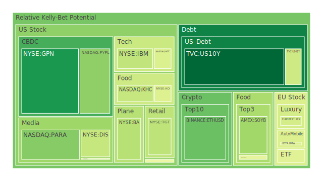
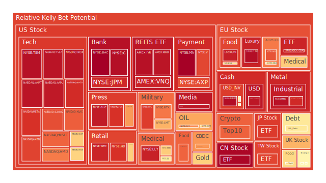
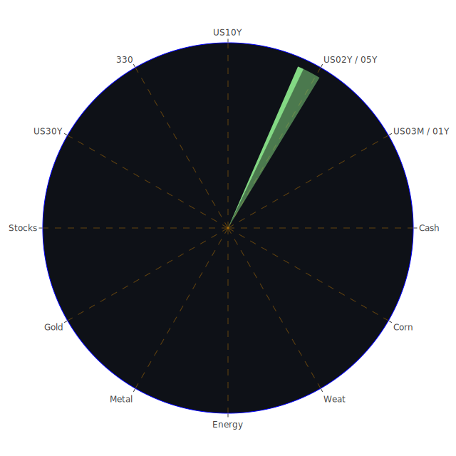

# 投資商品泡沫分析

## 美國國債

* 現象與數據：2Y 3.72%、5Y 3.79%、10Y 4.28%、20Y 4.86%、30Y 4.89。相較一周前與一個月前，整體略降；與去年相比，短端顯著走低、長端相對偏高，期限結構出現由負轉正的趨勢（30Y-3M 約 0.69，10Y-3M 約 0.08）。D1 指標在 10Y 降至低位（0.078），30Y 偏高（0.546），短端 1Y、3M 維持中性至偏高。
* 宏觀線索：FED 資產負債表續降、RRP 續降、TGA 升、SOFR 與 EFFR 交易量維持高位，顯示流動性結構處於「央行被動收縮＋市場自我再平衡」的階段。高收益債利率處於相對低位，信用風險溢酬未明顯擴張。
* 觀察視角（經濟學／社會學／心理學／博弈）：

  * 經濟學：期限溢酬回歸、通膨走低（CPI YoY 2.71）對中長端有支撐；但公共部門槓桿（「債務占 GDP」上行）是中長期「供給量化」壓力。
  * 社會學：按揭利率 30Y 6.58，較去年資料顯示的低值明顯升高或統計口徑差異，住房可負擔性仍受壓制，社會對長期利率的敏感度上升。
  * 心理學：曲線「去倒掛」常被解讀為衰退尾段或復甦早段訊號，市場在「憧憬軟著陸」與「需求放緩」間拉鋸。
  * 博弈：若後續數據支撐降息交易，5–10 年期波段多頭與股市高估值的替代關係將反覆博弈。
* 結論導引：在你給定的 D 指標語境下，長端 D1 偏高提醒波動風險；但短中端收益率下降與 FRA/OIS 顯示的前瞻利率下行，仍可作為股市風險的對沖核心。

## 美國零售股

* 樣本脈絡：WMT D1 長期偏高（近月均值上行）、TGT D1 回落後再起，COST 維持中高位且穩定（D1≈D7≈D14≈D30），顯示「優質防禦型零售」估值韌性強。
* 新聞情緒映射：消費者情緒惡化與「recession specials」回歸的負面訊號，與「就業市場轉弱」敘事疊加，形成對一般零售的壓力；但對頭部零售（倉儲＋會員模式）構成相對承接。
* 心理與博弈：市場在「粘性需求保值」與「估值已貴」間擺盪；高 D30 結構意味中期追價風險不可忽視。
* 結論導引：優質零售可維持配置，但更適合作為「現金流穩定的權益端」而非進攻性標的；與黃金／中期國債搭配，可在「衰退噪音」下平衡波動。

## 美國科技股

* 樣本與分層：AAPL D1 很高（≈0.95），MSFT 高、GOOG 高、META 高且平穩；半導體鏈 NVDA 中高（≈0.65）、AMD 高（≈0.79），裝備股 KLAC 高且結構穩（D7～D30持續高位）。NDX 指數整體 D1 ≈0.96。
* 新聞敘事：AI 驅動的資金與信用支持帶來「泡沫化」疑慮；同時又受「Powell 偏鴿」激勵的風險偏好回升。
* 歷史類比：類似 1999–2000 年與 2020–2021 年「估值－敘事」強綁定階段，但本輪與「實體資本開支＋雲端運算密度需求＋製程節點再加速」同時發生。
* 結論導引：權重科技屬「高貢獻／高擁擠／高敏感」三高結構，適合以事件波動策略與期限對沖（長端國債、波動率多頭）搭配；不宜單邊追高。

## 美國房地產指數

* VNQ、IYR 的 D1 皆處高位（>0.93），與按揭利率仍高、商用不良上升（你提供的「Commercial Real Estate Delinquent 高位」）一致。
* 社會與經濟交織：居住可負擔性偏弱、租售比與現金流壓力偏大，REITs 對利率敏感；但若曲線持續去倒掛、長端下行，將緩解估值折現壓力。
* 結論導引：短線風險高，宜當作股權風險中的「利率敏感槓桿因子」，在長端收益率顯著回落時再提高權重。

## 加密貨幣

* BTC PP100 由 115,299 → 113,472 → 109,793，短期回落；D1 自 0.35 陡升至 0.65。ETH 由 4,794 → 4,370，D1 亦抬升；DOGE D1 長期高位（>0.89）。
* 新聞脈絡：出現「加密清算 > 9 億美元」的負面事件；此前又有「ETH 觸及新高、接近 5,000」的樂觀敘事，情緒兩極化。
* 歷史類比：多輪牛市中期常見「高波動洗牌」伴隨槓桿清算；當宏觀利率回落與風險偏好修復，頭部資產（BTC、ETH）回穩機率較高。
* 結論導引：維持高風險屬性與高貝他特徵，宜小倉位、規則化風險控管（移動停損＋槓桿約束），並以黃金／長端國債作交叉對沖。

## 金／銀／銅

* 黃金：XAU PP100 ≈ 3,355，D1 中高（≈0.53），長期均值偏高；受「實質利率回落＋不確定性溢價」支持。
* 白銀：XAG D1、D7、D14、D30 全高（>0.94），高波動高風險；對工業循環敏感。
* 銅：COPPER D1 極高（≈0.96），D7～D30 歷時偏高後略趨平；與「中國／歐洲製造景氣」及「新能源投資週期」連動。
* 相對價格觀：Gold/Oil Ratio 由月前約 50 → 51.8 上行，Gold/Copper Ratio 自 741.6 → 751.2 上行，顯示「貴金屬相對工業品」仍偏強。
* 結論導引：黃金可作「政策預期與地緣不確定性」的核心避險；白銀與銅適合在成長敘事明確時加碼，現階段維持中性至偏保守。

## 黃豆／小麥／玉米

* SOYB、WEAT、CORN 的 D 指標整體處中高位，CORN 與 WEAT 近月風險均值偏高。
* 新聞映射：極端氣候與物流干擾（颱風、熱浪）提升農產價格分散風險；需求端受消費壓力影響有限但不確定性加大。
* 結論導引：農產品與股債相關性低，適合小權重「尾部對沖」，但短期追漲的風險回撤要控制。

## 石油／鈾（UX1!）

* 油：PP100 約 64.6，D1 0.57，D7～D30 中高；地緣風險與供需調節仍在。Gold/Oil Ratio 上行表示油相對黃金偏弱。
* 鈾：UX1! 約 74.6，D1～D30 中高，受政策與項目節點（停工、核計畫）新聞敏感。
* 結論導引：油適合作為「通膨意外＋地緣風險」的對沖；鈾屬政策敏感資產，倉位宜小、節點交易為主。

## 各國外匯市場

* EURUSD 1.16（D 結構整體高且平穩）、USDJPY 約 147.5–147.7（D 高），AUDUSD D1 顯著上升後仍高，GBPUSD 中高。
* 相對價格視角：若美國曲線去倒掛並進入降息預期，美元指數存在回落空間；但在全球景氣分化、地緣不確定升溫時，USDJPY 的「利差＋避風港」屬性會反覆強化。
* 結論導引：外匯可作股債商品的「三角對沖」一翼；短期偏向「逢高減美元、保留日圓事件性多頭選擇權」的思路。

## 各國大盤指數

* NDX、GDAXI、JPN225、TWSE:0050 的 D1 皆高，尤其 NDX、0050、GDAXI 顯示「高擁擠＋高估值」組合。
* 歷史類比：全球權重集中時期（如 2017、2021）估值可長期維持，但一旦利率或監管敘事改變，回撤幅度會被槓桿與被動資金放大。
* 結論導引：指數端宜與長端國債、黃金或美元做「等權重對沖」，避免單邊敞口過大。

## 美國半導體股

* NVDA、AMD、KLAC、QCOM、AMAT 整體 D1 高，裝備股（KLAC、AMAT）中長期風險均值更高，反映資本開支循環已在高檔區。
* 產業鏈視角：下游 AI 需求強，但上游供應鏈定價權階段性在賣方；景氣循環容錯率下降。
* 結論導引：半導體應視為「成長核心但波動放大器」，配置需與「長端債／黃金／外匯」做負相關配對。

## 美國銀行股

* BAC、JPM、C、AXP 的 D1 高位；你提供的系統性指標顯示「銀行總存款高位、信用卡核銷率低位、消金不良高位」，組合訊號相互牴觸，說明「消費韌性＋分層風險」並存。
* 結論導引：銀行股對曲線斜率敏感，如去倒掛持續、息差改善，盈利可見度上升；但對商用不動產不良的尾部風險必須保留折價。

## 美國軍工股

* LMT、RTX、NOC D1 長期偏高，地緣新聞頻仍提供基礎訂單能見度。
* 結論導引：軍工偏防禦但估值已不便宜，適合作為「成長與周期」之間的中性配重。

## 美國電子支付股

* MA、V、PYPL：MA、V D1 高且平穩；PYPL D1 中性但均值偏高，基本面面臨競爭壓力。
* 相對價格視角：網路效應與跨境量影響強度高；若全球景氣溫和，卡組織優於純錢包；若監管加強或跨境放緩，估值彈性受限。
* 結論導引：作為「權益端穩定現金流」的一部分，但與科技權重重疊，倉位需綜合考量擁擠度。

## 美國藥商股

* JNJ、MRK、LLY：LLY D1 高且平穩，成長敘事強；JNJ、MRK D 結構中高，屬於「防禦＋創新管線」組合。
* 結論導引：醫藥可在「經濟放緩」中維持盈利韌性，是穩健組合的重要一環；但頭部龍頭的擁擠度需評估。

## 美國影視股與媒體股

* DIS、NFLX、NYT、PARA、FOX：NFLX 長期高位，DIS 短期 D1 回落；傳統媒體（NYT、PARA）D 結構中高。
* 結論導引：內容分發格局穩定後，龍頭粘性仍強，但利率與廣告周期仍會放大波動；適合小權重分散持有。

## 石油防禦股與金礦股

* XOM、OXY：油價溫和、D 結構中高，股價韌性尚可。
* 金礦（RGLD 等）：隨貴金屬強勢與避險需求，D 結構高；屬於「黃金槓桿β」，波動顯著。
* 結論導引：能源與金礦分別對「通膨驚喜」與「系統性風險」有敏感度，可在組合中扮演對沖角色。

## 歐洲奢侈品股與汽車股、食品股

* 奢侈（RMS、KER）D1 高且中長期偏高，對中國／美國高端需求敏感；
* 汽車（BMW、MBG）D1 中高，受利率、出口、電動化轉型壓力交織；
* 食品（NESN、KHC、ULVR）D 結構中高，防禦屬性下估值不便宜。
* 結論導引：歐股防禦與品牌龍頭具抗震力，但增長彈性有限；權重建議溫和偏低、以對沖為主。

---

# 資訊航母表格（以文字呈現）

## Spatial（空間層；跨市場三位一體觀點，正 — 反 — 合）

* （資金流向 — 產業鏈 — 政策）
  正：美債收益率下行與前瞻利率回落，推動風險資產估值。
  反：公共債務供給與商用不動產不良高位，對長端構成上行壓力。
  合：期限結構緩慢正常化，股債輪動加速，配置需同時持有「長端債＋權重科技＋黃金」形成三角穩定器。
* （美國 — 歐洲 — 亞洲）
  正：美元利差回落有利歐亞資產；歐元區移民支撐勞動供給敘事。
  反：歐洲能源與需求彈性弱，亞洲外需循環不明。
  合：全球權重仍集中美股與台股半導體鏈；對沖以歐元、日圓與銅／油的組合調節。
* （商品 — 貴金屬 — 能源）
  正：黃金受不確定性溢價與實質利率下行支撐。
  反：工業金屬與油價對需求放緩敏感、波動高。
  合：以金為核心避險，小權重配置銅與油作景氣「脈衝指示器」。

## Temporal（時間層；節奏三位一體，正 — 反 — 合）

* （短期 — 中期 — 長期）
  正：短期有加密清算、盈利事件波動；
  反：中期政策與降息預期支撐估值；
  合：長期在債務供給與科技紅利之間拉鋸，需動態再平衡。
* （日內／週期 — 月度 — 季度）
  正：D1 提示短線風險升溫區；
  反：D7／D14／D30 高位顯示擁擠度，防突發回撤；
  合：以「事件對沖＋機械化止損」穿越波峰波谷。
* （流動性 — 信用 — 實體）
  正：SOFR、EFFR 交易量高位，市場運轉良好；
  反：不良與商用房風險未解；
  合：信用溢酬未擴，流動性結構性支撐風險資產，但需警惕拐點。

## Conceptional（概念層；敘事三位一體，正 — 反 — 合）

* （成長敘事 — 估值現實 — 風險對沖）
  正：AI 投資與雲密度推升盈利可見度；
  反：D 指標全線高位、估值與擁擠疊加；
  合：以「長端債／黃金／外匯」組合對沖成長權益曝險。
* （政策預期 — 市場擁擠 — 逆向思維）
  正：偏鴿環境延長風險資產壽命；
  反：擁擠度提升回撤彈性；
  合：逢高減擁擠、逢低加低相關資產，提高相位分散。
* （系統風險 — 結構機會 — 策略紀律）
  正：地緣與能源事件帶來尾部風險；
  反：結構性創新提供α；
  合：以規則化風控與分散對沖，穩定穿越不確定。

---

# 宏觀經濟傳導路徑分析

* 利率鏈：FRA/OIS 顯示前瞻利率滑落 → 長端收益率緩降、曲線去倒掛 → 權益估值上調（特別是長久期科技）→ 黃金受益於實質利率走低 → 美元調整；若公共債供給壓力或通膨意外再起，長端回升反壓權益與REITs。
* 信用鏈：高收益債利率低位＋存款高位 → 信用條件未急劇收緊 → 風險偏好續存；但商用不動產不良偏高，若惡化將透過地區銀行風險溢酬向外擴散。
* 商品與通膨鏈：油與銅在需求脈衝敏感，若歐亞復甦，工業金屬領先上行；若需求不及預期與地緣風險降溫，貴金屬相對強勢。

# 微觀經濟傳導路徑分析

* 科技供應鏈：先進製程資本開支高 → 裝備股 D 高位；若訂單節奏放緩，裝備β下修大於設計與平台；半導體景氣對美元、利率、最終需求多重敏感。
* 零售與支付：失業風險／實質所得／關稅變動 → 消費結構偏移至高 CP 倉儲零售與分期支付；頭部支付受益跨境量，但對監管與費率也敏感。
* 醫藥與防禦：創新藥線與防禦需求相抵，估值不便宜但盈利穩定，適合穩健組合。

# 資產類別間傳導路徑分析

* 「股—債—金」三角：長端下行→股、金同漲；長端上行→股回撤、金降溫；極端風險→債、金獲避險資金。
* 「科技—油—美元」：科技對利率最敏感；油價上行若推升通膨預期→美元轉強、科技估值受壓；油下行則反之。
* 「加密—權益—流動性」：流動性寬鬆與風險偏好上升→加密彈性最大；若清算與監管事件突發→對權益形成風險擴散，但通常先衝擊加密後外溢。

---

# 依據三位一體（空間／時間／概念）進行兩兩交叉驗證的篩選與漣漪效應路徑

1. **（空間 × 時間）驗證**

   * 北美長端利率短期回落（時間）× 美國為核心的權重資產（空間） → 科技與半導體先反應；若一個月內 D7/D14 不降，擁擠度累積，之後一旦新聞觸發，回撤幅度擴大。

2. **（空間 × 概念）驗證**

   * 歐洲品牌與食品（空間）× 「防禦估值不便宜」（概念） → 僅在美元走弱／利率再降之際短期配置，避免長期高權重。

3. **（時間 × 概念）驗證**

   * D1 升溫但 D30 高企（時間）× 「敘事擁擠」（概念） → 對高β資產（加密、半導體、AI 平台）降低槓桿，強化長端債與黃金比重。

4. **漣漪效應路徑（示例）**

   * 路徑A：油價上行 → 通膨預期回升 → 長端美債收益率走高 → 科技估值下修 → NDX 回落 → 加密資金回撤。
   * 路徑B：歐亞復甦信號增強 → 銅上行 → 工業股與新興市場走強 → 美元回落 → 金價短暫承壓但尾部避險需求仍存。
   * 路徑C：商用不動產不良惡化 → 地區銀行風險溢酬擴大 → 金融股回撤 → 信用利差走闊 → 股市風險偏好下降 → 長端美債、黃金獲避險買盤。
   * 路徑D：政策偏鴿＋前瞻利率下修 → 長端下行 → 科技與REITs 彈性上行 → 但 D30 高位造成追價風險，後續容易被單一負面新聞放大回撤。

---

# 投資建議：三種優化組合（相位盡量接近 120 度、相關係數力求約 -0.5 之三角結構）

> 原則：每一組合均以「權益（成長β）—利率（久期）—實物（商品／貴金屬／外匯）」三角結構形成相位分散；用 D 指標與當前消息面調整權重；PP100 僅作價位識別。

## A. 穩健型（總權重 100%）

* 40% 長端或中長端美債（10–30 年期限均可分散）：利用當前去倒掛與前瞻利率下修提供對股市的負相關緩衝。
* 35% 黃金為核心＋少量金礦股（黃金 30%、金礦 5%）：對衝系統性與地緣尾部風險；金礦β高，權重控小。
* 25% 防禦權益：

  * 10% 高質量消費／食品（如 COST／NESN／ULVR 任選分散）；
  * 10% 醫藥龍頭（LLY／JNJ／MRK 中的兩檔分散）；
  * 5% 軍工（LMT／NOC／RTX 任一低權重）。
* 策略要點：一旦 10Y 收益率快速上行或 Gold/Oil Ratio 急降，動態將 5–10% 轉往油氣（XOM／OXY）做尾部對沖。
* 預期風格：低波動、回撤控制為先，與權重科技及加密維持弱相關甚至負相關。

## B. 成長型（總權重 100%）

* 45% 成長權益核心：

  * 20% 美股平台型科技（AAPL／MSFT／GOOG／META 等分散）；
  * 15% 半導體（NVDA／AMD／KLAC／AMAT 分散）；
  * 10% 電子支付與雲生態（MA／V／部分雲供應鏈）。
* 30% 中期美債（5–10 年）：提升對利率的負相關保護；必要時以期貨對沖。
* 25% 黃金＋銅的「雙商品」：

  * 15% 黃金（核心避險）；
  * 10% 銅（若工業復甦，能提供與黃金相對的成長β）。
* 策略要點：若 D1、D7 同步升溫且新聞出現「清算／監管」關鍵字，將 5–10% 成長權益轉移至債／金；若銅價回落但 PMI 回升，反向提高銅權重。
* 預期風格：中高波動、追求風險調整後回報；與穩健型保持相位分散。

## C. 高風險型（總權重 100%）

* 40% 加密核心（BTC／ETH 為主，DOGE 僅作小倉或不配）：建立嚴格風控（波動停損、槓桿上限接近 1 倍現貨或低槓桿）。
* 40% 高β科技與半導體加權：聚焦 AI 受益鏈，但分散於平台與設備，降低單一事件衝擊。
* 20% 對沖模塊（長端美債 10%＋黃金 10%）：在風險事件中提供緩衝。
* 策略要點：嚴守紀律，當 D1 飆升且伴隨「清算金額擴大」訊號，先減倉加密再減半導體；相反在「利率下行＋信用穩定」的窗口，逐步回補。
* 預期風格：高波動，高回報潛力與高回撤並存；與穩健型呈顯著負相關，與成長型呈中度正相關。

---

# 三種組合的具體比例與子項目（依你要求，各類合計為 100%）

* **穩健型**

  * 長端或中長端美債 40%（10Y 25%、30Y 15%）
  * 黃金 30%＋金礦 5%＝35%
  * 防禦權益 25%（食品 10%、醫藥 10%、軍工 5%）

* **成長型**

  * 科技與半導體 35%（平台 20%、半導體 15%）
  * 電子支付 10%
  * 中期美債 30%
  * 黃金 15%＋銅 10%＝25%

* **高風險型**

  * 加密 40%（BTC 25%、ETH 15%）
  * 高β科技與半導體 40%（半導體 25%、平台 15%）
  * 對沖 20%（長端美債 10%、黃金 10%）

> 結構說明：三組合各自形成「權益—債—實物（含外匯）三角」。在跨組合維度，穩健型與高風險型的核心資產相位差最大（近似 120°），成長型位於中間作緩衝。理想狀態下，三者兩兩相關係數趨近於 -0.5 到 0（視市場實際波動），以期整體家庭資產在極端日保持韌性。

---

# 專業論述與相對價格視角補充

1. **股債相對**：當前 FRA SOFR 與 OIS FED Fund Rate 均低於去年，利率前瞻下移支撐股債同漲的「蜜月期」。但 D30 在權重科技與指數端偏高，提示「風險資金擁擠」。因此以 5–10 年美債對沖長久期權益，是提高夏普的必要配置。
2. **金與油／銅相對**：Gold/Oil Ratio 與 Gold/Copper Ratio 同時上行，顯示「避險敘事」壓過「循環敘事」。若後續歐亞復甦明確，銅或相對走強，屆時應從金轉 5–10% 至銅或能源，動態調整相對賭注。
3. **美元與日圓**：若美國降息預期升溫與曲線正常化，美元中期回落；事件風險下，日圓作為避險仍具價值。股債金三角之外，外匯模塊提供第四維緩衝。
4. **加密與權益**：加密作為流動性敏感資產，在政策與槓桿清算訊號下回撤急；建議把它視為「戰術性β」，以黃金與債券作機械式對沖，避免情緒交易。

---

# 風險對沖的投資組合機會（以相位分散為核心的「三角」對）

> 每一對均強調約 120° 相位分散、約 -0.5 相關的設計理念，以下以「對沖三角」示例便於操作：

* **對沖三角一：長端美債 — 權重科技 — 黃金**

  * 情境：利率下行 → 科技、金同漲；利率上行 → 債價回落但金可能抗跌；黑天鵝 → 債與金承接。
  * 風控：當 NDX 的 D1、D7 同步升溫，調高債與金的權重，降低單邊科技曝險。

* **對沖三角二：銅 — 油 — 美元（日圓作為反相）**

  * 情境：全球循環復甦 → 銅、油走強、美元轉弱；反之美元走強、銅油回落。
  * 風控：用期貨或期權控制原材料波動，美元敞口以期權化處理避免尾部風險。

* **對沖三角三：加密 — 半導體 — 10Y 美債**

  * 情境：風險偏好拉升 → 加密與半導體雙β放大；風險事件 → 10Y 成對沖核心。
  * 風控：嚴格槓桿上限與波動停損，清算新聞觸發即做規則化減倉。

---

# 投資建議（執行層）

1. 用「核心—衛星」法包裝上述三組合：以「穩健型」做核心（例如家庭總金融資產的 50–70%），「成長型」與「高風險型」為衛星（合計 30–50%，依風險承受度變動）。
2. 每週依 D1／D7 與關鍵新聞標籤（如「清算」「監管」「停工」「地緣」）做輕微再平衡（±2–3%）；每月依 D14／D30 做結構性再平衡（±5–10%）。
3. 對於當前高位的 D30（科技、NDX、0050、GDAXI 等），採「逢高削減—逢回補」梯度規則，避免主觀時點判斷。
4. 核心風險對沖：

   * 權益對沖：10Y／30Y 美債＋黃金；
   * 通膨意外：油（小權重）＋實物資產；
   * 流動性緊縮：美元或日圓的事件性多頭；
   * 信用擴散：適度持有金礦與長端債的組合。

---

# 風險提示

* **泡沫風險警告（高）**：權重科技、半導體裝備、指數（NDX、GDAXI、0050）之 D 指標普遍處於高位乃至極高位；任何「利率意外上行、監管加碼、地緣升級」皆可能引發擁擠部位的同步退潮。
* **加密市場清算與槓桿**：你提供的「單日大額清算」訊號提醒槓桿水位偏高；建議嚴格限制倉位槓桿、使用分級減倉策略，避免連環保證金效應。
* **商用不動產與銀行疊加**：雖然整體存款高位、信用利差未擴，但 CRE 不良高位一旦惡化，對地區銀行會有放大反應，需用國債與黃金對沖金融股曝險。
* **商品波動與政策風險**：油與鈾對政策與地緣高度敏感；白銀與銅受工業循環與補庫強影響，短期若追漲，回撤風險大。
* **外匯風險**：利率預期快速切換會使美元、日圓波動放大；如持有海外資產，建議以期權或自然對沖降低匯率風險。
* **紀律與執行**：本報告以你提供的指標為準則，市場實際價格可能快速偏離；任何策略務必以事前止損、事中減倉、事後復盤為核心流程。

---

## 最後的話

現階段的市場，同時呈現「前瞻利率下移的估值友善」與「多數權重資產 D 指標偏高的擁擠風險」。在你要求的空間／時間／概念三位一體框架下，最關鍵的是用「股—債—金（＋外匯／商品）」構建相位接近 120 度、兩兩相關在 -0.5 附近的穩定三角，並以規則化再平衡對抗人性與噪音。所有配置僅是引導思路：以風險承受度與現金流需求為首，讓資產在不同敘事之間自然切換，接受市場作為「自然現象」的本質與不確定性。

 
Daily Buy Map:

 
Daily Sell Map:

 
Daily Radar Chart:

 
