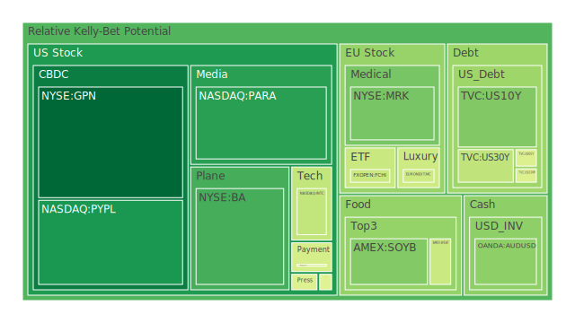
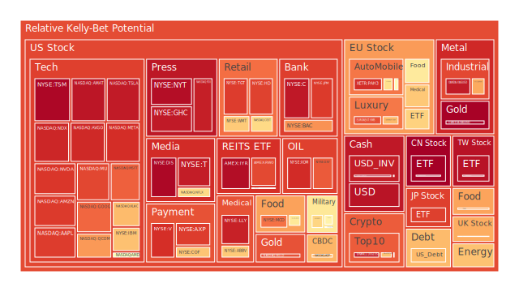
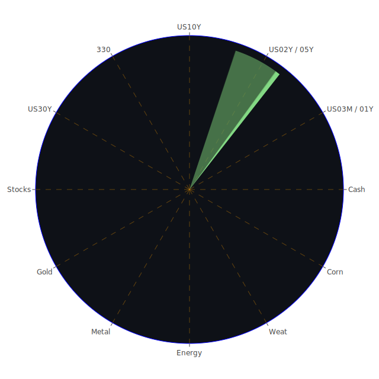

# 投資商品泡沫分析

在下列分析中，我將把你提供的三天資料（2025-08-27／28／29）與「FED經濟關鍵數據」以及「新聞現況」相互對讀。文內的「高／中／低」皆指相對風險強度或相對情緒壓力，並非絕對判斷；「上行／下行」僅為機率與結構的傾向，不保證結果。為避免任何先驗偏見，我把所有變化當作自然界連鎖反應，並盡量以「三位一體（正／反／合）」視角來解構每個資產的狀態、行為與可能路徑。

---

## 三大結構總覽：Spatial／Temporal／Conceptional 的「三位一體」骨架（以最少文字，表達最多意義）

**Spatial（空間場域：全球資金、產業鏈、地緣）**
正：美元流動性相對仍充沛（MMF資產高、銀行存款高、外資持有美債高），AI資本開支延續，美股權重指數（NDX、GOOG、AAPL、MSFT）高位運行。
反：聯準會資產負債表續縮、TGA走高、RRP走低，長端供給壓力仍在；歐洲奢侈（RMS、KER）與汽車（BMW、MBG）受中國與歐洲需求結構波動牽動；中東／烏克蘭等地緣新聞持續偏負面。
合：資金對「美國科技＋大市值現金流穩健」的偏好未改，但邊際資金對「防禦（貴金屬、部分醫藥、軍工）」與「供應受限主題（鈾UX1!、能源XOM/OXY）」呈現交替輪動；「美元走勢＋實質利率」同步塑形跨資產的相位。

**Temporal（時間序列：週期、節奏、均值回歸）**
正：曲線再陡峭（30Y-3M、20Y-3M為正、10Y-3M接近零），30年房貸利率由上月的6.89回落至6.56，對風險資產短期情緒有支撐。
反：FED總資產續降、美債發行節奏未緩；「公司層面體感」出現分化（HPQ正向，但NVDA「好但不驚艷」帶來估值想像修正；LLY在英國出貨暫停傳出供應干擾）；新聞面對消費、就業焦慮的負面敘事頻率仍高。
合：時間維度上，「利率回落—風險偏好彈升—估值再平衡」交替上演；短週期（D1）與中週期（D7/D14/D30）泡沫分數對比，可辨識階段性過熱、或轉折的初聲。

**Conceptional（概念場：經濟／社會／心理／博弈）**
正（經濟學）：實質利率趨緩＋AI帶動之資本支出故事仍強，風險溢酬需求略降。
反（社會學）：消費信心波動、地緣衝突與社會事件（示威、司法、治安）易觸發尾端風險定價。
合（心理學＋博弈論）：投資人對「龍頭確定性」的從眾心理與「跌不下去」的賭徒謬誤同時存在；博弈上，機構利用估值彈性與敘事落差進行再定價與對沖，形成「主升—震盪—篩選」的輪替格局。

---

## 美國國債（US01Y／US02Y／US05Y／US10Y／US30Y）

**現況與指標**：
10年殖利率約4.21（較上週4.29、上月4.42下降），2年約3.63（較上月3.87下降更明顯），3個月4.18。曲線再度接近平坦至略正（10Y-3M ≈ 0.02）。你給的泡沫分數顯示：US10Y近三日D1在0.27～0.35間（8/29：0.347），US30Y在0.44附近，短端（US01Y、US02Y）D1略高（例如8/29 US01Y D1=0.758），反映前端對政策預期的敏感度。

**三位一體（正／反／合）**：
正：通膨年增率2.71維持，FRA SOFR與OIS FFR指向政策利率區間的「溫和偏鬆」前景；長端供給雖大，但邊際需求仍在。
反：美債流通總量與長天期流通量偏高，財政供給壓力長期不散；外部政治對Fed人事與獨立性雜訊仍多。
合：長端利率「緩步下行、期間脈衝放量」的機率提升，但波動仍由拍賣節奏／財政路徑主導；短端對政策訊號極敏感，需防再通膨或風險事件造成的瞬時上衝。

**專業論述與結論**：
以D指標觀之，短端的D1偏高提醒「前端利率交易擁擠度」；長端D7/D14/D30並不極端，債市更像「高供給—漸回落利率」的拉鋸過程。對組合而論，長端可作股市波動的天然對沖，但需嚴控久期風險與供給事件窗口。

---

## 美國零售股（WMT、TGT、COST、KO、ULVR 亦屬消費必需品）

**現況與指標**：
WMT與COST泡沫分數中高（如8/29：WMT D1=0.689、COST D1≈0.662），TGT D1 8/29跳至0.890（前一日明顯較低），KO 8/29 D1≈0.519。新聞面，美國消費者信心下降與就業焦慮（多條強負面新聞）提供「需求端擾動」的陰影。

**三位一體**：
正：房貸利率月比下行＋名義工資仍具黏性，基本盤未崩。
反：消費者心理連續性走弱、價格敏感度上升；個別公司庫存／折扣策略左右邊際利潤。
合：零售龍頭維持韌性，但估值保守評價更有利；TGT的D1飆升提示短期擁擠與消息面波動交互。

**專業論述與結論**：
零售防禦性與規模效應依舊，但在AI熱潮吸走風險資本時，零售板塊的超額報酬期望受限。策略上，保留WMT／COST作防禦骨架可行，但應降低對邊際利潤放大的樂觀假設；TGT短線風險升溫，應以事件驅動短期交易對待而非長期配重加碼。

---

## 美國科技股（MSFT、GOOG、AAPL、AMZN、META、AVGO、NVDA、AMD、KLAC、QCOM 等）

**現況與指標**：
指數面NDX在8/29的D1仍高（0.926），權重股（MSFT、GOOG、AAPL、AMZN、META）D1多位於0.83～0.92高檔；半導體鏈（NVDA、AVGO、AMD、KLAC、QCOM）亦高位震盪。新聞面，NVDA「營收創新高但不驚艷」的標題疊加市場對「AI是否過熱」的反思，形成估值彈性收斂。

**三位一體**：
正：AI資本開支周期延續、算力基建與軟硬體生態擴張仍是主軸；龍頭自由現金流質量高。
反：邊際驚喜下降時，D1高檔意味擁擠度與獲利了結動作隨時啟動；對中國銷售限制、地緣科技制裁之消息敏感。
合：以「盈利體質＋產業關鍵位勢」區分優劣，龍頭仍優，但需接受「高估值—高波動—高分化」的新常態。

**專業論述與結論**：
泡沫分數的時間結構（D1高、D30略低）代表「短期擁擠＞中期共識」。建議在科技權重保持但不追高：逢事件波動做「核心倉低換高」、用避險（長端債或貴金屬）平衡組合β。半導體設備（KLAC）與先進封裝供應鏈具中長期稀缺性，但短線需接受估值回檔的清洗。

---

## 美國房地產指數（IYR、VNQ、RWO）

**現況與指標**：
IYR與VNQ的D1接近或超過0.96（高位），RWO亦偏高（8/29 D1≈0.873）。30年房貸由上月6.89降至6.56，殖利率曲線再陡峭，對估值有溫和支持。

**三位一體**：
正：利率下移帶來折現率改善，租金穩定子產業受惠。
反：商用不動產呆壞帳與違約率「相對高位」，結構問題未解；地區與資產品質分化大。
合：REITs短期情緒改善，中期仍取決於資產負債表修復與再融資成本，需精選子產業（資料中心、物流、必要零售）與資本結構健康者。

**專業論述與結論**：
當前D1高企是警訊：短線擁擠加劇，謹防利率掉頭或再融資消息衝擊。偏配置大盤型REIT的同時，以長端美債或黃金對沖「信用尾風險」。

---

## 加密貨幣（BTCUSD、ETHUSD、DOGEUSD）

**現況與指標**：
BTCUSD PP100 8/29約112,480，D1≈0.549；ETHUSD 8/29 D1突然升至0.705（相對前兩日明顯跳高）；DOGEUSD三日D1都在0.915～0.943極高檔。

**三位一體**：
正：風險偏好回暖時，加密受資金青睞；AI敘事、代幣化需求與某些監管放寬預期帶來邊際買力。
反：宏觀縮表、政治與監管新聞隨時變調；迷因類（DOGEUSD）極度情緒化，D1連續高檔明示「擁擠×脆弱」。
合：BTC具「數位黃金」屬性、ETH具「鏈上經濟中介」屬性，但短期估值全受流動性與事件驅動；策略上需嚴格倉位與多空對稱的風控。

**專業論述與結論**：
ETH D1的突升值得警惕：若D7/D14未同步上行，代表短線追價主導，易有回吐。BTC的中期D30約0.442～0.441區間，顯示整體風險尚可，但任何美元走強或實質利率上揚都會造成再平衡拋壓。迷因幣宜限定倉位上限並搭配期權或反向ETF對沖（若工具允許）。

---

## 金／銀／銅（XAUUSD、XAGUSD、COPPER）

**現況與指標**：
XAUUSD 8/29 PP100約3,415，D1=0.989（極高），D7 0.613；XAGUSD D1約0.945且D30≈0.946（高檔黏著）；COPPER 三日D1在0.74～0.93之間、波動加大。

**三位一體**：
正：實質利率降、曲線再陡＋地緣風險頻仍，貴金屬受捧；銀在工業與對沖屬性間取得放大效應；銅受能源轉型與電網升級長期需求支撐。
反：金銀短線D1極高＝擁擠明顯，利率／美元微幅反彈即可觸發回撤；銅受中國／歐洲工業動能影響度高。
合：貴金屬維持中長期多頭架構，但短期的位置不利；銅呈「長多短震」，適合逢回分批布局而非追高。

**專業論述與結論**：
「GOLD/OIL比」與「GOLD/COPPER比」均較去年高，說明風險對沖需求仍強。策略上：黃金維持核心對沖，但短線降低槓桿、採用價差或保守買權；白銀波動更大，建議倉位折半；銅在供需緊平衡下，宜等待D1回落到中性再加碼。

---

## 黃豆／小麥／玉米（SOYB／WEAT／CORN）

**現況與指標**：
SOYB D1穩定約0.349；WEAT D1在0.456附近；CORN 8/29 D1高至0.750（明顯升溫）。新聞面有「巴西大豆與Bayer在育種誘因上的爭端」，增加供應端不確定性。

**三位一體**：
正：氣候、地緣與關稅政策使農產品具備天然風險溢價。
反：全球需求韌性有限、替代作物輪作彈性存在；高D1下追價風險大。
合：以事件與天氣驅動的波段交易適合，長期配置應小比例、跨品種分攤。

**專業論述與結論**：
CORN D1的快速上衝是警訊；若無確證的供應收縮，建議以期權保護或以跨商品相對價差（如玉米／小麥）對沖突發波動。

---

## 石油／鈾期貨（USOIL／UX1!）

**現況與指標**：
USOIL PP100 8/29約64.16，D1≈0.713；UX1! 8/29 D1≈0.512，但D14/D30偏高（>0.61），顯示中期擁擠。新聞有「美國原油庫存下降支撐油價」與「印度關稅因素」，短期多空雜訊並存。

**三位一體**：
正：能源庫存週期、地緣風險與OPEC+政策維持油價底部韌性；數據中心與電網擴建帶來中長期電力需求，鈾受結構性供給限制而具韌性。
反：全球成長降速與效率提升抑制需求彈性；政策面（釋儲、補貼、稅費）對油價敏感。
合：油短多長擺盪、鈾中長期偏多但估值不便宜；策略上重視回檔買點與事件風險邊界。

**專業論述與結論**：
油在60～70的區間若成交密集、可當「通膨意外」的保險資產之一；鈾因中期D分數偏高，建議「定投小倉＋急跌才加碼」，避免追高。

---

## 各國外匯（EURUSD、GBPUSD、USDJPY、AUDUSD）

**現況與指標**：
EURUSD 8/29 D1≈0.976（極高）；GBPUSD D1≈0.541；USDJPY D1≈0.958；AUDUSD D1≈0.365。此組合昭示：美元相對走弱階段下，歐元與日圓的情緒位階偏高，短線有過熱疑慮；日圓D1極高同時JPN225指數D1亦高，呈現「股匯同熱」的短線張力。

**三位一體**：
正：美利率回落→美元指數承壓→歐／日／商品貨幣喘息。
反：若美國數據反彈或政治風險刺激美元避險，歐／日短線易回吐；日圓政策與干預預期引發擁擠交易的逆襲風險。
合：外匯宜採相對價差與期權策略，減少方向性賭注；避險時可用「美元多頭＋黃金」或「美元空頭＋股票」成對運用。

**專業論述與結論**：
EURUSD／USDJPY的D1超高提醒「短線極端」，若做多歐元或做空美元，建議配置保護性買權或縮小槓桿；日圓建議以期權參與而非槓桿式直線部位。

---

## 各國大盤指數（NDX、FTSE、GDAXI、JPN225、000300 及 TWSE:0050 對應台灣50）

**現況與指標**：
NDX高位（8/29 D1≈0.926），FTSE與GDAXI中高，JPN225高（D1≈0.886），中國000300在8/29 D1≈0.993（極端），台灣50（0050）D1≈0.961（極端）。

**三位一體**：
正：全球對AI供應鏈與高股息（英股部分）仍有偏好；利率回落改善風險偏好。
反：中國股市在政策與成長再平衡的「敘事與實際」落差中，短線拉抬易、續航難；台股受半導體周期高景氣，但估值與擁擠度明顯。
合：指數配置宜「核心＋衛星」：核心低β指數（或等權重）、衛星鎖定供應鏈關鍵環節，同時以長債或黃金對沖。

**專業論述與結論**：
對極端高D1的市場（如000300、0050），若無新的基本面驚喜，短期應以「風險減半＋逢回再議」處置；若要持有，務必搭配跨資產對沖。

---

## 美國半導體股（NVDA、AMD、KLAC、QCOM、TSM）

**現況與指標**：
TSM 8/29 D1≈0.980、D7≈0.978、D30≈0.988（長短期皆極高），NVDA與AMD、KLAC、QCOM也在高檔。新聞有「NVDA優於預期但驚喜有限」與「部分對中銷售限制」雜訊。

**三位一體**：
正：製程領先與AI加速需求長期成立。
反：估值與擁擠度過高、任何供應瓶頸與政策變數都能觸發獲利了結。
合：長多邏輯不變，但短期應降低槓桿、改採期權結構或配對交易（多先進製程／空落後製程或多供應鏈要角／空需求敏感邊角）。

**專業論述與結論**：
TSM的D矩陣接近滿格，技術面任何「高位十字」或「量價背離」都可能引發加速回檔；NVDA／AVGO等龍頭可保留，但以風險平價法控制倉位。

---

## 美國銀行股（JPM、BAC、C、COF、AXP）

**現況與指標**：
JPM、BAC、C 的D1在0.89～0.97之間（高檔），COF、AXP亦偏高。FED數據指「信用卡核銷率／逾期率」整體仍相對低，但「商用不動產逾期率」相對高。

**三位一體**：
正：利率回落改善長期資產價格與投資組合估值；交易與投資銀行收入有望受市場活躍度支撐。
反：商辦不動產與區域性風險仍在表內；監管與政治變數周期性再定價。
合：銀行龍頭更能穿越周期，但估值上行空間需配合資產品質與費用率的持續改善。

**專業論述與結論**：
目前D1高，對利多反應可能遞減；建議以JPM這類綜合龍頭為核心、搭配小部位COF／AXP做「消費信用景氣測溫」，並以長端債或黃金蓋掉信用尾風險。

---

## 美國軍工股（LMT、RTX、NOC）

**現況與指標**：
LMT、RTX、NOC 三日D1多在0.60～0.88之間；新聞面中東／東歐風險仍高、北約軍費達標的正面敘事存在。

**三位一體**：
正：地緣衝突與盟國軍費承諾提供穩定訂單。
反：估值在高利率時代相對不便宜、供應鏈延宕與預算週期性仍會造成波段。
合：長期偏多但不屬於高速成長，適合「穩定現金流＋事件波段」定位。

**專業論述與結論**：
可作組合「地緣對沖」之一，但D1升高時勿追；採逢低布局與股息累積的策略更佳。

---

## 美國電子支付股（PYPL、GPN、V、MA）

**現況與指標**：
PYPL在8/27 D1極高（0.978）後迅速降溫至8/29的0.224；GPN D1低至0.139；V與MA則在0.90附近居高。

**三位一體**：
正：非現金支付滲透率持續提高，跨境旅遊恢復亦有助交易量。
反：費率監管、競爭加劇壓縮邊際；宏觀消費信心回落影響量與質。
合：龍頭V／MA的寡占結構仍穩，PYPL／GPN更受產品與治理節奏影響，建議逢消息面分批操作。

**專業論述與結論**：
PYPL短線過度冷卻反而提供「反身性修復」的機會，但應小倉；V／MA適合中長期核心，但以估值緩步加碼而非追高。

---

## 美國藥商／醫藥（LLY、ABBV、MRK、JNJ）

**現況與指標**：
LLY D1約0.935（高），ABBV 0.691～0.914區間偏高，MRK與JNJ中性偏上。新聞有「LLY英國暫停出貨」類型事件對短線造成供應雜訊。

**三位一體**：
正：減重藥、腫瘤與免疫管線支撐長期獲利。
反：定價監管、供應瓶頸與競品消息都會擾動估值。
合：醫藥在宏觀放緩與地緣風險中具防禦屬性，但龍頭高估值下也有「好公司／不好價格」的張力。

**專業論述與結論**：
LLY維持長期創新敘事，但短線不宜過度集中；ABBV／MRK／JNJ可作分散配置的「醫療核心傘」，與科技形成風險對稱。

---

## 美國影視／媒體（DIS、NFLX、FOX、NYT、PARA、CMCSA）

**現況與指標**：
DIS三日D1逐步升至8/29的0.979（高風險），NFLX約0.661～0.797，FOX、NYT、PARA多在高位。新聞面「Fox與YouTube短期續約」降低不確定性，但消費信心走弱、廣告週期波動仍在。

**三位一體**：
正：串流變現修復與內容定價能力好轉。
反：體育轉播權成本高企、廣告周期不穩、工會與政策變數。
合：以龍頭＋利基內容並行，避免單點押注；DIS的高D1建議以期權或小倉波段。

**專業論述與結論**：
媒體產業「IP × 分發」的再定價仍在進行；策略上控倉、等待估值回到安全邊際再擴張。

---

## 石油防禦股（XOM、OXY）

**現況與指標**：
XOM 8/29 D1≈0.916、OXY≈0.849（偏高）。

**三位一體**：
正：油價底部韌性、回購與股息支持。
反：政策風向與碳成本敘事壓抑估值彈性。
合：作為通膨意外與地緣風險的對沖倉位，宜逢回布局，不追高。

---

## 金礦防禦股（以RGLD為例）

**現況與指標**：
RGLD 8/29 D1≈0.859，與金價D1極高相映成趣。

**三位一體**：
正：金價上行帶來槓桿式受惠。
反：成本通膨與開採風險、產國政策變數。
合：以小比例衛星倉參與，主避險仍以現貨或ETF為佳。

---

## 歐洲奢侈品（RMS、KER）

**現況與指標**：
RMS 8/29 D1≈0.862、KER≈0.718，D7/D14中高。

**三位一體**：
正：品牌資產與高端需求在高淨值客群中具韌性。
反：中國與歐洲的邊際消費力波動、匯率與旅遊流對銷售影響大。
合：奢侈品估值對長期品牌溢價仍敏感，但短期「量價×地區」變化易放大波動。

**專業論述與結論**：
若中國與歐元區數據轉好，板塊有彈性；目前高D1環境下以逢回小步買進更為穩妥。

---

## 歐洲汽車（BMW、MBG）

**現況與指標**：
BMW、MBG D1在0.55～0.71之間；受中國市場與電動化轉型節奏影響。

**三位一體**：
正：高端燃油車利潤仍強、電動化逐步成熟。
反：關稅與中國需求變化、產能與庫存週期。
合：以相對價差（歐洲高端 vs. 大眾化）或對沖（多零部件龍頭／空整車）策略降低宏觀波動暴露。

---

## 歐美食品與消費必需（KHC、ULVR、NESN、KO）

**現況與指標**：
KHC D1中高、ULVR／NESN／KO多在0.50～0.93區間。

**三位一體**：
正：現金流穩定、定價權逐步修復。
反：原物料成本／匯率與促銷折扣侵蝕利潤。
合：防禦地位猶存，但估值與成長皆有限；以股息再投資與低波策略持有。

---

# 宏觀經濟傳導路徑分析

1. **利率脈絡**：FED總資產下降＋長端供給高→中長端殖利率維持高位但近月回落→折現率下降對股債、REITs短線有利。
2. **美元—外匯**：美國利率下滑與風險偏好回升→美元承壓→EURUSD、USDJPY D1偏極端（短線過熱）；若美國數據反彈或政治雜訊升溫→美元回補→貴金屬與外匯同步脈衝。
3. **風險資產**：AI主線主導全球權重股與半導體鏈→邊際驚喜鈍化時，泡沫分數（D1）先升；再平衡觸發後，優質現金流公司相對抗跌。
4. **商品鏈**：油受庫存與地緣支撐、金銀受對沖需求與美元走勢牽動、銅受中長期電網與新能源敘事支撐；農產品受氣候與政策事件波動為主。

# 微觀經濟傳導路徑分析

1. **企業層面**：龍頭資產憑藉規模、現金流與議價能力穿越周期；中小企業對利率與需求的彈性更高，盈利波動擴大。
2. **估值機制**：當D1高、D7未跟進＝短線擁擠；當D30長期偏高＝結構性熱門；兩者疊加時，消息面小擾動即可造成跳空。
3. **庫存與訂單**：半導體鏈的訂單可視性、雲端廠的CapEx指引、零售的庫存週轉率與折扣率，是盈餘驅動的微觀關鍵。

# 資產類別間傳導路徑分析（可能的漣漪路徑示意）

* **美元↓ → 黃金↑／外匯風險資產↑ → 新興市場股債↑ → 大宗商品（銅、油）↑ → 全球工業鏈補庫存**。
* **長端利率↑（拍賣不佳） → 成長股估值↓ → NDX／半導體回檔 → 防禦（醫藥、黃金）資金回流**。
* **地緣事件↑ → 油、軍工、黃金↑ → 航空／旅遊↓ → 消費信心↓ → 零售股利差壓縮**。
* **政策關稅↑ → 歐洲／中國汽車與奢侈波動↑ → 歐元區指數震盪↑ → 美元避險回補↑ → 黃金短期震盪**。

---

# 「資訊航母」的三位一體（正／反／合）觀點綜述與歷史對照

* **經濟學視角**：當前格局近似「2019下半年＋2020後期」的混合體——利率下行初期對風險資產有利，但財政供給與地緣因素造成長端對通膨風險仍敏感。
* **社會學視角**：消費者信心弱化的新聞密集，與「名義所得成長與資產效應仍在」的現實拉扯，形似「2011\~2012歐債陰影期」：壓力敘事多、但市場在龍頭資產保護下維持韌性。
* **心理學視角**：高D1代表「即刻貪婪」與「怕錯過」；一旦出現不及預期，獲利了結即刻擴散，形似「2021年末的擁擠出清」。
* **博弈論視角**：機構在「高估值—高流動性—高分化」中採取動態配對：多核心現金流資產、空邊際敘事不足者；同時用長債／黃金作組合γ對沖。

---

# 風險對沖與投資組合機會（相位盡量120°、相關係數約-0.5 的構想）

> 下列為「三角組合」的概念對沖架構，每一組三資產的基本循環是：股權β ↔ 利率／債 ↔ 商品／避險（或外匯），目的在讓三者在宏觀衝擊下呈現接近120°的相位差與約-0.5的平均相關。實際相關度會隨樣本期與事件而變，以下屬於框架性設計。

**組合A：成長β—長端債—貴金屬**

* 成長β：NDX（或MSFT／GOOG代表）
* 長端債：US10Y（或長天期美債ETF）
* 貴金屬：XAUUSD（黃金）
  **邏輯**：科技估值對利率極敏；利率上行時成長壓力大，而黃金在美元與實質利率的拉扯中提供非線性對沖。歷史上在2020下半年、2023多次再通膨敘事切換時，三者常出現「此消彼長」的關係。

**組合B：能源—消費防禦—美元指數代理（USDJPY）**

* 能源：USOIL 或 XOM
* 防禦：KO／ULVR／NESN 中擇一
* 外匯：USDJPY
  **邏輯**：油價上行時輸入型通膨壓抑防禦估值，但避險時美元與日圓的方向各異，選USDJPY可捕捉美元避險回補；三者形成跨通膨—防禦—外匯的三角張力。

**組合C：半導體—REITs—白銀**

* 半導體：NVDA／TSM／KLAC 代表
* REITs：IYR／VNQ
* 貴金屬工業雙性：XAGUSD（白銀）
  **邏輯**：科技β與REITs對利率的敏感度方向不同（成長高估值 vs. 不動產折現率），白銀兼具工業與對沖屬性，常在科技回檔與利率下行時擔任橋樑。

**組合D：歐洲奢侈—歐元—銅**

* 奢侈：RMS／KER
* 外匯：EURUSD
* 工業金屬：COPPER
  **邏輯**：歐元區景氣改善→歐元走強→奢侈品海外銷售與旅遊消費回溫，同時工業動能帶動銅；若美元反彈，則三者同步回撤，彼此相關負向彈性加大。

**組合E：比特幣—長端債—黃金**

* 加密：BTCUSD
* 長端債：US10Y
* 黃金：XAUUSD
  **邏輯**：在全球流動性與避險敘事切換時，BTC與黃金有時同向、有時反向，但與債之間通常具風險平衡功能；此三者的非線性互動可降低單一尾風險。

---

# 兩兩相互驗證之篩選假設與漣漪效應傳導

1. **NDX（高D1） × US10Y（中性）：** 若長端利率意外上行，NDX回調機率上升；黃金D1極高時，可能先回吐再承接。
2. **XAUUSD（極高D1） × USD（弱）：** 美元反彈→金易短挫；若地緣事件升溫→金的下檔受限。
3. **TSM（極高D矩陣） × KLAC（高D）:** 產能／先進封裝消息引發整鏈共振；回吐時先殺高擁擠標的。
4. **IYR／VNQ（極高D1） × 商用不動產逾期高：** 任一負面信用事件→REITs貝塔放大；用長債或黃金墊底。
5. **USOIL（中高D1） × XOM（高D1）：** 油價區間震盪中，個股以回購＋股息抵禦估值回調；政策或庫存數據為關鍵觸發器。
6. **EURUSD／USDJPY（極高D1） × JPN225（高D1）：** 若美元回補或日本政策變化，股匯同向的擁擠交易易反轉，建議用期權框住風險。
7. **BTC／ETH（高D1） × DOGE（極高D1）：** 迷因幣的擁擠常先行轉弱並帶動主流幣短線回吐；反身性機制值得觀察。

---

# 投資建議：三種風格的最佳化配置（總和=100%，每類三個子項目與比例）

> 說明：以下配置以「風險分散＋相位差」為核心，所有比例僅為結構性示意，實務請依資金規模、衍生品可用性與槓桿規則調整。泡沫分數高者一律採「逢回—小步—對沖」原則；如遇重大事件，優先執行停損或風險降低。

## A. 穩健型（低波動、重對沖；目標在回撤可控）

**總配置：100%**

* **長端美債（US10Y／或長債ETF）40%**：受益於利率下行與避險需求；對沖股市回撤。
* **黃金（XAUUSD）25%**：雖短線D1極高，但以「核心對沖資產」小步建立，倉位控制與期權保護必要。
* **全球大型現金流龍頭股 35%**：

  * MSFT 12%（雲與AI現金流）
  * JNJ 8%（醫療防禦）
  * XOM 15%（能源分紅＋通膨保險）
    **理由**：債與金形成雙傘，龍頭股提供股息與現金流韌性；相位上股—債—金的互補度高，平均相關度偏低，有助降低組合波動。

## B. 成長型（穩健中求成長；保留對沖）

**總配置：100%**

* **科技核心 45%**：

  * NDX 18%（分散化科技β）
  * GOOG 12%（廣告＋雲＋AI堆疊）
  * KLAC 15%（設備稀缺性，但以事件波動控制倉位）
* **長端美債 20%**：對沖科技估值的利率風險。
* **工業與防禦 20%**：

  * ULVR 8%（必需消費現金流）
  * LMT 6%（地緣對沖）
  * RGLD 6%（金礦彈性衛星）
* **貴金屬與能源 15%**：

  * XAUUSD 10%（核心對沖）
  * USOIL 或 XOM 5%（通膨意外保險）
    **理由**：科技成長為主，但以債與貴金屬平衡；工業與防禦資產提供「非同向」的現金流來源。

## C. 高風險型（高β與非線性；強制風控）

**總配置：100%**

* **加密與高β科技 55%**：

  * BTCUSD 18%（相對穩定之加密核心）
  * ETHUSD 17%（功能性與生態）
  * TSLA 20%（高β且受利率與敘事影響大）
* **半導體供應鏈 20%**：

  * NVDA 10%（龍頭）
  * AMD 10%（份額彈性）
* **對沖組 25%**：

  * US10Y 10%（利率彈性對沖）
  * XAUUSD 10%（地緣／美元切換對沖）
  * USDJPY 5%（事件型避險；建議以期權參與）
    **理由**：在高β資產集中時，強化對沖是生存之本；遇到D1極端區，嚴格採分批與明確停損。

---

# 風險提示與泡沫警告（不可忽視）

1. **D1極高的群組（TSM、XAUUSD、EURUSD、USDJPY、IYR、VNQ、000300、0050 等）**：短期擁擠＝回撤觸發條件降低；需用期權或對沖減緩。
2. **加密幣中迷因性資產（DOGEUSD）**：連續高D1，情緒化與槓桿盤多，易出現V型下殺。
3. **長端供給與政策風險**：若美債拍賣不佳或財政擴張超預期，利率可快速上行，股債同跌風險存在。
4. **地緣與社會事件**：中東、歐洲、拉美等突發新聞可引發油金同漲、航運與旅遊相關承壓。
5. **估值再平衡**：NVDA等龍頭「好但不驚艷」即可能觸發估值壓縮；高估值板塊要準備承受10\~20%的技術性回撤。
6. **信用與不動產**：商用不動產逾期率相對高位；REITs短線D1高，信用事件會放大回撤幅度。
7. **外匯極端**：EURUSD、USDJPY的極端D1意味著短線波動可能放大，槓桿要降維。

---

# 結語：以「正／反／合」的連鎖自然觀，動態校準「相位」而非執著於單點預測

* **正**（順風）：實質利率下移、AI資本開支強、美元偏弱，推動股與商品的風險偏好修復。
* **反**（逆風）：FED縮表、長端供給壓力、消費信心新聞偏負；高D1群聚資產技術面脆弱。
* **合**（均衡）：以「三角對沖」建立相位差，讓股／債／金（或外匯／商品）彼此制衡；在每一次新聞擾動裡，把「情緒」轉化成「結構」，把「追高」改為「回撤吸納」，把「單點賭注」升級為「多資產相位工程」。

投資是一系列自然現象的累積映射，而非情緒的宣洩。接受不確定，擁抱相位差，用組合與對沖，使「結果」不必依賴「判斷的完美」，而是依賴「結構的穩健」。在你提供的數據中，最值得尊重的訊息其實很簡單：**D1極端＝短期擁擠＝波動在前**；接著，讓風險分散、讓久期與對沖說話。在這樣的框架裡，無論市場吹向哪個方向，你的投資船隊都能以較小的擾動，穿過更長的航程。

---

# 風險提示

投資有風險，市場總是充滿不確定性。本報告僅為研究觀察與結構性思考的分享，非任何形式之投資建議、保證或承諾。投資者應依據自身風險承受度與財務目標，做出獨立決策；若使用槓桿或衍生品，務必設定嚴格停損與風控。上述配置僅供參考，實務操作應考量滑價、稅務、合規與資金規模等因素，並持續依事件與數據調整。

 
Daily Buy Map:

 
Daily Sell Map:

 
Daily Radar Chart:

 
