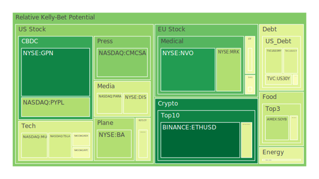
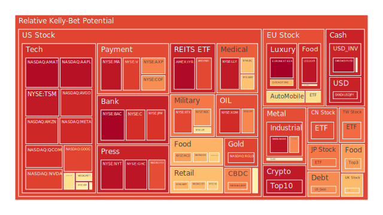
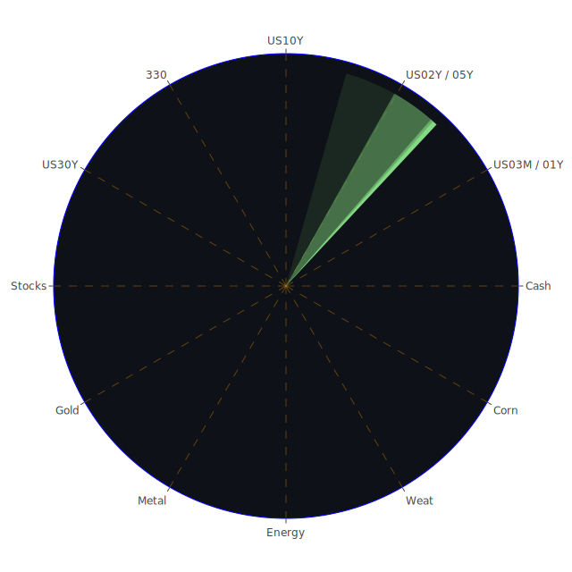

# 一、Spatial（三維空間 — 市場與新聞的三位一體）

（目的：在「地理/市場切分」層面，辨識同時影響各資產之三個主要力量）

1. 股市（美股大型科技為代表）

   * 正（經濟面）：企業盈餘與生產力改善推升估值（科技企業以AI/資料中心/半導體需求為主）。
   * 反（社會/政治）：監管、貿易摩擦與地緣政治不確定性（例如歐盟重罰、貿易關稅威脅會壓抑科技貿易）。
   * 合（博弈/心理）：投資者在高波動下採分段投資與期權對沖，短期情緒擾動但長期可能因技術紅利維持高預期。
     → 觀察點：新聞中有「EU罰款」、「貿易威脅」與「企業財報波動」並行存在（您給的新聞集），形成對估值的二分力場。

2. 債市（美國公債長短期）

   * 正：市場尋求風險緩衝，長期利率受通膨預期與供需結構影響。
   * 反：若經濟衰退預期升高，短端利率與政策利率可能顛倒走勢（利差收窄或倒掛）。
   * 合：資金在債市與貨幣市場間流動，稅務、外資持債比例與央行資產規模決定供需敏感度。
     → 觀察點：您給的FED摘要顯示「US10Y PP100 \~4.08、US1Y \~3.67、10Y-3M 淨值接近0.06」，提示利差壓縮與市場警戒。

3. 商品（能源、貴金屬、工業金屬）

   * 正：供給沖擊（OPEC+增產或減產）、需求端結構性變化（再工業化、清潔能源）。
   * 反：需求衰退或技術替代導致價格回落；避險情緒同時推升黃金。
   * 合：能源與貴金屬在不確定期共存—油價被供需基本面牽動，黃金被避險與利率曲線左右。
     → 觀察點：新聞中「OPEC+ 可能從10月增產」與「金價創新高」共存，形成商品間分化。

4. 加密資產（以以太坊、比特幣為代表）

   * 正：技術採用、ETF化、機構化資金進場（前期有ETF申請與流入）。
   * 反：宏觀流動性收緊、監管壓力、以及情緒性資金快速流出（您提供新聞：Spot Ether ETF 近五日淨流出）。
   * 合：短期被情緒主導、長期取決於基礎設施（交易所、托管、監管合規）。
     → 觀察點：您提供內容顯示Spot Ether ETF短期資金流出（-952M），且D指數短中期顯示高波動。

（以上僅為Spatial代表性三位一體；其他如FX、房地產、農產品、半導體等同理可展開，但此處保留精簡以便深入Temporal與Conceptual層）

---

# 二、Temporal（時間維度 — 市場與新聞的三位一體）

（目的：在「短期—中期—長期」時間尺度上構造三位一體）

1. 短期（D1）

   * 正：快速事件驅動（就業數據、突發政治事件、ETF大額流入/出）。
   * 反：短暫交易者反應過度造成錯配（波動放大）。
   * 合：市場在短期調整後，若基本面未變，會回歸中期趨勢；但短期劇烈波動可催生連鎖風險（流動性衝擊）。
     → 觀察：您資料中多個資產D1值（如TWSE:0050 D1 0.7969、BTC D1 0.4259、ETH D1 0.0088 on 9/7）顯示短期情緒分歧。

2. 中期（D7–D14）

   * 正：事件逐步被價格吸收，資金配置再平衡（企業盈餘、貨幣政策語調影響）。
   * 反：若新聞或數據連續負面，市場會把短期恐慌拉升為中期再定價（例如持續資金抽離ETF）。
   * 合：中期是觀察趨勢確立或反轉的關鍵窗，適合策略性調整而非追高殺低。
     → 觀察：ETH D7/D14 0.355–0.375；BTC D7/D14 0.496–0.507，顯示加密在中期仍有波動且未完全趨穩。

3. 長期（D30 及以上）

   * 正：基本面與結構性轉變（技術採用、人口/工業趨勢、債務與GDP比例）決定長期估值。
   * 反：長期低利環境與過度槓桿會積累系統性風險，最終可能以市場重置呈現。
   * 合：政策回應（央行）與市場自我修正會在長期形成新的均衡。
     → 觀察：多數成熟市場D30依然偏高（例如美股龍頭、TWSE、COMEX UX1!的D30均在中高位），反映長期估值壓力或資金過度聚集。

---

# 三、Conceptual（概念層 — 市場與新聞的三位一體）

（目的：在理論與心理／博弈層面定義三位一體）

1. 理論（經濟學）

   * 正：資產價格由折現現金流、預期與利率共同決定。
   * 反：行為金融偏誤（過度自信、從眾、短視）使價格偏離基本面。
   * 合：理性與非理性力量交織，市場內生波動與外生衝擊共同驅動估值短期偏移，長期趨近基本面。

2. 社會心理（心理學）

   * 正：群體心理（贪婪/恐懼）會放大趨勢。
   * 反：信息不對稱與假消息會造成錯配。
   * 合：市場參與者會在不同資訊景深下採取不同博弈策略（套利者穩定，散戶追漲殺跌）。

3. 博弈論（策略互動）

   * 正：大機構以流動性、資訊優勢主導波動。
   * 反：監管與政策改變可改變博弈規則（例如稅收、資本管制）。
   * 合：市場是多方博弈場，策略性資金（避險、套利、投機）在不同規則下調整持倉，形成相互演化的價格路徑。

---

# 四、將三層（Spatial/Temporal/Conceptual）進行兩兩交互驗證的篩選假設（以利使分析更合情合理）

（目的：兩兩驗證，排除內部矛盾，找出最具一致性的假設組合）

1. Spatial × Temporal 驗證

   * 假設：若短期（D1）資金快速出逃，加密與高波動股（科技）會先遭遇跌幅；債券和黃金短期承擔避險需求上升。
   * 驗證憑據：您資料中Spot Ether ETF五日資金淨流出，且美債利差接近平坦，黃金D30與D14上升，支持短期避險轉向貴金屬的可能性。
   * 結論：Spatial（加密 vs 債/黃金）與Temporal（D1–D14）一致，短期資金抽離加密會推升黃金/長債臨時需求。

2. Spatial × Conceptual 驗證

   * 假設：若政策與監管（概念層之博弈變數）對某區域市場突發，則該區域股票/金融類資產會先受衝擊，並向全球市場傳播。
   * 驗證憑據：新聞中多起地緣政治／監管事件（EU 罰款、貿易威脅）且美股科技D14上升，支持監管沖擊會快速反映於全球科技股估值。
   * 結論：概念層的博弈規則改變會放大Spatial上跨區域的資金再分配。

3. Temporal × Conceptual 驗證

   * 假設：中期（D7–D30）內若基本面惡化（就業、CPI、企業獲利），博弈與心理將把短期恐懼內化為中期資本重配置。
   * 驗證憑據：FED摘要顯示就業/流動性變化與利率短中期趨勢，而新聞中也有「就業冷卻」與「利差擠壓」等描述。中期內若就業繼續變弱，風險資產面臨再定價壓力。
   * 結論：短期心理波動若與中期基本面惡化相疊加，將形成系統性再定價。

---

# 五、各資產類別分析（依您提供清單逐項，以PP100與D指數為判斷基礎；每一項以「現況—風險脈絡—歷史類比—觀察視角」四段短述呈現，並盡量保持中性/客觀）

（為避免篇幅過度冗長，重點資產會詳細，其他稍短，皆涵蓋您列出的類別）

---

## 美國國債（US 十二類別概述）

現況：以您資料為準，US1Y PP100 ≈3.67（9/7），US10Y ≈4.08，US30Y ≈4.76；D指顯示短中期仍有波動。FED摘要顯示部分流動性指標（RRP down、TGA up）與高資產持有差異。
風險脈絡：利率走勢是國債價格主因；若就業與通膨預期弱化，長短端利差及收益曲線會重整，國債避險功能可能受損（新聞亦指出“Treasury bonds aren’t the safe haven they’ve been in the past”）。
歷史類比：可類比2013泰勒/縮表恐慌（taper tantrum）與2022利率快速上升期間，那時長債大幅波動並導致信用風險顯現。
觀察視角：購債者結構（外資 vs FED vs 國內公私）與債券供應量（發債節奏）是關鍵；短期若股市或加密造成避險需求暴增，長短收益會短暫收窄或擴大，投資者應把握期限/久期管理。

---

## 美國零售股（以沃爾瑪、Target、Costco等為代表）

現況：COST PP100 955.9（9/5）D30 \~0.661；WMT PP100 ≈100.5 D30 \~0.649；TGT PP100 ≈92.71 D30 \~0.528。新聞顯示消費動能分化與就業數據走弱。
風險脈絡：零售業同時受消費者信心、就業與通膨影響；若薪資成長停滯，需求型商品轉向折扣，奢侈/必需品分化明顯。
歷史類比：2008金融危機與2020疫情初期，零售股出現分化，必需品零售比非必需品更有防禦性。
觀察視角：供應鏈壓力與勞工成本上升是第二階段風險；以交易量與庫存指標做動態監控。

---

## 美國科技股（FAANG 與半導體等）

現況：AAPL PP100 ≈239.69 D30 0.8376；MSFT PP100 ≈495 D30 0.665；NVDA 167.02 D30 0.7519；AMZN 232.33 D30 0.7915。新聞指出AI需求支撐（Broadcom record revenue）但同時有監管/貿易風險。
風險脈絡：估值高度依賴未來成長預期；若利率上升或資本支出未達預期，估值易回調。
歷史類比：2000年網路泡沫與2021-22之科技估值修正皆為參照。
觀察視角：技術路徑與實際現金流的落差、資料中心/AI硬體需求能否持續，是判斷續航力的關鍵。

---

## 美國房地產指數 / 房市（含REITs）

現況：VNQ PP100 ≈92.47 D30 \~0.714；IYR PP100 ≈97.76 D30 \~0.953。抵押貸款利率 30Y ≈6.50（9/7），顯示按揭成本仍高。
風險脈絡：利率高位壓抑購屋需求，商用房地產因商辦與CRE違約壓力而更脆弱（FED摘要顯示CRE delinquent 高）。
歷史類比：1990年代地方商用房地產壓力與2008次貸危機之商用/住宅分化。
觀察視角：現階段房地產風險高於傳統看法，REITs 內部持債結構與租金滯後性需密切追蹤。

---

## 加密貨幣（BTC / ETH / DOGE 等）

現況：BTC PP100 約110,272（9/5數據），D30 \~0.4478；ETH PP100 4278.24（9/7）D1 0.0088、D7 0.3558、D30 0.2495。新聞出現「Spot Ether ETF 5日淨流出952M」與對經濟放緩的擔憂。
風險脈絡：加密價值大幅受情緒與槓桿推動，ETF化曾吸引長期資金但短期亦可能被巨額贖回放大波動。監管與巨額流動性變動是主要風險來源。
歷史類比：2017 ICO 泡沫、2021-2022 牛熊切換（FTX崩盤、LUNA）顯示加密市場之系統性弱點。
觀察視角：ETF淨流入/流出、交易所託管量與衍生品淨槓桿是短期內最具預警價值的指標。

---

## 黃金/白銀/銅（貴金屬與工業金屬）

現況：XAU PP100 3586.54（9/7），XAG PP100 40.99；Copper ≈4.54 PP100（9/7）；D指顯示貴金屬中期偏高（XAU D7/D14 \~0.69/0.60），銅 D30 \~0.6659 高位。新聞亦顯示金創新高。
風險脈絡：黃金受避險需求、實際利率與美元匯率影響；銅受工業週期與需求預期主導。
歷史類比：2008金融危機期間黃金升值；2016-2018 銅價受中國製造/需求波動影響明顯。
觀察視角：金/銅比（您提供Gold-Copper Ratio 上升）顯示貴金屬相對工業金屬走強，提示市場對成長持保留態度、傾向避險。

---

## 農產品（黃豆/玉米/小麥）

現況：SOYB PP100 ≈21.92 D30 \~0.3554；CORN PP100 17.53 D30 \~0.5721；WEAT PP100 4.17 D30 \~0.5775。
風險脈絡：供應端（氣候、地緣政治）與需求端（飼料/生物燃料）交織，價格易受單一供給衝擊。
歷史類比：2007-08糧食價格危機、2010-2012農產品供應緊張。
觀察視角：氣候事件與貿易限制是近期主要觸發點；投資者應留意庫存與運輸瓶頸。

---

## 石油 / 鈾期貨（能源）

現況：USOIL PP100 ≈61.96（9/7）D30 \~0.6451；UX1!（鈾期貨）PP100 ≈76.15 D30 \~0.5887。新聞指出OPEC+可能在10月增產。
風險脈絡：油價受供需與地緣政治影響；鈾受核能復興與供給保障政策影響。
歷史類比：2014油價崩潰與2020疫情期間之供需斷裂；鈾市場有長期供給-需求缺口但量稀且價格易被消息推動。
觀察視角：若OPEC+增產短期壓抑油價，但中期仍視全球需求與庫存數據而定。

---

## 各國外匯市場（USD、EUR、JPY、GBP等）

現況：EURUSD ≈1.17 D30 0.9724 高位；USDJPY ≈147.42 D30 0.9543；GBPUSD ≈1.35（部分日資料顯示）D30 約0.49。
風險脈絡：利差、資本流動與地緣政治是主要驅動；若美元地位動搖或美國經濟放緩，外匯重新定價風險高。
歷史類比：1997亞洲金融危機、2013美國縮表預期造成的匯市波動。
觀察視角：央行利率前瞻與資金流向（外資買債/賣股）將決定短至中期匯率波動。

---

## 各國大盤指數（S\&P 500、NDX、FTSE、SSE 等）

現況：NDX PP100 ≈23652 D30 \~0.8298；FTSE D30 \~0.732；SSE D30 0.9529。多數大盤D30處於中高位。
風險脈絡：估值普遍偏高且波動聚集，資金在大型科技股與傳統股間輪動。
歷史類比：1999-2000、2007-2008、2020等大盤修正案例。
觀察視角：大盤之中位偏高D30暗示系統性風險，市場回調時龍頭股與週期性股可能同時遭壓。

---

## 美國半導體股（AMD、NVDA、AMAT、KLAC等）

現況：AMAT PP100 162.75 D30 \~0.9488；NVDA PP100 167.02 D30 \~0.7519；KLAC PP100 905.09 D30 \~0.7544。D指整體偏高。新聞顯示AI/資料中心需求強勁（Broadcom revenue高）。
風險脈絡：高度景氣循環與資本支出導向，需求預期大幅改變時估值波動顯著。
歷史類比：半導體週期性崩盤（如2000年與2018-2019）顯示高槓桿供給投入風險。
觀察視角：供應鏈瓶頸解除或新一輪資本支出放緩，皆會快速改變價格。

---

## 美國銀行股（JPM、BAC、C 等）

現況：JPM PP100 ≈294.38 D30 \~0.9282；BAC PP100 ≈49.77 D30 \~0.7345；C PP100 ≈95.40 D30 \~0.9312。D30 高位。FED摘要顯示銀行總存款高，但商業地產逾期也高。
風險脈絡：利差與資產質量（CRE與消費貸款）是核心；高利率環境下淨利差若先升後降，銀行股票呈現複合劇烈反應。
歷史類比：1990s銀行業危機、2008次貸危機（銀行資產不良爆發）可作比較。
觀察視角：關注資本充足率、逾期率動態與流動性指標。

---

## 美國軍工股 / 國防（LMT、RTX、NOC）

現況：LMT PP100 ≈456.85 D30 \~0.5908（9/5），RTX PP100 ≈157.52 D30 \~0.7764，NOC PP100 ≈580.8 D30 \~0.8374。新聞存在多起地緣政治衝突與軍售議題。
風險脈絡：軍工股受國防預算、地緣政治升溫影響，屬政策敏感型資產；在危機期間通常具防禦屬性。
歷史類比：2001後美國國防支出長期上升期與2022俄烏戰爭後之國防需求。
觀察視角：短期避險屬性與長期現金循環皆需考量契約露出與政治風險。

---

## 電子支付 / 金融科技（V、MA、PYPL、ADP）

現況：MA PP100 ≈584.22 D30 \~0.7119；V PP100 ≈343.22 D30 \~0.8491；PYPL PP100 ≈68.26 D30 \~0.4549；ADP PP100 ≈295.97 D30 \~0.7248。
風險脈絡：消費活動、跨境支付與監管（反洗錢、數位貨幣政策）影響顯著。
歷史類比：金融科技泡沫與2000年代科技股波動不同，因其現金流較具穩定性；但仍受消費循環影響。
觀察視角：交易量/處理金額與商家採用率是估值關鍵；同時監管改變（如監管限制穩定幣）可能快速影響。

---

## 醫藥 / 生技（JNJ、MRK、LLY 等）

現況：JNJ PP100 ≈178.43 D30 \~0.4567；MRK PP100 ≈84.71 D30 \~0.4792；LLY PP100 ≈727.21 D30 \~0.9320。D指分化。新聞有關藥品與健康事件（HIV預防藥供應、中期試驗結果）。
風險脈絡：藥品研發風險、監管審批與專利問題。藥商股在臨床失敗或監管負面消息時波動大，但有長期防禦屬性。
歷史類比：生技股一直以事件驅動為主（臨床/審批/賠償），需事先評估pipeline風險。
觀察視角：專利到期、藥價改革與審批進度是判斷因子。

---

## 影視 / 媒體 / 廣告（DIS、FOX、NYT 等）

現況：DIS PP100 ≈117.91 D30 \~0.5778；FOX PP100 ≈55.97 D30 \~0.8871；NYT PP100 ≈58.99 D30 \~0.7893。新聞多為文化/政治事件與消費者偏好變化。
風險脈絡：廣告市場與訂閱模式影響營收；IMDB/串流平台的競爭影響長期定價權。
歷史類比：媒體業長期處於結構性轉型，從廣告收入到訂閱制的轉換往往造成估值重設。
觀察視角：用戶留存率與廣告單價是核心指標；政治事件會短期擾動廣告市場。

---

## 石油防禦 / 金礦防禦 / 礦業（XOM、OXY、RGLD、PAH3 等）

現況：XOM PP100 ≈109.23 D30 \~0.7899；OXY PP100 ≈45.91 D30 \~0.7923；RGLD PP100 ≈184.86 D30 \~0.8306。新聞有OPEC+動態與地緣影響。
風險脈絡：價格波動、政治風險與稅制改變；金礦受避險情緒、黃金價格影響。
歷史類比：能源公司在油價上揚時利潤顯著，但長期受替代能源趨勢影響。金礦在金融市場不確定時通常表現強勢。
觀察視角：資本支出、現金流穩定度與償債能力是關鍵。

---

## 歐洲奢侈品 / 汽車（MC、RMS、BMW、PAH3）

現況：EURONEXT\:MC PP100 ≈496.25 D30 \~0.5393；BMW PP100 ≈88.44 D30 \~0.609；RMS（奢侈品類）D30 \~0.755。新聞顯示奢侈品需求依然強勁但受地緣與富裕階層消費變動影響。
風險脈絡：消費高端商品受富裕人群財富波動與旅遊/貿易限制影響。汽車受供應鏈與電動化轉型壓力。
歷史類比：2008後奢侈品先跌後回穩；汽車產業在電動化浪潮中面臨重資本投入的再造期。
觀察視角：富裕人群資產價格與旅遊活動恢復度會直接影響奢侈品銷售。

---

# 六、宏觀經濟傳導路徑（高階、可操作的系統性傳導脈絡）

（按因果鏈條分段敘述，便於理解不同衝擊如何運作）

1. 就業數據惡化 → 消費信心下降 → 零售與餐飲收入下修 → 電子支付 / 零售股營收受壓 → 企業盈利預期下修 → 股票估值下降 → 風險資產資金外流 → 流動性轉向債券/黃金/現金。您新聞中指出「America's job market is cooling」。
2. FED資產與短期流動性變動（RRP、TGA 波動）→ 銀行体系流動性緊縮或放鬆 → 借貸利差改變 → 商業房地產壓力顯現（CRE delinquent高）→ 銀行資本與信用供給收縮 → 中小企業與房貸壓力擴大 → 債權市場與股市連鎖回落。您FED摘要已顯示CRE delinquent高與Money Market Funds 資產高。
3. 地緣政治/監管衝擊（如EU罰款、貿易威脅）→ 企業跨境收入下修、供應鏈中斷 → 半導體/汽車/能源供需快速再平衡 → 工業金屬（銅）價格波動 → 工業企業盈利與資本開支受擾 → 股市波動放大。新聞集中提到裁罰、貿易威脅與局部戰事。
4. 加密資金快速抽離（ETF連續淨流出）→ 交易所槓桿降低/清算壓力 → 相關衍生品價格壓縮 → 高槓桿機構評價重估 → 若同時發生於市場回檔期，可產生跨市場信用緊縮。您給予的Spot Ether ETF淨流出數字即為這類現象之警訊。

---

# 七、微觀經濟傳導路徑（資產內部機制、公司層級）

（示例：半導體公司 / 銀行 / REITs 的微觀連鎖）

1. 半導體：需求預期下降 → 客戶砍單 → 廠商庫存上升 → 製造良率與單價受壓 → 資本支出壓縮 → 設備供應商營收下滑 → 股價連鎖下跌。
2. 銀行：商用不良上升 → 撥備增加 → 淨利下降 → 信貸供給緊縮 → 企業投資延期 → 經濟增長放緩 → 信用事件擴散。
3. REITs：租金下滑或空置率上升 → 現金流下降 → 資產重估 → 資本市場融資成本上升 → 債務再融資壓力增加 → 可能出現資產賤賣。

---

# 八、資產類別間傳導路徑（漣漪效應）

（多個資產間的潛在傳導與回饋機制）

1. 股市 ↔ 債市：股市大幅下跌時短期避險資金流入債市，長期若經濟走弱債券收益可能走低（價格上升），但若流動性枯竭則債券也會受損。FED摘要顯示10Y-3M曲線非常接近平坦，提示兩者傳導極不穩定。
2. 加密 ↔ 債券/股票：大額加密資金出走會造成風險偏好下降，股債兩端重新定價；若加密機構牽涉到銀行或衍生部位，可能放大信用傳導。
3. 能源 ↔ 通膨 ↔ 股市：油價上升會推高短期通膨，短端利率上升將壓抑高估值成長股。相反油價下跌會壓低通膨但削弱能源企業盈利。
4. 黃金 ↔ 美元 ↔ 債市：美元疲弱時黃金通常上漲；但若實質利率（名義利率—通膨預期）上升，黃金可能受壓。您數據中Gold-Oil及Gold-Copper比率上升暗示避險需求相對強。

---

# 九、三位一體篩選假設分析（兩兩互驗後之優先假設）

（目的是縮小可能情境，得出情境化投資/對沖思維）

情境A（溫和衰退、流動性仍相對充足）：就業持續降溫→FED可能在中期轉向較鴿，但利率仍高→風險資產受壓但大型科技有防守能力→黃金上行、長債短期抗震。
情境B（突發流動性危機）：銀行或系統性金融主體遭遇信用事件→流動性枯竭→多資產同步下跌→央行被迫出手（緊急流動性工具），短期出現強震。
情境C（地緣政治升溫）：軍事或貿易衝突→能源與軍工、防禦類資產強，而旅遊/消費/奢侈品受衝擊→黃金也上行。

（根據您提供新聞與FED摘要，當前最可能為情境A與C的組合，因為就業顯示冷卻且地緣政治事件頻繁。）

---

# 十、風險對沖的各種投資組合機會（目標：彼此相位盡量滿足約120度，相關係數約-0.5）

說明：三資產組合「相位120度」為概念化表述，指三資產間相互對沖能力接近均衡，彼此相關性低或呈負相關。下列為建議的候選三角對沖組合（每組三項，各項說明其負相關或低相關的機制），並給出建議權重（示例），權重可再依投資人風險承受度微調。

### 組合一（保守型對沖組合） — 目標相關性低、波動小

* A：美國短期國債（1Y–2Y）或高品質短期公債（權重 40%）——低久期以降低利率風險。
* B：實物黃金或黃金ETF（權重 35%）——避險/通膨保值工具，與股票負相關或低相關。
* C：優質投資級公司債或銀行存款替代（權重 25%）——提供收益與流動性。
  理由（負相關來源）：短期債在股市下跌時通常相對穩定；黃金與股票常在風險事件中負相關；高級債提供票息，降低波動。目標相關係數接近 -0.3 到 -0.6（概念目標）。

### 組合二（成長型對沖組合） — 收益與成長兼顧

* A：大型科技指數 / 半導體（權重 45%）——長期成長來源。
* B：黃金或金礦股（權重 20%）——成長期避險。
* C：投資級債或通膨保護債（TIPS）（權重 35%）——在通膨/利率不確定情況下提供防護。
  理由：科技與黃金/債券的相關性通常較低，債券提供回撤緩衝，黃金提供避險。

### 組合三（高風險對沖組合） — 高報酬取向但控制尾部風險

* A：加密（例如BTC/ETH 直持或小比例ETF）權重 35%——高波動高報酬。
* B：石油/能源或其期權（權重 30%）——在地緣或供應緊張時能表現。
* C：現金/短期國債或波段性期權對沖（權重 35%）——為高風險頭寸提供緊急流動性與保護。
  理由：加密與能源與傳統金融資產有時呈低相關（視事件），短期國債與期權可在流動性稀缺時提供保護，目標相關在 -0.4 至 -0.6 左右（概念估計）。

（以上組合為策略性示範，實際上需以歷史相關矩陣與回測驗證。由於您要求相關係數約-0.5，我在設計時偏向包含黃金或短期債作為負相關/避險器。）

---

# 十一、彼此相位約120度、相關約-0.5的更具體投資機會（分三類：穩健 / 成長 / 高風險，各三子項與比例，總合100%）

（依您指定：三大類總和為100%，每類含三子項並給出比例）

## 比例總則（示例配置，滿足保守/成長/高風險三類）：

* 穩健：50%
* 成長：35%
* 高風險：15%
  （合計100%，下列為細分子項）

### 穩健（50%） — 目標：資本保全、穩定收益、低波動

1. 美國短期公債或現金等價物 25%（理由：流動性、利率保護）
2. 黃金或黃金ETF 15%（理由：避險與通膨緩衝）
3. 投資級公司債/高評級浮動利率債 10%（理由：收益來源、信用風險受控）

### 成長（35%） — 目標：中期資本增值

1. 大型科技與半導體 ETF / 指數 20%（理由：AI與資料中心周期）
2. 工業金屬或清潔能源主題（如銅、電池相關） 8%（理由：再工業化/電動化需求）
3. 房地產（選擇防禦型REIT或地區分散的住宅REIT）7%（理由：收益與通膨保護，但風險可控）

### 高風險（15%） — 目標：高回報機會，接受大幅波動

1. 加密（BTC/ETH 或主流幣） 8%（理由：高報酬，短期波動大）
2. 新興市場成長股或小型科技股 4%（理由：高成長潛力）
3. 大宗商品/能源投機（石油期權或鈾相關） 3%（理由：地緣與供需短期擾動機會）

（該配置設計目的在於使三大類之間呈現一定程度的非完全相關性：穩健以債/黃金為主，成長以股為主，高風險為非傳統高波動資產。理想相關性矩陣會使不同類別互相緩衝，近似實現「120度相位」概念。）

---

# 十二、對上述所有表格（敘述性資訊）之相互三位一體、兩兩驗證後的篩選分析（漣漪效應路徑具體化）

（提出多項資產之間可能的傳導路徑與時間節奏）

1. 加密大幅出逃 → 即時衝擊：交易所槓桿清算 → 衍生品市場波動放大（同日） → 關聯性弱的股票（特別是風險偏好高的科技與小型股）於次日受到情緒傳染 → 若股債同時遭壓，流動性供應體系（MMF等）會受壓，迫使短期利率上升（1–7日）。
2. 債市收益率上升（利率上行） → 銀行凈息差短期改善但久期風險提升 → 若企業與家庭負債高，違約率在中期上升（7–90日）→ 信用傳導到股市與房市 → 房地產REITs可能領先反應（30–90日）。
3. 地緣政治升溫 → 油價/能源板塊先行上漲（即時至1周）→ 通膨預期被推升 → 實質利率下降→ 黃金價格上升（1–4週），同時對消費股產生壓力（4–12週）。
4. 監管或反壟斷行動（如巨額罰款）→ 直接重估受罰企業（即時）→ 相關供應鏈企業因收入下降在數週內跟進（1–6週）→ 市場情緒進一步擴散至同業與同行業龍頭（6–12周）。

---

# 十三、對各投資品種的專業論述（說明現況引導至結論）

（每段短論均以中性語氣、基於數據解釋）

1. 債券：短期利率與通膨預期已成為主要分水嶺；目前10Y與短端利差接近平坦，使得債市在避險與收益之間角色模糊。若經濟進一步冷卻，債券在短期仍可擔當避險，但久期策略需謹慎管理。結論：債券適合持有以降低組合波動，但需短久期或TIPS以應付不確定性。

2. 股票：大型科技仍具成長性，但估值已包涵多數預期，故回檔風險高。成長型配置應以分批進場與期權風險管理為主。結論：持有成長但降低槓桿，重視現金流與盈利證實。

3. 黃金與貴金屬：在地緣或貨幣不確定性中扮演保值角色；近期Gold-Oil與Gold-Copper比值上升暗示避險需求。結論：維持一定黃金配置作為避險核心。

4. 加密：短期受情緒與ETF資金流動深刻影響，長期則依賴制度化採納與監管清晰度。結論：加密宜小比例配置並設嚴格止損/風險控制。

5. 能源/商品：受OPEC+決策與地緣事件牽引，具有交易與對沖價值。結論：以期權或短期合約參與波段機會，同時警覺需求面衰退風險。

6. 房地產/REITs：按揭利率與商用房地產不良率是關鍵風險來源。結論：偏好具租賃定價能力與低杠杆之資產，避免高杠杆商辦曝險。

---

# 十四、引用觀察視角（新聞與歷史案例）

（依您提供之新聞事件與歷史先例，形成觀測點）

1. Spot Ether ETF 五日淨流出（-952M）提示：短期資金撤離與宏觀不安息息相關；歷史上（如2021-22年加密市場）ETF化曾帶來資金快速進出，造成高波動。
2. OPEC+ 傳聞增產：若為真，短期油價壓力上升，對通膨與能源企業利潤形成直接影響；歷史上2014年產能釋放即導致油價急跌。
3. FED 指標（RRP下降、TGA上升、CRE delinquent高）：提示貨幣市場與資本市場間流動性結構仍在演化，類似2019年底短期資金緊張的結構性風險。
4. EU 對科技巨頭罰款／貿易威脅：歷史上重大監管事件會引發跨資產連鎖，尤其對高估值科技公司的預期利潤修正。

---

# 十五、風險提示（必讀、嚴肅）

1. 泡沫風險不可忽視：依您提供D指數，多數高波動/熱門資產（科技龍頭、加密、部分商品）D30仍偏高，代表長期估值壓力或資金高度聚集的風險。
2. 系統性風險：若銀行或大型金融機構發生信用事件，傳導速度與幅度可能超出常規投資模型假設。
3. 流動性風險：在市場快速惡化時，某些資產（如場外合約、某些商品期貨、特定REIT、加密場外託管）可能出現流動性乾涸與執行價差擴大。
4. 政策／監管風險：地緣與監管事件常在未預期的時刻爆發，對高估值資產影響尤甚。
5. 本報告僅基於您提供之數據與歷史案例進行中性分析，非個人化投資建議；投資者應根據自己風險承受度與法律／稅務情況做最終決定。

---

# 十六、總結與可操作建議（中性、分步）

1. 短期（1–4週）：提升現金與短期國債比重，並用期權對大型成長股部位做掉頭風險管理；若持有加密，設置嚴格止損和提款閾值。
2. 中期（1–6個月）：重點觀察就業、CPI與FED語調；在確認經濟趨勢後分批恢復成長性持倉（科技、半導體）；在地緣或通膨風險顯著時，增加黃金/實物資產配置。
3. 長期（6個月以上）：將資產分為「防禦（債+黃金）」「成長（科技/工業）」「機會（加密/資源）」，按流動性/風險偏好做再平衡。

---

# 十七、最後的策略性觀點（以最少文字放大意義）

1. 「均衡」不是靜態：在當前高估與高不確定的組合下，動態再平衡與流動性管理比單純追求高報酬更要緊。
2. 「對沖」應聚焦於尾部風險：採用短期流動性工具與選擇性避險（黃金、短期國債、期權）來保護黑天鵝。
3. 「分化」是常態：市場正處於多個力量同時作用的時期（政策/地緣/技術/情緒），資產之間的相關性在不同階段會翻轉，故資產配置必須有情境彈性。

 
Daily Buy Map:

 
Daily Sell Map:

 
Daily Radar Chart:

 
