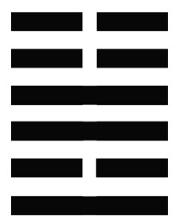

<figcaption>丰卦，離上震，象徵獲得最大的各種資源，處於亨通的最顛峰，要如何保持，必須要靠平常德性的修養，有知人用人之明，便可保亨</figcaption>
  

# 導言:
丰卦被安排在55卦，從1加到10，也剛好是55，象徵有最大的權勢，有最大的資源，有最多的人民，要如何使成果能豐碩? 除了在物質上要豐富，更要在精神上要丰裕，達到廣土眾民，國富民良。這通常不是一個帝王能夠做到的，要當一個領導者，不要老計較有多大權力，有多大的資源，必須知人用人。雜卦傳，丰，多故也。多年不見的老朋友都來找你了，你就豐盛了。卦辭說，丰，亨，王假之，勿憂(德要夠，不必憂慮)，宜日中(日正當中，但是一剎那就準備開始向西移了)，諭示如果德薄很快就滅亡了。能否知人用人，才是自己的德行，德行越厚，保丰保的越久。
# 彖曰:
## 豐，大也。明以動，故豐。王假之，尚大也；勿憂，宜日中，宜照天下也。日中則昃(ㄗㄜˋ)，月盈則食，天地盈虛，與時消息，而況於人乎？況於鬼神乎？
彖辭，丰，大也。明以動(持續光明正大，才能持續很久)，故丰。上卦震，下卦離(光明)。王假之，尚大也(責任就是讓他丰大)，意味著要持續做強，做大，讓他有價值。勿憂，宜日中，照天下也，以豐沛的德來普照天下，真心誠意，大公無私，照顧你所能照顧的人。日中則昃(太陽向西傾斜)，月盈則食，日正當中表示，準備要下山了，滿月以後，月亮逐漸要消失了。天地盈虛，與時消息，而況於人呼，況於鬼神呼? 天地的盈虛變動，盈就是充滿，虛就是虛空，天地的變化隨著一定的時節消亡生息，有消必有長，有起必有落，有盛必有衰，有生必有死，大自然都如此，更何況是人呢? 如秦始皇，了不起的人物，也無法千秋萬代傳下去，任何人事物，在如日中天之時，注定向衰敗轉化。
# 象曰:
## 雷電皆至，豐，君子以折獄致刑。
大象，雷電皆至，上震下離，丰。形要丰盛，君子以折獄(明斷訴訟)，致刑(以刑法整治壞人)。要保丰要有一套方法，對於被你領導的人，要有一套管制的方法，避免老百姓因開始富足，但德行不符而開始作亂。
丰卦表示到達飽和狀態，無法維持只能延長而已，自古以來所有帝王想要永遠不死，沒有人做得到。
要不斷的充實自己的智慧，要利用所有的時間，充實自己的德行，唯一要改變你自己的，就是自己的德行，就擺脫了輪迴的迷信。天底下沒有一定的，最後只求一個心安理得，死而無憾，任何事情都不是自己所能計較與控制的，憂也沒有用。
順治皇帝，憂局面保不久，就趕快傳位給康熙，當時才八歲，康熙頂了60幾年也完了。看開，人要提前了解，自己最後的結局是甚麼。要如何保持到最後心平氣和，很自然地接受他。要記得，得人者昌，有了豐功偉業，要找幾位賢明的高士從旁協助自己，但是輔佐大臣也是人，有各種歸妹(各種公事與個人私情之間的權衡)的變化。一方面要啟用輔佐大臣，一方面要與輔佐大臣對抗。康熙有智慧，選繼承人，或許不是選雍正，雍正可能活不了幾年，是看上乾隆，看上最能夠保丰的孫子，也說不定。
即使有個好的開始，清朝再厲害，280年而亡。歷史上最長的朝代周朝800年，但是春秋戰國以後也整個就不見了，這些都是大自然的規律使然，而況於人呼，而況於鬼神呼，天地人鬼神都是同一個規律。選接班人，要重視品德還有理念，人最難掌握的就是理念，接下來看一下六爻為何都充滿憂慮。
丰卦六個卦裡面，有三陰三陽，數量是調和的，但是陰的在上面陽的在下面，陰乘陽，一般在易經裡面未必好。
# 初九:
## 遇其配主，雖旬无咎。往有尚。
## 雖旬无咎，過旬災也。
遇其配(匹敵)主，初九與九四，硬碰硬，雖旬無咎，往有尚，照這種方式往前走，是我們崇尚的。英雄惜英雄，有行事的原則，在丰卦裡面，反而是好的開始，未必要先打好關係，如滿朝文武共同為國家堅持原則，國家才有希望。按照原則把工作做好，紮紮實實的表現，才是基層人員，該有的態度，如果遇到94也是大公無私，講理的人，就會丰。雖旬無咎，過旬災也，當初九與九四德性匹配均衡，則無咎，若初九德性超過九四，則會有災難。
# 六二:
## 豐其蔀，日中見斗，往得疑疾，有孚發若，吉。
## 有孚發若，信以發志也。
太陽日正當中的時候，被日蝕了。丰其蔀(用來遮蔽光線的東西)，日中見斗，往得疑疾(受到冤枉)。有孚發若(用你自己的誠信使得真相大白)，吉。九二建議若受到冤枉就認了，不要去申辯抗爭，吃虧就是占便宜。堅持自己的誠信，就會吉。有人冤枉你，是你的福氣，吃虧就是占便宜，沒有受到冤枉，人家怎麼知道你受到委屈?人家知道你吃虧，就開始彌補你了，對自己來說是求之不得的機會，所以是吉。
# 九三:
## 豐其沛，日中見沬，折其右肱，无咎。
## 豐其沛，不可大事也；折其右肱，終不可用也。
和上六是相應的，是唯一相應的兩個爻，看看爻辭是怎麼寫的。丰其沛，日中見沫，折其右肱，無咎。九三是陽的，而且當位，現在已經過了62的階段，日蝕快結束了，慢慢就要光明了，那為何斷了右臂，無咎? 這是在講屈原，屈原被楚王壓迫，搞到投河自殺，屈原無咎，百姓每到端午就會紀念屈原。這種作法如同楚王把自己的右臂砍掉，有咎。最後的努力不見得有志就能伸張，因為上六也是昏暗的，要靠上六來跟你合作，改變狀況，很難。但是要自己知道，就算做不到也盡力了，因為是上面的倒楣不是你倒楣。丰其沛，不可大事也。折其右肱，終不可用也，有能力的人受到嚴重的阻礙，這時候只能明哲保身，所以無咎。最黑暗就是最光明的前夕，最光明就是最黑暗就要到來。
# 九四:
## 來章，有慶譽，吉。
## 豐其蔀，位不當也；日中見斗，幽不明也；遇其夷主，吉行也。
丰其部，日中見斗，遇其夷主，吉。九四不當位，不居中，所以不會去忌妒賢明，上卦震的主力，就是九四，一心一意要做事。如果九四和初爻相應，反而不是好事，由於上位昏暗，初九跟九四一起堅持原則，而且九四也不會去忌妒賢良，這時候吉祥就會到來。初九和九四不相應，且德性一樣的好，這樣反而會很配合，互相配合互相欣賞，一起認真做事，帶來吉祥。
# 六五:
## 射雉，一矢亡，終以譽命。
## 六五之吉，有慶也。
來(引來，從六二引來)章，有慶譽，吉。62跟65照理來說是不相應的，這邊也跟初九和九四一樣，六五本來是糊里糊塗，但是懂得知人用人，得人者昌，被六二警醒，所以吉。不用壓制他忌妒他，人用的好，是自己的福氣。
# 上六:
## 豐其屋，蔀其家，闚其戶，闃其无人，三歲不覿，凶。
## 豐其屋，天際翔也；闚其戶，闃其无人，自藏也。
丰其屋(房子很多間，非常的丰)，蔀其家(整個家好像被陰霾壟罩)，窺其戶，聞其無人，稍微敏感的人都跑掉了，知道要出事了。三歲不敵，長久不露面，是怕被偷怕被搶，怕別人綁跳，也很可能被軟禁起來了，凶。深藏孤立，不和人家來往，不知道你是甚麼回事，自招凶險。丰其屋，天際翔也，找不到棲息的地方，沒有人氣就沒有功能，好像一隻鳥在天上孤孤零零地在飛，窺其戶，聞其無人，自藏也。自己把自己封閉，如同宅男，是人家不願意跟你互動還是生怕跟別人互動? 如果你有朝一日，做到賢明的高士都不願意跟你接觸，都袖手旁觀看起怎麼辦的時候，就知道丰快沒有了。一個豐功偉業是得人者昌的結果，大家同心協力，丰才能維持的久，不要一間房子很大，但是沒甚麼人，沒有人氣，無從維持下去。歷史上的指標人物就是唐明皇李隆基，剛剛就任的時候是英名的不得了，等到安史之亂，急救求遠兵都沒用，諾大的房子，沒有人可用。要如何從小培養自己的接班人? 讓他有正確的理念，讓他知道這種狀況，有責任要繼續去找高明的人來幫忙，而不是靠我們自己。不要我們家跟別人不一樣，生怕小孩出去學壞，變成溫室的花朵，搞到人家本來想跟你合作的，都走掉了，這樣就會變成要走上旅卦(顛沛流離後東山再起)的道路。
保不了丰，就難免顛沛流離，那要如何東山再起呢? 下回就來繼續探討，旅卦，行旅之道。