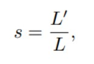

# 導言:
[Yarn HuggingFace](https://huggingface.co/NousResearch/Yarn-Mistral-7b-128k)
[YaRN](https://arxiv.org/abs/2309.00071)

本篇精選熱點論文，基於[ROPE (Rotary Position Embeddings)](https://arxiv.org/abs/2104.09864v4)改善插值方式，讓模型可以在短序列(4K Tokens)進行訓練，接著在長序列(128K Tokens)僅做少數微調，甚至無須微調，就能達到泛化到極長輸入序列的能力，讓Context Window可以吞下一整本雜誌，生成困惑度足夠小的內容!
在寫這篇的同時Chatgpt4-turbo宣布能將輸入序列長度擴增到128K，應該有用到本篇所提出的方法，此方法使得LLM的效能還有應用彈性極大化，需要好好的學習一下。

# 論文取得成果:
論文取得最長Context window輸入的Mistral 7B小模型的成就，值得我們花一些時間去了解要如何做到，以下顯示使用論文手法在Mistral-7b-128k 可以維持極小的困惑度。

<p align="center"></p>
<p align="center">讓Mistral 7B小模型能夠吞下一整本雜誌(128K Tokens)，維持低的困惑度，是本篇論文最大的貢獻</p>

用傳統的方法訓練一個128K輸入長度的語言模型，相對於4K輸入長度，需要耗費約1024倍 `(N^2 = S^2 = 32^2 = 1024)`的[記憶體複雜度](https://medium.com/@lukas.noebauer/the-big-picture-transformers-for-long-sequences-890cc0e7613b)，還需要蒐集一堆128K的資料來進行預訓練，才能取得足夠高頻，充滿觀點與認知的生成模型，可行性非常低。

# 從ROPE到YaRN:
為了徹底搞懂這篇重磅論文，理解Train short, test long的底層原哩，我們無法避免的要從ROPE旋轉(絕對/相對)位置編碼開始講起，然後講解最直觀的PI插值手法，以達到Test long的目的，最後剖析YaRN(本篇論文)插值手法，是如何依照[NTK(神經切線核)](https://blog.csdn.net/a358463121/article/details/111828753)的理念，來調整插值的公式，內容多且豐富，請多看幾遍，一回生二回熟。

## RoPE概念:
<p align="center"></p>
<p align="center">Query & Key 的定義，以及原本的Attention Softmax公式，不包含旋轉位置編碼之前的樣子</p>

<p align="center"></p>
<p align="center">等效上，ROPE把Input Token Positon "m" 利用旋轉矩陣，旋轉角度的形式編碼進去</p>

ROPE的核心概念，利用 query & key 所需的內積運算，把絕對位置m & n，和相對位置 m-n 都編碼出來，這裡的m 和 n是輸入Token / Embedding 線性排列的位置，藉由[推導](https://zhuanlan.zhihu.com/p/359502624)(包含遠程衰減性的分部求合法證明)，可以得知query & key 需要化成複數尤拉公式的形式來滿足需求:

<p align="center"></p>
<p align="center">query 和 key 的相對位置 m-n，做完內積以後可以自然的被 g 編碼進去</p>

簡而言之，就是把絕對位置與相對位置，編碼映射到尤拉單位圓上面，變成角度以及角度差，取實部(Re)以後，Cosine / Sine就會很自然地跑出來了，fq 與fk 可寫成以下形式:

<p align="center"></p>
<p align="center">角度的設計採用Sinusoidal，經分布求合法證明，具有遠程相關性衰減性質，m & n 距離變大，相關性逐漸震盪衰減</p>

<p align="center"></p>
<p align="center">Query & Key 的絕對位置藉由以上的形式進行映射，角度可以內插也可以外插，用來應對更長的Context Windows，模型總參數量可以保持不變。目前內插方法效果比較好。</p>

不難發現，使用旋轉位置編碼的表達方式以後，fw Column-wise在Inference的時候，可以直接進行插值，也就是對角矩陣，往裡面插更多的特徵值，藉此能映射更多的位置，擴展輸入的位置編碼範圍大小，這樣就能搞定更長的輸入Context Window (L)，只需要輕微的Finetune，甚至無須Finetune，就能保持差不多的困惑度水準，回答長序列的問題。內插會改變位置的Embedding映射角度密度，讓長序列多出來的位置，都能夠用原本學習到的模型參數使用，用這種方式來達成Train short, Test Long。

## Position Interpolation 概念:
由於語言模型通常是使用較小的固定的上下文長度進行預訓練的(4K長度以下)，由於4K長度以上，運算所需記憶體複雜度很高，因此很自然地會問如何通過在相對較少的數據集，對4K長度以上進行微調來擴展上下文長度，於是有了位置內插，[PI法](https://arxiv.org/abs/2310.00576)的嘗試:

<p align="center"></p>
<p align="center">位置內插法(PI) 的作者發現，使用內插法比外插法能取得的效果上限比較高</p>

<p align="center"></p>
<p align="center">Chen et al., and kaiokendev Position Interpolation (PI) 方法，擴張context length 長度以超越 pre-trained 長度的限制</p>

<p align="center"></p>
<p align="center">S為內插擴展倍數，S>1，我們希望S越大越好</p>

將PI法公式改寫成以下格式:

<p align="center"></p>
<p align="center">方便作者後續討論YaRN的改動</p>

可得:

<p align="center"></p>
<p align="center">由於S>1，新的m / s 使得角度間隔變小，等效上內插了許多新的位置編碼</p>

## 週期波長的概念:
如果原本的Token長度已經遠大於能滿足θd所對應到的週長λd (L >> λd)，作者認為可以不用在Hidden (Embedding) Dimension d的位置做任何插值的動作。如果 `L <= λd`，則要避免在d的位置做外插。

<p align="center"></p>
<p align="center">可以算出在特定位置的波長需求，對應到最短的Token數目，讓Rotation可以完整的旋轉2𝝿</p>

<p align="center"></p>
<p align="center">d越大，λd呈現指數增加</p>

## 改良PI位置內插法:
- 高頻資訊需要更多的角度差，Model更容易識別到，不需要額外插值，這也就是L >> λd的情況。這樣能確保困惑度指標可以得到優化，反之低頻資訊則不用這麼多的角度差，所以在低頻資訊處做更密的插值。原本的NTK-aware公式已經能夠起到調節插值數目的作用，但是會導致部分的位置d出現外插的情況，使困惑度表現變差。

<p align="center"></p>
<p align="center">NTK-Aware Method，llama2團隊為了避免有外插的現象，直接把b'設到100萬</p>

- 如果波長太短，則不要內插，如果波長是L的某個倍數以上則使用原本的等距內插，如果波長介於其中，則使用法一的低頻較密插值，然後避免出現NTK-aware在部分位置d出現外插拉高困惑度的狀況，這就是本篇最大的貢獻，**NTK-by-part方法**。

<p align="center"></p>
<p align="center">NTK-by-part 的設計思路說明</p>

<p align="center"></p>
<p align="center">本篇論文最大的貢獻，提出NTK-by-part的插值方法，取NTK-aware法的優點，並且解掉所有會影響困惑度的因素</p>

- 每一次Inference，針對任意輸入Token長度進行scale factor的調整，這樣就能讓模型在不用額外Finetune的情形下，可以應對各種不同的Token輸入長度。這方法也被稱為Dynamic Scaling，用固定的一組輸入參數，藉由內差角度，可以滿足各種不同的輸入長度。

<p align="center"></p>
<p align="center">可以固定scale factor 如法(1)進行少量微調。也可以用Dynamic Scaling 如法(2)，不須微調，適用於NTK-Aware / NTK-by-part</p>

- 引入校正參數修正分母，主要的原因是經由scaling插值，softmax的輸入範圍變大，需要把它除回來，以取得最低的困惑度學習成果​

<p align="center"></p>
<p align="center">t 值的選定需要跑大量的模型訓練，來取得最佳的設定</p>

<p align="center"></p>
<p align="center">作者用2K長度，scale factor (s) = 8與各種t值，統計具有低困惑度的數量，找到最佳的t值設定公式</p>

<p align="center"></p>
<p align="center">scale factor (s) = 8帶入，為1.208，與上圖相符。</p>

<p align="center"></p>
<p align="center">作者用2K長度，scale factor (s) = 8與各種t值，做大量訓練，找到最佳的t值設定公式</p>

# YaRN困惑度改良成果:
Dynamic-YaRN `=` Dynamic Scaling + NTK-by-part 比 Dynamic Scaling + PI的困惑度還要低，顯示NTK-by-part 背後的改良原理的正確性高與效益極大。

<p align="center"></p>
<p align="center">4K長度訓練，Dynamic scaling (等同不做額外Finetune)，可以看到YaRN提出的 NTK-by-part 效益很大</p>

<p align="center"></p>
<p align="center">Mistral 8K預訓練，放大16倍，輸入達128K長度，取得及低困惑度結果，可喜可賀</p>

<p align="center"></p>
<p align="center"></p>
<p align="center">YaRN在長序列的評估分數沒有下降太多，普遍比llama2 使用的NTK-aware，還有PI法還要好，顯示本篇的NTK-by-part改良思路的正確性與有效性。</p>

<p align="center"></p>
<p align="center">YaRN可以在較小的訓練樣本下，達到8K預訓練，16K長度測試最低的困惑度，顯示本篇的NTK-by-part改良思路的正確性與有效性。</p>

# 先驗知識:
[三分鐘搞懂語言模型能力指標，Perplexity (困惑度)](https://vocus.cc/article/6548d47cfd897800016011fc)

[三分鐘內由上帝視角理解Positional Encoding](https://vocus.cc/article/65411787fd89780001fba216)

[開啟一切可能性的鑰匙，8K Text Embedding Model](https://vocus.cc/article/653f2833fd897800010165a8)

# RoFormer論文參考:
[RoFormer](https://arxiv.org/abs/2104.09864)

# 引用:
```markdown
@misc{peng2023yarn,
      title={YaRN: Efficient Context Window Extension of Large Language Models}, 
      author={Bowen Peng and Jeffrey Quesnelle and Honglu Fan and Enrico Shippole},
      year={2023},
      eprint={2309.00071},
      archivePrefix={arXiv},
      primaryClass={cs.CL}
}

@misc{su2022roformer,
      title={RoFormer: Enhanced Transformer with Rotary Position Embedding}, 
      author={Jianlin Su and Yu Lu and Shengfeng Pan and Ahmed Murtadha and Bo Wen and Yunfeng Liu},
      year={2022},
      eprint={2104.09864},
      archivePrefix={arXiv},
      primaryClass={cs.CL}
}

@misc{chen2023extending,
      title={Extending Context Window of Large Language Models via Positional Interpolation}, 
      author={Shouyuan Chen and Sherman Wong and Liangjian Chen and Yuandong Tian},
      year={2023},
      eprint={2306.15595},
      archivePrefix={arXiv},
      primaryClass={cs.CL}
}

ROPE推導原創​
https://kexue.fm/archives/8130

ROPE推導引用​
https://zhuanlan.zhihu.com/p/359502624

NTK神經正切核理解​
https://blog.csdn.net/a358463121/article/details/111828753
```
