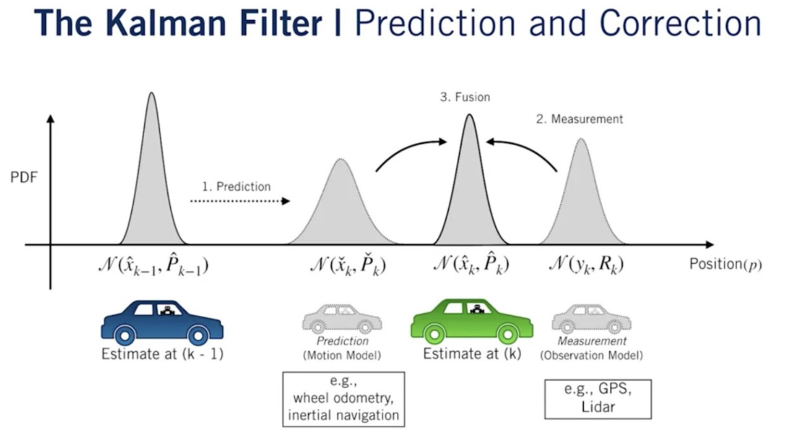
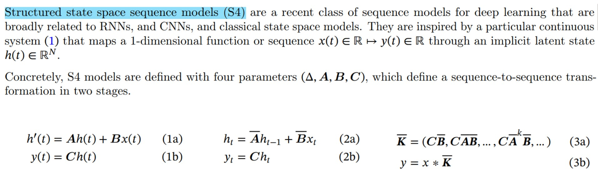
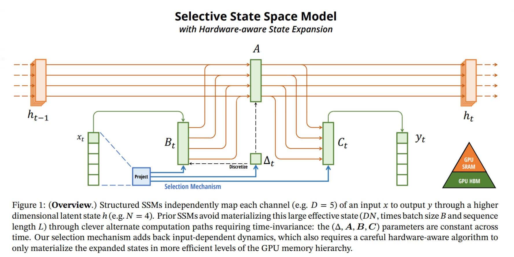
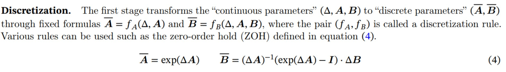
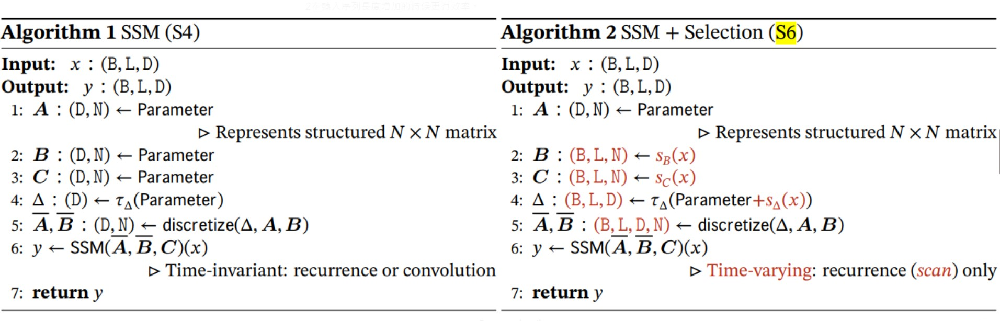
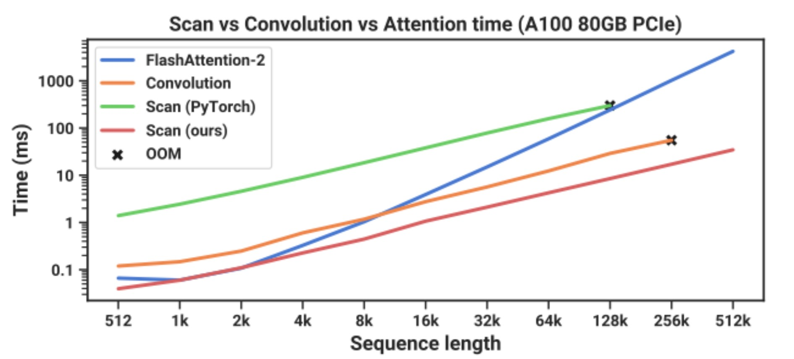
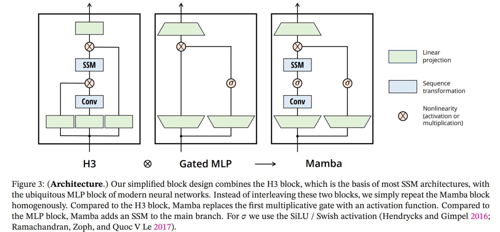
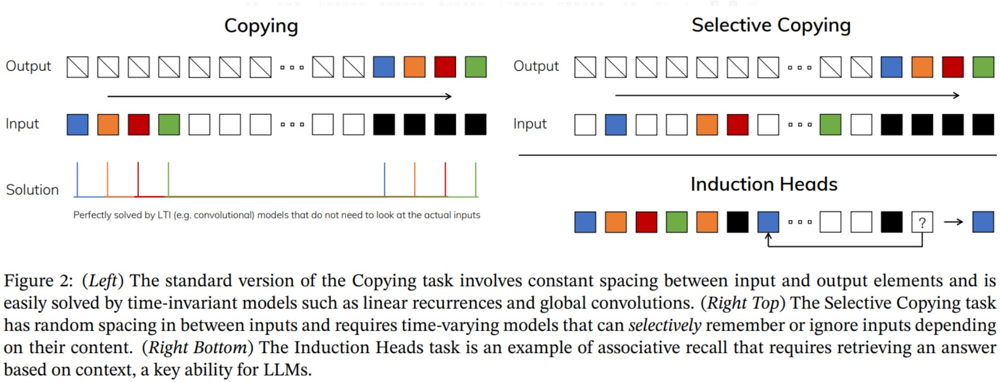
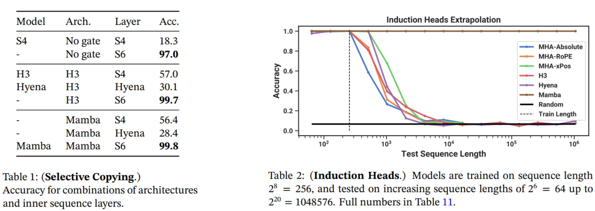

# 導言:
[Mamba](https://arxiv.org/abs/2312.00752)

本篇文章為大家導讀近日火熱的Mamba Paper，新聞標題說它是Transformer的繼任者，是否真是如此? 讓我們一起一探究竟，本文著重介紹論文前半部分。

# 開發動機:
Transformer架構十分有效但是效率不高，尤其是當輸入Context 長度M增加，計算複雜度會呈現M平方增長。這激發了眾人的興趣，尋求新的架構來改善這個痛點。最常見的方式莫屬SSMs (State Space Model)，用Recurrence (RNN) 或是 Global Convolution (CNN) 的方式來降低計算複雜度。在Mamba之前的論文，SSMs無法在小型測試取得能與Transformer匹敵的結果，於是催生了本篇作者的架構創作。

# 技術亮點:
和Transformer採用完全不同的套路，擺脫有效但沒運算效率的問題，整體來說有下列的技術特點:

1. 計算複雜度為***O*****(輸入序列長度M)**，小於Transformer的O(輸入序列長度M2)
2. 受 **Kalman Filter** / 其他SSMs 啟發，設計架構，充滿想像空間
3. 能學習與輸入相關的**Δ參數**，用來**跳過不相干的輸入**
4. 加速運算，**無Attention Layer** 與 **MLP** (3 or more layers) Blocks
5. **State** 存放在GPU SRAM (**高速容量小**)，**參數與輸出/入**放在HBM (**低速容量大**)
6. 在各種模態的模型應用測試皆達到SOTA的水準，大模型應用有待時間驗證

# 技術弱點:
1. Recurrent架構，連續迭代容易產生誤差累加，需要較高的浮點數精細度
2. 缺乏注意力機制的副作用需要在大型模型中進行驗證

# Mamba架構:
主架構使用S4 (**S**tructured **S**tate **S**pace **S**equence Model)，輸出yt和狀態有關，而狀態和輸入Xt與前一個狀態ht-1有關，和Kalman Filter的運作模式有異曲同工之妙，Kalman Filter 在工程上被廣泛用在陀螺儀/雷達/GPS/類比/數位訊號取樣上面，登月以及洲際導彈都沒有缺席，使用這種結構，讓人對於Mamba的成效充滿想像空間。

<p align="center"></p>
<p align="center">著名的Kalman Filter，在狀態預測和實際測量中，利用K (Kalman Gain)找尋平衡點，決定要信賴狀態預測或是實際測量多一點</p>

<p align="center"></p>
<p align="center">A，B參數可以調節輸入x與狀態h，個別的重要程度，做差異性的狀態更新</p>


S4架構讓Mamba可以持續重複迭代下去，其中Δ參數的部分，可以讓模型學習跳過與目標不相干的內容，增加除了LTI (線性非時變系統) 以外的泛用度。

<p align="center"></p>

# 為什麼0階保持寫成這樣的公式? 
dh(t)/dt = Ah(t) + Bx(t) 的解，可以寫成以下形式 (解微分方程，代入ZOH假設而得)

連續表達式為:

h(T) = exp(A * T)h(0) + ∫0Texp(A * (T - τ)) dτ * B * x(0)

離散表達式為:

h[T] = Ad * h[0] + Bd * x[0]

比對兩者表達式，可以知道Ad = exp(A * T), Bd = ∫0Texp(A * (T - τ)) dτ * B

對exp(A * (T - τ))做泰勒展開一階近似可得:

exp(A * (T - τ)) ≈Ⅰ + A * (T - τ) 代入 Bd 可得:

Bd = (T + A * T2 / 2) * B ​≈ T * B (假設T2夠小可忽略)

近似Ad = Ⅰ + A * T，可得 A * T = Ad -Ⅰ代入Bd

**Bd = A-1 * (Ad -Ⅰ) * B**

<p align="center"></p>

S6架構 (S4 +Selection / Scan ) 適用於時變性系統，加入與輸入x相關的條件參數，讓模型可以根據輸入，來決定是否要跳過，使用Scan的方法進行訓練，使用自定義的Scan訓練方法 (用Cuda C寫成，[開源於此](https://github.com/state-spaces/mamba/tree/main/csrc/selective_scan)) 比Torch內建的更有效率，也比Flash Attention-2在輸入序列長度增加的時候更有效率。

<p align="center"></p>
<p align="center"></p>
<p align="center">輸入長度增加對於Scan來說時間成本是一次方，對於Flash-Attention來說是二次方，使用作者自定義的Scan訓練方法，可以達到SOTA的訓練時間</p>

為了降低訓練時超長序列RNN (Recurrent Neuron Network) 上面的梯度消失的影響，使用Resnet的連接方式，SSM的Δ參數與輸入x條件參數，與 [SiLU (Swish)](https://paperswithcode.com/method/silu) 激活函數。

<p align="center"></p>

# Mamba基準測試:
本論文用三種常見的Task對基礎模型做評估，因為傳統的RNN / SSMs對於Copying任務表現得最好，Selective Copying / Induction Heads這兩個任務則普遍性的比較差，藉由測試，可以知道S6 (+Scan & Selective) 相對於S4，擴展了怎樣的應用可能。

從Selective Copying小型測試結果可以得知，Sigmoid Gate(SiLU / Swish Activation) 有其重要性，可以選擇性遺忘，然後S6架構的Selective & Scan機制，進一步的提升性能至99.8%測試準確度。

從Induction Heads小型測試可以得知，S6是否具有LLM使用的MHA (Multi-Head Attention) 水平，從測試結果來看，Mamba可以Train Short，Test Long 到1M Test Sequence以上，這是現有MHA YaRN / RoPE 尚無法達成的能力範圍。

<p align="center"></p>
<p align="center"></p>

# Mamba 開源程式:
[Mamba](https://github.com/state-spaces/mamba)

# 引用:
```markdown
@misc{gu2023mamba,
      title={Mamba: Linear-Time Sequence Modeling with Selective State Spaces}, 
      author={Albert Gu and Tri Dao},
      year={2023},
      eprint={2312.00752},
      archivePrefix={arXiv},
      primaryClass={cs.LG}
}
```