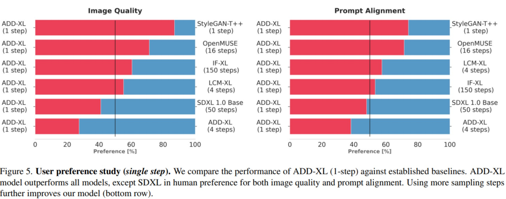
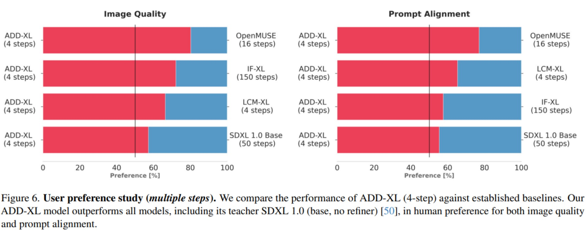
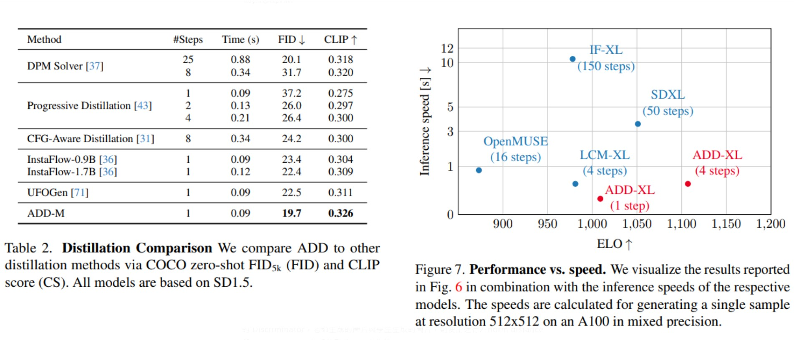
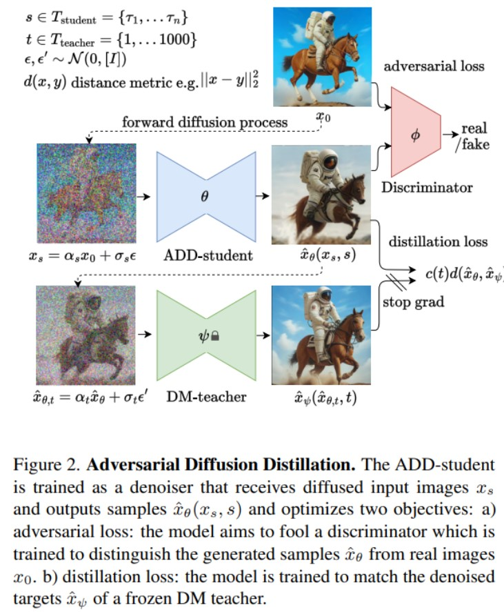
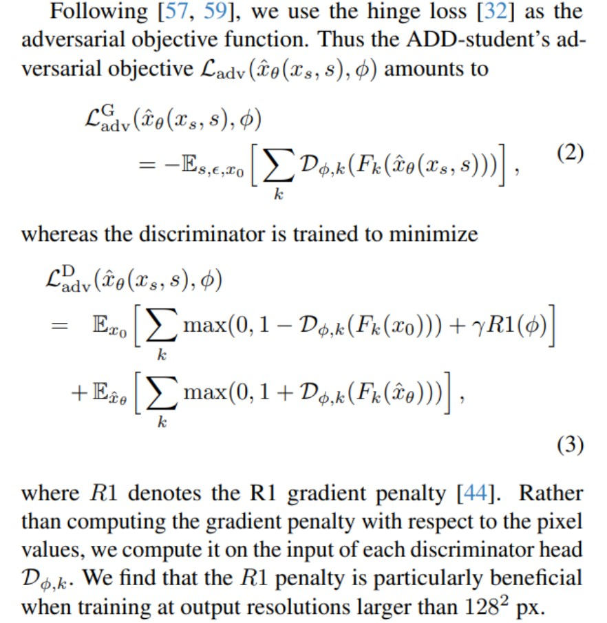
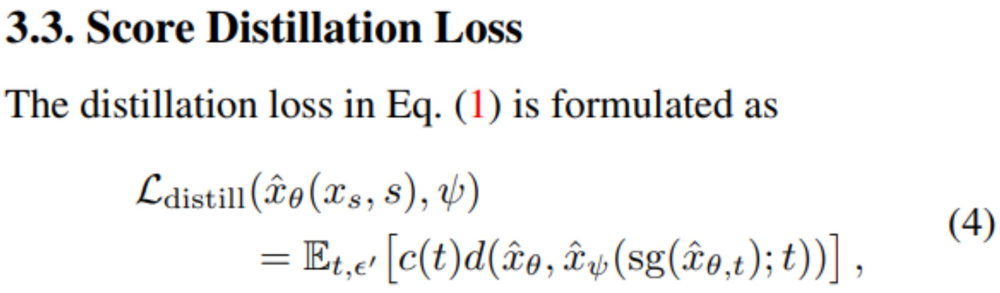
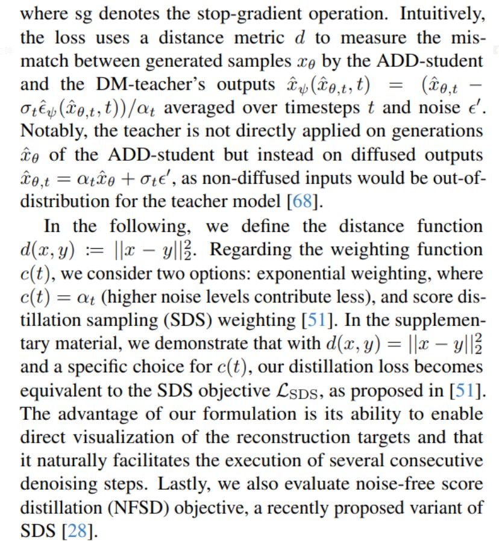
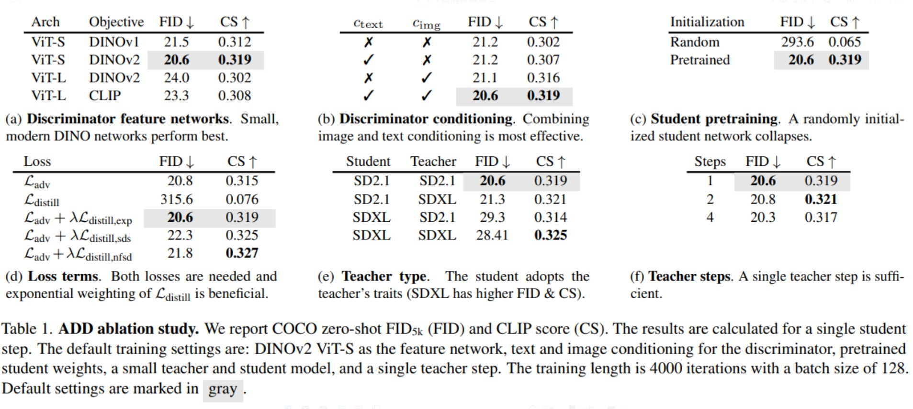

# 導言:
[SDXL-Turbo](https://huggingface.co/stabilityai/sdxl-turbo)

Stability AI在圖片/影片/聲音生成領域貢獻了不少心力，近期提出了更加高效率的對抗生成蒸餾方法，只需進行一步計算，便能打敗LCM需要4步計算的結果，來看看具體是如何做到的。

# 開發動機:
擴散模型近年來取得很優異的高畫質圖片生成結果，但是需要多步驟迭代，導致運算速度無法達到Real time 生成，Luo et al. [基於Latent做一致性模型蒸餾+CFG手法](https://arxiv.org/abs/2311.17042)，取得很優異的生成畫質與生成速度，激發了本篇作者們加以挑戰突破的原動力。

# 改良思路與影響:
1. 利用GAN模型蒸餾，將學生模型的生成迭代次數降低成1次 (快速生成)
2. 從老師擴散模型的Weight當作起始點，進行GAN蒸餾訓練
3. 針對圖片本身做對抗生成訓練，而非Latent (訓練時梯度比較穩定)
4. 沒有使用[CFG(Class free guidance)](https://vocus.cc/article/655f3521fd89780001a7199b)方式進行蒸餾
5. 沒有使用[CM(Consistency model)](https://vocus.cc/article/655f3521fd89780001a7199b)方式進行蒸餾

# 論文取得成果:
使用人類進行二元偏好對抗投票，可以看到ADD-XL單步可以達到其他擴散模型迭代好幾步才能得到的成果，也比StyleGAN的效果還要好。

<p align="center"></p>

使用人類進行二元偏好對抗投票，可以看到ADD-XL四步迭代可以達到SOTA的結果，甚至能勝過頂尖擴散模型50次迭代的結果。

<p align="center"></p>

單步的結果已經能夠達到極致的FID與CLIP分數，而且在人類評比ELO裡面，四步迭代能取得目前最好的生成結果。

<p align="center"></p>

# 對抗生成蒸餾架構:
Teacher是傳統的擴散生成模型，在蒸餾的時候Fix Weight & bias，教導ADD Student能夠在4步以內生成清晰圖片。此Student模型使用與Teacher同樣架構且初始化複製Teacher的 Weight & bias，將初始圖片加入高斯Noise(擴散過程)，丟到 ADD Student還原，然後再將此還原結果經過相同程度的高斯Noise(擴散過程)，丟到Teacher模型進行還原。

如此安排就有三張圖片，其中初始圖片與學生產生的圖片可以計算Hinge Loss 給 GAN的 Discriminator，老師生成的圖片與學生生成的圖片，則使用進行2-norm distance與Noise Level c(t)的乘積形成Loss來收斂。

<p align="center"></p>
<p align="center">論文成功用一張圖說明所有的訓練架構思路，完成極其有效率的架構描述</p>

收斂Discriminator loss讓學生模型能騙過鑑別模型，讓Hinge Loss 無法拉開，論文額外加入Gradient Penalty避免梯度過大，不好收斂的問題，這也是對抗生成網路訓練常常沒有結果或是訓練結果不穩定的元兇。論文表示，這種作法對於解析度大於128 Pixel2 的生成模型蒸餾，特別的有效，非常符合先前對於GAN的認知。

<p align="center"></p>

蒸餾Loss假設學生和老師生成的圖片裡面存在2-Norm Distance還有Gaussian Noise的差別Loss，想要同時收斂兩者，這邊主要的目的是不希望對抗生成Loss把整個學習方向帶偏，使其仍要滿足蒸餾Loss的約束，手法有點類似[Pixel2Pixel GAN](https://www.tensorflow.org/tutorials/generative/pix2pix)。

<p align="center"></p>
<p align="center"></p>

# 消融測試:
- 實驗表明，使用[DINOV2手法蒸餾出來的ViT-S](https://arxiv.org/abs/2304.07193)小模型，作為鑑別者(Discriminator)可以取得最好的生成結果。
- 鑑別模型部分同時對於Image & Text進行條件化學習，可以取得最好的結果。
- 學生模型初始化則是要使用老師模型的參數，才能取得成果。
- 可以看到蒸餾Loss對於訓練結果改善幅度有限，主要是在調節FID和Clip Score之間的Trade-off，本篇作者偏好更好的FID。
- 另外老師模型進行一步驟蒸餾(跳步驟)即可達到最好的FID結果，由於做到這點，能滿足快速生成的需求。

<p align="center"></p>

# 先驗知識:
[GAN](https://ithelp.ithome.com.tw/articles/10196257)

[DINOv2](https://arxiv.org/abs/2304.07193)

# 相關論文:
[LCM](https://vocus.cc/article/655f3521fd89780001a7199b)

[ADD](https://arxiv.org/abs/2311.17042)

# 引用:
```markdown
@misc{sauer2023adversarial,

      title={Adversarial Diffusion Distillation}, 

      author={Axel Sauer and Dominik Lorenz and Andreas Blattmann and Robin Rombach},

      year={2023},

      eprint={2311.17042},

      archivePrefix={arXiv},

      primaryClass={cs.CV}

}
```