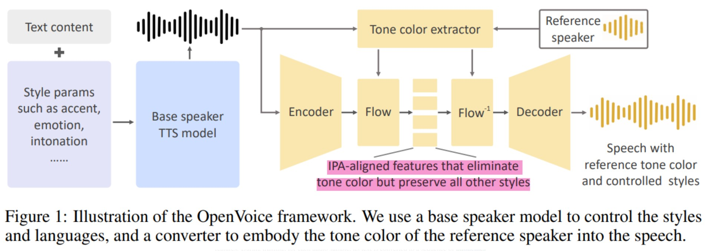
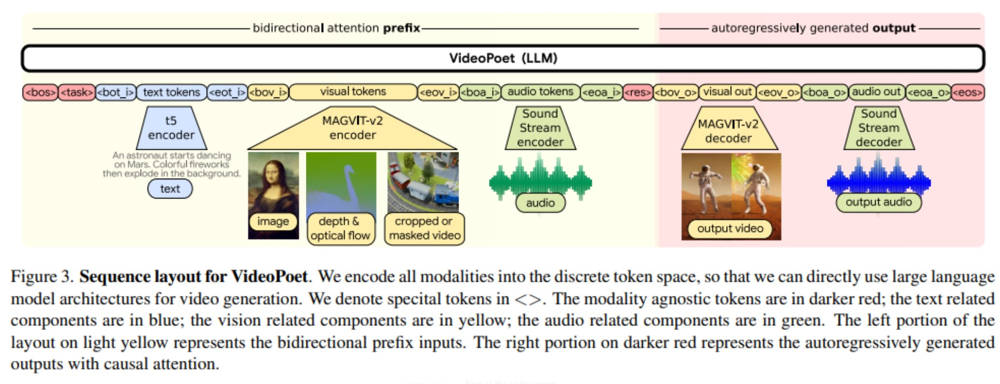
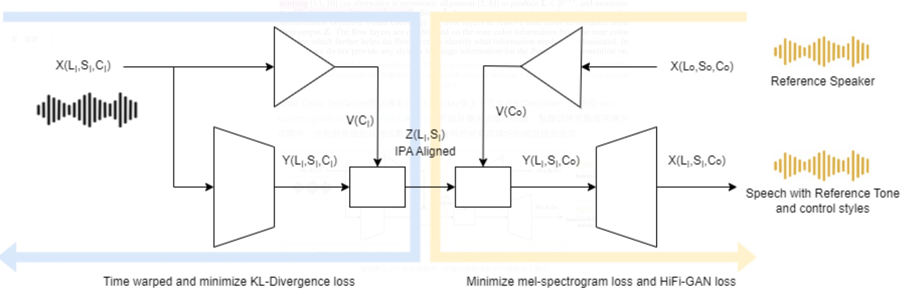

# 導言:
[OpenVoice](https://huggingface.co/myshell-ai/OpenVoice)

要如何做到無須任何額外訓練樣本就能做到"跨語言"的語音生成，這聽起來很不可思議對吧? 但這就是OpenVoice Model取得的最大成就，不僅如此，該有的功能，如調整情感，口音節奏，停頓語調這些功能也不在話下。此外，運算效率極高，效果卻超群。跟我一起用探秘還有獨立思考的眼光來分析這篇論文，這會是很有趣的旅程。

# 技術亮點:
假設現在有一個專門講英文的老外，你很喜歡他的聲音，想讓他講中文，你只需要輸入他的聲音，然後打入中文，他就能開始使用他的聲音講中文，然後你為了要產生一些情緒落差，可以調整讓他開心或是難過的講完內容。突然你又想要讓他講台灣國語，也可以調整讓他講台灣國語，所有的語音戲劇效果，都能夠用很簡單的方式產生。

# 關鍵技術探秘:
其實不管是情緒/語調還是口音，都可以藉由學習有標記過的語音資料集配合文字來進行學習，這些條件在使用上也是放在輸入端當成選項，更為方便一些，這塊有大量的Previous Work可以參考，本篇作者使用 [VITS](https://arxiv.org/pdf/2106.06103.pdf)架構，把要生成的語音風格利用MLP(多層感知層) 化成Embedding和文字的Embedding混合再輸入到Text Encoder裡面，其它的完全使用VITS架構，這告訴我們想要加一些額外的條件進入本來的Model裡面都可以使用這種便宜簡單的方法，但這個並不能算是獨門秘訣，比較廣為人知。

緊接著，拿手絕活登場了，下圖標紅字的部分，用了Tone Color Extractor自己的Base Speaker Encoder輸入到[Flow (Normalization Flow Layer)](https://deepgenerativemodels.github.io/notes/flow/)裡面，並使用minimize [KL-divergence](https://encord.com/blog/kl-divergence-in-machine-learning/) & [Time-domain warping](https://builtin.com/data-science/dynamic-time-warping)的方式來盡可能的去除音色(Tone Color)，讓其純粹的表達國際音標(IPA)所對應到的聲音，好讓Tone Color Extractor自己的Reference Speaker Encoder可以盡可能地往裡面加入音色，不會混雜了Base speaker TTS model 原有的音色。

<p align="center"></p>
<figcaption>IPA (國際音標) 是跨語言轉換學習的關鍵</figcaption>

<p align="center"></p>
<figcaption>Text input 切成若干IPA Text Embeddings，和Voice encoder output 做time warping alignment，然後利用minimize KL-Divergence的方式來確保中間的Latents IPA-Aligned features，有最大化的去除任何Tone color的成分</figcaption>

Tone Color Extractor則訓練自己的Encoder接上下方生成的Decoder，並使用[mel-spectrogram loss](https://arxiv.org/abs/2106.06103) and [HiFi-GAN loss](https://arxiv.org/abs/2010.05646)來對目標生成進行收斂，整體訓練把整個架構分成兩半，分別對各自的目標函數訓練，最後再把所有訓練好的模型組合起來。

<p align="center"></p>
<figcaption>這張圖花了一些時間製作，把論文裡面補充的內容都放了進去</figcaption>

# 心得感想:
這篇論文裡面充滿了工程實務細節，和一般的學術論文有很大的不同，畢竟這曾是他們吃飯的工具，想必目前有更厲害的模型用於MyShell.ai的後台。從這篇論文我們可以看到，以下幾個要點:

1. 要讓模型訓練快速，減少參數，增加訓練速度，避不開一些人為工程手段，純End-to-End的模型，需要大量的訓練時間與推論計算時間。
2. 加入音色的部分與原本調整語調特色的部分可以完全拆開處理，要處理好跨語言的音色，必須要先搞定IPA(國際音標)的編碼，並且要使用一些Alignment(對齊)的方法如time-warping 來確保相位一致性，使用先除音色再加入新的音色的方法。
3. 可以使用Normalization Flow Layer在中間，和傳統的方式Auto-Encoder結合在一起，好處是可以在中間盡量把分佈還原出來，也有助於整個模型拆開來，進行各自目的定性的調整，相信這個架構的研發，花了開發者們不少的研究心血。
4. 跨語言的聲音樣本，可以直接套用音色，大大增加運用靈活性，由於有針對IPA做分布學習(min KL-Divergence)，無需額外的訓練資料來做成音色套用的部分，好用又不費力的做法，OpenVoice團隊做到了，必須給一個大大的讚👍。

# 社會責任:
openVoice公開的開源模型，可以逼真的模仿任何人的音色，產生各種不同的情緒語調與口音，請用在正確的用途。要使用他人的聲音，做公開使用或各種商業行為，請務必徵求他人的同意，不要任意侵權。此外，禁止利用科技來散布假訊息，造成社會動盪不安，後果請自行負責。視聽閱讀者要知道有影片/錄音檔也未必有真相，必須要先查證，不要隨意地散播各種未經查證的訊息。

# 相關先驗知識:
[國際音標](https://zh.wikipedia.org/zh-tw/%E5%9C%8B%E9%9A%9B%E9%9F%B3%E6%A8%99)

# 開源程式
[OpenVoice](https://github.com/myshell-ai/OpenVoice)

# 相關論文:
1. [OpenVoice: Versatile Instant Voice Cloning](https://arxiv.org/abs/2312.01479)
2. [Conditional Variational Autoencoder with Adversarial Learning for End-to-End Text-to-Speech](https://arxiv.org/abs/2106.06103)
3. [Variational Inference with Normalizing Flows](https://arxiv.org/abs/1505.05770)

# 引用:
```markdown
@misc{qin2024openvoice,
      title={OpenVoice: Versatile Instant Voice Cloning}, 
      author={Zengyi Qin and Wenliang Zhao and Xumin Yu and Xin Sun},
      year={2024},
      eprint={2312.01479},
      archivePrefix={arXiv},
      primaryClass={cs.SD}
}
```