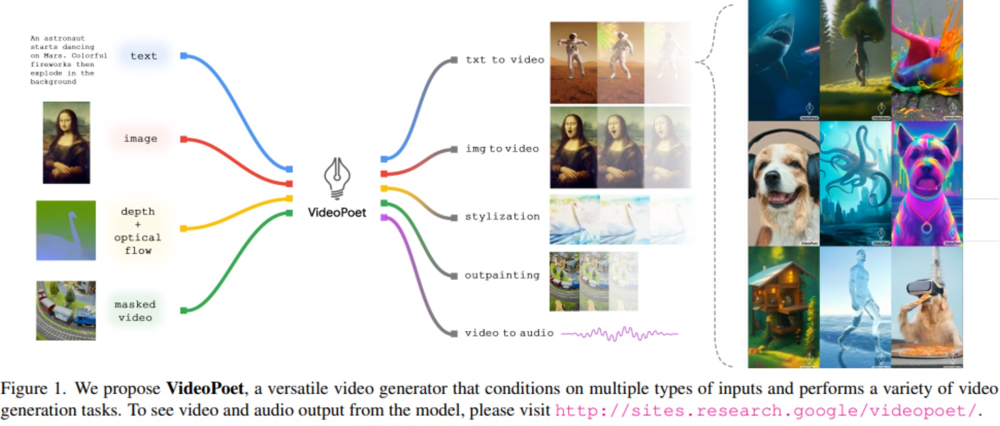
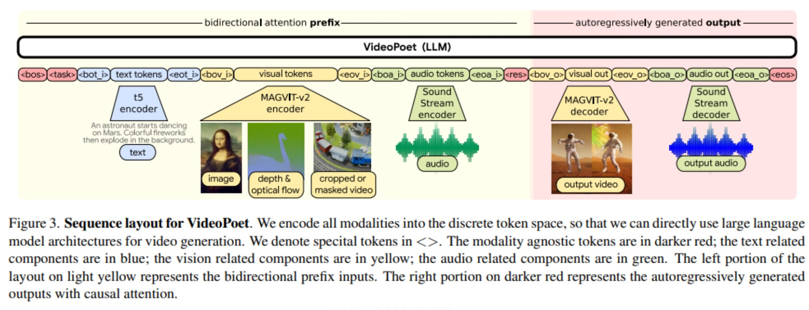
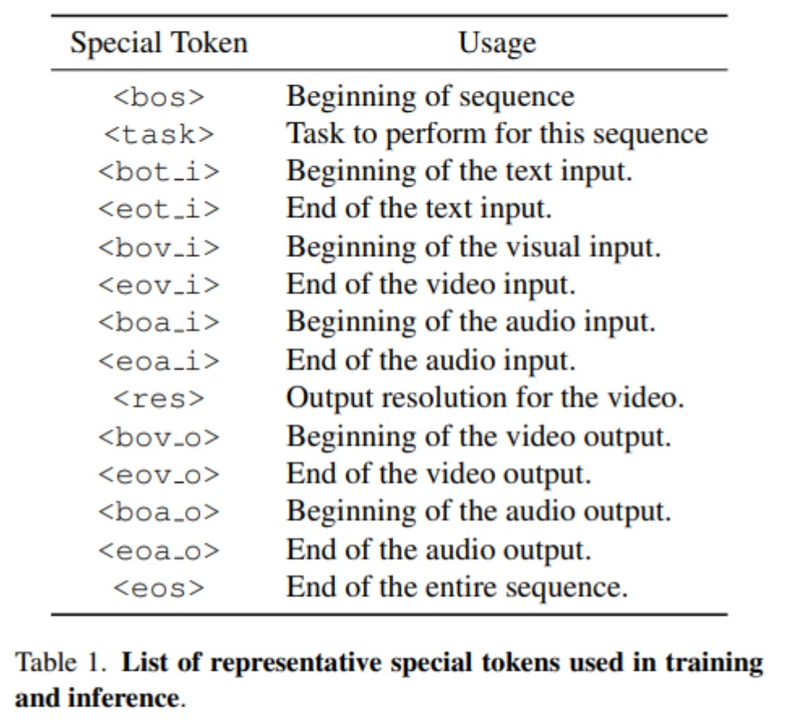
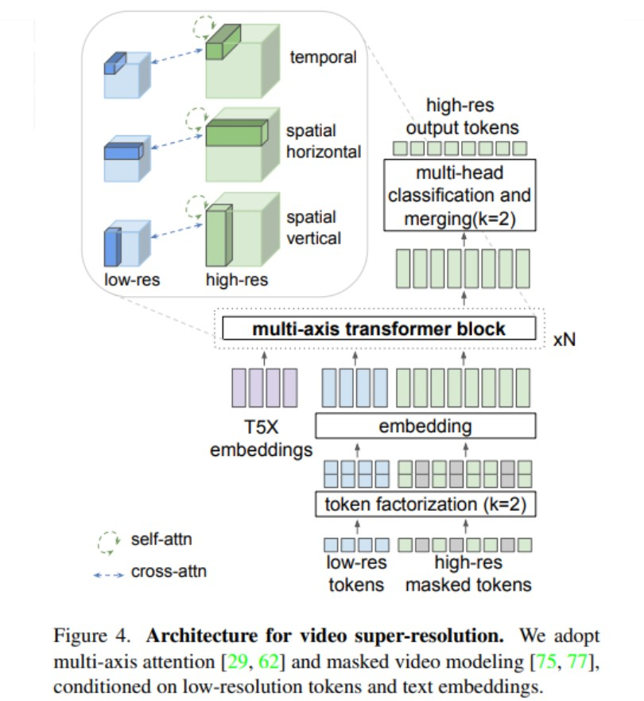
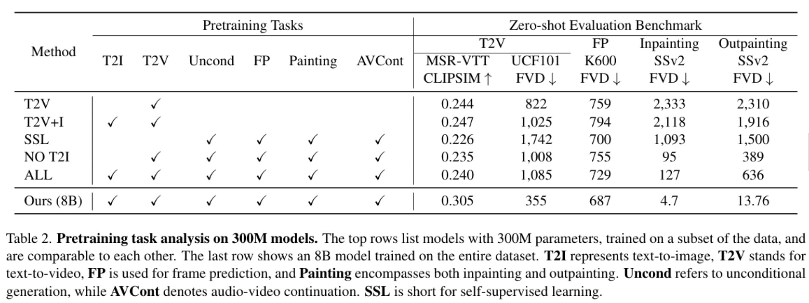

# 導言:
[VideoPoet](https://sites.research.google/videopoet/)

經過2023年人工智慧技術的大躍進，文生圖片/動畫/語音的各種技術變得司空見慣，剩下的只是在生成品質，生成多樣性，與生成時間中互相取捨。終於在2024年有了新的應用突破，本篇論文為Google Research集大成之作，可以給各種文/圖/深度圖/聲音，讓AI按照多模態的One-shot指引生成短影音，若持續發展，將顛覆整個影音創作產業。

# 論文關鍵成果:
可以"同時"使用"多種方式"來產生對於生成影音的指引，傳統的文生影片僅能使用文字，不過在[IP-Adapter](https://arxiv.org/abs/2308.06721)論文裡面指出，一張圖的提示效果勝過千言萬語，於是有了把圖/深度圖/人體骨架圖等等，放到生成模型裡面。本篇Google Research則是一種擴展，在前人的基礎上，可以使用影片/分鏡稿/文生影片Pair/圖生影片Pair/風格圖/填充背景圖/聲音檔，來當作提示，如此一來，可以盡可能地使用各種方式來微調輸出的影片風格，達成理想中的結果，如此神奇的效果，是如何做到的? 接下來要講論文的關鍵技術，讓我們繼續看下去。

<p align="center"></p>
<p align="center">多模態同時輸入，可以產生各種符合風格/文字/圖片/影片/聲音提示的短影音</p>


# 論文關鍵技術:
如先前介紹過的Fuyu8b，LLM輸入端可以放入圖片的Embedding (經過Encoder編碼後的結果)，加上原本的Text Embedding 就能夠針對圖片問問題，同理，如果輸入是影片/聲音，訓練起來也能夠對影片或是聲音提出問題，然後取得相對應的回答。

現在讓我們更進階一點，輸出也可以是圖片/聲音的Embedding，這些可以經由Decoder解碼，一連串的圖片與聲音組合在一起，就成為了影音Movie。

底下這張圖就是VideoPoet的輸入架構，可以看到藉由許多Special Tokens做分段，然後在特定的段落，放入特定的Enbedding內容，讓LLM學習後續去產生Enbedding的接龍遊戲，只要看過的資料夠多，就能達到像大語言模型那樣的水平，可以使用LLM用文字接龍的方式先產生出新的Image tokens / audio tokens，再經過解碼器以後就能產生具有生動聲光效果的影片。

作者在這裡採用先把Encoder/Decoder作預訓練的方法，藉此來產生Enbedding Dataset，讓LLM去學習與收斂。

<p align="center"></p>
<p align="center">Encoder / Decoder可以使用SOTA的模型，用來編碼語解碼Embeddings，加入Special Token排列組合成Sequence讓LLM去學</p>

<p align="center"></p>
<p align="center">Token設計與對應表</p>

現在來講到模型關鍵架構部分，為了同時提高LLM的學習效率，與更多的場景應用可能性，在圖片的Embedding部分，使用兩種不同維度大小的Embeddings，在高維度的部分，使用Mask做遮罩下去學，讓模型學習用低維描述去補足高維資訊裡面的缺乏部分，這也是NVIDIA DLSS會運用到的手法，配合Token Factorize的方法可以讓解析度提高2x2倍，也就是四倍，相對於直接去學高維度的生成，這樣做經濟實惠許多。

Token Factorization的部分其實是將Token 數量 Double 或是砍半的技巧，而非去盲目的增加Token的長度，這樣有助於學習到更好的多元特徵對應關係，大大降低參數爆炸與學習難度，而且在先前的論文被證實對於升解析度十分有益處。

在注意力架構設計部分，每個維度，時間，空間X，空間Y都取得了自注意力，並且與低解析度的版本產生交互注意力，這樣有助於產生時間與空間連貫性與一致性高的生成結果，由於許多Previous Work有比較過各種3D生成架構的優劣，論文沒有著墨太多。

為了增強影像的生成品質，在Image Encoder Latent的部分有加入Augmentation Noise加強模型一般化的理解，並使用CFG (Condiction-Free Guidance) 讓模型專心提升畫質，同時使用使得Encoder模型能夠產生一般化與高品質的結果。

<p align="center"></p>
<p align="center">同時考慮三個維度的Attention架構，可以記在心裡，同時這種低解析度與高解析度做Cross Attention的方法也可以當成是自己可以使用的招式。</p>

# 論文評估成果:
Google Research 8B 模型可以做到所有工作類型的需求，並且在每一項評估分數裡面，都能做到最頂尖，多工且高效能。

<p align="center"></p>

Metric評分有的時候沒辦法反映所有真實使用者體驗，所以論文作者找了一堆使用者來做偏好統計，反映出來的是除了在時間連貫性有可能略遜其他手法以外，在無論是動作有趣度，畫質解析度，動作真實性，文字生成保真度，都得到投票偏好的冠軍。

本文比較可惜的是沒有展現出不同手法之間的消融測試，沒有辦法讓讀者建立各種實作手法在8B Model之間的差異，包含影像編碼方式的比較，聲音不同編碼手法之間的比較，還有3D Attention相關的設計手法比較等等，想要得到這些資訊，要閱讀大量的其他論文的內容。

# 社會責任:
未來以假論真假影片的生成成本會急遽的降低，看到影片要先冷靜，進行查證，獨立思考，避免假訊息不斷的傳播，造成社會的巨大危害。另外，假影片的辨別軟件也是未來的開發重點，或許假影片能騙過人類的眼睛，卻騙不過計算機的檢查，總之，眼見不依定為實，有影音也未必有真相，將是進入生成式AI時代，每個人都需要建立的認知。

# 相關論文:
[VideoPoet](https://arxiv.org/abs/2312.14125)

# 引用:
```markdown
@misc{kondratyuk2023videopoet,
      title={VideoPoet: A Large Language Model for Zero-Shot Video Generation}, 
      author={Dan Kondratyuk and Lijun Yu and Xiuye Gu and José Lezama and Jonathan Huang and Rachel Hornung and Hartwig Adam and Hassan Akbari and Yair Alon and Vighnesh Birodkar and Yong Cheng and Ming-Chang Chiu and Josh Dillon and Irfan Essa and Agrim Gupta and Meera Hahn and Anja Hauth and David Hendon and Alonso Martinez and David Minnen and David Ross and Grant Schindler and Mikhail Sirotenko and Kihyuk Sohn and Krishna Somandepalli and Huisheng Wang and Jimmy Yan and Ming-Hsuan Yang and Xuan Yang and Bryan Seybold and Lu Jiang},
      year={2023},
      eprint={2312.14125},
      archivePrefix={arXiv},
      primaryClass={cs.CV}
}
```