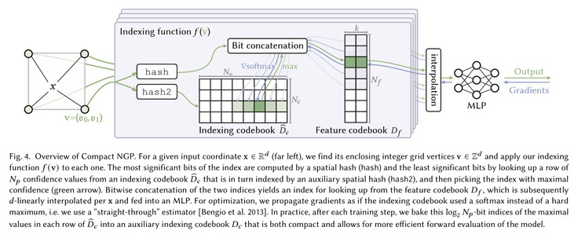
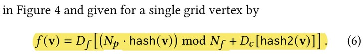
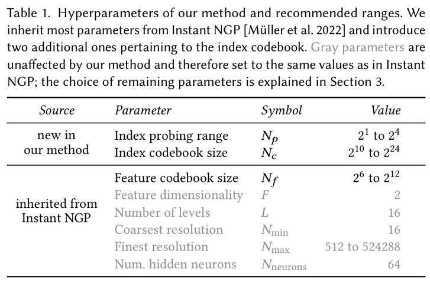
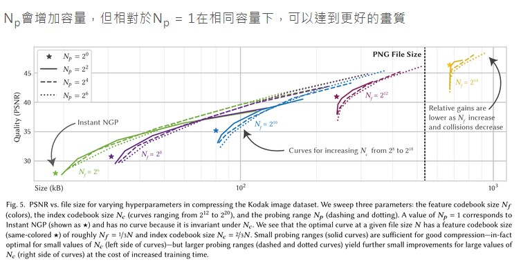
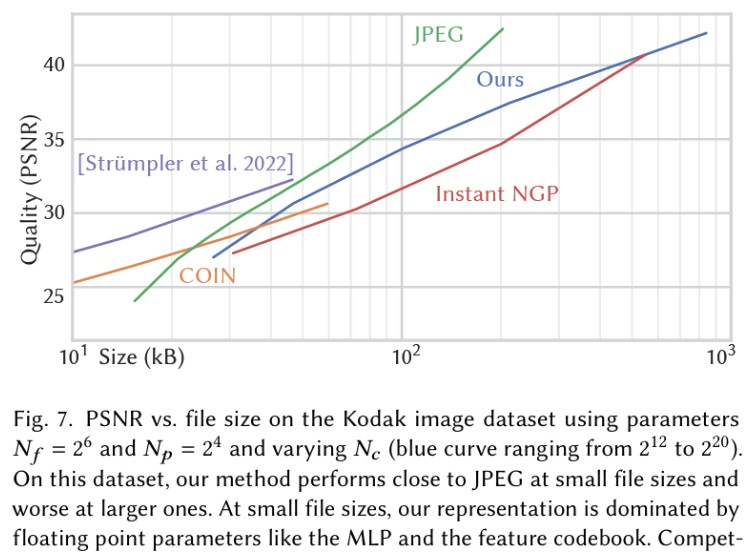
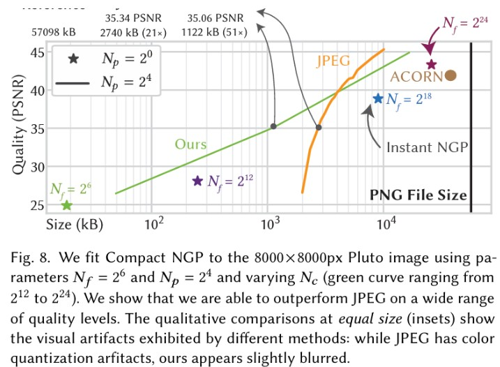
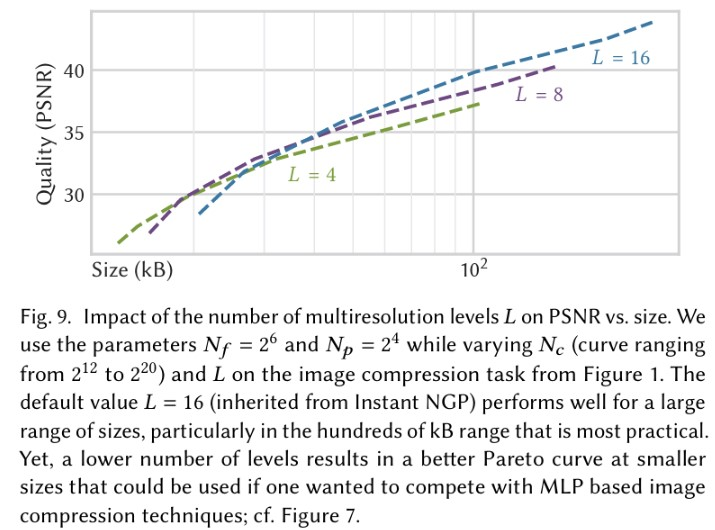
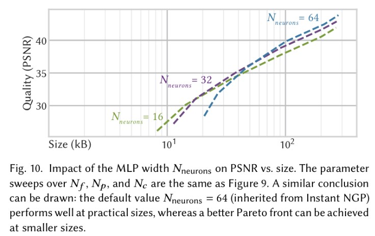
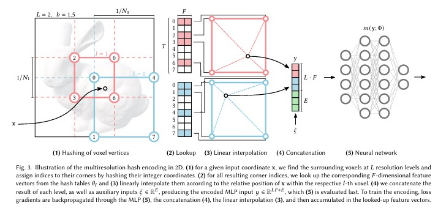

# 導言:
[Compact NGP](https://research.nvidia.com/labs/toronto-ai/compact-ngp)

隨著生成式AI與NeRF技術的崛起，會有越來越多的圖像與3D內容有快速讀取與容量壓縮的需求，這篇文章提出了一個很好的解法，同時，論文也向我們展示了神經網路壓縮技術的設計思路，值得我們借鑒與應用在其他場合，我將嘗試為大家進行深入解析。

# 論文架構解析:
藉由兩個不同的Hash，將Vertices均勻對應到 Indexing / Feature codebook上面，藉由倒傳遞收斂來決定Feature Codebook內需要存放的關鍵訊息，也能藉由倒傳遞決定Np Indexing的位置，傳統的做法沒有Indexing這個部分，即Np=1，好處是所需要的容量較低，但會導致Hash容易發生碰撞衝突，即兩個相差比較遠的Feature，會撞一起，降低了壓縮模型的表達能力，導致無法精進壓縮率。

本文嘗試使用Np Probing 索引，付出一些代價以進一步精進壓縮比例，下圖中Nc維度由Hash2直接定址，Np維度由神經網路去學，取最大值來當作定址目標，倒傳遞收斂的時候使用Softmax輸出，然後Nf維度藉由Hash 和 Np定址結果，共同決定。

<p align="center"></p>

我會認為Index Probing Range Np 是本篇論文最重要的參數， 可以促進人工智慧去重新定址，做Clustering並且抽取特徵，保留這個彈性，可以解決Hash強碰的問題，能大大的利用神經網路學習的優勢，缺點是增加所需容量的低銷，不過能換到的好處更多。

<p align="center"></p>

參數越多壓縮比例越差，但是PSNR保真度越好，這裡提供各種參數方便使用者壓縮的時候調控品質與壓縮比例之間的互換，相信Compact NGP會是目前最佳的3D生成模型如NeRF的最佳夥伴，也會是大型3D全視角VR的首選，另外，本文的壓縮方法對於8K圖片也有很大的壓縮率斬獲，期待本篇作者能持續的精進改良。

<p align="center"></p>

# 壓縮結果評估:
Np會增加容量，但相對於Np = 1在相同容量下，可以達到更好的畫質

<p align="center"></p>
<figcaption>壓縮大型圖片或是大型3D場景可以達到很好的效果，但是對於原本檔案就比較小的圖片，比較沒有競爭優勢，不過作者仍然有提供一些有競爭力的設定</figcaption>

<p align="center"></p>
<p align="center"></p>
<figcaption>壓縮小型圖片檔案比較沒有效益，因為這個方法的低銷比較高，但是對於8K圖像的壓縮，則是大有斬獲</figcaption>

可以降低壓縮的多解析度參考數目，與Neuron的數目，來提高在小型檔案的壓縮比例，試圖降低容量低銷，讓此方法可以被用在各種情境。關於多解析度參考，可以參考底下的附圖，節錄自本篇作者在2022年發表的instant NGP論文。

<p align="center"></p>
<p align="center"></p>
<figcaption>要降低小型圖片的壓縮低銷容量，可以使用比較少的Multiple Resolution Estimation，或是降低Neuron的數目，或是可以同時雙管齊下</figcaption>

L越大，所需要的容量也就越大，所以作者建議在原始檔案沒有很大的情況下，盡可能的要降低L與Neuron隱藏層大小來減少容量低銷，

<p align="center"></p>

# 論文應用擴展啟發:
把神經網路與傳統Hash定址的做法融合在一起，或許也可以促進IC設計Lookup table的參數設計，傳統的Hash只有針對固定的位置在做，現在可以加上由神經網路+Hash 共同產生的定址去提取資料，增加了一個靈活度，讓神經網路可以做最佳化，這種作法應該能導入IC設計的控制邏輯之上，讓參數可以針對現實情況與目標進行倒傳遞調整，如此一來，無需人為的不斷調試，能自適應與最佳化各種環境下的行為。

# 相關論文:
[Instant Neural Graphics Primitives with a Multiresolution Hash Encoding](https://arxiv.org/abs/2201.05989)

引用:
```markdown
@inproceedings{takikawa2023compact, 
  title = {Compact Neural Graphics Primitives with Learned Hash Probing}, 
  author = {Takikawa, Towaki and 
            M\"{u}ller, Thomas and 
            Nimier-David, Merlin and 
            Evans, Alex and 
            Fidler, Sanja and 
            Jacobson, Alec and 
            Keller, Alexander}, 
  booktitle = {SIGGRAPH Asia 2023 Conference Papers}, 
  year = {2023}, 
}
```