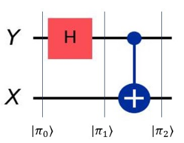
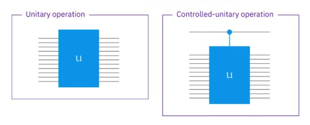

# 導言:
量子計算是最終的計算形式，熟悉量子計算的各種概念與演算法，在未來，可用來模擬宇宙的運行，生命的繁衍，全社會的複雜系統運作，也能做出更為自然與高效率的人工智慧。在量子計算準備大行其道的八年前 (西元2024年)，我將帶著大家，按部就班地掌握量子計算，正如同10年前提早準備人工智慧一樣，善用原子習慣 + 超前學習，通往成功就是輕鬆且愉快的事情。

<p align="center"><iframe width="100%" height="315" src="https://www.youtube.com/embed/30U2DTfIrOU?si=sLvOXZl76L5Nvvjr" frameborder="0" allow="accelerometer; autoplay; clipboard-write; encrypted-media; gyroscope; picture-in-picture" allowfullscreen></iframe></p>

# 基礎量子線路:
- 線 (Wire) 攜帶訊息，在量子線路裡面就是qubit
- 閘 (Gate) 表示運算操作，在量子線路裡面也能代表量測操作，Unitary OP or Measurement
- 線路 (Circuits) 是無環圖 (Acyclic)， 從左到右，不會閉環

## 普通閘範例:
- 由於用矩陣表達時，輸入被放在右邊，所以OP矩陣連乘由右寫到左 (有一點反直覺，要刻意練習)
<p align="center"></p>
$$ 
  H =
  \begin{pmatrix}
  \frac{1}{\sqrt{2}} & \frac{1}{\sqrt{2}}  \\
  \frac{1}{\sqrt{2}} & \frac{-1}{\sqrt{2}} \\
  \end{pmatrix}
  \quad
  S = 
  \begin{pmatrix}
  1 & 0 \\
  0 & i \\
  \end{pmatrix}
  \quad
  T = 
  \begin{pmatrix}
  1 & 0 \\
  0 & \frac{1+i}{\sqrt{2}} \\
  \end{pmatrix}
$$
$$
  THSH =
  \begin{pmatrix}
  \frac{1+i}{2} & \frac{1-i}{2} \\
  \frac{1}{\sqrt{2}} & \frac{i}{\sqrt{2}} \\
  \end{pmatrix}
$$
$$
  \begin{pmatrix}
  \frac{1+i}{2} & \frac{1-i}{2} \\
  \frac{1}{\sqrt{2}} & \frac{i}{\sqrt{2}} \\
  \end{pmatrix}
  \begin{pmatrix}
  1 \\
  0 \\
  \end{pmatrix}
  =
  \begin{pmatrix}
  \frac{1+i}{2} \\
  \frac{1}{\sqrt{2}} \\
  \end{pmatrix}
$$

## 控制閘:
- 加號打在X上面(LSB)，X是0的時候維持原樣，X是1的時候Y互換，所以是第2 & 4排互換，1 & 3排維持原順序
- 多想幾遍，多看幾遍，一回生二回熟，剛開始理解，十分反直覺
<p align="center"></p>
$$ 
  \mathbb{1} \otimes H = 
  \begin{pmatrix}
  \frac{1}{\sqrt{2}} & \frac{1}{\sqrt{2}}  & 0 & 0 \\
  \frac{1}{\sqrt{2}} & \frac{-1}{\sqrt{2}} & 0 & 0 \\
  0 & 0 & \frac{1}{\sqrt{2}} & \frac{1}{\sqrt{2}}  \\
  0 & 0 & \frac{1}{\sqrt{2}} & \frac{-1}{\sqrt{2}} \\
  \end{pmatrix}
$$
$$ 
  controlled-NOT (ctrl X) = 
  \begin{pmatrix}
  1 & 0 & 0 & 0 \\
  0 & 0 & 0 & 1 \\
  0 & 0 & 1 & 0 \\
  0 & 1 & 0 & 0 \\
  \end{pmatrix}
$$
$$
  \begin{pmatrix}
    1 & 0 & 0 & 0 \\
    0 & 0 & 0 & 1 \\
    0 & 0 & 1 & 0 \\
    0 & 1 & 0 & 0 \\
  \end{pmatrix}
  \begin{pmatrix}
  \frac{1}{\sqrt{2}} & \frac{1}{\sqrt{2}}  & 0 & 0 \\
  \frac{1}{\sqrt{2}} & \frac{-1}{\sqrt{2}} & 0 & 0 \\
  0 & 0 & \frac{1}{\sqrt{2}} & \frac{1}{\sqrt{2}}  \\
  0 & 0 & \frac{1}{\sqrt{2}} & \frac{-1}{\sqrt{2}} \\
  \end{pmatrix}
$$
$$ 
  \begin{pmatrix}
    \frac{1}{\sqrt{2}} & \frac{1}{\sqrt{2}} & 0 & 0  \\
    0 & 0 & \frac{1}{\sqrt{2}} & \frac{-1}{\sqrt{2}} \\
    0 & 0 & \frac{1}{\sqrt{2}} & \frac{1}{\sqrt{2}}  \\
    \frac{1}{\sqrt{2}} & \frac{-1}{\sqrt{2}} & 0 & 0 \\
  \end{pmatrix}
$$

- 從每個Column我們就能看出來如下關係:
- $$ \ket{00} \rightarrow \ket{\phi^+} $$
- $$ \ket{01} \rightarrow \ket{\phi^-} $$
- $$ \ket{10} \rightarrow \ket{\psi^+} $$
- $$ \ket{11} \rightarrow -\ket{\psi^-} $$

<p align="center"></p>

- $$ \ket{\phi_0} = \ket{0}\ket{0} $$
- $$ \ket{\phi_1} = \ket{0}\ket{+} = \frac{1}{\sqrt{2}}\ket{00} + \frac{1}{\sqrt{2}}\ket{01} $$
- $$ \ket{\phi_2} = \ket{\phi^+} = \frac{1}{\sqrt{2}}\ket{00} + \frac{1}{\sqrt{2}}\ket{11} $$

## 量測符號:
- 量測以後就跟傳統位元沒有區別，比較在意的是多次量測看到的統計機率分布
- Full expression:
<p align="center"></p>
- Shorthand expression:
<p align="center"></p>

## 常見的Gates:
- SWAP打叉叉，Control打圓點
- Toffoli Gate 打兩個Control圓點 (Controlled-Controlled-NOT)，Fredkin Gate 打兩個叉叉一個圓點
<p align="center"></p>

## U Gates / Control-U Gate:
- Unitary operation 可以被一個大的黑盒子包起來，Control-Unitary operation 也可以打點然後被一個大的黑盒子包起來
<p align="center"></p>

# 量子計算內積正交與投影:
- 了解基本量子計算性質是必要的，之後會大量地使用這些基礎概念

## 量子內積:
- 量子位元矩陣轉置要加共軛
- 量子位元內積，位在前面的轉置(從Ket變成Bra)，後面的不動
- 量子位元內積，結果剛好是兩個量子位元的相位夾角餘弦
<p align="center"></p>

- 量子位元自己與自己內積，等於單位長度 (因為沒有夾角，然後量子位元長度都是1)
- 量子位元內積滿足分配律，唯一要小心的是，前面的係數，記得加共軛
- 柯西定理，內積長度小於等於個別長度成績 (量子位元互相平行，等號成立，其餘都是餘弦都小於1)

## 量子正交:
- 正交量子位元內積為0，量子位元的相位夾角餘弦為0，夾角垂直90度
- 正交Basis集合裡面，和別人皆為正交內積為0，只有和自己內積為1
- 正交集合例子:
- $$ \ket{+}, \ket{-} $$ for 2D Space and a single qubit
- $$ \ket{\phi^+}, \ket{\phi^-}, \ket{\psi^+}, \ket{\psi^-} $$ for 4D Space for and two qubits
- 一個量子位元，有2D正交空間，兩個量子位元，有4D正交空間
- Bloch球面上，夾角180度為正交Basis，3D球面只有2D正交空間
- 非正交例子:
$$ \bra{0}\ket{+} = \frac{1}{\sqrt{2}} \neq 0 $$
- Unitary matrix has every orthogonal basis in it
- 存在N個維度，必有N個Orthogonal basis

## 量子投影(正交量測):
- 投影矩陣滿足取Conjugate相等，做兩次操作等於做一次的特性
- 內積操作滿足以上定理，所以本質上內積操作就是量子投影
- 選定任何Basis組合在一起做內積，本質上也是做量子投影
- 所有的正交投影都用上，實際上會得到一個Identity Matix，為投影量測，也就是正交量測
- 想要量測出現甚麼的機率，就內積甚麼，答案就出來了
- 當然也可以只量測X不量測Y，就像先前章節提到的那樣
- 隨時可以使用量子閘電路，來輔助進行量子投影量測

# 量子訊息的獨特性質:
- 掌握這些量子特性，避免掉入矛盾空洞裡面出不來
- 掌握這些量子特性，避免用傳統訊息的特性來思考問題
- 掌握這些量子特性，擁有構築量子計算電路的大局關

## 可忽略的全域相位
- 看似無趣的證明揭示真理，特徵值單位長，且可線性分拆，本質上沒有特別意義，不帶有訊息量，Global Phase對量子位元等同無效操作
- 量子位元的絕對相位不重要，相對相位，才是專注的重點，是一種相對論

## 量子狀態不可複製理論
- 不存在量子計算，使得狀態得以複製，量子訊息在計算過程中必須守恆，不增加也不減少 (舍利子，是諸法空相，不生不滅，不垢不淨)
<p align="center"></p>
<figcaption>這種Unitary Operation壓根不存在</figcaption>

## 量子狀態正交才具有完全分辨性
- 量子狀態沒有互相正交，意味我中有你，你中有我，無法完美地進行分拆與辨識，存在機率辨識錯誤
<p align="center"></p>
<figcaption>如果兩個輸入沒有完全正交，都有機率分辨錯誤，Accuracy不為100%</figcaption>

# 先驗知識:
[台大線性代數課程](https://ocw.aca.ntu.edu.tw/ntu-ocw/ocw/cou/102S207)

[複數課程第一課](https://ocw.nthu.edu.tw/ocw/index.php?page=chapter&cid=289&chid=6153)

# 引用:
```markdown
@article{

  author       = {Jeng-Ting, Chen},

  title        = {迎戰未來，AI 量子計算基礎篇 (3)，Quantum Circuits},  

  year         = {2024},

  url          = {https://infinite-wisdom.vercel.app/blog/post-240629},  

  timestamp    = {Sat, 29 June 2024 08:17:00 +0800},
}
```