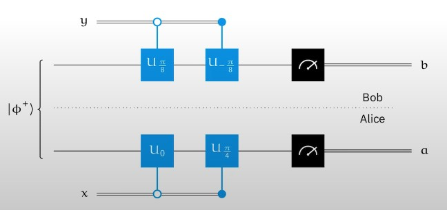

# 導言:
量子計算是最終的計算形式，熟悉量子計算的各種概念與演算法，在未來，可用來模擬宇宙的運行，生命的繁衍，全社會的複雜系統運作，也能做出更為自然與高效率的人工智慧。在量子計算準備大行其道的八年前 (西元2024年)，我將帶著大家，按部就班地掌握量子計算，正如同10年前提早準備人工智慧一樣，善用原子習慣 + 超前學習，通往成功就是輕鬆且愉快的事情。

<p align="center"><iframe width="100%" height="315" src="https://www.youtube.com/embed/GSsElSQgMbU?si=H1TRmBKCFY-4EqJy" frameborder="0" allow="accelerometer; autoplay; clipboard-write; encrypted-media; gyroscope; picture-in-picture" allowfullscreen></iframe></p>

# 量子糾纏經典實例:
- 以下經典實驗，都顯示了量子糾纏，可以產生有別於傳統訊息的效果
- (個人想像) 如果能保持訊息量守恆，配合自然界原有的量子糾纏現象，就可能得到一些千里眼，順風耳，還有預知未來與探索過去，獲取額外訊息的能力
- (個人想像) 量子電腦需要極低溫與超導體，來保持能量與訊息量守恆，人類可以藉由打坐冥想來獲得訊息量守恆，就能突破傳統訊息的限制，獲得更多額外優勢
- (個人想像) 太陽系(太陽+九大行星)的系統，可以假設為孤立系統，總訊息量保持不變，太陽與九大行星的相對位置，訊息量改變巨大，可能會造成某些糾纏狀態的傳遞，這或許是占星術的科學解釋

## 量子糾纏傳態 (Quantum Teleprotation):
<p align="center"></p>
- 糾纏量子對 (ebits) 可以用來組成量子傳輸線路
- 實際上利用了，量子訊息不增不減的特性來傳遞量子訊息
- 用傳統量測 + 訊息通訊，根本無法傳遞任何量子訊息，看到的攤縮機率訊息量少於原本的量子訊息量
- 糾纏量子對才有辦法被利用來設計這種傳輸Protocol，這種通訊手法被稱為"量子糾纏蒸餾"，越高品質的糾纏量子對，傳輸保真度越好，糾纏量子對本身的品質不需要太好，相對於想傳輸的量子訊息而言，允許糾纏量子對有瑕疵，反正可以多傳幾次，多試幾次
- 量子糾纏傳態，或是量子糾纏蒸餾，對於量子訊息，還有量子計算，也深具取發性，許多電路設計的變形用類似的方式傳遞量子訊息

## 量子超密集編碼 (Superdense Coding):
<p align="center"></p>
- 基本上就是使用糾纏量子對來傳輸傳統訊息，但是沒有實用價值，因為必須針對兩個糾纏量子進行量測，才能夠得到傳統訊息
- 對比糾纏量子傳態，一個Qubit等於兩個傳統Bit的訊息量
- 對糾纏量子對，其中的一個量子進行運算，能讓對方對整體的糾纏量子量測結果產生變化
- 無論是量子糾纏傳態還是量子超密集編碼，都是由於有量子糾纏的特性，才有辦法產生這種結果

## 量子CHSH遊戲 (CHSH Game):
<p align="center"></p>
- 傳統策略只能達到最高75%的勝率，使用量子糾纏對，產生的量子策略，可達到85%的勝率
- 這遊戲是一種Bell Test的變形，這遊戲可以看成是Bell theory的證明
- 2022年的諾貝爾獎，頒給使用糾纏光子證實CHSH Game的物理學家
- 類似的None-local game還很多，尚待使用量子糾纏來提高勝率的例子還很多


# 先驗知識:
[台大線性代數課程](https://ocw.aca.ntu.edu.tw/ntu-ocw/ocw/cou/102S207)

[複數課程第一課](https://ocw.nthu.edu.tw/ocw/index.php?page=chapter&cid=289&chid=6153)

# 引用:
```markdown
@article{

  author       = {Jeng-Ting, Chen},

  title        = {迎戰未來，AI 量子計算基礎篇 (4)，Entanglement in Action},  

  year         = {2024},

  url          = {https://infinite-wisdom.vercel.app/blog/post-240629},  

  timestamp    = {Sun, 07 July 2024 09:20:00 +0800},
}
```