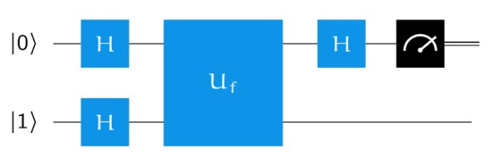
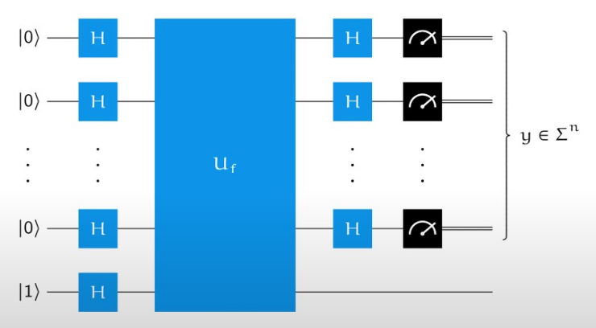
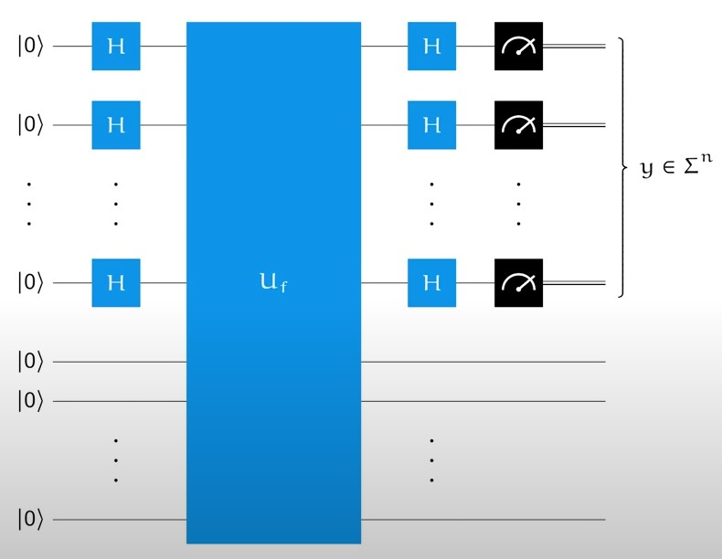

# 導言:
量子計算是最終的計算形式，熟悉量子計算的各種概念與演算法，在未來，可用來模擬宇宙的運行，生命的繁衍，全社會的複雜系統運作，也能做出更為自然與高效率的人工智慧。在量子計算準備大行其道的八年前 (西元2024年)，我將帶著大家，按部就班地掌握量子計算，正如同10年前提早準備人工智慧一樣，善用原子習慣 + 超前學習，通往成功就是輕鬆且愉快的事情。

<p align="center"><iframe width="100%" height="315" src="https://www.youtube.com/embed/2wticzHE1vs?si=BFn590EKM4_rlSg8" frameborder="0" allow="accelerometer; autoplay; clipboard-write; encrypted-media; gyroscope; picture-in-picture" allowfullscreen></iframe></p>

# Query Model of Computation
- 用黑盒子來論說量子計算的好處，隨著問題的大小增加，傳統計算Query次數指數增加，量子計算所需時間則是線性增加而已，有巨大的優勢
- 目前量子計算所需的電力比傳統計算仍然大很多，而且量子儲存技術成本也遠大於傳統計算機儲存技術，計算時間的大幅縮短，是目前量子計算最吸引人的主要原因
- 這些範例展示了，即使不使用量子糾纏的特性，量子計算也有巨大的計算時間複雜度優勢
- (個人想像) 大型語言模型也可以看成是一種大型的Query Model，如果能使用量子計算來做，計算時間複雜度會更Scalable，有助於創造更大型的語言模型

## Deutsch Algorithm
<p align="center"></p>
- 使用Hadamard gate 利用建設性干涉，還有破壞性干涉，Phase-kickback的技巧，無需使用量子糾纏的特性，時間複雜度就能打敗傳統計算機

## Deutsch-Jozsa Algorithm
<p align="center"></p>
- Deutsch Algorithm 的擴展，可以得到更多有趣的觀察，對於Balance / constant function 有各自的行為模式，傳統Specific計算，需要耗費指數等級的運算次數的回答問題，使用量子干涉，只需要線性次數，就能把回答準確率做到接近100%

## Simon Algorithm
<p align="center"></p>
- 更進階的Query problem再次證明運用量子干涉調整，能做的線性計算次數(時間)複雜度

# 先驗知識:
[台大線性代數課程](https://ocw.aca.ntu.edu.tw/ntu-ocw/ocw/cou/102S207)

[複數課程第一課](https://ocw.nthu.edu.tw/ocw/index.php?page=chapter&cid=289&chid=6153)

# 引用:
```markdown
@article{

  author       = {Jeng-Ting, Chen},

  title        = {迎戰未來，AI 量子計算基礎篇 (5)，Quantum Query Algorithms},  

  year         = {2024},

  url          = {https://infinite-wisdom.vercel.app/blog/post-240723},  

  timestamp    = {Tue, 23 July 2024 09:10:00 +0800},
}
```