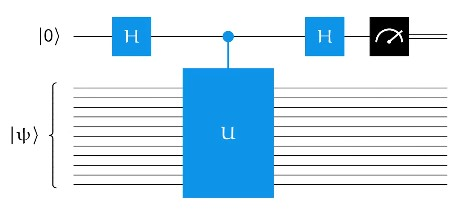

# 導言:
量子計算是最終的計算形式，熟悉量子計算的各種概念與演算法，在未來，可用來模擬宇宙的運行，生命的繁衍，全社會的複雜系統運作，也能做出更為自然與高效率的人工智慧。在量子計算準備大行其道的八年前 (西元2024年)，我將帶著大家，按部就班地掌握量子計算，正如同10年前提早準備人工智慧一樣，善用原子習慣 + 超前學習，通往成功就是輕鬆且愉快的事情。

<p align="center"><iframe width="100%" height="315" src="https://www.youtube.com/embed/4nT0BTUxhJY?si=ANPzbFPb8HrIXmTA" frameborder="0" allow="accelerometer; autoplay; clipboard-write; encrypted-media; gyroscope; picture-in-picture" allowfullscreen></iframe></p>

# 相位估計問題:
## Spectral theorem for unitary matrices
- Unitary matrices (U) 可以寫成正交基底的形式，有特徵值與特徵向量
- 有一個 Unitary quantum circuit 作用在 n 個 qubits 上，有一個n-qubit的量子狀態，用來代表這組 Unitary matrices 的特徵向量，然後我們想要用來估計特徵值
$$ 
\forall \theta \in [0,1), U\ket{\psi} = \exp^{2\pi i\theta}\ket{\psi}
$$
- 讓我們一步一步藉由理解相位估計，直到能夠理解質因數分解也可以變成相位估計問題，藉由 $$ Shor's Algorithm $$ 來解

# 相位估計程序:
- 使用 Phase kickback 取得 Eigen value
<p align="center"></p>
<p align="center"></p>

## 低精準度相位估計
- 多次Apply U，可以得到更多關於Phase的資訊
<p align="center"></p>

- 使用多個Control bit，也能得到更多關於Phase的資訊
<p align="center"></p>
<p align="center"></p>
<p align="center"></p>

## 量子傅立葉轉換
- 量子傅立葉轉換的項次越多，可以理解成相位解析度越高
- 量子傅立葉轉換可以用遞迴的方式不斷往上擴展
<p align="center"></p>

- 總共需要M平方等級的量子閘去組出QFTm
- Swap Gate的數量甚至可以更少
- 對於QFT2次方，用更少的 Cost/depth 可以逼近
<p align="center"></p>

## 相位估計一般程序
- 用多個U與多個Control bit來達成目標，看起來Cost有點高，不過這就是最一般的描述方式
<p align="center"></p>

- 量測結果可以寫成以下公式:
<p align="center"></p>

- 相位估計準度可以達到約40%
<p align="center"></p>

- 估計準度要超過40%，可以藉由多次量測
<p align="center"></p>

# 用相位估計解因數分解:
- 藉由以下三部分的講解，一步一步了解要如何用量子計算來解質因數分解

## Order Finding
<p align="center"></p>
<p align="center"></p>

## 用相位估計解 Order Finding
<p align="center"></p>
<p align="center"></p>

## 用Order Finding 解因數分解
<p align="center"></p>
<p align="center"></p>
<p align="center"></p>
<p align="center"></p>

# 先驗知識:
[台大線性代數課程](https://ocw.aca.ntu.edu.tw/ntu-ocw/ocw/cou/102S207)

[複數課程第一課](https://ocw.nthu.edu.tw/ocw/index.php?page=chapter&cid=289&chid=6153)

# 引用:
```markdown
@article{

  author       = {Jeng-Ting, Chen},

  title        = {迎戰未來，AI 量子計算基礎篇 (7)，Phase Estimation & Factoring},  

  year         = {2024},

  url          = {https://infinite-wisdom.vercel.app/blog/post-240808},  

  timestamp    = {Fri, 08 Aug 2024 09:15:00 +0800},
}
```