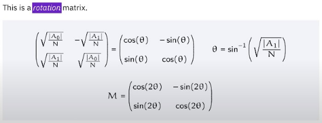
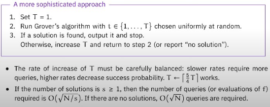

# 導言:
量子計算是最終的計算形式，熟悉量子計算的各種概念與演算法，在未來，可用來模擬宇宙的運行，生命的繁衍，全社會的複雜系統運作，也能做出更為自然與高效率的人工智慧。在量子計算準備大行其道的八年前 (西元2024年)，我將帶著大家，按部就班地掌握量子計算，正如同10年前提早準備人工智慧一樣，善用原子習慣 + 超前學習，通往成功就是輕鬆且愉快的事情。

<p align="center"><iframe width="100%" height="315" src="https://www.youtube.com/embed/hnpjC8WQVrQ?si=dcmJNcw_LO8AjA5S" frameborder="0" allow="accelerometer; autoplay; clipboard-write; encrypted-media; gyroscope; picture-in-picture" allowfullscreen></iframe></p>

## 非結構性搜尋:
<p align="center"></p>
<p align="center"></p>

## $$ Grover's \quad algorithm $$:
- $$ Grover's algorithm $$ 一開始會有一個Initialization step，然後重複做Grover operation幾次，然後藉由量測，可能的正確解答，就會出現
- 運算複雜度為非結構性搜尋最佳，可以大量應用在傳統問題，相位旋轉找答案的技術，可以用在各個領域
- Phase query gates
<p align="center"></p>
<p align="center"></p>

- Grover Operation
<p align="center"></p>
<p align="center"></p>
<p align="center"></p>
<p align="center"></p>
<p align="center"></p>
<p align="center"></p>
<p align="center"></p>
<p align="center"></p>
<p align="center"></p>
<p align="center"></p>
<p align="center"></p>
<p align="center"></p>
<p align="center"></p>
<p align="center"></p>

## 決定跌代次數:
<p align="center"></p>
<p align="center"></p>
<p align="center"></p>

## Unique Search
<p align="center"></p>
<p align="center"></p>
<p align="center"></p>

## Multiple Solutions
<p align="center"></p>
<p align="center"></p>

## Unknown Number of Solutions
<p align="center"></p>
<p align="center"></p>


# 先驗知識:
[台大線性代數課程](https://ocw.aca.ntu.edu.tw/ntu-ocw/ocw/cou/102S207)

[複數課程第一課](https://ocw.nthu.edu.tw/ocw/index.php?page=chapter&cid=289&chid=6153)

# 引用:
```markdown
@article{

  author       = {Jeng-Ting, Chen},

  title        = {迎戰未來，AI 量子計算基礎篇 (8)，Grover's Algorithm},  

  year         = {2024},

  url          = {https://infinite-wisdom.vercel.app/blog/post-240815},  

  timestamp    = {Thu, 15 Aug 2024 09:15:00 +0800},
}
```