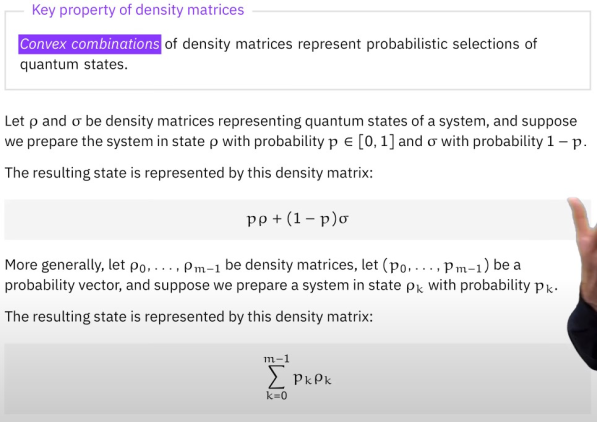

# 導言:
量子計算是最終的計算形式，熟悉量子計算的各種概念與演算法，在未來，可用來模擬宇宙的運行，生命的繁衍，全社會的複雜系統運作，也能做出更為自然與高效率的人工智慧。在量子計算準備大行其道的八年前 (西元2024年)，我將帶著大家，按部就班地掌握量子計算，正如同10年前提早準備人工智慧一樣，善用原子習慣 + 超前學習，通往成功就是輕鬆且愉快的事情。

<p align="center"><iframe width="100%" height="315" src="https://www.youtube.com/embed/CeK9ry8G8HQ?si=5aBhbO5PQ799yRku" frameborder="0" allow="accelerometer; autoplay; clipboard-write; encrypted-media; gyroscope; picture-in-picture" allowfullscreen></iframe></p>

# Basics
- Density matrices 相較於Quantum state vector，可以更廣泛表達各種量子狀態
- Density matrices 可以描述一個量子系統的孤立部分，例如討論當一個系統的某些State和我們想忽略的其他系統發生糾纏的狀態
- 機率狀態可以用 Density matrices 來表達，使得量子訊息和傳統訊息可以在同一個數學框架內被討論

## Definitions and examples
- Trace = 1，密度矩陣為半正定，所有的特徵值都是非負實數，這並不代表密度矩陣裡面每個Entry都大於0，也不代表密度矩陣裡面每個Entry都是實數，千萬不要誤會。
- 密度矩陣裡面的Entry可以為負，可以有複數
<p align="center"></p>
<p align="center"></p>
<p align="center"></p>

- $$ M^{\dagger} M $$，隨便找一個複數矩陣M，都可以藉由這個簡單計算產生Density Matrices，只是記得要讓Trace為1，需要做正歸化
<p align="center"></p>

- 密度矩陣的Trace代表著狀態出現的機率，除了Trace以外的部分(行與列)表達傳統狀態以怎樣的量子方式疊加，形成量子疊加態

## Connection to quantum state vectors
- $$ \ket{\psi}\bra{\psi} $$ 就是Density Matrix要描述的對象，還記得複數矩陣做矩陣/向量轉置的時候，需要額外做Conjugate，這不就是上述提到的 $$ M^{\dagger} M $$ ，然後由於量子狀態都是單位長度，連正規化也不用做了。
- Pure states 表示所有在 Bloch 球面上的狀態，只要不是在球面上，必然是Mixed states，如果在球心，則是Complete mixed state
<p align="center"></p>
<p align="center"></p>
<p align="center"></p>
<p align="center"></p>

- Global Phase在量子訊息裡面沒有意義，可以發現在計算Density Matrices的時候，Global phase會很自然地被消去(由於量子狀態矩陣/向量轉置要取Conjugate)
<p align="center"></p>

# Convex combinations
- 代表某個Quantum state 的 Density matrix，可以用狀態出現的機率當成線性組合的係數，這種可分離狀態的組合，稱為凸組合，顯示了每一個狀態出現的機率
- 如果針對Pure State做凸組合，必定會得到Mixed State，Pure state在Bloch球表面，Mixed State則是在球裡面
<p align="center"></p>
<p align="center"></p>
<p align="center"></p>

## The completely mixed state
- 機率完全均分，完全混合，指的是每一個狀態出現機率相等
- 以下的例子顯示了，不同的 Pure states 組合，有可能會有相同的 Density Matrix，這表示無法藉由量測，分辨這兩種狀態原本的狀態，但凡 Density Matrix有差別，理論上，都能夠有機會藉由量測分辨出來
<p align="center"></p>

## Probabilistic states
- 如果這些狀態都是傳統狀態，而非量子狀態，則可以得到除了Trace有機率值，其餘部分皆為 0 的 Density matrices
<p align="center"></p>

## Spectral theorem
- Density Matrix滿足半正定，必存在一組特徵向量使得特徵值必為非負實數，然後在量子計算領域，特徵值的總合為1，代表機率總和100%
<p align="center"></p>
<p align="center"></p>

# Bloch sphere
- 用Density matrices的觀察角度來重新看待Bloch sphere
- 量子狀態的Density matrix可以分拆成Pauli gates(matrices)的非負實數(半正定)線性組合，可以看成是一種簡單表達Bloch Sphere的方式，$$ \sigma_x $$ 代表X軸上的長度，$$ \sigma_y $$ 代表Y軸上的長度，$$ \sigma_z $$ 代表Z
軸上的長度
<p align="center"></p>
<p align="center"></p>
<p align="center"></p>

- 用Density matrices的角度來看，球體X軸可以用 $$ \sigma_x $$ 來代表，球體Y軸可以用 $$ \sigma_y $$ 來代表，球體Z軸可以用 $$ \sigma_z $$ 來代表
<p align="center"></p>
<p align="center"></p>
<p align="center"></p>

- 在球內的都不是Pure State，只有在球的表面，才能算是Pure State，1/2 可以由不同的Pure state來組成，Bloch sphere 有助於我們更加理解量子訊息的本質，1/2也被稱為完全混合態，在Bloch球體的正中心，完全混合態能生萬物，接近於道
<p align="center"></p>

- 同理，0 State 和 + State 的結合也可以從Bloch球體上看清楚，他的概念是甚麼
<p align="center"></p>

# Multiple systems
<p align="center"></p>

## Product states, correlated states, and entanglement
- Tensor Product表現的就是 Independent 特性，Density matrices也可以直接做Tensor product
<p align="center"></p>

- 當有Corrlation 的時候，便無法使用Tensor Product來表示，但是仍然可以使用Density matrices來描述
<p align="center"></p>

- 多個Density matrices線性(隨機)組合，我們稱為Ensemble，這也是一種Corrlated state
<p align="center"></p>

- 多個Density matrices線性(隨機)組合，我們稱為Ensemble，這也是一種Corrlated state
<p align="center"></p>

- 多個Desity matrices 線性(隨機)組合，我們稱為seperable state，這也是一種Corrlated state，如果無法用可分拆的形式來描述，代表有Entanglement，給定任一個複雜Desity matrices，要確認是否有Entanglement，不是一件容易的事情
<p align="center"></p>

## Reduced states and the partial trace
- 簡單來說就是把要消滅的quantum state B，以想留著的quantum state A當基底，累加計算所有的機率，直到只剩下quantum state A 與 quantum state B 量子攤縮後的機率為止
- 別被Density matrix的表達公式嚇到，可以用之前學到的部分攤縮的公式，逐步推導而成
<p align="center"></p>
<p align="center"></p>
<p align="center"></p>

# 先驗知識:
[台大線性代數課程](https://ocw.aca.ntu.edu.tw/ntu-ocw/ocw/cou/102S207)

[複數課程第一課](https://ocw.nthu.edu.tw/ocw/index.php?page=chapter&cid=289&chid=6153)

# 引用:
```markdown
@article{

  author       = {Jeng-Ting, Chen},

  title        = {迎戰未來，AI 量子計算基礎篇 (9)，Density Matrices},  

  year         = {2024},

  url          = {https://infinite-wisdom.vercel.app/blog/post-240723},  

  timestamp    = {Thu, 22 Aug 2024 09:10:00 +0800},
}
```