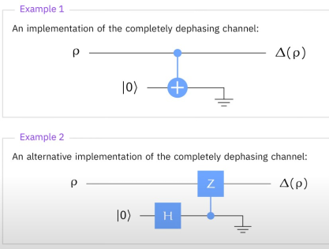

# 導言:
量子計算是最終的計算形式，熟悉量子計算的各種概念與演算法，在未來，可用來模擬宇宙的運行，生命的繁衍，全社會的複雜系統運作，也能做出更為自然與高效率的人工智慧。在量子計算準備大行其道的八年前 (西元2024年)，我將帶著大家，按部就班地掌握量子計算，正如同10年前提早準備人工智慧一樣，善用原子習慣 + 超前學習，通往成功就是輕鬆且愉快的事情。

<p align="center"><iframe width="100%" height="315" src="https://www.youtube.com/embed/cMl-xIDSmXI?si=w6suMJfFVuTZx_L-" frameborder="0" allow="accelerometer; autoplay; clipboard-write; encrypted-media; gyroscope; picture-in-picture" allowfullscreen></iframe></p>

# Channel定義
- 用來描述量子訊息系統，離散時間的變化，可以用來探討，包含 Unitary operation 引發的變化，或是想要避免的因素，如Noise，對系統的產生的變化
- 用 $$ \Phi(\rho) $$ 來表達一個Channel $$ \Phi $$ 作用在一個density matrix state $$ \rho $$
- Channels 皆為線性，轉換 desity matrix 到另一個 desity matrix
- Channels 可以局部作用在一個Compound system
- $$ \Phi $$ 轉換 input system X 成為 output system Y
- Z 是一個量子訊息系統，$$ \Gamma $$ 是 Z 的 Classical State 集合，(Z, X)為一個量子狀態，可以用Density matrix $$ \rho $$ 加以表達
$$
\rho = \sum_{a,b \in \Gamma}{\ket{a}\bra{b} \otimes \rho_{a,b}}
$$
- 施加 Channel $$ \Phi $$ 於 X，可以得 Y，可以得到 (Z, Y)
$$
\Psi{(\rho)} = \sum_{a,b \in \Gamma}{\ket{a}\bra{b} \otimes \Phi{(\rho_{a,b})}}
$$
- Density matrix X 經由 $$ \Phi $$ 轉換成 Density matrix Y，可以寫成一般式:
<p align="center"></p>

## Unitary Channels
- Unitary Channel 可以寫成以下等式，用U來代表Unitary matrix
$$
\Phi{(\rho)} = U \rho U^{\dagger}
$$
- 其實不難推導，假設 $$ \ket{\psi}\bra{\psi} $$ 是一個Density matrix用來表示 quantum state vector $$ \psi $$，現在有一個Unitary matrix U 作用在 $$ \ket{\psi} $$ 上面，則Density matrix可以寫成以下形式:
$$
(U\ket{\psi})(U\ket{\psi})^{\dagger} = U\ket{\psi}\bra{\psi}U^{\dagger}
$$
- 量子 Channel 必然是一個 Unitary channel，channel 作用在 Density matrix上，仍然維持半正定的特性，必然存在一個 Unitary matrix 得以表達 $$ \Phi $$ 作用在X上，(Z, X) 可由 Density matrix $$ \rho $$ 來進行表達
$$
(\mathbb{1}_Z \otimes U)\rho(\mathbb{1}_Z \otimes U)^{\dagger}
$$
- 如果Channel為Identity，等同把 $$ \mathbb{1} $$ 代入上式 U，可以寫成:
$$
Id{(\rho)} = \rho
$$

## Convex Combinations
- $$ \Phi_{0} $$ $$ \Phi_{1} $$ 都是 X -> Y 的 Channels，且機率 $$ p \in \left[ 0,1 \right] $$，這種線性組合稱為Convex Combination，可以寫成以下:
$$
\Psi = p\Phi_{0} + (1-p)\Phi_{1}
$$
- 這個新的Channel仍然維持半正定的特性，Trace維持為1
- 可以寫成如下更為General Convex Combination 的公式，假設 $$ \Phi_{0}...\Phi_{m-1} $$ 是Channels，然後 $$ p_{0}...p_{m-1} $$ 代表一組相對應的機率向量:
$$
\Psi = \sum_{k=0}^{m-1}{p_{k}\Phi_{k}}
$$
- 當然這個Channel Convex組合可以作用在Density matrix 上，組成一個Mixed Unitary Channel，如下所示:
$$
\Psi{(\rho)} = \sum_{k=0}^{m-1}{U_{k}p_{k}U_{k}^{\dagger}}
$$

# Channel表達方式
- 首先定義一些重要的 Channel，如 Qubit Reset，Complete dephasing & Complete depolarizing，然後使用 Stinespring representations 對三個Channel 進行描述，並證明之
- 隨後定義Kraus representation 與 Choi representation，最後驗證三種表達方式實則三位一體，可以互通

## Qubit Reset Channel
- 其實就是把Single qubit reset 成 $$ \ket{0} $$，用Density matrix的寫法
$$
\Lambda(\rho) = Tr(\rho) \ket{0}\bra{0}
$$
- 假設 A & B 為 qubits，(A, B) 為 $$ \ket{\phi^{+}} $$，Qubit Reset Channel $$ \Lambda $$ 被施加在A上面，首先我們必須將 $$ \ket{\phi^{+}} $$ 寫成 Density matrix 表達
$$
\ket{\phi^{+}} = \frac{1}{\sqrt{2}} \ket{0} \otimes \ket{0} + \frac{1}{\sqrt{2}} \ket{1} \otimes \ket{1}
$$
$$
\bra{\phi^{+}} = \frac{1}{\sqrt{2}} \bra{0} \otimes \bra{0} + \frac{1}{\sqrt{2}} \bra{1} \otimes \bra{1}
$$
$$
\ket{\phi^{+}}\bra{\phi^{+}} = 
$$
$$
\frac{1}{2} \ket{0}\bra{0} \otimes \ket{0}\bra{0} + 
$$
$$
\frac{1}{2} \ket{0}\bra{1} \otimes \ket{0}\bra{1} +
$$
$$
\frac{1}{2} \ket{1}\bra{0} \otimes \ket{1}\bra{0} +
$$
$$
\frac{1}{2} \ket{1}\bra{1} \otimes \ket{1}\bra{1}
$$

- 只有對角線的會留下來，Trace必定為1 (機率總和=1)，進一步整理，可以得到 $$ \ket{0}\bra{0} \otimes \frac{\mathbb{1}}{2} $$，由於Qubit A 被 Reset成 0 了，Qubit B 就可以經過整理變成，Complete mixed state $$ \frac{\mathbb{1}}{2} $$
$$
\frac{1}{2} \Lambda{(\ket{0}\bra{0})} \otimes \ket{0}\bra{0} + 
$$
$$
\frac{1}{2} \Lambda{(\ket{0}\bra{1})} \otimes \ket{0}\bra{1} + 
$$
$$
\frac{1}{2} \Lambda{(\ket{1}\bra{0})} \otimes \ket{1}\bra{0} + 
$$
$$
\frac{1}{2} \Lambda{(\ket{1}\bra{1})} \otimes \ket{1}\bra{1} = 
$$
$$
\frac{1}{2} \ket{0}\bra{0} \otimes \ket{0}\bra{0} + \frac{1}{2} \ket{0}\bra{0} \otimes \ket{1}\bra{1} = 
$$
$$
\ket{0}\bra{0} \otimes \frac{\mathbb{1}}{2}
$$

## Complete Dephasing Channel
- 完全去除相位的Channel，其實就是只留下Trace(對角線)的部分，其餘都會變成0
$$
  \Delta
  \begin{pmatrix}
  \alpha_{00} & \alpha_{01} \\
  \alpha_{10} & \alpha_{11}
  \end{pmatrix}
  =
  \begin{pmatrix}
  \alpha_{00} & 0 \\
  0 & \alpha_{11}
  \end{pmatrix}
$$
$$
\Delta{(\ket{0}\bra{0})} = \ket{0}\bra{0}
$$
$$
\Delta{(\ket{0}\bra{1})} = 0
$$
$$
\Delta{(\ket{1}\bra{0})} = 0
$$
$$
\Delta{(\ket{1}\bra{1})} = \ket{1}\bra{1}
$$

- 假設 A & B 為 qubits，(A, B) 為 $$ \ket{\phi^{+}} $$，將 $$ \Delta $$ Channel 施加在 A 上
$$
\frac{1}{2} \Delta{(\ket{0}\bra{0})} \otimes \ket{0}\bra{0} + 
$$
$$
\frac{1}{2} \Delta{(\ket{0}\bra{1})} \otimes \ket{0}\bra{1} + 
$$
$$
\frac{1}{2} \Delta{(\ket{1}\bra{0})} \otimes \ket{1}\bra{0} + 
$$
$$
\frac{1}{2} \Delta{(\ket{1}\bra{1})} \otimes \ket{1}\bra{1} = 
$$
$$
\frac{1}{2} \ket{0}\bra{0} \otimes \ket{0}\bra{0} + \frac{1}{2} \ket{1}\bra{1} \otimes \ket{1}\bra{1}
$$
- 如果不要完全去除相位，要保留一些輸入的相位，可以看成是 $$ \Delta $$ 和 Id 的 Convex Combination
$$
\Delta_{\epsilon} = (1 - \epsilon)Id + \epsilon \Delta
$$

## Complete Depolarizing Channel
- 完全去除極性的Channel，代表的就是完全隨機的雜訊，也是宇宙本源所在
$$
\Omega{(\rho)} = Tr(\rho) \frac{\mathbb{1}}{2}
$$
- 如果不要完全去除極性，要保留一些輸入的訊息，可以看成是 $$ \Omega $$ 和 Id 的 Convex Combination
$$
\Omega_{\epsilon} = (1 - \epsilon)Id + \epsilon \Omega
$$
$$
\Omega_{\epsilon}{(\rho)} = (1 - \epsilon)\rho + \frac{\epsilon}{2} \mathbb{1}
$$

# Channel表達等效
- To be continued ...


# 先驗知識:
[台大線性代數課程](https://ocw.aca.ntu.edu.tw/ntu-ocw/ocw/cou/102S207)

[複數課程第一課](https://ocw.nthu.edu.tw/ocw/index.php?page=chapter&cid=289&chid=6153)

# 引用:
```markdown
@article{

  author       = {Jeng-Ting, Chen},

  title        = {迎戰未來，AI 量子計算基礎篇 (10)，Exploring Quantum Channels},  

  year         = {2024},

  url          = {https://infinite-wisdom.vercel.app/blog/post-240723},  

  timestamp    = {Tue, 29 Aug 2024 09:10:00 +0800},
}
```